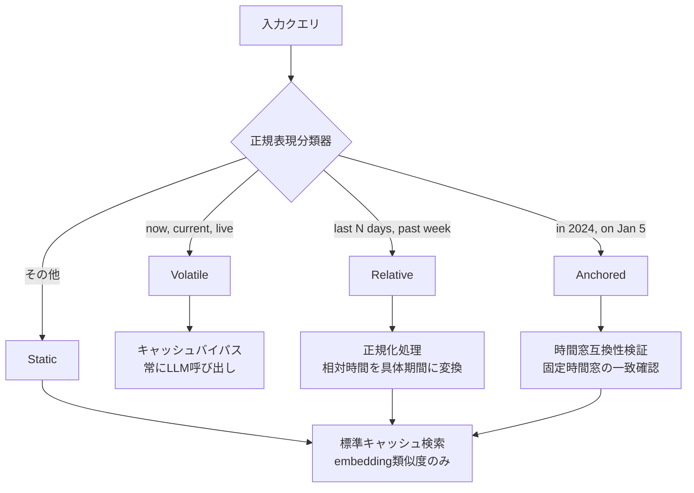
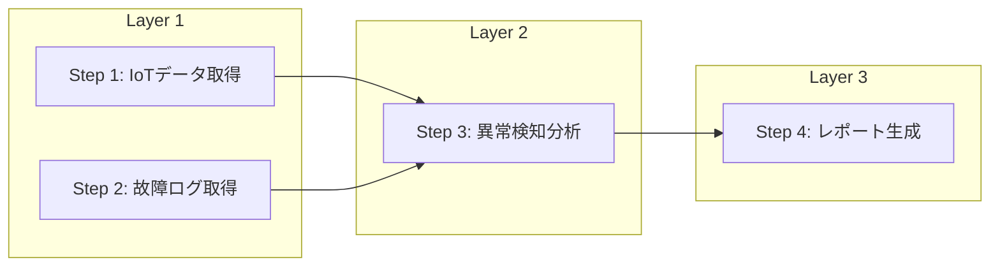

本記事は [Evaluating Temporal Semantic Caching and Workflow Optimization in Agentic Plan-Execute Pipelines](https://arxiv.org/abs/2605.20630) の解説記事です。

この記事は [Zenn記事: MCP×セマンティックキャッシュでエージェントのレイテンシを40%削減する](https://zenn.dev/0h_n0/articles/15a8b787c36706) の深掘りです。

## 論文概要（Abstract）

LLMベースのPlan-Executeエージェントパイプラインにおいて、ツール発見・実行のレイテンシとLLM呼び出しコストが産業用途での採用障壁となっている。本論文では、2つの最適化レイヤーを提案している。第1に、クエリの時間的性質を4バケット（Volatile/Static/Relative/Anchored）に事前分類し、時間依存性に応じたキャッシュ戦略を適用するTemporal Semantic Cacheである。第2に、MCPサーバーのツール発見にディスクバックドキャッシュを導入し、ステップ間の依存関係グラフに基づく並列実行を行うMCP Workflow Optimizationである。著者らは、産業用ベンチマークAssetOpsBench（152クエリ）上で、End-to-Endの中央値レイテンシを34.10秒から9.80秒へ3.48倍高速化し、MCP Workflow全体で1.67倍の高速化を達成したと報告している。

## 情報源

- **arXiv ID**: 2605.20630
- **URL**: [https://arxiv.org/abs/2605.20630](https://arxiv.org/abs/2605.20630)
- **著者**: Alimurtaza Mustafa Merchant, Krish Veera, Sajal Kumar Goyla et al.
- **発表年**: 2026
- **分野**: cs.AI（人工知能）

## 背景と動機（Background & Motivation）

LLMを用いたPlan-Executeパイプラインは、ユーザークエリを複数のサブタスクに分解し、MCPサーバーを介して外部ツールを呼び出すことで複雑なタスクを処理する。しかし産業環境では、MCPサーバーの起動・ツール発見に数秒、LLMによるプランニングに10秒前後、ツール実行に30秒以上かかるケースがあり、単一クエリで1分近いレイテンシが生じることが課題である。

標準的なセマンティックキャッシュは、embedding類似度に基づいて過去の応答を再利用するが、時間依存クエリを適切に扱えない。「今日の気温は？」のようなVolatileクエリをキャッシュすると陳腐化した応答を返す一方、「過去30日間のトレンド」のようなRelativeクエリは時刻によって対象期間が変化するため、embedding空間での単純な類似度比較では正しいキャッシュ判定ができない。また、MCPサーバーのツール発見は毎回Pythonソースの解析を伴い、プラン内のステップは逐次実行されるため、並列化可能なステップが無駄に直列化されている。

## 主要な貢献（Key Contributions）

- **Temporal Semantic Cache**: クエリを4バケット（Volatile/Static/Relative/Anchored）に正規表現で事前分類し、バケットごとに異なるキャッシュバイパス・時間窓互換性検証を適用する時間対応セマンティックキャッシュ
- **MCP Workflow Optimization**: MCPサーバーパスのMD5ハッシュとソースファイルのmtimeに基づくディスクバックドtool discoveryキャッシュと、プランステップのDAG変換による依存関係ベースの並列実行
- **AssetOpsBench (AOB)**: IoTテレメトリ、故障モード、時系列モデル、作業指示、マルチエージェントの5カテゴリ152クエリからなる産業用ベンチマーク
- **制約の定量化**: パラメータ衝突による偽陽性、0.6Bリランカーの判定不整合など、キャッシュ判定F1の上限要因を実験的に特定

## 技術的詳細（Technical Details）

### Temporal分類アーキテクチャ

Temporal Semantic Cacheの中核は、クエリを4つのバケットに分類する前段の正規表現分類器である。



各バケットの処理ロジックは以下の通りである。

**Volatile**: `now`、`current`、`live`等のキーワードを含むクエリはリアルタイムデータに依存するため、キャッシュをバイパスして常にLLMパイプラインを実行する。

**Static**: 時間パラメータを含まないクエリは標準的なembedding類似度検索でキャッシュヒットを判定する。

**Relative**: `last 7 days`、`past month`等の相対時間表現を含むクエリに対し、相対表現を具体的な日付範囲に正規化してからキャッシュ検索を行う。正規化により、異なる時点で発行された同一の相対クエリが異なるキャッシュエントリとして扱われる。

**Anchored**: `in Q1 2025`、`on January 5th`等の固定時間窓を含むクエリに対し、キャッシュエントリの時間窓との互換性を検証する。時間窓が一致する場合のみキャッシュヒットとする。

### キャッシュ検索パイプライン

キャッシュ検索は2段階で構成される。

**Stage 1: Embedding-based ANN検索**

クエリをQwen3-Embedding-0.6B（1024次元）でembeddingし、FAISSインデックスに対してApproximate Nearest Neighbor (ANN)検索を実行する。

$$
\mathbf{e}_q = \text{Embed}(q), \quad \mathcal{N}_k = \text{ANN}(\mathbf{e}_q, \mathcal{I}, k)
$$

ここで、
- $\mathbf{e}_q$: クエリ$q$のembeddingベクトル（1024次元）
- $\mathcal{I}$: FAISSインデックス
- $k = 5$: 検索候補数
- $\mathcal{N}_k$: 類似度上位$k$件の候補集合

類似度閾値$\tau_{\text{sim}} = 0.75$で候補をフィルタリングする。

**Stage 2: Rerankerベースの判定**

Stage 1の候補に対し、Qwen3-Reranker-0.6Bで精密なスコアリングを行い、閾値$\tau_{\text{judge}} = 0.92$で最終的なキャッシュヒット判定を行う。

$$
s_{\text{rerank}} = \text{Reranker}(q, q_{\text{cached}}), \quad \text{hit} = \begin{cases} \text{True} & \text{if } s_{\text{rerank}} \geq \tau_{\text{judge}} \\ \text{False} & \text{otherwise} \end{cases}
$$

ここで、
- $s_{\text{rerank}}$: リランカーによる意味的類似度スコア
- $q_{\text{cached}}$: キャッシュ済みクエリ
- $\tau_{\text{judge}} = 0.92$: 判定閾値

キャッシュ容量は50エントリで、LCFU（Least Combined Frequency and Use）方式で退避する。

### MCP Workflow Optimization

MCP Workflow Optimizationは2つの独立した最適化から構成される。

**Discovery Cache**: MCPサーバーのツール一覧取得を高速化するディスクバックドキャッシュである。キャッシュキーは以下の3要素から計算する。

$$
k_{\text{cache}} = \text{MD5}(\text{server\_path}) \oplus \text{mtime}(\text{source.py}) \oplus \text{mtime}(\text{pyproject.toml})
$$

ここで、
- $\text{server\_path}$: MCPサーバーの絶対パス
- $\text{mtime}(\cdot)$: ファイルの最終更新時刻
- $\oplus$: キー結合演算

TTLは24時間で、ソースファイルまたは`pyproject.toml`の変更時にキャッシュが無効化される。これにより、ツール発見の所要時間が2.096秒から0.007秒へ296倍高速化される（論文Table 2より）。

**DAG並列実行**: LLMが生成したプランの各ステップを依存関係グラフ（DAG）に変換し、トポロジカルソートで並列実行可能なレイヤーに分割する。



レイヤー内のステップは`asyncio.gather`で並列実行し、レイヤー間は直列に処理する。これにより、ベースラインの逐次実行（34.639秒）に対してExecution phaseが17.415秒へ1.99倍高速化される（論文Table 2より）。

```python
import asyncio
from dataclasses import dataclass, field


@dataclass
class PlanStep:
    """プランの1ステップを表現する

    Attributes:
        step_id: ステップ識別子
        tool_name: 呼び出すMCPツール名
        params: ツールパラメータ
        depends_on: 依存する先行ステップのID集合
    """
    step_id: str
    tool_name: str
    params: dict[str, str]
    depends_on: set[str] = field(default_factory=set)


def build_execution_layers(steps: list[PlanStep]) -> list[list[PlanStep]]:
    """プランステップをDAGのトポロジカルレイヤーに分割する

    Args:
        steps: プランステップのリスト

    Returns:
        レイヤーごとにグループ化されたステップのリスト
        各レイヤー内のステップは並列実行可能
    """
    remaining = {s.step_id: s for s in steps}
    completed: set[str] = set()
    layers: list[list[PlanStep]] = []

    while remaining:
        # 依存がすべて完了しているステップを現在レイヤーに追加
        current_layer = [
            s for s in remaining.values()
            if s.depends_on.issubset(completed)
        ]
        if not current_layer:
            raise ValueError("Circular dependency detected in plan steps")

        layers.append(current_layer)
        for s in current_layer:
            completed.add(s.step_id)
            del remaining[s.step_id]

    return layers


async def execute_plan_parallel(
    steps: list[PlanStep],
    tool_runner: "MCPToolRunner",
) -> list[dict]:
    """DAGベースの並列プラン実行

    Args:
        steps: プランステップのリスト
        tool_runner: MCPツール実行インターフェース

    Returns:
        各ステップの実行結果リスト
    """
    layers = build_execution_layers(steps)
    all_results: list[dict] = []

    for layer in layers:
        # レイヤー内は並列実行
        tasks = [
            tool_runner.execute(step.tool_name, step.params)
            for step in layer
        ]
        layer_results = await asyncio.gather(*tasks)
        all_results.extend(layer_results)

    return all_results
```

## 実装のポイント（Implementation）

### 正規表現分類器の設計

Temporal分類器は正規表現パターンマッチングで実装されている。パターン設計上の注意点として、著者らは「June 2020」等の自然言語日付表現には対応できず、これらのクエリはStatic扱いになると報告している。産業用途では、クエリテンプレートが限定されるため正規表現で十分対応可能だが、汎用チャットボットではLLMベースの分類器への置き換えが必要になる。

```python
import re
from enum import Enum


class TemporalBucket(Enum):
    """クエリの時間的分類バケット"""
    VOLATILE = "volatile"
    STATIC = "static"
    RELATIVE = "relative"
    ANCHORED = "anchored"


# 論文に基づく分類パターン
VOLATILE_PATTERNS = re.compile(
    r"\b(now|current|live|real-?time|latest)\b", re.IGNORECASE
)
RELATIVE_PATTERNS = re.compile(
    r"\b(last|past|recent|previous)\s+\d+\s+(days?|hours?|weeks?|months?)\b",
    re.IGNORECASE,
)
ANCHORED_PATTERNS = re.compile(
    r"\b(in\s+(Q[1-4]\s+)?\d{4}|on\s+\w+\s+\d{1,2}|between\s+\d{4})\b",
    re.IGNORECASE,
)


def classify_temporal(query: str) -> TemporalBucket:
    """クエリを時間バケットに分類する

    Args:
        query: 入力クエリ文字列

    Returns:
        分類されたTemporalBucket
    """
    if VOLATILE_PATTERNS.search(query):
        return TemporalBucket.VOLATILE
    if RELATIVE_PATTERNS.search(query):
        return TemporalBucket.RELATIVE
    if ANCHORED_PATTERNS.search(query):
        return TemporalBucket.ANCHORED
    return TemporalBucket.STATIC
```

### Discovery Cacheの無効化戦略

Discovery Cacheのキーにソースファイルのmtimeを含めることで、MCPサーバーのコード変更時にキャッシュが自動無効化される。TTLは24時間に設定されているが、ソース変更がなくても依存ライブラリの更新でツール一覧が変わる可能性があるため、`pyproject.toml`のmtimeも監視対象に含めている。本番環境では、CI/CDパイプラインでのデプロイ時にキャッシュを明示的にクリアする運用が推奨される。

### MCPServerPoolの実装

論文では、複数のMCPサーバーを統一的に管理するMCPServerPoolパターンが採用されている。各サーバーの接続プールを維持し、ツール発見キャッシュと組み合わせることで、初回起動以降のツール解決を定数時間で完了させている。

## Production Deployment Guide

本論文のPlan-Executeパイプラインは、MCPサーバー連携・セマンティックキャッシュ・DAG並列実行という3つのコンポーネントから構成される。以下では、これらをAWS上にデプロイする際の構成パターンを示す。

**コスト試算の注意事項**: 以下のコスト試算は2026年9月時点のAWS ap-northeast-1（東京）リージョン料金に基づく概算値である。実際のコストはトラフィックパターン、リージョン、バースト使用量により変動する。最新料金は[AWS料金計算ツール](https://calculator.aws/)で確認を推奨する。

### AWS実装パターン（コスト最適化重視）

| 構成 | トラフィック | コンピュート | キャッシュ | LLM推論 | 月額概算 |
|------|------------|------------|----------|---------|---------|
| Small | ~100 req/日 | Lambda | ElastiCache Redis (cache.t4g.micro) | Bedrock (Llama-3.3-70B) | $50-150 |
| Medium | ~1,000 req/日 | ECS Fargate (0.5vCPU, 1GB) | ElastiCache Redis (cache.r7g.large) | Bedrock + Batch API | $300-800 |
| Large | 10,000+ req/日 | EKS + Karpenter (Spot) | Redis Cluster (3シャード) | Bedrock Batch + Prompt Caching | $2,000-5,000 |

**Small構成の内訳**:
- Lambda: 100 req/日 x 30日 x 256MB x 平均10秒 = 月約$2-5
- ElastiCache Redis cache.t4g.micro: 月約$12
- Bedrock Llama-3.3-70B: 100 req/日 x 30日 x 平均2,000トークン = 月約$20-80
- FAISS: Lambda内蔵（追加コストなし、50エントリなら十分）
- CloudWatch: 月約$5-10

**Medium構成の内訳**:
- ECS Fargate: 0.5vCPU x 1GB x 常時稼働 = 月約$25-35
- ElastiCache cache.r7g.large: 月約$120
- Bedrock: Batch API利用で50%削減、月約$100-400
- NAT Gateway: 月約$35
- Application Load Balancer: 月約$20

**Large構成の内訳**:
- EKS Control Plane: 月約$73
- Karpenter Spot Instances (r6g.xlarge x 2-4台): 月約$200-600
- Redis Cluster (3シャード, cache.r7g.xlarge): 月約$800
- Bedrock Batch + Prompt Caching: 月約$500-2,000
- NAT Gateway + ALB: 月約$90

**コスト削減テクニック**:
- Spot Instancesをワーカーノードに活用し、On-Demand比で最大90%削減
- ElastiCache Reserved Nodesで1年コミット時に最大40%削減
- Bedrock Batch APIで非リアルタイム処理のコストを50%削減
- Bedrock Prompt Cachingで同一プレフィックスの繰り返し呼び出しを30-90%削減

### Terraformインフラコード

**Small構成（Serverless）**:

```hcl
# Temporal Semantic Cache Pipeline - Small構成
# Lambda + ElastiCache Redis + Bedrock

terraform {
  required_version = ">= 1.9"
  required_providers {
    aws = { source = "hashicorp/aws", version = "~> 5.70" }
  }
}

provider "aws" {
  region = "ap-northeast-1"
}

# --- VPC基盤（NAT Gateway不使用でコスト削減） ---
resource "aws_vpc" "main" {
  cidr_block           = "10.0.0.0/16"
  enable_dns_hostnames = true
  tags                 = { Project = "temporal-cache-pipeline" }
}

resource "aws_subnet" "private" {
  count             = 2
  vpc_id            = aws_vpc.main.id
  cidr_block        = "10.0.${count.index + 1}.0/24"
  availability_zone = data.aws_availability_zones.available.names[count.index]
  tags              = { Project = "temporal-cache-pipeline" }
}

data "aws_availability_zones" "available" {
  state = "available"
}

# --- ElastiCache Redis（セマンティックキャッシュ） ---
resource "aws_elasticache_subnet_group" "cache" {
  name       = "temporal-cache-subnet"
  subnet_ids = aws_subnet.private[*].id
}

resource "aws_elasticache_replication_group" "cache" {
  replication_group_id = "temporal-semantic-cache"
  description          = "Temporal Semantic Cache for Plan-Execute pipeline"
  node_type            = "cache.t4g.micro"
  num_cache_clusters   = 1
  engine_version       = "7.1"
  port                 = 6379
  subnet_group_name    = aws_elasticache_subnet_group.cache.name
  security_group_ids   = [aws_security_group.cache.id]
  at_rest_encryption_enabled = true
  transit_encryption_enabled = true
  tags = { Project = "temporal-cache-pipeline" }
}

resource "aws_security_group" "cache" {
  name_prefix = "temporal-cache-"
  vpc_id      = aws_vpc.main.id
  ingress {
    from_port       = 6379
    to_port         = 6379
    protocol        = "tcp"
    security_groups = [aws_security_group.lambda.id]
  }
}

# --- IAMロール（最小権限） ---
resource "aws_iam_role" "lambda_exec" {
  name = "temporal-cache-lambda"
  assume_role_policy = jsonencode({
    Version = "2012-10-17"
    Statement = [{
      Action = "sts:AssumeRole"
      Effect = "Allow"
      Principal = { Service = "lambda.amazonaws.com" }
    }]
  })
}

resource "aws_iam_role_policy" "lambda_bedrock" {
  name = "bedrock-invoke"
  role = aws_iam_role.lambda_exec.id
  policy = jsonencode({
    Version = "2012-10-17"
    Statement = [
      {
        Effect   = "Allow"
        Action   = ["bedrock:InvokeModel"]
        Resource = "arn:aws:bedrock:ap-northeast-1::foundation-model/meta.llama3-3-70b-instruct-v1:0"
      },
      {
        Effect   = "Allow"
        Action   = ["logs:CreateLogGroup", "logs:CreateLogStream", "logs:PutLogEvents"]
        Resource = "arn:aws:logs:*:*:*"
      },
      {
        Effect   = "Allow"
        Action   = ["ec2:CreateNetworkInterface", "ec2:DescribeNetworkInterfaces", "ec2:DeleteNetworkInterface"]
        Resource = "*"
      }
    ]
  })
}

# --- Lambda関数（Plan-Execute Pipeline） ---
resource "aws_security_group" "lambda" {
  name_prefix = "temporal-lambda-"
  vpc_id      = aws_vpc.main.id
  egress {
    from_port   = 0
    to_port     = 0
    protocol    = "-1"
    cidr_blocks = ["0.0.0.0/0"]
  }
}

resource "aws_lambda_function" "pipeline" {
  function_name = "temporal-cache-pipeline"
  role          = aws_iam_role.lambda_exec.arn
  handler       = "handler.main"
  runtime       = "python3.12"
  timeout       = 60  # Plan-Execute全体で最大60秒
  memory_size   = 256
  filename      = "lambda.zip"

  environment {
    variables = {
      REDIS_HOST       = aws_elasticache_replication_group.cache.primary_endpoint_address
      REDIS_PORT       = "6379"
      CACHE_CAPACITY   = "50"
      TAU_SIM          = "0.75"
      TAU_JUDGE        = "0.92"
      FAISS_TOP_K      = "5"
      CACHE_TTL        = "86400"  # 24時間
    }
  }

  vpc_config {
    subnet_ids         = aws_subnet.private[*].id
    security_group_ids = [aws_security_group.lambda.id]
  }

  tags = { Project = "temporal-cache-pipeline" }
}

# --- CloudWatchアラーム（コスト監視） ---
resource "aws_cloudwatch_metric_alarm" "lambda_duration" {
  alarm_name          = "temporal-pipeline-p95-latency"
  comparison_operator = "GreaterThanThreshold"
  evaluation_periods  = 3
  metric_name         = "Duration"
  namespace           = "AWS/Lambda"
  period              = 300
  statistic           = "p95"
  threshold           = 30000  # 30秒（最適化後の中央値9.8秒の約3倍）
  alarm_description   = "Pipeline P95 latency exceeds 30s"
  dimensions = {
    FunctionName = aws_lambda_function.pipeline.function_name
  }
}
```

**Large構成（Container）**:

```hcl
# Temporal Semantic Cache Pipeline - Large構成
# EKS + Karpenter + Redis Cluster + Bedrock Batch

module "eks" {
  source  = "terraform-aws-modules/eks/aws"
  version = "~> 20.24"

  cluster_name    = "temporal-cache-prod"
  cluster_version = "1.31"

  vpc_id     = aws_vpc.main.id
  subnet_ids = aws_subnet.private[*].id

  cluster_endpoint_public_access = false

  eks_managed_node_groups = {
    system = {
      instance_types = ["m7g.medium"]
      min_size       = 2
      max_size       = 3
      desired_size   = 2
      labels         = { role = "system" }
    }
  }

  tags = { Project = "temporal-cache-pipeline", Environment = "prod" }
}

# --- Karpenter Provisioner（Spot優先） ---
resource "kubectl_manifest" "karpenter_nodepool" {
  yaml_body = yamlencode({
    apiVersion = "karpenter.sh/v1"
    kind       = "NodePool"
    metadata   = { name = "temporal-pipeline-workers" }
    spec = {
      template = {
        spec = {
          requirements = [
            { key = "karpenter.sh/capacity-type", operator = "In", values = ["spot", "on-demand"] },
            { key = "node.kubernetes.io/instance-type", operator = "In",
              values = ["r6g.xlarge", "r6g.2xlarge", "r7g.xlarge", "r7g.2xlarge"] },
          ]
          nodeClassRef = { name = "default" }
        }
      }
      limits = { cpu = "96", memory = "384Gi" }
      disruption = {
        consolidationPolicy = "WhenEmptyOrUnderutilized"
        consolidateAfter    = "30s"
      }
    }
  })
}

# --- Redis Cluster（3シャード、高可用性） ---
resource "aws_elasticache_replication_group" "cache_cluster" {
  replication_group_id = "temporal-cache-cluster"
  description          = "Redis Cluster for Temporal Semantic Cache"
  node_type            = "cache.r7g.xlarge"
  num_node_groups      = 3
  replicas_per_node_group = 1
  automatic_failover_enabled = true
  engine_version       = "7.1"
  port                 = 6379
  subnet_group_name    = aws_elasticache_subnet_group.cache.name
  security_group_ids   = [aws_security_group.cache.id]
  at_rest_encryption_enabled = true
  transit_encryption_enabled = true
  tags = { Project = "temporal-cache-pipeline", Environment = "prod" }
}

# --- Secrets Manager（パイプライン設定） ---
resource "aws_secretsmanager_secret" "pipeline_config" {
  name                    = "temporal-cache/pipeline-config"
  kms_key_id              = aws_kms_key.main.arn
  recovery_window_in_days = 7
}

# --- AWS Budgets（予算アラート） ---
resource "aws_budgets_budget" "monthly" {
  name         = "temporal-cache-monthly"
  budget_type  = "COST"
  limit_amount = "5000"
  limit_unit   = "USD"
  time_unit    = "MONTHLY"

  notification {
    comparison_operator        = "GREATER_THAN"
    threshold                  = 80
    threshold_type             = "PERCENTAGE"
    notification_type          = "ACTUAL"
    subscriber_email_addresses = ["ops-team@example.com"]
  }

  notification {
    comparison_operator        = "GREATER_THAN"
    threshold                  = 100
    threshold_type             = "PERCENTAGE"
    notification_type          = "FORECASTED"
    subscriber_email_addresses = ["ops-team@example.com"]
  }
}
```

### 運用・監視設定

**CloudWatch Logs Insightsクエリ**（キャッシュヒット率・レイテンシ分析）:

```
# 1時間あたりのキャッシュヒット率と平均レイテンシ
fields @timestamp, @message
| filter @message like /cache_decision/
| stats count(*) as total,
        sum(case when cache_hit = 1 then 1 else 0 end) as hits,
        sum(case when cache_hit = 1 then 1 else 0 end) * 100.0 / count(*) as hit_rate_pct,
        pct(@duration, 95) as p95_ms,
        avg(@duration) as avg_ms
  by bin(1h) as hour
| sort hour desc

# Temporal分類バケット別のクエリ分布
fields @timestamp, temporal_bucket, cache_hit
| filter event = "query_classified"
| stats count(*) as query_count,
        sum(case when cache_hit = 1 then 1 else 0 end) as cache_hits
  by temporal_bucket
```

**CloudWatchアラーム設定**:

```python
import boto3

cloudwatch = boto3.client("cloudwatch", region_name="ap-northeast-1")


def create_cache_hit_rate_alarm(threshold_pct: float = 30.0) -> None:
    """キャッシュヒット率低下アラームを作成する

    Args:
        threshold_pct: ヒット率閾値（%）。これを下回るとアラーム発報
    """
    cloudwatch.put_metric_alarm(
        AlarmName="temporal-cache-hit-rate-low",
        MetricName="CacheHitRate",
        Namespace="TemporalCache/Pipeline",
        Statistic="Average",
        Period=3600,
        EvaluationPeriods=3,
        Threshold=threshold_pct,
        ComparisonOperator="LessThanThreshold",
        AlarmDescription=f"Cache hit rate below {threshold_pct}% for 3 consecutive hours",
        AlarmActions=["arn:aws:sns:ap-northeast-1:ACCOUNT_ID:ops-alerts"],
    )


def create_pipeline_latency_alarm(threshold_ms: float = 30000) -> None:
    """パイプラインP95レイテンシアラームを作成する

    Args:
        threshold_ms: P95レイテンシ閾値（ミリ秒）
    """
    cloudwatch.put_metric_alarm(
        AlarmName="temporal-pipeline-p95-latency",
        MetricName="Duration",
        Namespace="AWS/Lambda",
        ExtendedStatistic="p95",
        Period=300,
        EvaluationPeriods=3,
        Threshold=threshold_ms,
        ComparisonOperator="GreaterThanThreshold",
        AlarmDescription=f"Pipeline P95 latency exceeds {threshold_ms}ms",
        Dimensions=[{"Name": "FunctionName", "Value": "temporal-cache-pipeline"}],
        AlarmActions=["arn:aws:sns:ap-northeast-1:ACCOUNT_ID:ops-alerts"],
    )
```

**X-Rayトレーシング設定**:

```python
from aws_xray_sdk.core import xray_recorder, patch_all

# boto3, requests等を自動計装
patch_all()


@xray_recorder.capture("cache_lookup")
def cache_lookup(query: str, temporal_bucket: str) -> dict | None:
    """キャッシュ検索をX-Rayでトレースする

    Args:
        query: 入力クエリ
        temporal_bucket: Temporal分類結果

    Returns:
        キャッシュヒット時は応答dict、ミス時はNone
    """
    subsegment = xray_recorder.current_subsegment()
    subsegment.put_annotation("temporal_bucket", temporal_bucket)
    subsegment.put_metadata("query_length", len(query))

    # キャッシュ検索ロジック
    result = _search_cache(query, temporal_bucket)

    subsegment.put_annotation("cache_hit", result is not None)
    return result
```

**Cost Explorer自動レポート**:

```python
import boto3
from datetime import datetime, timedelta


def get_daily_cost_report() -> dict:
    """日次コストレポートを取得する

    Returns:
        サービス別コスト内訳
    """
    ce = boto3.client("ce", region_name="us-east-1")
    end = datetime.utcnow().strftime("%Y-%m-%d")
    start = (datetime.utcnow() - timedelta(days=1)).strftime("%Y-%m-%d")

    response = ce.get_cost_and_usage(
        TimePeriod={"Start": start, "End": end},
        Granularity="DAILY",
        Metrics=["UnblendedCost"],
        Filter={
            "Tags": {"Key": "Project", "Values": ["temporal-cache-pipeline"]}
        },
        GroupBy=[{"Type": "DIMENSION", "Key": "SERVICE"}],
    )

    costs = {}
    for group in response["ResultsByTime"][0]["Groups"]:
        service = group["Keys"][0]
        amount = float(group["Metrics"]["UnblendedCost"]["Amount"])
        if amount > 0:
            costs[service] = amount

    total = sum(costs.values())
    if total > 100:
        # $100/日超過でSNS通知
        sns = boto3.client("sns", region_name="ap-northeast-1")
        sns.publish(
            TopicArn="arn:aws:sns:ap-northeast-1:ACCOUNT_ID:cost-alerts",
            Subject=f"Cost Alert: ${total:.2f}/day",
            Message=f"Daily cost exceeded $100: ${total:.2f}\n{costs}",
        )

    return costs
```

### コスト最適化チェックリスト

**アーキテクチャ選択**:
- [ ] トラフィック量に応じた構成選択（~100 req/日: Serverless、~1,000 req/日: Hybrid、10,000+ req/日: Container）
- [ ] キャッシュヒット率の目標値を設定（論文報告値45%を基準、段階的に改善）
- [ ] Temporal分類の精度に基づき、Volatile比率が高い場合はキャッシュ投資を抑制

**リソース最適化**:
- [ ] EC2/EKSワーカー: Spot Instances優先（On-Demand比最大90%削減）
- [ ] ElastiCache: Reserved Nodes 1年コミット（最大40%削減）
- [ ] Savings Plans: Fargate/Lambda利用分に適用検討
- [ ] Lambda: Power Tuning実施でメモリサイズ最適化（128MB-1024MB範囲）
- [ ] EKS: Karpenterによるアイドル時自動スケールダウン（consolidateAfter: 30s）
- [ ] FAISS: 50エントリならインメモリで十分、外部ベクトルDB不要

**LLMコスト削減**:
- [ ] Bedrock Batch API: 非リアルタイム処理（夜間バッチ等）で50%削減
- [ ] Prompt Caching: システムプロンプト・ツール定義を含むプレフィックスで30-90%削減
- [ ] モデル選択: プランニングにLlama-3.3-70B、要約に軽量モデルを使い分け
- [ ] トークン数制限: max_tokensの適切な設定（プランニング2,000、要約1,000トークン）
- [ ] キャッシュヒット時はLLM呼び出しスキップ（最大のコスト削減要因）

**監視・アラート**:
- [ ] AWS Budgets: 月次予算アラート（80%/100%閾値）
- [ ] CloudWatch: キャッシュヒット率・パイプラインレイテンシ・Discovery Cache TTLミスのカスタムメトリクス
- [ ] Cost Anomaly Detection: サービスグループ単位で異常検知を有効化
- [ ] 日次コストレポート: Cost Explorer APIで自動取得、$100/日超過でSNS通知

**リソース管理**:
- [ ] 未使用ElastiCacheノード・Lambda関数の定期棚卸（月次）
- [ ] タグ戦略: `Project`/`Environment`/`Owner`タグの徹底
- [ ] ログライフサイクル: CloudWatch Logs保持期間30日（開発環境7日）
- [ ] 開発環境: 営業時間外（20:00-08:00 JST）にEKS/Fargateをスケールダウン
- [ ] FAISSインデックス: S3 Intelligent-Tieringで非アクティブインデックスを自動アーカイブ

## 実験結果（Results）

### MCP Workflow最適化の効果

著者らは18件のIoTクエリに対してMCP Workflow Optimizationの効果を測定している（論文Table 2より）。

| Phase | Baseline | Optimized | Speedup |
|-------|----------|-----------|---------|
| Discovery | 2.096s | 0.007s | 296.08x |
| Planning | 10.285s | 8.226s | 1.25x |
| Pre-fetch | 0.415s | 0.002s | 210.53x |
| Execution | 34.639s | 17.415s | 1.99x |
| Summarization | 5.016s | 5.165s | 0.97x |
| **Total** | **56.902s** | **34.164s** | **1.67x** |

Discovery phaseの296倍高速化は、ディスクバックドキャッシュによるツール一覧の再読み込み回避が主因である。Execution phaseの1.99倍高速化はDAG並列実行によるもので、18クエリ中の多くが2つ以上の並列実行可能なブランチを含んでいた。Summarization phaseはLLM呼び出しのため最適化の対象外であり、わずかに遅延が増加している（0.97x）。

### End-to-Endキャッシュベンチマーク

80件のparaphraseクエリ（60%がwarm、40%がcold）に対するEnd-to-End評価では以下の結果が報告されている。

- Baseline中央値: 34.10秒 → Optimized中央値: 9.80秒（**3.48倍高速化**）
- キャッシュヒット率: 45.0%（80件中36件）
- ヒット時の中央値speedup: 31.87倍
- キャッシュ判定F1: 0.6429、Precision: 0.75、Recall: 0.5625

### キャッシュ判定の制約分析

F1スコアが0.64に留まる主因は**パラメータ衝突**である。言語構造が同一でパラメータのみ異なるクエリ（例:「What is the failure mode for asset A?」と「What is the failure mode for asset B?」）に対し、リランカーが0.97という高スコアを出力するにもかかわらず、意味的には異なるクエリである。0.6Bパラメータのリランカーモデルでは、こうしたパラメータレベルの差異を検出する能力に限界があり、スコア分布が0.5-0.95の範囲で不安定となる。

また、著者らはフルAOBコーパスでの達成可能ヒット率は15-30%と推定しており、評価の45%ヒット率はwarm/cold比率60/40という構成バイアスを反映していると報告している。

## 実運用への応用（Practical Applications）

本論文の手法は、特にIoT・産業系エージェントパイプラインに対して段階的に導入できる。

**Phase 1: MCP Workflow Optimization導入**（低リスク・高効果）。Discovery Cacheは既存のMCPサーバーに対して透過的に導入でき、ツール一覧の変更がなければキャッシュが効く。DAG並列実行もプランナーの出力形式を変更するだけで、ツール実装の修正は不要である。論文の結果から、この段階だけで実行フェーズの2倍近い高速化が期待できる。

**Phase 2: Static/Anchored限定のキャッシュ導入**（中リスク）。Volatileクエリのバイパスとパラメータ衝突リスクの低いStatic/Anchoredクエリに限定してキャッシュを有効化する。この段階では偽陽性のリスクを抑えつつ、時間に依存しないクエリに対するレイテンシ削減効果を得られる。

**Phase 3: Relative対応と判定モデルの改善**（高リスク）。相対時間正規化を含むフルキャッシュを導入する。パラメータ衝突対策として、0.6Bリランカーからより大きなモデルへの移行、またはパラメータ抽出による明示的な一致検証を組み合わせることが推奨される。

Zenn記事で解説したMCP×セマンティックキャッシュの実装に対し、本論文のTemporal分類を前段に追加することで、時間依存クエリの陳腐化問題を回避しつつキャッシュヒット率を維持できる。

## 関連研究（Related Work）

- **TVCache** (Chen et al., 2024): Time-to-live値をクエリの時間感度に基づいて動的に設定するキャッシュ手法。本論文のTemporal分類がバケットレベルの粗い分類であるのに対し、TVCacheは連続的なTTL値を学習する点で異なる。ただし、TVCacheはVolatile/Relativeの区別を明示的に行わない。
- **GPTCache** (Bang, 2023): LLMのAPI応答をembedding類似度でキャッシュするオープンソースライブラリ。本論文はGPTCacheの基本アーキテクチャ（embedding + 類似度閾値）を踏襲しつつ、時間分類とリランカー判定を追加している。
- **ContextCache** (Anthropic, 2024): プロンプトのプレフィックス部分をキャッシュしてトークンコストを削減するPrompt Caching技術。セマンティックレベルのキャッシュである本論文とは異なり、プロンプトの文字列レベルでのプレフィックス一致によるキャッシュであるため、相補的に利用できる。

## まとめと今後の展望

本論文は、LLMベースのPlan-Executeパイプラインに対し、Temporal Semantic CacheとMCP Workflow Optimizationという2つの最適化レイヤーを提案した。MCP最適化ではDiscovery phase 296倍・Execution phase 1.99倍の高速化を達成し、End-to-Endでは中央値3.48倍の高速化が報告されている。一方で、キャッシュ判定F1が0.64に留まるパラメータ衝突問題や、0.6Bリランカーの判定不整合という課題が残されている。

今後の方向性として、著者らはパラメータ抽出による衝突回避、より大規模なリランカーモデルの導入、そして複数のMCPサーバーにまたがるクロスサーバーキャッシュの可能性を示唆している。産業用途での実用化に向けては、本記事で示した段階的導入アプローチにより、リスクを抑えつつ効果を検証することが現実的であろう。

## 参考文献

- **arXiv**: [https://arxiv.org/abs/2605.20630](https://arxiv.org/abs/2605.20630)
- **Related Zenn article**: [MCP×セマンティックキャッシュでエージェントのレイテンシを40%削減する](https://zenn.dev/0h_n0/articles/15a8b787c36706)
- **GPTCache**: [https://github.com/zilliztech/GPTCache](https://github.com/zilliztech/GPTCache)
- **AssetOpsBench**: 論文内で定義された産業用ベンチマーク（152クエリ）
