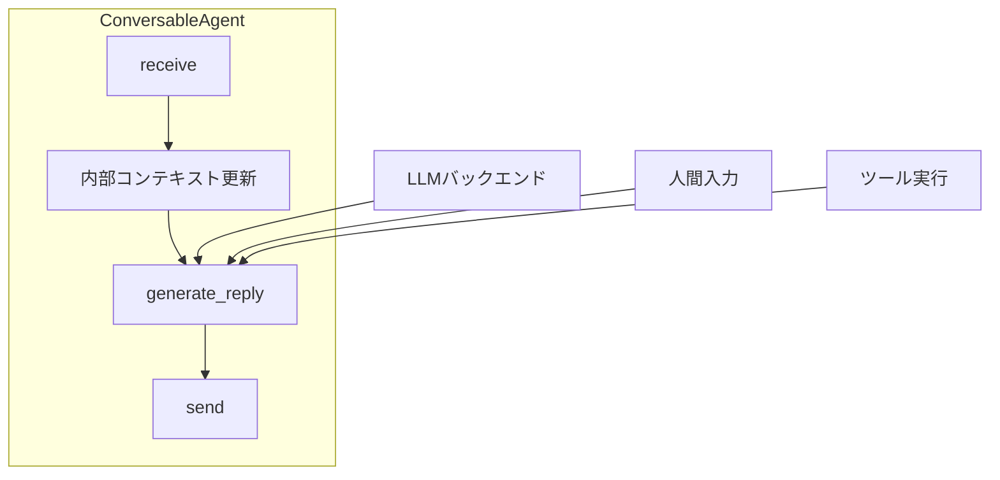
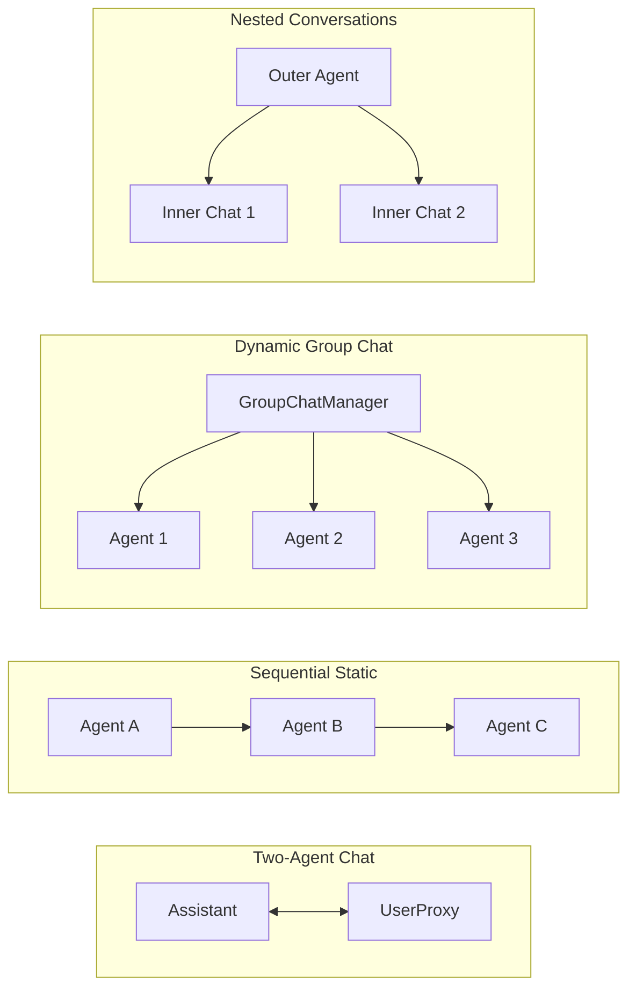

## 論文概要（Abstract）

本記事は [AutoGen: Enabling Next-Gen LLM Applications via Multi-Agent Conversation](https://arxiv.org/abs/2308.08155) の解説記事です。

AutoGenは、LLMアプリケーションをマルチエージェント間の会話として定義・実行するためのオープンソースフレームワークである。著者らは、LLM・人間入力・ツール実行を統一的に扱う**ConversableAgent**を中核抽象として設計し、Two-Agent Chat・Sequential Static・Dynamic Group Chat・Nested Conversationsの4つの会話パターンにより、多様なLLMアプリケーションを少ないコード量で構築可能にしたと報告している。MATHデータセットでは69.48%（GPT-4単体の55.18%を大幅に上回る）の精度を達成し、6つのアプリケーションで有効性を実証している。

この記事は [Zenn記事: Semantic Kernel 5大オーケストレーションパターンをPython×C#で実装比較する](https://zenn.dev/0h_n0/articles/a27bae62608bfd) の深掘りです。

## 情報源

- **会議名**: COLM 2024（First Conference on Language Modeling）
- **年**: 2024
- **URL**: [https://arxiv.org/abs/2308.08155](https://arxiv.org/abs/2308.08155)
- **著者**: Qingyun Wu, Gagan Bansal, Jieyu Zhang, et al.（Microsoft Research）
- **arXiv ID**: 2308.08155

## カンファレンス情報

COLM（Conference on Language Modeling）は2024年に初めて開催された言語モデリング専門の国際会議である。NeurIPSやICMLの言語モデリング関連セッションが独立した形で発足し、言語モデルの理論・応用・社会的影響を幅広くカバーする。AutoGenは第1回開催において採択された論文であり、マルチエージェントフレームワークの基盤設計として産業界からも注目を集めている。

## 技術的詳細（Technical Details）

### ConversableAgent: 統一エージェント抽象

AutoGenの設計の核となるのが**ConversableAgent**である。これは、LLM・人間入力・ツール実行の3種類のバックエンドを任意に組み合わせて駆動するエージェントの統一抽象クラスとして定義されている。



ConversableAgentのメッセージ処理フローは、以下の3ステップで構成される。

1. **receive**: 他エージェントからメッセージを受信し、内部コンテキスト（会話履歴）を更新する
2. **generate_reply**: 登録された応答関数（reply function）を優先度順に実行し、応答を生成する。LLM推論・ツール呼び出し・人間入力のいずれか、またはその組み合わせが使われる
3. **send**: 生成した応答を相手エージェントに送信する

著者らはこの設計により、エージェント間の通信プロトコルが統一され、会話パターンの差し替えが容易になると主張している。具体的なサブクラスとして以下の2つが提供されている。

- **AssistantAgent**: LLMバックエンドで駆動される。システムプロンプトにタスク解決のための指示を含む
- **UserProxyAgent**: 人間入力またはツール実行で駆動される。コード実行環境（Docker/ローカル）を持ち、LLM生成コードの自動実行が可能

### auto-reply メカニズム

AutoGenの会話制御において重要なのが**auto-reply**メカニズムである。エージェントはメッセージを受信するたびにgenerate_replyを呼び出し、**終了条件**（termination condition）を満たさない限り自動的に応答を返す。

終了条件は以下の形式で定義される。

$$
\text{terminate}(m) = \begin{cases} \text{True} & \text{if } f_{\text{cond}}(m) = \text{True} \text{ or } n \geq N_{\max} \\ \text{False} & \text{otherwise} \end{cases}
$$

ここで、
- $m$: 受信メッセージ
- $f_{\text{cond}}(m)$: ユーザ定義の終了条件関数（例: メッセージに"TERMINATE"を含むか）
- $n$: 現在のラウンド数
- $N_{\max}$: 最大ラウンド数

この仕組みにより、エージェント間の会話が自動的に進行し、人間の介入なしにタスクを解決する自律型ワークフローと、必要に応じて人間が介入するHIL（Human-in-the-Loop）ワークフローの両方を同一の枠組みで表現可能である。

### 4つの会話パターン

AutoGenは以下の4つの会話パターンを提供し、これらの組み合わせにより多様なアプリケーションを構築できる。



#### Two-Agent Chat

最もシンプルなパターンであり、AssistantAgentとUserProxyAgentが交互にメッセージを交換する。AssistantがPythonコードを生成し、UserProxyがそれを実行して結果を返す、というループが典型的な使い方である。

#### Sequential Static

複数のエージェントが事前定義された順序でタスクを処理する。例えば「リサーチャー → ライター → レビュアー」のようなパイプライン型ワークフローを構成する。各エージェント間の遷移順序は静的に決定される。

#### Dynamic Group Chat

**GroupChatManager**がLLMを用いて、会話の文脈に基づき動的に次の発言者を選択する。著者らは、話者選択のプロンプトにロール記述と会話履歴を含め、LLMが適切なエージェントを選ぶよう設計している。これにより、固定的なパイプラインでは対応できない柔軟な対話フローを実現する。

#### Nested Conversations

エージェントが特定の条件を満たした場合に、サブ会話（inner chat）を開始するパターンである。例えば、メインの会話中に専門的な質問が発生した場合、専門エージェントとの別セッションを立ち上げて結果を持ち帰る構造を取る。

### カスタム応答関数の登録

ConversableAgentには**register_reply**メソッドが提供されており、ユーザが独自の応答ロジックを優先度付きで登録できる。

```python
from autogen import ConversableAgent


def custom_reply_func(
    recipient: ConversableAgent,
    messages: list[dict],
    sender: ConversableAgent,
    config: dict,
) -> tuple[bool, str | None]:
    """カスタム応答関数

    Args:
        recipient: メッセージを受信したエージェント
        messages: 会話履歴
        sender: メッセージの送信元エージェント
        config: 設定情報

    Returns:
        (応答するか, 応答メッセージ) のタプル
    """
    last_message = messages[-1].get("content", "")
    if "SEARCH:" in last_message:
        query = last_message.split("SEARCH:")[1].strip()
        result = execute_search(query)
        return True, f"検索結果: {result}"
    return False, None  # 次の応答関数にフォールバック


agent = ConversableAgent(
    name="search_agent",
    llm_config={"model": "gpt-4"},
)

# 優先度1（デフォルトのLLM応答より先に評価される）
agent.register_reply(
    trigger=ConversableAgent,
    reply_func=custom_reply_func,
    position=1,
)
```

応答関数は登録された優先度順に評価され、最初にTrueを返した関数の応答が採用される。これにより、LLM推論の前にルールベースの処理を挟む、特定の送信者にのみ特別な処理を行う、といった柔軟な制御が可能となる。

## 実装のポイント（Implementation）

### コード実行環境の安全性

UserProxyAgentはLLMが生成したコードを自動実行する機能を持つが、著者らはセキュリティ上の考慮として以下を推奨している。

- **Dockerコンテナ内での実行**: デフォルトでDocker環境を利用し、ホストシステムへの影響を遮断する
- **人間承認モード**: `human_input_mode="ALWAYS"`に設定し、コード実行前に人間の承認を要求する
- **実行タイムアウト**: 無限ループや過大な計算を防止するタイムアウト設定

### UPDATE CONTEXTメカニズム（RAGアプリケーション）

AutoGenのRAGアプリケーション（論文のA2）では、検索結果の品質が不十分な場合にエージェントが"UPDATE CONTEXT"というキーワードを送信し、検索クエリを再構成して再検索を行う仕組みが実装されている。これは、単純なRetrieve-then-Readパイプラインでは対応できない反復的な検索改善を、エージェント間の会話として自然に表現した例である。

### マルチエージェントコーディング（A4）

Commander・Writer・Safeguardの3エージェント構成では、以下の役割分担が報告されている。

- **Commander**: ユーザの要件をWriterに指示し、Safeguardのフィードバックを受けて修正を依頼する
- **Writer**: Pythonコードを生成する
- **Safeguard**: 生成されたコードの安全性を検証し、危険なオペレーション（ファイル削除、ネットワークアクセス等）を検出してCommanderに報告する

著者らは、この3エージェント構成により、コード量が430行から100行に削減されたと報告している。

## Production Deployment Guide

AutoGenのマルチエージェント会話システムをプロダクション環境にデプロイする際の設計パターンを示す。AutoGenは複数エージェントの会話を管理する**オーケストレーション層**、LLM推論を行う**推論層**、ツール実行を行う**実行層**の3層で構成される。

### AWS実装パターン（コスト最適化重視）

マルチエージェント会話では、1リクエストあたり複数回のLLM呼び出しが発生するため、LLM推論コストが支配的となる。トラフィック量に応じた推奨構成を以下に示す。

| 構成 | トラフィック | サービス構成 | 月額概算 |
|------|------------|------------|---------|
| Small | ~100 req/日 | Lambda + Bedrock + DynamoDB | $80-200 |
| Medium | ~1,000 req/日 | ECS Fargate + ElastiCache + Bedrock | $500-1,200 |
| Large | 10,000+ req/日 | EKS + Karpenter (Spot) + ElastiCache Cluster | $3,000-7,000 |

**コスト試算の注意事項**: 上記は2026年9月時点のAWS ap-northeast-1（東京）リージョン料金に基づく概算値である。マルチエージェント会話では1リクエストあたり3-10回のLLM呼び出しが発生するため、実際のコストはエージェント数・会話ラウンド数・使用モデルにより大きく変動する。最新料金はAWS料金計算ツールで確認を推奨する。

**Small構成の内訳**:
- Lambda（会話オーケストレーション）: 512MB、平均実行時間10-30秒（マルチターン会話）、月$10-30
- Bedrock（LLM推論）: Claude Sonnet 4等、1リクエストあたり平均5回呼び出し、月$50-150（トークン量依存）
- DynamoDB（会話履歴・エージェント設定保存、On-Demand）: 月$5-10
- S3（ツール実行結果・コード成果物保存）: 月$3-5

**Medium構成のポイント**:
- ECS Fargate: エージェント間の会話がステートフルであるため、Lambda（最大15分タイムアウト）では対応しきれない長時間会話に対応
- ElastiCache（Redis）: 会話コンテキストのセッション管理、エージェント間のメッセージキューとして活用
- 月額$500-1,200: Fargate 2vCPU/4GB x 2タスク（$200-400）+ Bedrock（$200-600）+ ElastiCache cache.r7g.medium（$80-150）

**コスト削減テクニック**:
- Spot Instances活用（Large構成のEKSワーカー）で最大90%削減
- Reserved Instances（1年コミット、Medium/Large構成）で最大72%削減
- Bedrock Batch API使用（非同期タスクの場合）で50%削減
- Prompt Caching有効化でシステムプロンプト部分を30-90%削減（エージェントのシステムプロンプトは会話中固定のため効果が大きい）
- 軽量モデルによるルーティング: GroupChatManagerの話者選択にはHaikuクラスの軽量モデルを使用し、実際のタスク処理にのみSonnetクラスのモデルを使用する

### Terraformインフラコード

#### Small構成（Serverless）

```hcl
# AutoGen Multi-Agent Serverless構成
# Lambda + Bedrock + DynamoDB

terraform {
  required_version = ">= 1.9"
  required_providers {
    aws = {
      source  = "hashicorp/aws"
      version = "~> 5.60"
    }
  }
}

provider "aws" {
  region = "ap-northeast-1"
}

# DynamoDB: 会話履歴・エージェント設定保存
resource "aws_dynamodb_table" "conversations" {
  name         = "autogen-conversations"
  billing_mode = "PAY_PER_REQUEST" # コスト最適化: On-Demand
  hash_key     = "session_id"
  range_key    = "turn_number"

  attribute {
    name = "session_id"
    type = "S"
  }

  attribute {
    name = "turn_number"
    type = "N"
  }

  ttl {
    attribute_name = "expires_at"
    enabled        = true # 古い会話セッションの自動削除
  }

  server_side_encryption {
    enabled = true # KMS暗号化
  }

  point_in_time_recovery {
    enabled = true
  }

  tags = {
    Project = "autogen-multi-agent"
    Env     = "production"
  }
}

# S3: ツール実行結果・コード成果物保存
resource "aws_s3_bucket" "artifacts" {
  bucket = "autogen-agent-artifacts"

  tags = {
    Project = "autogen-multi-agent"
  }
}

resource "aws_s3_bucket_server_side_encryption_configuration" "artifacts" {
  bucket = aws_s3_bucket.artifacts.id

  rule {
    apply_server_side_encryption_by_default {
      sse_algorithm = "aws:kms"
    }
  }
}

resource "aws_s3_bucket_lifecycle_configuration" "artifacts" {
  bucket = aws_s3_bucket.artifacts.id

  rule {
    id     = "expire-old-artifacts"
    status = "Enabled"

    expiration {
      days = 30 # 30日経過した成果物を自動削除
    }
  }
}

# IAMロール（最小権限）
resource "aws_iam_role" "lambda_autogen" {
  name = "autogen-lambda-role"

  assume_role_policy = jsonencode({
    Version = "2012-10-17"
    Statement = [{
      Action = "sts:AssumeRole"
      Effect = "Allow"
      Principal = {
        Service = "lambda.amazonaws.com"
      }
    }]
  })
}

resource "aws_iam_role_policy" "lambda_policy" {
  name = "autogen-lambda-policy"
  role = aws_iam_role.lambda_autogen.id

  policy = jsonencode({
    Version = "2012-10-17"
    Statement = [
      {
        Effect = "Allow"
        Action = [
          "dynamodb:GetItem",
          "dynamodb:PutItem",
          "dynamodb:Query",
          "dynamodb:UpdateItem"
        ]
        Resource = aws_dynamodb_table.conversations.arn
      },
      {
        Effect = "Allow"
        Action = [
          "bedrock:InvokeModel"
        ]
        Resource = "arn:aws:bedrock:ap-northeast-1::foundation-model/*"
      },
      {
        Effect = "Allow"
        Action = [
          "s3:GetObject",
          "s3:PutObject"
        ]
        Resource = "${aws_s3_bucket.artifacts.arn}/*"
      },
      {
        Effect = "Allow"
        Action = [
          "logs:CreateLogGroup",
          "logs:CreateLogStream",
          "logs:PutLogEvents"
        ]
        Resource = "arn:aws:logs:*:*:*"
      }
    ]
  })
}

# Lambda関数: 会話オーケストレーション
resource "aws_lambda_function" "autogen_orchestrator" {
  function_name = "autogen-conversation-orchestrator"
  role          = aws_iam_role.lambda_autogen.arn
  handler       = "handler.lambda_handler"
  runtime       = "python3.12"
  memory_size   = 512 # マルチエージェント会話はメモリ消費が大きい
  timeout       = 300 # 5分: マルチターン会話に対応

  environment {
    variables = {
      CONVERSATION_TABLE = aws_dynamodb_table.conversations.name
      ARTIFACT_BUCKET    = aws_s3_bucket.artifacts.id
      BEDROCK_MODEL      = "anthropic.claude-sonnet-4-20250514"
      MAX_ROUNDS         = "10"
    }
  }

  tracing_config {
    mode = "Active" # X-Ray有効化
  }

  filename = "lambda_package.zip"

  tags = {
    Project = "autogen-multi-agent"
  }
}

# CloudWatchアラーム: Lambda実行時間監視
resource "aws_cloudwatch_metric_alarm" "lambda_duration" {
  alarm_name          = "autogen-lambda-duration-high"
  comparison_operator = "GreaterThanThreshold"
  evaluation_periods  = 3
  metric_name         = "Duration"
  namespace           = "AWS/Lambda"
  period              = 300
  statistic           = "p95"
  threshold           = 250000 # 250秒（タイムアウト300秒の83%）
  alarm_description   = "Lambda P95レイテンシが250秒超過"

  dimensions = {
    FunctionName = aws_lambda_function.autogen_orchestrator.function_name
  }
}
```

#### Large構成（Container）

```hcl
# AutoGen Multi-Agent Container構成
# EKS + Karpenter + ElastiCache

module "eks" {
  source  = "terraform-aws-modules/eks/aws"
  version = "~> 20.24"

  cluster_name    = "autogen-cluster"
  cluster_version = "1.31"

  vpc_id     = module.vpc.vpc_id
  subnet_ids = module.vpc.private_subnets

  eks_managed_node_groups = {
    system = {
      instance_types = ["m7i.large"]
      min_size       = 2
      max_size       = 4
      desired_size   = 2
    }
  }

  tags = {
    Project = "autogen-multi-agent"
  }
}

# Karpenter: Spot優先の自動スケーリング
resource "kubectl_manifest" "karpenter_provisioner" {
  yaml_body = yamlencode({
    apiVersion = "karpenter.sh/v1"
    kind       = "NodePool"
    metadata = {
      name = "autogen-workers"
    }
    spec = {
      template = {
        spec = {
          requirements = [
            {
              key      = "karpenter.sh/capacity-type"
              operator = "In"
              values   = ["spot", "on-demand"] # Spot優先
            },
            {
              key      = "node.kubernetes.io/instance-type"
              operator = "In"
              values   = ["m7i.xlarge", "m7i.2xlarge", "c7i.xlarge"]
            }
          ]
        }
      }
      limits = {
        cpu    = "64"
        memory = "256Gi"
      }
      disruption = {
        consolidationPolicy = "WhenEmptyOrUnderutilized"
        consolidateAfter    = "30s"
      }
    }
  })
}

# ElastiCache: 会話コンテキスト・セッション管理
resource "aws_elasticache_replication_group" "sessions" {
  replication_group_id = "autogen-sessions"
  description          = "AutoGen conversation session store"
  node_type            = "cache.r7g.large"
  num_cache_clusters   = 2
  engine               = "redis"
  engine_version       = "7.1"
  port                 = 6379

  at_rest_encryption_enabled = true
  transit_encryption_enabled = true

  tags = {
    Project = "autogen-multi-agent"
  }
}

# Secrets Manager: API設定
resource "aws_secretsmanager_secret" "agent_config" {
  name = "autogen/agent-config"

  tags = {
    Project = "autogen-multi-agent"
  }
}

# AWS Budgets: 月額予算アラート
resource "aws_budgets_budget" "autogen" {
  name         = "autogen-monthly"
  budget_type  = "COST"
  limit_amount = "7000"
  limit_unit   = "USD"
  time_unit    = "MONTHLY"

  notification {
    comparison_operator       = "GREATER_THAN"
    threshold                 = 80
    threshold_type            = "PERCENTAGE"
    notification_type         = "ACTUAL"
    subscriber_email_addresses = ["alerts@example.com"]
  }
}
```

### 運用・監視設定

**CloudWatch Logs Insights クエリ（マルチエージェント会話のコスト異常検知）**:

```
fields @timestamp, @message
| filter @message like /bedrock/
| stats sum(input_tokens) as total_input, sum(output_tokens) as total_output,
        count(*) as api_calls by bin(1h) as hour
| sort hour desc
| limit 24
```

**CloudWatch Logs Insights クエリ（会話ラウンド数の異常検知）**:

```
fields @timestamp, session_id, round_count
| filter round_count > 8
| stats count(*) as long_conversations by bin(1h) as hour
| sort hour desc
```

**CloudWatch アラーム設定（Python boto3）**:

```python
import boto3

cloudwatch = boto3.client("cloudwatch", region_name="ap-northeast-1")

# Bedrockトークン使用量スパイク検知
cloudwatch.put_metric_alarm(
    AlarmName="autogen-bedrock-token-spike",
    MetricName="InputTokenCount",
    Namespace="AWS/Bedrock",
    Statistic="Sum",
    Period=3600,
    EvaluationPeriods=1,
    Threshold=1000000,  # マルチエージェントは1エージェントより多い
    ComparisonOperator="GreaterThanThreshold",
    AlarmActions=["arn:aws:sns:ap-northeast-1:ACCOUNT:autogen-alerts"],
)

# Lambda実行時間異常検知（会話が長引いている可能性）
cloudwatch.put_metric_alarm(
    AlarmName="autogen-lambda-timeout-risk",
    MetricName="Duration",
    Namespace="AWS/Lambda",
    Statistic="p99",
    Period=300,
    EvaluationPeriods=2,
    Threshold=280000,  # 280秒: タイムアウト300秒の93%
    ComparisonOperator="GreaterThanThreshold",
    Dimensions=[
        {"Name": "FunctionName", "Value": "autogen-conversation-orchestrator"}
    ],
    AlarmActions=["arn:aws:sns:ap-northeast-1:ACCOUNT:autogen-alerts"],
)
```

**X-Ray トレーシング設定**:

```python
from aws_xray_sdk.core import xray_recorder, patch_all

patch_all()  # boto3自動計装


@xray_recorder.capture("multi_agent_conversation")
def run_conversation(task: str, agent_config: dict) -> dict:
    """マルチエージェント会話をトレース付きで実行

    Args:
        task: ユーザからのタスク入力
        agent_config: エージェント構成情報

    Returns:
        会話結果
    """
    subsegment = xray_recorder.current_subsegment()
    subsegment.put_annotation("agent_count", len(agent_config["agents"]))
    subsegment.put_annotation("pattern", agent_config.get("pattern", "two_agent"))

    result = orchestrator.run(task, agent_config)

    subsegment.put_metadata("total_rounds", result["rounds"])
    subsegment.put_metadata("total_tokens", result["token_usage"])
    return result
```

**Cost Explorer日次レポート（Python）**:

```python
import boto3
from datetime import datetime, timedelta


def daily_cost_report() -> dict:
    """日次コストレポートを取得

    Returns:
        サービス別のコスト情報
    """
    ce = boto3.client("ce", region_name="ap-northeast-1")
    end = datetime.utcnow().strftime("%Y-%m-%d")
    start = (datetime.utcnow() - timedelta(days=1)).strftime("%Y-%m-%d")

    response = ce.get_cost_and_usage(
        TimePeriod={"Start": start, "End": end},
        Granularity="DAILY",
        Metrics=["UnblendedCost"],
        Filter={
            "Tags": {
                "Key": "Project",
                "Values": ["autogen-multi-agent"],
            }
        },
        GroupBy=[{"Type": "DIMENSION", "Key": "SERVICE"}],
    )

    total = sum(
        float(g["Metrics"]["UnblendedCost"]["Amount"])
        for r in response["ResultsByTime"]
        for g in r["Groups"]
    )

    # $150/日超過でアラート（マルチエージェントはコストが高い）
    if total > 150:
        sns = boto3.client("sns", region_name="ap-northeast-1")
        sns.publish(
            TopicArn="arn:aws:sns:ap-northeast-1:ACCOUNT:autogen-alerts",
            Subject="AutoGen Daily Cost Alert",
            Message=f"日次コスト: ${total:.2f} (閾値: $150)",
        )

    return response["ResultsByTime"]
```

### コスト最適化チェックリスト

**アーキテクチャ選択**:
- [ ] トラフィック量に応じた構成選定（Small/Medium/Large）
- [ ] 非同期処理可能なタスクはBedrock Batch API活用
- [ ] 会話パターン（Two-Agent vs Group Chat）に応じたリソース見積

**リソース最適化**:
- [ ] EC2/EKS: Spot Instances優先（最大90%削減）
- [ ] Reserved Instances: 1年コミットで最大72%削減
- [ ] Savings Plans: Compute Savings Plans検討
- [ ] Lambda: メモリサイズ最適化（Power Tuning、マルチエージェントは512MB以上推奨）
- [ ] ECS/EKS: アイドル時はKarpenterでスケールダウン
- [ ] ElastiCache: ノードタイプの定期見直し

**LLMコスト削減**:
- [ ] Bedrock Batch API使用（非同期で50%削減）
- [ ] Prompt Caching有効化（エージェントのシステムプロンプトは固定のため30-90%削減）
- [ ] GroupChatManagerの話者選択にHaikuクラス軽量モデルを使用
- [ ] トークン数制限（max_tokens設定、会話履歴の要約による圧縮）
- [ ] 会話ラウンド数の上限設定（無限ループ防止とコスト制御）

**監視・アラート**:
- [ ] AWS Budgets設定（月額上限、マルチエージェントは予想外のコスト増に注意）
- [ ] CloudWatchアラーム（トークンスパイク検知、会話ラウンド数異常検知）
- [ ] Cost Anomaly Detection有効化
- [ ] 日次コストレポート（SNS通知）
- [ ] 会話ラウンド数のメトリクス収集（異常な長会話の早期検知）

**リソース管理**:
- [ ] 未使用リソース定期削除
- [ ] タグ戦略（Project/Env/Owner/AgentPattern）
- [ ] DynamoDB TTLによる古い会話セッションの自動削除
- [ ] S3ライフサイクルポリシー（古いコード成果物の自動削除）
- [ ] 開発環境の夜間・休日自動停止

## 実験結果（Results）

### ベンチマーク比較

著者らは6つのアプリケーションで評価を行い、以下の結果を報告している（論文Table 1, Section 4より）。

| アプリケーション | 評価指標 | AutoGen | ベースライン | 改善幅 |
|----------------|---------|---------|------------|--------|
| MATH（数学問題解決） | Accuracy | 69.48% | 55.18%（GPT-4単体） | +14.30 pts |
| Natural Questions（RAG） | F1 | 23.40% | - | インタラクティブ検索 |
| ALFWorld（意思決定） | 成功率 | +15% | ベースライン | 3エージェント構成 |
| OptiGuide（最適化コード） | F1 | +8% | GPT-4ベース | +35%（GPT-3.5-turbo） |

### フレームワーク比較

著者らは既存フレームワークとの機能比較を行い、AutoGenの汎用性を強調している（論文Table 2より）。

| フレームワーク | インフラ | 静的/動的 | コード実行 | 人間参加 |
|-------------|---------|----------|----------|---------|
| AutoGen | 汎用 | 両方 | あり | Chat/Skip |
| CAMEL | 汎用 | 静的のみ | なし | なし |
| BabyAGI | 特化型 | 静的のみ | なし | なし |
| MetaGPT | 特化型 | 静的のみ | あり | なし |

AutoGenは「汎用インフラ」「静的・動的両方の会話パターン」「コード実行」「人間参加」の全てをサポートする唯一のフレームワークとして位置付けられている。ただし、この比較は2023年時点のものであり、各フレームワークはその後も進化している点に留意が必要である。

### コード量削減

著者らは、OptiGuideアプリケーション（A4）において、AutoGenを使用することでコード量が430行から100行に削減されたと報告している。これは、ConversableAgentの統一抽象とauto-replyメカニズムにより、メッセージルーティングや終了条件の制御コードが不要になったことによるものである。

### 制約と限界

論文では明示的に議論されていないが、以下の制約が存在する。

- **コスト**: マルチエージェント構成では1リクエストあたり複数回のLLM呼び出しが発生するため、APIコストが線形以上に増加する
- **レイテンシ**: エージェント間の逐次的なメッセージ交換により、単一LLM呼び出しに比べて応答時間が大幅に増加する
- **デバッグの困難さ**: エージェント間の会話ログが長大になり、問題の特定が困難になる場合がある
- **終了条件の設計**: 適切な終了条件を設定しないと、エージェントが無限ループに陥るリスクがある

## 実運用への応用（Practical Applications）

### Semantic Kernelとの関連

関連Zenn記事「[Semantic Kernel 5大オーケストレーションパターンをPython×C#で実装比較する](https://zenn.dev/0h_n0/articles/a27bae62608bfd)」で解説されているSemantic Kernelのオーケストレーションパターンは、AutoGenの会話パターンと概念的に対応関係がある。

- **Semantic KernelのSequential Pattern**: AutoGenのSequential Staticに対応する。エージェントが事前定義された順序でタスクを処理するパイプライン構造
- **Semantic KernelのParallel Pattern**: AutoGenのDynamic Group Chatの一部として表現可能。複数エージェントが並行してタスクを処理し、結果を集約する
- **Semantic KernelのHandoff Pattern**: AutoGenのNested Conversationsに対応する。特定条件下で制御を別のエージェントに委譲する

AutoGenが「会話」を基本単位としたボトムアップ設計であるのに対し、Semantic Kernelは「カーネル」を中心としたトップダウン設計を採用している。どちらのアプローチが適切かはアプリケーションの特性に依存するが、AutoGenの会話パターンの知見はSemantic Kernelでのエージェント設計にも応用可能である。

### プロダクション適用時の考慮事項

- **会話履歴の管理**: マルチエージェント会話ではコンテキストウィンドウが急速に消費されるため、会話要約や選択的コンテキスト注入の仕組みが必要となる
- **エージェント数のスケーリング**: Dynamic Group Chatのエージェント数が増加すると、話者選択の精度が低下する傾向がある。著者らは3-5エージェント程度での使用を想定している
- **障害耐性**: エージェント間の会話が途中で失敗した場合のリトライ戦略・チェックポイント機構が必要である。DynamoDB等に会話状態を永続化し、再開可能な設計とすることが望ましい

## まとめ

AutoGenは、ConversableAgentという統一抽象と4つの会話パターンにより、多様なマルチエージェントLLMアプリケーションを少ないコード量で構築可能にしたフレームワークである。著者らはMATHデータセットでGPT-4単体を14ポイント上回る69.48%の精度を達成し、6つのアプリケーションで有効性を実証したと報告している。

AutoGenの「会話としてのマルチエージェント協調」という設計思想は、Semantic Kernelを含む現在のLLMオーケストレーションフレームワークの基盤技術として広く影響を与えている。一方で、マルチエージェント構成に伴うコスト増加・レイテンシ・デバッグ困難性といった課題は依然として残っており、プロダクション適用時には会話ラウンド数の制御やコスト監視の仕組みが不可欠である。

## 参考文献

- **arXiv**: [https://arxiv.org/abs/2308.08155](https://arxiv.org/abs/2308.08155)
- **Conference**: COLM 2024（First Conference on Language Modeling）
- **Code**: [https://github.com/microsoft/autogen](https://github.com/microsoft/autogen)
- **Related Zenn article**: [https://zenn.dev/0h_n0/articles/a27bae62608bfd](https://zenn.dev/0h_n0/articles/a27bae62608bfd)
