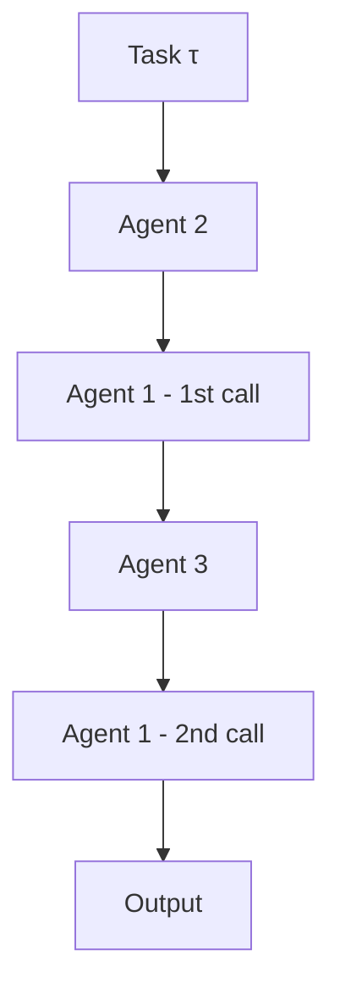

本記事は [Multi-Agent Collaboration via Evolving Orchestration (NeurIPS 2025)](https://arxiv.org/abs/2505.19591) の解説記事です。

## 論文概要（Abstract）

マルチエージェントシステムにおいて、エージェント間の協調構造（トポロジー）を事前に固定するのではなく、強化学習（REINFORCE）で動的に進化させるフレームワーク**Puppeteer**を著者らは提案している。中央集権的なポリシーがタスク状態に応じてエージェントをステップごとに選択し、協調グラフを暗黙的に構築する。著者らは、GSM-Hard・MMLU-Pro・SRDD等の複数ベンチマークで、静的トポロジー手法（MacNet等）と比較して一貫した性能改善を報告しており、大規模モデル構成（Titan Subspace）では全体平均スコアが0.5856（ベースライン平均）から0.7731（進化後）へ向上したとしている（論文Table 1, 2より）。

この記事は [Zenn記事: Semantic Kernel 5大オーケストレーションパターンをPython×C#で実装比較する](https://zenn.dev/0h_n0/articles/a27bae62608bfd) の深掘りです。

## 情報源

- **会議名**: NeurIPS 2025（第39回年次大会）
- **年**: 2025
- **URL**: [https://arxiv.org/abs/2505.19591](https://arxiv.org/abs/2505.19591)
- **著者**: Yufan Dang, Chen Qian, Xueheng Luo, et al.
- **分野**: cs.CL, cs.AI, cs.MA

## カンファレンス情報

**NeurIPS（Neural Information Processing Systems）について**:
- NeurIPSは機械学習・人工知能分野の最高峰会議の1つであり、採択率は通常25-30%程度（2024年は約25.8%）
- 本論文は清華大学・テンセントの共同研究チームにより投稿されている

## 背景と動機（Background & Motivation）

### マルチエージェントオーケストレーションの課題

LLMベースのマルチエージェントシステムでは、複数のエージェント（コーダー、レビュアー、プランナー等）が協調してタスクを解決する。従来のアプローチでは、この協調構造をDAG（有向非巡回グラフ）やパイプラインとして**事前に固定**していた。例えばMacNetは有向非巡回グラフ上でエージェントをトポロジカル順に実行し、ChatDevはウォーターフォール的なパイプラインを採用する。

しかし、著者らは静的トポロジーに以下の根本的な限界があると指摘している。

- **タスク依存性**: 最適な協調構造はタスクの性質によって異なるため、1つの固定グラフでは多様なタスクに対応できない
- **適応性の欠如**: タスク実行中にエラーが発生した場合でも、事前定義されたフローに従い続ける
- **探索の制限**: DAG制約はサイクル（相互レビュー等）を許可せず、反復的改善の余地がない

これらの課題に対し、「タスクの進行状態を観測しながら次に呼び出すエージェントを動的に決定する」逐次的意思決定として定式化するのが本論文のアプローチである。

### 静的 vs 動的オーケストレーションの違い

Semantic Kernelでは、Sequential / Parallel / Selection / Handoff / Magentic といったオーケストレーションパターンが提供されている。これらは開発者が明示的にフローを設計する「静的」アプローチである。本論文のPuppeteerは、これらのパターンの選択・組み合わせ自体を学習によって最適化する「メタ・オーケストレーション」と位置づけられる。

## 主要な貢献（Key Contributions）

著者らは以下の3点を主な貢献として挙げている。

- **Puppeteerフレームワーク**: マルコフ決定過程（MDP）として定式化された、強化学習ベースの動的エージェント選択メカニズム。エージェントプールとポリシーネットワークの分離により、異種エージェント構成に対応
- **構造的創発の分析**: 学習の進行に伴い、協調グラフに「ハブ」の形成（Compaction）やサイクルの増加（Cyclicality）が自然発生する現象を定量的に分析。これは固定DAGでは原理的に実現不可能な構造
- **包括的なベンチマーク評価**: GSM-Hard、MMLU-Pro、HumanEval、SRDD等の8ベンチマークにおいて、大規模（Titan）・小規模（Mimas）の2つのモデル構成で評価を実施

## 技術的詳細（Technical Details）

### Puppeteerのメカニズム

Puppeteerは中央集権的なポリシーネットワークであり、タスクの現在の状態を観測してエージェントを選択する。以下にMDP的定式化を示す。

**状態空間**: 各タイムステップ$t$において、状態$S_t$はこれまでのエージェント出力の集約表現（テキスト埋め込み等）を含む。

**行動空間**: 行動$a_t$は、利用可能なエージェントプール$\mathcal{A} = \{a^{(1)}, a^{(2)}, \ldots, a^{(n)}\}$からの1つのエージェントの選択である。

**ポリシー**: タスク$\tau$と状態$S_t$を条件として、選択確率は以下で定義される。

$$
a_t \sim \pi(S_t, \tau) = \mathbb{P}(a \mid S_t, \tau)
$$

ここで、
- $a_t$: タイムステップ$t$で選択されるエージェント
- $\pi$: ポリシーネットワーク（Puppeteer本体）
- $S_t$: タイムステップ$t$の状態（これまでの出力の集約）
- $\tau$: 入力タスク（問題文など）

**状態遷移**: 選択されたエージェント$a_t$が出力$o_t$を生成し、関数$\Phi$を通じてグローバル状態を更新する。

$$
S_{t+1} = \Phi(S_t, o_t)
$$

この定式化の重要な特徴は**マルコフ性**である。$S_t$に十分な情報が圧縮されていれば、完全な履歴$(o_1, o_2, \ldots, o_{t-1})$を保持せずとも意思決定が可能になる。

### 強化学習による最適化

Puppeteerの最適化にはREINFORCEアルゴリズムが用いられる。目的関数は期待リターンの最大化である。

$$
J(\theta) = \mathbb{E}_{\pi_\theta}[R(\tau)]
$$

ここで$\theta$はポリシーパラメータ、$R(\tau)$はタスク$\tau$に対する累積報酬である。

**報酬関数**: 著者らは解の品質と計算コストを結合した報酬を設計している。

$$
R(\tau) = R_{\text{quality}}(\tau) - \lambda \cdot \frac{C(\tau)}{\phi}
$$

ここで、
- $R_{\text{quality}}(\tau)$: タスクの正解率等に基づく品質報酬
- $C(\tau)$: タスク実行中に消費された総トークン数（計算コスト）
- $\phi$: 最大予算（正規化定数）
- $\lambda$: 効率と品質のトレードオフを制御する重み

各ステップの割引報酬は割引率$\gamma \in (0, 1]$で計算される。この設計により、Puppeteerは「正しい回答を得る」だけでなく「少ないステップで正しい回答を得る」方向に最適化される。

### 勾配推定

REINFORCEの勾配推定は以下の式で行われる。

$$
\nabla_\theta J(\theta) = \mathbb{E}_{\pi_\theta}\left[\sum_{t=0}^{T} \nabla_\theta \log \pi_\theta(a_t \mid S_t, \tau) \cdot G_t\right]
$$

ここで$G_t = \sum_{k=t}^{T} \gamma^{k-t} r_k$はタイムステップ$t$からの累積割引報酬である。バリアンス低減のためにベースラインを導入しているが、論文ではその詳細仕様は明示されていない。

### フォールディングと暗黙の推論グラフ

Puppeteerの特徴的な概念として**フォールディング**がある。エージェントの選択列$[a^{(2)}, a^{(1)}, a^{(3)}, a^{(1)}]$が得られた場合、同一エージェント$a^{(1)}$の複数回出現は、そのエージェントが異なるコンテキストで再利用されたことを意味する。この列を「折りたたんで」グラフとして可視化すると、暗黙的な推論グラフが再構成される。



このグラフは事前に設計されたものではなく、Puppeteerの選択の結果として**事後的に再構成**されたものである。固定DAGとの本質的な違いは、同一エージェントへのサイクル的な呼び出しが許容される点にある。

### アルゴリズムの擬似コード

```python
from dataclasses import dataclass
from typing import Protocol


class Agent(Protocol):
    """エージェントインターフェース。"""

    def generate(self, state: str, task: str) -> str:
        """状態とタスクを受け取り出力を返す。"""
        ...


@dataclass
class PuppeteerConfig:
    """Puppeteerの設定。

    Attributes:
        max_steps: 最大ステップ数
        gamma: 割引率
        lambda_cost: コスト重みパラメータ
        max_budget: 最大予算（トークン数）
    """

    max_steps: int = 22
    gamma: float = 0.99
    lambda_cost: float = 0.1
    max_budget: int = 100_000


def puppeteer_episode(
    task: str,
    agents: list[Agent],
    policy: "PolicyNetwork",
    config: PuppeteerConfig,
) -> tuple[list[str], float]:
    """Puppeteerの1エピソード実行。

    Args:
        task: 入力タスク（問題文）
        agents: 利用可能なエージェントのリスト
        policy: エージェント選択ポリシー
        config: 実行設定

    Returns:
        出力列と累積報酬のタプル
    """
    state = task  # 初期状態はタスクそのもの
    outputs: list[str] = []
    total_cost = 0

    for t in range(config.max_steps):
        # ポリシーからエージェントを選択
        agent_idx = policy.select(state, task, agents)
        selected_agent = agents[agent_idx]

        # エージェントが出力を生成
        output = selected_agent.generate(state, task)
        outputs.append(output)

        # 状態を更新（Φ関数に相当）
        state = update_state(state, output)
        total_cost += count_tokens(output)

        # 終了条件の判定
        if is_terminal(state):
            break

    # 品質報酬 - コストペナルティ
    quality = evaluate_quality(outputs[-1], task)
    cost_penalty = config.lambda_cost * (total_cost / config.max_budget)
    reward = quality - cost_penalty

    return outputs, reward
```

## 実装のポイント（Implementation）

Puppeteerを実装する際の技術的な注意点を以下に示す。

### エージェントプールの構成

著者らはTitan Subspace（大規模モデル）とMimas Subspace（小規模モデル）の2構成で評価を行っている。Titanでは異なる能力を持つ複数のLLM（GPT系、Claude系等）を組み合わせた異種構成が採用されている。Ablation Studyの結果、同種モデルのみの構成（Mono）よりも異種構成（Heterogeneous）が一貫して優れることが確認されている。

### トポロジー制約のバランス

デフォルト設定は幅44・深さ22（W44D22）であり、著者らはこれが最適であると報告している。過度な幅や深さは冗長な計算を招き、性能低下に繋がる。幅を大きくしすぎるとエージェントの選択肢が増えてポリシーの学習が困難になり、深さを大きくしすぎると不必要なステップが増加する。

### 状態表現の設計

$\Phi$関数（状態更新関数）の設計は実装上の重要な選択である。全履歴をテキストとして保持する方法は正確だがトークンコストが高く、要約ベースの方法は効率的だが情報損失のリスクがある。マルコフ性を満たすために十分な情報を圧縮しつつ、ポリシーネットワークが扱える次元に収める必要がある。

### 学習の安定化

REINFORCEはバリアンスが高いことで知られている。著者らの実験では学習中にトークン消費が一貫して減少しており、ポリシーが効率的な経路を学習していることを示唆しているが、収束の安定性については大規模な初期化バリエーションでのロバスト性検証が今後必要とされる。

## Production Deployment Guide

本論文のPuppeteerフレームワークはマルチエージェントオーケストレーションの実装を含むため、Production環境への適用を検討する。

### AWS実装パターン（コスト最適化重視）

PuppeteerのマルチエージェントオーケストレーションをAWS上にデプロイする場合のトラフィック量別推奨構成を示す。以下のコスト試算は2026年9月時点のAWS ap-northeast-1（東京）リージョン料金に基づく概算値であり、実際のコストはトラフィックパターン、リージョン、バースト使用量により変動する。最新料金はAWS料金計算ツールで確認を推奨する。

| 構成 | トラフィック | サービス構成 | 月額目安 |
|------|------------|-------------|---------|
| **Small** | ~100 req/日 | Lambda + Bedrock + DynamoDB + SQS | $80-200 |
| **Medium** | ~1,000 req/日 | ECS Fargate + Bedrock + ElastiCache + DynamoDB | $400-900 |
| **Large** | 10,000+ req/日 | EKS + Karpenter (Spot) + Bedrock + Redis Cluster | $2,500-5,500 |

**Small構成の詳細**:
- Lambda (256MB, 平均30秒/回 × 100回/日): 月額約$5
- Bedrock (Claude Sonnet, 平均3,000 input + 1,500 output トークン × エージェント呼び出し平均5回 × 100タスク): 月額約$50-150
- DynamoDB (On-Demand, 状態管理テーブル): 月額約$3-5
- SQS (非同期タスクキュー): 月額約$1

**コスト削減テクニック**:
- **Bedrock Batch API**: 非リアルタイムタスクでは50%のコスト削減が可能
- **Prompt Caching**: Puppeteerのシステムプロンプトやエージェント定義部分をキャッシュすることで30-90%削減
- **モデルミックス戦略**: 初回判定は軽量モデル（Haiku相当）で実行し、困難なタスクのみ大規模モデルにエスカレーション。これはPuppeteerのHeterogeneous構成と自然に対応する
- **Spot Instances（Large構成）**: EKSワーカーノードにSpot Instancesを活用して最大90%のコンピュート削減

### Terraformインフラコード

**Small構成（Serverless: Lambda + Bedrock + DynamoDB）**:

```hcl
# puppeteer_orchestrator/main.tf
# Puppeteer Multi-Agent Orchestration - Small構成

terraform {
  required_version = ">= 1.9"
  required_providers {
    aws = {
      source  = "hashicorp/aws"
      version = "~> 5.70"
    }
  }
}

provider "aws" {
  region = "ap-northeast-1"
}

# --- IAM: 最小権限の原則 ---
resource "aws_iam_role" "orchestrator_lambda" {
  name = "puppeteer-orchestrator-role"
  assume_role_policy = jsonencode({
    Version = "2012-10-17"
    Statement = [{
      Action = "sts:AssumeRole"
      Effect = "Allow"
      Principal = { Service = "lambda.amazonaws.com" }
    }]
  })
}

resource "aws_iam_role_policy" "orchestrator_policy" {
  name = "puppeteer-orchestrator-policy"
  role = aws_iam_role.orchestrator_lambda.id
  policy = jsonencode({
    Version = "2012-10-17"
    Statement = [
      {
        Effect   = "Allow"
        Action   = ["bedrock:InvokeModel", "bedrock:InvokeModelWithResponseStream"]
        Resource = "arn:aws:bedrock:ap-northeast-1::foundation-model/*"
      },
      {
        Effect   = "Allow"
        Action   = ["dynamodb:PutItem", "dynamodb:GetItem", "dynamodb:UpdateItem", "dynamodb:Query"]
        Resource = aws_dynamodb_table.agent_state.arn
      },
      {
        Effect   = "Allow"
        Action   = ["logs:CreateLogGroup", "logs:CreateLogStream", "logs:PutLogEvents"]
        Resource = "arn:aws:logs:ap-northeast-1:*:*"
      },
      {
        Effect   = "Allow"
        Action   = ["sqs:SendMessage", "sqs:ReceiveMessage", "sqs:DeleteMessage"]
        Resource = aws_sqs_queue.task_queue.arn
      }
    ]
  })
}

# --- DynamoDB: エージェント状態管理 ---
resource "aws_dynamodb_table" "agent_state" {
  name         = "puppeteer-agent-state"
  billing_mode = "PAY_PER_REQUEST"  # On-Demand: コスト最適化
  hash_key     = "task_id"
  range_key    = "step"

  attribute {
    name = "task_id"
    type = "S"
  }
  attribute {
    name = "step"
    type = "N"
  }

  # KMS暗号化
  server_side_encryption {
    enabled = true
  }

  ttl {
    attribute_name = "expires_at"
    enabled        = true
  }
}

# --- SQS: 非同期タスクキュー ---
resource "aws_sqs_queue" "task_queue" {
  name                       = "puppeteer-task-queue"
  visibility_timeout_seconds = 300  # Lambda最大実行時間に合わせる
  message_retention_seconds  = 86400
  sqs_managed_sse_enabled    = true
}

# --- Lambda: オーケストレーター ---
resource "aws_lambda_function" "orchestrator" {
  function_name = "puppeteer-orchestrator"
  runtime       = "python3.12"
  handler       = "orchestrator.handler"
  role          = aws_iam_role.orchestrator_lambda.arn
  timeout       = 300
  memory_size   = 256

  environment {
    variables = {
      STATE_TABLE  = aws_dynamodb_table.agent_state.name
      TASK_QUEUE   = aws_sqs_queue.task_queue.url
      MAX_STEPS    = "22"
      GAMMA        = "0.99"
      LAMBDA_COST  = "0.1"
    }
  }

  filename         = "lambda_package.zip"
  source_code_hash = filebase64sha256("lambda_package.zip")

  tracing_config {
    mode = "Active"  # X-Ray トレーシング有効化
  }
}

# --- CloudWatch: コスト監視アラーム ---
resource "aws_cloudwatch_metric_alarm" "bedrock_token_spike" {
  alarm_name          = "puppeteer-bedrock-token-spike"
  comparison_operator = "GreaterThanThreshold"
  evaluation_periods  = 1
  metric_name         = "InputTokenCount"
  namespace           = "AWS/Bedrock"
  period              = 3600
  statistic           = "Sum"
  threshold           = 500000  # 1時間あたり50万トークン
  alarm_actions       = []      # SNSトピックARNを設定
}
```

**Large構成（Container: EKS + Karpenter + Spot）**:

```hcl
# puppeteer_orchestrator_large/main.tf
# Puppeteer Multi-Agent Orchestration - Large構成

module "eks" {
  source          = "terraform-aws-modules/eks/aws"
  version         = "~> 20.24"
  cluster_name    = "puppeteer-cluster"
  cluster_version = "1.31"

  vpc_id     = module.vpc.vpc_id
  subnet_ids = module.vpc.private_subnets

  # パブリックアクセス最小化
  cluster_endpoint_public_access = false
  cluster_endpoint_private_access = true
}

# --- Karpenter: Spot優先の自動スケーリング ---
resource "kubectl_manifest" "karpenter_nodepool" {
  yaml_body = yamlencode({
    apiVersion = "karpenter.sh/v1"
    kind       = "NodePool"
    metadata   = { name = "puppeteer-agents" }
    spec = {
      template = {
        spec = {
          requirements = [
            { key = "karpenter.sh/capacity-type", operator = "In", values = ["spot", "on-demand"] },
            { key = "node.kubernetes.io/instance-type", operator = "In",
              values = ["m7i.xlarge", "m7i.2xlarge", "c7i.xlarge", "c7i.2xlarge"] }
          ]
        }
      }
      limits   = { cpu = "64", memory = "256Gi" }
      disruption = {
        consolidationPolicy = "WhenEmptyOrUnderutilized"
        consolidateAfter    = "30s"
      }
    }
  })
}

# --- Secrets Manager: Bedrock設定 ---
resource "aws_secretsmanager_secret" "bedrock_config" {
  name                    = "puppeteer/bedrock-config"
  recovery_window_in_days = 7
}

# --- AWS Budgets: 月次予算アラート ---
resource "aws_budgets_budget" "monthly" {
  name         = "puppeteer-monthly-budget"
  budget_type  = "COST"
  limit_amount = "5000"
  limit_unit   = "USD"
  time_unit    = "MONTHLY"

  notification {
    comparison_operator       = "GREATER_THAN"
    threshold                 = 80
    threshold_type            = "PERCENTAGE"
    notification_type         = "ACTUAL"
    subscriber_email_addresses = ["ops-team@example.com"]
  }
}
```

### 運用・監視設定

**CloudWatch Logs Insights クエリ（コスト異常検知）**:

```
# 1時間あたりのBedrock API呼び出し回数とトークン使用量
fields @timestamp, @message
| filter @message like /bedrock_invoke/
| stats count() as invocations,
        sum(input_tokens) as total_input,
        sum(output_tokens) as total_output
  by bin(1h)
| sort @timestamp desc
```

**CloudWatch Logs Insights クエリ（レイテンシ分析）**:

```
# Puppeteerエピソードのレイテンシ P50/P95/P99
fields @timestamp, duration_ms
| filter event = "puppeteer_episode_complete"
| stats percentile(duration_ms, 50) as P50,
        percentile(duration_ms, 95) as P95,
        percentile(duration_ms, 99) as P99
  by bin(1h)
```

**CloudWatch アラーム設定コード（Python）**:

```python
import boto3


def create_orchestrator_alarms(sns_topic_arn: str) -> None:
    """Puppeteerオーケストレーター監視用のCloudWatchアラームを作成する。

    Args:
        sns_topic_arn: 通知先SNSトピックARN
    """
    cw = boto3.client("cloudwatch", region_name="ap-northeast-1")

    # Bedrock トークンスパイク検知
    cw.put_metric_alarm(
        AlarmName="puppeteer-bedrock-token-spike",
        MetricName="InputTokenCount",
        Namespace="AWS/Bedrock",
        Statistic="Sum",
        Period=3600,
        EvaluationPeriods=1,
        Threshold=500_000,
        ComparisonOperator="GreaterThanThreshold",
        AlarmActions=[sns_topic_arn],
    )

    # Lambda実行時間異常検知
    cw.put_metric_alarm(
        AlarmName="puppeteer-lambda-duration-anomaly",
        MetricName="Duration",
        Namespace="AWS/Lambda",
        Dimensions=[{"Name": "FunctionName", "Value": "puppeteer-orchestrator"}],
        Statistic="p99",
        Period=300,
        EvaluationPeriods=3,
        Threshold=280_000,  # タイムアウト(300s)の93%
        ComparisonOperator="GreaterThanThreshold",
        AlarmActions=[sns_topic_arn],
    )
```

**X-Ray トレーシング設定コード（Python）**:

```python
from aws_xray_sdk.core import xray_recorder, patch_all


def configure_tracing() -> None:
    """X-Rayトレーシングを設定する。

    boto3を自動計装し、Bedrockおよび DynamoDB呼び出しをトレースする。
    """
    xray_recorder.configure(service="puppeteer-orchestrator")
    patch_all()  # boto3自動計装


@xray_recorder.capture("select_agent")
def select_agent_traced(state: str, task: str, agent_pool: list[str]) -> str:
    """エージェント選択をトレース付きで実行する。

    Args:
        state: 現在のタスク状態
        task: 入力タスク
        agent_pool: 利用可能なエージェント名リスト

    Returns:
        選択されたエージェント名
    """
    subsegment = xray_recorder.current_subsegment()
    subsegment.put_annotation("task_length", len(task))
    subsegment.put_metadata("agent_pool_size", len(agent_pool))

    selected = policy_select(state, task, agent_pool)

    subsegment.put_annotation("selected_agent", selected)
    return selected
```

**Cost Explorer自動レポート（Python）**:

```python
import boto3
from datetime import datetime, timedelta


def daily_cost_report(sns_topic_arn: str, threshold_usd: float = 100.0) -> dict:
    """日次コストレポートを取得し、閾値超過時にSNS通知する。

    Args:
        sns_topic_arn: 通知先SNSトピックARN
        threshold_usd: 日次コスト閾値（USD）

    Returns:
        サービス別コスト辞書
    """
    ce = boto3.client("ce", region_name="us-east-1")
    sns = boto3.client("sns", region_name="ap-northeast-1")

    today = datetime.utcnow().strftime("%Y-%m-%d")
    yesterday = (datetime.utcnow() - timedelta(days=1)).strftime("%Y-%m-%d")

    response = ce.get_cost_and_usage(
        TimePeriod={"Start": yesterday, "End": today},
        Granularity="DAILY",
        Metrics=["UnblendedCost"],
        GroupBy=[{"Type": "DIMENSION", "Key": "SERVICE"}],
    )

    costs: dict[str, float] = {}
    total = 0.0
    for group in response["ResultsByTime"][0]["Groups"]:
        service = group["Keys"][0]
        amount = float(group["Metrics"]["UnblendedCost"]["Amount"])
        if amount > 0:
            costs[service] = amount
            total += amount

    if total > threshold_usd:
        sns.publish(
            TopicArn=sns_topic_arn,
            Subject=f"Puppeteer Cost Alert: ${total:.2f}/day",
            Message=f"Daily cost ${total:.2f} exceeded ${threshold_usd} threshold.\n"
            + "\n".join(f"  {svc}: ${amt:.2f}" for svc, amt in sorted(costs.items(), key=lambda x: -x[1])[:5]),
        )

    return costs
```

### コスト最適化チェックリスト

**アーキテクチャ選択**:
- [ ] ~100 req/日 → Serverless（Lambda + Bedrock）
- [ ] ~1,000 req/日 → Hybrid（ECS Fargate + Bedrock）
- [ ] 10,000+ req/日 → Container（EKS + Spot）

**リソース最適化**:
- [ ] EC2/EKSノード: Spot Instances優先（最大90%削減）
- [ ] Reserved Instances: 安定ワークロードに1年コミット（最大72%削減）
- [ ] Savings Plans: Compute Savings Plans検討
- [ ] Lambda: メモリサイズをPower Tuningで最適化（256MB-1024MB）
- [ ] EKS: Karpenter consolidationで未使用ノード自動削除

**LLMコスト削減**:
- [ ] Bedrock Batch API: 非同期タスクで50%削減
- [ ] Prompt Caching: システムプロンプト・エージェント定義をキャッシュ（30-90%削減）
- [ ] モデルミックス: 初回判定にHaiku相当、困難タスクにSonnet/Opus（Puppeteerの異種構成と対応）
- [ ] トークン数制限: max_tokensを各エージェントの用途に応じて設定
- [ ] 早期終了: is_terminal判定を適切に設計し不必要なステップを回避

**監視・アラート**:
- [ ] AWS Budgets: 月次予算（$5,000）設定、80%到達で通知
- [ ] CloudWatch アラーム: Bedrockトークンスパイク、Lambda実行時間異常
- [ ] Cost Anomaly Detection: 自動異常検知有効化
- [ ] 日次コストレポート: Cost Explorer APIで取得、$100/日超過でSNS通知

**リソース管理**:
- [ ] 未使用リソース: DynamoDB TTLで古い状態レコード自動削除
- [ ] タグ戦略: `project:puppeteer`, `env:prod/dev`, `team:ml`
- [ ] ライフサイクルポリシー: CloudWatch Logs保持期間を30日に設定
- [ ] 開発環境: 夜間・週末のEKSノード自動スケールダウン
- [ ] ECRイメージ: ライフサイクルポリシーで古いイメージ自動削除

## 実験結果（Results）

### Titan Subspace（大規模モデル構成）

著者らが報告しているTitan Subspaceのベンチマーク結果を以下に示す（論文Table 1, 2より）。

| ベンチマーク | ベースライン平均 | 初期化時 | 進化後（Puppeteer） | 改善幅 |
|-------------|----------------|---------|-------------------|--------|
| GSM-Hard | 0.5856 | 0.6560 | **0.7000** | +0.1144 |
| MMLU-Pro | 0.7600 | 0.7500 | **0.8300** | +0.0700 |
| HumanEval | 0.5244 | 0.5976 | 0.6585 | +0.1341 |
| SRDD | 0.6822 | 0.6822 | **0.7637** | +0.0815 |
| 全体平均 | 0.5856 | 0.6893 | **0.7731** | +0.1875 |

### Mimas Subspace（小規模モデル構成）

小規模モデル構成でも進化による改善が確認されている。

| 指標 | 初期化時 | 進化後 | 改善幅 |
|------|---------|-------|--------|
| 全体平均 | 0.5068 | **0.6147** | +0.1079 |
| 別報告値 | 0.6273 | **0.6324** | +0.0051 |

著者らの報告によれば、Titanでの改善幅（+0.1875）がMimasでの改善幅（+0.1079）を上回っており、大規模モデル構成の方がPuppeteerの恩恵を受けやすい傾向が示唆されている。

### 構造的創発現象の定量分析

著者らは学習の進行に伴う協調グラフの構造変化を分析し、以下の2つの創発現象を報告している。

**Compaction（圧縮）**: 学習が進むとグラフ密度が増加し、特定のエージェントが「ハブ」として多くのエッジを集める。これはPuppeteerが特定のエージェントの有用性を認識し、頻繁に選択するようになることを意味する。

**Cyclicality（循環性）**: サイクル形成の頻度が学習とともに増加する。サイクルは、あるエージェントの出力を別のエージェントが検証し、その結果を元のエージェントが改善する——という相互検証パターンに対応する。DAGベースの手法ではこの構造は原理的に不可能である。

### Ablation Study の結果

著者らによるAblation Studyの主要な結果は以下の通りである（論文Section 5.3より）。

| 比較項目 | 結果 |
|---------|------|
| Mono vs Heterogeneous | 異種構成が一貫して優れる |
| トポロジー制約 | W44D22が最適。過度な深さ/幅は性能低下 |
| 初期化 vs 進化 | Titan: 0.6893→0.7731、Mimas: 0.5068→0.6147 |
| トークン消費 | 学習中に一貫して減少（効率と性能の両立） |

特にトークン消費の減少は注目に値する。通常、性能向上には計算コストの増加が伴うが、Puppeteerでは効率的なエージェント選択を学習することで、**性能向上と効率向上を同時に達成**している。これは報酬関数にコストペナルティ項$\lambda \cdot C(\tau) / \phi$を含めた設計の効果と考えられる。

### 比較対象との関係

| 手法 | 特徴 | Puppeteerとの比較 |
|------|------|-----------------|
| **MacNet** | 静的DAG上でのエージェント実行 | Puppeteerが大半のベンチマークで優れると報告 |
| **EvoAgent** | 進化的アルゴリズムでエージェント構成を探索 | Puppeteerがより一貫した改善を達成 |
| **Self-Refine** | 単一エージェントの反復的自己改善 | マルチエージェントの恩恵がある場合にPuppeteerが有利 |
| **AFlow** | フロー最適化による単一エージェント改善 | 複雑なタスクでPuppeteerの動的協調が有効 |

## 実運用への応用（Practical Applications）

### Semantic Kernelオーケストレーションとの関連

Zenn記事で取り上げたSemantic Kernelの5大オーケストレーションパターン（Sequential / Parallel / Selection / Handoff / Magentic）は、いずれも開発者が明示的にフローを設計する静的アプローチである。本論文のPuppeteerは、これらのパターンを**動的に組み合わせる**メタレイヤーとして位置づけられる。

具体的には、以下のような対応関係が考えられる。

- **Selection（選択）パターン** → Puppeteerの各ステップでのエージェント選択に直接対応。Puppeteerはこの選択をRLで最適化する
- **Sequential（逐次）パターン** → Puppeteerのエピソード実行自体が逐次的。ただし呼び出し順序が動的に決定される
- **Handoff（引き継ぎ）パターン** → Puppeteerではエージェント間の明示的な引き継ぎではなく、共有状態$S_t$を介した暗黙的な情報伝達
- **Cyclical（循環）パターン** → Puppeteerで自然に創発するCyclicality現象に対応。静的パイプラインでは設計困難

### プロダクション適用の課題と制約

Puppeteerを本番環境に適用する際には、以下の制約を考慮する必要がある。

**学習コスト**: REINFORCEによるポリシー学習には相当数のエピソードが必要であり、各エピソードで複数のLLM呼び出しが発生する。学習フェーズのコストは本番推論コストの数倍から数十倍になりうる。

**レイテンシ**: 各ステップでポリシーの推論→エージェントのLLM呼び出しが直列に実行されるため、レイテンシはステップ数に比例する。リアルタイム性が求められるユースケースには適さない可能性がある。

**汎化性能**: 論文ではベンチマークタスクでの評価が中心であり、実世界のオープンエンドなタスクへの汎化性能は未検証である。ドメイン固有のタスクに適用する場合は、ドメインデータでの再学習が必要と考えられる。

**デバッガビリティ**: 動的に生成されるオーケストレーショングラフは事後的にしか分析できず、障害原因の特定が静的パイプラインより困難になりうる。

## まとめと今後の展望

本論文は、マルチエージェント協調の構造を事前に固定するのではなく、強化学習（REINFORCE）で動的に進化させるPuppeteerフレームワークを提案している。著者らは複数のベンチマークで静的トポロジー手法を上回る性能を報告しており、学習の進行に伴うCompactionやCyclicalityといった構造的創発も分析している。

Semantic Kernelの既存オーケストレーションパターンが「どのフローを使うか」を開発者が選択する静的アプローチであるのに対し、Puppeteerは「フローの選択自体を学習する」動的アプローチである。両者は排他的ではなく、Semantic Kernelのエージェントプールに対してPuppeteer的なメタオーケストレーションを適用する——という階層的な組み合わせが今後の研究方向として有望と考えられる。

ただし、学習コスト、レイテンシ、汎化性能の面で実プロダクションへの適用には課題が残る。本番環境での有効性を実証するための、ベンチマークを超えた実世界タスクでの評価が今後期待される。

## 参考文献

- **Conference URL**: [https://arxiv.org/abs/2505.19591](https://arxiv.org/abs/2505.19591)
- **著者一覧**: Yufan Dang, Chen Qian, Xueheng Luo, Jingru Fan, Zihao Xie, Ruijie Shi, Weize Chen, Cheng Yang, Xiaoyin Che, Ye Tian, Xuantang Xiong, Lei Han, Zhiyuan Liu, Maosong Sun
- **Related Zenn article**: [Semantic Kernel 5大オーケストレーションパターンをPython×C#で実装比較する](https://zenn.dev/0h_n0/articles/a27bae62608bfd)
- **MacNet**: [Communication is All You Need (2024)](https://arxiv.org/abs/2402.05120)
- **EvoAgent**: [EvoAgent: Evolving Agents (2024)](https://arxiv.org/abs/2406.14228)
- **ChatDev**: [Communicative Agents for Software Development (2023)](https://arxiv.org/abs/2307.07924)
