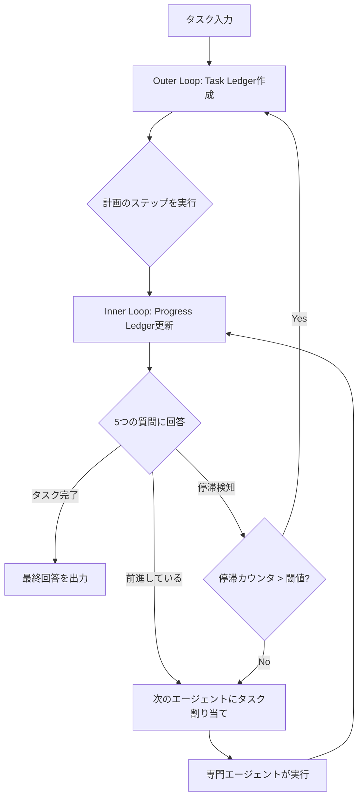

本記事は [Magentic-One: A Generalist Multi-Agent System for Solving Complex Tasks (arXiv:2411.04468)](https://arxiv.org/abs/2411.04468) の解説記事です。

## 論文概要（Abstract）

Magentic-Oneは、Microsoftが提案する汎用マルチエージェントシステムである。Orchestratorエージェントが二重ループ（Outer Loop / Inner Loop）でタスク台帳（task ledger）と進捗台帳（progress ledger）を管理し、4つの専門エージェント（WebSurfer, FileSurfer, Coder, ComputerTerminal）にタスクを動的に割り当てる。著者らは、GAIA、AssistantBench、WebArenaの3つのベンチマークで評価を行い、汎用的なマルチエージェント構成でもタスク特化型システムに匹敵する性能が得られると報告している。

この記事は [Zenn記事: Semantic Kernel 5大オーケストレーションパターンをPython×C#で実装比較する](https://zenn.dev/0h_n0/articles/a27bae62608bfd) の深掘りです。

## 情報源

- **arXiv ID**: 2411.04468
- **URL**: [https://arxiv.org/abs/2411.04468](https://arxiv.org/abs/2411.04468)
- **著者**: Adam Fourney, Gagan Bansal, Hussein Mozannar, et al.（Microsoft）
- **発表年**: 2024
- **分野**: cs.AI, cs.MA

## 背景と動機（Background & Motivation）

Webブラウジング、ファイル操作、コード実行といった異種ツールを横断する複雑なタスクでは、単一エージェントがすべてのスキルを備えることは困難であり、プロンプト長の肥大化で性能が劣化する問題もある。

従来のマルチエージェント研究では、タスクごとにエージェント構成を手動設計する手法が主流であったが、ドメインが変わるたびに再設計が必要で汎用性に欠けていた。エージェント間の協調も固定的なパイプラインが多く、実行中のエラー回復や計画の動的修正が困難であった。

Magentic-Oneは、Orchestratorによる動的計画と自己修正を核に、タスク非依存な汎用マルチエージェントアーキテクチャを実現しようとする試みである。

## 主要な貢献（Key Contributions）

- **貢献1**: Ledger-Based Orchestrationの提案 — 二重台帳によるOuter/Inner Loopの計画・実行・自己修正フレームワーク
- **貢献2**: 4種類の専門エージェントによる汎用タスク分解 — タスク固有のカスタマイズなしに複数ベンチマークで競争力のある性能を達成
- **貢献3**: GAIA、AssistantBench、WebArenaでの体系的評価とアブレーション分析
- **貢献4**: AutoGenBenchの公開 — マルチエージェントシステムの再現可能な評価ツール

## 技術的詳細（Technical Details）

### Orchestratorの二重ループアーキテクチャ

Magentic-Oneの中核はOrchestratorエージェントの二重ループ構造である。



**Outer Loop**では、Orchestratorがタスク全体を分析してTask Ledgerを構築する。Task Ledgerには以下の4カテゴリで情報を整理する:

1. **与えられた事実（Given Facts）**: タスク文から直接得られる情報
2. **検索で調べる事実（Facts to look up）**: Web検索やファイル参照で確認が必要な情報
3. **推論で導出する事実（Facts to derive）**: 計算やコード実行で得る情報
4. **推測（Educated guesses）**: 確信度が低い仮定

これらに基づき、自然言語でステップバイステップの計画を生成する。

**Inner Loop**では、各イテレーションでOrchestratorが以下の5つの質問に回答し、Progress Ledgerを更新する:

$$
\text{Progress}(t) = f\bigl(\text{TaskLedger}, \text{History}(1:t), Q_1, Q_2, Q_3, Q_4, Q_5\bigr)
$$

ここで、
- $t$: 現在のイテレーション番号
- $\text{History}(1:t)$: 1回目から$t$回目までのエージェント実行履歴
- $Q_1$: タスクは完了したか？
- $Q_2$: チームがループ（同じ行動の繰り返し）に陥っていないか？
- $Q_3$: 前進しているか？
- $Q_4$: 次にどのエージェントが行動すべきか？
- $Q_5$: そのエージェントにどんな指示を出すべきか？

停滞カウンタ$s$が閾値$\tau$を超えた場合（論文の実験では$\tau = 2$）、Outer Loopに戻りTask Ledgerを再構築する。これにより、行き詰まった際の自己修正が可能になる。

### 専門エージェント群

Magentic-Oneは以下の4つの専門エージェントを備える。

| エージェント | 役割 | 特徴 |
|-------------|------|------|
| WebSurfer | Webブラウジング | Chromiumベースのブラウザ操作。set-of-marks promptingでUI要素を座標にグラウンディング |
| FileSurfer | ファイル閲覧 | 読み取り専用。PDF, Office, 画像, 動画, 音声ファイルに対応 |
| Coder | コード生成 | コード生成・デバッグ専門のLLMエージェント。直接実行はしない |
| ComputerTerminal | コード実行 | PythonコードとShellコマンドの実行環境。Coderが生成したコードを実行 |

各エージェントはOrchestratorからの指示に従い、実行結果をOrchestratorに返却する。エージェント同士は直接通信せず、すべてOrchestratorを経由する星型トポロジーを採用している。

### Ledger更新のアルゴリズム

```python
from dataclasses import dataclass, field
from enum import Enum


class AgentType(Enum):
    """利用可能な専門エージェントの種別。"""
    WEB_SURFER = "WebSurfer"
    FILE_SURFER = "FileSurfer"
    CODER = "Coder"
    COMPUTER_TERMINAL = "ComputerTerminal"


@dataclass
class TaskLedger:
    """タスク全体の計画と事実を管理する台帳。"""
    given_facts: list[str] = field(default_factory=list)
    facts_to_lookup: list[str] = field(default_factory=list)
    facts_to_derive: list[str] = field(default_factory=list)
    guesses: list[str] = field(default_factory=list)
    plan_steps: list[str] = field(default_factory=list)


@dataclass
class ProgressLedger:
    """Inner Loopの進捗管理台帳。"""
    is_complete: bool = False
    is_stuck: bool = False
    is_progressing: bool = True
    next_agent: AgentType | None = None
    instruction: str = ""
    stall_counter: int = 0


def orchestrator_inner_loop(
    task_ledger: TaskLedger,
    history: list[dict],
    stall_threshold: int = 2,
) -> ProgressLedger:
    """Inner Loop 1イテレーション: 5質問に回答しProgress Ledgerを更新する。

    Args:
        task_ledger: 現在のTask Ledger
        history: エージェント実行履歴
        stall_threshold: 停滞閾値（論文では2）

    Returns:
        更新されたProgress Ledger
    """
    ledger = ProgressLedger()
    ledger.is_complete = evaluate_completion(task_ledger, history)  # Q1
    if ledger.is_complete:
        return ledger
    ledger.is_stuck = detect_loop(history)                         # Q2
    ledger.is_progressing = assess_progress(task_ledger, history)   # Q3

    if not ledger.is_progressing or ledger.is_stuck:
        ledger.stall_counter += 1
    if ledger.stall_counter > stall_threshold:
        raise StallThresholdExceeded("Outer Loopへ戻りTask Ledger再構築")

    ledger.next_agent = select_next_agent(task_ledger, history)    # Q4
    ledger.instruction = generate_instruction(                     # Q5
        task_ledger, history, ledger.next_agent)
    return ledger
```

## 実装のポイント（Implementation）

Magentic-Oneの実装にあたり、著者らが報告している設計上の要点を整理する。

**set-of-marks prompting（WebSurfer）**: ブラウザのスクリーンショットにUI要素ごとの番号付きマークを付与し、LLMがクリック対象をマーク番号で指定する。座標指定の精度問題を回避する手法である。

**エージェント間の情報伝達**: 各エージェントは実行結果をテキスト形式でOrchestratorに返す。画像やバイナリデータは要約テキストに変換され、コンテキストウィンドウの圧迫を抑える。

**停滞検知と自己修正**: Inner Loopの5質問による停滞検知は、Orchestratorが「なぜ停滞しているか」を分析してから計画を修正する。ただし、エラー分析（後述）が示すとおり、persistent-inefficient-actionsが主要な失敗モードとして残っている。

**モジュラー設計**: AutoGenフレームワーク上に構築されており、エージェントの追加・削除やバックエンドLLMの交換が容易である。

## Production Deployment Guide

マルチエージェントオーケストレーションシステムをAWSにデプロイするケースを想定する。コスト試算は2026年9月時点のAWS ap-northeast-1料金に基づく概算値であり、トラフィックパターンにより変動する。

### AWS実装パターン（コスト最適化重視）

| 構成 | トラフィック | アーキテクチャ | 月額概算 |
|------|-------------|--------------|---------|
| Small | ~100 req/日 | Lambda + Bedrock + DynamoDB | $80-180 |
| Medium | ~1,000 req/日 | ECS Fargate + Bedrock + ElastiCache | $400-900 |
| Large | 10,000+ req/日 | EKS + Karpenter + Spot + Bedrock | $2,500-5,500 |

**Small構成の内訳**: Lambda ~$5、Bedrock ~$50-120（トークン量依存）、DynamoDB ~$5（On-Demand）、Step Functions ~$3、CloudWatch ~$5。**Large構成の内訳**: EKS ~$73、Spot m6i.xlarge x3 ~$120（90%削減）、Bedrock Batch ~$1,500-3,500（50%削減）、ElastiCache ~$100、ALB+NAT ~$80。

**コスト削減テクニック**: Spot Instancesで最大90%削減、Bedrock Batch APIで50%削減、Prompt Cachingで30-90%削減、Reserved 1年コミットで最大72%削減。

### Terraformインフラコード

**Small構成（Serverless）**:

```hcl
# Lambda + Bedrock + DynamoDB（最小権限IAM）
resource "aws_iam_role" "orchestrator" {
  name               = "magentic-one-orchestrator"
  assume_role_policy = jsonencode({
    Version = "2012-10-17"
    Statement = [{ Action = "sts:AssumeRole", Effect = "Allow",
                   Principal = { Service = "lambda.amazonaws.com" } }]
  })
}

resource "aws_iam_role_policy" "bedrock" {
  role = aws_iam_role.orchestrator.id
  policy = jsonencode({
    Version = "2012-10-17"
    Statement = [
      { Effect = "Allow", Action = ["bedrock:InvokeModel"],
        Resource = "arn:aws:bedrock:ap-northeast-1::foundation-model/*" },
      { Effect = "Allow", Action = ["dynamodb:GetItem","dynamodb:PutItem","dynamodb:Query"],
        Resource = aws_dynamodb_table.ledger.arn },
    ]
  })
}

resource "aws_dynamodb_table" "ledger" {
  name = "magentic-one-ledger"
  billing_mode = "PAY_PER_REQUEST"  # On-Demand: 低トラフィック最適
  hash_key = "task_id"; range_key = "ledger_type"
  attribute { name = "task_id"; type = "S" }
  attribute { name = "ledger_type"; type = "S" }
  server_side_encryption { enabled = true }  # KMS暗号化
  ttl { attribute_name = "expires_at"; enabled = true }
}

resource "aws_lambda_function" "orchestrator" {
  function_name = "magentic-one-orchestrator"
  runtime = "python3.12"; handler = "orchestrator.handler"
  role = aws_iam_role.orchestrator.arn
  timeout = 900; memory_size = 512
  environment { variables = { LEDGER_TABLE = aws_dynamodb_table.ledger.name,
    STALL_THRESHOLD = "2", MODEL_ID = "anthropic.claude-sonnet-4-20250514" } }
  tracing_config { mode = "Active" }  # X-Ray有効化
}
```

**Large構成（EKS + Karpenter）**:

```hcl
module "eks" {
  source = "terraform-aws-modules/eks/aws"; version = "~> 20.24"
  cluster_name = "magentic-one"; cluster_version = "1.31"
  cluster_endpoint_public_access = false  # プライベートのみ
  vpc_id = module.vpc.vpc_id; subnet_ids = module.vpc.private_subnets
}

# Karpenter: Spot優先で自動スケーリング
resource "kubectl_manifest" "nodepool" {
  yaml_body = yamlencode({
    apiVersion = "karpenter.sh/v1", kind = "NodePool"
    metadata = { name = "agents" }
    spec = { template = { spec = { requirements = [
      { key = "karpenter.sh/capacity-type", operator = "In", values = ["spot","on-demand"] },
      { key = "node.kubernetes.io/instance-type", operator = "In",
        values = ["m6i.xlarge","m7i.xlarge"] }
    ] } }, limits = { cpu = "64" },
    disruption = { consolidationPolicy = "WhenEmptyOrUnderutilized", consolidateAfter = "30s" } }
  })
}

resource "aws_budgets_budget" "monthly" {
  name = "magentic-one"; budget_type = "COST"
  limit_amount = "5000"; limit_unit = "USD"; time_unit = "MONTHLY"
  notification { comparison_operator = "GREATER_THAN", threshold = 80,
    threshold_type = "PERCENTAGE", notification_type = "ACTUAL",
    subscriber_email_addresses = ["ops@example.com"] }
}
```

### 運用・監視設定

**CloudWatch Logs Insights（トークン使用量・レイテンシ）**:

```
fields @timestamp, @message
| filter @message like /inputTokenCount/
| stats sum(inputTokenCount) as input, sum(outputTokenCount) as output by bin(1h)
```

```
fields duration_ms | filter event = "agent_execution"
| stats percentile(duration_ms, 95) as p95, percentile(duration_ms, 99) as p99 by agent_type
```

**X-Ray + CloudWatch アラーム（Python）**:

```python
import boto3
from aws_xray_sdk.core import xray_recorder, patch_all


def setup_monitoring(sns_arn: str) -> None:
    """X-Ray計装とBedrockトークンスパイクアラームを設定する。"""
    xray_recorder.configure(service="magentic-one")
    patch_all()
    boto3.client("cloudwatch", region_name="ap-northeast-1").put_metric_alarm(
        AlarmName="magentic-one-token-spike", Namespace="AWS/Bedrock",
        MetricName="InputTokenCount", Statistic="Sum", Period=3600,
        EvaluationPeriods=1, Threshold=500_000,
        ComparisonOperator="GreaterThanThreshold", AlarmActions=[sns_arn])


def get_daily_cost(project: str = "magentic-one") -> dict[str, float]:
    """Cost Explorer APIで日次コストを取得し$100超過で通知する。"""
    import datetime
    ce = boto3.client("ce", region_name="us-east-1")
    today = datetime.date.today()
    resp = ce.get_cost_and_usage(
        TimePeriod={"Start": (today - datetime.timedelta(1)).isoformat(), "End": today.isoformat()},
        Granularity="DAILY", Metrics=["UnblendedCost"],
        GroupBy=[{"Type": "DIMENSION", "Key": "SERVICE"}],
        Filter={"Tags": {"Key": "Project", "Values": [project]}})
    costs = {g["Keys"][0]: float(g["Metrics"]["UnblendedCost"]["Amount"])
             for g in resp["ResultsByTime"][0]["Groups"]}
    if sum(costs.values()) > 100.0:
        notify_cost_alert(sum(costs.values()), costs)
    return costs
```

### コスト最適化チェックリスト

**アーキテクチャ選択**: トラフィック100 req/日未満はServerless、100-5,000はHybrid、5,000+はContainer。

**リソース最適化**(6項目): Spot優先(90%削減) / Reserved 1年(72%削減) / Savings Plans / Lambda Power Tuning(512MBスタート) / Karpenter自動削除(30s) / VPCエンドポイントでNAT削除

**LLMコスト削減**(5項目): Batch API(50%削減) / Prompt Caching(30-90%削減) / Haiku/Sonnet振り分け / max_tokens制限(計画2048,実行4096) / Ledgerキャッシュ

**監視・アラート**(4項目): Budgets 80%通知 / CloudWatchトークン量アラーム / Cost Anomaly Detection / 日次レポート$100超過通知

**リソース管理**(5項目): 月次未使用リソース削除 / `Project`タグ付与 / DynamoDB TTL 7日 / 開発環境夜間停止 / ログ保持30日

## 実験結果（Results）

著者らは、GAIA、AssistantBench、WebArenaの3ベンチマークでMagentic-Oneを評価している。以下の結果は論文Table 1-3より引用する。

### GAIA（テストセット）

| 手法 | Level 1 | Level 2 | Level 3 | 全体 |
|------|---------|---------|---------|------|
| Magentic-One (GPT-4o) | — | — | — | 32.33% ± 5.3 |
| Magentic-One (GPT-4o + o1-preview) | — | — | — | 38.00% ± 5.5 |
| omne v0.1（最良ベースライン） | — | — | — | 40.53% |

### AssistantBench

| 手法 | Exact Match | Accuracy |
|------|------------|----------|
| Magentic-One (GPT-4o) | 11.0% | 25.3% |
| Magentic-One (GPT-4o + o1-preview) | 13.3% | 27.7% |

### WebArena

| 手法 | 成功率 |
|------|--------|
| Magentic-One (GPT-4o) | 32.8% ± 3.2 |
| Jace.AI（最良ベースライン） | 57.1% |

GAIAではo1-preview併用で約6ポイント改善するが、タスク特化型のomne v0.1には及ばない。WebArenaではJace.AIとの差が約24ポイントあり、汎用構成の限界を示唆している。

### アブレーション分析（論文Table 4より）

| 除去対象 | 性能低下率 |
|---------|-----------|
| Ledger（Task/Progress両方） | 31% |
| WebSurfer | 21-39%（Level 1に最も影響） |
| FileSurfer | 21-39%（Level 2に最も影響） |
| Coder + ComputerTerminal | 21-39% |

Ledger除去の影響が最も大きく、計画・進捗管理機構がシステム全体の性能に不可欠であることを示している。

## 実運用への応用（Practical Applications）

Magentic-Oneのアーキテクチャは、Semantic Kernelのオーケストレーションパターンと密接に関連している。Zenn記事の5大パターンのうち、Planner（計画→実行）やHandoff（エージェント間委譲）パターンの設計時に参考になる。

**実運用での適用候補**:
- **社内ナレッジ検索**: WebSurfer + FileSurfer相当のエージェントで社内文書とWebを横断検索し、Coderでデータ集約
- **カスタマーサポート自動化**: Orchestratorがチケットの種別を判定し、適切な専門エージェントに振り分け
- **データパイプライン構築**: CoderとComputerTerminal相当のエージェントでETL処理を自動生成・実行

**実運用での課題**:
論文のエラー分析で報告されている3つの主要な失敗モード — persistent-inefficient-actions（失敗したアクションの繰り返し）、insufficient-verification-steps（検証不足での完了マーク）、underutilized-resource-options（利用可能なリソースの未活用） — はいずれもプロダクション環境でコスト増大やSLA違反に直結する。停滞閾値やリトライ回数の上限設定、実行ステップ数に応じたコスト制御が不可欠である。

## 関連研究（Related Work）

- **AutoGen (Wu et al., 2023)**: Magentic-Oneの基盤フレームワーク。対話プロトコルを定義するが、Ledger-Based Orchestrationのような動的計画機構は含まない
- **MetaGPT (Hong et al., 2023)**: SOPに基づき役割を固定的に割り当てる設計で、Magentic-Oneの動的エージェント選択とは思想が異なる
- **Semantic Kernel**: Magentic-Oneで実証されたLedger-Based OrchestrationはSemantic KernelのPlannerやHandoffパターンの設計指針として活用できる

## まとめと今後の展望

Magentic-Oneは、二重ループ型Ledger-Based Orchestrationにより、タスク固有のカスタマイズなしに複数ベンチマークで競争力のある性能を達成した。アブレーション分析ではLedger機構が性能の31%に寄与している。

一方、タスク特化型システムとの性能差（WebArenaで約24ポイント）や失敗モードは課題として残る。著者らは自己改善メカニズムの強化、停滞検知の高精度化、エージェント構成の自動最適化を今後の方向として挙げている。

## 参考文献

- **arXiv**: [https://arxiv.org/abs/2411.04468](https://arxiv.org/abs/2411.04468)
- **Code**: [https://github.com/microsoft/autogen/tree/main/python/packages/autogen-magentic-one](https://github.com/microsoft/autogen/tree/main/python/packages/autogen-magentic-one)
- **AutoGen**: [https://github.com/microsoft/autogen](https://github.com/microsoft/autogen)
- **Related Zenn article**: [https://zenn.dev/0h_n0/articles/a27bae62608bfd](https://zenn.dev/0h_n0/articles/a27bae62608bfd)
