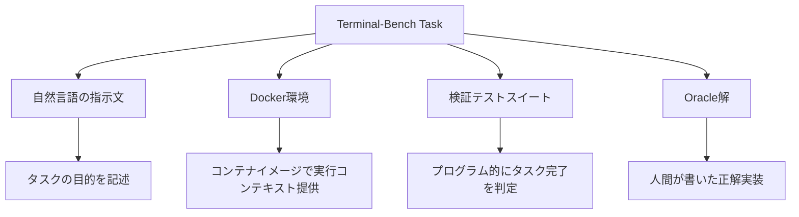

本記事は [Terminal-Bench: Benchmarking Agents on Hard, Realistic Tasks in Command Line Interfaces (arXiv:2601.11868)](https://arxiv.org/abs/2601.11868) の解説記事です。

## 論文概要（Abstract）

Terminal-Benchは、ターミナル環境における89の現実的なタスクでAIエージェントを評価するベンチマークである。各タスクは固有のDocker環境、人間が作成した解法（Oracle解）、検証テストスイートの4要素で構成される。著者らは、フロンティアモデルおよびエージェントがこのベンチマークで65%未満のスコアにとどまると報告しており、CLIタスクにおけるAIエージェントの課題を定量的に示している。

この記事は [Zenn記事: Claude Agent SDKで評価ハーネスを構築しTerminal-Benchの成功率を回帰検証する](https://zenn.dev/0h_n0/articles/1e791e8f0cc2a2) の深掘りです。

## 情報源

- **arXiv ID**: 2601.11868
- **URL**: [https://arxiv.org/abs/2601.11868](https://arxiv.org/abs/2601.11868)
- **著者**: Mike A. Merrill, Alexander G. Shaw, Nicholas Carlini, et al.（85名）
- **発表年**: 2026
- **分野**: cs.SE, cs.AI

## 背景と動機（Background & Motivation）

従来のコーディングベンチマーク（HumanEval、MBPPなど）は、孤立した関数生成タスクに限定されており、実際の開発ワークフローで求められるマルチステップの問題解決能力を評価できていなかった。SWE-benchはGitHubのIssue解決を対象としたが、これもソフトウェアエンジニアリングの一部分に限られる。

一方、実務のエンジニアは日常的にターミナルを使い、コンパイル、デバッグ、システム設定、セキュリティ調査、データ分析など多岐にわたるタスクをCLI上で遂行している。こうした「end-to-endのCLIワークフロー」を評価するベンチマークは存在しなかった。Terminal-Benchはこのギャップを埋めるために設計されている。

## 主要な貢献（Key Contributions）

- **貢献1**: 89の手作業で作成・検証されたCLIタスクからなるベンチマークの構築。タスクあたり平均3時間の人間による監査を経ている
- **貢献2**: 16のフロンティアモデル・エージェントの体系的評価。最高スコアでも65%未満であることの実証
- **貢献3**: エラー分析による改善領域の特定と、評価ハーネスおよびデータセットの公開（[tbench.ai](https://www.tbench.ai/)）

## 技術的詳細（Technical Details）

### タスク構造

Terminal-Benchの各タスクは以下の4要素で構成される。



タスクは16カテゴリに分類され、難易度はeasy・medium・hardの3段階で設定されている。

| カテゴリ | 概要 |
|---------|------|
| ソフトウェアエンジニアリング | コンパイル、ビルドシステム設定、依存関係解決 |
| セキュリティ | 脆弱性調査、暗号解析、フォレンジック |
| 科学計算 | 数値シミュレーション、データ処理パイプライン |
| データサイエンス | ETL処理、統計分析、可視化 |
| 機械学習 | モデル訓練、ハイパーパラメータ調整 |
| システム管理 | ネットワーク設定、プロセス管理 |
| デバッグ | ログ解析、クラッシュ再現、根本原因分析 |

### Docker隔離環境

各タスクは独立したDocker環境で実行される。これにより以下の利点が得られる。

1. **再現性**: 環境依存の問題を排除し、同一条件での評価を保証
2. **安全性**: `--network none`オプションにより外部API呼び出しを遮断（暗記した答えの使用を防止）
3. **独立性**: タスク間の状態汚染を防止

```python
# Terminal-Benchのタスク実行フロー（論文のアプローチを簡略化）
import subprocess
from dataclasses import dataclass


@dataclass
class TaskSpec:
    task_id: str
    instruction: str
    docker_image: str
    verification_command: str
    timeout_seconds: int = 600


def execute_task(spec: TaskSpec, agent_output: str) -> bool:
    """タスクを実行し、検証テストで合否判定する。

    Args:
        spec: タスク仕様
        agent_output: エージェントの出力（環境への変更を含む）

    Returns:
        検証テストの合否
    """
    result = subprocess.run(
        ["docker", "exec", f"eval-{spec.task_id}",
         "bash", "-c", spec.verification_command],
        capture_output=True, text=True,
        timeout=spec.timeout_seconds,
    )
    return result.returncode == 0
```

### 検証テスト設計

著者らは検証テストの品質を「ベンチマークの信頼性の根幹」と位置付けている。各タスクの検証テストは以下の条件を満たすように設計されている。

1. **Oracle解での通過**: 人間が書いた正解実装が必ずテストを通過すること
2. **部分解の検出**: 不完全な解法を適切に不合格とすること
3. **偽陽性の排除**: 正解でないにもかかわらず通過するケースを排除すること

検証テストの設計では、出力ファイルの内容チェック、環境状態の検証、プロセスの実行結果確認など、複数の観点からタスク完了を判定する。

### 品質保証プロセス

著者らは各タスクに対して複数ラウンドのレビューを実施し、タスクあたり平均3時間の人間の注意を投入したと報告している。このプロセスには以下が含まれる。

- タスク指示文の明確性チェック
- Docker環境の動作確認
- Oracle解の正当性検証
- 検証テストのエッジケース確認
- 外部評価者による独立レビュー

## 実験結果（Results）

### フロンティアモデルの性能

Terminal-Bench 2.0の初期評価（2026年1月時点、論文Table 1相当）では、16のフロンティアモデル・エージェントのうち最高スコアが65%未満であった。

Terminal-Bench 2.1（2026年中期の更新版リーダーボード、[artificialanalysis.ai](https://artificialanalysis.ai/evaluations/terminalbench-2-1)より）では、モデルの進化に伴いスコアが向上している。

| モデル | Terminal-Bench 2.1 スコア | 備考 |
|--------|-------------------------|------|
| Claude Fable 5.1 (Adaptive, Max Effort) | 91.4% | リーダーボードで報告された最高スコア |
| Claude Fable 5.1 (Adaptive, Xhigh) | 91.0% | - |
| GPT-5.6 Sol (Xhigh) | 89.5% | - |
| Claude Opus 5 | 89.1% | - |
| Claude Fable 5.1 (Adaptive, High) | 89.9% | - |

上記スコアは[Artificial Analysis](https://artificialanalysis.ai/evaluations/terminalbench-2-1)のリーダーボード（2026年9月時点）で報告されている値である。論文発表時点（2026年1月）の65%未満から、約8ヶ月で89%超へと大幅に向上している。

### カテゴリ別の分析

著者らのエラー分析によると、以下の傾向が確認されている。

- **得意領域**: 構造化されたソフトウェアエンジニアリングタスク（テスト実行、ビルド修正など）
- **苦手領域**: セキュリティ関連タスク（暗号解析、フォレンジック）、長いコンテキストを要するデバッグ
- **失敗パターン**: 環境の前提条件の誤認、ツールの使用順序の誤り、タイムアウト

## 実装のポイント（Implementation）

Terminal-Benchの評価ハーネスを自プロジェクトに適用する際の実装上の注意点を述べる。

### Docker環境の準備

各タスクのDockerイメージは、必要なパッケージを事前にインストールした状態で提供される。`--network none`を使用する場合、pip/npm等のパッケージマネージャは使用できないため、依存関係はすべてイメージ内に含める必要がある。

```python
# Dockerfileの例（タスク固有の環境構築）
# FROM python:3.12-slim
# RUN pip install --no-cache-dir pytest numpy pandas
# COPY task_files/ /workspace/
# WORKDIR /workspace

async def create_isolated_environment(
    docker_image: str,
    task_id: str,
    timeout_seconds: int = 600,
    memory_limit: str = "2g",
    cpu_limit: str = "2",
) -> str:
    """隔離されたタスク実行環境を作成する。

    Args:
        docker_image: タスク固有のDockerイメージ
        task_id: タスクID
        timeout_seconds: タイムアウト（秒）
        memory_limit: メモリ制限
        cpu_limit: CPU制限

    Returns:
        コンテナID
    """
    import asyncio
    import uuid

    container_name = f"tbench-{task_id}-{uuid.uuid4().hex[:8]}"
    proc = await asyncio.create_subprocess_exec(
        "docker", "run", "-d",
        "--name", container_name,
        "--memory", memory_limit,
        "--cpus", cpu_limit,
        "--network", "none",
        docker_image,
        "sleep", str(timeout_seconds + 60),
        stdout=asyncio.subprocess.PIPE,
    )
    stdout, _ = await proc.communicate()
    return stdout.decode().strip()
```

### 評価ハーネスとの統合

Terminal-Benchのタスク定義をJSON形式で管理し、FAIL_TO_PASS / PASS_TO_PASSの分類を追加することで、回帰検証に利用できる。

```python
from typing import TypedDict


class RegressionSpec(TypedDict):
    fail_to_pass: list[str]
    pass_to_pass: list[str]


class TaskDefinition(TypedDict):
    id: str
    category: str
    description: str
    difficulty: str
    docker_image: str
    timeout_seconds: int
    verification_command: str
    regression: RegressionSpec


def classify_tests(
    baseline_results: dict[str, bool],
    current_results: dict[str, bool],
) -> RegressionSpec:
    """テスト結果をFAIL_TO_PASS / PASS_TO_PASSに分類する。

    Args:
        baseline_results: ベースラインでのテスト結果
        current_results: 現在のテスト結果

    Returns:
        回帰検証用の分類結果
    """
    fail_to_pass = [
        tid for tid, passed in baseline_results.items()
        if not passed and current_results.get(tid, False)
    ]
    pass_to_pass = [
        tid for tid, passed in baseline_results.items()
        if passed
    ]
    return RegressionSpec(
        fail_to_pass=fail_to_pass,
        pass_to_pass=pass_to_pass,
    )
```

## Production Deployment Guide

### AWS実装パターン（コスト最適化重視）

Terminal-Benchスタイルの評価パイプラインをAWSにデプロイする場合のアーキテクチャを示す。

**トラフィック量別の推奨構成**:

| 規模 | 月間評価回数 | 推奨構成 | 月額コスト | 主要サービス |
|------|------------|---------|-----------|------------|
| **Small** | ~100回 | Serverless | $80-200 | Lambda + CodeBuild + DynamoDB |
| **Medium** | ~1,000回 | Hybrid | $500-1,200 | ECS Fargate + ECR + ElastiCache |
| **Large** | 5,000回+ | Container | $3,000-8,000 | EKS + Karpenter + EC2 Spot |

**Small構成の詳細**（月額$80-200）:
- **Lambda**: 評価トリガー・結果集約（$15/月）
- **CodeBuild**: Docker内タスク実行（$40/月、build.general1.medium）
- **DynamoDB**: 評価結果・ベースライン保存（On-Demand、$10/月）
- **ECR**: タスクDockerイメージ格納（$10/月）
- **S3**: ログ・アーティファクト保存（$5/月）

**Medium構成の詳細**（月額$500-1,200）:
- **ECS Fargate**: タスク実行（0.5 vCPU × 2GB RAM × 4タスク、$180/月）
- **ECR**: イメージ管理（$15/月）
- **ElastiCache Redis**: 結果キャッシュ（cache.t3.micro、$15/月）
- **CodeBuild**: Docker-in-Docker実行（$200/月）
- **CloudWatch**: 詳細監視（$20/月）

**Large構成の詳細**（月額$3,000-8,000）:
- **EKS**: コントロールプレーン（$72/月）
- **EC2 Spot**: g5.xlarge × 2-4台（平均$800/月、Spot利用で最大90%削減）
- **Karpenter**: 自動スケーリング（追加コストなし）
- **CodeBuild**: 並列ビルド（$500/月）
- **S3 + DynamoDB**: データストレージ（$50/月）

**コスト削減テクニック**:
- Spot Instances活用で最大90%削減（EKS + Karpenter）
- Reserved Instances購入で最大72%削減（1年コミット）
- CodeBuildのキャッシュ活用でビルド時間短縮
- DynamoDB On-Demandモードで低頻度利用時のコスト最適化
- 評価実行のない時間帯はAuto Scaling to Zero

**コスト試算の注意事項**:
- 上記は2026年9月時点のAWS ap-northeast-1（東京）リージョン料金に基づく概算値です
- 実際のコストはタスク数、実行頻度、コンテナサイズにより変動します
- 最新料金は [AWS料金計算ツール](https://calculator.aws/) で確認してください

### Terraformインフラコード

**Small構成 (Serverless): Lambda + CodeBuild + DynamoDB**

```hcl
module "vpc" {
  source  = "terraform-aws-modules/vpc/aws"
  version = "~> 5.0"

  name = "eval-harness-vpc"
  cidr = "10.0.0.0/16"
  azs  = ["ap-northeast-1a", "ap-northeast-1c"]
  private_subnets = ["10.0.1.0/24", "10.0.2.0/24"]

  enable_nat_gateway   = false
  enable_dns_hostnames = true
}

resource "aws_iam_role" "eval_lambda" {
  name = "eval-harness-lambda-role"

  assume_role_policy = jsonencode({
    Version = "2012-10-17"
    Statement = [{
      Action = "sts:AssumeRole"
      Effect = "Allow"
      Principal = { Service = "lambda.amazonaws.com" }
    }]
  })
}

resource "aws_iam_role_policy" "eval_permissions" {
  role = aws_iam_role.eval_lambda.id

  policy = jsonencode({
    Version = "2012-10-17"
    Statement = [
      {
        Effect   = "Allow"
        Action   = ["codebuild:StartBuild", "codebuild:BatchGetBuilds"]
        Resource = aws_codebuild_project.task_runner.arn
      },
      {
        Effect   = "Allow"
        Action   = ["dynamodb:PutItem", "dynamodb:GetItem", "dynamodb:Query"]
        Resource = aws_dynamodb_table.eval_results.arn
      }
    ]
  })
}

resource "aws_lambda_function" "eval_trigger" {
  filename      = "eval_trigger.zip"
  function_name = "eval-harness-trigger"
  role          = aws_iam_role.eval_lambda.arn
  handler       = "index.handler"
  runtime       = "python3.12"
  timeout       = 300
  memory_size   = 512

  environment {
    variables = {
      DYNAMODB_TABLE = aws_dynamodb_table.eval_results.name
      CODEBUILD_PROJECT = aws_codebuild_project.task_runner.name
    }
  }
}

resource "aws_codebuild_project" "task_runner" {
  name         = "eval-task-runner"
  service_role = aws_iam_role.codebuild_role.arn

  artifacts { type = "NO_ARTIFACTS" }

  environment {
    compute_type    = "BUILD_GENERAL1_MEDIUM"
    image           = "aws/codebuild/standard:7.0"
    type            = "LINUX_CONTAINER"
    privileged_mode = true
  }

  source {
    type      = "NO_SOURCE"
    buildspec = file("buildspec.yml")
  }
}

resource "aws_dynamodb_table" "eval_results" {
  name         = "eval-harness-results"
  billing_mode = "PAY_PER_REQUEST"
  hash_key     = "task_id"
  range_key    = "run_id"

  attribute {
    name = "task_id"
    type = "S"
  }
  attribute {
    name = "run_id"
    type = "S"
  }

  ttl {
    attribute_name = "expire_at"
    enabled        = true
  }
}

resource "aws_cloudwatch_metric_alarm" "eval_cost" {
  alarm_name          = "eval-harness-cost-spike"
  comparison_operator = "GreaterThanThreshold"
  evaluation_periods  = 1
  metric_name         = "EstimatedCharges"
  namespace           = "AWS/Billing"
  period              = 86400
  statistic           = "Maximum"
  threshold           = 500
  alarm_description   = "評価パイプラインのコスト異常検知"
}
```

**Large構成 (Container): EKS + Karpenter + Spot Instances**

```hcl
module "eks" {
  source  = "terraform-aws-modules/eks/aws"
  version = "~> 20.0"

  cluster_name    = "eval-harness-cluster"
  cluster_version = "1.31"

  vpc_id     = module.vpc.vpc_id
  subnet_ids = module.vpc.private_subnets

  cluster_endpoint_public_access = true
  enable_cluster_creator_admin_permissions = true
}

resource "kubectl_manifest" "karpenter_provisioner" {
  yaml_body = <<-YAML
    apiVersion: karpenter.sh/v1
    kind: NodePool
    metadata:
      name: eval-spot-pool
    spec:
      template:
        spec:
          requirements:
            - key: karpenter.sh/capacity-type
              operator: In
              values: ["spot"]
            - key: node.kubernetes.io/instance-type
              operator: In
              values: ["m5.xlarge", "m5.2xlarge", "c5.xlarge"]
          nodeClassRef:
            group: karpenter.k8s.aws
            kind: EC2NodeClass
            name: default
      limits:
        cpu: "64"
        memory: "256Gi"
      disruption:
        consolidationPolicy: WhenEmpty
        consolidateAfter: 30s
  YAML
}

resource "aws_budgets_budget" "eval_monthly" {
  name         = "eval-harness-monthly"
  budget_type  = "COST"
  limit_amount = "8000"
  limit_unit   = "USD"
  time_unit    = "MONTHLY"

  notification {
    comparison_operator        = "GREATER_THAN"
    threshold                  = 80
    threshold_type             = "PERCENTAGE"
    notification_type          = "ACTUAL"
    subscriber_email_addresses = ["ops@example.com"]
  }
}
```

### 運用・監視設定

**CloudWatch Logs Insights クエリ**:

```sql
-- 評価タスクの成功率推移
fields @timestamp, task_id, passed, duration_seconds
| stats avg(passed) as pass_rate, avg(duration_seconds) as avg_duration by bin(1d)
| sort @timestamp desc

-- 失敗タスクの分析
fields @timestamp, task_id, category, error_type
| filter passed = 0
| stats count(*) as fail_count by category, error_type
| sort fail_count desc
```

**CloudWatch アラーム**:

```python
import boto3

cloudwatch = boto3.client("cloudwatch")

cloudwatch.put_metric_alarm(
    AlarmName="eval-task-timeout-spike",
    ComparisonOperator="GreaterThanThreshold",
    EvaluationPeriods=2,
    MetricName="TaskTimeouts",
    Namespace="EvalHarness",
    Period=3600,
    Statistic="Sum",
    Threshold=10,
    AlarmDescription="評価タスクのタイムアウト異常増加",
    AlarmActions=["arn:aws:sns:ap-northeast-1:123456789:eval-alerts"],
)
```

**X-Ray トレーシング**:

```python
from aws_xray_sdk.core import xray_recorder, patch_all

patch_all()


@xray_recorder.capture("run_eval_task")
def run_eval_task(task_id: str, docker_image: str) -> dict:
    xray_recorder.put_annotation("task_id", task_id)
    xray_recorder.put_metadata("docker_image", docker_image)
    # ... タスク実行ロジック ...
    return {"task_id": task_id, "passed": True}
```

### コスト最適化チェックリスト

**アーキテクチャ選択**:
- [ ] ~100回/月 → Lambda + CodeBuild（Serverless）$80-200/月
- [ ] ~1,000回/月 → ECS Fargate + CodeBuild（Hybrid）$500-1,200/月
- [ ] 5,000回+/月 → EKS + Spot（Container）$3,000-8,000/月

**リソース最適化**:
- [ ] EC2: Spot Instances優先（最大90%削減、Karpenter自動管理）
- [ ] Reserved Instances: 1年コミットで72%削減
- [ ] CodeBuild: キャッシュ有効化でビルド時間短縮
- [ ] Lambda: メモリサイズ最適化（CloudWatch Insights分析）
- [ ] ECS/EKS: 非実行時のスケールダウン（夜間0台）

**Docker最適化**:
- [ ] マルチステージビルドでイメージサイズ削減
- [ ] ECRライフサイクルポリシーで古いイメージ自動削除
- [ ] レイヤーキャッシュの活用

**監視・アラート**:
- [ ] AWS Budgets: 月額予算設定（80%で警告、100%でアラート）
- [ ] CloudWatch: タスクタイムアウト・失敗率スパイク検知
- [ ] Cost Anomaly Detection: 自動異常検知
- [ ] 日次コストレポート: SNS/Slackへ自動送信

**リソース管理**:
- [ ] 未使用リソース削除: Trusted Advisor活用
- [ ] タグ戦略: 環境別・プロジェクト別でコスト可視化
- [ ] S3ライフサイクル: 古い評価ログ自動削除（90日）
- [ ] DynamoDB TTL: 古い結果レコード自動削除

## 実運用への応用（Practical Applications）

Terminal-Benchの設計思想は、自社のAIエージェント評価にそのまま適用できる。特に以下の点が実務に有用である。

1. **ゴールデンデータセットの構築**: 自社の開発ワークフローに基づくタスク定義を作成し、モデル更新時の回帰を検出する基盤とする
2. **Docker隔離による再現性確保**: `--network none`で外部依存を排除し、純粋なエージェント能力を測定する
3. **検証テスト設計**: 出力だけでなく環境状態も検証する多角的なテスト設計が、偽陽性の削減に寄与する
4. **CI/CDパイプラインとの統合**: PRごとにベンチマークを実行し、マージゲートとして機能させる

## 関連研究（Related Work）

- **SWE-bench** (Jimenez et al., 2024): GitHubのIssue解決を対象としたベンチマーク。Terminal-Benchとは評価対象が異なり、CLIタスク全般ではなくPythonリポジトリのバグ修正に特化している
- **AgentBench** (Liu et al., 2023): OS操作、データベース、ゲームなど多ドメインのエージェント評価。Terminal-Benchはより実務に即したCLIタスクに焦点を当てている
- **TerminalWorld** (2026): Terminal-Benchと類似のCLIタスクベンチマーク。タスクの自動合成エンジンを備える点が異なる

## まとめと今後の展望

Terminal-Benchは、89の現実的なCLIタスクを用いてAIエージェントの実践的な問題解決能力を評価するベンチマークである。論文発表時点で最高スコアが65%未満であったが、2026年9月時点のリーダーボードでは91.4%に到達しており、フロンティアモデルの急速な進化が確認できる。

評価ハーネスの構築においては、Docker隔離、多角的な検証テスト、回帰検出の自動化が重要な設計要素であり、これらは自社のCI/CDパイプラインに統合することで、モデル更新時の品質担保に活用できる。

## 参考文献

- **arXiv**: [https://arxiv.org/abs/2601.11868](https://arxiv.org/abs/2601.11868)
- **Website**: [https://www.tbench.ai/](https://www.tbench.ai/)
- **Leaderboard**: [Artificial Analysis - Terminal-Bench 2.1](https://artificialanalysis.ai/evaluations/terminalbench-2-1)
- **Related Zenn article**: [https://zenn.dev/0h_n0/articles/1e791e8f0cc2a2](https://zenn.dev/0h_n0/articles/1e791e8f0cc2a2)
