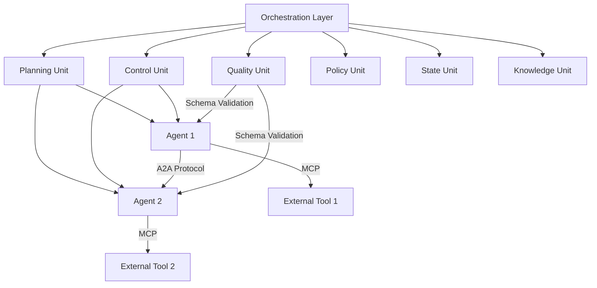
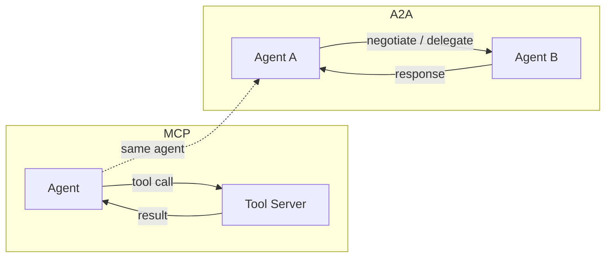

本記事は [The Orchestration of Multi-Agent Systems (arXiv:2601.13671)](https://arxiv.org/abs/2601.13671) の解説記事です。

## 論文概要（Abstract）

本論文は、マルチエージェントシステム（MAS）のオーケストレーションに関する統一的なフレームワークを提案している。著者らは、階層的オーケストレーション層を中心に、Model Context Protocol（MCP）によるツールアクセスとAgent-to-Agent Protocol（A2A）によるピアツーピア通信を統合するアーキテクチャを提示している。金融、ソフトウェア開発、カスタマーサポートにおけるエンタープライズ採用事例を通じて、オーケストレーションの実務上の有効性を分析している。

この記事は [Zenn記事: Semantic Kernel 5大オーケストレーションパターンをPython×C#で実装比較する](https://zenn.dev/0h_n0/articles/a27bae62608bfd) の深掘りです。

## 情報源

- **arXiv ID**: 2601.13671
- **URL**: [https://arxiv.org/abs/2601.13671](https://arxiv.org/abs/2601.13671)
- **著者**: Apoorva Adimulam, Rajesh Gupta, Sumit Kumar
- **発表年**: 2026
- **分野**: cs.MA, cs.AI

## 背景と動機（Background & Motivation）

単一のLLMエージェントが汎用タスクを処理する段階から、複数の専門エージェントが協調して複雑なワークフローを遂行する段階へと移行が進んでいる。しかし、複数エージェントの協調には以下の課題がある。

1. **タスク分解と順序制御**: 複合タスクをどのように分割し、依存関係を管理するか
2. **プロトコルの断片化**: ツールアクセス（MCP）とエージェント間通信（A2A）が個別に設計され、統一的な枠組みがない
3. **品質・ガバナンス**: 出力品質の保証、ポリシー遵守、障害時の回復をどう組み込むか

著者らは、これらの課題を解決するために、計画・制御・品質・ポリシー・状態・知識の6つのユニットを持つ階層的オーケストレーション層を提案している。この設計は、Semantic Kernelが実装する5つのオーケストレーションパターン（Sequential / Concurrent / Handoff / GroupChat / Magentic）の理論的基盤を提供するものと位置づけられる。

## 主要な貢献（Key Contributions）

- **貢献1**: 中央オーケストレーション層を中心とした階層的アーキテクチャの体系化。Planning Unit、Control Unit、Quality Unit、Policy Unit、State Unit、Knowledge Unitの6ユニットで構成される
- **貢献2**: MCPとA2Aを統一的に扱うプロトコル設計の提示。MCPがツール統合を、A2Aがエージェント間協調を担い、オーケストレーション層がこれらを監督する
- **貢献3**: 金融（保険引受95%以上精度、住宅ローン承認20倍高速化）、ソフトウェア開発（開発時間50%以上削減）、カスタマーサポート（80%のインシデント自動解決）のエンタープライズ事例分析
- **貢献4**: Sequential / Parallel / Handoff の3パターンとそのトレードオフの形式的な記述

## 技術的詳細（Technical Details）

### 階層的オーケストレーションアーキテクチャ

著者らが提案する階層的オーケストレーションは、中央のオーケストレーション層が全体のワークフローを管理し、分散エージェントがタスクを実行する構造である。



各ユニットの役割は以下の通りである。

| ユニット | 役割 | Semantic Kernelとの対応 |
|---------|------|----------------------|
| **Planning Unit** | タスク分解と実行順序の決定 | `SequentialOrchestration`の実行計画 |
| **Control Unit** | 並行実行と依存関係の管理 | `ConcurrentOrchestration`の同期制御 |
| **Quality Unit** | 出力のスキーマ検証 | `AgentGroupChat`のTermination条件 |
| **Policy Unit** | ガバナンス制約の適用 | `MagenticOrchestration`のポリシー層 |
| **State Unit** | チェックポイントとワークフロー進捗 | `HandoffOrchestration`の状態遷移 |
| **Knowledge Unit** | ドメイン知識の管理 | Kernel内のPlugin/Function体系 |

### MCPとA2Aプロトコル

著者らは、MASのプロトコル基盤として2つの相補的なプロトコルを位置づけている。

#### Model Context Protocol（MCP）

MCPはクライアント・サーバー設計でエージェントがクライアントとして外部ツールにアクセスする標準プロトコルである。著者らは以下の3つの保証を重要視している。

1. **スキーマの一貫性**: ツールのインターフェースが標準化され、異なるエージェントが同一ツールにアクセスできる
2. **アクセス制御**: ツールごとの権限管理が可能
3. **監査可能性**: すべてのツール呼び出しが記録される

MCPはステートレスとステートフルの両方の交換をサポートし、Semantic KernelのMicrosoft Agent Framework 1.0でもMCPサーバーとの接続がサポートされている。

#### Agent-to-Agent Protocol（A2A）

A2Aはピアツーピアのエージェント通信を管理するプロトコルである。MCPがエージェントとツールの関係を扱うのに対し、A2Aはエージェント同士の関係を扱う。



A2Aの主要な特徴は以下の通りである。

- **交渉と委譲**: エージェント間でタスクの交渉と委譲が可能
- **暗号署名**: メッセージの完全性と送信者の認証を保証
- **ロールベースルーティング**: エージェントの役割に基づいてメッセージを適切な宛先に転送

### オーケストレーションパターン

著者らは3つの基本的なオーケストレーションパターンを記述している。これらはSemantic Kernelの5パターンと以下のように対応する。

#### Sequential（逐次実行）

Planning Unitがタスクの実行順序を決定し、各エージェントが順番に処理する。

$$
\text{Output} = f_n \circ f_{n-1} \circ \cdots \circ f_1(\text{Input})
$$

ここで、$f_i$は$i$番目のエージェントの処理関数を表す。前のエージェントの出力が次のエージェントの入力となる。Semantic Kernelでは`SequentialOrchestration`に対応する。

#### Parallel（並行実行）

Control Unitが並行実行と同期を管理する。独立したサブタスクを同時に処理し、結果を集約する。

$$
\text{Output} = \text{Aggregate}\left(\{f_i(\text{Input}_i)\}_{i=1}^{k}\right)
$$

ここで、$k$は並行実行するエージェント数、$\text{Aggregate}$は結果集約関数である。Semantic Kernelでは`ConcurrentOrchestration`に対応する。

#### Handoff / Delegation（委譲）

A2Aプロトコルを通じて、ワーカーエージェントがサブタスクを別のエージェントに委譲する。著者らは「A2Aはオーケストレーション層によって監督される」と述べており、完全に自律的なピアツーピア通信ではなく、監督付きの委譲である点が重要である。Semantic Kernelでは`HandoffOrchestration`に対応する。

```python
from dataclasses import dataclass, field
from enum import Enum
from typing import Any


class OrchestrationPattern(Enum):
    """オーケストレーションパターンの定義。"""
    SEQUENTIAL = "sequential"
    PARALLEL = "parallel"
    HANDOFF = "handoff"


@dataclass
class AgentTask:
    """エージェントに割り当てるタスク。

    Attributes:
        task_id: タスクの一意識別子
        agent_id: 実行エージェントのID
        dependencies: 依存する先行タスクのIDリスト
        pattern: オーケストレーションパターン
    """
    task_id: str
    agent_id: str
    dependencies: list[str] = field(default_factory=list)
    pattern: OrchestrationPattern = OrchestrationPattern.SEQUENTIAL


@dataclass
class OrchestrationPlan:
    """Planning Unitが生成する実行計画。

    Attributes:
        tasks: タスクの順序付きリスト
        parallel_groups: 並行実行可能なタスクグループ
    """
    tasks: list[AgentTask]
    parallel_groups: list[list[str]] = field(default_factory=list)

    def get_execution_order(self) -> list[list[AgentTask]]:
        """依存関係に基づく実行順序を返す。

        Returns:
            各ステップで実行するタスクのリスト（トポロジカルソート）
        """
        completed: set[str] = set()
        stages: list[list[AgentTask]] = []
        remaining = list(self.tasks)

        while remaining:
            ready = [
                t for t in remaining
                if all(d in completed for d in t.dependencies)
            ]
            if not ready:
                raise ValueError("Circular dependency detected")
            stages.append(ready)
            for t in ready:
                completed.add(t.task_id)
                remaining.remove(t)
        return stages
```

### Semantic Kernelの5パターンとの対応関係

本論文のフレームワークとSemantic Kernelの5つのオーケストレーションパターンの対応を整理する。

| 論文のパターン | Semantic Kernel | 特徴 |
|-------------|----------------|------|
| Sequential | `SequentialOrchestration` | Planning Unitが順序決定 |
| Parallel | `ConcurrentOrchestration` | Control Unitが同期管理 |
| Handoff | `HandoffOrchestration` | A2Aで監督付き委譲 |
| _(組合せ)_ | `AgentGroupChat` | Quality Unitの終了条件 + 複数パターンの組合せ |
| _(組合せ)_ | `MagenticOrchestration` | Policy Unitのガバナンス + 動的パターン選択 |

著者らのフレームワークでは3つの基本パターンを定義しているが、Semantic Kernelの`AgentGroupChat`と`MagenticOrchestration`はこれらの組合せとQuality Unit・Policy Unitの機能を統合した上位パターンと解釈できる。Semantic KernelのMicrosoft Agent Framework 1.0ではMCPとA2Aの両方をサポートしており、本論文の設計思想を実装レベルで反映している。

## 実装のポイント（Implementation）

### オーケストレーション層の実装における注意点

エンタープライズ環境でオーケストレーション層を実装する際の主要な考慮事項を述べる。

**State Unitの設計**: チェックポイント機構は、長時間実行ワークフローの耐障害性に直結する。著者らは、各エージェントの実行結果をState Unitが永続化し、障害発生時に最後のチェックポイントから再開する設計を提示している。Semantic Kernelの`HandoffOrchestration`における状態遷移もこの設計に基づく。

**Quality Unitのスキーマ検証**: 出力の品質保証は、エージェント間のデータ受け渡しで特に重要となる。各エージェントの出力がJSON Schemaに準拠しているかを検証し、不正な出力を検出した場合はリトライまたは代替エージェントへの委譲を行う。

**Policy Unitの最小権限原則**: 著者らは最小権限ポリシーの適用を推奨しており、各エージェントが必要最小限のツールアクセス権限のみを持つ設計を提示している。これはSemantic Kernelの`KernelPlugin`における関数単位の権限管理に対応する。

```python
from dataclasses import dataclass


@dataclass
class QualityCheck:
    """Quality Unitによるスキーマ検証。

    Attributes:
        agent_id: 検証対象エージェントのID
        output_schema: 期待する出力スキーマ
        max_retries: 検証失敗時の最大リトライ回数
    """
    agent_id: str
    output_schema: dict
    max_retries: int = 3

    def validate(self, output: dict) -> bool:
        """出力をスキーマに対して検証する。

        Args:
            output: エージェントの出力

        Returns:
            検証成功ならTrue
        """
        # JSON Schema検証（実装例）
        required_keys = self.output_schema.get("required", [])
        return all(k in output for k in required_keys)
```

### エンタープライズ採用時のガバナンス設計

著者らは、透明性・説明責任・追跡可能性の3原則をガバナンスの基盤として位置づけている。具体的には以下の要素が必要となる。

- **意思決定レイテンシ追跡**: サポートエージェントが各エージェントの応答時間を監視し、SLA違反を検出する
- **リスクモデルドリフト検出**: 金融分野では、エージェントの判断精度の経時的な劣化を検出する仕組みが必要
- **診断・修復エージェント**: 障害時に自動的に原因を特定し、修復を試みる専用エージェント

## Production Deployment Guide

### AWS実装パターン（コスト最適化重視）

マルチエージェントオーケストレーション基盤をAWS上に構築する場合のトラフィック量別推奨構成を以下に示す。コスト試算は2026年9月時点のAWS ap-northeast-1（東京）リージョン料金に基づく概算値であり、実際のコストはトラフィックパターン、バースト使用量により変動する。

| 構成 | トラフィック | サービス構成 | 月額概算 |
|------|-----------|------------|---------|
| **Small** | ~100 req/日 | Lambda + Step Functions + Bedrock + DynamoDB | $80-200 |
| **Medium** | ~1000 req/日 | ECS Fargate + Step Functions + Bedrock + ElastiCache | $400-900 |
| **Large** | 10000+ req/日 | EKS + Karpenter + Bedrock + ElastiCache + Aurora | $2,500-6,000 |

**Small構成の内訳**: Lambda（ARM/Graviton、256MB、30秒タイムアウト）$5-15、Step Functions Standard $10-30、Bedrock（Claude Sonnet）$50-120、DynamoDB On-Demand $10-20、CloudWatch $5-15。

**コスト削減テクニック**:
- Bedrock Batch APIで非同期処理可能なタスクを50%削減
- Prompt Cachingでオーケストレーション指示の繰り返し部分を30-90%削減
- EKS構成ではSpot Instancesで最大90%削減
- Reserved Instancesの1年コミットで最大72%削減

### Terraformインフラコード

#### Small構成（Serverless: Lambda + Step Functions）

```hcl
# VPC基盤（NAT Gateway不使用でコスト削減）
resource "aws_vpc" "orchestrator" {
  cidr_block           = "10.0.0.0/16"
  enable_dns_hostnames = true
  tags                 = { Name = "multi-agent-orchestrator", Project = "mas-orchestration" }
}

resource "aws_subnet" "private" {
  count             = 2
  vpc_id            = aws_vpc.orchestrator.id
  cidr_block        = "10.0.${count.index + 1}.0/24"
  availability_zone = data.aws_availability_zones.available.names[count.index]
  tags              = { Name = "mas-private-${count.index}" }
}

# IAMロール（最小権限原則）
resource "aws_iam_role" "orchestrator_lambda" {
  name               = "mas-orchestrator-lambda"
  assume_role_policy  = data.aws_iam_policy_document.lambda_assume.json
}

resource "aws_iam_role_policy" "bedrock_invoke" {
  name   = "bedrock-invoke-only"
  role   = aws_iam_role.orchestrator_lambda.id
  policy = jsonencode({
    Version = "2012-10-17"
    Statement = [{
      Effect   = "Allow"
      Action   = ["bedrock:InvokeModel", "bedrock:InvokeModelWithResponseStream"]
      Resource = "arn:aws:bedrock:ap-northeast-1::foundation-model/anthropic.claude-*"
    }]
  })
}

# Lambda関数（オーケストレーション制御）
resource "aws_lambda_function" "orchestrator" {
  function_name = "mas-orchestrator"
  runtime       = "python3.12"
  handler       = "orchestrator.handler"
  role          = aws_iam_role.orchestrator_lambda.arn
  memory_size   = 256
  timeout       = 60
  architectures = ["arm64"]  # Graviton: 20%低コスト

  environment {
    variables = {
      STATE_TABLE_NAME   = aws_dynamodb_table.workflow_state.name
      BEDROCK_MODEL_ID   = "anthropic.claude-sonnet-4-20250514"
      MAX_AGENT_RETRIES  = "3"
    }
  }
}

# DynamoDB（State Unit: ワークフロー状態管理）
resource "aws_dynamodb_table" "workflow_state" {
  name         = "mas-workflow-state"
  billing_mode = "PAY_PER_REQUEST"  # On-Demand: 低トラフィック向け
  hash_key     = "workflow_id"
  range_key    = "checkpoint_id"

  attribute {
    name = "workflow_id"
    type = "S"
  }
  attribute {
    name = "checkpoint_id"
    type = "S"
  }

  point_in_time_recovery { enabled = true }
  server_side_encryption  { enabled = true }
}

# CloudWatchアラーム（コスト監視）
resource "aws_cloudwatch_metric_alarm" "lambda_errors" {
  alarm_name          = "mas-orchestrator-error-rate"
  comparison_operator = "GreaterThanThreshold"
  evaluation_periods  = 3
  metric_name         = "Errors"
  namespace           = "AWS/Lambda"
  period              = 300
  statistic           = "Sum"
  threshold           = 5
  alarm_description   = "Orchestrator error count exceeds 5 in 15 minutes"
  dimensions = {
    FunctionName = aws_lambda_function.orchestrator.function_name
  }
}
```

#### Large構成（EKS + Karpenter）

```hcl
# EKSクラスタ
module "eks" {
  source          = "terraform-aws-modules/eks/aws"
  version         = "~> 20.0"
  cluster_name    = "mas-orchestrator-cluster"
  cluster_version = "1.31"
  vpc_id          = aws_vpc.orchestrator.id
  subnet_ids      = aws_subnet.private[*].id

  cluster_endpoint_public_access = false
}

# Karpenter Provisioner（Spot優先）
resource "kubectl_manifest" "karpenter_nodepool" {
  yaml_body = yamlencode({
    apiVersion = "karpenter.sh/v1"
    kind       = "NodePool"
    metadata   = { name = "orchestrator-spot" }
    spec = {
      template = {
        spec = {
          requirements = [
            { key = "karpenter.sh/capacity-type", operator = "In", values = ["spot"] },
            { key = "node.kubernetes.io/instance-type", operator = "In",
              values = ["m6i.xlarge", "m6i.2xlarge", "m7i.xlarge"] },
          ]
          nodeClassRef = { name = "default" }
        }
      }
      limits     = { cpu = "128" }
      disruption = {
        consolidationPolicy = "WhenEmptyOrUnderutilized"
        consolidateAfter    = "30s"
      }
    }
  })
}

# AWS Budgets（予算アラート）
resource "aws_budgets_budget" "mas_monthly" {
  name         = "mas-orchestrator-monthly"
  budget_type  = "COST"
  limit_amount = "6000"
  limit_unit   = "USD"
  time_unit    = "MONTHLY"

  notification {
    comparison_operator        = "GREATER_THAN"
    threshold                  = 80
    threshold_type             = "PERCENTAGE"
    notification_type          = "ACTUAL"
    subscriber_email_addresses = [var.alert_email]
  }
}
```

### 運用・監視設定

**CloudWatch Logs Insightsクエリ（エージェント実行分析）**:

```
fields @timestamp, agent_id, pattern, duration_ms
| filter @message like /orchestration_complete/
| stats avg(duration_ms) as avg_latency,
        pct(duration_ms, 95) as p95_latency,
        pct(duration_ms, 99) as p99_latency,
        count(*) as total_executions
  by pattern, bin(1h)
```

**CloudWatchアラーム設定（Python）**:

```python
import boto3

cloudwatch = boto3.client("cloudwatch")


def create_orchestration_latency_alarm(
    function_name: str,
    threshold_ms: int = 30000,
    sns_topic_arn: str = "",
) -> None:
    """オーケストレーション実行時間のP95アラームを作成する。

    Args:
        function_name: Lambda関数名
        threshold_ms: アラーム閾値（ミリ秒）
        sns_topic_arn: 通知先SNSトピックARN
    """
    cloudwatch.put_metric_alarm(
        AlarmName=f"mas-{function_name}-p95-latency",
        MetricName="Duration",
        Namespace="AWS/Lambda",
        Statistic="p95",
        Period=300,
        EvaluationPeriods=3,
        Threshold=threshold_ms,
        ComparisonOperator="GreaterThanThreshold",
        Dimensions=[{"Name": "FunctionName", "Value": function_name}],
        AlarmActions=[sns_topic_arn],
    )
```

**X-Rayトレーシング設定（Python）**:

```python
from aws_xray_sdk.core import xray_recorder, patch_all

patch_all()  # boto3, requests等を自動計装


@xray_recorder.capture("orchestrate_workflow")
def orchestrate_workflow(
    workflow_id: str,
    tasks: list[dict],
    pattern: str,
) -> dict:
    """ワークフローを実行し各ステップのレイテンシをX-Rayに記録する。

    Args:
        workflow_id: ワークフロー識別子
        tasks: タスクリスト
        pattern: オーケストレーションパターン名

    Returns:
        実行結果
    """
    subsegment = xray_recorder.current_subsegment()
    subsegment.put_annotation("workflow_id", workflow_id)
    subsegment.put_annotation("pattern", pattern)
    subsegment.put_metadata("task_count", len(tasks))

    results = []
    for task in tasks:
        with xray_recorder.in_subsegment(f"agent_{task['agent_id']}"):
            result = invoke_agent(task)
            results.append(result)

    return {"workflow_id": workflow_id, "results": results}
```

**Cost Explorer日次レポート（Python）**:

```python
import boto3
from datetime import datetime, timedelta


def get_daily_orchestration_cost(sns_topic_arn: str = "") -> dict:
    """マルチエージェント基盤の日次コストを取得する。

    Args:
        sns_topic_arn: 通知先SNSトピックARN

    Returns:
        コスト情報
    """
    ce = boto3.client("ce")
    today = datetime.utcnow().strftime("%Y-%m-%d")
    yesterday = (datetime.utcnow() - timedelta(days=1)).strftime("%Y-%m-%d")

    response = ce.get_cost_and_usage(
        TimePeriod={"Start": yesterday, "End": today},
        Granularity="DAILY",
        Metrics=["UnblendedCost"],
        Filter={"Tags": {"Key": "Project", "Values": ["mas-orchestration"]}},
        GroupBy=[{"Type": "DIMENSION", "Key": "SERVICE"}],
    )
    total = sum(
        float(g["Metrics"]["UnblendedCost"]["Amount"])
        for r in response["ResultsByTime"]
        for g in r["Groups"]
    )
    if total > 100:
        sns = boto3.client("sns")
        sns.publish(
            TopicArn=sns_topic_arn,
            Subject="MAS orchestration daily cost alert",
            Message=f"Daily cost: ${total:.2f} exceeds $100 threshold",
        )
    return response
```

### コスト最適化チェックリスト

**アーキテクチャ選択**:
- [ ] トラフィック量に応じた構成選択（~100 req/日 → Serverless、~1000 → Hybrid、10000+ → Container）
- [ ] Step Functions Standard vs Express の判断（実行時間5分以下はExpress推奨）

**リソース最適化**:
- [ ] EC2/EKS: Spot Instances優先（最大90%削減）
- [ ] Reserved Instances: 1年コミット（最大72%削減）
- [ ] Savings Plans検討（コンピューティング全般）
- [ ] Lambda: ARM（Graviton）+ メモリサイズ最適化（256MB推奨）
- [ ] ECS/EKS: Karpenterによるアイドル時スケールダウン

**LLMコスト削減**:
- [ ] Bedrock Batch API使用（非同期タスクで50%削減）
- [ ] Prompt Caching有効化（オーケストレーション指示の繰り返しで30-90%削減）
- [ ] モデル選択ロジック（簡易タスクはHaiku、複雑タスクはSonnet/Opus）
- [ ] トークン数制限（各エージェントの最大出力トークンを設定）
- [ ] 共通システムプロンプトのキャッシュ化

**監視・アラート**:
- [ ] AWS Budgets設定（月額上限アラート）
- [ ] CloudWatchアラーム（Lambda Duration P95、Step Functions失敗率）
- [ ] Cost Anomaly Detection有効化
- [ ] 日次コストレポート（SNS通知）
- [ ] Bedrockトークン使用量スパイク検知

**リソース管理**:
- [ ] 未使用リソース削除（未使用Lambda関数、古いログストリーム）
- [ ] タグ戦略（Project, Environment, Owner, CostCenter）
- [ ] CloudWatch Logsライフサイクルポリシー（保持期間設定）
- [ ] 開発環境の夜間・休日停止（ECSタスク、EKSノード）
- [ ] ECRイメージライフサイクルポリシー

## 実運用への応用（Practical Applications）

### Semantic Kernelとの接続

本論文のオーケストレーションフレームワークは、Zenn記事で解説しているSemantic Kernelの設計思想と以下の点で直接的に接続する。

1. **パターンの理論的裏付け**: Semantic Kernelの5パターンは、本論文の3基本パターン（Sequential / Parallel / Handoff）とその組合せとして位置づけられる。`AgentGroupChat`はQuality Unitの終了条件を組み込んだ反復パターン、`MagenticOrchestration`はPolicy Unitのガバナンスを組み込んだ動的パターンである
2. **プロトコル統合**: Microsoft Agent Framework 1.0はMCPとA2Aの両方をサポートしており、本論文が主張する「MCPによるツール統合」と「A2Aによるエージェント間協調」をSemantic Kernelのエコシステム内で実現できる
3. **6ユニットの実装対応**: Planning UnitはSemantic KernelのKernel.InvokeAsyncチェーン、Control Unitは非同期タスク管理、Quality Unitは出力バリデーション、State Unitは会話履歴管理にそれぞれ対応する

### エンタープライズ事例の示唆

著者らが報告するエンタープライズ事例は、Semantic Kernelで同等のシステムを構築する際の参考となる。

- **金融（保険引受）**: Sequential パターンで「データ抽出 → 信用スコアリング → コンプライアンスチェック」を実行。著者らは95%以上の精度と住宅ローン承認の20倍高速化を報告している（論文Section 4より）
- **ソフトウェア開発**: Handoff パターンでレガシーコード近代化。著者らは開発時間50%以上の削減を報告している
- **カスタマーサポート**: Parallel + Handoff の組合せで、著者らは一般的なインシデントの80%をAIエージェントが人間の介入なしで解決したと報告している。処理コストは80%削減されたとしている

これらの数値はエンタープライズ規模での成果であり、導入環境や対象タスクの複雑度により結果は異なる点に留意が必要である。

## 関連研究（Related Work）

- **AutoGen (Wu et al., 2023)**: マルチエージェント会話フレームワーク。グループチャット形式のエージェント協調に焦点を当てており、本論文のGroupChatパターンの実装例と位置づけられる。ただし、MCPやA2Aのようなプロトコル標準化には踏み込んでいない
- **LangGraph (LangChain)**: 状態機械ベースのエージェントオーケストレーション。State Unitの概念と類似するが、本論文はPlanning Unit、Quality Unit等を含むより包括的なフレームワークを提案している
- **CrewAI**: ロールベースのマルチエージェントフレームワーク。本論文のPolicy Unitにおけるロールベースルーティングと関連する
- **Semantic Kernel Agent Framework (Microsoft, 2025)**: 本論文のオーケストレーションパターンを実装レベルで実現しているフレームワーク。MCP・A2Aサポートを含むMicrosoft Agent Framework 1.0は、本論文の設計思想と整合的である

## まとめと今後の展望

本論文は、マルチエージェントシステムのオーケストレーションに関して、6ユニット構成の階層的アーキテクチャとMCP・A2Aプロトコルの統一的な扱いを提案した。Sequential / Parallel / Handoff の3基本パターンとその組合せにより、エンタープライズ規模のワークフローを体系的に構築できることを示している。

Semantic Kernelの5つのオーケストレーションパターンは、この理論的フレームワークの具体的な実装であり、特にMicrosoft Agent Framework 1.0でのMCP・A2Aサポートにより、本論文が提唱するプロトコル統合がプログラミングレベルで利用可能となっている。

今後の課題としては、オーケストレーションパターンの動的な選択（タスク特性に応じてSequentialからParallelへの自動切替）、大規模MASにおけるA2Aプロトコルのスケーラビリティ、Quality Unitの自動チューニング（スキーマ検証の厳格度の動的調整）が考えられる。

## 参考文献

- **arXiv**: [https://arxiv.org/abs/2601.13671](https://arxiv.org/abs/2601.13671)
- **Semantic Kernel**: [https://github.com/microsoft/semantic-kernel](https://github.com/microsoft/semantic-kernel)
- **Microsoft Agent Framework**: [https://devblogs.microsoft.com/semantic-kernel/](https://devblogs.microsoft.com/semantic-kernel/)
- **MCP Specification**: [https://modelcontextprotocol.io/](https://modelcontextprotocol.io/)
- **A2A Protocol**: [https://google.github.io/A2A/](https://google.github.io/A2A/)
- **Related Zenn article**: [https://zenn.dev/0h_n0/articles/a27bae62608bfd](https://zenn.dev/0h_n0/articles/a27bae62608bfd)

:::message
この記事はAI（Claude Code）により自動生成されました。内容の正確性については複数の情報源で検証していますが、実際の利用時は公式ドキュメントもご確認ください。
:::
