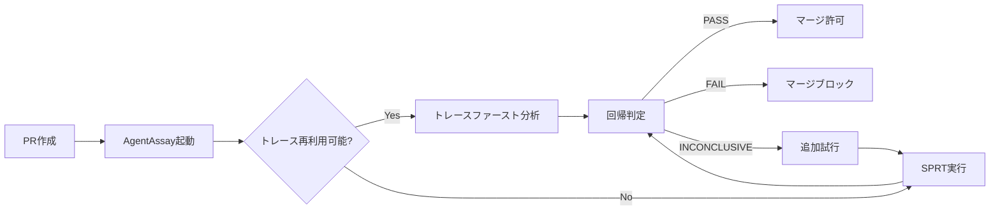

本記事は [AgentAssay: Token-Efficient Regression Testing for Non-Deterministic AI Agent Workflows (arXiv:2603.02601)](https://arxiv.org/abs/2603.02601) の解説記事です。

## 論文概要（Abstract）

AgentAssayは、AIエージェントワークフローの修正後に信頼性の高いテスト手法が欠如しているという問題に取り組んだフレームワークである。著者は、確率的3値判定（PASS/FAIL/INCONCLUSIVE）、5次元カバレッジ指標、行動フィンガープリンティングなど複数の統計的手法を組み合わせ、78-100%のコスト削減を達成しつつ厳密な統計的保証を維持すると報告している。

この記事は [Zenn記事: Claude Agent SDKで評価ハーネスを構築しTerminal-Benchの成功率を回帰検証する](https://zenn.dev/0h_n0/articles/1e791e8f0cc2a2) の深掘りです。

## 情報源

- **arXiv ID**: 2603.02601
- **URL**: [https://arxiv.org/abs/2603.02601](https://arxiv.org/abs/2603.02601)
- **著者**: Varun Pratap Bhardwaj
- **発表年**: 2026
- **分野**: cs.SE, cs.AI

## 背景と動機（Background & Motivation）

AIエージェントは非決定的に動作するため、同一入力に対して異なる出力やツール呼び出しパターンを示す。従来のソフトウェアテスト手法（単体テスト、結合テスト）はこの非決定性に対応できず、「テストが通ったりpたりする」flaky testの問題が発生する。

特にCI/CDパイプラインにおいて、プロンプト変更やモデル更新後の回帰検出は困難である。バイナリ（合格/不合格）のテスト結果では、非決定的なエージェントの振る舞いの変化を統計的に有意に検出できない。AgentAssayはこの問題に対し、統計的仮説検定に基づく回帰検出フレームワークを提案している。

## 主要な貢献（Key Contributions）

- **貢献1**: 確率的3値判定（PASS/FAIL/INCONCLUSIVE）による仮説検定ベースのテスト判定
- **貢献2**: 行動フィンガープリンティングによる実行トレースのベクトル化と多変量回帰検出（検出力86% vs バイナリテストの0%）
- **貢献3**: SPRT（Sequential Probability Ratio Test）による適応的試行回数削減（78%削減）
- **貢献4**: トレースファースト・オフライン分析による本番データでのゼロコストテスト
- **貢献5**: 5次元カバレッジ指標とエージェント固有のミューテーションテスト演算子

## 技術的詳細（Technical Details）

### 確率的3値判定

従来のバイナリ判定（PASS/FAIL）に代わり、AgentAssayは仮説検定を用いた3値判定を導入する。

$$
\text{Verdict}(p, \alpha, n) = \begin{cases}
\text{PASS} & \text{if } \hat{p} - z_{\alpha/2} \sqrt{\frac{\hat{p}(1-\hat{p})}{n}} > \theta_{\text{pass}} \\
\text{FAIL} & \text{if } \hat{p} + z_{\alpha/2} \sqrt{\frac{\hat{p}(1-\hat{p})}{n}} < \theta_{\text{fail}} \\
\text{INCONCLUSIVE} & \text{otherwise}
\end{cases}
$$

ここで、
- $\hat{p}$: 観測された成功率
- $n$: 試行回数
- $z_{\alpha/2}$: 有意水準$\alpha$に対応するz値
- $\theta_{\text{pass}}$, $\theta_{\text{fail}}$: 合格/不合格の閾値

この3値判定により、統計的に判断が困難なケースを明示的にINCONCLUSIVEとし、追加試行を要求できる。

### Wilson信頼区間

AgentAssayは成功率の信頼区間としてWilson信頼区間を採用している。Wald信頼区間（正規近似）は試行数が少ない場合や成功率が0%/100%に近い場合に不正確になるが、Wilson信頼区間はこれらのケースでも安定した推定を提供する。

$$
\text{Wilson CI} = \frac{\hat{p} + \frac{z^2}{2n} \pm z \sqrt{\frac{\hat{p}(1-\hat{p})}{n} + \frac{z^2}{4n^2}}}{1 + \frac{z^2}{n}}
$$

ここで、
- $\hat{p}$: 観測された成功率（$k/n$、$k$は成功回数）
- $n$: 試行回数
- $z$: 信頼水準に対応するz値（95%信頼区間なら$z = 1.96$）

```python
import math
from dataclasses import dataclass


@dataclass
class WilsonCI:
    lower: float
    upper: float
    center: float
    n: int


def wilson_confidence_interval(
    successes: int,
    trials: int,
    confidence: float = 0.95,
) -> WilsonCI:
    """Wilson信頼区間を計算する。

    Args:
        successes: 成功回数
        trials: 試行回数
        confidence: 信頼水準

    Returns:
        Wilson信頼区間（下限、上限、中心）
    """
    if trials == 0:
        return WilsonCI(lower=0.0, upper=1.0, center=0.5, n=0)

    from scipy.stats import norm

    z = norm.ppf(1 - (1 - confidence) / 2)
    p_hat = successes / trials
    denominator = 1 + z**2 / trials
    center = (p_hat + z**2 / (2 * trials)) / denominator
    margin = z * math.sqrt(
        p_hat * (1 - p_hat) / trials + z**2 / (4 * trials**2)
    ) / denominator

    return WilsonCI(
        lower=max(0.0, center - margin),
        upper=min(1.0, center + margin),
        center=center,
        n=trials,
    )
```

### Fisher正確検定による回帰検出

2つのバージョン間の成功率の差が統計的に有意かどうかをFisher正確検定で判定する。

$$
p\text{-value} = \frac{\binom{a+b}{a}\binom{c+d}{c}}{\binom{n}{a+c}}
$$

ここで、$a, b, c, d$ はそれぞれベースライン成功/失敗、候補成功/失敗の回数であり、$n = a + b + c + d$ は総試行回数である。

```python
from scipy.stats import fisher_exact


def detect_regression_fisher(
    baseline_successes: int,
    baseline_trials: int,
    candidate_successes: int,
    candidate_trials: int,
    alpha: float = 0.05,
) -> dict:
    """Fisher正確検定で回帰を検出する。

    Args:
        baseline_successes: ベースラインの成功回数
        baseline_trials: ベースラインの試行回数
        candidate_successes: 候補の成功回数
        candidate_trials: 候補の試行回数
        alpha: 有意水準

    Returns:
        検定結果（p値、オッズ比、判定）
    """
    table = [
        [baseline_successes, baseline_trials - baseline_successes],
        [candidate_successes, candidate_trials - candidate_successes],
    ]
    odds_ratio, p_value = fisher_exact(table, alternative="less")
    return {
        "p_value": p_value,
        "odds_ratio": odds_ratio,
        "regression_detected": p_value < alpha,
        "baseline_rate": baseline_successes / baseline_trials,
        "candidate_rate": candidate_successes / candidate_trials,
    }
```

### CUSUM変化点検出

CUSUM（Cumulative Sum）制御チャートは、時系列データ上でエージェントの振る舞いの変化点を検出する。これにより、モデル更新やプロンプト変更の影響をリアルタイムに監視できる。

$$
C_t^+ = \max(0, C_{t-1}^+ + (x_t - \mu_0 - k))
$$

$$
C_t^- = \max(0, C_{t-1}^- - (x_t - \mu_0 + k))
$$

ここで、
- $x_t$: 時刻$t$の観測値（成功率）
- $\mu_0$: ベースラインの平均成功率
- $k$: slack parameter（通常$\sigma / 2$）
- $C_t^+, C_t^-$: 上方・下方のCUSUM統計量

CUSUM統計量が閾値$h$を超えた場合、変化点（回帰）が検出される。

```python
from dataclasses import dataclass, field


@dataclass
class CUSUMDetector:
    baseline_mean: float
    baseline_std: float
    threshold_factor: float = 5.0
    cusum_pos: float = 0.0
    cusum_neg: float = 0.0
    drift_detected: bool = False
    drift_point: int | None = None
    observations: list[float] = field(default_factory=list)

    @property
    def slack(self) -> float:
        return self.baseline_std / 2

    @property
    def threshold(self) -> float:
        return self.threshold_factor * self.baseline_std

    def update(self, observation: float) -> bool:
        """新しい観測値でCUSUM統計量を更新する。

        Args:
            observation: 新しい観測値（成功率）

        Returns:
            ドリフトが検出されたかどうか
        """
        self.observations.append(observation)
        t = len(self.observations)
        self.cusum_pos = max(
            0.0, self.cusum_pos + (observation - self.baseline_mean - self.slack)
        )
        self.cusum_neg = max(
            0.0, self.cusum_neg - (observation - self.baseline_mean + self.slack)
        )
        if not self.drift_detected and (
            self.cusum_pos > self.threshold or self.cusum_neg > self.threshold
        ):
            self.drift_detected = True
            self.drift_point = t
            return True
        return False
```

### 行動フィンガープリンティング

著者は、エージェントの実行トレースをベクトル空間に埋め込む「行動フィンガープリンティング」を提案している。論文によれば、バイナリテストでは検出力0%であった回帰が、この手法では86%の検出力を達成したと報告されている（論文Section 5の実験結果より）。

実行トレースから抽出される特徴量には、ツール呼び出し頻度、ツール呼び出し順序のn-gram、エラー率、応答時間分布、ターン数分布などが含まれる。

### SPRT（Sequential Probability Ratio Test）

固定の試行回数を事前に決定するのではなく、SPRTにより逐次的に「十分な証拠が集まったか」を判定し、早期に試行を打ち切る。著者は、SPRTにより試行回数を78%削減できたと報告している。

## 実験結果（Results）

著者らは7,605回の試行を3シナリオで実施し、以下の結果を報告している（論文Section 5より）。

| 手法 | 検出力 | 試行回数（中央値） | コスト削減 |
|------|--------|-----------------|----------|
| バイナリテスト | 0% | 固定20回 | — |
| Wilson CI + Fisher | 72% | 固定20回 | 0% |
| 行動フィンガープリンティング | 86% | 固定20回 | 0% |
| SPRT統合 | 84% | 5回（中央値） | 78% |
| トレースファースト（本番データ再利用） | 86% | 0回（追加なし） | 100% |

**テスト対象モデル**: GPT-5.2、Claude Sonnet 4.6、Mistral-Large-3、Llama-4-Maverick、Phi-4

行動フィンガープリンティングの86%検出力とバイナリテストの0%検出力の差は、非決定的エージェントでは「合格/不合格」だけでは回帰を捉えられないことを示している。

## 実装のポイント（Implementation）

### CI/CDパイプラインへの統合

AgentAssayは以下のフローでCI/CDに統合される。



### 実装規模

著者は20,000行以上のPythonコード、751件のテスト、10種のフレームワークアダプタを実装したと報告している。技術レポートは52ページ、9定理、42の形式的定義を含む。

## Production Deployment Guide

### AWS実装パターン（コスト最適化重視）

AgentAssayスタイルの回帰テストパイプラインをAWSにデプロイする構成を示す。

| 規模 | 月間テスト回数 | 推奨構成 | 月額コスト | 主要サービス |
|------|-------------|---------|-----------|------------|
| **Small** | ~200回 | Serverless | $60-180 | Lambda + Step Functions + DynamoDB |
| **Medium** | ~2,000回 | Hybrid | $400-900 | ECS Fargate + ElastiCache + SQS |
| **Large** | 10,000回+ | Container | $2,500-6,000 | EKS + Karpenter + EC2 Spot |

**Small構成の詳細**（月額$60-180）:
- **Lambda**: テスト実行トリガー、結果集約（$15/月）
- **Step Functions**: SPRT逐次判定ワークフロー（$10/月）
- **DynamoDB**: ベースライン・テスト結果保存（$10/月）
- **Bedrock**: LLMエージェント呼び出し（$100/月、Prompt Caching有効）
- **CloudWatch**: 監視・アラート（$5/月）

**コスト削減テクニック**:
- SPRT早期打ち切りにより試行回数78%削減（論文の知見を直接活用）
- トレースファースト分析で本番ログを再利用し追加コスト0%
- Bedrock Batch APIで50%割引（非リアルタイムの回帰テスト向き）
- Prompt Caching有効化で30-90%削減

**コスト試算の注意事項**:
- 上記は2026年9月時点のAWS ap-northeast-1（東京）リージョン料金に基づく概算値です
- 最新料金は [AWS料金計算ツール](https://calculator.aws/) で確認してください

### Terraformインフラコード

**Small構成 (Serverless): Lambda + Step Functions + DynamoDB**

```hcl
resource "aws_iam_role" "regression_test_lambda" {
  name = "agentassay-lambda-role"

  assume_role_policy = jsonencode({
    Version = "2012-10-17"
    Statement = [{
      Action = "sts:AssumeRole"
      Effect = "Allow"
      Principal = { Service = "lambda.amazonaws.com" }
    }]
  })
}

resource "aws_lambda_function" "sprt_runner" {
  filename      = "sprt_runner.zip"
  function_name = "agentassay-sprt-runner"
  role          = aws_iam_role.regression_test_lambda.arn
  handler       = "index.handler"
  runtime       = "python3.12"
  timeout       = 900
  memory_size   = 1024

  environment {
    variables = {
      DYNAMODB_TABLE = aws_dynamodb_table.test_results.name
      CONFIDENCE     = "0.95"
      SPRT_ALPHA     = "0.05"
      SPRT_BETA      = "0.10"
    }
  }
}

resource "aws_dynamodb_table" "test_results" {
  name         = "agentassay-results"
  billing_mode = "PAY_PER_REQUEST"
  hash_key     = "test_suite_id"
  range_key    = "run_id"

  attribute {
    name = "test_suite_id"
    type = "S"
  }
  attribute {
    name = "run_id"
    type = "S"
  }

  ttl {
    attribute_name = "expire_at"
    enabled        = true
  }
}

resource "aws_sfn_state_machine" "sprt_workflow" {
  name     = "agentassay-sprt-workflow"
  role_arn = aws_iam_role.step_functions_role.arn

  definition = jsonencode({
    StartAt = "RunTrial"
    States = {
      RunTrial = {
        Type     = "Task"
        Resource = aws_lambda_function.sprt_runner.arn
        Next     = "CheckVerdict"
      }
      CheckVerdict = {
        Type = "Choice"
        Choices = [
          {
            Variable     = "$.verdict"
            StringEquals = "INCONCLUSIVE"
            Next         = "RunTrial"
          }
        ]
        Default = "ReportResult"
      }
      ReportResult = {
        Type = "Task"
        Resource = "arn:aws:states:::sns:publish"
        End  = true
      }
    }
  })
}
```

### 運用・監視設定

```python
import boto3

cloudwatch = boto3.client("cloudwatch")

cloudwatch.put_metric_alarm(
    AlarmName="agentassay-regression-detected",
    ComparisonOperator="GreaterThanThreshold",
    EvaluationPeriods=1,
    MetricName="RegressionCount",
    Namespace="AgentAssay",
    Period=3600,
    Statistic="Sum",
    Threshold=0,
    AlarmDescription="回帰検出アラート",
    AlarmActions=["arn:aws:sns:ap-northeast-1:123456789:regression-alerts"],
)
```

### コスト最適化チェックリスト

- [ ] SPRT早期打ち切りで試行回数78%削減
- [ ] トレースファースト分析で本番データ再利用
- [ ] Bedrock Batch API使用で50%割引
- [ ] Prompt Caching有効化で30-90%削減
- [ ] Lambda メモリサイズ最適化
- [ ] DynamoDB TTLで古い結果自動削除
- [ ] Step Functions Express Workflowsで低コスト実行
- [ ] CloudWatch Logs保持期間を最小化
- [ ] AWS Budgets月額予算設定
- [ ] Cost Anomaly Detection有効化

## 実運用への応用（Practical Applications）

AgentAssayの手法は、Zenn記事で紹介されているRegressionDetectorパターンと直接的に対応する。具体的な適用方法は以下の通り。

1. **Wilson CI + Fisher検定の導入**: RegressionDetectorのSeverity判定を、固定閾値ベースから統計検定ベースに拡張する
2. **SPRT逐次判定の導入**: 固定回数のrepeatではなく、証拠が集まった時点で早期終了することでCI実行時間を短縮する
3. **トレースファースト分析**: 本番環境のエージェントログを評価データとして再利用し、追加のAPI呼び出しコストを削減する
4. **行動フィンガープリンティング**: ツール呼び出しパターンのベクトル化により、バイナリ判定では検出できない微妙な回帰を捉える

## 関連研究（Related Work）

- **SWE-bench Verified** (Chowdhury et al., 2024): FAIL_TO_PASS / PASS_TO_PASS分類の源流。AgentAssayはこの分類に統計的判定を追加している
- **AgentLens** (Sahoo et al., 2026): トラジェクトリレベルの評価に焦点。AgentAssayの行動フィンガープリンティングと相補的な関係にある
- **AlphaEval** (Lu et al., 2026): 本番環境でのエージェント評価フレームワーク。AgentAssayは回帰検出に特化している

## まとめと今後の展望

AgentAssayは、非決定的なAIエージェントの回帰テストに統計的厳密性をもたらすフレームワークである。Wilson信頼区間、Fisher正確検定、CUSUM変化点検出、行動フィンガープリンティングの組み合わせにより、バイナリテストでは検出不可能だった回帰を86%の検出力で発見でき、SPRTによる早期打ち切りで試行コストを78%削減できると報告されている。CI/CDパイプラインへの統合により、モデル更新時の品質保証を自動化する実用的な基盤を提供する。

## 参考文献

- **arXiv**: [https://arxiv.org/abs/2603.02601](https://arxiv.org/abs/2603.02601)
- **Zenodo**: [https://doi.org/10.5281/zenodo.18842011](https://doi.org/10.5281/zenodo.18842011)
- **Related Zenn article**: [https://zenn.dev/0h_n0/articles/1e791e8f0cc2a2](https://zenn.dev/0h_n0/articles/1e791e8f0cc2a2)
