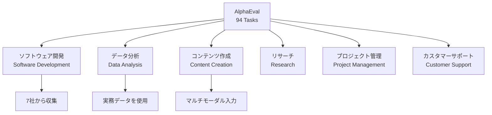
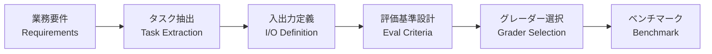

本記事は [AlphaEval: Evaluating Agents in Production (arXiv:2604.12162)](https://arxiv.org/abs/2604.12162) の解説記事です。

## 論文概要（Abstract）

AlphaEvalは、本番環境でのAIエージェント評価に特化したフレームワークである。著者らは、既存のベンチマークが「回顧的に収集されたタスクと決定論的な指標」で能力を測定しているのに対し、本番環境では暗黙的な制約、異種マルチモーダル入力、専門家基準の判定が存在すると指摘している。7社6職業ドメインから収集した94のタスクで構成され、個別モデルではなく完全なエージェントシステム（Claude Code、Codexなど）を商用プロダクトとして評価する。

この記事は [Zenn記事: Claude Agent SDKで評価ハーネスを構築しTerminal-Benchの成功率を回帰検証する](https://zenn.dev/0h_n0/articles/1e791e8f0cc2a2) の深掘りです。

## 情報源

- **arXiv ID**: 2604.12162
- **URL**: [https://arxiv.org/abs/2604.12162](https://arxiv.org/abs/2604.12162)
- **著者**: Pengrui Lu, Bingyu Xu, Wenjun Zhang, Pengfei Liu, et al.（27名）
- **発表年**: 2026
- **分野**: cs.CL

## 背景と動機（Background & Motivation）

AIエージェントの評価は、研究用ベンチマークと本番環境の間で大きなギャップが存在する。SWE-benchやTerminal-Benchは研究者がキュレーションしたタスクで構成されるが、実際のビジネス現場では以下の特性がある。

1. **暗黙的な制約**: 明文化されていないビジネスルール、コーディング規約、セキュリティ要件
2. **異種入力**: テキスト、画像、スプレッドシート、データベース、APIレスポンスの混在
3. **専門家基準**: 出力の正誤だけでなく、業界の専門家が「使えるか」を判定する必要性
4. **モデル vs プロダクト**: 同一モデルでも、ツール設定、プロンプト設計、コンテキスト管理によりプロダクトとしての性能が異なる

著者らは、「モデルレベルの評価では見えない性能差がプロダクトレベルの評価で顕在化する」と主張しており、これは評価ハーネスの設計においてエージェントシステム全体をテスト対象とすべきという示唆を与えている。

## 主要な貢献（Key Contributions）

- **貢献1**: 7社6職業ドメイン（O*NETベース）から収集した94タスクのプロダクション指向ベンチマーク
- **貢献2**: LLM-as-a-Judge、参照ドリブン指標、形式検証、ルーブリック評価、自動UIテストを統合するマルチパラダイム評価フレームワーク
- **貢献3**: 要件からベンチマークへの体系的変換パイプライン（Requirement-to-Benchmark Construction）
- **貢献4**: 個別モデルではなく完全なエージェントプロダクト（Claude Code、Codexなど）の商用評価

## 技術的詳細（Technical Details）

### タスク構成

AlphaEvalの94タスクは以下の6職業ドメインに分類される。



各タスクは実際の企業の業務フローから抽出されており、擬似的なタスクではない点が特徴である。

### マルチパラダイム評価フレームワーク

AlphaEvalは単一の評価手法ではなく、タスクの特性に応じて複数の評価パラダイムを統合する。

| パラダイム | 適用場面 | 特徴 |
|-----------|---------|------|
| **LLM-as-a-Judge** | 自然言語出力の品質評価 | ルーブリック付きで主観的品質を定量化 |
| **参照ドリブン指標** | 正解が明確なタスク | BLEU、ROUGE、完全一致等 |
| **形式検証** | コード生成、構造化出力 | 型チェック、構文検証、テスト実行 |
| **ルーブリック評価** | 複合タスク | 複数の評価軸で段階的に採点 |
| **自動UIテスト** | Webアプリ操作タスク | Playwright/Puppeteerで検証 |

```python
from abc import ABC, abstractmethod
from dataclasses import dataclass
from enum import Enum


class EvalParadigm(Enum):
    LLM_JUDGE = "llm_judge"
    REFERENCE_DRIVEN = "reference_driven"
    FORMAL_VERIFICATION = "formal_verification"
    RUBRIC = "rubric"
    UI_TEST = "ui_test"


@dataclass
class EvalResult:
    paradigm: EvalParadigm
    score: float
    details: dict


class Grader(ABC):
    @abstractmethod
    async def grade(self, task: dict, output: str) -> EvalResult:
        ...


class FormalVerificationGrader(Grader):
    """形式検証によるグレーディング。

    コード生成タスクで使用し、テスト実行による合否判定を行う。
    """

    async def grade(self, task: dict, output: str) -> EvalResult:
        import asyncio

        test_command = task["verification"]["command"]
        proc = await asyncio.create_subprocess_shell(
            test_command,
            stdout=asyncio.subprocess.PIPE,
            stderr=asyncio.subprocess.PIPE,
        )
        stdout, stderr = await proc.communicate()
        passed = proc.returncode == 0

        return EvalResult(
            paradigm=EvalParadigm.FORMAL_VERIFICATION,
            score=1.0 if passed else 0.0,
            details={
                "exit_code": proc.returncode,
                "stdout": stdout.decode()[-500:],
                "stderr": stderr.decode()[-500:],
            },
        )


class RubricGrader(Grader):
    """ルーブリック評価によるグレーディング。

    複数の評価軸で段階的に採点する。
    """

    def __init__(self, rubric: list[dict]) -> None:
        self.rubric = rubric

    async def grade(self, task: dict, output: str) -> EvalResult:
        scores = {}
        for criterion in self.rubric:
            score = self._evaluate_criterion(criterion, output)
            scores[criterion["name"]] = score

        avg_score = sum(scores.values()) / len(scores) if scores else 0.0
        return EvalResult(
            paradigm=EvalParadigm.RUBRIC,
            score=avg_score,
            details={"criterion_scores": scores},
        )

    def _evaluate_criterion(self, criterion: dict, output: str) -> float:
        # 実際にはLLM-as-a-Judgeで評価
        # ここでは簡略化
        return 0.0


class MultiParadigmEvaluator:
    """複数の評価パラダイムを統合する。"""

    def __init__(self, graders: list[Grader]) -> None:
        self.graders = graders

    async def evaluate(
        self, task: dict, output: str,
    ) -> dict:
        """すべてのパラダイムで評価を実行する。

        Args:
            task: タスク定義
            output: エージェントの出力

        Returns:
            統合評価結果
        """
        results = []
        for grader in self.graders:
            result = await grader.grade(task, output)
            results.append(result)

        scores = [r.score for r in results]
        return {
            "overall_score": sum(scores) / len(scores) if scores else 0.0,
            "paradigm_results": [
                {
                    "paradigm": r.paradigm.value,
                    "score": r.score,
                    "details": r.details,
                }
                for r in results
            ],
        }
```

### Requirement-to-Benchmark変換パイプライン

著者らは、企業の実務要件をベンチマークタスクに変換する体系的なパイプラインを提案している。



このパイプラインにより、各組織が自社のドメイン固有のベンチマークを構築できる。これはZenn記事で紹介されている「ゴールデンデータセットの構築」と同じ思想である。

## 実験結果（Results）

著者らは、Claude Code、Codex等の商用エージェントプロダクトを94タスクで評価した結果、「モデルレベルの評価では見えない性能差がプロダクトレベルの評価で顕在化する」と報告している（論文Abstract / Section 5より）。

具体的なスコア表は論文本文に記載されているが、著者らが強調しているポイントは以下の通り。

- 同一のベースモデルを使用していても、プロダクトとしての性能は大幅に異なる
- ツール設定、プロンプト設計、コンテキスト管理が性能差の主要因
- 単一パラダイムの評価では性能を正確に把握できず、マルチパラダイム評価が必要

### 評価ハーネス設計への示唆

AlphaEvalの知見は、評価ハーネスの設計において以下を意味する。

1. **Outcome Checkだけでは不十分**: 形式検証だけでなく、ルーブリック評価やLLM-as-a-Judgeを併用すべき
2. **モデルではなくシステムを評価**: プロンプト、ツール、ハーネスを含むシステム全体のテストが必要
3. **ドメイン固有タスクの重要性**: 汎用ベンチマークだけでなく、自社の業務フローに基づくタスクを構築すべき

## 実装のポイント（Implementation）

### 自社ベンチマーク構築のアプローチ

AlphaEvalのRequirement-to-Benchmark変換を自社に適用する際のポイントを述べる。

```python
from dataclasses import dataclass, field


@dataclass
class ProductionTask:
    """本番業務から抽出した評価タスク。"""
    task_id: str
    domain: str
    description: str
    input_artifacts: list[dict]
    expected_output_schema: dict
    eval_paradigms: list[EvalParadigm]
    rubric: list[dict] = field(default_factory=list)
    reference_output: str | None = None
    verification_command: str | None = None
    constraints: list[str] = field(default_factory=list)

    def to_eval_config(self) -> dict:
        """評価ハーネスの設定形式に変換する。

        Returns:
            評価設定辞書
        """
        config = {
            "id": self.task_id,
            "domain": self.domain,
            "description": self.description,
            "checks": {
                "outcome": {},
                "trajectory": {
                    "max_turns": 20,
                },
            },
        }

        for paradigm in self.eval_paradigms:
            if paradigm == EvalParadigm.FORMAL_VERIFICATION:
                config["checks"]["outcome"]["type"] = "test_suite"
                config["checks"]["outcome"]["command"] = self.verification_command
            elif paradigm == EvalParadigm.RUBRIC:
                config["checks"]["outcome"]["type"] = "rubric"
                config["checks"]["outcome"]["rubric"] = self.rubric
            elif paradigm == EvalParadigm.REFERENCE_DRIVEN:
                config["checks"]["outcome"]["type"] = "reference"
                config["checks"]["outcome"]["reference"] = self.reference_output

        return config


def build_golden_dataset(
    production_tasks: list[ProductionTask],
) -> dict:
    """本番タスクからゴールデンデータセットを構築する。

    Args:
        production_tasks: 本番業務から抽出したタスクリスト

    Returns:
        評価スイート設定
    """
    return {
        "suite_name": "production-golden-dataset",
        "version": "1.0.0",
        "tasks": [t.to_eval_config() for t in production_tasks],
        "metadata": {
            "total_tasks": len(production_tasks),
            "domains": list({t.domain for t in production_tasks}),
        },
    }
```

### 回帰検出との統合

AlphaEvalのマルチパラダイム評価をRegressionDetectorに統合する。

```python
from dataclasses import dataclass


@dataclass
class MultiParadigmRegressionResult:
    """パラダイム別の回帰結果。"""
    paradigm: str
    baseline_score: float
    candidate_score: float
    regression_detected: bool
    delta: float


def detect_multi_paradigm_regression(
    baseline_results: list[dict],
    candidate_results: list[dict],
    threshold: float = 0.05,
) -> list[MultiParadigmRegressionResult]:
    """マルチパラダイム評価での回帰を検出する。

    Args:
        baseline_results: ベースラインの評価結果
        candidate_results: 候補の評価結果
        threshold: 回帰判定の閾値

    Returns:
        パラダイム別の回帰検出結果
    """
    results = []
    paradigms = {r["paradigm"] for r in baseline_results[0].get("paradigm_results", [])}

    for paradigm in paradigms:
        baseline_scores = [
            next(
                p["score"]
                for p in r.get("paradigm_results", [])
                if p["paradigm"] == paradigm
            )
            for r in baseline_results
        ]
        candidate_scores = [
            next(
                p["score"]
                for p in r.get("paradigm_results", [])
                if p["paradigm"] == paradigm
            )
            for r in candidate_results
        ]

        baseline_avg = sum(baseline_scores) / len(baseline_scores)
        candidate_avg = sum(candidate_scores) / len(candidate_scores)
        delta = candidate_avg - baseline_avg

        results.append(MultiParadigmRegressionResult(
            paradigm=paradigm,
            baseline_score=baseline_avg,
            candidate_score=candidate_avg,
            regression_detected=delta < -threshold,
            delta=delta,
        ))

    return results
```

## 実運用への応用（Practical Applications）

AlphaEvalの知見は、以下の場面で実務に活用できる。

1. **ゴールデンデータセットの拡張**: 自社の業務タスクからベンチマークを構築する体系的な手法を適用し、汎用ベンチマークでは測定できない実務性能を評価する
2. **マルチパラダイム評価の導入**: 形式検証に加え、LLM-as-a-Judgeやルーブリック評価を併用し、出力品質の多角的な評価を実現する
3. **プロダクトレベルの回帰検出**: モデル単体ではなくエージェントシステム全体をテスト対象とし、ツール設定やプロンプトの変更も回帰の対象とする

## 関連研究（Related Work）

- **Terminal-Bench** (Merrill et al., 2026): CLIタスクに特化した研究用ベンチマーク。AlphaEvalは複数職業ドメインを横断する本番指向ベンチマークである
- **SWE-bench** (Jimenez et al., 2024): GitHubのIssue解決に特化。AlphaEvalはコーディング以外のドメイン（データ分析、コンテンツ作成等）も対象とする
- **HAL (Holistic Agent Leaderboard)**: 複数ベンチマークの統一プラットフォーム。AlphaEvalはプロダクション指向のタスク収集方法論に焦点を当てている

## まとめと今後の展望

AlphaEvalは、7社6職業ドメインの94タスクで構成されるプロダクション指向のエージェント評価フレームワークである。マルチパラダイム評価と体系的なRequirement-to-Benchmark変換パイプラインにより、汎用ベンチマークでは見えない「プロダクトとしての性能差」を可視化する。

Zenn記事の評価ハーネスに対しては、Outcome Checkの多様化（形式検証 + LLM-as-a-Judge + ルーブリック）と、自社業務に基づくゴールデンデータセット構築の方法論が直接的に応用可能である。

## 参考文献

- **arXiv**: [https://arxiv.org/abs/2604.12162](https://arxiv.org/abs/2604.12162)
- **Related Zenn article**: [https://zenn.dev/0h_n0/articles/1e791e8f0cc2a2](https://zenn.dev/0h_n0/articles/1e791e8f0cc2a2)
