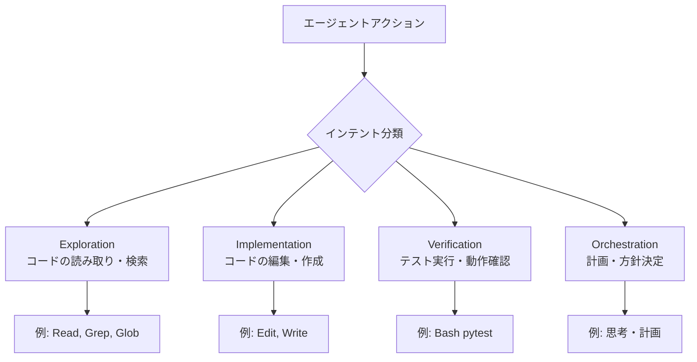

本記事は [AgentLens: Revealing The Lucky Pass Problem in SWE-Agent Evaluation (arXiv:2605.12925)](https://arxiv.org/abs/2605.12925) の解説記事です。

## 論文概要（Abstract）

AgentLensは、SWEエージェント評価における「Lucky Pass問題」を体系的に定量化した研究である。著者らは、テストに合格したトラジェクトリの10.7%が回帰サイクル・盲目的リトライ・検証欠如・時間的に無秩序な探索パターンを示すと報告している。この問題により、成功率（pass rate）だけではモデルの真の問題解決能力を正確に評価できないことが明らかにされた。

この記事は [Zenn記事: Claude Agent SDKで評価ハーネスを構築しTerminal-Benchの成功率を回帰検証する](https://zenn.dev/0h_n0/articles/1e791e8f0cc2a2) の深掘りです。

## 情報源

- **arXiv ID**: 2605.12925
- **URL**: [https://arxiv.org/abs/2605.12925](https://arxiv.org/abs/2605.12925)
- **著者**: Priyam Sahoo, Gaurav Mittal, Xiaomin Li, et al.
- **発表年**: 2026
- **分野**: cs.SE

## 背景と動機（Background & Motivation）

SWE-benchをはじめとするコーディングエージェントのベンチマークでは、パッチが検証テストを通過するかどうかのバイナリ判定（pass/fail）が標準的な評価指標として広く使われている。しかし、テストに合格したという事実だけでは、エージェントの問題解決プロセスの品質は保証されない。

例えば、偶然テストを通過するパッチを生成した場合、バグの根本原因を理解していなくても「成功」として計上される。このような「偶然の合格」（Lucky Pass）は、実用上信頼できるエージェントと信頼できないエージェントを区別する障壁となっている。

Zenn記事で紹介されているpass@kとpass^kの区別は、まさにこの問題に関連する。pass@kはk回中1回でも成功すればよいため、Lucky Passを含む成功も計上される。AgentLensはこの問題を「プロセス」の観点から定量化している。

## 主要な貢献（Key Contributions）

- **貢献1**: Lucky Pass問題の定義と定量化。合格トラジェクトリの10.7%がLucky Passであることの実証
- **貢献2**: コンテキスト依存のインテントラベリング（Exploration / Implementation / Verification / Orchestration）による行動分類
- **貢献3**: Prefix Tree Acceptor（PTA）による複数正解パスの統合参照モデル
- **貢献4**: Lucky / Solid / Idealの3段階品質スコア分解
- **貢献5**: モデルランキングが成功率ベースと品質スコアベースで最大5順位変動することの実証

## 技術的詳細（Technical Details）

### Lucky Pass問題の定義

著者らは、Lucky Passを以下の5つのメカニズムで特徴づけている。

| メカニズム | 説明 | 具体例 |
|-----------|------|--------|
| 回帰サイクル | 修正→破壊→再修正を繰り返す | テスト修正後に別のテストが壊れ、再度修正 |
| 盲目的リトライ | 同一操作を根拠なく繰り返す | 同じコマンドを3回以上連続実行 |
| 検証欠如 | 実装後にテストを実行しない | コード変更後にpytestを実行せず完了報告 |
| 時間的無秩序 | 探索→実装→検証の順序が崩壊 | 検証前に次のファイルの実装に着手 |
| 不完全な理解 | 問題の一部しか修正しない | 根本原因ではなく症状だけを修正 |

### コンテキスト依存インテントラベリング

エージェントの各アクション（ツール呼び出し）を4つのインテントカテゴリに分類する。



同一ツール呼び出しでもコンテキストにより分類が異なる。例えば`Bash`ツールは、`ls`実行ならExploration、`pytest`実行ならVerificationに分類される。

### Prefix Tree Acceptor（PTA）

複数の正解トラジェクトリからPTAを構築し、参照モデルとして使用する。同一タスクに対して複数の正解パスが存在するため、単一の正解パスとの比較では偽陰性（正しいが異なるアプローチの不当な不合格判定）が発生する。

PTAは各ノードがインテントラベルを持つ木構造であり、正解トラジェクトリのインテント列を受理する。

$$
\text{PTA} = (Q, \Sigma, \delta, q_0, F)
$$

ここで、
- $Q$: 状態集合（各ノード）
- $\Sigma$: インテントアルファベット $\{\text{E}, \text{I}, \text{V}, \text{O}\}$
- $\delta$: 遷移関数
- $q_0$: 初期状態
- $F$: 受理状態集合

```python
from dataclasses import dataclass, field
from enum import Enum


class Intent(Enum):
    EXPLORATION = "E"
    IMPLEMENTATION = "I"
    VERIFICATION = "V"
    ORCHESTRATION = "O"


@dataclass
class PTANode:
    children: dict[Intent, "PTANode"] = field(default_factory=dict)
    is_accepting: bool = False
    count: int = 0


class PrefixTreeAcceptor:
    """複数の正解トラジェクトリからPTAを構築する。"""

    def __init__(self) -> None:
        self.root = PTANode()

    def add_trajectory(self, intents: list[Intent]) -> None:
        """正解トラジェクトリのインテント列をPTAに追加する。

        Args:
            intents: インテントラベルのリスト
        """
        node = self.root
        for intent in intents:
            if intent not in node.children:
                node.children[intent] = PTANode()
            node = node.children[intent]
            node.count += 1
        node.is_accepting = True

    def score_trajectory(self, intents: list[Intent]) -> float:
        """トラジェクトリのPTA適合スコアを計算する。

        Args:
            intents: 評価対象のインテント列

        Returns:
            0.0-1.0のスコア（高いほどPTAの正解パスに近い）
        """
        node = self.root
        matched = 0
        for intent in intents:
            if intent in node.children:
                node = node.children[intent]
                matched += 1
            else:
                break
        return matched / len(intents) if intents else 0.0
```

### 品質スコアの3段階分解

著者らは合格トラジェクトリを以下の3段階に分類している。

| 段階 | 定義 | 特徴 |
|------|------|------|
| **Lucky** | テストは通過するが、プロセスに問題がある | 回帰サイクル、盲目的リトライ等を含む |
| **Solid** | 合理的なプロセスでテストを通過 | 効率性に改善の余地あり |
| **Ideal** | PTAの参照パスに近い最適なプロセス | 探索→実装→検証の順序を遵守 |

品質スコア $Q$ は以下の重み付き合計で定義される。

$$
Q = w_{\text{outcome}} \cdot S_{\text{outcome}} + w_{\text{trajectory}} \cdot S_{\text{trajectory}}
$$

ここで、
- $S_{\text{outcome}}$: 出力の正誤（0 or 1）
- $S_{\text{trajectory}}$: PTA適合スコア（0.0-1.0）
- $w_{\text{outcome}}, w_{\text{trajectory}}$: 重み（論文ではそれぞれ0.5を使用）

## 実験結果（Results）

著者らは、2,614件のOpenHandsトラジェクトリ（8モデルバックエンド × 60 SWE-bench Verifiedタスク）で評価を行い、以下の結果を報告している（論文Section 4より）。

### Lucky Pass率のモデル間比較

| モデル | Pass Rate | Lucky Rate | 品質スコア順位変動 |
|--------|-----------|------------|-----------------|
| モデルA（匿名） | 高 | 23.2% | -5 |
| モデルB（匿名） | 中 | 0.5% | +3 |
| モデルC（匿名） | 中 | 12.4% | -2 |

著者らによれば、Lucky率は0.5%から23.2%まで大きく異なり、品質スコアでランキングした場合、成功率ランキングから最大5順位の変動が生じると報告されている。

### AgentLens-Benchデータセット

著者らは1,815件のアノテーション済みトラジェクトリからなるAgentLens-Benchを公開している。これにより、他の研究者がLucky Pass検出手法の開発・評価に利用できる。

### Zenn記事との関連

Zenn記事で紹介されているpass@kとpass^kの使い分けは、まさにLucky Pass問題の実務的な対策である。

- **pass@k**（k回中1回以上成功）: Lucky Passを含む。開発ツールなど1回の成功に価値がある場面向き
- **pass^k**（k回全て成功）: Lucky Passを排除する効果がある。一貫性が求められる場面向き

例として、成功率75%のエージェントでpass@3を計算した場合、

$$
\text{pass@3} = 1 - (1-0.75)^3 \approx 98.4\%
$$

一方、pass^3は、

$$
\text{pass\^{}3} = 0.75^3 \approx 42.2\%
$$

この差の一部はLucky Passによるものである。pass@kが98.4%でもpass^kが42.2%のモデルは、一貫した問題解決能力が低いと解釈できる。

## 実装のポイント（Implementation）

### Trajectory Checkの設計

AgentLensの知見を評価ハーネスに適用する際、以下の検出ルールを実装する。

```python
from dataclasses import dataclass


@dataclass
class LuckyPassDetector:
    max_consecutive_retries: int = 3
    min_verification_ratio: float = 0.1

    def detect(
        self, intents: list[str], tool_calls: list[dict],
    ) -> dict[str, bool]:
        """Lucky Passパターンを検出する。

        Args:
            intents: インテントラベルのリスト
            tool_calls: ツール呼び出しログ

        Returns:
            各パターンの検出結果
        """
        return {
            "blind_retry": self._detect_blind_retry(tool_calls),
            "missing_verification": self._detect_missing_verification(intents),
            "temporal_disorder": self._detect_temporal_disorder(intents),
            "regression_cycle": self._detect_regression_cycle(tool_calls),
        }

    def _detect_blind_retry(self, tool_calls: list[dict]) -> bool:
        consecutive = 1
        for i in range(1, len(tool_calls)):
            if (tool_calls[i]["name"] == tool_calls[i - 1]["name"]
                and tool_calls[i].get("input") == tool_calls[i - 1].get("input")):
                consecutive += 1
                if consecutive >= self.max_consecutive_retries:
                    return True
            else:
                consecutive = 1
        return False

    def _detect_missing_verification(self, intents: list[str]) -> bool:
        verification_count = sum(1 for i in intents if i == "V")
        return verification_count / len(intents) < self.min_verification_ratio if intents else True

    def _detect_temporal_disorder(self, intents: list[str]) -> bool:
        last_impl_idx = -1
        for i, intent in enumerate(intents):
            if intent == "I":
                last_impl_idx = i
            if intent == "V" and last_impl_idx == -1:
                return True
        return False

    def _detect_regression_cycle(self, tool_calls: list[dict]) -> bool:
        test_results: list[bool] = []
        for call in tool_calls:
            if call.get("name") == "Bash" and "pytest" in call.get("input", ""):
                test_results.append(call.get("exit_code", 1) == 0)
        for i in range(2, len(test_results)):
            if test_results[i - 2] and not test_results[i - 1] and test_results[i]:
                return True
        return False
```

### Outcome + Trajectory二重評価の統合

Zenn記事のハーネス設計にAgentLensの品質スコアを統合する。

```python
def combined_grade(
    outcome_passed: bool,
    trajectory_intents: list[str],
    tool_calls: list[dict],
    pta: PrefixTreeAcceptor,
) -> dict:
    """Outcome CheckとTrajectory Checkの二重評価を実行する。

    Args:
        outcome_passed: 出力の正誤
        trajectory_intents: インテントラベル列
        tool_calls: ツール呼び出しログ
        pta: 参照PTA

    Returns:
        品質評価結果（スコア、段階、Lucky Passパターン）
    """
    detector = LuckyPassDetector()
    lucky_patterns = detector.detect(trajectory_intents, tool_calls)
    is_lucky = any(lucky_patterns.values())

    intent_enums = [Intent(i) for i in trajectory_intents]
    pta_score = pta.score_trajectory(intent_enums)

    if not outcome_passed:
        tier = "FAIL"
    elif is_lucky:
        tier = "LUCKY"
    elif pta_score >= 0.8:
        tier = "IDEAL"
    else:
        tier = "SOLID"

    quality_score = (0.5 * float(outcome_passed)) + (0.5 * pta_score)

    return {
        "tier": tier,
        "quality_score": quality_score,
        "outcome_passed": outcome_passed,
        "pta_score": pta_score,
        "lucky_patterns": lucky_patterns,
    }
```

## 実運用への応用（Practical Applications）

AgentLensの知見は、以下の場面で実務に活用できる。

1. **CI/CDゲートの精緻化**: pass rateだけでなく品質スコアを併用することで、Lucky Passによる偽の合格を検出し、デプロイ判定の信頼性を向上させる
2. **モデル選定**: 成功率が同等のモデル間で、Lucky Pass率が低いモデルを選定する判断基準として活用できる
3. **回帰検出の強化**: RegressionDetectorにtrajectory品質の変化を監視項目として追加し、プロセスレベルの回帰も検出する
4. **デバッグ支援**: Lucky Passパターンの自動検出により、エージェントの弱点を特定し、プロンプトやツール設計の改善に活かす

## 関連研究（Related Work）

- **SWE-bench Verified** (Chowdhury et al., 2024): バイナリpass/failを標準化。AgentLensはこの指標の限界を実証している
- **Terminal-Bench** (Merrill et al., 2026): CLIタスクのベンチマーク。検証テストによるOutcome Checkに焦点を当てており、AgentLensのTrajectory Checkと相補的
- **UTBoost** (2026): SWE-benchの厳密な評価手法。テスト追加による偽陽性の排除に注力している

## まとめと今後の展望

AgentLensは、SWEエージェント評価におけるLucky Pass問題を体系的に定量化した研究である。合格トラジェクトリの10.7%がLucky Passであり、品質スコアでランキングした場合に最大5順位の変動が生じると報告されている。

この知見は、Zenn記事で紹介されているtrajectory checks + outcome checksの二重評価の設計根拠を実証的に裏付けている。pass@kだけでなくpass^kを監視し、Lucky Pass検出ルールをCI/CDゲートに組み込むことで、評価ハーネスの信頼性を向上させることができる。

## 参考文献

- **arXiv**: [https://arxiv.org/abs/2605.12925](https://arxiv.org/abs/2605.12925)
- **AgentLens-Bench**: 1,815件のアノテーション済みトラジェクトリデータセット
- **Related Zenn article**: [https://zenn.dev/0h_n0/articles/1e791e8f0cc2a2](https://zenn.dev/0h_n0/articles/1e791e8f0cc2a2)
