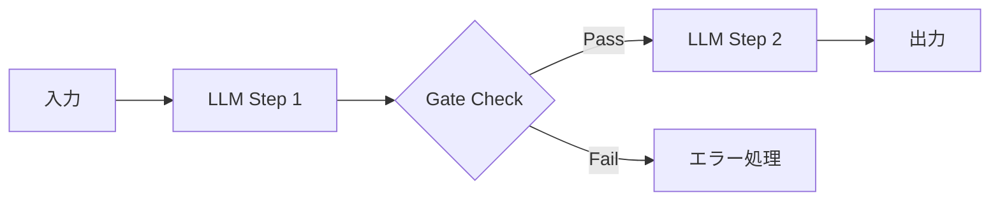
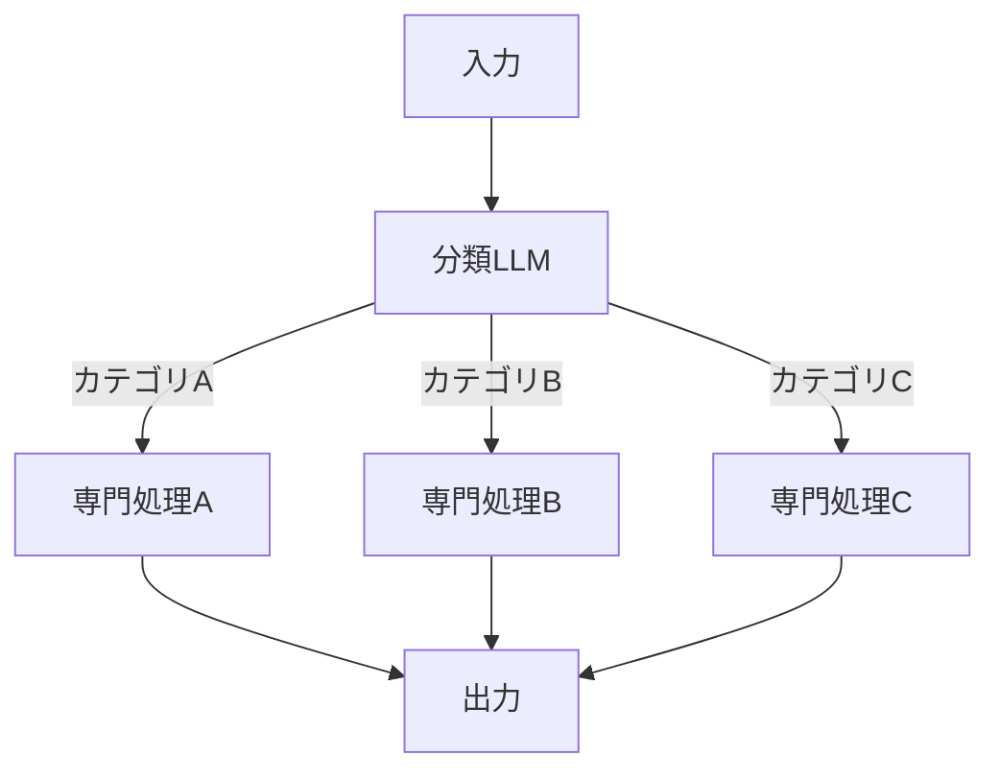
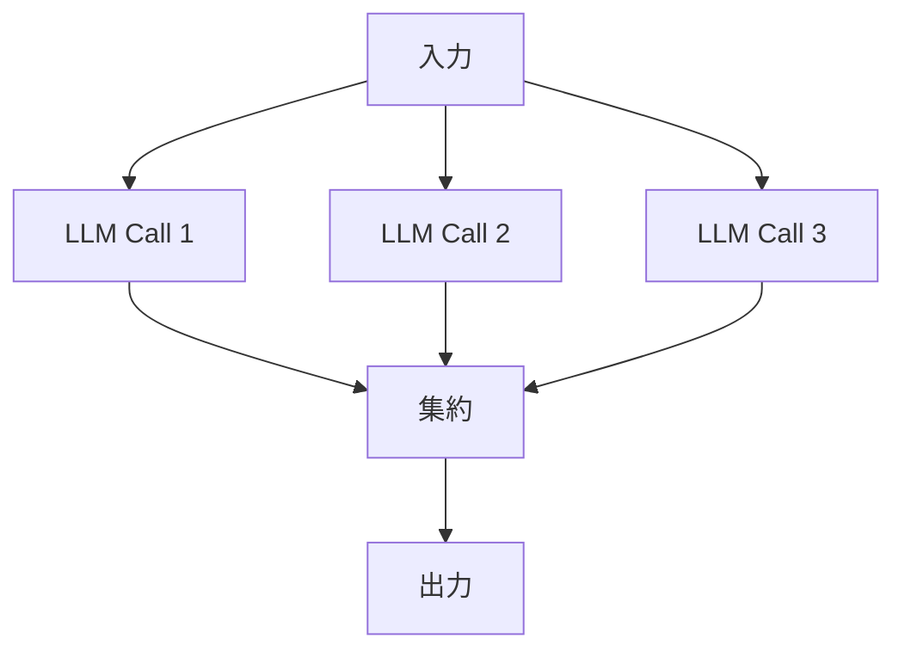
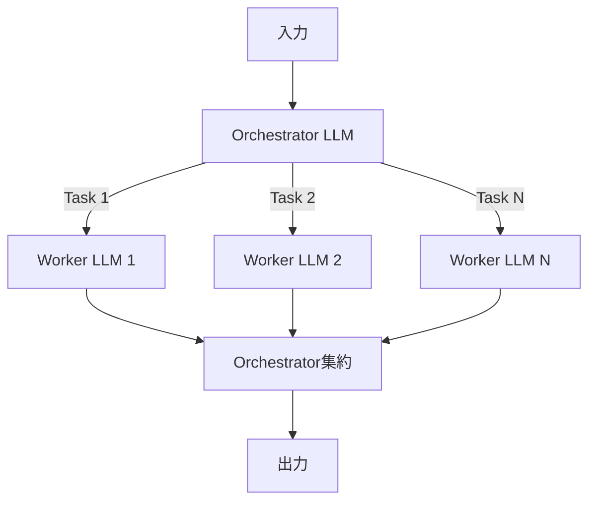
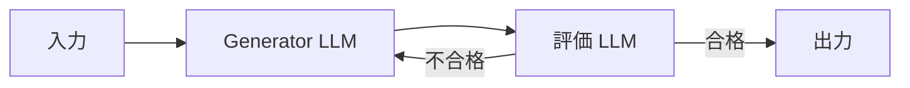
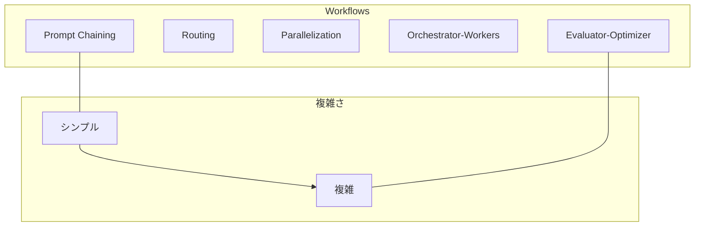

## ブログ概要（Summary）

本記事は [https://www.anthropic.com/research/building-effective-agents](https://www.anthropic.com/research/building-effective-agents) の解説記事です。

Anthropicが2024年12月に公開した「Building Effective Agents」は、LLMを活用したエージェントシステムの設計指針を体系化したブログ記事である。Erik S.とBarry Zhangが執筆し、同社がカスタマーサポートやコーディングエージェントの構築を支援する中で得た知見を5つのワークフローパターン（Prompt Chaining、Routing、Parallelization、Orchestrator-Workers、Evaluator-Optimizer）として整理している。記事の核心は「シンプルさを維持せよ」という原則であり、フレームワークへの過度な依存を避け、LLM APIの直接呼び出しから始めることを推奨している。

この記事は [Zenn記事: Semantic Kernel 5大オーケストレーションパターンをPython×C#で実装比較する](https://zenn.dev/0h_n0/articles/a27bae62608bfd) の深掘りです。

## 情報源

- **種別**: 企業テックブログ（Anthropic Research Blog）
- **URL**: [https://www.anthropic.com/research/building-effective-agents](https://www.anthropic.com/research/building-effective-agents)
- **組織**: Anthropic（Claude開発元）
- **著者**: Erik S., Barry Zhang
- **発表日**: 2024年12月19日

## 技術的背景（Technical Background）

### Workflows vs Agents: 2つの概念の明確な区別

Anthropicはブログ冒頭で、「エージェント」という用語の曖昧さを指摘し、明確な定義を与えている。

- **Workflows**: LLMとツールが**事前定義されたコードパス**で構成されるシステム。処理フローは開発者がコードで制御する
- **Agents**: LLMが**自律的にプロセスとツール使用を決定**するシステム。タスクの達成方法をLLM自身が判断する

この区別は設計上の意思決定において本質的である。Workflowsは予測可能性が高く、デバッグが容易である一方、Agentsは柔軟性が高いが制御が困難になる。Anthropicは「ほとんどのアプリケーションではworkflowで十分」と述べており、agentが必要になるケースは自由度の高い問題に限定されると主張している。

### 3つのコア原則

Anthropicは、エージェントシステム設計にあたって3つの原則を掲げている。

1. **Simplicity（シンプルさ）**: シンプルなプロンプトから始め、包括的な評価に基づいて最適化する。複雑さはシンプルな解決策では不十分な場合にのみ追加する
2. **Transparency（透明性）**: 各ステップでモデルが何をしているか、なぜそうしているかが把握できるようにする。ブラックボックス化を防ぐ
3. **Tool Documentation（ツールドキュメンテーション）**: ツール定義に使用例、エッジケース、明確な境界を含め、モデルが正しくツールを選択・使用できるようにする

### フレームワークに対する慎重な姿勢

Anthropicは、LangGraphやCrewAIのようなフレームワークの利用について慎重な姿勢を示している。フレームワークは開発の初速を高める一方、抽象化レイヤーが増えることで以下の問題が生じうると述べている。

- 内部動作の不透明化（Transparency原則に反する）
- デバッグの困難化
- 過剰な複雑性の導入

そのため、LLM APIの直接呼び出しから開始し、必要に応じてフレームワークを導入するアプローチを推奨している。

## 実装アーキテクチャ（Architecture）

Anthropicは5つのワークフローパターンを提示している。以下に各パターンの構造、用途、設計上の考慮点を解説する。

### パターン1: Prompt Chaining（プロンプト連鎖）

タスクを順次的なステップに分解し、各LLM呼び出しが前のステップの出力を処理する。各ステップの間にプログラム的なゲート検証を挟むことで、品質制御が可能になる。



**用途**: マーケティングコピー生成後の翻訳、文書アウトラインの作成後に本文展開、といった段階的なタスク。

**設計の要点**: 各ステップが独立した小さなタスクであること、中間結果の検証が可能であることが前提。ステップ間のデータ受け渡しが明確であるため、デバッグが容易である。

### パターン2: Routing（ルーティング）

入力を分類し、分類結果に基づいて専門的な下流タスクに振り分ける。各下流タスクは特定のドメインに最適化されたプロンプトやモデルを使用できる。



**用途**: カスタマーサービスにおけるクエリの分類（一般質問 / 技術サポート / 返金依頼）、モデルティアの選択（簡易タスクにはHaiku、複雑タスクにはSonnet）。

**設計の要点**: 分類の精度がシステム全体の性能を左右する。分類が誤ると、不適切な下流処理が実行される。Anthropicは関心の分離（Separation of Concerns）の利点を強調している。

### パターン3: Parallelization（並列化）

複数のLLM呼び出しを同時に実行する。2つのサブパターンが存在する。

**Sectioning（分割）**: 独立したサブタスクを同時実行し、結果を統合する。

**Voting（投票）**: 同一タスクを複数回実行して多様な出力を得て、集約する。



**用途**:
- Sectioning: ガードレール実装（コンテンツスクリーニングとユーザー応答を同時実行）
- Voting: コード脆弱性レビュー（複数の視点でレビューし、多数決で判断）

**設計の要点**: 各サブタスクが独立であること（依存関係があると並列化できない）。レイテンシは最も遅いサブタスクに律速される。コスト面では、並列実行により総トークン使用量は増加するが、wall-clock timeは短縮される。

### パターン4: Orchestrator-Workers（オーケストレータ・ワーカー）

中央のオーケストレータLLMがタスクを動的に分解し、ワーカーLLMに委譲する。Prompt Chainingとの違いは、サブタスクが事前定義ではなく**実行時に動的に決定**される点にある。



**用途**: マルチファイルにまたがるコード変更（オーケストレータが変更対象ファイルと変更内容を判断）、マルチソースからの情報収集。

**設計の要点**: オーケストレータの判断品質がシステム全体を左右する。サブタスクの数やスコープが実行時に変動するため、コストとレイテンシの予測が困難になる。

### パターン5: Evaluator-Optimizer（評価者・最適化者）

生成LLMが応答を作成し、別の評価LLMがフィードバックを提供する反復ループ。評価基準が明確で、反復による改善が見込めるタスクに適している。



**用途**: 文学翻訳（ニュアンスの反復改善）、複雑な検索タスク（検索結果の網羅性を評価し、追加検索を指示）。

**設計の要点**: 収束条件の定義が重要。最大反復回数を設定しないと、無限ループに陥るリスクがある。評価基準が曖昧だと、反復しても品質が改善しない。

### 5パターンの全体像



Anthropicは、上記パターンを複雑さの低い順（Prompt Chaining）から高い順（Evaluator-Optimizer）へ検討することを推奨している。シンプルなパターンで解決できるなら、複雑なパターンを採用する必要はない。

## Production Deployment Guide

### AWS実装パターン（コスト最適化重視）

Anthropicの5パターンをAWS上でプロダクション運用する場合の構成例を示す。コスト試算は2026年9月時点のap-northeast-1（東京）リージョン料金に基づく概算値であり、実際のコストはトラフィックパターンやバースト使用量により変動する。最新料金はAWS料金計算ツールでの確認を推奨する。

**トラフィック量別推奨構成**:

| 構成 | トラフィック | アーキテクチャ | 月額概算 |
|------|-------------|--------------|---------|
| Small | ~100 req/日 | Lambda + Bedrock + DynamoDB | $50-150 |
| Medium | ~1,000 req/日 | ECS Fargate + Bedrock + ElastiCache | $300-800 |
| Large | 10,000+ req/日 | EKS + Karpenter + Spot + Bedrock | $2,000-5,000 |

**Small構成の内訳**:
- Lambda: $0（Free Tier内）、512MB RAM、タイムアウト300秒
- Bedrock Claude Sonnet: 入力$3/MTok、出力$15/MTok。100 req/日 x 2Kトークン平均 = ~$10/月
- DynamoDB On-Demand: $0.25/100万読み取り = ~$1/月
- CloudWatch: ~$5/月

**コスト削減テクニック**:
- Bedrock Batch APIで非リアルタイム処理を50%コスト削減
- Prompt Cachingで繰り返しSystem Promptのコストを最大90%削減
- Routingパターンでモデルティアを動的選択（簡易タスクにHaikuを使用し、コストを1/10に）

### Terraformインフラコード

**Small構成（Serverless）**:

```hcl
# VPC（NAT Gateway不使用でコスト削減）
resource "aws_vpc" "main" {
  cidr_block           = "10.0.0.0/16"
  enable_dns_hostnames = true
  tags = { Name = "agent-workflow-vpc" }
}

# IAMロール（最小権限原則）
resource "aws_iam_role" "lambda_role" {
  name = "agent-workflow-lambda"
  assume_role_policy = jsonencode({
    Version = "2012-10-17"
    Statement = [{
      Action = "sts:AssumeRole"
      Effect = "Allow"
      Principal = { Service = "lambda.amazonaws.com" }
    }]
  })
}

resource "aws_iam_role_policy" "bedrock_invoke" {
  name = "bedrock-invoke"
  role = aws_iam_role.lambda_role.id
  policy = jsonencode({
    Version = "2012-10-17"
    Statement = [{
      Effect   = "Allow"
      Action   = ["bedrock:InvokeModel", "bedrock:InvokeModelWithResponseStream"]
      Resource = "arn:aws:bedrock:ap-northeast-1::foundation-model/anthropic.claude-*"
    }]
  })
}

# Lambda関数
resource "aws_lambda_function" "agent_workflow" {
  function_name = "agent-workflow-handler"
  runtime       = "python3.12"
  handler       = "main.handler"
  role          = aws_iam_role.lambda_role.arn
  timeout       = 300
  memory_size   = 512
  filename      = "lambda.zip"

  environment {
    variables = {
      BEDROCK_MODEL_ID = "anthropic.claude-sonnet-4-20250514"
      DYNAMODB_TABLE   = aws_dynamodb_table.state.name
    }
  }
}

# DynamoDB（On-Demandモード）
resource "aws_dynamodb_table" "state" {
  name         = "agent-workflow-state"
  billing_mode = "PAY_PER_REQUEST"
  hash_key     = "workflow_id"

  attribute {
    name = "workflow_id"
    type = "S"
  }

  server_side_encryption { enabled = true }
}

# CloudWatchアラーム（コスト監視）
resource "aws_cloudwatch_metric_alarm" "lambda_duration" {
  alarm_name          = "agent-workflow-high-duration"
  comparison_operator = "GreaterThanThreshold"
  evaluation_periods  = 3
  metric_name         = "Duration"
  namespace           = "AWS/Lambda"
  period              = 300
  statistic           = "Average"
  threshold           = 60000
  alarm_actions       = [aws_sns_topic.alerts.arn]
  dimensions = { FunctionName = aws_lambda_function.agent_workflow.function_name }
}
```

**Large構成（Container）**:

```hcl
# EKSクラスタ
module "eks" {
  source          = "terraform-aws-modules/eks/aws"
  version         = "~> 20.0"
  cluster_name    = "agent-workflow-cluster"
  cluster_version = "1.31"
  vpc_id          = aws_vpc.main.id
  subnet_ids      = aws_subnet.private[*].id

  cluster_endpoint_public_access = false
}

# Karpenter Provisioner（Spot優先）
resource "kubectl_manifest" "karpenter_nodepool" {
  yaml_body = yamlencode({
    apiVersion = "karpenter.sh/v1"
    kind       = "NodePool"
    metadata   = { name = "agent-workers" }
    spec = {
      template = {
        spec = {
          requirements = [
            { key = "karpenter.sh/capacity-type", operator = "In", values = ["spot", "on-demand"] },
            { key = "node.kubernetes.io/instance-type", operator = "In",
              values = ["m7i.xlarge", "m7i.2xlarge", "m6i.xlarge", "m6i.2xlarge"] }
          ]
        }
      }
      limits   = { cpu = "100", memory = "400Gi" }
      disruption = { consolidationPolicy = "WhenEmptyOrUnderutilized" }
    }
  })
}

# AWS Budgets（予算アラート）
resource "aws_budgets_budget" "monthly" {
  name         = "agent-workflow-monthly"
  budget_type  = "COST"
  limit_amount = "5000"
  limit_unit   = "USD"
  time_unit    = "MONTHLY"

  notification {
    comparison_operator       = "GREATER_THAN"
    threshold                 = 80
    threshold_type            = "PERCENTAGE"
    notification_type         = "ACTUAL"
    subscriber_sns_topic_arns = [aws_sns_topic.alerts.arn]
  }
}
```

### 運用・監視設定

**CloudWatch Logs Insights クエリ**（コスト異常検知）:

```
fields @timestamp, @message
| filter @message like /tokens/
| stats sum(input_tokens) as total_input, sum(output_tokens) as total_output by bin(1h) as hour
| sort hour desc
| limit 24
```

**CloudWatch Logs Insights クエリ**（レイテンシ分析）:

```
fields @timestamp, duration_ms
| stats percentile(duration_ms, 95) as p95, percentile(duration_ms, 99) as p99, avg(duration_ms) as avg_ms by bin(1h)
| sort @timestamp desc
```

**X-Ray トレーシング設定**:

```python
from aws_xray_sdk.core import xray_recorder, patch_all
import boto3

# boto3自動計装
patch_all()

@xray_recorder.capture("invoke_bedrock")
def invoke_workflow(workflow_type: str, payload: dict) -> dict:
    """ワークフローパターンを実行しトレースを記録する"""
    subsegment = xray_recorder.current_subsegment()
    subsegment.put_annotation("workflow_type", workflow_type)
    subsegment.put_metadata("payload_size", len(str(payload)))

    client = boto3.client("bedrock-runtime", region_name="ap-northeast-1")
    response = client.invoke_model(
        modelId="anthropic.claude-sonnet-4-20250514",
        body=json.dumps(payload),
    )
    return json.loads(response["body"].read())
```

**Cost Explorer 日次レポート**:

```python
import boto3
from datetime import datetime, timedelta

def get_daily_cost_report() -> dict[str, float]:
    """Bedrock・Lambda・EKSの日次コストを取得する"""
    ce = boto3.client("ce", region_name="us-east-1")
    today = datetime.utcnow().strftime("%Y-%m-%d")
    yesterday = (datetime.utcnow() - timedelta(days=1)).strftime("%Y-%m-%d")

    response = ce.get_cost_and_usage(
        TimePeriod={"Start": yesterday, "End": today},
        Granularity="DAILY",
        Metrics=["UnblendedCost"],
        Filter={
            "Or": [
                {"Dimensions": {"Key": "SERVICE", "Values": ["Amazon Bedrock"]}},
                {"Dimensions": {"Key": "SERVICE", "Values": ["AWS Lambda"]}},
                {"Dimensions": {"Key": "SERVICE", "Values": ["Amazon Elastic Kubernetes Service"]}},
            ]
        },
        GroupBy=[{"Type": "DIMENSION", "Key": "SERVICE"}],
    )
    costs = {}
    for group in response["ResultsByTime"][0]["Groups"]:
        service = group["Keys"][0]
        amount = float(group["Metrics"]["UnblendedCost"]["Amount"])
        costs[service] = amount
    total = sum(costs.values())

    if total > 100:
        sns = boto3.client("sns", region_name="ap-northeast-1")
        sns.publish(
            TopicArn="arn:aws:sns:ap-northeast-1:ACCOUNT:cost-alert",
            Subject=f"Daily cost alert: ${total:.2f}",
            Message=f"Agent workflow daily cost exceeded $100: {costs}",
        )
    return costs
```

### コスト最適化チェックリスト

**アーキテクチャ選択**:
- [ ] トラフィック量に応じた構成を選択（~100 req/日: Serverless、~1,000: Hybrid、10,000+: Container）
- [ ] Routingパターンでモデルティアを動的選択（Haiku/Sonnet/Opus）
- [ ] Prompt Chainingで中間ゲートを設け、不要なLLM呼び出しを削減

**リソース最適化**:
- [ ] EC2/EKS: Spot Instances優先（最大90%削減）
- [ ] Reserved Instances: 1年コミットで最大72%削減
- [ ] Savings Plans: コンピューティング全体の割引を検討
- [ ] Lambda: メモリサイズをPower Tuningで最適化
- [ ] ECS/EKS: Karpenterでアイドル時スケールダウン

**LLMコスト削減**:
- [ ] Bedrock Batch API: 非リアルタイム処理で50%削減
- [ ] Prompt Caching: 繰り返しSystem Promptで最大90%削減
- [ ] モデル選択ロジック: 簡易タスクにHaiku（コスト1/10）
- [ ] トークン数制限: max_tokensで出力上限設定
- [ ] 不要な並列実行の排除（Parallelizationの過剰適用を避ける）

**監視・アラート**:
- [ ] AWS Budgets: 月次予算アラート（80%/100%閾値）
- [ ] CloudWatch アラーム: Lambda実行時間、Bedrockトークン量
- [ ] Cost Anomaly Detection: 自動異常検知有効化
- [ ] 日次コストレポート: SNS通知で$100/日超過を検知

**リソース管理**:
- [ ] 未使用Lambda関数・EKSノードの削除
- [ ] タグ戦略: `project`, `environment`, `cost-center`タグ必須
- [ ] S3ライフサイクルポリシー: ログの自動アーカイブ
- [ ] 開発環境の夜間停止（EKSノード数0へスケールダウン）
- [ ] CloudTrail/Config有効化で監査証跡を確保

## パフォーマンス最適化（Performance）

### レイテンシ特性

各パターンのレイテンシ特性は構造的に異なる。Anthropicのブログでは具体的な数値は公開されていないが、パターンの構造から以下の特性が導かれる。

| パターン | レイテンシ特性 | ボトルネック |
|---------|-------------|------------|
| Prompt Chaining | ステップ数に比例（直列） | 各ステップのLLM応答時間の合計 |
| Routing | 分類 + 1ステップ（低い） | 分類精度 |
| Parallelization | 最遅サブタスクに律速（短縮可） | 最遅の並列タスク |
| Orchestrator-Workers | 動的で予測困難 | オーケストレータの判断回数 |
| Evaluator-Optimizer | 反復回数に比例（最悪ケース大） | 収束速度 |

### コスト効率の考慮

Anthropicはブログ中でRoutingパターンにおけるモデルティア選択の例を挙げている。簡易な質問にはHaiku（低コスト・高速）、複雑な質問にはSonnet（高コスト・高精度）を振り分けることで、全リクエストをSonnetで処理する場合と比較してコストを大幅に削減できると述べている。

## 運用での学び（Production Lessons）

### ツール設計のベストプラクティス

Anthropicは、ツール設計がエージェントの性能に大きく影響すると述べている。具体的には以下の原則を挙げている。

1. **モデル推論用トークンを確保する**: ツールの出力が大きすぎると、コンテキストウィンドウを圧迫し、推論品質が低下する
2. **インターネット上の自然なテキスト形式に合わせる**: モデルの訓練データに含まれる形式に近い入出力を設計する
3. **フォーマットオーバーヘッドを排除する**: 不要なメタデータやネスト構造を避ける
4. **ポカヨケ原則**: ミスが発生しにくい設計にする。例えば、相対パスではなく絶対パスを要求することで、パス解決のエラーを排除する

### SWE-bench事例: 絶対パスへの切り替え

Anthropicは、コーディングエージェント（SWE-benchタスクを解決するエージェント）の開発において、ツールのパス指定を相対パスから絶対パスに変更するだけで、モデルのミスが大幅に減少した事例を報告している。これはポカヨケ原則の典型的な適用例であり、モデルの能力を向上させるのではなく、ミスが起きにくい環境を設計するアプローチである。

### カスタマーサポートにおけるエージェント活用

Anthropicは実世界の事例として、ツール統合型のカスタマーサポートチャットボットを挙げている。このエージェントは払い戻し処理やチケット更新といった外部システムとの連携を行い、Routingパターンでクエリを分類し、適切な処理フローに振り分ける。人間のオペレータへのエスカレーション（ハンドオフ）機能も組み込まれている。

## 学術研究との関連（Academic Connection）

### Semantic Kernelとの対応関係

Zenn記事で解説されているMicrosoft Semantic Kernelの5大オーケストレーションパターンと、Anthropicの5つのワークフローパターンには構造的な対応関係が存在する。以下の表にまとめる。

| Anthropicパターン | Semantic Kernelパターン | 対応度 | 備考 |
|-----------------|----------------------|-------|------|
| Prompt Chaining | Sequential | 高 | 直列実行の基本構造は同一。Semantic KernelではKernel Functionチェーンとして実装 |
| Parallelization | Concurrent | 高 | 独立タスクの同時実行。Semantic KernelではTaskベースの並列実行 |
| Routing | Handoff（部分的） | 中 | Anthropicの分類ベースルーティングに対し、Semantic KernelのHandoffはエージェント間の制御移譲。範囲が異なる |
| Orchestrator-Workers | Handoff + GroupChat | 中 | 動的タスク分解はGroupChatのオーケストレータ的機能で実現可能だが、Semantic Kernelではより汎用的な設計 |
| Evaluator-Optimizer | GroupChat（部分的） | 低 | GroupChatの反復的議論が部分的に対応するが、明示的な評価・最適化ループとは異なる |

### 設計思想の違い

Anthropicのアプローチは**ボトムアップ**である。シンプルなLLM API呼び出しから始め、必要に応じてパターンを組み合わせる。一方、Semantic Kernelは**フレームワーク主導**であり、抽象化レイヤー（Kernel, Plugin, Agent）の上にオーケストレーションを構築する。

この違いは設計哲学に起因する。Anthropicは「フレームワークの抽象化が透明性を損なう」リスクを強調するのに対し、MicrosoftのSemantic Kernelは「フレームワークによる標準化と再利用性」を重視している。どちらが優れているかは一概に言えず、プロジェクトの規模や要件に依存する。

### Workflows vs Agentsの学術的位置づけ

Anthropicが提唱するWorkflows vs Agentsの区別は、マルチエージェントシステム研究における**反応型（reactive）** vs **審議型（deliberative）**エージェントの分類と概念的に対応する。Workflowsは事前定義されたフローに従う反応型に近く、Agentsは目標に基づいて行動を計画する審議型に近い。ただし、Anthropicは純粋な学術的分類ではなく、プロダクション設計における実用的な区別として提示している。

## まとめと実践への示唆

Anthropicの「Building Effective Agents」は、LLMエージェントの設計パターンを5つのワークフロー（Prompt Chaining、Routing、Parallelization、Orchestrator-Workers、Evaluator-Optimizer）に体系化し、「シンプルさ」「透明性」「ツールドキュメンテーション」の3原則を提唱している。

実践への示唆として重要なのは以下の3点である。

1. **段階的な複雑化**: 最もシンプルなパターンから検討し、必要な場合にのみ複雑なパターンを採用する
2. **ツール設計への投資**: モデル自体の改善よりも、ツールインターフェースの設計改善（ポカヨケ等）が即効性が高い
3. **パターンの選択基準**: Semantic Kernelのようなフレームワークを使う場合でも、Anthropicのパターン分類を参照することで、各オーケストレーションパターンの適用場面を明確化できる

AnthropicのアプローチとSemantic Kernelのアプローチは相互排他ではなく、補完的に活用できる。Anthropicのパターン分類で設計方針を決め、Semantic Kernelのフレームワークで実装するという組み合わせは実用的な選択肢である。

## 参考文献

- **Blog URL**: [https://www.anthropic.com/research/building-effective-agents](https://www.anthropic.com/research/building-effective-agents)
- **Related Zenn article**: [https://zenn.dev/0h_n0/articles/a27bae62608bfd](https://zenn.dev/0h_n0/articles/a27bae62608bfd)
- **Semantic Kernel Documentation**: [https://learn.microsoft.com/ja-jp/semantic-kernel/](https://learn.microsoft.com/ja-jp/semantic-kernel/)
