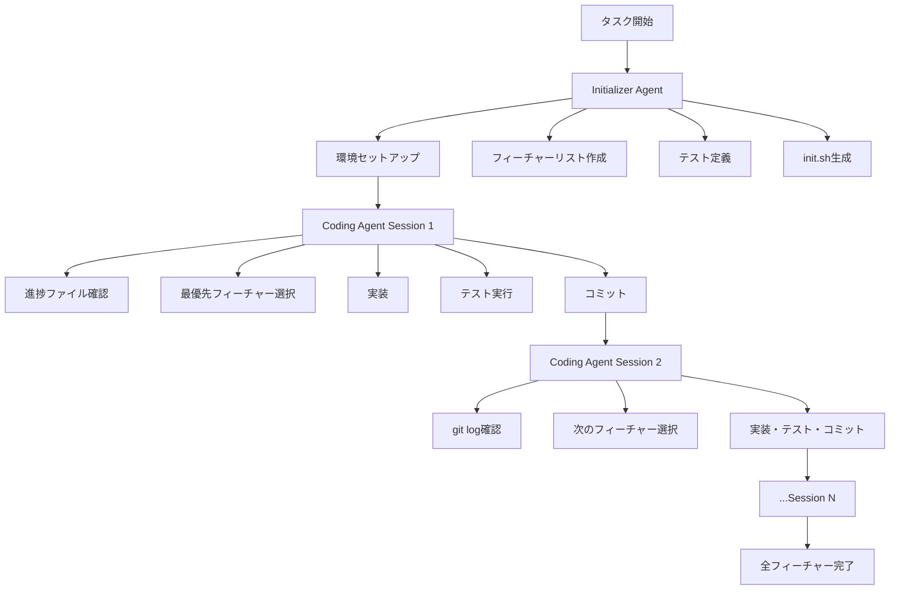

本記事は [Effective Harnesses for Long-Running Agents — Anthropic Engineering](https://www.anthropic.com/engineering/effective-harnesses-for-long-running-agents) の解説記事です。

## ブログ概要（Summary）

Anthropic Engineeringが公開した本記事は、複数のコンテキストウィンドウにまたがって長時間動作するAIエージェントの「ハーネス」（harness、制御枠組み）設計に関する実践的なガイドである。著者のJustin Youngは、エージェントが「シフト制のエンジニア」のように前回のセッションの記憶なしに次のセッションを開始する問題を提起し、Initializer Agent / Coding Agentの2段階アーキテクチャで解決するアプローチを紹介している。

この記事は [Zenn記事: Claude Agent SDKで評価ハーネスを構築しTerminal-Benchの成功率を回帰検証する](https://zenn.dev/0h_n0/articles/1e791e8f0cc2a2) の深掘りです。

## 情報源

- **種別**: 企業テックブログ
- **URL**: [https://www.anthropic.com/engineering/effective-harnesses-for-long-running-agents](https://www.anthropic.com/engineering/effective-harnesses-for-long-running-agents)
- **組織**: Anthropic Engineering
- **著者**: Justin Young
- **発表日**: 2025年11月26日

## 技術的背景（Technical Background）

AIエージェントはコンテキストウィンドウという物理的制約の中で動作する。長時間のタスク（大規模リポジトリの構築、マルチフィーチャー実装など）は単一のコンテキストウィンドウには収まらず、複数セッションにわたる作業が必要になる。

問題は、新しいセッションが開始されるたびにエージェントが「白紙の状態」から始まることである。著者はこれを「シフト制のエンジニアが、前のシフトのエンジニアが何をしたか全く知らない状態で出勤する」とたとえている。

この問題は、Zenn記事で扱う評価ハーネスの設計にも直結する。評価パイプラインが長時間にわたる場合（例: 50タスクの逐次実行）、セッション間の状態引き継ぎが必須となる。

## 実装アーキテクチャ（Architecture）

### 2段階エージェントアーキテクチャ

著者は、ハーネスを以下の2つのエージェントに分離する設計を提案している。



**Initializer Agent**: 初回のみ実行。環境構築、フィーチャーリスト定義、テスト作成を担当する。

**Coding Agent**: 各セッションで実行。前回のセッションの状態をgit log・進捗ファイルから復元し、次のフィーチャーを選択して実装する。

### フィーチャーリストファイル

Initializer Agentが生成するフィーチャーリストは、JSON構造で以下の要素を含む。

```json
{
  "features": [
    {
      "id": "auth-login",
      "description": "Implement user login with email/password",
      "category": "authentication",
      "steps": [
        "Create login form component",
        "Implement API endpoint",
        "Add session management"
      ],
      "passes": false
    },
    {
      "id": "auth-signup",
      "description": "Implement user registration",
      "category": "authentication",
      "steps": [
        "Create signup form",
        "Validate input",
        "Store user in database"
      ],
      "passes": false
    }
  ]
}
```

著者は「テストを削除・編集することは許容されない。機能の欠落やバグにつながるため」と明記している。これは評価ハーネスにおけるPASS_TO_PASSの概念と一致する——既存テストの破壊は回帰として検出されるべきである。

### 増分進行パターン

各Coding Agentセッションは以下のワークフローに従う。

1. 作業ディレクトリの確認
2. git logと進捗ドキュメントのレビュー
3. 最優先の未完了フィーチャーの選択
4. アプリケーションのベースライン動作確認
5. 単一フィーチャーの実装
6. 説明的なコミットメッセージでコミット

```python
from dataclasses import dataclass
from enum import Enum


class SessionPhase(Enum):
    CONTEXT_GATHERING = "context_gathering"
    FEATURE_SELECTION = "feature_selection"
    IMPLEMENTATION = "implementation"
    VERIFICATION = "verification"
    COMMIT = "commit"


@dataclass
class SessionWorkflow:
    """各Coding Agentセッションのワークフロー管理。"""
    feature_list_path: str
    progress_file_path: str

    def gather_context(self) -> dict:
        """git logと進捗ファイルからコンテキストを復元する。

        Returns:
            前回のセッションの状態
        """
        import json
        import subprocess

        git_log = subprocess.run(
            ["git", "log", "--oneline", "-20"],
            capture_output=True, text=True,
        ).stdout

        with open(self.progress_file_path) as f:
            progress = json.load(f)

        with open(self.feature_list_path) as f:
            features = json.load(f)

        incomplete = [
            f for f in features["features"] if not f["passes"]
        ]

        return {
            "recent_commits": git_log,
            "progress": progress,
            "incomplete_features": incomplete,
            "next_feature": incomplete[0] if incomplete else None,
        }

    def verify_baseline(self) -> bool:
        """アプリケーションのベースライン動作を確認する。

        Returns:
            ベースラインテストが通過したかどうか
        """
        import subprocess

        result = subprocess.run(
            ["bash", "init.sh"],
            capture_output=True, text=True, timeout=60,
        )
        return result.returncode == 0
```

## 失敗モードと対策（Failure Modes）

著者はエージェントの典型的な失敗パターンと対策を以下のように整理している。

| 失敗モード | 原因 | 対策 |
|-----------|------|------|
| 早期完了宣言 | フィーチャーリストの不在 | 包括的なフィーチャートラッキングの確立 |
| 環境劣化 | 状態管理の不備 | gitベースのバージョン管理と進捗ドキュメント |
| 不十分なフィーチャー検証 | テスト実行の省略 | E2Eテスト要件の強制 |
| 設定の混乱 | 環境構築の複雑さ | 自動初期化スクリプト（init.sh）の提供 |

これらの失敗モードは、Zenn記事のTrajectory Checksが検出すべきパターンと直接対応する。「早期完了宣言」はLucky Pass、「環境劣化」は回帰サイクル、「不十分な検証」はVerification欠如に相当する。

## テスト方法論（Testing Methodology）

著者はテストを「最も重要な要素」と位置付けている。初期の実験では、エージェントがフィーチャーを「完了」としてマークしたにもかかわらず、適切な検証を行っていなかった。

対策として、ブラウザ自動化ツール（Puppeteer MCP）を提供し、「人間のユーザーと同じようにテストする」ことを可能にした。ただし、ブラウザのネイティブalertモーダルの検出など、現在の自動化ツールでは対応できない制限も報告されている。

```python
from dataclasses import dataclass


@dataclass
class FeatureVerifier:
    """フィーチャーの完了を検証する。"""

    def verify_feature(
        self, feature_id: str, test_command: str,
    ) -> dict:
        """フィーチャーの完了を検証する。

        Args:
            feature_id: フィーチャーID
            test_command: テスト実行コマンド

        Returns:
            検証結果
        """
        import subprocess

        result = subprocess.run(
            ["bash", "-c", test_command],
            capture_output=True, text=True, timeout=120,
        )
        return {
            "feature_id": feature_id,
            "passed": result.returncode == 0,
            "stdout": result.stdout[-500:] if result.stdout else "",
            "stderr": result.stderr[-500:] if result.stderr else "",
        }

    def verify_no_regressions(
        self,
        completed_features: list[str],
        test_commands: dict[str, str],
    ) -> dict:
        """完了済みフィーチャーに回帰がないことを確認する。

        Args:
            completed_features: 完了済みフィーチャーIDリスト
            test_commands: フィーチャーIDとテストコマンドの対応

        Returns:
            回帰検出結果
        """
        regressions = []
        for fid in completed_features:
            cmd = test_commands.get(fid)
            if cmd:
                result = self.verify_feature(fid, cmd)
                if not result["passed"]:
                    regressions.append(fid)
        return {
            "total_checked": len(completed_features),
            "regressions_found": len(regressions),
            "regressed_features": regressions,
        }
```

## パフォーマンス最適化（Performance）

著者の報告では、以下のパフォーマンス特性が観察されている。

- **セッション開始時間**: コンテキスト復元に1-2分（git log + 進捗ファイル読み取り）
- **フィーチャー実装**: 1セッションあたり1フィーチャー（複雑度により変動）
- **検証オーバーヘッド**: init.sh実行 + テスト実行で30秒-2分

最適化のポイントとして、進捗ファイルを簡潔に保つこと、git commitメッセージに十分な情報を含めること、init.shの冪等性を保証することが重要である。

## 運用での学び（Production Lessons）

### セッション間の状態管理

著者は、エージェントが「問題のある変更」を行った場合のロールバック機能の重要性を強調している。gitベースのバージョン管理により、任意のコミットに戻ることが可能となる。

### マルチエージェントアーキテクチャの展望

著者は今後の研究方向として、テスト専用エージェント、QA専用エージェント、コードクリーンアップ専用エージェントなど、役割を分離したマルチエージェント構成の可能性を述べている。

### ドメイン一般化

著者は、Web開発以外のドメイン（科学研究、金融モデリングなど）への適用可能性にも言及している。

## 学術研究との関連（Academic Connection）

本ブログ記事の設計パターンは、以下の学術研究と関連がある。

- **Terminal-Bench** (Merrill et al., 2026): Docker隔離環境での評価実行という共通の設計思想を持つ
- **AgentAssay** (Bhardwaj, 2026): エージェントの非決定性への対処として、複数セッションの統計的分析を提案
- **Swiss Cheese Model** (Anthropic "Demystifying Evals"): 本ブログ記事のInitializer/Coding Agent分離は、Swiss Cheese Modelの「複数の防御層」の実装例と解釈できる

## Production Deployment Guide

### AWS実装パターン（コスト最適化重視）

長時間エージェントハーネスをAWSにデプロイする構成を示す。

| 規模 | 月間セッション数 | 推奨構成 | 月額コスト | 主要サービス |
|------|---------------|---------|-----------|------------|
| **Small** | ~50セッション | Serverless | $100-250 | Lambda + Step Functions + S3 |
| **Medium** | ~500セッション | Hybrid | $600-1,500 | ECS Fargate + Bedrock + ElastiCache |
| **Large** | 2,000+セッション | Container | $3,000-7,000 | EKS + Karpenter + Bedrock Batch |

**Small構成の詳細**（月額$100-250）:
- **Step Functions**: セッションオーケストレーション（$15/月）
- **Lambda**: Initializer Agent・状態管理（$20/月）
- **Bedrock**: Claude呼び出し（Prompt Caching有効、$150/月）
- **S3**: 進捗ファイル・フィーチャーリスト保存（$5/月）
- **CodeCommit/GitHub**: gitリポジトリ（$0-10/月）

**コスト削減テクニック**:
- Bedrock Prompt Cachingで30-90%削減（Initializer Agentのシステムプロンプト固定）
- Step Functions Express Workflowsで低コスト実行
- S3 Intelligent-Tieringで保存コスト最適化

**コスト試算の注意事項**:
- 上記は2026年9月時点のAWS ap-northeast-1（東京）リージョン料金に基づく概算値です
- 最新料金は [AWS料金計算ツール](https://calculator.aws/) で確認してください

### Terraformインフラコード

```hcl
resource "aws_sfn_state_machine" "agent_harness" {
  name     = "long-running-agent-harness"
  role_arn = aws_iam_role.step_functions_role.arn

  definition = jsonencode({
    StartAt = "InitializerAgent"
    States = {
      InitializerAgent = {
        Type     = "Task"
        Resource = aws_lambda_function.initializer.arn
        Next     = "CodingAgentLoop"
      }
      CodingAgentLoop = {
        Type = "Map"
        ItemsPath = "$.features"
        MaxConcurrency = 1
        Iterator = {
          StartAt = "RunCodingSession"
          States = {
            RunCodingSession = {
              Type     = "Task"
              Resource = aws_lambda_function.coding_agent.arn
              Next     = "CheckCompletion"
              Retry = [{
                ErrorEquals = ["States.TaskFailed"]
                MaxAttempts = 2
                BackoffRate = 2
              }]
            }
            CheckCompletion = {
              Type = "Choice"
              Choices = [{
                Variable     = "$.feature_passed"
                BooleanEquals = true
                Next         = "FeatureComplete"
              }]
              Default = "RunCodingSession"
            }
            FeatureComplete = {
              Type = "Succeed"
            }
          }
        }
        Next = "FinalReport"
      }
      FinalReport = {
        Type = "Task"
        Resource = "arn:aws:states:::sns:publish"
        End  = true
      }
    }
  })
}

resource "aws_lambda_function" "initializer" {
  filename      = "initializer.zip"
  function_name = "agent-harness-initializer"
  role          = aws_iam_role.lambda_role.arn
  handler       = "index.handler"
  runtime       = "python3.12"
  timeout       = 900
  memory_size   = 1024
}

resource "aws_lambda_function" "coding_agent" {
  filename      = "coding_agent.zip"
  function_name = "agent-harness-coding"
  role          = aws_iam_role.lambda_role.arn
  handler       = "index.handler"
  runtime       = "python3.12"
  timeout       = 900
  memory_size   = 2048
}
```

### コスト最適化チェックリスト

- [ ] Bedrock Prompt Caching有効化で30-90%削減
- [ ] Step Functions Express Workflowsで低コスト実行
- [ ] Lambda Provisioned Concurrencyは使わない（バースト不要）
- [ ] S3 Intelligent-Tieringで保存コスト最適化
- [ ] Bedrock Batch API活用（非リアルタイム処理に50%割引）
- [ ] CloudWatch Logs保持期間を30日に制限
- [ ] DynamoDB TTLで古いセッション状態を自動削除
- [ ] AWS Budgets月額予算設定
- [ ] Cost Anomaly Detection有効化
- [ ] 夜間・週末のスケールダウン設定

## まとめと実践への示唆

Anthropic Engineeringの本記事は、長時間エージェントのハーネス設計における実践的なパターンを示している。Initializer Agent / Coding Agentの2段階アーキテクチャ、フィーチャーリストによる進捗管理、増分進行パターンは、Zenn記事の評価ハーネスにも直接応用可能である。特に、「既存テストの削除・編集は禁止」という制約はPASS_TO_PASSの回帰防止と同じ思想であり、評価パイプラインの信頼性を担保する根幹的な設計原則である。

## 参考文献

- **Blog URL**: [https://www.anthropic.com/engineering/effective-harnesses-for-long-running-agents](https://www.anthropic.com/engineering/effective-harnesses-for-long-running-agents)
- **Related**: [Demystifying Evals for AI Agents - Anthropic Engineering](https://www.anthropic.com/engineering/demystifying-evals-for-ai-agents)
- **Related Zenn article**: [https://zenn.dev/0h_n0/articles/1e791e8f0cc2a2](https://zenn.dev/0h_n0/articles/1e791e8f0cc2a2)
