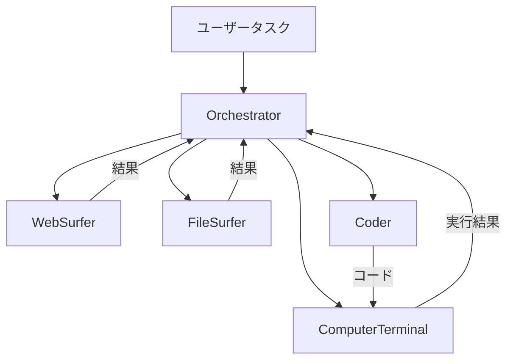

本記事は [Magentic-One: A Generalist Multi-Agent System for Solving Complex Tasks (arXiv:2411.04468)](https://arxiv.org/abs/2411.04468) の解説記事です。

## 論文概要（Abstract）

Magentic-Oneは、Microsoft Researchが提案する汎用マルチエージェントシステムであり、Web操作・ファイル処理・コード実行を含む複雑なタスクを5つの専門エージェントの協調によって解決する。中央のOrchestratorがTask LedgerとProgress Ledgerという2つの構造化された台帳を用いてタスク分解・計画・進捗追跡・エラー回復を管理する。著者らは、GAIA・AssistantBench・WebArenaの3つのベンチマークで評価を行い、GAIAテストセットにおいてGPT-4o+o1構成で38.00%の正答率を達成したと報告している。

この記事は [Zenn記事: Semantic Kernel 5大オーケストレーションパターンをPython×C#で実装比較する](https://zenn.dev/0h_n0/articles/a27bae62608bfd) の深掘りです。Zenn記事で紹介されている「Magentic」オーケストレーションパターンは、本論文のMagentic-Oneアーキテクチャに直接基づいている。

## 情報源

- **arXiv ID**: 2411.04468
- **URL**: [https://arxiv.org/abs/2411.04468](https://arxiv.org/abs/2411.04468)
- **著者**: Adam Fourney, Gagan Bansal, Hussein Mozannar, Cheng Tan, Eduardo Salinas, Erkang Zhu, et al. (Microsoft Research)
- **発表年**: 2024
- **分野**: cs.AI, cs.MA

## 背景と動機（Background & Motivation）

LLMを用いた単一エージェントシステムは、テキスト生成やコード補完には有効であるが、Webからの情報収集・ファイル分析・コード実行を組み合わせた複雑なタスクには限界がある。単一エージェントではコンテキストウィンドウの制約、ツール呼び出しの連鎖における誤り蓄積、異なるモダリティにまたがるタスク分解の困難さが顕在化する。

著者らはこの課題に対し、機能特化した複数エージェントを協調させるアプローチを採用している。Magentic-Oneの設計思想は「汎用性」と「モジュール性」の両立にある。各エージェントを独立に追加・削除・差し替え可能にすることで、モデルやツールの進化に柔軟に追従できる設計を実現している。

既存のマルチエージェントフレームワーク（AutoGen等）が汎用インフラを提供するのに対し、Magentic-Oneは具体的なエージェント構成とオーケストレーション戦略を提案している点に新規性がある。

## 主要な貢献（Key Contributions）

- **貢献1**: 5つの専門エージェント（Orchestrator, WebSurfer, FileSurfer, Coder, ComputerTerminal）による汎用マルチエージェントアーキテクチャの提案
- **貢献2**: Task LedgerとProgress Ledgerを用いたネステッドループ型オーケストレーション機構の設計
- **貢献3**: GAIA・AssistantBench・WebArenaの3ベンチマークでの包括的評価と、ablation studyによる各コンポーネントの寄与度定量化
- **貢献4**: エラーパターンの体系的分析とオープンソース公開

## 技術的詳細（Technical Details）

### 全体アーキテクチャ

Magentic-Oneは中央集権型のハブ・アンド・スポーク構造を採用し、Orchestratorが4つの専門エージェントを指揮する。エージェント間は直接通信せず、すべてのやり取りはOrchestratorを経由する。



| エージェント | 役割 | LLM使用 | 主要技術 |
|------------|------|---------|---------|
| **Orchestrator** | タスク分解・計画・進捗管理 | あり | ネステッドループ、2種類のLedger |
| **WebSurfer** | Chromiumブラウザ操作 | あり | Set-of-marks prompting |
| **FileSurfer** | ファイル・ドキュメント操作 | あり | Markdownプレビュー変換 |
| **Coder** | Pythonコード生成・デバッグ | あり | コード生成・修正 |
| **ComputerTerminal** | シェル・Python実行 | **なし** | 決定的実行のみ |

ComputerTerminalはLLMを使用しない唯一のエージェントであり、コード生成（非決定的）と実行（決定的）の責務が明確に分離されている。

### Orchestratorのネステッドループアーキテクチャ

Orchestratorの中核は外部ループ（Outer Loop）と内部ループ（Inner Loop）からなるネステッドループ構造である。

**外部ループ**はタスク全体の方針を決定する。Task Ledger（タスク台帳）に以下の4種類の情報を格納する。

- **Verified Facts**: 確認済みの事実
- **Lookup Items**: 検索・確認が必要な項目
- **Derived Facts**: 推論により導出された事実
- **Educated Guesses**: 根拠のある推測

外部ループは、stalling counterが閾値（$\leq 2$）を超えた場合にトリガーされ、計画全体を再構築する。

**内部ループ**は各イテレーションで5つの質問に回答する形で進行する。(1) タスクは完了したか、(2) ループに陥っていないか、(3) 前進しているか、(4) 次にどのエージェントに指示すべきか、(5) そのエージェントへの指示は何か。回答はProgress Ledger（進捗台帳）として記録される。

```python
from dataclasses import dataclass, field
from enum import Enum
from typing import Any, Protocol


class FactType(Enum):
    """Task Ledgerに格納する事実の種別。"""
    VERIFIED = "verified"
    LOOKUP = "lookup"
    DERIVED = "derived"
    GUESS = "educated_guess"


@dataclass
class TaskLedger:
    """外部ループで管理するタスク台帳。

    Attributes:
        facts: 蓄積された(内容, 種別, 情報源)のタプルリスト
        plan: 現在の実行計画
        iteration: 外部ループのイテレーション回数
    """
    facts: list[tuple[str, FactType, str | None]] = field(default_factory=list)
    plan: list[str] = field(default_factory=list)
    iteration: int = 0


@dataclass
class ProgressLedger:
    """内部ループで管理する進捗台帳。5つの判断を記録する。

    Attributes:
        is_complete: タスク完了判定
        is_looping: ループ検出判定
        is_progressing: 前進判定
        next_agent: 次に指示するエージェント名
        instruction: エージェントへの指示内容
        stalling_counter: 停滞カウンター
    """
    is_complete: bool = False
    is_looping: bool = False
    is_progressing: bool = True
    next_agent: str = ""
    instruction: str = ""
    stalling_counter: int = 0


class Agent(Protocol):
    """エージェントのインターフェース。"""
    @property
    def name(self) -> str: ...
    def execute(self, instruction: str, context: dict[str, Any]) -> str: ...


def orchestrate(
    task: str,
    agents: dict[str, Agent],
    max_outer: int = 5,
    max_inner: int = 20,
    stalling_threshold: int = 2,
) -> str:
    """Magentic-Oneのネステッドループオーケストレーション。

    Args:
        task: ユーザーからのタスク記述
        agents: エージェント名をキーとするエージェント辞書
        max_outer: 外部ループの最大反復回数
        max_inner: 内部ループの最大反復回数
        stalling_threshold: 停滞検出の閾値

    Returns:
        タスクの最終結果
    """
    ledger = TaskLedger()

    for outer_i in range(max_outer):
        ledger.iteration = outer_i
        ledger.plan = _create_plan(task, ledger)  # LLMで計画生成
        progress = ProgressLedger()

        for _ in range(max_inner):
            progress = _evaluate_progress(task, ledger, progress)
            if progress.is_complete:
                return _extract_answer(ledger)
            if progress.stalling_counter > stalling_threshold:
                break  # 外部ループへ戻り計画再構築

            result = agents[progress.next_agent].execute(
                instruction=progress.instruction,
                context={"task_ledger": ledger},
            )
            ledger.facts.append((result, FactType.VERIFIED, progress.next_agent))

    return _extract_answer(ledger)
```

エージェント選択は、Orchestrator LLMがタスク・進捗・計画のコンテキストから決定する。

$$
\text{next\_agent} = \arg\max_{a \in \mathcal{A}} P(a \mid \text{task}, \text{progress}, \text{plan})
$$

ここで $\mathcal{A}$ はエージェント集合、$P$ はOrchestratorのLLMが出力する選択確率を表す。

### Set-of-Marks Prompting

WebSurferはブラウザのスクリーンショット上にインタラクティブ要素（ボタン、リンク、入力フィールド等）をマーキングする「Set-of-marks prompting」を採用している。各要素に一意の数値IDが付与され、LLMは「要素5をクリック」のような形で操作を指示する。DOM解析やCSSセレクタの生成が不要になり、Web操作の成功率向上に寄与したと著者らは述べている。

## 実装のポイント（Implementation）

**AutoGen上での実装**: Magentic-OneはMicrosoftのAutoGenフレームワーク上に実装されており、GroupChatパターンを拡張したオーケストレーションロジックを構築している。

**モデル非依存設計**: Orchestratorに推論能力の高いモデル（o1等）、専門エージェントにコスト効率の良いモデル（GPT-4o等）を配置する構成が有効であると報告されている。

**ステートレス設計**: 各タスクを独立に処理し、タスク間で状態を持たない。

**セキュリティ考慮**: Docker等のサンドボックス環境での実行を推奨している。

## Production Deployment Guide

### AWS実装パターン

| 規模 | 月間タスク数 | 推奨構成 | 月額コスト | 主要サービス |
|------|-----------|---------|-----------|------------|
| **Small** | ~100 | Serverless | $150-500 | Lambda + Step Functions + Bedrock + DynamoDB |
| **Medium** | ~1,000 | Hybrid | $1,500-4,000 | ECS Fargate + ElastiCache + SQS + Bedrock |
| **Large** | 5,000+ | Container | $8,000-20,000 | EKS + Karpenter + EC2 Spot + Bedrock |

**Small構成**（月額$150-500）: Lambda $20、Step Functions $15、Bedrock $300（Prompt Caching有効）、DynamoDB $10、S3+CloudWatch $10。

上記は2026年9月時点のAWS ap-northeast-1料金に基づく概算値です。最新料金は [AWS料金計算ツール](https://calculator.aws/) で確認してください。

### Terraformインフラコード

**Small構成 (Serverless): Lambda + Step Functions + DynamoDB**

```hcl
resource "aws_iam_role" "orchestrator_lambda" {
  name = "magentic-one-orchestrator-role"
  assume_role_policy = jsonencode({
    Version = "2012-10-17"
    Statement = [{
      Action    = "sts:AssumeRole"
      Effect    = "Allow"
      Principal = { Service = "lambda.amazonaws.com" }
    }]
  })
}

resource "aws_iam_role_policy" "orchestrator_policy" {
  name = "magentic-one-orchestrator-policy"
  role = aws_iam_role.orchestrator_lambda.id
  policy = jsonencode({
    Version = "2012-10-17"
    Statement = [
      {
        Effect   = "Allow"
        Action   = ["bedrock:InvokeModel", "bedrock:InvokeModelWithResponseStream"]
        Resource = "arn:aws:bedrock:ap-northeast-1::foundation-model/*"
      },
      {
        Effect   = "Allow"
        Action   = ["dynamodb:GetItem", "dynamodb:PutItem", "dynamodb:UpdateItem", "dynamodb:Query"]
        Resource = aws_dynamodb_table.ledger_store.arn
      }
    ]
  })
}

resource "aws_dynamodb_table" "ledger_store" {
  name         = "magentic-one-ledgers"
  billing_mode = "PAY_PER_REQUEST"
  hash_key     = "task_id"
  range_key    = "ledger_type"
  attribute { name = "task_id"     ; type = "S" }
  attribute { name = "ledger_type" ; type = "S" }
  ttl { attribute_name = "expire_at" ; enabled = true }
  point_in_time_recovery { enabled = true }
}

resource "aws_lambda_function" "orchestrator" {
  filename      = "orchestrator.zip"
  function_name = "magentic-one-orchestrator"
  role          = aws_iam_role.orchestrator_lambda.arn
  handler       = "orchestrator.handler"
  runtime       = "python3.12"
  timeout       = 900
  memory_size   = 2048
  environment {
    variables = {
      LEDGER_TABLE       = aws_dynamodb_table.ledger_store.name
      BEDROCK_MODEL_ID   = "anthropic.claude-sonnet-4-20250514"
      MAX_OUTER_LOOPS    = "5"
      STALLING_THRESHOLD = "2"
    }
  }
}

resource "aws_sfn_state_machine" "nested_loop" {
  name     = "magentic-one-nested-loop"
  role_arn = aws_iam_role.step_functions_role.arn
  definition = jsonencode({
    StartAt = "OuterLoop"
    States = {
      OuterLoop = {
        Type = "Task", Resource = aws_lambda_function.orchestrator.arn
        Parameters = { "phase" = "outer_loop", "task.$" = "$.task" }
        ResultPath = "$.outer_result", Next = "InnerLoop"
      }
      InnerLoop = {
        Type = "Task", Resource = aws_lambda_function.orchestrator.arn
        Parameters = { "phase" = "inner_loop", "task.$" = "$.task", "task_ledger.$" = "$.outer_result.task_ledger" }
        ResultPath = "$.inner_result", Next = "EvaluateProgress"
      }
      EvaluateProgress = {
        Type = "Choice"
        Choices = [
          { Variable = "$.inner_result.is_complete", BooleanEquals = true, Next = "Done" },
          { Variable = "$.inner_result.stalling_counter", NumericGreaterThan = 2, Next = "OuterLoop" }
        ]
        Default = "InnerLoop"
      }
      Done = { Type = "Pass", End = true }
    }
  })
}
```

**Large構成 (Container)**: EKS + Karpenter + Spot Instancesで構築する。Karpenter NodePoolの `capacity-type: ["spot", "on-demand"]` 設定により、エージェントワーカーPodをSpot Instancesで起動し60-90%のコスト削減を実現する。`consolidationPolicy: WhenEmptyOrUnderutilized` でアイドルノードを30秒後に自動削除する。

### 運用・監視設定

```python
import boto3

cloudwatch = boto3.client("cloudwatch")

cloudwatch.put_metric_alarm(
    AlarmName="magentic-one-success-rate-drop",
    ComparisonOperator="LessThanThreshold",
    EvaluationPeriods=3,
    MetricName="TaskSuccessRate",
    Namespace="MagenticOne",
    Period=3600,
    Statistic="Average",
    Threshold=0.3,
    AlarmDescription="タスク成功率が30%を下回った場合のアラート",
    AlarmActions=["arn:aws:sns:ap-northeast-1:123456789:magentic-one-alerts"],
)
```

### コスト最適化チェックリスト

- [ ] Bedrock Prompt Cachingを有効化（Orchestratorプロンプト、30-90%削減）
- [ ] Bedrock Batch APIを非同期タスクに活用（50%割引）
- [ ] EC2 Spot Instancesをエージェントワーカーに使用（60-90%削減）
- [ ] Karpenter consolidationPolicyでアイドルノード自動削除
- [ ] DynamoDB TTLで古いLedgerデータを自動削除（30日以上）
- [ ] Lambda メモリサイズをPower Tuningで最適化
- [ ] Step Functions Express Workflowsに切り替え（短時間タスク向け）
- [ ] CloudWatch Logs保持期間を90日に設定
- [ ] VPCエンドポイント経由でBedrock呼び出し（NAT Gateway料金削減）
- [ ] エージェント別のモデル選択最適化（高性能モデルはOrchestratorのみ）
- [ ] AWS Budgets月額予算アラート設定
- [ ] Cost Anomaly Detection有効化
- [ ] Bedrock Guardrailsで無駄なトークン消費を抑制
- [ ] ECS Fargate Spot活用（Medium構成向け）
- [ ] 外部ループのmax_outer_loopsを実績に基づき調整

## 実験結果（Results）

### ベンチマーク評価

**GAIA テストセット（300問）** — 論文Table 1より

| 構成 | 正答率 (%) | 95% CI |
|------|-----------|--------|
| Magentic-One (GPT-4o) | 32.33 | ±5.3 |
| Magentic-One (GPT-4o + o1) | 38.00 | ±5.5 |
| omne v0.1（参考） | 40.53 | - |
| Human（参考） | 92.00 | - |

**AssistantBench テストセット（181問）** — 論文Table 2より

| 構成 | EM (%) | Accuracy (%) |
|------|--------|-------------|
| Magentic-One (GPT-4o) | 11.0 | 25.3 |
| Magentic-One (GPT-4o + o1) | 13.3 | 27.7 |

**WebArena（812タスク）** — 論文Table 3より: GPT-4o構成でvalidation 35.1%、test 30.5%。

GPT-4o+o1構成の38.00%はomne v0.1（40.53%）に匹敵するが、人間の92.00%とは大きな差がある。

### Ablation Study

各コンポーネントの寄与度（GAIAバリデーションセット、論文Table 4より）:

| 除去対象 | 性能低下 (%) | 解釈 |
|---------|------------|------|
| Orchestrator Ledger | -31 | 計画・進捗管理の重要性 |
| FileSurfer | -39 | ファイル処理が最も影響大 |
| WebSurfer | -26 | Web操作の寄与 |
| Coder | -21 | コード生成の寄与 |
| ComputerTerminal | -21 | コード実行の寄与 |

FileSurferの除去が最大の性能低下（-39%）を引き起こしている。GAIAの多くのタスクがファイル操作を含むためである。Orchestrator Ledgerの除去（-31%）も大きく、構造化された計画管理の重要性が示されている。

### エラー分析

| エラーパターン | 説明 |
|--------------|------|
| **Persistent-Inefficient-Actions** | 失敗した戦略を繰り返す（最多） |
| **Insufficient-Verification-Steps** | 検証なしでタスク完了と判断 |
| **Underutilized-Resource-Options** | 利用可能なツールを活用しない |

## 実運用への応用（Practical Applications）

### Semantic Kernelとの関連

Zenn記事の「Magentic」オーケストレーションパターンは本論文のアーキテクチャを直接反映している。

| Magentic-One（論文） | Semantic Kernel（実装） |
|---------------------|----------------------|
| Orchestrator | MagenticOrchestrator |
| Task Ledger | OrchestratorのPrompt内構造 |
| Progress Ledger | OrchestrationState |
| エージェント群 | ChatCompletionAgent |

### 適用シナリオ

1. **競合調査の自動化**: WebSurferでWebページ巡回 → FileSurferでPDFレポート解析 → Coderで分析スクリプト実行
2. **レポート生成パイプライン**: 複数情報源からのデータ収集・分析・レポート作成の自動化
3. **コードベース分析**: FileSurferでソースコード走査 → Coderで分析ロジック構築 → ComputerTerminalで実行

ただし、コスト（1タスクあたり数USドル）とレイテンシ（数十分）を考慮するとバッチ処理での活用が現実的である。

## 関連研究（Related Work）

- **AutoGen** (Wu et al., 2023): Microsoftの汎用マルチエージェント会話フレームワーク。Magentic-OneはAutoGen上に実装されている。AutoGenが汎用インフラであるのに対し、Magentic-Oneは具体的な協調戦略を提供する。
- **CrewAI** (Moura, 2024): ロールベースのマルチエージェントフレームワーク。Magentic-Oneの中央集権型とは異なり分散型協調を重視。
- **LangGraph** (LangChain, 2024): グラフベースのワークフロー構築フレームワーク。明示的なグラフ定義が必要な点がMagentic-Oneの暗黙的状態遷移と異なる。
- **GAIA** (Mialon et al., 2023): 主要評価ベンチマーク。300問のタスクセットで人間（92%）とAIの差を測定する。

## まとめと今後の展望

Magentic-Oneは、5つの専門エージェントとネステッドループ型Orchestratorによる汎用マルチエージェントシステムである。Task LedgerとProgress Ledgerによる構造化された計画管理と、stalling検出に基づく動的な計画再構築が主要な技術的特徴である。

GAIAテストセットでGPT-4o+o1構成が38.00%を達成し、ablation studyではFileSurfer（-39%）とOrchestrator Ledger（-31%）が最も重要なコンポーネントであることが定量的に示された。

今後の研究方向として、著者らはタスク間学習、動的チーム構成、コスト削減のためのモデル使い分け、セキュリティ強化を挙げている。Semantic KernelのMagenticパターンとして実装が公開されており、プロダクション環境での活用が進む可能性がある。

## 参考文献

- Fourney, A., et al. (2024). "Magentic-One: A Generalist Multi-Agent System for Solving Complex Tasks." arXiv:2411.04468.
- Wu, Q., et al. (2023). "AutoGen: Enabling Next-Gen LLM Applications via Multi-Agent Conversation." arXiv:2308.08155.
- Mialon, G., et al. (2023). "GAIA: A Benchmark for General AI Assistants." arXiv:2311.12983.
- Yang, J., et al. (2024). "Set-of-Mark Prompting Unleashes Extraordinary Visual Grounding in GPT-4V." arXiv:2310.11441.
