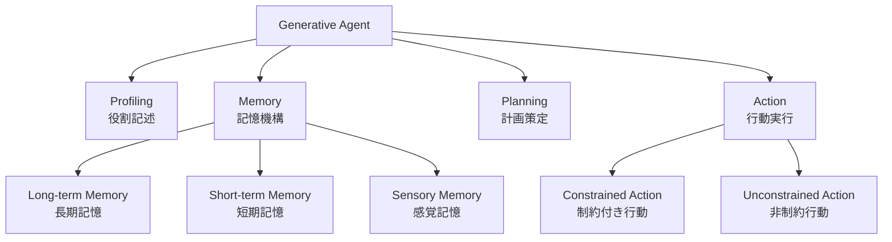
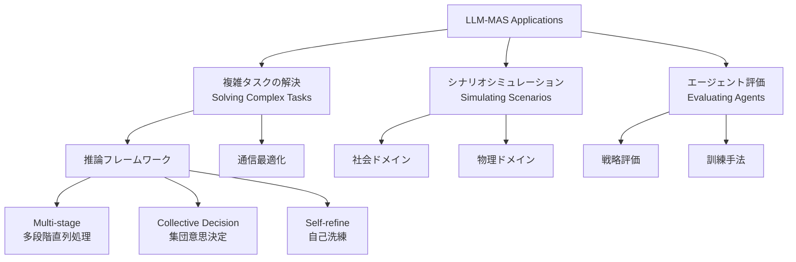

本記事は [A Survey on LLM-based Multi-Agent System: Recent Advances and New Frontiers in Application (arXiv:2412.17481)](https://arxiv.org/abs/2412.17481) の解説記事です。

## 論文概要（Abstract）

LLMベースのマルチエージェントシステム（LLM-MAS）は、大規模言語モデルの台頭以降、急速に研究が拡大している領域である。著者らは、ACL・NeurIPS・AAAI・ICLR等のトップ会議から2023-2024年に発表された125本の論文を対象に、LLM-MASの定義・アーキテクチャ・応用・課題を体系的に整理している。サーベイでは応用領域を「複雑タスクの解決」「特定シナリオのシミュレーション」「生成エージェントの評価」の3カテゴリに分類し、今後の研究方向性を提示している。

この記事は [Zenn記事: Semantic Kernel 5大オーケストレーションパターンをPython×C#で実装比較する](https://zenn.dev/0h_n0/articles/a27bae62608bfd) の深掘りです。

## 情報源

- **arXiv ID**: 2412.17481
- **URL**: [https://arxiv.org/abs/2412.17481](https://arxiv.org/abs/2412.17481)
- **著者**: Shuaihang Chen, Yuanxing Liu, Wei Han, Weinan Zhang, Ting Liu
- **発表年**: 2024（2025年1月改訂）
- **分野**: cs.CL, cs.MA

## 背景と動機（Background & Motivation）

ChatGPTの登場以降、LLMを単独のエージェントとして活用する研究は急速に進展した。しかし、複雑な現実世界の問題（ソフトウェア開発、都市シミュレーション、戦略ゲーム等）を解決するには、単一エージェントでは能力が不足する場面が多い。複数のLLMエージェントが協調・通信・環境操作を行うマルチエージェントシステム（MAS）は、この限界を突破する有望なアプローチとして注目されている。

一方で、この分野には新規研究が継続的に流入しており、既存のサーベイでは網羅しきれなくなっている。著者らはこの問題に対処するため、125本の論文を対象にLLM-MASの統一的なフレームワーク定義を提案し、応用領域を体系的に分類している。

## 主要な貢献（Key Contributions）

- **貢献1**: LLM-MASの統一的な定義とフレームワークの提案 — 生成エージェントの4特性（Profiling, Memory, Planning, Action）と環境設計（Tools, Rules, Intervention）を整理
- **貢献2**: 応用領域の3カテゴリ分類 — 複雑タスク解決、シナリオシミュレーション、エージェント評価
- **貢献3**: 125本の論文に基づく課題の体系化と今後の研究方向性の提示

## 技術的詳細（Technical Details）

### 生成エージェントの4特性

著者らはLLM-MASを「共有環境内で相互作用・協調が可能な生成エージェントの集合を含むシステム」と定義し、各生成エージェントが持つ4つの特性を整理している。

#### Profiling（役割記述）

自然言語によるロール記述またはタスクに応じたカスタマイズプロンプトを通じて、各エージェントの振る舞いを規定する。ChatDevにおけるCEO・CTO・プログラマといった役割割り当てや、MetaGPTにおけるプロダクトマネージャー・アーキテクト・エンジニアの役割分担がこれに該当する。

#### Memory（記憶機構）

LLMのコンテキストウィンドウの制約に対処するため、著者らは記憶を3層構造で整理している。

- **長期記憶（Long-term Memory）**: 過去のインタラクション履歴、学習した知識を保持する。ベクトルDB（FAISS、Pinecone等）を用いた実装が多い
- **短期記憶（Short-term Memory）**: 現在のタスク遂行に必要な直近の文脈を保持する。プロンプトのコンテキストウィンドウ内に収める
- **感覚記憶（Sensory Memory）**: 環境からの即時的な入力（観測結果、他エージェントからのメッセージ等）を一時的に保持する

この3層構造は、人間の認知心理学におけるAtkinson-Shiffrinモデルに着想を得たものであり、エージェントが長期的な知識と即時的な文脈を使い分けることを可能にする。

#### Planning（計画策定）

長期間にわたる一般的な行動方針を策定する機能である。著者らは、ChatDev等の開発フレームワークにおけるウォーターフォール型のフェーズ分割計画から、Stanford Town（後述）における日常行動の自律的スケジューリングまで、幅広い計画手法を報告している。

#### Action（行動実行）

環境やエージェント間のインタラクションを実行するメカニズムである。著者らは2つの類型を示している。

- **制約付き行動（Constrained Action）**: 候補となる行動セットから選択する方式。ゲーム環境（人狼、アヴァロン等）で典型的
- **非制約行動（Unconstrained Action）**: 自由形式で行動を生成する方式。ソフトウェア開発でのコード生成やシミュレーションでの自然言語対話が該当

### 通信メカニズム

マルチエージェント間の通信は、MASの核心的な要素である。著者らは通信の目的と媒体の2軸で整理している。

**目的による分類**:

- **協調（Collaboration）**: 各エージェントが取得した情報を共有し、複数エージェントの能力を統合する。ソフトウェア開発におけるコードレビュー、設計書共有等が該当する
- **合意形成（Consensus）**: エージェント間で行動・戦略の類似性を実現する。著者らはこれがナッシュ均衡への収束を促進すると整理している

**媒体による分類**:

- **自然言語**: 高い解釈可能性と柔軟性を持つが、最適化が困難。ChatDevの開発チャットや就職フェアシステムでの対話がこれに該当する
- **カスタムコンテンツ**: ベクトルや離散信号を用い、方策勾配法等で最適化可能。DIAL等のアルゴリズムで採用されている

### 環境設計

著者らはLLM-MASの環境を3つの構成要素に分解している。

- **ツール（Tools）**: エージェントの行動指示を具体的な結果に変換する。ソーシャルメディア環境では「いいね」「コメント」「フォロー」、開発環境ではチャットチェーンやコード実行等がツールに該当する
- **ルール（Rules）**: 通信モードやインタラクションの規則を定義する。ゲームルールや社会的行動規範がこれに含まれる。著者らは、行動空間が小さいエージェントほどルールベースモデルで代替しやすいと指摘している
- **介入（Intervention）**: 人間、監督モデル、他エージェントによる外部監視のインターフェース。能動的介入（情報の読み取り）と受動的介入（制御不能な行動の防止）の2種類がある

## アプリケーション分類体系（Application Taxonomy）

著者らはLLM-MASの応用を3つのカテゴリに分類している。これはサーベイの中核的な貢献であり、125本の論文を体系的に位置づけている。

### カテゴリ1: 複雑タスクの解決

最も活発に研究されている領域であり、著者らは17本の論文を基に推論フレームワークと通信最適化の2軸で整理している。

**推論フレームワーク**:

| 類型 | 説明 | 代表的システム |
|------|------|--------------|
| Multi-stage（多段階直列） | 異なる段階に特化したエージェントが直列的に問題を解決 | ChatDev, MetaGPT |
| Collective Decision（集団意思決定） | 投票・討論による共有目標の達成 | LLM-Debate, MAD |
| Self-refine（自己洗練） | 自己反省・内省メカニズムによる品質向上 | Reflexion, LATS |

**Multi-stage**: ChatDevでは、CEO・CTO・プログラマ・テスター等の役割を持つエージェントが、設計→実装→テスト→レビューというウォーターフォール型のフローで協調する。MetaGPTは同様のアプローチを取りつつ、SOPを定義してエージェント間の通信効率を高めている。

**Collective Decision**: 複数エージェントが討論を通じて共有の結論に至る手法である。LLM-DebateやMAD（Multi-Agent Debate）では、異なる立場のエージェントが意見を交換し、集団としてより正確な判断に収束する。

**Self-refine**: エージェントが自身の出力を評価し、改善するメカニズムである。Reflexionでは過去の失敗から学習し、LATSでは木探索により複数の行動パスを評価する。

**通信最適化**:

- **速度最適化**: 非言語コミュニケーションやより短い生成により通信コストを削減する
- **分散型議論**: 完全な情報を持たない状態でタスクを解決する手法

### カテゴリ2: シナリオシミュレーション

著者らは10本の論文を基に、社会ドメインと物理ドメインの2領域に分類している。

**社会ドメイン**:

| システム | 規模 | 内容 |
|---------|------|------|
| Stanford Town | 25エージェント | 小規模アメリカの町の1日をシミュレーション |
| UGI | 都市規模 | 複雑な都市システムのシミュレーション |
| Pan et al. (2024) | $10^6$エージェント | 大規模社会シミュレーション |
| ゲーム研究 | 数名〜数十名 | 人狼、アヴァロン、Minecraft |

Stanford Town（Park et al., 2023）は、この分野を切り開いた画期的な研究である。25体のLLMエージェントが仮想の町で自律的に日常生活を送り、社会的関係の形成、情報の伝播、集団行動の創発を観察する。各エージェントは記憶・計画・反省の機構を備え、驚くべきことにバレンタインデーパーティの自発的企画や選挙活動への参加といった創発的行動が確認されている。

著者らは、Pan et al. (2024) が$10^6$規模のエージェントシミュレーションを実現したことにも言及しており、スケーラビリティが急速に向上していることを示している。

ゲーム研究では、人狼やアヴァロンといった不完全情報ゲームが注目されている。これらのゲームでは欺瞞・推論・戦略的コミュニケーションが求められ、LLMエージェントの社会的知性の評価に適している。

**物理ドメイン**:

モビリティ行動、交通システム、無線ネットワーク等の物理的なシステムのシミュレーションにもLLM-MASが適用されている。これらの領域では、エージェントの行動空間が比較的制約されており、ルールベースモデルとの組み合わせが有効であると著者らは指摘している。

### カテゴリ3: 生成エージェントの評価

著者らは12本の論文を基に、評価手法と訓練手法を整理している。

**評価手法**:

- **戦略的能力**: 長期的な戦略立案、リーダーシップ、競争力を評価する
- **感情推論**: エージェントの感情的推論能力を評価する

**訓練手法**:

| 手法 | 説明 |
|------|------|
| SFT（教師ありファインチューニング） | 強化されたデータを用いた教師あり学習 |
| MARL（マルチエージェント強化学習） | LLM固有のバイアスを克服するための強化学習 |
| 合成データ生成 | エージェント間のインタラクションデータを人工的に生成 |

著者らは、MARLがLLM固有のバイアス（学習データに起因する偏り）を克服するために特に有効であると整理している。SFTのみでは多様な社会的特性を忠実に再現できない場合があり、強化学習による行動の多様化が重要であると指摘している。

## 主要な課題（Key Challenges）

著者らは、LLM-MASが直面する課題を生成エージェント・インタラクション・評価の3層に分類し、6つの主要課題を特定している。

### 生成エージェントの課題

**1. シミュレーションのためのアライメント問題**

LLMの基盤モデルは学習データに基づくバイアスを内包しており、多様な社会的特性（性格、文化的背景、価値観等）を忠実に表現することが困難である。著者らは、例えば特定の政治的立場や文化的背景を持つ人物をシミュレートする際に、モデルの学習データに起因する偏りが結果を歪めると指摘している。

**2. ハルシネーション**

単一エージェントでのハルシネーション問題は、マルチエージェント環境ではさらに深刻になる。あるエージェントが生成した誤情報が他のエージェントに伝播し、集団全体の判断を歪める可能性がある。著者らはこの問題を「エージェント間インタラクションにおける虚偽情報の確率」として整理している。

**3. 長文処理能力の不足**

LLMのコンテキストウィンドウの制約により、長期的なインタラクション履歴を保持することが困難である。記憶機構（ベクトルDB等）で部分的に対処できるが、入力情報の忘却が完全には解決されていない。

### インタラクションの課題

**4. 効率性の爆発（Efficiency Explosion）**

自己回帰型LLMの推論速度は、マルチエージェント環境で深刻なボトルネックとなる。1つのエージェントが1回の行動を実行するだけでも、記憶の抽出、計画の策定、行動の生成と複数回のLLM呼び出しが必要である。エージェント数$N$、ラウンド数$T$、エージェントあたりのLLM呼び出し回数$K$とすると、総推論回数は$O(N \times T \times K)$に達する。

**5. 累積効果（Accumulative Effect）**

各ラウンドの出力が次のラウンドの入力に依存するため、初期段階のエラーが後続の全ラウンドに波及する。著者らはこれを「エラーの伝播」と表現し、ルールベースのエラー訂正メカニズムによる部分的な緩和は可能だが、根本的な解決には至っていないと整理している。

### 評価の課題

**6. 客観的評価指標の欠如とベンチマーク不足**

集団レベルの行動を評価する客観的指標が不足している。個々のエージェントの性能評価には既存のベンチマーク（HumanEval、MATH、MT-Bench等）が利用できるが、マルチエージェントシステム全体としての評価指標は未確立である。また、同一タイプのLLM-MASを比較する共通ベンチマークフレームワークも存在しない。

## 主要フレームワークとベンチマーク

### オープンソースフレームワーク比較

| フレームワーク | 開発元 | 特徴 | 主な用途 |
|-------------|--------|------|---------|
| [MetaGPT](https://github.com/geekan/MetaGPT) | DeepWisdom | SOPベースの役割分担 | ソフトウェア開発 |
| [ChatDev](https://github.com/OpenBMB/ChatDev) | OpenBMB | ウォーターフォール型開発フロー | ソフトウェア開発 |
| [AgentScope](https://github.com/modelscope/agentscope) | ModelScope | メッセージ交換ベース、分散フレームワーク | 汎用 |
| [Swarm](https://github.com/openai/swarm) | OpenAI | 軽量オーケストレーション | プロトタイピング |
| ProAgent | — | 協調行動の自律的学習 | ゲーム環境 |

### ベンチマーク一覧

著者らがサーベイ内で言及しているベンチマークを分野別に整理する。

| 分野 | ベンチマーク |
|------|------------|
| コード生成 | HumanEval, EvalPlus, MBPP, APPS |
| 推論 | MATH, GSM8K, StrategyQA, FOLIO-wiki |
| 知識 | MMLU, TriviaQA, CSQA |
| 対話 | MT-Bench, AlpacaEval |
| エージェント | AgentBench, LLMArena, MAgIC, MLAgentBench, AucArena |
| シミュレーション | SoMoSiMu-Bench, AgentCourt |
| 安全性 | TruthfulQA, HH, Moral Stories |

## 実運用への応用（Practical Applications）

本サーベイの分類体系は、Zenn記事で紹介しているSemantic Kernelの5大オーケストレーションパターンと直接的に対応する。

| サーベイの分類 | Semantic Kernelパターン | 対応関係 |
|-------------|----------------------|---------|
| Multi-stage（多段階直列） | Sequential Pattern | エージェントが順序通りにタスクを処理 |
| Collective Decision（集団意思決定） | Group Chat Pattern | 複数エージェントが議論して結論を出す |
| Self-refine（自己洗練） | Handoff Pattern + ループ | 自己評価に基づくタスク委譲と再実行 |
| 協調通信 | Magentic-One Pattern | 専門エージェント間の情報共有 |
| ルールベース環境 | Declarative Pattern | YAML/JSON定義による行動制約 |

この対応関係は、サーベイの理論的分類が実装レベルのパターンに落とし込めることを示している。例えば、ChatDevのMulti-stageアーキテクチャはSemantic KernelのSequential Patternとして実装でき、LLM-DebateのCollective DecisionはGroup Chat Patternに対応する。

ただし、サーベイが指摘する「効率性の爆発」問題は、実運用において特に重要である。$O(N \times T \times K)$の推論コストは、エージェント数の増加に伴って急速に増大するため、Semantic Kernelにおけるオーケストレーション設計では、必要最小限のエージェント数と通信ラウンド数を慎重に設計する必要がある。

## 関連研究（Related Work）

本サーベイと同時期に発表された関連サーベイ・フレームワークとの位置づけを整理する。

- **AutoGen** (Wu et al., 2023; COLM 2024): Microsoftが開発したマルチエージェント会話フレームワーク。本サーベイの分類では「複雑タスクの解決」のCollective Decision型に位置づけられる。柔軟な会話パターン定義が特徴だが、サーベイでは言及が限定的である
- **CAMEL** (Li et al., 2023): ロールプレイによる自律的協調を実現するフレームワーク。Inception Promptingにより人間の介入なしでエージェント間の協調を促進する
- **AgentVerse** (Chen et al., 2023): 動的なエージェント募集機構を持つフレームワーク。タスクに応じて必要なエージェントを動的に選択する
- **CrewAI**: 役割ベースのエージェント協調フレームワーク。本サーベイの分類ではMulti-stage型に該当する

著者らのサーベイは、これらの個別フレームワークを横断的に分類する統一的な視点を提供しており、フレームワーク選定の判断基準として有用である。

## まとめと今後の展望

本サーベイは、LLM-MASの急速に拡大する研究領域を125本の論文に基づいて体系化した包括的なレビューである。生成エージェントの4特性（Profiling, Memory, Planning, Action）、通信メカニズム（協調・合意形成）、環境設計（Tools, Rules, Intervention）というフレームワークは、新規システムの設計指針として実用的である。

著者らが提示した今後の研究方向性は以下の4つである。

1. **推論能力の強化**: o1アーキテクチャに代表される高度な推論モデルをMASに統合し、より複雑な問題解決を可能にする
2. **通信効率の向上**: アライメントベースの手法により通信コストを削減し、産業規模での並列処理を実現する
3. **大規模ダイナミクスの解明**: $10^5$以上のエージェントシステムにおけるスケール効果を発見する
4. **統一的な評価基盤の構築**: 同一タイプのLLM-MASを公正に比較するための共通ベンチマークを整備する

2024年12月の発表以降、Claude Agent SDK、OpenAI Agents SDK、Google ADKといった産業グレードのエージェントフレームワークが次々とリリースされており、本サーベイが指摘した「効率性の爆発」や「累積効果」の課題は、プロンプトキャッシュ、ストリーミング、並列実行といった実装レベルの最適化で部分的に対処されつつある。しかし、アライメントやハルシネーションといった根本的な課題は依然として未解決であり、今後の研究が期待される。

## 参考文献

- **arXiv**: [https://arxiv.org/abs/2412.17481](https://arxiv.org/abs/2412.17481)
- **Related Zenn article**: [https://zenn.dev/0h_n0/articles/a27bae62608bfd](https://zenn.dev/0h_n0/articles/a27bae62608bfd)
