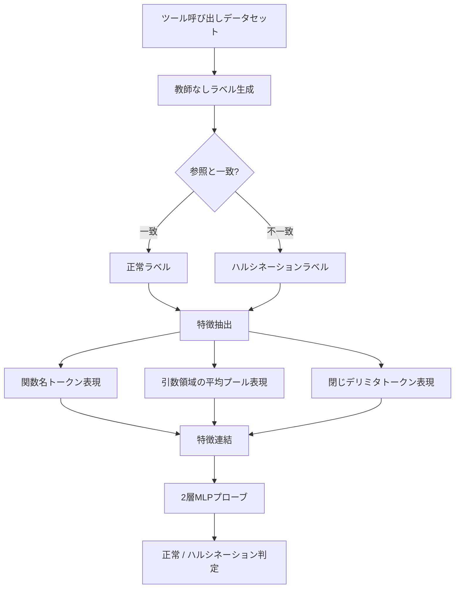
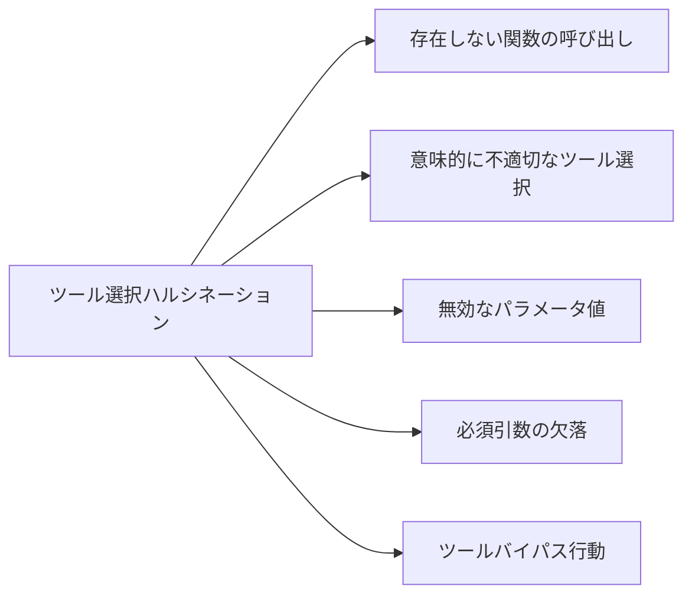

本記事は [Internal Representations as Indicators of Hallucinations in Agent Tool Selection (arXiv:2601.05214)](https://arxiv.org/abs/2601.05214) の解説記事です。

## 論文概要（Abstract）

LLMベースのエージェントがツール呼び出しを行う際に発生するハルシネーション（幻覚）を、モデルの内部表現を利用してリアルタイムに検出するフレームワークを提案した論文である。著者らは、ツール選択時のハルシネーションを5つのカテゴリに分類し、最終層の隠れ状態から抽出した特徴ベクトルに対して軽量な2層MLPプローブを適用することで、追加のフォワードパスなしに検出を実現している。GPT-OSS-20Bモデルで86.4%の精度を報告している。

この記事は [Zenn記事: Opus 5.5×Bedrock AgentCoreで社内ITヘルプデスクのツール選択精度を評価し誤呼び出しを削減する](https://zenn.dev/0h_n0/articles/b518ad76e25fcd) の深掘りです。

## 情報源

- **arXiv ID**: 2601.05214
- **URL**: [https://arxiv.org/abs/2601.05214](https://arxiv.org/abs/2601.05214)
- **著者**: Kait Healy, Bharathi Srinivasan, Visakh Madathil, Jing Wu
- **発表年**: 2026
- **分野**: cs.AI

## 背景と動機（Background & Motivation）

LLMベースのエージェントは外部ツール（API、データベース、関数）を呼び出して実世界のタスクを遂行する。しかし、ツール選択時のハルシネーションにより、存在しない関数の呼び出し、不正パラメータの送信、ツールを呼ばず出力をでっち上げる等の深刻な問題が発生する。これらの失敗はサイレントに起こるため、本番環境での検出・防止が極めて重要である。

従来のハルシネーション検出手法（Non Contradiction Probability、Semantic Similarity等）は複数回のフォワードパスを必要とし、計算コストが5倍程度かかる制約があった。著者らは生成時の単一フォワードパスで得られる内部表現を活用し、追加コストなしにハルシネーションを検出するアプローチを提案している。

## 主要な貢献（Key Contributions）

- **貢献1**: ツール選択ハルシネーションの体系的な分類 --- 5つのカテゴリ（存在しない関数、不適切なツール選択、無効なパラメータ、必須引数欠落、ツールバイパス）を定義
- **貢献2**: 教師なしラベル生成手法 --- 正解ツール呼び出しをマスクして再生成させることで、人手のアノテーションなしに学習データを構築
- **貢献3**: 内部表現ベースのリアルタイム検出フレームワーク --- 3つのセマンティック領域から特徴を抽出し、2層MLPプローブで分類。単一フォワードパスで動作
- **貢献4**: 実行ゲーティングポリシーの提案 --- ブロッキング、ユーザー確認、自動修復の3段階で本番環境に統合可能

## 技術的詳細（Technical Details）

### 検出フレームワークの全体像

著者らのフレームワークは、教師なしラベル生成、特徴抽出、分類器学習の3ステップで構成される。



### ステップ1: 教師なしラベル生成

人手によるアノテーションを回避するため、著者らはマスク再生成（masked regeneration）方式を採用している。具体的には、データセット中の正解ツール呼び出しをプロンプトから除去し、モデルに同じ入力からツール呼び出しを再生成させる。再生成結果が参照（正解）と文字列一致すれば「正常」、不一致であれば「ハルシネーション」としてラベル付けする。

この方式により人手のアノテーションなしに大規模データセットへラベル付与が可能となる。ただし著者らは、文字列一致が機能的等価性を捉えられない場合がある点を制約として指摘している。

### ステップ2: 特徴抽出

生成されたツール呼び出しの内部表現から、3つのセマンティック領域を抽出する。

$$
\mathbf{h}_{\text{func}} = \mathbf{h}^{(L)}_{t_{\text{func}}}
$$

$$
\mathbf{h}_{\text{args}} = \frac{1}{|T_{\text{args}}|} \sum_{t \in T_{\text{args}}} \mathbf{h}^{(L)}_{t}
$$

$$
\mathbf{h}_{\text{delim}} = \mathbf{h}^{(L)}_{t_{\text{delim}}}
$$

ここで、$\mathbf{h}^{(L)}_{t}$ は最終層 $L$ におけるトークン $t$ の隠れ状態ベクトル、$t_{\text{func}}$ は関数名の初期トークン位置、$T_{\text{args}}$ は引数領域のトークン集合、$t_{\text{delim}}$ は閉じデリミタ（括弧やブレース）のトークン位置である。

これら3つのベクトルを連結して、最終的な特徴ベクトルを構成する。

$$
\mathbf{f} = [\mathbf{h}_{\text{func}} \| \mathbf{h}_{\text{args}} \| \mathbf{h}_{\text{delim}}] \in \mathbb{R}^{3d}
$$

$d$ はモデルの隠れ状態の次元数であり、$\|$ はベクトルの連結を表す。

### ステップ3: 2層MLPプローブ

抽出した特徴ベクトル $\mathbf{f}$ に対して、以下の2層MLPを適用する。

$$
\hat{y} = \sigma(\mathbf{W}_2 \cdot \text{ReLU}(\mathbf{W}_1 \mathbf{f} + \mathbf{b}_1) + \mathbf{b}_2)
$$

ここで、$\mathbf{W}_1 \in \mathbb{R}^{m \times 3d}$、$\mathbf{W}_2 \in \mathbb{R}^{1 \times m}$ は重み行列、$\mathbf{b}_1, \mathbf{b}_2$ はバイアス、$\sigma$ はシグモイド関数、$m$ は中間層の次元数である。$\hat{y} \in [0, 1]$ はハルシネーション確率を表す。

損失関数はバイナリ交差エントロピーを使用する。

$$
\mathcal{L} = -\frac{1}{N}\sum_{i=1}^{N}\left[y_i \log(\hat{y}_i) + (1 - y_i)\log(1 - \hat{y}_i)\right]
$$

$y_i \in \{0, 1\}$ は教師なしラベル生成で得られたラベル（0: 正常、1: ハルシネーション）、$N$ はサンプル数である。

### 5種類のハルシネーションカテゴリ

著者らはツール選択時のハルシネーションを以下の5カテゴリに分類している。



1. **存在しない関数の呼び出し（Non-existent function invocation）**: ツール定義に含まれない関数名を生成する。例えば、`get_weather_forecast` が定義されていないのに呼び出す
2. **意味的に不適切なツール選択（Semantically inappropriate tool selection）**: 存在する関数だがタスクの意図に合わない。メール送信を求められているのにカレンダー検索APIを呼ぶ等
3. **無効なパラメータ値（Invalid parameter values）**: 関数は正しいが引数の値が不正。日付フィールドに自由テキストを渡す等
4. **必須引数の欠落（Missing required arguments）**: 関数は正しいが、必須パラメータを省略する
5. **ツールバイパス行動（Tool bypass behavior）**: ツールを呼ばずに出力をシミュレートする。天気APIを呼ぶべき場面で「東京の天気は晴れです」と直接回答する

カテゴリ5のツールバイパスは、ユーザーからは正常に見えるため検出が困難であり、本番環境で最もリスクが高い失敗モードである。

### 実装イメージ（Pythonコード）

以下は、論文の手法に基づくプローブベース検出の概念コードである。

```python
import torch
import torch.nn as nn
from dataclasses import dataclass


@dataclass
class ToolCallSpan:
    """ツール呼び出しの各セマンティック領域のトークン位置情報。"""

    func_token_idx: int        # 関数名の初期トークン位置
    arg_token_indices: list[int]  # 引数領域のトークン位置
    delim_token_idx: int       # 閉じデリミタのトークン位置


class HallucinationProbe(nn.Module):
    """ツール選択ハルシネーション検出用の2層MLPプローブ。

    LLMの最終層隠れ状態から抽出した特徴ベクトルを入力とし、
    ハルシネーション確率をスカラーで出力する。

    Args:
        hidden_dim: LLMの隠れ状態の次元数
        probe_dim: プローブの中間層次元数
    """

    def __init__(self, hidden_dim: int, probe_dim: int = 256) -> None:
        super().__init__()
        input_dim = hidden_dim * 3  # 3領域の連結
        self.classifier = nn.Sequential(
            nn.Linear(input_dim, probe_dim),
            nn.ReLU(),
            nn.Linear(probe_dim, 1),
            nn.Sigmoid(),
        )

    def forward(self, features: torch.Tensor) -> torch.Tensor:
        """ハルシネーション確率を計算する。

        Args:
            features: 3領域の連結特徴ベクトル [batch_size, hidden_dim * 3]

        Returns:
            ハルシネーション確率 [batch_size, 1]、値域 [0, 1]
        """
        return self.classifier(features)


def extract_tool_call_features(
    hidden_states: torch.Tensor,
    span: ToolCallSpan,
) -> torch.Tensor:
    """LLMの最終層隠れ状態からツール呼び出しの特徴ベクトルを抽出する。

    3つのセマンティック領域（関数名、引数、閉じデリミタ）の
    隠れ状態を連結して返す。

    Args:
        hidden_states: 最終層の隠れ状態 [seq_len, hidden_dim]
        span: ツール呼び出しのトークン位置情報

    Returns:
        連結特徴ベクトル [hidden_dim * 3]
    """
    h_func = hidden_states[span.func_token_idx]
    h_args = hidden_states[span.arg_token_indices].mean(dim=0)
    h_delim = hidden_states[span.delim_token_idx]
    return torch.cat([h_func, h_args, h_delim], dim=0)


def detect_hallucination(
    probe: HallucinationProbe,
    hidden_states: torch.Tensor,
    span: ToolCallSpan,
    threshold: float = 0.5,
) -> tuple[bool, float]:
    """ツール呼び出しがハルシネーションかどうかを判定する。

    Returns:
        (is_hallucination, probability) のタプル
    """
    features = extract_tool_call_features(hidden_states, span).unsqueeze(0)
    with torch.no_grad():
        prob = probe(features).item()
    return prob >= threshold, prob
```

## 実装のポイント（Implementation Notes）

本手法の実装において重要なのは、隠れ状態の抽出がモデル推論の副産物として得られる点である。通常の自己回帰生成では最終層の隠れ状態がトークン予測に使用されるが、その同じテンソルをプローブの入力として流用するため、追加のフォワードパスは不要である。

プローブのパラメータ数は隠れ次元 $d = 4096$、中間層 $m = 256$ の場合に約3.15Mであり、7Bモデル本体に比べて無視できるサイズである。引数領域の平均プーリングにより、引数の数や長さに依存しない固定次元の表現が得られる点も実装上のポイントである。

## 実験結果（Results）

### モデル別精度

著者らは3つのオープンソースモデルで評価を行っている。

| モデル | 精度（Accuracy） | Precision | 備考 |
|--------|-----------------|-----------|------|
| **GPT-OSS-20B** | **86.4%** | **86%** | 最高精度。大規模モデルほど内部表現が豊かで検出しやすい |
| Qwen-7B | 74% | --- | --- |
| Llama-3.1-8B | 73% | --- | バランスの取れたクラス性能 |

GPT-OSS-20Bが最高精度を達成しており、モデル規模が大きいほど内部表現にハルシネーションの兆候が明確に現れることを示唆している。

### ベースラインとの比較

著者らは以下のベースライン手法と比較を行っている。

| 手法 | 検出方式 | フォワードパス数 | 相対計算コスト |
|------|---------|----------------|--------------|
| Non Contradiction Probability | 出力整合性検証 | 複数回 | 5x |
| Semantic Similarity | 埋め込み類似度比較 | 複数回 | 5x |
| **本手法（プローブベース）** | **内部表現分類** | **1回** | **1x** |

本手法はこれらのベースラインと競争力のある精度を示しながら、計算コストを5分の1に抑えている。

## Production Deployment Guide

### AWS実装パターン（コスト最適化重視）

ツール選択ハルシネーション検出パイプラインのAWSデプロイ構成を示す。

| 規模 | 月間リクエスト | 推奨構成 | 月額コスト | 主要サービス |
|------|--------------|---------|-----------|------------|
| **Small** | ~5,000 | Serverless | $80-200 | Lambda + Bedrock + DynamoDB |
| **Medium** | ~50,000 | Hybrid | $500-1,200 | ECS Fargate + Bedrock + ElastiCache |
| **Large** | 500,000+ | Container | $3,000-8,000 | EKS + Karpenter + GPU Spot |

**コスト試算注意事項**: 2026年9月時点のAWS東京リージョン（ap-northeast-1）料金に基づく概算値。最新料金は [AWS料金計算ツール](https://calculator.aws/) で確認してください。

**Small構成**: Bedrock AgentCoreでツール呼び出しを行い、Lambdaでプローブ推論を実行。プローブモデル（約3MB）はLambdaコンテナイメージに同梱し、DynamoDBに検出結果を記録する。**Large構成**: 自社ホスティングLLM（Llama-3.1等）をEKS上で運用し、推論サーバーにプローブを組み込む。

### Terraformインフラコード（Small構成: Lambda + Bedrock + DynamoDB）

```hcl
# --- Small構成: ツール選択ハルシネーション検出パイプライン ---

resource "aws_lambda_function" "hallucination_probe" {
  function_name = "tool-hallucination-probe"
  role          = aws_iam_role.lambda_probe.arn
  package_type  = "Image"
  image_uri     = "${aws_ecr_repository.probe.repository_url}:latest"
  timeout       = 30
  memory_size   = 1024

  environment {
    variables = {
      BEDROCK_MODEL_ID    = "anthropic.claude-opus-4-6-20250918-v1:0"
      PROBE_THRESHOLD     = "0.5"
      DYNAMODB_TABLE      = aws_dynamodb_table.detection_results.name
      GATING_POLICY       = "confirm"  # block | confirm | repair
    }
  }
}

resource "aws_dynamodb_table" "detection_results" {
  name         = "tool-hallucination-detections"
  billing_mode = "PAY_PER_REQUEST"
  hash_key     = "request_id"
  range_key    = "timestamp"

  attribute {
    name = "request_id"
    type = "S"
  }

  attribute {
    name = "timestamp"
    type = "N"
  }

  ttl {
    attribute_name = "expires_at"
    enabled        = true
  }

  tags = {
    Project     = "tool-hallucination-detection"
    Environment = "production"
  }
}

# IAM Role: bedrock:InvokeModel, dynamodb:PutItem/Query, logs:* のみ付与
# （IAMロール定義は省略。最小権限の原則に従うこと）

resource "aws_budgets_budget" "probe_monthly" {
  name         = "hallucination-probe-monthly"
  budget_type  = "COST"
  limit_amount = "300"
  limit_unit   = "USD"
  time_unit    = "MONTHLY"

  notification {
    comparison_operator        = "GREATER_THAN"
    threshold                  = 80
    threshold_type             = "PERCENTAGE"
    notification_type          = "ACTUAL"
    subscriber_email_addresses = ["ops@example.com"]
  }
}
```

### Large構成（EKS + Karpenter）の要点

Large構成では `terraform-aws-modules/eks/aws` モジュール（v20系）でEKSクラスタを構築し、KarpenterのNodePoolで `g5.xlarge` / `g5.2xlarge` のSpot/On-Demand混合を設定する。`consolidationPolicy: WhenEmptyOrUnderutilized` によりアイドルノードを30秒で回収し、GPUコストを最適化する。

### 運用・監視設定

```python
import boto3


def setup_hallucination_monitoring() -> None:
    """ツール選択ハルシネーション検出の監視アラームを設定する。

    検出率スパイクとプローブ推論レイテンシの2種類を監視する。
    """
    cloudwatch = boto3.client("cloudwatch", region_name="ap-northeast-1")
    sns_arn = "arn:aws:sns:ap-northeast-1:123456789012:ops-alerts"

    cloudwatch.put_metric_alarm(
        AlarmName="hallucination-detection-rate-spike",
        ComparisonOperator="GreaterThanThreshold",
        EvaluationPeriods=3,
        DatapointsToAlarm=2,
        MetricName="HallucinationDetectionRate",
        Namespace="ToolHallucinationProbe",
        Period=300,
        Statistic="Average",
        Threshold=0.3,
        AlarmDescription="ツール選択ハルシネーション検出率が30%を超過",
        AlarmActions=[sns_arn],
    )
```

**CloudWatch Logs Insightsクエリ例**（ブロックされたツール呼び出しの集計）:

```
fields @timestamp, request_id, tool_name, hallucination_prob, gating_action
| filter hallucination_prob > 0.5
| stats count() as blocked_count by tool_name
| sort blocked_count desc
| limit 20
```

### コスト最適化チェックリスト

- [ ] Bedrock Prompt Caching有効化（同一ツール定義の繰り返しで30-90%削減）
- [ ] Bedrock Batch API使用（非リアルタイム評価で50%割引）
- [ ] Lambda メモリサイズ最適化（1024MB推奨）
- [ ] Lambda Provisioned Concurrency（コールドスタート回避、常時利用時）
- [ ] DynamoDB TTL設定（検出結果の自動削除、30日推奨）
- [ ] DynamoDB PAY_PER_REQUEST（低〜中トラフィックで最適）
- [ ] ECS/EKS Spot Instances優先（GPU推論で最大90%削減）
- [ ] Karpenter consolidationPolicy設定（アイドルノード自動回収）
- [ ] Reserved Instances / Savings Plans（安定ワークロードで最大72%削減）
- [ ] AWS Budgets月額予算設定（Small: $300、Large: $10,000）
- [ ] Cost Anomaly Detection有効化（異常コスト自動検出）
- [ ] CloudWatch Logs保持期間設定（30日推奨）
- [ ] タグ戦略（Project/Environment/Owner）
- [ ] max_tokens制限設定（不必要な長文生成防止）
- [ ] 開発環境の夜間・週末停止
- [ ] CloudTrail有効化（API呼び出し監査）
- [ ] IAM最小権限設定（bedrock:InvokeModel, dynamodb:PutItem/Query のみ）
- [ ] VPCエンドポイント使用（Bedrock/DynamoDBへのプライベートアクセス）
- [ ] GuardDuty有効化（異常なAPI呼び出しパターン検出）
- [ ] S3ライフサイクルポリシー（ログの自動アーカイブ、90日→Glacier）
- [ ] ECRイメージライフサイクルポリシー（古いイメージの自動削除）

### セキュリティベストプラクティス

- **IAMポリシー**: Lambda実行ロールには `bedrock:InvokeModel` と `dynamodb:PutItem/Query` のみ付与。ワイルドカード（`*`）は使用しない
- **VPCエンドポイント**: Bedrock・DynamoDBへのアクセスはVPCエンドポイント経由とし、インターネット経由を排除
- **データ暗号化**: DynamoDB・S3ともにSSE-KMSで暗号化。プローブ重みファイル含む
- **PII保護**: ツール呼び出しパラメータのPIIはCloudWatch Logs出力前にマスキング
- **Secrets Manager**: APIキー・接続情報はSecrets Managerで管理し、環境変数にハードコードしない

## 実運用への応用（Practical Applications）

### Bedrock AgentCoreとの連携可能性

AWS Bedrock AgentCoreはツール呼び出しを含むエージェントの構築基盤を提供している。本論文の手法は、Bedrock AgentCoreのツール実行パイプラインに組み込むことで、エージェントがツール呼び出しを生成した時点でハルシネーションを検出し、実行前にゲーティングを適用できる可能性がある。

統合パターンとして、3段階のゲーティングポリシーが考えられる。

1. **ブロッキング**: 確率 > 0.8 でツール実行を即座にブロック
2. **ユーザー確認**: 確率 0.5-0.8 でユーザーに確認を求めてから実行
3. **自動修復**: 検出時にプロンプトを修正して再生成を試みる

ただし、現時点ではBedrock AgentCoreが内部表現へのアクセスAPIを提供していないため、自社ホスティングモデル（EKS上のLlama-3.1等）での適用が現実的である。Bedrockマネージドモデルに対しては出力ベース検証との組み合わせが代替策となる。

## 関連研究（Related Work）

- **Schick et al., "Toolformer" (2023)**: LLMに自律的なツール使用を学習させる先駆的研究。ツール呼び出しの正確性については評価しているが、ハルシネーション検出の仕組みは含まない。
- **Manakul et al., "SelfCheckGPT" (2023)**: 自己整合性チェックによるハルシネーション検出。複数回サンプリングが必要で計算コストが高い。本論文のベースライン手法の一つであるNon Contradiction Probabilityと関連が深い。
- **Azaria & Mitchell, "Internal State of LLMs for Hallucination Detection" (2023)**: LLMの内部状態を用いた事実性判定の先行研究。テキスト生成全般が対象であり、ツール呼び出し特化の本論文とは焦点が異なる。
- **Patil et al., "Gorilla: Large Language Model Connected with APIs" (2023)**: API呼び出しの正確性向上を目的としたファインチューニング手法。学習時にツール使用能力を向上させるアプローチであり、推論時検出の本論文とは相補的である。

## まとめと今後の展望

本論文は、LLMベースエージェントのツール選択ハルシネーションを、内部表現（最終層隠れ状態）と軽量2層MLPプローブにより単一フォワードパスで検出する手法を提案した。GPT-OSS-20Bで86.4%の精度を達成し、従来手法比で計算コストを5分の1に削減している。今後は、機能的等価性の判定、マルチターン対話での累積検出、クローズドソースモデルへの適用拡張が課題として残る。

## 参考文献

- Healy, K., Srinivasan, B., Madathil, V., & Wu, J. (2026). Internal Representations as Indicators of Hallucinations in Agent Tool Selection. arXiv:2601.05214.
- Schick, T., Dwivedi-Yu, J., Dessì, R., et al. (2023). Toolformer: Language Models Can Teach Themselves to Use Tools. arXiv:2302.04761.
- Manakul, P., Liusie, A., & Gales, M. J. F. (2023). SelfCheckGPT: Zero-Resource Black-Box Hallucination Detection for Generative Large Language Models. arXiv:2303.08896.
- Azaria, A. & Mitchell, T. (2023). The Internal State of an LLM Knows When It's Lying. arXiv:2304.13734.
- Patil, S. G., Zhang, T., Wang, X., & Gonzalez, J. E. (2023). Gorilla: Large Language Model Connected with Massive APIs. arXiv:2305.15334.
