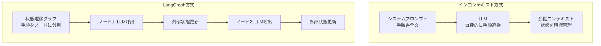
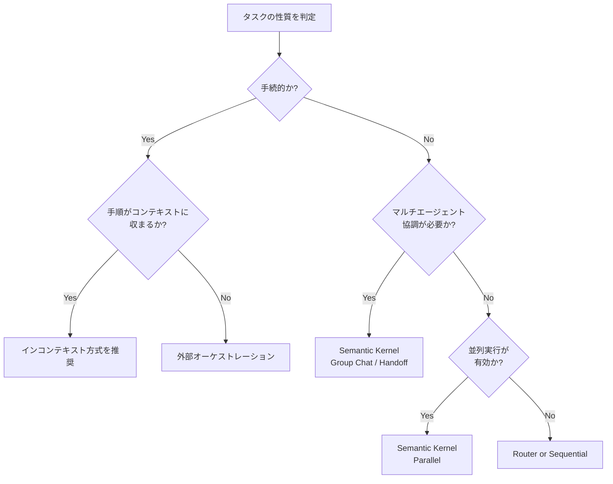

本記事は [In-Context Prompting Obsoletes Agent Orchestration for Procedural Tasks (arXiv:2604.27891)](https://arxiv.org/abs/2604.27891) の解説記事です。

## 論文概要（Abstract）

著者らは、フロンティアLLMの能力向上により、手続的（procedural）なタスクにおいてはシステムプロンプトに手順を埋め込む「インコンテキストプロンプティング」が、LangGraphのような外部オーケストレーションフレームワークを品質・信頼性の両面で上回ると主張している。3ドメイン（旅行予約、技術サポート、保険請求処理）で各200会話、計600会話の比較実験を行い、LLM-as-Judgeによる5点満点評価でインコンテキスト方式が一貫して高スコアを記録したと報告している。

この記事は [Zenn記事: Semantic Kernel 5大オーケストレーションパターンをPython×C#で実装比較する](https://zenn.dev/0h_n0/articles/a27bae62608bfd) の深掘りです。

## 情報源

- **arXiv ID**: 2604.27891
- **URL**: [https://arxiv.org/abs/2604.27891](https://arxiv.org/abs/2604.27891)
- **著者**: Simon Dennis, Michael Diamond, Rivaan Patil, Kevin Shabahang, Hao Guo
- **発表年**: 2026
- **分野**: cs.AI, cs.CL

## 背景と動機（Background & Motivation）

LLMをタスク実行に使う際、手順の管理方法には大きく2つのアプローチがある。1つは状態遷移グラフやDAGで外部からLLMの呼び出しを制御する「外部オーケストレーション」であり、LangGraph、Semantic Kernel、AutoGenなどがこの思想に基づいている。もう1つは、LLM自身のコンテキストウィンドウに手順書を全て埋め込み、LLMの命令追従能力に委ねる「インコンテキストプロンプティング」である。

外部オーケストレーションは、LLMの命令追従能力が低かった時代には合理的な選択であった。コンテキストウィンドウが小さく、指示が複雑になると逸脱が頻発したため、外部から状態を管理する必要があった。しかし、GPT-4o、Claude 3.5以降のフロンティアモデルは128K-200Kトークン超のコンテキストウィンドウと高い命令追従精度を備えるようになった。

著者らはこの進化を踏まえ、「外部オーケストレーションが依然として必要なのか」という問いを立てている。オーケストレーションフレームワークはコードの複雑性増大、デバッグの困難さ、状態管理のオーバーヘッドを伴う。もしインコンテキスト方式で同等以上の品質が達成できるなら、フレームワークのオーバーヘッドは不要なコストとなる。

## 主要な貢献（Key Contributions）

- **貢献1**: 3ドメイン×200会話の定量比較実験により、手続的タスクにおいてインコンテキストプロンプティングが外部オーケストレーション（LangGraph）を品質・信頼性の両面で上回ることを実証
- **貢献2**: 障害率（failure rate）の詳細分析により、外部オーケストレーションの状態遷移に起因する障害パターンを特定
- **貢献3**: フロンティアLLMのコンテキストウィンドウ拡大と命令追従能力の向上が、外部オーケストレーションの必要性を低減させるという仮説の検証

## 技術的詳細（Technical Details）

### 実験設計

著者らは、以下の2条件を比較する対照実験を設計している。

**条件A: インコンテキストプロンプティング**

手続き全体をシステムプロンプトに埋め込み、LLMが自律的に手順を追従する方式。状態管理はLLM自身の会話コンテキストに依存する。

**条件B: LangGraphオーケストレーション**

同一の手続きをLangGraphの状態遷移グラフとして定義し、各ステップでLLMを呼び出す方式。状態はグラフの外部で管理される。



### 評価ドメイン

3つのドメインは、手続的タスクの典型例として選定されている。

| ドメイン | 会話数 | タスク内容 | 手順の複雑さ |
|---------|--------|-----------|-------------|
| 旅行予約（Travel Booking） | 200 | フライト・ホテル検索、予約変更、キャンセル処理 | 分岐条件多、外部API連携 |
| 技術サポート（Zoom Support） | 200 | トラブルシューティング、設定案内、エスカレーション判断 | 条件分岐、診断フロー |
| 保険請求処理（Insurance Claims） | 200 | 請求受付、書類確認、承認/却下判定 | 規制要件、チェックリスト |

### 評価指標

著者らはLLM-as-Judge方式で5点満点のスコアリングを行っている。評価はタスク完了度、手順遵守度、応答品質の観点から総合的に判定される。

評価スコアの計算において、$N$ を会話数、$s_i$ を $i$ 番目の会話のスコア（1-5）とすると、平均スコア $\bar{s}$ は次のように定義される。

$$
\bar{s} = \frac{1}{N} \sum_{i=1}^{N} s_i
$$

障害率（failure rate）$f$ は、スコアが閾値 $\tau$ 以下となった会話の割合として定義される。

$$
f = \frac{|\{i : s_i \leq \tau\}|}{N}
$$

ここで $\tau$ は論文中で明示されていないが、手順の完遂に失敗したケースを判定する基準として使用されている。

### インコンテキストプロンプティングの設計

著者らが採用したインコンテキスト方式では、システムプロンプトに以下の構造で手順を埋め込んでいる。

```python
from dataclasses import dataclass


@dataclass
class ProcedureStep:
    """手続きの1ステップを表す。

    Attributes:
        step_id: ステップの一意識別子
        instruction: ステップの指示内容
        conditions: 実行条件（省略可）
        next_steps: 条件分岐先のステップID群
    """
    step_id: str
    instruction: str
    conditions: list[str] | None = None
    next_steps: dict[str, str] | None = None


def build_system_prompt(
    procedure: list[ProcedureStep],
    domain_context: str,
) -> str:
    """手続きをシステムプロンプトに変換する。

    Args:
        procedure: 手続きステップのリスト
        domain_context: ドメイン固有のコンテキスト情報

    Returns:
        システムプロンプト文字列
    """
    steps_text = ""
    for step in procedure:
        steps_text += f"\n### ステップ {step.step_id}\n"
        steps_text += f"{step.instruction}\n"
        if step.conditions:
            for cond in step.conditions:
                steps_text += f"- 条件: {cond}\n"
        if step.next_steps:
            for condition, next_id in step.next_steps.items():
                steps_text += f"- {condition} → ステップ {next_id} へ\n"

    return f"""あなたは{domain_context}の担当者です。
以下の手順に従って顧客対応を行ってください。
手順を飛ばさず、順番通りに実行してください。

## 対応手順
{steps_text}

## 重要な注意事項
- 各ステップの完了を確認してから次に進むこと
- 不明な点は顧客に確認すること
- エスカレーション条件に該当する場合は即座に上位者に引き継ぐこと
"""
```

この方式の特徴は、LLMが手順全体を一度に参照できるため、先読みや文脈に応じた柔軟な判断が可能になる点である。

### LangGraphオーケストレーションの設計

比較対象のLangGraph方式では、同一の手順を状態遷移グラフとして定義する。

```python
from dataclasses import dataclass, field
from enum import Enum
from typing import Any


class NodeType(Enum):
    """グラフノードの種別。"""
    LLM_CALL = "llm_call"
    CONDITION = "condition"
    TERMINAL = "terminal"


@dataclass
class GraphNode:
    """オーケストレーショングラフのノード。

    Attributes:
        node_id: ノードの一意識別子
        node_type: ノードの種別
        prompt_template: LLM呼び出し時のプロンプトテンプレート
        edges: 遷移先ノードの定義
    """
    node_id: str
    node_type: NodeType
    prompt_template: str
    edges: dict[str, str] = field(default_factory=dict)


@dataclass
class OrchestratorState:
    """オーケストレーターが管理する外部状態。

    Attributes:
        current_node: 現在のノードID
        conversation_history: 会話履歴
        collected_data: 収集済みデータ
        step_count: 実行ステップ数
    """
    current_node: str
    conversation_history: list[dict[str, str]] = field(default_factory=list)
    collected_data: dict[str, Any] = field(default_factory=dict)
    step_count: int = 0
```

外部オーケストレーションでは、各ノードでLLMを呼び出す際にプロンプトが局所的になるため、手順全体の文脈が失われやすい。著者らは、この文脈の断片化が品質低下の主要因であると分析している。

## 実装のポイント（Implementation）

### インコンテキスト方式の実装における注意点

著者らの知見に基づく、インコンテキスト方式を実装する際のポイントを述べる。

1. **手順の構造化**: 自然言語の羅列ではなく、Markdownの見出し・番号付きリストで手順を階層的に記述する。LLMは構造化された指示により高い追従精度を示す
2. **条件分岐の明示**: 「もし〜なら、ステップXへ」のように分岐先を明確に指定する。曖昧な条件記述は逸脱の原因となる
3. **エスカレーション条件の定義**: 手順の範囲外の要求を検出した場合のフォールバック動作を明示する
4. **完了チェックの埋め込み**: 各ステップの完了条件を手順内に記述し、LLMが自己検証できるようにする

```python
from dataclasses import dataclass


@dataclass
class CompletionCheck:
    """ステップ完了チェックの定義。

    Attributes:
        step_id: 対象ステップのID
        check_description: チェック内容の説明
        required_fields: 完了に必要な情報フィールド
    """
    step_id: str
    check_description: str
    required_fields: list[str]


def inject_completion_checks(
    system_prompt: str,
    checks: list[CompletionCheck],
) -> str:
    """システムプロンプトに完了チェックを埋め込む。

    Args:
        system_prompt: 元のシステムプロンプト
        checks: 完了チェックのリスト

    Returns:
        完了チェック付きのシステムプロンプト
    """
    check_section = "\n## 各ステップの完了条件\n"
    for check in checks:
        fields = ", ".join(check.required_fields)
        check_section += (
            f"- ステップ {check.step_id}: "
            f"{check.check_description}（必須情報: {fields}）\n"
        )
    return system_prompt + check_section
```

## Production Deployment Guide

### AWS実装パターン（コスト最適化重視）

インコンテキストプロンプティング方式の手続的タスク実行基盤をAWSにデプロイする構成を示す。外部オーケストレーションが不要になることで、Step FunctionsやSQSによる状態管理層が省略され、アーキテクチャが大幅に簡素化される。

| 規模 | 月間会話数 | 推奨構成 | 月額コスト | 主要サービス |
|------|-----------|---------|-----------|------------|
| **Small** | ~500回 | Serverless | $80-200 | Lambda + Bedrock + DynamoDB |
| **Medium** | ~5,000回 | Hybrid | $500-1,200 | ECS Fargate + ElastiCache + Bedrock |
| **Large** | 50,000回+ | Container | $3,000-8,000 | EKS + Karpenter + EC2 Spot + Bedrock |

**Small構成の詳細**（月額$80-200）:
- **Lambda**: 会話APIエンドポイント、セッション管理（$15/月）
- **Bedrock**: フロンティアモデル呼び出し（$120/月、Prompt Caching有効）
- **DynamoDB**: 会話履歴・セッション状態保存（$10/月）
- **API Gateway**: WebSocket API（$5/月）
- **CloudWatch**: 監視・アラート（$5/月）

**外部オーケストレーション不要化によるコスト削減効果**:
- Step Functions不要: 状態遷移管理をLLMのコンテキストに委任（$10-30/月削減）
- SQS/EventBridge不要: ノード間メッセージングが不要に（$5-15/月削減）
- オーケストレータLambda不要: グラフ実行制御のLambdaが不要に（$10-20/月削減）
- Bedrock呼び出し回数削減: マルチノード方式では1会話あたり5-10回のLLM呼び出しが必要だったものが、インコンテキスト方式では1-3回に削減

**コスト削減テクニック**:
- Bedrock Prompt Caching有効化で30-90%削減（システムプロンプトが固定のため高いヒット率）
- Bedrock Batch APIで50%割引（非リアルタイム処理向き）
- DynamoDB TTLで古いセッション自動削除
- Lambda Provisioned Concurrencyでコールドスタート回避（Medium以上）

**コスト試算の注意事項**:
- 上記は2026年9月時点のAWS ap-northeast-1（東京）リージョン料金に基づく概算値です
- 最新料金は [AWS料金計算ツール](https://calculator.aws/) で確認してください

### Terraformインフラコード

**Small構成 (Serverless): Lambda + Bedrock + DynamoDB**

```hcl
resource "aws_iam_role" "procedural_agent_lambda" {
  name = "procedural-agent-lambda-role"

  assume_role_policy = jsonencode({
    Version = "2012-10-17"
    Statement = [{
      Action = "sts:AssumeRole"
      Effect = "Allow"
      Principal = { Service = "lambda.amazonaws.com" }
    }]
  })
}

resource "aws_iam_role_policy" "bedrock_invoke" {
  name = "bedrock-invoke-policy"
  role = aws_iam_role.procedural_agent_lambda.id

  policy = jsonencode({
    Version = "2012-10-17"
    Statement = [
      {
        Effect   = "Allow"
        Action   = ["bedrock:InvokeModel", "bedrock:InvokeModelWithResponseStream"]
        Resource = "arn:aws:bedrock:ap-northeast-1::foundation-model/*"
      },
      {
        Effect = "Allow"
        Action = [
          "dynamodb:PutItem",
          "dynamodb:GetItem",
          "dynamodb:UpdateItem",
          "dynamodb:Query"
        ]
        Resource = aws_dynamodb_table.conversation_sessions.arn
      }
    ]
  })
}

resource "aws_lambda_function" "procedural_agent" {
  filename      = "procedural_agent.zip"
  function_name = "procedural-agent-handler"
  role          = aws_iam_role.procedural_agent_lambda.arn
  handler       = "index.handler"
  runtime       = "python3.12"
  timeout       = 300
  memory_size   = 512

  environment {
    variables = {
      DYNAMODB_TABLE     = aws_dynamodb_table.conversation_sessions.name
      BEDROCK_MODEL_ID   = "anthropic.claude-sonnet-4-20250514"
      PROMPT_CACHE_TTL   = "3600"
      MAX_CONVERSATION_TURNS = "50"
    }
  }
}

resource "aws_dynamodb_table" "conversation_sessions" {
  name         = "procedural-agent-sessions"
  billing_mode = "PAY_PER_REQUEST"
  hash_key     = "session_id"
  range_key    = "turn_id"

  attribute {
    name = "session_id"
    type = "S"
  }
  attribute {
    name = "turn_id"
    type = "N"
  }

  ttl {
    attribute_name = "expire_at"
    enabled        = true
  }
}

resource "aws_apigatewayv2_api" "websocket" {
  name                       = "procedural-agent-ws"
  protocol_type              = "WEBSOCKET"
  route_selection_expression = "$request.body.action"
}
```

**Large構成 (Container): EKS + Karpenter + Spot Instances**

```hcl
module "eks" {
  source  = "terraform-aws-modules/eks/aws"
  version = "~> 20.0"

  cluster_name    = "procedural-agent-cluster"
  cluster_version = "1.31"

  vpc_id     = module.vpc.vpc_id
  subnet_ids = module.vpc.private_subnets

  eks_managed_node_groups = {
    system = {
      instance_types = ["m7i.large"]
      min_size       = 2
      max_size       = 4
      desired_size   = 2
    }
  }
}

resource "helm_release" "karpenter" {
  name       = "karpenter"
  repository = "oci://public.ecr.aws/karpenter"
  chart      = "karpenter"
  version    = "1.3.0"
  namespace  = "karpenter"

  set {
    name  = "controller.resources.requests.cpu"
    value = "500m"
  }
}

resource "kubectl_manifest" "karpenter_nodepool" {
  yaml_body = yamlencode({
    apiVersion = "karpenter.sh/v1"
    kind       = "NodePool"
    metadata   = { name = "agent-workloads" }
    spec = {
      template = {
        spec = {
          requirements = [
            {
              key      = "karpenter.sh/capacity-type"
              operator = "In"
              values   = ["spot", "on-demand"]
            },
            {
              key      = "node.kubernetes.io/instance-type"
              operator = "In"
              values   = ["m7i.xlarge", "m7i.2xlarge", "c7i.xlarge", "c7i.2xlarge"]
            }
          ]
          nodeClassRef = {
            group = "karpenter.k8s.aws"
            kind  = "EC2NodeClass"
            name  = "default"
          }
        }
      }
      limits   = { cpu = "100", memory = "400Gi" }
      disruption = {
        consolidationPolicy = "WhenEmptyOrUnderutilized"
        consolidateAfter    = "30s"
      }
    }
  })
}
```

### 運用・監視設定

```python
import boto3


cloudwatch = boto3.client("cloudwatch")
xray = boto3.client("xray")

# Bedrockトークン使用量アラーム
cloudwatch.put_metric_alarm(
    AlarmName="procedural-agent-token-usage-high",
    ComparisonOperator="GreaterThanThreshold",
    EvaluationPeriods=3,
    MetricName="InputTokenCount",
    Namespace="AWS/Bedrock",
    Period=3600,
    Statistic="Sum",
    Threshold=500000,
    AlarmDescription="Bedrockトークン使用量が閾値超過",
    AlarmActions=[
        "arn:aws:sns:ap-northeast-1:123456789:cost-alerts"
    ],
    Dimensions=[
        {"Name": "ModelId", "Value": "anthropic.claude-sonnet-4-20250514"},
    ],
)

# 会話完了率アラーム（障害率監視）
cloudwatch.put_metric_alarm(
    AlarmName="procedural-agent-failure-rate",
    ComparisonOperator="GreaterThanThreshold",
    EvaluationPeriods=1,
    MetricName="ConversationFailureRate",
    Namespace="ProceduralAgent",
    Period=3600,
    Statistic="Average",
    Threshold=0.10,
    AlarmDescription="会話障害率が10%を超過",
    AlarmActions=[
        "arn:aws:sns:ap-northeast-1:123456789:ops-alerts"
    ],
)

# X-Rayトレーシング設定
# boto3自動計装によりBedrock呼び出しを追跡
xray_config = {
    "SamplingRule": {
        "RuleName": "procedural-agent-trace",
        "Priority": 1000,
        "FixedRate": 0.1,
        "ReservoirSize": 10,
        "ServiceName": "procedural-agent",
        "ServiceType": "*",
        "Host": "*",
        "HTTPMethod": "*",
        "URLPath": "*",
        "ResourceARN": "*",
        "Version": 1,
    }
}

# CloudWatch Logs Insights: プロンプトキャッシュヒット率分析
CACHE_HIT_QUERY = """
fields @timestamp, @message
| filter @message like /cache_hit/
| stats count(*) as total,
        sum(case when cache_hit = 1 then 1 else 0 end) as hits
        by bin(1h)
| sort @timestamp desc
"""

# Cost Explorer日次レポート
ce = boto3.client("ce")

cost_report = ce.get_cost_and_usage(
    TimePeriod={"Start": "2026-09-01", "End": "2026-09-24"},
    Granularity="DAILY",
    Metrics=["UnblendedCost"],
    Filter={
        "Tags": {
            "Key": "Project",
            "Values": ["procedural-agent"],
        }
    },
)
```

### コスト最適化チェックリスト

**アーキテクチャ選択**:
- [ ] トラフィック量に応じた構成選択（Small/Medium/Large）
- [ ] 外部オーケストレーション層の除去（Step Functions/SQS不要）
- [ ] WebSocket API（リアルタイム）vs REST API（バッチ）の使い分け
- [ ] マルチリージョン展開の必要性判断

**リソース最適化**:
- [ ] Karpenter Spot優先設定で最大90%削減（Large構成）
- [ ] Reserved Instances購入で最大72%削減（Medium以上の安定ワークロード）
- [ ] Lambda メモリサイズ最適化（Power Tuning Tool使用）
- [ ] DynamoDB TTLで古いセッション自動削除

**LLMコスト削減**:
- [ ] Prompt Caching有効化（システムプロンプト固定のため高ヒット率）
- [ ] Bedrock Batch API使用で50%削引（非リアルタイム処理）
- [ ] トークン使用量の上限設定（max_tokens制御）
- [ ] モデル選択ロジック（簡易タスクはHaikuクラス、複雑タスクはSonnetクラス）
- [ ] 会話ターン数上限設定による暴走防止

**監視・アラート**:
- [ ] AWS Budgets月額予算設定
- [ ] CloudWatchトークン使用量アラーム
- [ ] Cost Anomaly Detection有効化
- [ ] 会話障害率の日次モニタリング
- [ ] Prompt Cacheヒット率の追跡

**リソース管理**:
- [ ] 未使用NAT Gateway・EIP削除
- [ ] タグ戦略統一（Project, Environment, CostCenter）
- [ ] CloudWatch Logs保持期間最適化（30日以内推奨）
- [ ] ECRイメージライフサイクルポリシー設定
- [ ] 夜間・休日のEKSノードスケールダウン

## 実験結果（Results）

### 品質スコア比較

著者らが報告した3ドメインのLLM-as-Judge評価スコア（5点満点）を以下に示す。

| ドメイン | インコンテキスト方式 | LangGraph方式 | 差分 |
|---------|-------------------|--------------|------|
| 旅行予約（Travel Booking） | 4.53 | 4.17 | +0.36 |
| 技術サポート（Zoom Support） | 5.00 | 4.84 | +0.16 |
| 保険請求処理（Insurance Claims） | 4.78 | 4.41 | +0.37 |

全3ドメインでインコンテキスト方式がLangGraph方式を上回っている。特に保険請求処理と旅行予約では0.36-0.37ポイントの差が見られ、手順が複雑で条件分岐が多いドメインほど差が開く傾向にある。

### 障害率比較

品質スコア以上に顕著な差が現れているのが障害率である。

| ドメイン | インコンテキスト方式 | LangGraph方式 | 比率 |
|---------|-------------------|--------------|------|
| 旅行予約（Travel Booking） | 11.5% | 24.0% | 2.1倍 |
| 技術サポート（Zoom Support） | 0.5% | 9.0% | 18.0倍 |
| 保険請求処理（Insurance Claims） | 5.0% | 17.0% | 3.4倍 |

LangGraph方式の障害率はインコンテキスト方式の2.1-18.0倍に達している。特に技術サポートドメインでは、LangGraph方式の障害率9.0%に対してインコンテキスト方式は0.5%と、18倍の差が報告されている。

### 障害パターンの分析

著者らは、LangGraph方式の障害を以下のパターンに分類している。

1. **状態遷移の行き詰まり**: グラフ定義に含まれない入力パターンに遭遇し、適切なノードに遷移できない
2. **文脈の断片化**: 各ノードでLLMが受け取るコンテキストが局所的であるため、会話全体の流れを踏まえた判断ができない
3. **エッジケースの未定義**: 手順書には存在するが、グラフのエッジとして定義されていない遷移パスが発生する

一方、インコンテキスト方式の障害は主に以下のパターンであると報告されている。

1. **手順の逸脱**: LLMが手順を一部飛ばす、または順序を入れ替える
2. **過剰な柔軟性**: 手順に厳密に従わず、独自の判断で対応を進める

これらの障害パターンの違いは、2つのアプローチの本質的なトレードオフを示している。外部オーケストレーションは「想定外の入力に対する脆弱性」を持ち、インコンテキスト方式は「手順逸脱のリスク」を持つ。ただし、著者らのデータでは前者の発生頻度が後者を大幅に上回っている。

## 実運用への応用（Practical Applications）

### Semantic Kernelのパターン選定への示唆

Zenn記事で紹介されているSemantic Kernelの5大オーケストレーションパターン（Sequential、Parallel、Router、Handoff、Group Chat）に対して、本論文の知見は以下の示唆を与える。

**インコンテキスト方式が適するケース**:
- 手順が明確に定義された手続的タスク（本論文の実験対象）
- 単一ドメイン内で完結するタスク
- 手順のステップ数が数十程度以内
- 状態遷移が主に線形またはシンプルな分岐

**外部オーケストレーションが依然有効なケース**:
- 複数の専門エージェントが協調する必要があるタスク（Group Chatパターン）
- 並列実行による高速化が求められるタスク（Parallelパターン）
- 動的にタスクの種類を判別してルーティングするタスク（Routerパターン）
- コンテキストウィンドウに収まらない大規模な手順

著者らの主張は「手続的タスク」に限定されている点に注意が必要である。Semantic Kernelが提供するGroup Chatパターンのような、複数エージェントの動的な協調が必要なシナリオは本論文の実験対象外である。



### 実装選定のための定量的判断基準

本論文の結果を踏まえた、実装方式選定の判断基準を以下に整理する。

| 判断軸 | インコンテキスト方式を選択 | オーケストレーションを選択 |
|-------|------------------------|------------------------|
| 手順のトークン数 | < 50,000トークン | > 50,000トークン |
| 条件分岐の深さ | 3階層以下 | 4階層以上 |
| 外部API呼び出し | 3種類以下 | 4種類以上（並列化メリット大） |
| 障害時のデバッグ | ログ分析で十分 | 状態遷移の可視化が必要 |
| チーム規模 | 少人数（プロンプト管理が容易） | 大規模（モジュール分割が有効） |

## 関連研究（Related Work）

- **ReAct** (Yao et al., 2023): Reasoning + Acting パターンにより、LLMが自律的にツール呼び出しと推論を交互に行うフレームワーク。インコンテキスト方式の理論的基盤の1つであり、外部の制御フローなしにLLMが自律的にタスクを遂行できることを示した先駆的研究である
- **LangGraph** (LangChain, 2024): 状態付きマルチアクター・アプリケーションのためのグラフベースオーケストレーションライブラリ。本論文ではインコンテキスト方式の比較対象として使用されている。ノードとエッジで会話フローを定義し、外部状態管理を行う
- **Semantic Kernel** (Microsoft, 2024): 複数のオーケストレーションパターン（Sequential、Parallel、Router、Handoff、Group Chat）を統合的に提供するフレームワーク。本論文が対象とする手続的タスクはSequentialパターンに相当するが、他のパターンは本論文の実験対象外である
- **Gorilla** (Patil et al., 2023): LLMのAPI呼び出し能力をファインチューニングで向上させる研究。インコンテキスト方式がファインチューニングなしで高い手順追従精度を達成できることを示した本論文とは対照的なアプローチである

## まとめと今後の展望

本論文は、3ドメイン600会話の定量比較により、手続的タスクにおいてインコンテキストプロンプティングがLangGraphによる外部オーケストレーションを品質（最大+0.37ポイント）と信頼性（障害率2.1-18.0倍の差）の両面で上回ることを示した実証研究である。

著者らの主張の核心は、フロンティアLLMのコンテキストウィンドウ拡大と命令追従能力の向上により、「外部から状態を管理する」必要性が低下しているという点にある。手順全体をシステムプロンプトに埋め込むことで、LLMが文脈を維持したまま柔軟に対応でき、グラフ定義の不備に起因する障害を回避できる。

ただし、本論文の知見は手続的タスクに限定されている点を強調しておく必要がある。Semantic Kernelが提供するGroup ChatやParallelパターンのような、複数エージェントの動的協調や並列実行が求められるシナリオには、外部オーケストレーションが依然として有効である。実務においては、タスクの性質（手続的か、探索的か、協調的か）に応じて両アプローチを使い分けることが重要であり、本論文はその判断基準に有用な定量データを提供している。

今後の展望としては、コンテキストウィンドウのさらなる拡大（100万トークン超）やモデルの推論能力向上に伴い、インコンテキスト方式の適用範囲が拡大する可能性がある。一方で、マルチエージェント協調や長期間にわたるタスク管理など、LLM単体では困難な領域での外部オーケストレーションの価値も検証が必要である。

## 参考文献

- **arXiv**: [https://arxiv.org/abs/2604.27891](https://arxiv.org/abs/2604.27891)
- **Related Zenn article**: [https://zenn.dev/0h_n0/articles/a27bae62608bfd](https://zenn.dev/0h_n0/articles/a27bae62608bfd)
