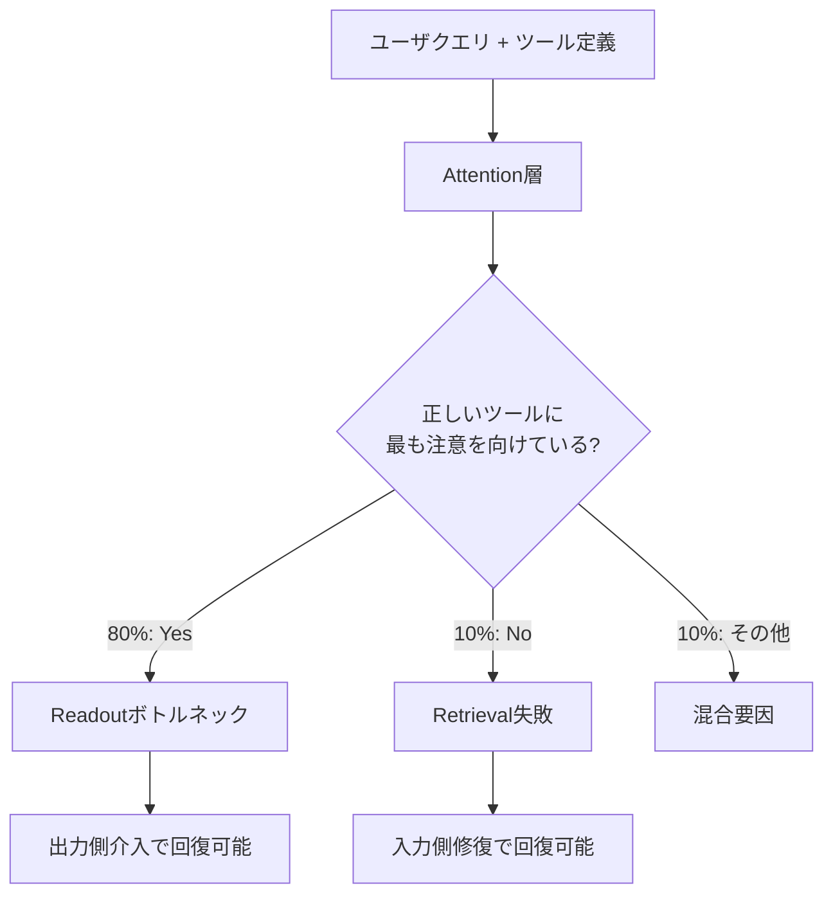
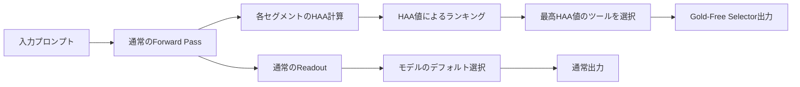

## 論文概要（Abstract）

LLMエージェントがツール選択に失敗する原因について、従来の「モデルが正しいツールに注意を向けていない」という仮説に挑戦する研究である。著者はBFCL（Berkeley Function-Calling Leaderboard）の失敗ケースの80%で、モデルが正しいツール定義に最も高い注意を向けているにもかかわらず誤選択することを実証した。ボトルネックは情報検索段階ではなく、注意情報を出力に変換する意思決定段階（readout）にあることを示し、訓練不要のGold-Free Selectorで精度を+11.9ポイント向上させている。

本記事は [arXiv:2606.16364](https://arxiv.org/abs/2606.16364) の解説記事です。

この記事は [Zenn記事: Opus 5.5×Bedrock AgentCoreで社内ITヘルプデスクのツール選択精度を評価し誤呼び出しを削減する](https://zenn.dev/0h_n0/articles/b518ad76e25fcd) の深掘りです。

## 情報源

- **arXiv ID**: 2606.16364
- **URL**: [https://arxiv.org/abs/2606.16364](https://arxiv.org/abs/2606.16364)
- **著者**: Shiyang Chen
- **発表年**: 2026年（submitted June 15, revised June 27, 2026）
- **分野**: cs.AI, cs.CR, cs.SE

## 背景と動機（Background & Motivation）

LLMエージェントのツール選択精度は、プロダクション環境での信頼性を左右する重要な課題である。従来、ツール選択の失敗は「モデルが正しいツール定義を十分に参照していない」すなわち情報検索（retrieval）段階の問題と解釈されてきた。この仮説に基づき、ツール定義の順序変更や要約の工夫といった入力側の改善が試みられてきた。

しかし著者は、この前提そのものに疑問を投げかけている。モデルの内部注意パターンを解析すると、失敗ケースの大多数でモデルは正しいツールに高い注意を向けていることが判明した。問題は注意を「向ける」段階ではなく、注意情報を最終出力に「変換する」段階（readout）にある。この発見は、ツール選択改善のアプローチを根本的に転換する可能性を持つ。特にBedrock AgentCoreのようなマネージドエージェント基盤でツール数が増加する実運用環境において、この知見は直接的な意味を持つ。

## 主要な貢献（Key Contributions）

- **Attention Paradoxの発見**: 失敗ケースの80%でモデルが正しいツールに最高の注意を向けていることを10モデル・6ファミリーで実証し、ボトルネックがretrieval段階ではなくreadout段階にあることを特定
- **HAA（Harness Attention Allocation）指標の提案**: ツール定義セグメント単位の注意量を定量化する指標を設計し、注意シンクやポジションバイアスの影響を差し引いた正確な測定を実現
- **入力側 vs 出力側介入の比較実験**: 入力側修復（プロンプト並べ替え・複製）が失敗の23%以下しか回復しない一方、出力側介入（attention bias・残差ストリームステアリング）が59-91%を回復することを実証
- **Gold-Free Selectorの提案**: 金ラベルやper-toolコーパスを必要としない訓練不要のツール選択手法で、BFCLで+11.9ポイント、Seal-Toolsで+14.9ポイントの精度向上を達成

## 技術的詳細（Technical Details）

### Attention Paradox（注意のパラドックス）

著者が発見した中核的な現象は、「モデルが正しいツールを見ているのに選ばない」というパラドックスである。

具体的には、ツール選択に失敗したケースを分析した結果、80%のケースで正しいツール（gold tool）が全ツール中で最も高い注意を受けていた。ランダムな場合の期待値が約21%（平均4-5ツールから1つを選ぶ確率）であることを考えると、この80%という数値はモデルが正しいツールを「認識」していることを示している。一方、注意不足（under-attended）が原因の失敗はわずか10%に過ぎなかった。



この発見は、ツール選択の改善において入力プロンプトの工夫（ツール定義の順序変更、要約、RAGによる絞り込み等）だけでは不十分であることを意味する。

### HAA（Harness Attention Allocation）指標

著者はツール定義セグメント単位の注意量を定量化するため、HAA指標を提案している。

まず、プロンプト中の各ツール定義を「セグメント」として区切り、最終トークン生成時の各セグメントへの注意量を集計する。具体的には、生成トークン位置 $t$ からセグメント $s$ への注意量を以下で定義する：

$$
\text{HAA}_l(s) = \frac{1}{H} \sum_{h=1}^{H} \sum_{j \in \text{pos}(s)} \alpha_{l,h}(t, j)
$$

ここで、
- $l$: Transformerの層インデックス
- $H$: attention headの総数
- $\alpha_{l,h}(t, j)$: 層 $l$、ヘッド $h$ における生成位置 $t$ からソース位置 $j$ への注意重み
- $\text{pos}(s)$: セグメント $s$ に属するトークン位置の集合

gold toolとdistractor群との注意マージンは以下で定義される：

$$
\text{attention\_margin} = \text{HAA}(\text{gold}) - \overline{\text{HAA}}(\text{distractors})
$$

ここで $\overline{\text{HAA}}(\text{distractors})$ はdistractor（正解以外のツール）群のHAA平均値である。このマージンが正であるにもかかわらず誤選択が発生するケースこそが、readoutボトルネックの証拠となる。

注意シンク（BOS/EOSトークン等に注意が集中する現象）やポジションバイアス（先頭のツール定義に注意が偏る現象）の影響は、これらの領域に対応するトークン位置を除外して計算することで排除している。

### 入力側 vs 出力側介入の実験

著者は、ボトルネックの所在を特定するため、入力側と出力側の両方から介入実験を実施している。

**入力側修復**（retrieval段階への介入）：
- プロンプト内のツール定義順序を並べ替え（position debiasing）
- 正しいツール定義を複製してプロンプトに追加（attention boosting via duplication）
- 結果: 失敗ケースの23%以下しか回復できなかった

**出力側介入**（readout段階への介入）：
- **加算attention-logitバイアス**: 特定のセグメントへの注意重みを増幅するため、attention logitに定数を加算する
- **残差ストリームステアリング**: 中間層の残差ストリームに方向ベクトルを加算し、出力分布を誘導する
- 結果: 失敗の59-91%を回復

注目すべきは、表現的に異なる2つの出力側介入手法（加算attention-logitバイアスと残差ストリームステアリング）が同じ失敗セットを回復したことである。Jaccard重複は0.87と報告されており、これは両手法が同一のボトルネック（readout段階）に作用していることの因果的証拠となる。

### 因果的用量反応分析

著者は介入の因果性を検証するため、用量反応（dose-response）実験を実施している。

**Gold segmentブースト時**:
- attention-logitバイアスの強度を段階的に増加させると、正しいツールの選択確率 $P(\text{gold})$ が 0.18 から 0.90 に単調増加
- Spearman相関: +0.857 から +0.964

**Distractor segmentブースト時**:
- 誤ったツールへのバイアスを増加させると、$P(\text{gold})$ が 0.02 まで崩壊
- Spearman相関: -0.893 から -1.000

**層の深さによる効果差異**:
- 最終1/4の層で最も鋭い効果が観察された
- 浅い層での介入は効果が限定的
- これはreadoutが主に深い層で実行されることを示唆

```python
from dataclasses import dataclass


@dataclass
class DoseResponseResult:
    """因果的用量反応分析の結果を保持するデータクラス。

    Attributes:
        bias_strength: attention-logitバイアスの強度
        p_gold: 正しいツールの選択確率
        spearman_rho: バイアス強度とP(gold)のSpearman相関
    """

    bias_strength: float
    p_gold: float
    spearman_rho: float


def compute_attention_margin(
    haa_gold: float,
    haa_distractors: list[float],
) -> float:
    """Gold toolとdistractor群のHAAマージンを計算する。

    Args:
        haa_gold: 正しいツールへのHAA値
        haa_distractors: 各distractorツールへのHAA値のリスト

    Returns:
        HAA(gold) - mean(HAA(distractors)) のマージン値。
        正の値はモデルが正しいツールに注意を向けていることを示す。
    """
    if not haa_distractors:
        return haa_gold
    mean_distractor = sum(haa_distractors) / len(haa_distractors)
    return haa_gold - mean_distractor
```

### Gold-Free Selector

著者が提案するGold-Free Selectorは、金ラベル（正解ツールの教師信号）やper-toolコーパス（各ツール固有の訓練データ）を一切必要としない、訓練不要のツール選択手法である。

基本的な考え方は、readoutボトルネックを迂回することにある。モデルが正しいツールに注意を向けている（retrievalは成功している）にもかかわらず、readoutで失敗するのであれば、attention分布から直接ツールを選択すればよい。

具体的な手順は以下の通りである：

1. **HAA計算**: 各ツール定義セグメントに対するHAA値を算出
2. **注意ランキング**: HAA値でツールをランキング
3. **選択**: HAA値が最も高いツールを選択（readout段階をバイパス）



この手法の利点は以下の通りである：

- **訓練不要**: 追加の学習データやfine-tuningが不要
- **モデル非依存**: 4D加算attention maskを尊重するモデルであれば適用可能
- **低コスト**: 約1.2倍のデコーディングコスト（HAA計算のオーバーヘッドのみ）
- **汎用性**: 3B-32Bの全テストモデルで一貫した改善

```python
import numpy as np


def gold_free_selector(
    attention_weights: np.ndarray,
    segment_boundaries: list[tuple[int, int]],
    num_layers: int,
    num_heads: int,
    target_layers: list[int] | None = None,
) -> int:
    """Gold-Free Selectorによるツール選択。

    注意重みからHAAを計算し、最高HAA値のツールセグメントを選択する。
    金ラベル不要・訓練不要でreadoutボトルネックを迂回する。

    Args:
        attention_weights: 注意重みテンソル
            shape: (num_layers, num_heads, seq_len, seq_len)
        segment_boundaries: 各ツール定義の(start, end)位置のリスト
        num_layers: Transformerの層数
        num_heads: attention headの数
        target_layers: HAA計算に使用する層のリスト。
            Noneの場合、最終1/4の層を使用（論文の知見に基づく）

    Returns:
        選択されたツールのインデックス（0-indexed）
    """
    if target_layers is None:
        # 最終1/4の層が最も効果的（論文Section 4.3）
        quarter = num_layers // 4
        target_layers = list(range(num_layers - quarter, num_layers))

    haa_scores: list[float] = []
    last_token_idx = attention_weights.shape[2] - 1

    for start, end in segment_boundaries:
        score = 0.0
        for layer_idx in target_layers:
            for head_idx in range(num_heads):
                attn_slice = attention_weights[layer_idx, head_idx, last_token_idx, start:end]
                score += float(np.sum(attn_slice))
        score /= len(target_layers) * num_heads
        haa_scores.append(score)

    return int(np.argmax(haa_scores))
```

## 実装のポイント（Implementation）

Gold-Free Selectorを実装する際の重要な注意点を整理する。

**Attention重みの抽出**: PyTorchベースのモデルでは `output_attentions=True` を指定してforward passを実行し、全層の注意重みを取得する。メモリ使用量はモデルサイズと系列長に比例するため、大規模モデルでは層ごとの逐次処理やFP16での計算が必要となる場合がある。

**セグメント境界の特定**: ツール定義のセグメント境界はトークナイザの出力から特定する。ツール定義のJSON/YAML構造をパースし、各定義の開始・終了トークン位置を正確にマッピングする必要がある。

**注意シンク除外**: BOS/EOSトークンや特定のデリミタに注意が集中する「注意シンク」現象を考慮し、これらの位置をHAA計算から除外することで精度が向上する。

**対応モデルの制約**: 4D加算attention maskを尊重するモデルに限定される。著者はPhi-3が非互換であることを報告している。また、クローズドモデル（API経由のみのモデル）では内部attention重みにアクセスできないため適用不可能である。

## Production Deployment Guide

本論文のGold-Free Selectorは、既存のLLMエージェントのツール選択精度を訓練なしに向上させる実装可能な手法であるため、AWS上でのプロダクション環境構築ガイドを示す。以下のコスト試算は2026年9月時点のap-northeast-1（東京）リージョンの概算値であり、実際のコストはトラフィックパターンやバースト使用量により変動する。最新料金はAWS料金計算ツールでの確認を推奨する。

### AWS実装パターン（コスト最適化重視）

Gold-Free Selectorはattention重みの抽出を伴うため、クローズドモデルAPI（Bedrock等）単体では実装できず、オープンモデルのセルフホスティングが必要となる。

| 構成 | トラフィック | アーキテクチャ | 月額概算 |
|------|-------------|--------------|---------|
| Small | ~100 req/日 | SageMaker Serverless + DynamoDB | $150-300 |
| Medium | ~1,000 req/日 | ECS Fargate + SageMaker Endpoint | $800-1,500 |
| Large | 10,000+ req/日 | EKS + Karpenter (Spot) + SageMaker | $3,000-6,000 |

**Small構成の内訳**:
- SageMaker Serverless Inference（8B model, ml.g5.xlarge相当）: ~$120/月
- DynamoDB On-Demand（ツール定義キャッシュ）: ~$5/月
- Lambda（API Gateway + オーケストレーション）: ~$10/月
- CloudWatch（ログ・メトリクス）: ~$15/月

**コスト削減テクニック**:
- SageMaker Savings Plans: 1年コミットで最大64%削減
- Spot Instances（EKS構成時）: 最大90%削減（ml.g5系列のSpot割引率は変動大）
- モデル選択ロジック: 単純なクエリはBedrock（Claude Haiku）で処理し、ツール数が多い場合のみGold-Free Selectorを適用
- attention重みキャッシュ: 同一ツールセット構成に対するHAA値をDynamoDBにキャッシュし、再計算を回避

### Terraformインフラコード

**Small構成（Serverless）**:

```hcl
# Gold-Free Selector - Small構成 (SageMaker Serverless + Lambda)
# 2026-09 ap-northeast-1 概算: $150-300/月

resource "aws_iam_role" "selector_lambda" {
  name = "gold-free-selector-lambda-role"
  assume_role_policy = jsonencode({
    Version = "2012-10-17"
    Statement = [{
      Action = "sts:AssumeRole"
      Effect = "Allow"
      Principal = { Service = "lambda.amazonaws.com" }
    }]
  })
}

resource "aws_iam_role_policy" "selector_lambda" {
  name = "gold-free-selector-lambda-policy"
  role = aws_iam_role.selector_lambda.id
  # 最小権限: SageMaker Invoke + DynamoDB + CloudWatch Logs
  policy = jsonencode({
    Version = "2012-10-17"
    Statement = [
      {
        Effect   = "Allow"
        Action   = ["sagemaker:InvokeEndpoint"]
        Resource = aws_sagemaker_endpoint.selector.arn
      },
      {
        Effect = "Allow"
        Action = [
          "dynamodb:GetItem",
          "dynamodb:PutItem",
          "dynamodb:Query"
        ]
        Resource = aws_dynamodb_table.haa_cache.arn
      },
      {
        Effect   = "Allow"
        Action   = ["logs:CreateLogGroup", "logs:CreateLogStream", "logs:PutLogEvents"]
        Resource = "arn:aws:logs:*:*:*"
      }
    ]
  })
}

resource "aws_dynamodb_table" "haa_cache" {
  name         = "gold-free-selector-haa-cache"
  billing_mode = "PAY_PER_REQUEST" # On-Demand: コスト最適化
  hash_key     = "tool_set_hash"
  range_key    = "query_hash"

  attribute {
    name = "tool_set_hash"
    type = "S"
  }
  attribute {
    name = "query_hash"
    type = "S"
  }

  # KMS暗号化
  server_side_encryption {
    enabled = true
  }

  ttl {
    attribute_name = "expires_at"
    enabled        = true
  }
}

# CloudWatch アラーム: コスト異常検知
resource "aws_cloudwatch_metric_alarm" "sagemaker_invocation_spike" {
  alarm_name          = "gold-free-selector-invocation-spike"
  comparison_operator = "GreaterThanThreshold"
  evaluation_periods  = 2
  metric_name         = "Invocations"
  namespace           = "AWS/SageMaker"
  period              = 3600
  statistic           = "Sum"
  threshold           = 500 # 1時間あたりの上限
  alarm_actions       = [aws_sns_topic.alerts.arn]

  dimensions = {
    EndpointName = aws_sagemaker_endpoint.selector.name
  }
}
```

**Large構成（Container）**:

```hcl
# Gold-Free Selector - Large構成 (EKS + Karpenter + Spot)
# 2026-09 ap-northeast-1 概算: $3,000-6,000/月

module "eks" {
  source          = "terraform-aws-modules/eks/aws"
  version         = "~> 20.0"
  cluster_name    = "gold-free-selector-cluster"
  cluster_version = "1.31"

  vpc_id     = module.vpc.vpc_id
  subnet_ids = module.vpc.private_subnets

  # パブリックアクセス最小化
  cluster_endpoint_public_access  = false
  cluster_endpoint_private_access = true
}

# Karpenter: Spot優先で自動スケーリング
resource "kubectl_manifest" "karpenter_provisioner" {
  yaml_body = yamlencode({
    apiVersion = "karpenter.sh/v1"
    kind       = "NodePool"
    metadata   = { name = "gpu-spot" }
    spec = {
      template = {
        spec = {
          requirements = [
            { key = "karpenter.sh/capacity-type", operator = "In", values = ["spot", "on-demand"] },
            { key = "node.kubernetes.io/instance-type", operator = "In", values = ["g5.xlarge", "g5.2xlarge"] }
          ]
        }
      }
      disruption = {
        consolidationPolicy = "WhenEmptyOrUnderutilized"
      }
    }
  })
}

# AWS Budgets: 月額予算アラート
resource "aws_budgets_budget" "selector" {
  name         = "gold-free-selector-monthly"
  budget_type  = "COST"
  limit_amount = "6000"
  limit_unit   = "USD"
  time_unit    = "MONTHLY"

  notification {
    comparison_operator       = "GREATER_THAN"
    threshold                 = 80
    threshold_type            = "PERCENTAGE"
    notification_type         = "ACTUAL"
    subscriber_email_addresses = ["ops-team@example.com"]
  }
}
```

### 運用・監視設定

**CloudWatch Logs Insights クエリ**（レイテンシ分析）:

```
fields @timestamp, @message
| filter @message like /selector_latency/
| stats avg(latency_ms) as avg_lat,
        percentile(latency_ms, 95) as p95_lat,
        percentile(latency_ms, 99) as p99_lat,
        count(*) as total
  by bin(1h)
| sort @timestamp desc
```

**CloudWatch アラーム設定**:

```python
import boto3


def create_selector_alarms(endpoint_name: str, sns_topic_arn: str) -> list[str]:
    """Gold-Free Selector用のCloudWatchアラームを作成する。

    Args:
        endpoint_name: SageMakerエンドポイント名
        sns_topic_arn: 通知先SNSトピックのARN

    Returns:
        作成されたアラームARNのリスト
    """
    cw = boto3.client("cloudwatch", region_name="ap-northeast-1")
    alarm_arns: list[str] = []

    # SageMaker推論レイテンシ異常検知
    cw.put_metric_alarm(
        AlarmName=f"{endpoint_name}-latency-p99",
        MetricName="ModelLatency",
        Namespace="AWS/SageMaker",
        Statistic="p99",
        Period=300,
        EvaluationPeriods=3,
        Threshold=5000000,  # 5秒（マイクロ秒単位）
        ComparisonOperator="GreaterThanThreshold",
        AlarmActions=[sns_topic_arn],
        Dimensions=[{"Name": "EndpointName", "Value": endpoint_name}],
    )

    return alarm_arns
```

**X-Ray トレーシング設定**:

```python
from aws_xray_sdk.core import xray_recorder, patch_all


def configure_xray_tracing() -> None:
    """Gold-Free Selectorパイプライン用のX-Rayトレーシングを設定する。

    boto3（SageMaker, DynamoDB）への呼び出しを自動計装し、
    HAA計算のサブセグメントをアノテーション付きで記録する。
    """
    xray_recorder.configure(
        service="gold-free-selector",
        sampling=True,
        context_missing="LOG_ERROR",
    )
    patch_all()  # boto3自動計装


def trace_haa_computation(
    tool_count: int,
    selected_tool: str,
    haa_margin: float,
) -> None:
    """HAA計算のトレース情報を記録する。

    Args:
        tool_count: 候補ツールの総数
        selected_tool: 選択されたツール名
        haa_margin: gold toolとdistractors間のHAAマージン
    """
    subsegment = xray_recorder.begin_subsegment("haa_computation")
    subsegment.put_annotation("tool_count", tool_count)
    subsegment.put_annotation("selected_tool", selected_tool)
    subsegment.put_metadata("haa_margin", haa_margin)
    xray_recorder.end_subsegment()
```

**Cost Explorer 日次レポート**:

```python
import datetime

import boto3


def get_daily_selector_cost(date: datetime.date | None = None) -> dict[str, float]:
    """Gold-Free Selectorの日次コストをサービス別に取得する。

    Args:
        date: 対象日。Noneの場合は前日。

    Returns:
        サービス名をキー、コスト（USD）を値とする辞書。
        合計が$100/日を超過した場合はSNS通知を送信する。
    """
    if date is None:
        date = datetime.date.today() - datetime.timedelta(days=1)

    ce = boto3.client("ce", region_name="us-east-1")
    start = date.isoformat()
    end = (date + datetime.timedelta(days=1)).isoformat()

    response = ce.get_cost_and_usage(
        TimePeriod={"Start": start, "End": end},
        Granularity="DAILY",
        Metrics=["UnblendedCost"],
        Filter={
            "Tags": {
                "Key": "Project",
                "Values": ["gold-free-selector"],
            }
        },
        GroupBy=[{"Type": "DIMENSION", "Key": "SERVICE"}],
    )

    costs: dict[str, float] = {}
    for group in response["ResultsByTime"][0]["Groups"]:
        service = group["Keys"][0]
        amount = float(group["Metrics"]["UnblendedCost"]["Amount"])
        costs[service] = amount

    total = sum(costs.values())
    if total > 100.0:
        sns = boto3.client("sns", region_name="ap-northeast-1")
        sns.publish(
            TopicArn="arn:aws:sns:ap-northeast-1:ACCOUNT:selector-alerts",
            Subject=f"Gold-Free Selector cost alert: ${total:.2f}/day",
            Message=f"Daily cost exceeded $100: ${total:.2f}\n{costs}",
        )

    return costs
```

### コスト最適化チェックリスト

**アーキテクチャ選択**:
- [ ] トラフィック量に応じた構成を選択（Small: Serverless / Medium: Hybrid / Large: Container）
- [ ] 単純クエリはBedrock API（クローズドモデル）、複雑クエリのみGold-Free Selectorに振り分け

**リソース最適化**:
- [ ] GPU: Spot Instances優先（g5系列、最大90%削減）
- [ ] SageMaker: Savings Plans検討（1年コミットで最大64%削減）
- [ ] Lambda: メモリサイズ最適化（Power Tuning実行）
- [ ] ECS/EKS: Karpenterでアイドル時スケールダウン
- [ ] DynamoDB: On-Demandモードで過剰プロビジョニング回避

**LLMコスト削減**:
- [ ] モデル選択ロジック: ツール数閾値でSelector適用を判断
- [ ] HAA値キャッシュ: 同一ツールセット構成の結果をDynamoDBにキャッシュ
- [ ] バッチ推論: 非リアルタイム処理はSageMaker Batch Transformを使用
- [ ] 量子化: INT8/INT4量子化でGPUメモリ使用量とコストを削減

**監視・アラート**:
- [ ] AWS Budgets: 月額上限設定
- [ ] CloudWatch アラーム: SageMaker推論レイテンシ（P99 < 5秒）
- [ ] Cost Anomaly Detection有効化
- [ ] 日次コストレポート: Cost Explorer API + SNS通知（$100/日超過時）
- [ ] X-Ray: エンドツーエンドのトレーシング有効化

**リソース管理**:
- [ ] 未使用SageMakerエンドポイント削除
- [ ] タグ戦略: `Project=gold-free-selector` タグ統一
- [ ] CloudWatch Logsライフサイクル: 90日保持ポリシー
- [ ] 開発環境: 夜間・週末のSageMakerエンドポイント自動停止
- [ ] S3ライフサイクル: 古いモデルアーティファクトのGlacier移行

## 実験結果（Results）

著者は10モデル・6ファミリー（0.5B-32B）にわたる広範な実験を実施している。

### ベンチマーク結果

| ベンチマーク | タスク数 | ベースライン精度 | Gold-Free Selector | 改善幅 |
|-------------|---------|----------------|-------------------|--------|
| BFCL live_multiple | 300実タスク | - | - | +11.9 pt |
| Seal-Tools | 294実タスク | - | - | +14.9 pt |
| 合成タスク | 3,600 | - | - | 改善（モデル依存） |

（ベースライン精度はモデルごとに異なるため、改善幅で比較。論文Table 3より）

### 介入手法の比較

| 介入手法 | 種別 | 回復率 | 備考 |
|---------|------|-------|------|
| プロンプト並べ替え | 入力側 | 23%以下 | position debiasing |
| ツール定義複製 | 入力側 | 23%以下 | attention boosting |
| Attention-logitバイアス | 出力側 | 59-91% | 加算バイアス |
| 残差ストリームステアリング | 出力側 | 59-91% | residual stream |

（論文Section 4より）

2つの出力側介入手法のJaccard重複は0.87であり、同一のボトルネック（readout段階）に作用していることを示す因果的証拠と著者は報告している。

### 実験の制約

著者は以下の制約を明示している：

1. **関数選択のみ対象**: 引数の品質（argument quality）は本研究の対象外
2. **マルチターン転移の不成功**: シングルターンでの改善がマルチターン（τ-bench: 120ユーザー、3-4ステップ）には転移しなかった
3. **BFCL引数スコアリングとの非互換**: 制約付き命名プロトコルにより-19.1ポイントのペナルティ
4. **モデル互換性**: 4D加算attention maskを尊重するモデルに限定（Phi-3は非互換、クローズドモデルは適用不可）

## 実運用への応用（Practical Applications）

この論文の知見は、Bedrock AgentCoreのようなマネージドエージェント基盤でのツール選択精度改善に直接的な示唆を持つ。

**ハイブリッドアーキテクチャ**: クローズドモデル（Claude, GPT等）はattention重みにアクセスできないため、Gold-Free Selectorを直接適用できない。しかし、オープンモデル（Llama-3.1, Qwen2.5等）をツール選択専用のセレクタとして配置し、選択結果をクローズドモデルの実行に渡すハイブリッド構成が考えられる。ツール選択は比較的小さなモデル（3B-8B）でも有効と報告されており、コスト効率の良い構成が可能である。

**ツール数スケーリング**: ツール数が増加するにつれてdistractor数も増え、readoutボトルネックの影響が大きくなると予想される。企業のITヘルプデスクのように数十のツール（パスワードリセット、VPN設定、チケット作成等）を持つシステムでは、Gold-Free Selectorの効果が特に顕著となる可能性がある。

**監視と検知**: HAA指標を本番環境で計測・記録することで、ツール選択の信頼度をリアルタイムに監視できる。attention marginが低い場合に人間のレビューを挟むフォールバック戦略により、誤呼び出しのリスクを低減できる。

## 関連研究（Related Work）

- **Berkeley Function-Calling Leaderboard (BFCL)**: LLMのツール呼び出し能力を評価するベンチマーク。本論文はBFCLのlive_multipleサブセットの失敗ケースを分析対象としている
- **Seal-Tools**: ツール選択のロバスト性を評価するベンチマーク。Gold-Free Selectorが+14.9ポイントの改善を達成した評価対象の一つ
- **Mechanistic Interpretability**: Transformerの内部動作を解明する研究領域。本論文はattention分布の解析とcausal interventionの手法を応用し、ツール選択のボトルネックを特定している
- **xLAM-2**: Salesforceが開発したfunction-calling特化モデル。本論文の実験対象モデルの一つであり、Gold-Free Selectorによる改善が確認されている

## まとめと今後の展望

本論文は「LLMは正しいツールに注意を向けているのに選べない」というAttention Paradoxを発見し、ツール選択失敗のボトルネックがretrieval段階ではなくreadout段階にあることを因果的に実証した。提案されたGold-Free Selectorは訓練不要かつ低コストで、BFCLで+11.9ポイント、Seal-Toolsで+14.9ポイントの精度向上を達成している。

今後の研究方向として、著者はマルチターンシナリオへの拡張と引数品質への適用を挙げている。また、クローズドモデルへの適用可能性（attention重みの代替信号として確信度スコアやlogit分布の利用等）も重要な課題である。Bedrock AgentCore等のマネージド環境でこの知見を活用するには、オープンモデルによるセレクタのサイドカーパターンが現実的なアプローチとなる。

## 参考文献

- **arXiv**: [https://arxiv.org/abs/2606.16364](https://arxiv.org/abs/2606.16364)
- **Related Zenn article**: [https://zenn.dev/0h_n0/articles/b518ad76e25fcd](https://zenn.dev/0h_n0/articles/b518ad76e25fcd)
- **BFCL**: [Berkeley Function-Calling Leaderboard](https://gorilla.cs.berkeley.edu/leaderboard.html)
- **Seal-Tools**: Seal-Tools benchmark for robust tool selection evaluation
