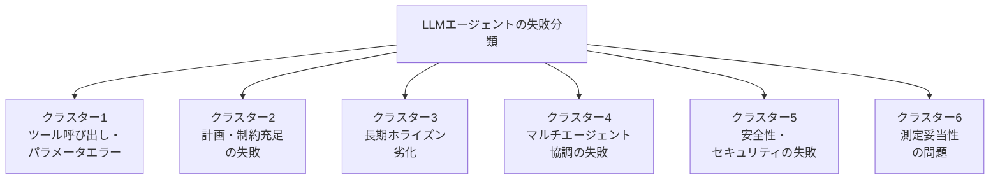
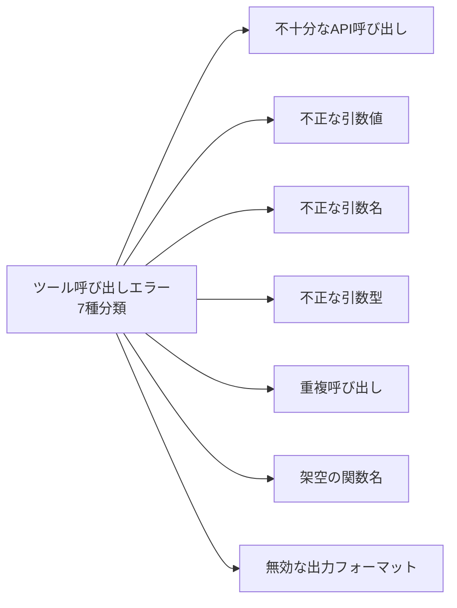
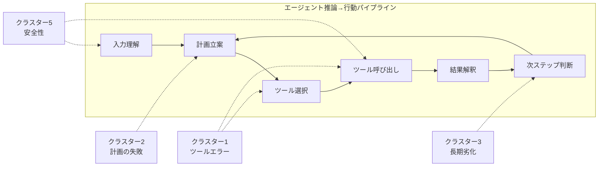

本記事は [Beyond the Leaderboard: A Synthesis of Tool-Use, Planning, and Reasoning Failures in Large Language Model Agents (arXiv:2607.05775)](https://arxiv.org/abs/2607.05775) の解説記事です。

## 論文概要（Abstract）

著者らは、2023年から2026年にかけて発表された27本のベンチマーク・分類・監査論文を系統的に統合し、19種のベンチマークにまたがるLLMエージェントの失敗モードを横断的に分類する体系（taxonomy）を構築している。ベンチマーク上のスコア改善が報告される一方で、ツール使用・計画・推論における繰り返し発生する失敗パターンが分野横断的に存在することを明らかにし、6つの失敗クラスターとして整理している。

この記事は [Zenn記事: Opus 5.5×Bedrock AgentCoreで社内ITヘルプデスクのツール選択精度を評価し誤呼び出しを削減する](https://zenn.dev/0h_n0/articles/b518ad76e25fcd) の深掘りです。

## 情報源

- **arXiv ID**: 2607.05775
- **URL**: [https://arxiv.org/abs/2607.05775](https://arxiv.org/abs/2607.05775)
- **著者**: Wael Albayaydh, Rui Zhao, Ivan Flechais (University of Oxford)
- **発表年**: 2026
- **分野**: cs.AI

## 背景と動機（Background & Motivation）

LLMエージェントの評価は近年急速に進展しており、ツール使用、マルチステップ計画、マルチエージェント協調、長期ホライズンでの動作といった多様な能力がベンチマークを通じて測定されている。しかし、個々のベンチマーク論文はそれぞれ独立した評価対象と指標を持ち、論文間で報告される失敗パターンの共通点は体系的に整理されてこなかった。

著者らは、ベンチマーク上のスコア改善が実運用での信頼性を保証しない可能性を指摘している。リーダーボード上の数値的進歩が注目される一方で、異なる評価研究で繰り返し観察される構造的な失敗モードが見過ごされているという問題意識がある。特に、個々のサブタスクで高い性能を示すモデルが、エンドツーエンドのタスク完遂では大幅に性能が低下するという乖離は、エージェント開発者にとって深刻な課題である。

この問題に対し、著者らは「エージェントの推論から行動に至るパイプラインの各段階に対応するテーマにグループ化する」というアプローチで、分野横断的な失敗の分類体系を反復的に構築している。

## 主要な貢献（Key Contributions）

- **貢献1**: 27本のベンチマーク・分類・監査論文（2023-2026年）を系統的に統合し、19種のベンチマークにまたがる横断的な失敗分類体系（taxonomy）を構築
- **貢献2**: LLMエージェントの失敗を6つのクラスター（ツール呼び出しエラー、計画・制約充足の失敗、長期ホライズン劣化、マルチエージェント協調の失敗、安全性・セキュリティの失敗、測定妥当性の問題）に分類
- **貢献3**: 失敗がタスク長に対して非線形に複合すること、および個々のサブタスクの性能がエンドツーエンドの成功を保証しないことを複数のベンチマーク結果から実証的に確認
- **貢献4**: 追加のスキャフォールディング（プロンプト拡張やツール補助）が一貫して信頼性を改善するわけではないことを示し、「スキャフォールディング万能論」に対する反証を提示

## 技術的詳細（Technical Details）

### 方法論：系統的統合

著者らの方法論は、個別のベンチマーク論文をメタレベルで統合するサーベイ研究である。27本の論文を対象に、各論文が報告する失敗モードを抽出し、エージェントの「推論→行動パイプライン」の各段階に対応するテーマにグループ化して反復的に分類体系を導出している。

対象とされた19種のベンチマークには、ToolBenchやAPIBenchなどのツール使用ベンチマーク、WebArenaなどのウェブナビゲーションベンチマーク、SWE-benchなどのコーディングベンチマーク、さらにマルチエージェント協調や安全性に関するベンチマークが含まれる。

### 6つの失敗クラスター

著者らが同定した6つの失敗クラスターを以下に詳述する。



#### クラスター1: ツール呼び出しとパラメータレベルのエラー

最も基本的な失敗クラスターであり、LLMが外部ツール（API）を呼び出す際に発生するエラーを扱う。著者らは、ToolScanなどの先行分類体系を参照しつつ、以下の7種のエラーパターンを報告している。



1. **不十分なAPI呼び出し（Insufficient API calls）**: タスク完遂に必要なAPI呼び出しを行わない、または必要な数のAPI呼び出しを省略する。例えば、複数のデータソースから情報を集約すべき場面で一部のソースしか照会しないケースがこれに該当する
2. **不正な引数値（Incorrect argument values）**: API呼び出し自体は正しいが、引数に渡す値が誤っている。日付フォーマットの不一致、IDの取り違え、単位の誤変換などが典型例として報告されている
3. **不正な引数名（Incorrect argument names）**: APIのパラメータ名を誤って指定する。類似した名前のパラメータが存在する場合に特に発生しやすい
4. **不正な引数型（Incorrect argument types）**: 文字列として渡すべき値を数値で渡す、リストとして渡すべき値をスカラーで渡すなど、型の不一致が発生する
5. **重複呼び出し（Repeated API calls）**: 同一のAPIを不必要に複数回呼び出す。コンテキストが長くなると過去の呼び出し結果を「忘れる」ことが原因として指摘されている
6. **架空の関数名（Incorrect function names）**: 実際には存在しないAPI関数名をハルシネーションで生成する。学習データに含まれる類似APIの名前を誤って呼び出すパターンが報告されている
7. **無効な出力フォーマット（Invalid output formatting）**: API呼び出しの結果を後続処理に渡す際のフォーマットが不正確であり、パイプライン全体の障害を引き起こす

これらの7種のエラーは、Bedrock AgentCoreのようなエージェント実行基盤においてツール選択精度を評価する際の体系的なチェックリストとして活用できる。

#### クラスター2: 計画・制約充足の失敗

タスクを分解し、サブゴールを管理し、制約条件を満たしながら計画を実行する能力に関する失敗を扱う。著者らは以下のパターンを報告している。

- **タスク分解の誤り**: 複合的なタスクを適切なサブタスクに分割できない。分割が粗すぎる（1つのサブタスクに複数の目標を含む）場合と、細かすぎる（不要な中間ステップを生成する）場合の両方が観察されている
- **サブゴール間の依存関係の無視**: あるサブタスクの出力が次のサブタスクの入力となる依存関係を認識できず、順序を誤る
- **制約の見落とし**: タスク仕様に含まれる制約条件（時間制限、リソース制約、ドメイン固有のルール）を計画に反映しない

#### クラスター3: 長期ホライズン劣化（コンテキスト蓄積）

タスクのステップ数やコンテキスト長が増加するにつれて性能が低下する現象を扱う。著者らが特に強調しているのは、この劣化が線形ではなく非線形に進行するという点である。

$$
P(\text{success}) \neq \prod_{i=1}^{n} P(\text{step}_i \text{ success})
$$

上式は、エンドツーエンドの成功確率が各ステップの成功確率の単純な積にならないことを概念的に示している。ステップ間でエラーが伝播・増幅するため、ステップ数 $n$ の増加に対して成功率は単純な積よりも速く低下する。

著者らは、この非線形劣化の原因として以下を挙げている。

- **コンテキスト内の情報の「忘却」**: 初期ステップで得た情報が、コンテキストが長くなるにつれて効果的に参照されなくなる
- **エラーの連鎖的伝播**: 1つのステップでの小さな誤りが、後続ステップで増幅される
- **注意機構の限界**: Transformerの自己注意機構がコンテキスト長に対して効率的に情報を保持できない場合がある

#### クラスター4: マルチエージェント協調の失敗

複数のLLMエージェントが協調してタスクを遂行する場面での失敗を扱う。

- **情報共有の不完全性**: エージェント間で必要な情報が適切に伝達されない
- **役割分担の曖昧さ**: 各エージェントの責任範囲が不明確であり、タスクの重複や漏れが発生する
- **協調プロトコルの不在**: エージェント間のやり取りの順序やフォーマットが標準化されておらず、解釈の齟齬が生じる

#### クラスター5: 安全性・セキュリティの失敗

敵対的な入力や、曖昧な文脈におけるエージェントの脆弱性を扱う。

- **プロンプトインジェクション耐性の不足**: ツール呼び出しの引数やAPIレスポンスに埋め込まれた悪意あるプロンプトに対して脆弱
- **権限境界の逸脱**: 与えられた権限の範囲を超えた操作を実行しようとする
- **機密情報の漏洩**: ツール呼び出しの過程でシステム情報や個人情報を意図せず露出する

#### クラスター6: 測定妥当性の問題

エージェント評価そのものの信頼性に関する問題を扱う。これは技術的な失敗というよりも、ベンチマーク設計に起因するメタレベルの問題である。

- **タスクの代表性**: ベンチマークタスクが実運用シナリオをどの程度反映しているか
- **評価指標の粒度**: 部分的な成功をどのように測定するか（バイナリの成功/失敗では情報が失われる）
- **データ汚染**: ベンチマークのテストケースがLLMの学習データに含まれている可能性

### エージェント推論→行動パイプラインにおける失敗の位置づけ

著者らは、6つのクラスターをエージェントの処理パイプラインの各段階にマッピングしている。



このパイプライン上の位置づけにより、各クラスターの失敗がどの段階で発生し、どのように後続段階に伝播するかが明確になる。例えば、クラスター2（計画の失敗）は計画立案段階で発生するが、その影響はツール選択以降の全段階に波及する。

### 進歩が見られる領域

著者らは失敗パターンの分析と並行して、LLMエージェントが改善を示している領域も報告している。

- **単一ターンのツール使用**: 1回のツール呼び出しで完結するタスクでは、近年のモデルは高い精度を達成している
- **短期ホライズンのウェブナビゲーション**: 数ステップで完了するウェブ上のタスク（検索、フォーム入力など）では、着実な改善が見られる
- **狭いスコープのコーディングタスク**: 関数単位の実装や短いスクリプトの生成など、限定的なコーディングタスクでは高い成功率が報告されている

ただし、これらの改善が見られる領域はいずれも「短い」「狭い」「単純」という共通点を持ち、長期・広範・複合的なタスクでの信頼性向上は依然として課題であると著者らは述べている。

## 実験結果（Benchmark Analysis）

本論文はサーベイ研究であり、独自の実験を実施したものではない。27本の論文から抽出されたベンチマーク結果を横断的に分析した結果を以下にまとめる。

著者らは、対象とした19種のベンチマーク間で共通して観察される傾向として、以下の3点を報告している。

第一に、タスク長（ステップ数）に対する成功率の低下が非線形であること。3-5ステップ程度のタスクでは80-90%の成功率を示すモデルが、10ステップ以上になると30-50%まで低下するケースが複数のベンチマークで観察されている。この低下は各ステップの成功率の積から予測される値よりも大きく、エラーの伝播と増幅が起きていることを示唆している。

第二に、個々のサブタスクの性能とエンドツーエンドの性能に大きな乖離があること。ツール呼び出しの単体精度が90%を超えるモデルであっても、5つのツール呼び出しを連鎖させるタスクでの成功率は50%程度に留まるといったパターンが報告されている。

第三に、スキャフォールディング（Chain-of-Thought、ReAct、リトライ機構などの補助構造）の効果が一貫しないこと。特定のベンチマークやタスクタイプでは改善が見られるが、別のベンチマークでは効果がないか、むしろ性能低下を引き起こすケースも報告されている。

## 実運用への応用（Practical Applications）

### Bedrock AgentCoreにおけるツール選択精度の評価

本論文の失敗分類は、Bedrock AgentCoreのようなエージェント実行基盤におけるツール選択精度の評価フレームワークとして直接活用できる。特にクラスター1で定義された7種のツール呼び出しエラーは、ツール選択の品質を多角的に測定するためのチェック項目として有用である。

```python
from dataclasses import dataclass
from enum import Enum


class ToolCallErrorType(Enum):
    """論文のクラスター1に基づくツール呼び出しエラー分類。

    arXiv:2607.05775 で定義された7種のエラータイプ。
    """
    INSUFFICIENT_CALLS = "insufficient_api_calls"
    INCORRECT_ARG_VALUES = "incorrect_argument_values"
    INCORRECT_ARG_NAMES = "incorrect_argument_names"
    INCORRECT_ARG_TYPES = "incorrect_argument_types"
    REPEATED_CALLS = "repeated_api_calls"
    INCORRECT_FUNC_NAMES = "incorrect_function_names"
    INVALID_OUTPUT_FORMAT = "invalid_output_formatting"


@dataclass
class ToolCallEvalResult:
    """ツール呼び出し評価の結果。

    Attributes:
        total_calls: 評価対象のツール呼び出し総数
        errors_by_type: エラータイプ別の発生回数
        error_rate: 全体のエラー率
    """
    total_calls: int
    errors_by_type: dict[ToolCallErrorType, int]
    error_rate: float

    def dominant_error_type(self) -> ToolCallErrorType | None:
        """最も頻度の高いエラータイプを返す。

        Returns:
            最頻エラータイプ。エラーがない場合はNone。
        """
        if not self.errors_by_type:
            return None
        return max(self.errors_by_type, key=self.errors_by_type.get)
```

### エージェント評価設計への示唆

本論文の知見は、エージェントシステムの評価設計に以下の示唆を与える。

1. **サブタスク精度とエンドツーエンド精度を分離して計測する**: クラスター3（長期ホライズン劣化）の知見から、個別のツール呼び出し精度だけでなく、複数ステップを連鎖させた場合の成功率を別途計測すべきである
2. **エラー分類を多軸で行う**: クラスター1の7種分類のように、単なる成功/失敗のバイナリ判定ではなく、失敗の種類を詳細に記録することで、改善の方向性が明確になる
3. **スキャフォールディングの効果を過信しない**: リトライ機構やChain-of-Thoughtの追加が必ずしも改善につながらないため、個別のタスクタイプでの検証が必要である

### ITヘルプデスクでの誤呼び出し削減への応用

Zenn記事で扱われているBedrock AgentCoreを用いた社内ITヘルプデスクのユースケースに対して、本論文の知見は以下のように応用できる。

- **ツール定義の精密化**: クラスター1の「架空の関数名」「不正な引数名」エラーを防ぐため、ツール定義のdescriptionとパラメータ名を明確かつ一意にする
- **呼び出し連鎖の短縮**: クラスター3（長期ホライズン劣化）を考慮し、1つのユーザーリクエストに対するツール呼び出し連鎖をできるだけ短く保つ
- **エラー分類に基づくモニタリング**: 7種のツール呼び出しエラーをログに記録し、どのエラータイプが支配的かを継続的に監視する

## 関連研究（Related Work）

- **ToolBench** (Qin et al., 2024): 大規模なAPI群に対するLLMのツール使用能力を評価するベンチマーク。16,000以上の実際のAPIを対象とし、マルチステップのAPI呼び出し連鎖を評価する。本論文のクラスター1（ツール呼び出しエラー）の分析において主要な参照元の1つとして使用されている
- **WebArena** (Zhou et al., 2024): 実際のウェブサイト環境でのエージェントのナビゲーション・操作能力を評価するベンチマーク。長期ホライズンのウェブタスクにおける失敗パターンの分析に寄与しており、クラスター3の知見の根拠の1つとなっている
- **SWE-bench** (Jimenez et al., 2024): 実際のGitHubリポジトリのIssueを解決するコーディングエージェントの能力を評価するベンチマーク。計画・制約充足の失敗（クラスター2）と長期ホライズン劣化（クラスター3）の両方に関連する知見を提供している
- **ToolScan** (参照分類体系): ツール呼び出しエラーの7種分類の基盤となった先行研究。本論文のクラスター1はToolScanの分類体系を拡張・統合する形で構成されている

## まとめと今後の展望

本論文は、27本のベンチマーク・分類・監査論文を統合的に分析し、LLMエージェントの失敗を6つのクラスター（ツール呼び出しエラー、計画の失敗、長期ホライズン劣化、マルチエージェント協調の失敗、安全性の失敗、測定妥当性の問題）に体系化したサーベイ研究である。リーダーボード上のスコア改善の裏側で、構造的な失敗パターンが分野横断的に存在し続けていることを明らかにしている。

特に、失敗がタスク長に対して非線形に複合するという知見と、スキャフォールディングの効果が一貫しないという知見は、エージェントシステムの設計・評価において重要な含意を持つ。今後は、非線形劣化のメカニズムの理解と緩和手法の開発、マルチエージェント協調プロトコルの標準化、そしてベンチマーク設計自体の改善（クラスター6への対処）が重要な研究課題になると考えられる。

## 参考文献

- **arXiv**: [https://arxiv.org/abs/2607.05775](https://arxiv.org/abs/2607.05775)
- **Related Zenn article**: [https://zenn.dev/0h_n0/articles/b518ad76e25fcd](https://zenn.dev/0h_n0/articles/b518ad76e25fcd)
