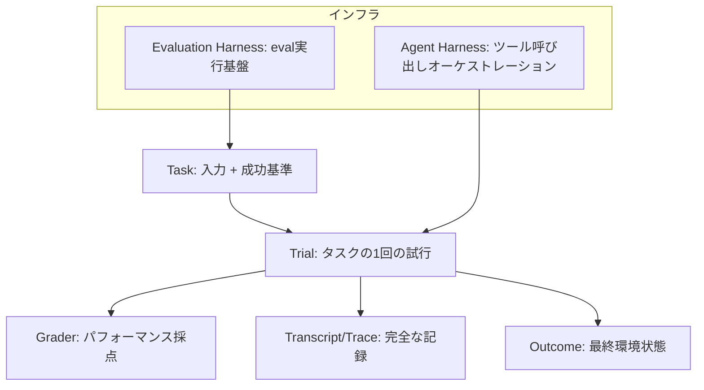
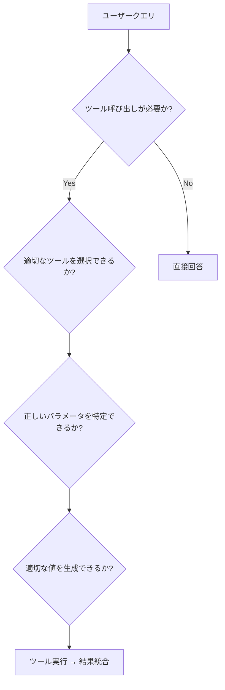
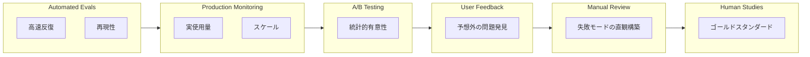
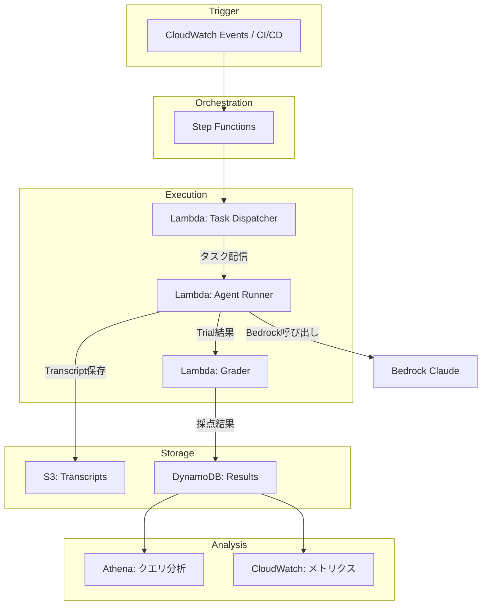

## ブログ概要（Summary）

本記事は [Anthropicエンジニアリングブログ「Demystifying evals for AI agents」](https://www.anthropic.com/engineering/demystifying-evals-for-ai-agents) の解説記事です。

Anthropicは本ブログで、マルチターン・ツール使用AIエージェントの評価（eval）戦略を体系的に解説している。シングルターンのLLM評価とは異なり、エージェント評価ではツール呼び出しの連鎖、非決定的な振る舞い、環境との相互作用といった固有の課題が存在する。本ブログでは、Task・Trial・Graderといったコア概念を定義した上で、3種類のグレーダー（Code-based / Model-based / Human）、非決定性への対処指標（pass@k / pass^k）、複数手法を組み合わせるSwiss Cheese Model、そして段階的な実装ロードマップ（Phase 1-3）を提示している。

この記事は [Zenn記事: Opus 5.5×Bedrock AgentCoreで社内ITヘルプデスクのツール選択精度を評価し誤呼び出しを削減する](https://zenn.dev/0h_n0/articles/b518ad76e25fcd) の深掘りです。

## 情報源

- **種別**: 企業テックブログ（Anthropic Engineering Blog）
- **URL**: [https://www.anthropic.com/engineering/demystifying-evals-for-ai-agents](https://www.anthropic.com/engineering/demystifying-evals-for-ai-agents)
- **組織**: Anthropic（Claude開発元）

## 技術的背景（Technical Background）

### エージェント評価はなぜシングルターンLLM評価と異なるのか

従来のLLM評価は、入力プロンプトに対する1回の出力を採点する比較的単純な構造であった。テキスト生成の品質、分類精度、要約の正確性など、入出力のペアで評価が完結する。

一方、エージェント評価では以下の特有の課題が生じる。Anthropicは、エージェントがツール呼び出しを含む複数ステップの意思決定を行う点に着目し、シングルターン評価の手法をそのまま適用できないことを強調している。

- **非決定性**: 同一の入力に対してエージェントが異なるツール呼び出しシーケンスを選択する可能性がある。温度パラメータだけでなく、外部ツールの応答の変動も結果に影響する
- **中間状態の評価**: 最終出力だけでなく、ツール呼び出しの選択・パラメータ・順序が適切であったかを評価する必要がある
- **環境との相互作用**: エージェントがデータベースやAPIに副作用を及ぼすため、試行間の分離が必須になる
- **パスの多様性**: 正解に至る経路が複数存在し、特定のツール呼び出しシーケンスをハードコードした評価は正当なバリエーションを不合格にしてしまう

これらの課題に対し、Anthropicは体系的なフレームワークを提示している。

## 実装アーキテクチャ（Architecture）

### コア定義

Anthropicは、エージェント評価を構成する基本概念を以下のように定義している。



- **Task**: 入力と成功基準が定義された個別テスト。「正解」が明確に定まっている必要がある
- **Trial**: タスクの1回の試行。モデルの非決定性により、同じタスクでも異なる結果が得られるため複数回試行が必要
- **Grader**: エージェントのパフォーマンスを採点するロジック。後述の3カテゴリに分類される
- **Transcript/Trace**: 出力、ツール呼び出し、推論を含む完全な記録。デバッグと改善に不可欠
- **Outcome**: 試行後の最終環境状態。ファイルの変更、データベースの更新などを含む
- **Evaluation Harness**: エンドツーエンドでevalを実行するインフラ
- **Agent Harness**: ツール呼び出しをオーケストレーションするシステム

```python
from dataclasses import dataclass, field
from enum import Enum
from typing import Any


class GradeResult(Enum):
    """グレーダーの採点結果"""
    PASS = "pass"
    FAIL = "fail"
    PARTIAL = "partial"


@dataclass(frozen=True)
class Task:
    """評価タスクの定義

    Attributes:
        task_id: タスクの一意識別子
        input_data: エージェントへの入力
        success_criteria: 成功基準の記述
        reference_solution: 参照ソリューション（検証用）
        max_trials: 最大試行回数
    """
    task_id: str
    input_data: dict[str, Any]
    success_criteria: str
    reference_solution: str | None = None
    max_trials: int = 5


@dataclass(frozen=True)
class ToolCall:
    """ツール呼び出しの記録

    Attributes:
        tool_name: 呼び出されたツール名
        parameters: ツールに渡されたパラメータ
        result: ツールの返却値
        duration_ms: 呼び出しにかかった時間（ミリ秒）
    """
    tool_name: str
    parameters: dict[str, Any]
    result: Any
    duration_ms: float


@dataclass(frozen=True)
class Trial:
    """タスクの1回の試行結果

    Attributes:
        trial_id: 試行の一意識別子
        task_id: 対応するタスクID
        tool_calls: ツール呼び出しのトレース
        final_output: 最終出力
        grade: 採点結果
    """
    trial_id: str
    task_id: str
    tool_calls: tuple[ToolCall, ...] = ()
    final_output: str = ""
    grade: GradeResult = GradeResult.FAIL
```

### 3つのグレーダーカテゴリ

Anthropicは、グレーダーを3つのカテゴリに分類し、それぞれの特性と適用場面を整理している。

#### 1. Code-based Graders（コードベースグレーダー）

高速・低コスト・再現可能な点が最大の利点である。文字列マッチ、バイナリテスト（コンパイル通過・テストパス）、静的分析、結果検証などの手法がある。

Anthropicは、Code-based Gradersの欠点として「正当なバリエーションへの対応が困難」である点を挙げている。例えば、エージェントが正しい結果に到達していても、期待されたツール呼び出し順序と異なるパスを辿った場合に不合格と判定してしまうリスクがある。

```python
import re


def code_based_grader_example(
    final_output: str,
    expected_pattern: str,
    tool_calls: list[ToolCall],
    required_tools: set[str],
) -> GradeResult:
    """Code-basedグレーダーの実装例

    結果ベースの検証を行い、特定のツール呼び出しシーケンスには
    依存しない設計とする（Anthropicの推奨に従う）。

    Args:
        final_output: エージェントの最終出力
        expected_pattern: 期待される出力パターン（正規表現）
        tool_calls: ツール呼び出しのトレース
        required_tools: 使用が必須のツール名セット

    Returns:
        GradeResult: 採点結果
    """
    # 結果ベースの検証（シーケンスではなくOutcomeを評価）
    output_match = bool(re.search(expected_pattern, final_output))

    # 必須ツールが使用されたか（順序は問わない）
    used_tools = {tc.tool_name for tc in tool_calls}
    tools_used = required_tools.issubset(used_tools)

    if output_match and tools_used:
        return GradeResult.PASS
    if output_match or tools_used:
        return GradeResult.PARTIAL
    return GradeResult.FAIL
```

#### 2. Model-based Graders（モデルベースグレーダー）

ルーブリック（採点基準表）に基づく評価、自然言語アサーション、ペア比較などの手法がある。Anthropicは、ニュアンスのある応答やオープンエンドなタスクに適していると述べている。

一方で、モデルベースグレーダー自体が非決定的であるため、同じ試行に対して異なる採点を下す可能性がある。Anthropicは、人間エキスパートによるキャリブレーションの重要性を強調している。

#### 3. Human Graders（人間グレーダー）

ゴールドスタンダードの品質を提供する。専門家レビューやクラウドソーシングによる評価が含まれる。高コスト・低速であるため大規模な適用は困難だが、Model-based Gradersのキャリブレーション基準として不可欠である。

**グレーダー選択の指針**:

| カテゴリ | 速度 | コスト | 再現性 | ニュアンス対応 |
|---------|------|-------|--------|-------------|
| Code-based | 高速 | 低 | 高 | 低 |
| Model-based | 中速 | 中 | 中 | 高 |
| Human | 低速 | 高 | 変動 | 高 |

Anthropicは、特定のツール呼び出しシーケンスではなく結果（Outcome）を採点することを推奨している。これは、エージェントが正解に到達する経路が複数存在するためであり、シーケンスに依存した評価は正当なバリエーションを不合格にしてしまう。

### 非決定性の扱い: pass@k と pass^k

エージェントの非決定的な振る舞いを定量化するため、Anthropicは2つの指標を提示している。

**pass@k**: $k$ 回の試行で少なくとも1回成功する確率。

$$
\text{pass@k} = 1 - (1 - p)^k
$$

ここで $p$ は1回の試行での成功確率である。$k$ が増加すると pass@k は 1 に近づく。

**pass^k**: $k$ 回の試行で全て成功する確率。

$$
\text{pass}^k = p^k
$$

$k$ が増加すると pass^k は 0 に近づく。

**両指標の乖離が重要な意味を持つ**。Anthropicは、pass@k が高いのに pass^k が低い場合、エージェントは問題を解く「能力」を持っているが「信頼性」が低いことを示すと述べている。この乖離が大きいほど、ユーザー体験のばらつきが大きくなる。

```python
def compute_pass_metrics(
    trial_results: list[bool],
    k: int,
) -> dict[str, float]:
    """pass@kとpass^kを計算する

    Args:
        trial_results: 各試行の成否リスト
        k: 試行回数

    Returns:
        pass@kとpass^kの値を含む辞書
    """
    n = len(trial_results)
    if n == 0:
        return {"pass_at_k": 0.0, "pass_pow_k": 0.0, "gap": 0.0}

    p = sum(trial_results) / n  # 経験的成功確率

    pass_at_k = 1.0 - (1.0 - p) ** k
    pass_pow_k = p ** k
    gap = pass_at_k - pass_pow_k  # 乖離: 能力と信頼性の差

    return {
        "pass_at_k": round(pass_at_k, 4),
        "pass_pow_k": round(pass_pow_k, 4),
        "gap": round(gap, 4),
    }
```

例えば、成功確率 $p = 0.7$ のエージェントに対して $k = 5$ とすると:

- $\text{pass@5} = 1 - (1 - 0.7)^5 = 1 - 0.00243 \approx 0.998$
- $\text{pass}^5 = 0.7^5 \approx 0.168$

5回試せばほぼ確実に1回は成功するが、5回連続で成功する確率は約17%に過ぎない。この乖離（0.998 - 0.168 = 0.83）は、エージェントの信頼性に深刻な問題があることを示している。

Anthropicは、「フロンティアモデルで多数の試行にわたりpass rateが0%の場合、それはほとんどの場合、能力不足ではなくタスクの壊れたシグナルである」と述べている。すなわち、全く成功しない場合はタスク定義やグレーダーの設計を疑うべきである。

### ツール使用エージェント評価の特有課題

Anthropicは、ツール使用エージェントの評価において以下の4つの観点を検証する必要があると述べている。



1. **ツール呼び出しの必要性判断**: エージェントがツール呼び出しが必要な場面で直接回答してしまう（false negative）、または不要な場面でツールを呼び出す（false positive）ケースを検出する
2. **ツール選択の正確性**: 複数のツール候補から適切なツールを選択できるか。ツール数が増えるほど選択精度が低下する傾向がある
3. **パラメータの特定**: 選択したツールに必要なパラメータを正しく特定できるか
4. **パラメータ値の生成**: 各パラメータに適切な値を生成できるか。ユーザーの意図を正確に反映した値であるか

### Swiss Cheese Model（スイスチーズモデル）

Anthropicは、単一の評価手法に依存せず、複数の手法を重層的に組み合わせるSwiss Cheese Modelを提唱している。各手法には「穴」（限界）があるが、複数の手法を重ねることで個々の穴をカバーできるという考え方である。



- **Automated evals**: 高速な反復と再現性を提供。CI/CDパイプラインに組み込むことで、変更のたびに回帰テストを実行できる
- **Production monitoring**: 実使用環境でのスケールを確保。実際のユーザートラフィックに対するエージェントの振る舞いを監視する
- **A/B testing**: 統計的有意性の検証。新旧バージョンの比較実験を行い、改善の有意性を確認する
- **User feedback**: 予想外の問題の発見。テスト環境では再現できないエッジケースをキャッチする
- **Manual transcript review**: Anthropicはこれを「失敗モードに対する直観を構築する最良の方法」と述べている。実際のトランスクリプトを読み込むことで、定量的な指標では見えないパターンを発見する
- **Systematic human studies**: ゴールドスタンダードのキャリブレーション。Model-based Gradersの精度を検証するための基準となる

### 実装ロードマップ（Phase 1-3）

Anthropicは、エージェント評価を段階的に構築するロードマップを3つのフェーズで提示している。

#### Phase 1: タスク収集

- **20-50の単純なタスクから開始**: 理想的には実際のユーザー失敗事例から収集する。机上で作成した仮想タスクよりも実際の失敗事例の方が評価としての価値が高い
- **ユーザー影響度で優先順位付け**: 高頻度で発生し、ユーザー体験に大きく影響する失敗から優先的にタスク化する
- **明確な参照ソリューションで解決可能性を証明**: タスクが実際に解けることを確認し、不可能なタスクで評価を汚染しない

```python
from dataclasses import dataclass


@dataclass(frozen=True)
class EvalTask:
    """Phase 1で収集するタスク定義

    Attributes:
        task_id: タスクの一意識別子
        description: タスクの説明
        user_impact: ユーザー影響度（high/medium/low）
        source: タスクの出典（production_failure/synthetic/expert_designed）
        input_query: エージェントへの入力クエリ
        expected_tools: 期待されるツール群（順序不問）
        success_criteria: 成功基準
        reference_solution: 参照ソリューション
    """
    task_id: str
    description: str
    user_impact: str
    source: str
    input_query: str
    expected_tools: frozenset[str]
    success_criteria: str
    reference_solution: str


# タスク収集の例
EVAL_TASKS: list[EvalTask] = [
    EvalTask(
        task_id="tool-selection-001",
        description="ITヘルプデスクでパスワードリセット要求に適切なツールを選択する",
        user_impact="high",
        source="production_failure",
        input_query="社内システムのパスワードを忘れました。リセットしたいです。",
        expected_tools=frozenset({"password_reset", "user_lookup"}),
        success_criteria="password_resetツールが正しいユーザーIDで呼び出される",
        reference_solution="user_lookupで社員IDを取得し、password_resetを実行",
    ),
    EvalTask(
        task_id="tool-selection-002",
        description="VPN接続の問題に対してネットワーク診断ツールを選択する",
        user_impact="medium",
        source="production_failure",
        input_query="VPNに接続できません。エラーコード: AUTH_FAILED",
        expected_tools=frozenset({"vpn_status_check", "user_lookup"}),
        success_criteria="vpn_status_checkがエラーコードとともに呼び出される",
        reference_solution="user_lookupでVPN権限を確認し、vpn_status_checkで診断",
    ),
]
```

#### Phase 2: ハーネスとグレーダー設計

Anthropicは、以下の設計原則を提示している。

- **試行間の相関失敗防止のための分離環境**: 各Trialが独立した環境で実行され、前のTrialの副作用が次のTrialに影響しないことを保証する
- **特定のツール呼び出しシーケンスではなく結果を採点**: 正解に至るパスが複数存在することを考慮し、最終的なOutcomeで判定する
- **マルチ次元タスクの部分クレジット**: 全か無かではなく、部分的な成功を評価する仕組みを設ける
- **Model-based Gradersの人間エキスパートによるキャリブレーション**: Model-based Graderが人間の判断と整合しているかを定期的に検証する

```python
from dataclasses import dataclass


@dataclass(frozen=True)
class MultiDimensionGrade:
    """マルチ次元タスクの部分クレジット採点

    Attributes:
        tool_selection_correct: 適切なツールが選択されたか
        parameter_correct: パラメータが正しいか
        result_correct: 最終結果が正しいか
        overall_score: 総合スコア（0.0-1.0）
    """
    tool_selection_correct: bool
    parameter_correct: bool
    result_correct: bool

    @property
    def overall_score(self) -> float:
        """重み付き総合スコアを計算する"""
        weights = {
            "tool_selection": 0.3,
            "parameter": 0.3,
            "result": 0.4,
        }
        score = (
            weights["tool_selection"] * self.tool_selection_correct
            + weights["parameter"] * self.parameter_correct
            + weights["result"] * self.result_correct
        )
        return round(score, 2)
```

#### Phase 3: 長期メンテナンス

- **定期的なTranscript読み込みによるグレーダー公正性検証**: グレーダーが意図した通りに機能しているか、実際のトランスクリプトを用いて検証する
- **「飽和」の監視**: 全タスクをクリアした場合、そのeval setではさらなる改善を測定できなくなる。新しいタスクの追加が必要になる
- **Eval-driven development**: Anthropicは「エージェントが解けるようになる前にevalを作成する」ことを推奨している。これはTDD（Test-Driven Development）のアナロジーであり、evalが仕様書として機能する

Anthropicは、「評価タスクの定義は、プロダクト要件が構築開始に十分具体的かどうかをストレステストする最良の方法の一つである」と述べている。evalを作成する過程で要件の曖昧さが顕在化し、実装前に仕様を明確化できるという副次的効果がある。

## Production Deployment Guide

### AWS実装パターン（エージェント評価パイプライン）

エージェント評価パイプラインをAWS上で構築する場合、試行の分離、並列実行、結果の集約という3つの要件を満たす必要がある。以下にトラフィック量別の推奨構成を示す。コスト試算は2026年9月時点のap-northeast-1（東京）リージョン料金に基づく概算値であり、最新料金はAWS料金計算ツールでの確認を推奨する。

**構成別推奨アーキテクチャ**:

| 構成 | eval頻度 | アーキテクチャ | 月額概算 |
|------|---------|--------------|---------|
| Small | 日次・手動 | Step Functions + Lambda + Bedrock | $50-200 |
| Medium | CI/CDトリガー | ECS Fargate + Bedrock + S3 + Athena | $300-1,000 |
| Large | 常時監視 | EKS + Bedrock Batch + OpenSearch | $2,000-8,000 |

エージェント評価では1タスクあたり複数のTrialを実行し、各Trialで複数のBedrock呼び出しが発生するため、通常のAPIリクエストと比較してコストが5-20倍に膨らむ。



**Small構成の内訳**:
- Step Functions: $0.025/1,000状態遷移。eval実行フローの宣言的定義
- Lambda: 512MB RAM、タイムアウト300秒。各Trial実行を独立した関数呼び出しとして分離
- Bedrock Claude Sonnet: 入力$3/MTok、出力$15/MTok。50タスク x 5 Trial x 3Kトークン = ~$35/月
- DynamoDB On-Demand: Trial結果の保存 = ~$2/月
- S3: Transcript保存（1GB未満） = ~$0.03/月

### Terraformインフラコード

**Step Functions + Lambda構成（エージェント評価パイプライン）**:

```hcl
# Step Functions: エージェント評価パイプライン
resource "aws_sfn_state_machine" "agent_eval_pipeline" {
  name     = "agent-eval-pipeline"
  role_arn = aws_iam_role.sfn_role.arn

  definition = jsonencode({
    Comment = "エージェント評価パイプライン（Phase 1-3対応）"
    StartAt = "LoadTasks"
    States = {
      LoadTasks = {
        Type     = "Task"
        Resource = aws_lambda_function.task_loader.arn
        Next     = "RunTrials"
      }
      RunTrials = {
        Type       = "Map"
        ItemsPath  = "$.tasks"
        MaxConcurrency = 10
        Iterator = {
          StartAt = "ExecuteTrial"
          States = {
            ExecuteTrial = {
              Type     = "Task"
              Resource = aws_lambda_function.trial_runner.arn
              Retry = [{
                ErrorEquals     = ["States.TaskFailed"]
                IntervalSeconds = 30
                MaxAttempts     = 2
                BackoffRate     = 2.0
              }]
              Next = "GradeTrial"
            }
            GradeTrial = {
              Type     = "Task"
              Resource = aws_lambda_function.grader.arn
              Next     = "StoreResult"
            }
            StoreResult = {
              Type     = "Task"
              Resource = aws_lambda_function.result_store.arn
              End      = true
            }
          }
        }
        Next = "ComputeMetrics"
      }
      ComputeMetrics = {
        Type     = "Task"
        Resource = aws_lambda_function.metrics_computer.arn
        Next     = "CheckSaturation"
      }
      CheckSaturation = {
        Type = "Choice"
        Choices = [{
          Variable     = "$.saturation_detected"
          BooleanEquals = true
          Next         = "NotifySaturation"
        }]
        Default = "PublishResults"
      }
      NotifySaturation = {
        Type     = "Task"
        Resource = "arn:aws:states:::sns:publish"
        Parameters = {
          TopicArn = aws_sns_topic.eval_alerts.arn
          Message  = "Eval saturation detected: all tasks passing."
        }
        Next = "PublishResults"
      }
      PublishResults = {
        Type     = "Task"
        Resource = aws_lambda_function.result_publisher.arn
        End      = true
      }
    }
  })
}

# Lambda: Trial実行（分離環境）
resource "aws_lambda_function" "trial_runner" {
  function_name = "eval-trial-runner"
  runtime       = "python3.12"
  handler       = "eval_runner.trial_handler"
  role          = aws_iam_role.lambda_role.arn
  timeout       = 300
  memory_size   = 512
  filename      = "eval_runner.zip"

  environment {
    variables = {
      BEDROCK_MODEL_ID     = "anthropic.claude-sonnet-4-20250514"
      TRANSCRIPT_BUCKET    = aws_s3_bucket.transcripts.id
      MAX_TOKENS           = "2048"
      ISOLATION_MODE       = "per_trial"
    }
  }
}

# Lambda: Grader（Code-based + Model-based）
resource "aws_lambda_function" "grader" {
  function_name = "eval-grader"
  runtime       = "python3.12"
  handler       = "eval_runner.grader_handler"
  role          = aws_iam_role.lambda_role.arn
  timeout       = 120
  memory_size   = 256
  filename      = "eval_runner.zip"

  environment {
    variables = {
      BEDROCK_MODEL_ID = "anthropic.claude-haiku-4-20250514"
      RESULTS_TABLE    = aws_dynamodb_table.eval_results.name
    }
  }
}

# S3: Transcript保存
resource "aws_s3_bucket" "transcripts" {
  bucket = "agent-eval-transcripts"
}

resource "aws_s3_bucket_lifecycle_configuration" "transcripts_lifecycle" {
  bucket = aws_s3_bucket.transcripts.id

  rule {
    id     = "archive-old-transcripts"
    status = "Enabled"

    transition {
      days          = 30
      storage_class = "GLACIER_IR"
    }

    expiration {
      days = 365
    }
  }
}

# DynamoDB: 評価結果
resource "aws_dynamodb_table" "eval_results" {
  name         = "agent-eval-results"
  billing_mode = "PAY_PER_REQUEST"
  hash_key     = "task_id"
  range_key    = "trial_id"

  attribute {
    name = "task_id"
    type = "S"
  }

  attribute {
    name = "trial_id"
    type = "S"
  }

  attribute {
    name = "eval_date"
    type = "S"
  }

  global_secondary_index {
    name            = "by-date"
    hash_key        = "eval_date"
    range_key       = "task_id"
    projection_type = "ALL"
  }
}

# Bedrock IAMポリシー
resource "aws_iam_role_policy" "bedrock_invoke" {
  name = "bedrock-invoke"
  role = aws_iam_role.lambda_role.id
  policy = jsonencode({
    Version = "2012-10-17"
    Statement = [{
      Effect   = "Allow"
      Action   = ["bedrock:InvokeModel", "bedrock:InvokeModelWithResponseStream"]
      Resource = "arn:aws:bedrock:ap-northeast-1::foundation-model/anthropic.claude-*"
    }]
  })
}

# CloudWatch: 飽和検出アラーム
resource "aws_cloudwatch_metric_alarm" "eval_saturation" {
  alarm_name          = "eval-saturation-warning"
  comparison_operator = "GreaterThanOrEqualToThreshold"
  evaluation_periods  = 3
  metric_name         = "PassRate"
  namespace           = "AgentEval/Metrics"
  period              = 86400
  statistic           = "Average"
  threshold           = 100
  alarm_actions       = [aws_sns_topic.eval_alerts.arn]
  alarm_description   = "全タスク通過が3日連続: eval setの拡張を検討"
}

# AWS Budgets: eval実行コスト上限
resource "aws_budgets_budget" "eval_monthly" {
  name         = "agent-eval-monthly"
  budget_type  = "COST"
  limit_amount = "500"
  limit_unit   = "USD"
  time_unit    = "MONTHLY"

  notification {
    comparison_operator       = "GREATER_THAN"
    threshold                 = 80
    threshold_type            = "PERCENTAGE"
    notification_type         = "ACTUAL"
    subscriber_sns_topic_arns = [aws_sns_topic.eval_alerts.arn]
  }
}
```

### 運用・監視設定

**CloudWatch Logs Insights クエリ**（タスク別pass rate推移）:

```
fields @timestamp, task_id, grade, trial_id
| stats count(*) as total,
        sum(case grade when 'pass' then 1 else 0 end) as passed
        by task_id
| sort total desc
```

**CloudWatch Logs Insights クエリ**（グレーダー種別ごとの採点一致率）:

```
fields @timestamp, task_id, grader_type, grade, human_grade
| filter ispresent(human_grade)
| stats sum(case when grade = human_grade then 1 else 0 end) as agreement,
        count(*) as total
        by grader_type
| sort total desc
```

**Trial実行メトリクス収集**:

```python
import json
import time
import logging
from dataclasses import dataclass, asdict

import boto3

logger = logging.getLogger(__name__)


@dataclass(frozen=True)
class EvalTrialMetrics:
    """Trial実行メトリクス

    Attributes:
        event: イベント名
        level: ログレベル
        ts: タイムスタンプ
        request_id: リクエストID
        duration_ms: 実行時間（ミリ秒）
        task_id: タスクID
        trial_id: 試行ID
        grade: 採点結果
        tool_calls_count: ツール呼び出し回数
        input_tokens: 入力トークン数
        output_tokens: 出力トークン数
    """
    event: str
    level: str
    ts: str
    request_id: str
    duration_ms: float
    task_id: str
    trial_id: str
    grade: str
    tool_calls_count: int
    input_tokens: int
    output_tokens: int


def log_trial_execution(
    request_id: str,
    task_id: str,
    trial_id: str,
    grade: str,
    tool_calls_count: int,
    input_tokens: int,
    output_tokens: int,
    duration_ms: float,
) -> None:
    """Trial実行メトリクスを構造化ログとして出力する"""
    metrics = EvalTrialMetrics(
        event="eval_trial_completed",
        level="INFO",
        ts=time.strftime("%Y-%m-%dT%H:%M:%SZ", time.gmtime()),
        request_id=request_id,
        duration_ms=duration_ms,
        task_id=task_id,
        trial_id=trial_id,
        grade=grade,
        tool_calls_count=tool_calls_count,
        input_tokens=input_tokens,
        output_tokens=output_tokens,
    )
    logger.info(json.dumps(asdict(metrics), ensure_ascii=False))


def publish_pass_rate_metric(
    task_id: str,
    pass_at_k: float,
    pass_pow_k: float,
) -> None:
    """pass@kとpass^kをCloudWatchカスタムメトリクスとして発行する"""
    cw = boto3.client("cloudwatch", region_name="ap-northeast-1")
    cw.put_metric_data(
        Namespace="AgentEval/Metrics",
        MetricData=[
            {
                "MetricName": "PassAtK",
                "Value": pass_at_k,
                "Unit": "Percent",
                "Dimensions": [
                    {"Name": "TaskId", "Value": task_id},
                ],
            },
            {
                "MetricName": "PassPowK",
                "Value": pass_pow_k,
                "Unit": "Percent",
                "Dimensions": [
                    {"Name": "TaskId", "Value": task_id},
                ],
            },
            {
                "MetricName": "PassRate",
                "Value": pass_at_k,
                "Unit": "Percent",
                "Dimensions": [],
            },
        ],
    )
```

### コスト最適化テクニック

- **Graderの階層化**: Code-based Graderで明確にPASS/FAILと判定できるケースを先にフィルタし、曖昧なケースのみModel-based Graderに回す。Model-based Graderの呼び出し回数を50-70%削減できる
- **Prompt Caching**: Bedrockのプロンプトキャッシュを活用し、共通のシステムプロンプト部分のコストを最大90%削減する。evalではシステムプロンプトが全Trialで共通であるため効果が大きい
- **Transcript保存のライフサイクル管理**: 30日経過したTranscriptをS3 Glacier Instant Retrievalに移行し、ストレージコストを約68%削減する
- **GraderにHaikuを使用**: Model-based Graderの実行にHaikuを使用することで、Sonnet比でコストを約1/10に抑えられる。採点タスクは比較的単純なため、精度への影響は限定的である

## パフォーマンス最適化（Performance Optimization）

エージェント評価パイプラインのボトルネックはBedrock API呼び出しのレイテンシである。50タスク x 5 Trial = 250回のTrial実行を逐次処理すると、1回あたり30秒として約2時間を要する。

**並列化戦略**: Step FunctionsのMap StateでMaxConcurrency=10に設定し、10タスクを同時に実行する。これにより250回のTrialを約12分で完了できる。ただし、Bedrockのスロットリングリミット（デフォルト: リージョンあたり数十RPM）を超えないようRetryポリシーに指数バックオフを設定する必要がある。

**Transcript保存の最適化**: 全Trialの完全なTranscriptをS3に保存すると、後からManual Transcript Reviewで失敗パターンを分析できる。Anthropicが推奨する「定期的なTranscript読み込みによるグレーダー公正性検証」をAthenaで実行することで、大規模なTranscriptに対するアドホッククエリが可能になる。

## 運用での学び（Operational Insights）

Anthropicが提示する実装ロードマップは、段階的なアプローチを強調している。この点は、エージェント評価を一から構築する組織にとって実践的な示唆を含んでいる。

**Phase 1で20-50タスクから開始する理由**: 大規模なeval setを初期から構築しようとすると、タスク設計の品質が低下し、結果の解釈が困難になる。少数のタスクで評価パイプラインのEnd-to-Endを検証し、グレーダーのキャリブレーションを完了してからスケールすべきである。

**飽和の監視が重要な理由**: 全タスクをクリアした状態が続くと、そのeval setではモデルやプロンプトの改善を測定できなくなる。Anthropicはこの状態を「飽和」と呼び、新しいタスクの追加やタスクの難易度引き上げを推奨している。AWS環境ではCloudWatchアラームでpass rateが100%に達した場合に通知を送り、eval setの更新を促すことが有効である。

**Eval-driven developmentの実践**: エージェントが解けるようになる前にevalを作成するという考え方は、TDDのRed-Green-Refactorサイクルに通じる。evalをRedテストとして先に記述し、エージェントの改善でGreenにし、eval setの整理でRefactorする。

## 学術研究との関連（Academic Context）

エージェント評価の体系化は、LLMの評価手法研究の文脈に位置づけられる。HumanEval（コード生成評価）で導入されたpass@kの概念がエージェント評価に拡張されており、本ブログではpass^kとの対比で信頼性の次元を追加している。

Swiss Cheese Modelは元来、安全工学（特に航空・医療分野）の事故防止モデルであり、James Reasonが1990年代に提唱したものである。Anthropicはこれをソフトウェア品質保証に転用し、複数の評価手法の重層的な適用を体系化している。

また、ツール使用エージェントの評価における4つの観点（呼び出し要否判断、ツール選択、パラメータ特定、値生成）は、Function Callingの精度評価をより細粒度に分解したものと位置づけられる。

## まとめと実践への示唆

Anthropicが提示するエージェント評価フレームワークの核心は、「評価は品質保証だけでなく、プロダクト要件の具体化ツールである」という点にある。eval作成の過程で要件の曖昧さが顕在化し、実装前に仕様を明確化できる。3種のグレーダー、pass@k/pass^kの二軸評価、Swiss Cheese Modelによる多層防御、そして段階的な実装ロードマップは、エージェント評価を実践するための具体的な指針を提供している。

## 参考文献

- [Demystifying evals for AI agents - Anthropic Engineering Blog](https://www.anthropic.com/engineering/demystifying-evals-for-ai-agents)
- [Zenn記事: Opus 5.5×Bedrock AgentCoreで社内ITヘルプデスクのツール選択精度を評価し誤呼び出しを削減する](https://zenn.dev/0h_n0/articles/b518ad76e25fcd)
