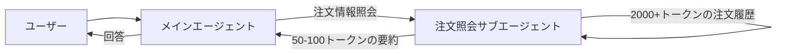
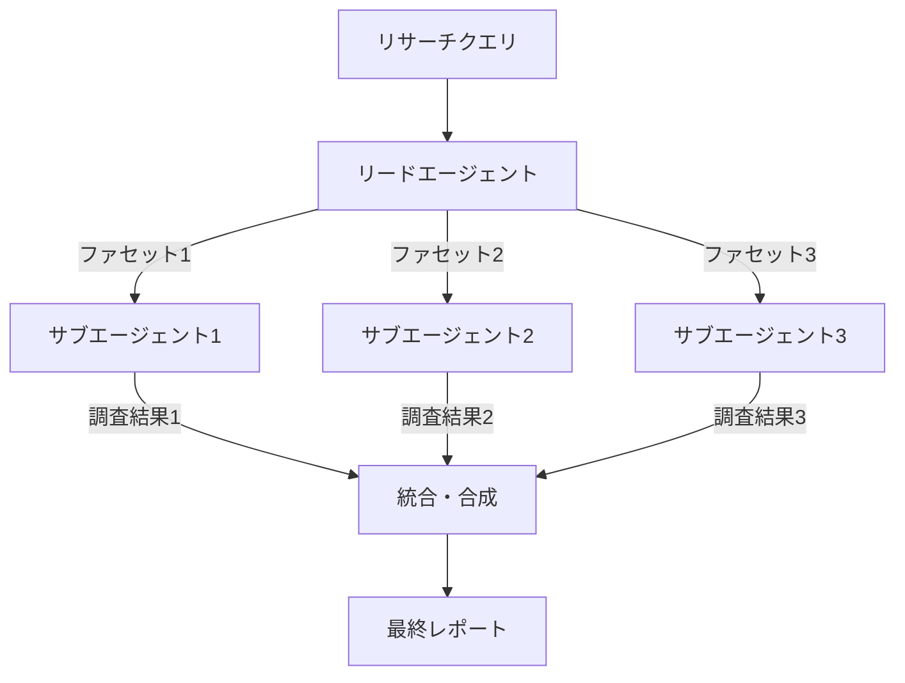
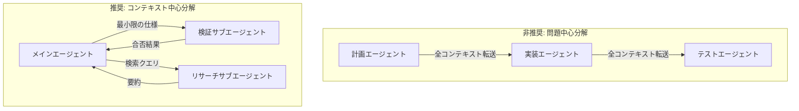
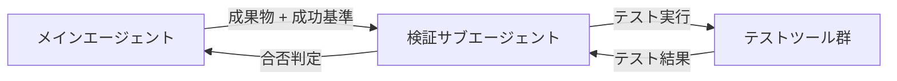

## ブログ概要（Summary）

本記事は [Anthropicのブログ記事「When to use multi-agent systems (and when not to)」](https://claude.com/blog/building-multi-agent-systems-when-and-how-to-use-them) の解説記事です。

Anthropicは2026年1月に公開した本ブログで、マルチエージェントシステムの適用判断基準を体系化している。マルチエージェントシステムを「複数のLLMインスタンスがそれぞれ独立した会話コンテキストを持ち、コードを介して協調動作するシステム」と定義した上で、3つの有効シナリオ（コンテキスト保護・並列化・専門化）を提示し、同時にシングルエージェントが十分なケースを明確化している。記事の核心は「コンテキスト中心分解（context-centric decomposition）」という設計原則であり、問題の種類ではなくコンテキストの共有要件に基づいてエージェントを分割すべきだと主張している。

この記事は [Zenn記事: Semantic Kernel 5大オーケストレーションパターンをPython×C#で実装比較する](https://zenn.dev/0h_n0/articles/a27bae62608bfd) の深掘りです。

## 情報源

- **種別**: 企業テックブログ（Anthropic / claude.com）
- **URL**: [https://claude.com/blog/building-multi-agent-systems-when-and-how-to-use-them](https://claude.com/blog/building-multi-agent-systems-when-and-how-to-use-them)
- **組織**: Anthropic（Claude開発元）
- **発表日**: 2026年1月23日

## 技術的背景（Technical Background）

### マルチエージェント vs シングルエージェント: 本質的な違い

LLMベースのエージェントシステムにおいて、マルチエージェント構成とシングルエージェント構成の根本的な違いは**会話コンテキストの共有範囲**にある。シングルエージェントでは1つのLLMインスタンスが全てのタスクを単一のコンテキストウィンドウ内で処理する。一方、マルチエージェントでは各エージェントが独立したコンテキストを持ち、エージェント間の情報伝達はコードレベルで制御される。

Anthropicは、この違いがもたらす影響を以下のように整理している。

- **シングルエージェント**: コンテキストの一貫性が保証され、オーバーヘッドが小さい。ただし、タスクが増えるにつれてコンテキストウィンドウが圧迫され、推論品質が低下する
- **マルチエージェント**: コンテキストの分離により各エージェントが特定タスクに集中できる。ただし、エージェント間の協調にオーバーヘッドが発生し、トークン使用量が3-10倍に増加する

この整理は、マルチエージェントシステムの導入が「常に良い選択」ではなく、明確な制約が存在する場合にのみ正当化されることを示唆している。

### なぜ「シングルエージェントから始めよ」なのか

Anthropicは、シングルエージェントからの開始を強く推奨している。その背景には実際の開発経験がある。Anthropicは「チームが数ヶ月をかけて精巧なマルチエージェントアーキテクチャを構築した結果、シングルエージェントのプロンプト改善で同等の結果が得られた」という事例を報告している。

マルチエージェントシステムが追加する複雑性は以下の通りである。

- 各エージェントが潜在的な障害点になる
- プロンプトの保守対象が増える
- コーディネーションロジックのデバッグが困難になる
- トークンコストが大幅に増加する

したがって、シングルエージェントの限界が明確に現れた場合にのみ、マルチエージェント化を検討すべきである。

## 実装アーキテクチャ（Architecture）

### マルチエージェントが有効な3つのシナリオ

Anthropicは、マルチエージェントシステムが真に価値を発揮するシナリオを3つに限定している。

#### シナリオ1: コンテキスト保護（Context Protection）

サブタスクが大量のコンテキスト（1,000トークン以上）を生成し、その大部分が下流のタスクに不要な場合、コンテキスト汚染（context pollution）が発生する。これによりメインタスクの推論品質が低下する。



**具体例**: カスタマーサポートエージェントが技術的な問題を診断しながら注文履歴を参照する場合を考える。注文履歴の全情報（2,000トークン以上）をメインエージェントのコンテキストに投入すると、技術診断に必要な推論用トークンが圧迫される。注文照会専用のサブエージェントを生成し、必要な要約（50-100トークン）のみをメインエージェントに返すことで、推論品質を維持できる。

**適用基準**: サブタスクが1,000トークン以上のコンテキストを生成し、そのうち下流で必要な情報が全体の10%未満の場合に有効である。

```python
from dataclasses import dataclass
from anthropic import Anthropic


@dataclass(frozen=True)
class OrderSummary:
    """サブエージェントが返す簡潔な注文要約"""
    order_id: str
    status: str
    issue_summary: str
    relevant_details: str  # 50-100トークン程度


def spawn_order_lookup_subagent(
    client: Anthropic,
    customer_id: str,
    query: str,
) -> OrderSummary:
    """注文照会サブエージェントを生成し、要約のみ返す"""
    response = client.messages.create(
        model="claude-sonnet-4-20250514",
        max_tokens=256,
        system=(
            "あなたは注文照会専門のサブエージェントです。"
            "注文データから質問に関連する情報のみを抽出し、"
            "50-100トークン程度の簡潔な要約を返してください。"
        ),
        messages=[{
            "role": "user",
            "content": f"顧客ID: {customer_id}\n質問: {query}",
        }],
    )
    # 実際にはレスポンスをパースしてOrderSummaryに変換
    return OrderSummary(
        order_id="ORD-12345",
        status="配送中",
        issue_summary="配送遅延（3日超過）",
        relevant_details=response.content[0].text,
    )
```

#### シナリオ2: 並列化（Parallelization）

複数のエージェントが独立した調査を同時に実行することで、逐次処理では到達できない探索空間をカバーする。Anthropicは自社のマルチエージェントリサーチシステムを例に挙げ、リードエージェントがクエリを独立したファセットに分解し、各ファセットを並列のサブエージェントに割り当てて同時調査させる手法を紹介している。



**適用基準**: サブタスク間に依存関係がなく、網羅性が速度より重要なタスクに適している。ただし、並列実行によりwall-clock timeが短縮されるとは限らない。オーバーヘッドを含めると、シングルエージェントの逐次処理より遅くなる場合もある。

**トークンコストのトレードオフ**: Anthropicは「マルチエージェント実装は同等のタスクに対してシングルエージェントの3-10倍のトークンを使用する」と述べている。これはコンテキストの重複とコーディネーションオーバーヘッドに起因する。

#### シナリオ3: 専門化（Specialization）

1つのエージェントに多くの役割を持たせると、各役割の実行品質が低下する。Anthropicは専門化の3つの次元を提示している。

**ツールセット専門化**: エージェントが20個以上のツールを持つと、ツール選択の精度が低下する。8-15個程度の焦点を絞ったツールセットをエージェントごとに割り当てることで、ツール選択の正確性が向上する。

**システムプロンプト専門化**: 共感的なカスタマーサポートと厳密なコードレビューのように、相反する振る舞いモードを1つのエージェントで実現することは困難である。別々のエージェントに分離することで、各モードの品質が向上する。

**ドメイン知識専門化**: 法律・医療・金融など、特定ドメインのコンテキストを集中させたエージェントは、汎用エージェントよりも専門的なタスクで高い精度を示す。

**専門化の必要性を示すシグナル**: 新しいツールの追加が既存タスクの性能を劣化させる場合、そのエージェントはキャパシティの限界に達している。

```python
from anthropic import Anthropic
from typing import Protocol


class SubAgent(Protocol):
    """サブエージェントのインターフェース"""
    def execute(self, query: str) -> str: ...


class ToolSpecializedRouter:
    """ツールセット専門化に基づくルーター"""

    def __init__(self, client: Anthropic) -> None:
        self._client = client
        self._agents: dict[str, list[dict]] = {
            "database": self._db_tools(),      # 8ツール
            "api": self._api_tools(),           # 10ツール
            "file_system": self._fs_tools(),    # 6ツール
        }

    def route(self, query: str) -> str:
        """クエリを分類し、適切な専門エージェントに委譲する"""
        category = self._classify(query)
        tools = self._agents.get(category, [])
        response = self._client.messages.create(
            model="claude-sonnet-4-20250514",
            max_tokens=1024,
            tools=tools,
            messages=[{"role": "user", "content": query}],
        )
        return response.content[0].text

    def _classify(self, query: str) -> str:
        """クエリをカテゴリに分類する"""
        response = self._client.messages.create(
            model="claude-haiku-4-20250514",
            max_tokens=32,
            system="Classify the query into: database, api, file_system",
            messages=[{"role": "user", "content": query}],
        )
        return response.content[0].text.strip().lower()

    def _db_tools(self) -> list[dict]:
        return []  # DB操作用ツール定義

    def _api_tools(self) -> list[dict]:
        return []  # API操作用ツール定義

    def _fs_tools(self) -> list[dict]:
        return []  # ファイル操作用ツール定義
```

### コンテキスト中心分解（Context-Centric Decomposition）

Anthropicが提唱する最も重要な設計原則がコンテキスト中心分解である。これは、エージェントの分割基準を「問題の種類」ではなく「コンテキストの共有要件」に置く考え方である。

**問題中心分解（非推奨）**: 作業の種類（計画・実装・テスト）でエージェントを分割する。この方式では、実装エージェントが計画エージェントの全コンテキストを受け取る必要があり、伝言ゲーム（telephone game）効果で情報が劣化する。

**コンテキスト中心分解（推奨）**: 共有コンテキストを必要とする作業をグループ化し、コンテキストを真に分離できる境界でのみ分割する。



**有効な分割境界**:
- 独立したリサーチパス（並列調査）
- クリーンなインターフェースを持つ分離されたコンポーネント
- ブラックボックス検証（成果物の入出力のみで検証可能）

**非効率な分割境界**:
- 同一作業の逐次フェーズ（計画 → 実装 → テスト）
- 密結合なコンポーネント
- 共有状態を必要とする作業

### 検証サブエージェントパターン（Verification Subagent Pattern）

Anthropicが推奨する具体的なマルチエージェントパターンが検証サブエージェントである。メインエージェントが成果物を完成させた後、専用の検証エージェントが成果物と成功基準と専門ツールを受け取り、ブラックボックステストを実行する。



このパターンが有効な理由は、検証が本質的に最小限のコンテキスト転送で成立するためである。検証エージェントは実装の詳細を知る必要がなく、成果物と期待される振る舞いのみを理解すればよい。

**重要な注意点**: Anthropicは「早期勝利（Early Victory）」と呼ばれる失敗モードを報告している。これは検証エージェントが最小限のテストのみを実行し、成果物を合格と判定してしまう問題である。対策として、以下のような明示的な指示が必要であると述べている。

> "You MUST run the complete test suite before marking as passed."

```python
from dataclasses import dataclass
from anthropic import Anthropic


@dataclass(frozen=True)
class VerificationResult:
    """検証サブエージェントの結果"""
    passed: bool
    test_count: int
    failure_details: list[str]


def run_verification_subagent(
    client: Anthropic,
    artifact: str,
    success_criteria: str,
) -> VerificationResult:
    """検証サブエージェントを実行する"""
    response = client.messages.create(
        model="claude-sonnet-4-20250514",
        max_tokens=2048,
        system=(
            "あなたは検証専門のサブエージェントです。\n"
            "受け取った成果物を成功基準に照らして検証してください。\n"
            "重要: テストスイート全体を実行してから合否を判定してください。\n"
            "部分的なテストだけで合格と判定してはいけません。"
        ),
        messages=[{
            "role": "user",
            "content": (
                f"## 成果物\n{artifact}\n\n"
                f"## 成功基準\n{success_criteria}"
            ),
        }],
    )
    # レスポンスをパースしてVerificationResultに変換
    return VerificationResult(
        passed=False,
        test_count=0,
        failure_details=[],
    )
```

### シングルエージェントの限界を示すシグナル

Anthropicは、シングルエージェントからマルチエージェントへの移行を検討すべきシグナルを3つ挙げている。

1. **コンテキストウィンドウの限界**: パフォーマンスが劣化するレベルまでコンテキストが蓄積する
2. **ツール数の増大**: 15-20個以上のツールを同時に管理する必要がある
3. **並列化可能なサブタスク**: 独立した調査や処理が複数存在する

**代替策: Tool Search Tool**: Anthropicは、ツール数増大の対策としてTool Search Toolを紹介している。エージェントが必要なツールをオンデマンドで動的に発見する仕組みであり、トークン使用量を最大85%削減しつつ、ツール選択精度を向上させることができると述べている。これにより、ツール数の増大を理由としたマルチエージェント化を回避できる場合がある。

## Production Deployment Guide

### AWS実装パターン（マルチエージェント特化）

マルチエージェントシステムをAWS上で運用する場合、シングルエージェント構成と比較してリソース管理の複雑性が増す。Anthropicが指摘するトークン使用量3-10倍の増加は、コスト設計に直接影響する。以下にトラフィック量別の推奨構成を示す。コスト試算は2026年9月時点のap-northeast-1（東京）リージョン料金に基づく概算値であり、最新料金はAWS料金計算ツールでの確認を推奨する。

**トラフィック量別推奨構成**:

| 構成 | トラフィック | アーキテクチャ | 月額概算 |
|------|-------------|--------------|---------|
| Small | ~100 req/日 | Step Functions + Lambda + Bedrock | $80-300 |
| Medium | ~1,000 req/日 | ECS Fargate + Bedrock + ElastiCache | $500-1,500 |
| Large | 10,000+ req/日 | EKS + Karpenter + Spot + Bedrock | $3,000-10,000 |

マルチエージェント構成ではシングルエージェント比でBedrock呼び出し回数が3-5倍に増加するため、月額コストもそれに比例して増大する。

**Small構成の内訳**:
- Step Functions: $0.025/1,000状態遷移。エージェント間の協調フローを宣言的に定義
- Lambda: 512MB RAM、タイムアウト300秒。各サブエージェントを独立関数として実装
- Bedrock Claude Sonnet: 入力$3/MTok、出力$15/MTok。100 req/日 x 3エージェント x 2Kトークン = ~$30/月
- DynamoDB On-Demand: エージェント間の状態共有 = ~$2/月

**コスト削減テクニック（マルチエージェント固有）**:
- コンテキスト保護パターンの適用: サブエージェントの出力をmax_tokens=256で制限し、要約のみ返す
- Prompt Cachingでシステムプロンプトのコストを最大90%削減（専門化エージェントで効果大）
- 検証サブエージェントにHaikuを使用（コスト1/10、検証タスクは精度低下が少ない）

### Terraformインフラコード

**Step Functions + Lambda構成（マルチエージェント協調）**:

```hcl
# Step Functions: マルチエージェント協調フロー
resource "aws_sfn_state_machine" "multi_agent" {
  name     = "multi-agent-orchestrator"
  role_arn = aws_iam_role.sfn_role.arn

  definition = jsonencode({
    Comment = "マルチエージェント協調ワークフロー"
    StartAt = "ClassifyTask"
    States = {
      ClassifyTask = {
        Type     = "Task"
        Resource = aws_lambda_function.classifier.arn
        Next     = "RouteByScenario"
      }
      RouteByScenario = {
        Type = "Choice"
        Choices = [
          {
            Variable     = "$.scenario"
            StringEquals = "parallel_research"
            Next         = "ParallelResearch"
          },
          {
            Variable     = "$.scenario"
            StringEquals = "context_protection"
            Next         = "ContextProtection"
          }
        ]
        Default = "SingleAgent"
      }
      ParallelResearch = {
        Type = "Parallel"
        Branches = [
          { StartAt = "Facet1", States = { Facet1 = { Type = "Task", Resource = aws_lambda_function.research_agent.arn, End = true } } },
          { StartAt = "Facet2", States = { Facet2 = { Type = "Task", Resource = aws_lambda_function.research_agent.arn, End = true } } },
          { StartAt = "Facet3", States = { Facet3 = { Type = "Task", Resource = aws_lambda_function.research_agent.arn, End = true } } }
        ]
        Next = "Synthesize"
      }
      Synthesize = {
        Type     = "Task"
        Resource = aws_lambda_function.synthesizer.arn
        Next     = "Verify"
      }
      ContextProtection = {
        Type     = "Task"
        Resource = aws_lambda_function.context_agent.arn
        Next     = "Verify"
      }
      SingleAgent = {
        Type     = "Task"
        Resource = aws_lambda_function.single_agent.arn
        Next     = "Verify"
      }
      Verify = {
        Type     = "Task"
        Resource = aws_lambda_function.verifier.arn
        End      = true
      }
    }
  })
}

# Lambda: 各サブエージェント
resource "aws_lambda_function" "research_agent" {
  function_name = "research-subagent"
  runtime       = "python3.12"
  handler       = "agents.research.handler"
  role          = aws_iam_role.lambda_role.arn
  timeout       = 300
  memory_size   = 512
  filename      = "agents.zip"

  environment {
    variables = {
      BEDROCK_MODEL_ID = "anthropic.claude-sonnet-4-20250514"
      MAX_TOKENS       = "1024"
    }
  }
}

resource "aws_lambda_function" "verifier" {
  function_name = "verification-subagent"
  runtime       = "python3.12"
  handler       = "agents.verify.handler"
  role          = aws_iam_role.lambda_role.arn
  timeout       = 120
  memory_size   = 256
  filename      = "agents.zip"

  environment {
    variables = {
      # 検証エージェントにはHaikuを使用しコスト削減
      BEDROCK_MODEL_ID = "anthropic.claude-haiku-4-20250514"
      MAX_TOKENS       = "512"
    }
  }
}

# Bedrock IAMポリシー
resource "aws_iam_role_policy" "bedrock_invoke" {
  name = "bedrock-invoke"
  role = aws_iam_role.lambda_role.id
  policy = jsonencode({
    Version = "2012-10-17"
    Statement = [{
      Effect   = "Allow"
      Action   = ["bedrock:InvokeModel", "bedrock:InvokeModelWithResponseStream"]
      Resource = "arn:aws:bedrock:ap-northeast-1::foundation-model/anthropic.claude-*"
    }]
  })
}

# CloudWatchアラーム: マルチエージェント固有のコスト監視
resource "aws_cloudwatch_metric_alarm" "sfn_execution_cost" {
  alarm_name          = "multi-agent-high-execution-count"
  comparison_operator = "GreaterThanThreshold"
  evaluation_periods  = 1
  metric_name         = "ExecutionsStarted"
  namespace           = "AWS/States"
  period              = 3600
  statistic           = "Sum"
  threshold           = 500
  alarm_actions       = [aws_sns_topic.alerts.arn]
  dimensions = {
    StateMachineArn = aws_sfn_state_machine.multi_agent.arn
  }
}

# AWS Budgets: マルチエージェント構成のコスト上限
resource "aws_budgets_budget" "monthly" {
  name         = "multi-agent-monthly"
  budget_type  = "COST"
  limit_amount = "1500"
  limit_unit   = "USD"
  time_unit    = "MONTHLY"

  notification {
    comparison_operator       = "GREATER_THAN"
    threshold                 = 80
    threshold_type            = "PERCENTAGE"
    notification_type         = "ACTUAL"
    subscriber_sns_topic_arns = [aws_sns_topic.alerts.arn]
  }
}
```

### 運用・監視設定

**CloudWatch Logs Insights クエリ**（エージェント間トークン消費比較）:

```
fields @timestamp, agent_type, input_tokens, output_tokens
| stats sum(input_tokens) as total_input, sum(output_tokens) as total_output,
        count(*) as invocations by agent_type
| sort total_output desc
```

**CloudWatch Logs Insights クエリ**（マルチエージェント vs シングルエージェントのコスト比較）:

```
fields @timestamp, scenario, total_tokens, execution_time_ms
| stats avg(total_tokens) as avg_tokens,
        percentile(execution_time_ms, 95) as p95_latency
        by scenario
| sort avg_tokens desc
```

**エージェント実行メトリクス収集**:

```python
import json
import time
import logging
from dataclasses import dataclass, asdict

import boto3

logger = logging.getLogger(__name__)


@dataclass(frozen=True)
class AgentMetrics:
    """エージェント実行メトリクス"""
    event: str
    level: str
    ts: str
    request_id: str
    duration_ms: float
    agent_type: str
    input_tokens: int
    output_tokens: int
    scenario: str


def log_agent_execution(
    request_id: str,
    agent_type: str,
    scenario: str,
    input_tokens: int,
    output_tokens: int,
    duration_ms: float,
) -> None:
    """エージェント実行メトリクスを構造化ログとして出力する"""
    metrics = AgentMetrics(
        event="agent_execution",
        level="INFO",
        ts=time.strftime("%Y-%m-%dT%H:%M:%SZ", time.gmtime()),
        request_id=request_id,
        duration_ms=duration_ms,
        agent_type=agent_type,
        input_tokens=input_tokens,
        output_tokens=output_tokens,
        scenario=scenario,
    )
    logger.info(json.dumps(asdict(metrics), ensure_ascii=False))


def publish_custom_metric(
    agent_type: str,
    metric_name: str,
    value: float,
) -> None:
    """CloudWatchカスタムメトリクスを発行する"""
    cw = boto3.client("cloudwatch", region_name="ap-northeast-1")
    cw.put_metric_data(
        Namespace="MultiAgent/Performance",
        MetricData=[{
            "MetricName": metric_name,
            "Value": value,
            "Unit": "Count",
            "Dimensions": [
                {"Name": "AgentType", "Value": agent_type},
            ],
        }],
    )
```

### コスト最適化チェックリスト

**マルチエージェント固有の最適化**:
- [ ] シングルエージェントで解決できないことを確認してからマルチエージェント化
- [ ] コンテキスト保護パターン: サブエージェントのmax_tokensを256以下に制限
- [ ] 検証サブエージェントにHaikuを使用（コスト1/10）
- [ ] Tool Search Toolの導入でツール数増大によるマルチエージェント化を回避

**インフラ最適化**:
- [ ] Step Functionsで協調フローを宣言的に管理（コードベースのオーケストレーションより保守性が高い）
- [ ] Lambda: Power Tuningでメモリサイズを最適化
- [ ] Bedrock Batch API: 非リアルタイム処理で50%コスト削減
- [ ] Prompt Caching: 専門化エージェントのシステムプロンプトで最大90%削減

**監視・アラート**:
- [ ] AWS Budgets: 月次予算アラート（80%/100%閾値）
- [ ] エージェント種別ごとのトークン消費量を可視化
- [ ] Step Functions実行回数の異常検知
- [ ] 日次コストレポート: Bedrock使用量の前日比較

## パフォーマンス最適化（Performance）

### トークン使用量の分析

Anthropicが報告するトークン使用量3-10倍の増加は、以下の要因に分解できる。

| 要因 | トークン増加倍率 | 対策 |
|------|----------------|------|
| コンテキスト重複 | 1.5-3x | システムプロンプトのPrompt Caching |
| コーディネーション | 1.2-2x | Step Functionsで暗黙的協調 |
| サブエージェント生成 | 1.5-3x | max_tokens制限 |
| 検証サブエージェント | 1.2-1.5x | Haikuモデル使用 |

**合計**: 最小で約3倍、最大で約10倍。対策適用後は2-4倍程度に抑制可能である。

### レイテンシ特性

マルチエージェント構成のレイテンシは、シナリオごとに異なる特性を示す。

| シナリオ | レイテンシ特性 | wall-clock改善 |
|---------|-------------|---------------|
| コンテキスト保護 | メイン + サブの直列合計 | 改善なし（直列） |
| 並列化 | 最遅サブエージェントに律速 | 理論上改善（実測は要検証） |
| 専門化 | 分類 + 専門エージェント | 改善なし（直列） |

Anthropicは「並列実行にもかかわらず、wall-clock timeはシングルエージェントより遅くなることが多い」と述べている。これはエージェント生成のオーバーヘッド、コンテキスト転送、結果統合の処理時間が並列化による短縮を相殺するためである。

## 運用での学び（Production Lessons）

### トレードオフの全体像

Anthropicが示すマルチエージェントシステムのトレードオフを表にまとめる。

| 観点 | シングルエージェント | マルチエージェント |
|------|-------------------|-------------------|
| トークン使用量 | 基準 | 3-10倍 |
| 協調オーバーヘッド | なし | 大 |
| 障害点 | 1つ | エージェント数に比例 |
| プロンプト保守 | 1セット | エージェント数に比例 |
| wall-clock time | 基準 | 多くの場合遅い |
| コンテキスト品質 | 劣化リスクあり | 分離により維持可能 |
| ツール選択精度 | ツール数増で劣化 | 専門化で維持可能 |
| 網羅性 | 限定的 | 並列化で向上 |

### 失敗パターン

Anthropicのブログから読み取れる典型的な失敗パターンを整理する。

**1. 問題中心分解の罠**: 計画・実装・テストをそれぞれ別のエージェントに分担させる構成は、直感的だが非効率である。各フェーズ間で全コンテキストの転送が必要になり、伝言ゲーム効果で情報が劣化する。Anthropicはこれを明確に「counterproductive（逆効果）」と表現している。

**2. 早期勝利（Early Victory）**: 検証サブエージェントが最小限のテストで合格と判定する問題。人間の検証者にも見られる認知バイアスだが、LLMでは特に顕著である。明示的な指示（「テストスイート全体を実行してから判定せよ」）が必須である。

**3. 過剰なマルチエージェント化**: シングルエージェントのプロンプト改善で解決できる問題にマルチエージェントアーキテクチャを適用してしまうケース。Anthropicは「数ヶ月の開発投資が無駄になった」事例を報告している。

## 学術研究との関連（Academic Connection）

### Semantic Kernelとの対応関係

Zenn記事で解説されているMicrosoft Semantic Kernelの5大オーケストレーションパターンと、Anthropicのマルチエージェント設計原則は異なる抽象レベルで補完的に機能する。

| Anthropicの概念 | Semantic Kernelの対応パターン | 対応度 | 備考 |
|---------------|---------------------------|-------|------|
| コンテキスト保護 | Handoff（部分的） | 中 | Handoffでサブエージェントに委譲し、結果のみ受け取る構成で実現可能 |
| 並列化 | Concurrent | 高 | Task.WhenAllベースの並列実行。ファセット分解はSemantic Kernelでも直接的に実装可能 |
| 専門化 | Handoff + GroupChat | 中 | ツールセット専門化はHandoff、ドメイン専門化はGroupChatの役割分担で実現 |
| コンテキスト中心分解 | 該当なし | 低 | Semantic Kernelはフレームワーク主導であり、分解戦略はフレームワーク外の設計判断 |
| 検証サブエージェント | GroupChat（Evaluator的） | 中 | GroupChat内のEvaluatorロールで部分的に実現可能だが、明示的な合否判定ループとは異なる |

### 設計思想の違い

Anthropicのアプローチは**判断基準駆動**である。「いつマルチエージェントを使うべきか」という問いに対して、コンテキスト保護・並列化・専門化の3条件を提示し、それ以外ではシングルエージェントを推奨する。一方、Semantic Kernelは**パターンカタログ駆動**であり、5つのオーケストレーションパターン（Sequential、Concurrent、Handoff、GroupChat、Magentic）を提供し、開発者がパターンを選択して組み合わせる。

Anthropicのコンテキスト中心分解の原則は、Semantic Kernelのどのパターンを使う場合にも適用可能な上位の設計指針である。Semantic Kernelのパターンで実装する場合でも、分割の判断基準としてAnthropicの3条件を参照することで、過剰な複雑化を避けられる。

### 関連する学術研究

**1. AutoGen (Wu et al., 2023)**: MicrosoftのAutoGenは、会話ベースのマルチエージェントフレームワークであり、エージェント間の協調を会話プロトコルとして抽象化している。Anthropicのコンテキスト中心分解の考え方は、AutoGenにおけるエージェント間の会話設計にも適用可能である。AutoGenではエージェント間で全会話履歴が共有されるデフォルト設計だが、Anthropicの指摘するコンテキスト汚染の問題は、AutoGenの大規模運用時にも発生しうる。

**2. CAMEL (Li et al., 2023)**: CAMELフレームワークでは、2つのエージェントが役割を分担して協調的にタスクを解決するRole-Playingアプローチを提案している。Anthropicの専門化シナリオにおけるシステムプロンプト専門化は、CAMELの役割分担と概念的に対応する。ただし、CAMELは2エージェント間の協調に限定されるのに対し、Anthropicは任意数のサブエージェントを想定している。

**3. Voyager (Wang et al., 2023)**: Minecraftにおける自律探索エージェントVoyagerは、スキルライブラリの段階的構築と検証ループを組み合わせている。Anthropicの検証サブエージェントパターンは、Voyagerの自動カリキュラム生成と検証の分離と構造的に類似しており、成果物と検証の独立性が有効に機能するケースを示している。

## まとめと実践への示唆

Anthropicの「When to use multi-agent systems」は、マルチエージェントシステムの適用判断基準を3つのシナリオ（コンテキスト保護・並列化・専門化）に限定し、コンテキスト中心分解という設計原則を提唱している。

実践への示唆として重要なのは以下の3点である。

1. **シングルエージェントからの開始**: マルチエージェントは明確な制約（コンテキスト限界、15-20+ツール、並列化可能なサブタスク）が存在する場合にのみ検討する。プロンプト改善やTool Search Toolの導入で解決できるケースが多い
2. **コンテキスト中心分解の適用**: エージェントの分割は問題の種類ではなくコンテキストの共有要件に基づいて行う。この原則はSemantic Kernelのパターン選択時にも有用な上位指針となる
3. **検証サブエージェントの活用**: マルチエージェント化の最初のステップとして検証サブエージェントは低リスクかつ高効果である。成果物の品質保証を独立したコンテキストで実行でき、早期勝利の対策を講じることで信頼性を確保できる

AnthropicのアプローチとSemantic Kernelのフレームワークは相互排他ではなく、Anthropicの判断基準で「いつ」を決め、Semantic Kernelのパターンで「どう」実装するかを決めるという組み合わせが実用的である。

## 参考文献

- **Blog URL**: [https://claude.com/blog/building-multi-agent-systems-when-and-how-to-use-them](https://claude.com/blog/building-multi-agent-systems-when-and-how-to-use-them)
- **Related Zenn article**: [https://zenn.dev/0h_n0/articles/a27bae62608bfd](https://zenn.dev/0h_n0/articles/a27bae62608bfd)
- **Wu et al. (2023)**: "AutoGen: Enabling Next-Gen LLM Applications via Multi-Agent Conversation" [https://arxiv.org/abs/2308.08155](https://arxiv.org/abs/2308.08155)
- **Li et al. (2023)**: "CAMEL: Communicative Agents for 'Mind' Exploration of Large Language Model Society" [https://arxiv.org/abs/2303.17760](https://arxiv.org/abs/2303.17760)
- **Wang et al. (2023)**: "Voyager: An Open-Ended Embodied Agent with Large Language Models" [https://arxiv.org/abs/2305.16291](https://arxiv.org/abs/2305.16291)
- **Semantic Kernel Documentation**: [https://learn.microsoft.com/ja-jp/semantic-kernel/](https://learn.microsoft.com/ja-jp/semantic-kernel/)
