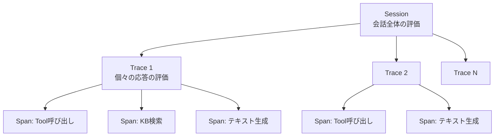
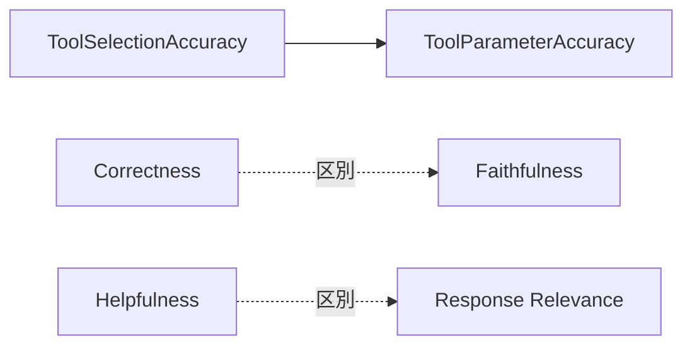
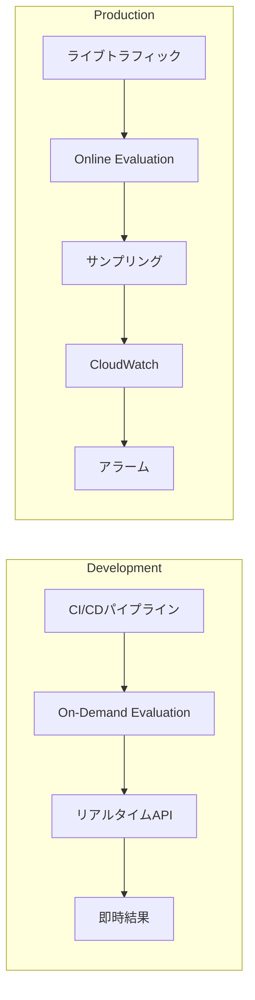

## ブログ概要（Summary）

本記事は [AWS公式ブログ](https://aws.amazon.com/blogs/machine-learning/build-reliable-ai-agents-with-amazon-bedrock-agentcore-evaluations/) の解説記事です。

Amazon Bedrock AgentCore Evaluationsは2026年3月にGA（一般提供）となったAIエージェント評価の完全マネージドサービスである。AWSは本ブログにおいて、Session・Trace・Spanの3レベル階層評価、13の組み込みエバリュエータ、オンライン評価とオンデマンド評価の2つの運用モード、そしてLLM-as-a-Judge・Ground Truth・Custom Codeの3種類のスコアリングメカニズムを体系的に解説している。開発段階のCI/CDパイプラインから本番環境の継続的モニタリングまで、エージェントのライフサイクル全体をカバーする評価基盤として設計されている。

この記事は [Zenn記事: Opus 5.5×Bedrock AgentCoreで社内ITヘルプデスクのツール選択精度を評価し誤呼び出しを削減する](https://zenn.dev/0h_n0/articles/b518ad76e25fcd) の深掘りです。

## 情報源

- **種別**: 企業テックブログ（AWS Machine Learning Blog）
- **URL**: [https://aws.amazon.com/blogs/machine-learning/build-reliable-ai-agents-with-amazon-bedrock-agentcore-evaluations/](https://aws.amazon.com/blogs/machine-learning/build-reliable-ai-agents-with-amazon-bedrock-agentcore-evaluations/)
- **組織**: Amazon Web Services
- **発表日**: 2026年（AgentCore Evaluations GA: 2026年3月）

## 技術的背景（Technical Background）

### なぜエージェント品質の体系的評価が必要か

AIエージェントは単一のプロンプト応答と異なり、ツール選択・パラメータ生成・複数ステップの推論チェーンを経て最終結果を生成する。AWSは公式ブログにおいて、このマルチステップ構造が評価を困難にする要因として以下の点を挙げている。

- **障害の局在化が難しい**: 最終結果が不正確であっても、ツール選択の誤りなのか、パラメータの誤りなのか、応答合成の誤りなのかを切り分けるには各ステップの個別評価が必要である
- **品質の多次元性**: 正確性だけでなく、有用性、一貫性、簡潔性、有害性など複数の品質軸を同時に評価する必要がある
- **本番環境でのドリフト検知**: 開発時に良好だった品質が、本番トラフィックの多様性により劣化する可能性があり、継続的なモニタリングが必要である

従来はこれらの評価を個別にスクリプトで構築する必要があったが、AgentCore Evaluationsはこれを統合的なマネージドサービスとして提供している。

## 実装アーキテクチャ（Architecture）

### 3レベル階層評価

AWSは、エージェントの動作を3つの粒度で評価する階層構造を導入している。



**Session（セッション）**: ユーザーとの会話全体を対象とする。複数のやり取りを通じてユーザーの目標が達成されたかを評価する。GoalSuccessRateエバリュエータが対応する。

**Trace（トレース）**: セッション内の個々のリクエスト-レスポンスペアを対象とする。1回の応答の品質を11のエバリュエータで多面的に評価する。

**Span（スパン）**: トレース内の個別操作（ツール呼び出し、ナレッジベース検索、テキスト生成）を対象とする。ToolSelectionAccuracyとToolParameterAccuracyの2つのエバリュエータが対応する。

AWSはこの階層をOpenTelemetryの Generative AI Semantic Conventionsに基づいて実装しており、Strands AgentsやLangGraph、OpenInference計装との互換性を持つと説明している。

### 13の組み込みエバリュエータ

公式ブログでは13のエバリュエータが以下のように分類されている。

| レベル | エバリュエータ | 評価内容 |
|--------|---------------|----------|
| Session | GoalSuccessRate | 会話全体でユーザーの目標が達成されたか |
| Trace | Helpfulness | ユーザーの目標達成への進捗度 |
| Trace | Correctness | 事実としての正確性 |
| Trace | Coherence | 応答内の推論に矛盾がないか |
| Trace | Conciseness | 冗長さなく簡潔に回答しているか |
| Trace | Faithfulness | 会話履歴・コンテキストとの一貫性 |
| Trace | Harmfulness | 有害なコンテンツを含んでいないか |
| Trace | Instruction Following | システムプロンプトの指示に従っているか |
| Trace | Response Relevance | 元の質問に対する応答の関連性 |
| Trace | Context Relevance | 検索されたコンテキスト情報の適切性 |
| Trace | Refusal | 不適切な拒否をしていないか |
| Trace | Stereotyping | ステレオタイプ的な表現を含んでいないか |
| Tool | ToolSelectionAccuracy | 正しいツールを選択したか |
| Tool | ToolParameterAccuracy | ツールに正しいパラメータを渡したか |

### エバリュエータ間の関係性

AWSは公式ブログにおいて、エバリュエータ間の関係性を明示的に解説している。

- **Correctness vs Faithfulness**: Correctnessは事実的正確性、Faithfulnessは会話履歴との一貫性を評価する。外部知識としては正しいがコンテキストに基づかない応答は、Correctness高・Faithfulness低となる
- **Helpfulness vs Response Relevance**: Helpfulnessはユーザー目標への進捗、Response Relevanceは元の質問への対応を評価する
- **ToolParameterAccuracy の依存関係**: ToolSelectionAccuracyに依存する。誤ったツール選択時にパラメータ評価は無意味である



### 3つのスコアリングメカニズム

#### 1. LLM-as-a-Judge

構造化ルーブリックに基づき、LLMがエージェントの出力を評価する。AWSによれば、ジャッジLLMはまず推論（reasoning）を生成し、その後にスコアを出力する構成となっている。組み込みエバリュエータは事前定義されたテンプレートと固定設定を使用し、評価の一貫性を確保している。

#### 2. Ground Truth

事前に定義された正解データセットとの比較による評価である。3種類の参照入力をサポートしている。

- **expected_response**: Correctnessエバリュエータ用の期待される応答
- **expected_trajectory**: ツール選択シーケンスの正解パス
- **assertions**: GoalSuccessRateのための目標達成条件

```python
from typing import TypedDict


class ReferenceInput(TypedDict):
    """Ground Truth評価用の正解データ構造。"""

    expected_response: str
    expected_trajectory: list[dict[str, str]]
    assertions: list[str]


reference_input: ReferenceInput = {
    "expected_response": "注文番号ORD-12345のステータスは「配送中」です",
    "expected_trajectory": [
        {"tool": "order_lookup", "parameters": {"order_id": "ORD-12345"}},
        {"tool": "status_check", "parameters": {"order_id": "ORD-12345"}},
    ],
    "assertions": ["エージェントは注文番号を正しく特定した"],
}
```

#### 3. Custom Code Evaluators

AWS Lambda関数として実装する決定論的スコアリングである。AWSは、データの厳密なバリデーション、フォーマット準拠チェック、ビジネスルールの検証に適すると説明している。LLM推論のコストの数分の一で実行可能であるため、高頻度の本番モニタリングに適している。

### オンライン評価 vs オンデマンド評価

AWSは2つの評価モードを提供しており、開発と本番で使い分ける設計となっている。



**Online Evaluation（本番環境向け）**: 本番トラフィックを設定可能な割合でサンプリングし、継続的に評価する。結果はCloudWatch専用ログループにJSON形式で格納され、ダッシュボードでメトリクスの傾向表示やセッション単位のドリルダウンが可能である。CloudWatchアラームと連携してスコア低下を検知できる。

**On-Demand Evaluation（開発環境向け）**: リアルタイムAPIとして提供され、CI/CDパイプラインに統合して回帰テストに使用する。1回の呼び出しで最大10評価を実行可能で、即座に結果が返される。

### Python SDKによる評価実装

AWSは2つのSDKインターフェースを提供している。

**EvaluationClient**: 既存のCloudWatchセッションに対して評価を実行する。セッションID、エージェントID、エバリュエータリスト、参照入力（省略可）を指定する。

**OnDemandEvaluationDatasetRunner**: テストデータセットに基づく自動評価を行う。エージェントを自動呼び出しし、セッションID管理と評価を一括実行する。

```python
from dataclasses import dataclass, field


@dataclass
class DatasetScenario:
    """On-Demand評価のテストシナリオ定義。"""

    scenario_id: str
    user_input: str
    expected_tools: list[str] = field(default_factory=list)
    assertions: list[str] = field(default_factory=list)


# ITヘルプデスクの評価データセット例
helpdesk_scenarios: list[DatasetScenario] = [
    DatasetScenario(
        scenario_id="password-reset-001",
        user_input="パスワードをリセットしたい",
        expected_tools=["user_lookup", "password_reset"],
        assertions=["パスワードリセットリンクを送信した"],
    ),
    DatasetScenario(
        scenario_id="vpn-setup-001",
        user_input="VPN接続ができない",
        expected_tools=["vpn_status_check", "vpn_config_reset"],
        assertions=["VPN接続の診断結果を提示した"],
    ),
]
```

### トラブルシューティングパターン

AWSは公式ブログにおいて、スコアパターンから根本原因を特定するアプローチを紹介している。全エバリュエータが低スコアの場合はContext Relevanceとシステムプロンプトの基盤的な問題を疑う。ToolSelectionAccuracy高・GoalSuccessRate低の場合はツール不足やマルチステップ連携の失敗を示唆する。Correctness高・Faithfulness低の場合はコンテキスト外の知識使用を意味し、RAG設定の見直しが必要である。

## Production Deployment Guide

### AWS実装パターン（コスト最適化重視）

AgentCore Evaluationsをプロダクション環境に導入する際のAWS構成パターンを示す。評価パイプラインの規模に応じた3段階の構成を提案する。

**Small (~100 req/日)**: Lambda + AgentCore構成。Lambda（512MB、タイムアウト120秒）でOn-Demand Evaluation APIを呼び出し、結果をDynamoDBに蓄積する。CloudWatch Dashboardで可視化。月額$60-180。CI/CDパイプライン統合やスポット評価に適する。

**Medium (~1,000 req/日)**: ECS Fargate + Online Evaluation構成。Online Evaluationのサンプリング率を10-20%に設定し、CloudWatchアラームで品質劣化を検知。月額$350-900。

**Large (10,000+ req/日)**: EKS + Custom Evaluators構成。Custom Code Evaluators（Lambda）を高頻度実行し、LLM-as-a-Judgeは5%サンプリングでコスト抑制。月額$2,000-5,500。

上記はAWS ap-northeast-1の2026年9月時点の概算値。組み込みエバリュエータはマネージドモデルクォータを使用し、顧客のBedrock割当とは分離されている。実際のコストはサンプリング率と評価頻度により変動する。

### Terraformインフラコード

**Small構成（Serverless）**:

```hcl
resource "aws_lambda_function" "evaluation_runner" {
  function_name = "agentcore-eval-runner"
  runtime       = "python3.12"
  handler       = "eval_handler.handler"
  memory_size   = 512
  timeout       = 120
  role          = aws_iam_role.eval_lambda.arn

  environment {
    variables = {
      DYNAMODB_TABLE = aws_dynamodb_table.eval_results.name
      EVAL_REGION    = "ap-northeast-1"
    }
  }
  tracing_config { mode = "Active" }
}

resource "aws_iam_role" "eval_lambda" {
  name               = "agentcore-eval-lambda-role"
  assume_role_policy  = jsonencode({
    Version = "2012-10-17"
    Statement = [{ Action = "sts:AssumeRole", Effect = "Allow",
      Principal = { Service = "lambda.amazonaws.com" } }]
  })
}

# IAMポリシー: bedrock:InvokeModel, dynamodb:PutItem/GetItem/Query,
# logs:CreateLogGroup/CreateLogStream/PutLogEvents を最小権限で付与

resource "aws_dynamodb_table" "eval_results" {
  name         = "agentcore-eval-results"
  billing_mode = "PAY_PER_REQUEST"
  hash_key     = "session_id"
  range_key    = "evaluator_name"

  attribute {
    name = "session_id"
    type = "S"
  }
  attribute {
    name = "evaluator_name"
    type = "S"
  }
  ttl {
    attribute_name = "expires_at"
    enabled        = true
  }
}
```

**Large構成（Container）**:

```hcl
module "eks" {
  source          = "terraform-aws-modules/eks/aws"
  version         = "~> 20.0"
  cluster_name    = "agentcore-eval-cluster"
  cluster_version = "1.31"
  vpc_id          = module.vpc.vpc_id
  subnet_ids      = module.vpc.private_subnets
}

resource "kubectl_manifest" "karpenter_nodepool" {
  yaml_body = yamlencode({
    apiVersion = "karpenter.sh/v1"
    kind       = "NodePool"
    metadata   = { name = "eval-worker-pool" }
    spec = {
      template = { spec = { requirements = [
        { key = "karpenter.sh/capacity-type", operator = "In",
          values = ["spot", "on-demand"] },
        { key = "node.kubernetes.io/instance-type", operator = "In",
          values = ["m7i.large", "m7i.xlarge"] }
      ] } }
      limits     = { cpu = "64", memory = "256Gi" }
      disruption = { consolidationPolicy = "WhenEmptyOrUnderutilized" }
    }
  })
}

# SQSキュー: On-Demand評価リクエストのバッファリング
# AWS Budgets: 月$3,000超過で80%閾値アラート（SNS通知）
```

### 運用・監視設定

**CloudWatch Logs Insights**: AgentCore Evaluationsの結果ログからスコア傾向を分析する。

```
fields @timestamp, evaluator_name, score, reasoning
| filter evaluator_name IN ["ToolSelectionAccuracy", "ToolParameterAccuracy", "GoalSuccessRate"]
| stats avg(score) as avg_score, min(score) as min_score, count(*) as eval_count
  by evaluator_name, bin(1h)
| sort evaluator_name, @timestamp
```

**CloudWatch アラーム設定**:

```python
import boto3


def create_eval_score_alarm(
    evaluator_name: str, threshold: float, sns_topic_arn: str
) -> dict:
    """エバリュエータのスコア低下を検知するCloudWatchアラームを作成する。

    Args:
        evaluator_name: 監視対象のエバリュエータ名
        threshold: アラーム発火の閾値（0.0-1.0）
        sns_topic_arn: 通知先のSNSトピックARN

    Returns:
        put_metric_alarmのレスポンス
    """
    cw = boto3.client("cloudwatch", region_name="ap-northeast-1")
    return cw.put_metric_alarm(
        AlarmName=f"agentcore-eval-{evaluator_name}-low-score",
        MetricName=f"EvalScore_{evaluator_name}",
        Namespace="AgentCore/Evaluations",
        Statistic="Average",
        Period=3600,
        EvaluationPeriods=3,
        Threshold=threshold,
        ComparisonOperator="LessThanThreshold",
        AlarmActions=[sns_topic_arn],
        TreatMissingData="notBreaching",
    )
```

**X-Rayトレーシング**: `aws_xray_sdk`の`patch_all()`でboto3を自動計装し、`@xray_recorder.capture("agentcore_evaluation")`で評価呼び出しをキャプチャする。`session_id`と`evaluator_count`をアノテーションとして記録し、評価レイテンシの可視化とボトルネック特定に活用する。

### コスト最適化チェックリスト

**アーキテクチャ選択**:
- [ ] 評価頻度でServerless/Container構成を判断
- [ ] CI/CDのみの場合はOn-Demand Evaluation（Lambda）で十分
- [ ] 本番モニタリングはOnline Evaluationのサンプリング率で制御

**リソース最適化**:
- [ ] EKSではSpot Instances優先（最大90%削減）
- [ ] Reserved Instances: 1年コミットで最大72%削減
- [ ] Savings Plans検討（Compute Savings Plans）
- [ ] Lambda: メモリサイズを512MB-1024MBで最適化
- [ ] ECS/EKS: 評価バッチ完了後にスケールダウン

**LLMコスト削減**:
- [ ] Custom Code Evaluators（Lambda）でLLM-as-a-Judge呼び出しを削減
- [ ] Online Evaluationのサンプリング率を5-10%に設定
- [ ] 高頻度評価にはバイナリ（0/1）Custom Evaluatorを使用
- [ ] Cross-Region Inferenceを活用してコンピュート最適化

**監視・アラート**:
- [ ] AWS Budgets設定（月次予算アラート）
- [ ] CloudWatch アラーム（スコア低下検知）
- [ ] Cost Anomaly Detection有効化
- [ ] 日次コストレポート（SNS通知）

**リソース管理**:
- [ ] 未使用のOnline Evaluation設定を削除
- [ ] タグ戦略（`environment`, `agent_id`, `evaluation_type`）
- [ ] DynamoDB TTLで古い評価結果を自動削除
- [ ] CloudWatch Logsの保持期間を30-90日に設定

## パフォーマンス最適化（Performance）

### サンプリング率とコストのトレードオフ

Online Evaluationのサンプリング率はコストと品質検知のトレードオフを決定する。初期導入時は100%でベースラインを構築し、安定稼働後は10-20%に下げ、大規模環境では1-5%（統計的有意性に注意）とする段階的な運用が考えられる。

Custom Code Evaluators（Lambda）はLLM推論コストの数分の一で実行可能であるとAWSは説明している。フォーマットチェック等の決定論的評価をCustom Evaluatorに移行することで、LLM-as-a-Judgeの呼び出し回数を削減できる。

On-Demand Evaluationは1回の呼び出しで最大10評価に制限されている。大量のテストケースにはSQSキューによるバッファリングとLambdaの並列実行で対応する。Online Evaluationは非同期実行のため、エージェントの応答レイテンシには影響しない。

## 運用での学び（Production Lessons）

### Evidence-Driven Development

AWSはベースライン設定、A/Bテストの統計的実施、カテゴリ別に最低10回の反復試行を推奨している。「最低10回」はLLM-as-a-Judgeの非決定性に起因する。同一入力でもスコアにばらつきが生じるため、十分なサンプル数が必要である。Custom Evaluatorsのtemperatureを低く設定することで決定性を向上できるとAWSは説明している。

### Multi-Dimensional Assessment

AWSは早期の成功基準定義とワークフロー各ステップの独立評価を推奨している。たとえばITヘルプデスクではToolSelectionAccuracyとGoalSuccessRateを同時追跡し、「ツール選択は正しいが目標未達」のパターンからツール不足や連携不良を特定できる。

### Continuous Measurement

CloudWatchアラームによるスコアドリフト検知と、エッジケース発見時のテストデータセット更新が推奨されている。プロンプト変更やモデル更新のたびにOn-Demand評価で回帰テストを実行し、Online評価で本番品質をモニタリングする二重の防御線が推奨されている。

## 学術研究との関連（Academic Connection）

AgentCore EvaluationsのLLM-as-a-Judgeアプローチは、MT-Bench（Zheng et al., 2023）等の研究に端を発する評価パラダイムである。LLMが他のLLMの出力を構造化ルーブリックで評価するこの手法は、人手評価のスケーラビリティ限界を克服する方法として広く研究されている。OpenTelemetry Generative AI Semantic Conventionsへの準拠により、ベンダー非依存の計装基盤を活用したフレームワーク間のポータビリティを実現している。

## まとめと実践への示唆

AgentCore Evaluationsの最大の価値は、3レベル階層評価によって「どこで品質が劣化しているか」を特定可能にした点にある。ToolSelectionAccuracyとGoalSuccessRateを組み合わせることで、ツール選択の精度と最終的なタスク完遂を分離して評価できる設計は、社内ITヘルプデスクのようなツール呼び出しが多いエージェントの品質改善に有用である。Online EvaluationとOn-Demand Evaluationの併用により、開発時の回帰テストと本番環境の継続的モニタリングを統合的に運用することが可能となる。

## 参考文献

- **Blog URL**: [https://aws.amazon.com/blogs/machine-learning/build-reliable-ai-agents-with-amazon-bedrock-agentcore-evaluations/](https://aws.amazon.com/blogs/machine-learning/build-reliable-ai-agents-with-amazon-bedrock-agentcore-evaluations/)
- **AgentCore Docs**: [https://docs.aws.amazon.com/bedrock/latest/userguide/agentcore.html](https://docs.aws.amazon.com/bedrock/latest/userguide/agentcore.html)
- **MT-Bench**: Zheng et al., 2023 ([arXiv:2306.05685](https://arxiv.org/abs/2306.05685))
- **OpenTelemetry GenAI Semantic Conventions**: [https://opentelemetry.io/docs/specs/semconv/gen-ai/](https://opentelemetry.io/docs/specs/semconv/gen-ai/)
- **Related Zenn article**: [https://zenn.dev/0h_n0/articles/b518ad76e25fcd](https://zenn.dev/0h_n0/articles/b518ad76e25fcd)
