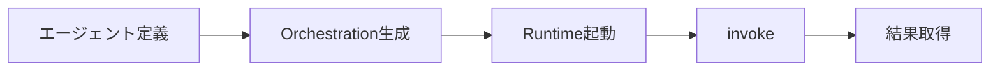
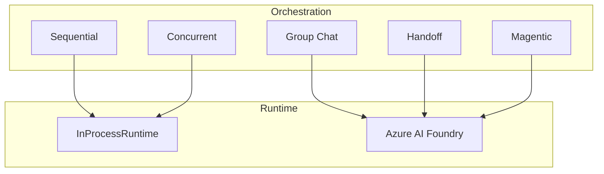
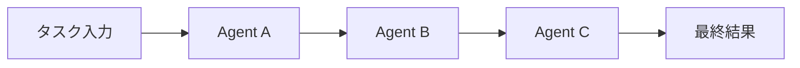
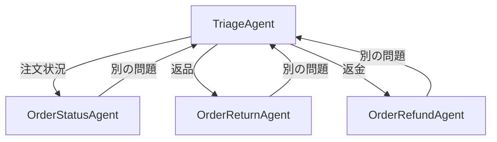
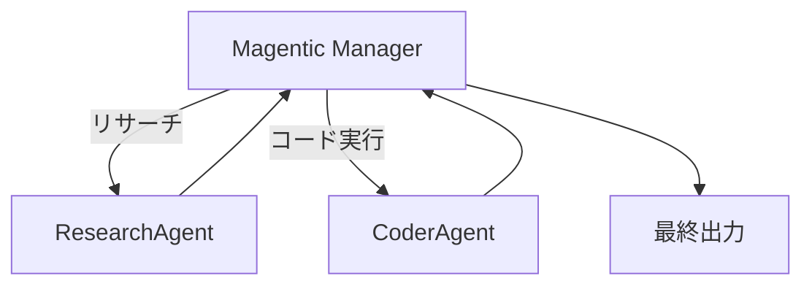

## ブログ概要（Summary）

本記事は [Microsoft Agent FrameworkチームのDevBlog記事](https://devblogs.microsoft.com/agent-framework/semantic-kernel-multi-agent-orchestration/) の解説記事です。

Microsoft Agent FrameworkチームのTao ChenとChris Rickmanが2025年5月に公開した本ブログは、Semantic Kernelにおけるマルチエージェントオーケストレーションの5パターン（Sequential、Concurrent、Group Chat、Handoff、Magentic）を解説している。全パターンが統一されたAPI設計を共有し、パターン切り替え時にエージェントロジックの書き換えが不要である点が最大の特徴である。Orchestration + Runtimeの2コンポーネントアーキテクチャにより、単一プロセス実行からAzure AI Foundryでの分散実行までスケール可能な設計となっている。

この記事は [Zenn記事: Semantic Kernel 5大オーケストレーションパターンをPython×C#で実装比較する](https://zenn.dev/0h_n0/articles/a27bae62608bfd) の深掘りです。

## 情報源

- **種別**: 企業テックブログ（Microsoft Agent Framework DevBlog）
- **URL**: [https://devblogs.microsoft.com/agent-framework/semantic-kernel-multi-agent-orchestration/](https://devblogs.microsoft.com/agent-framework/semantic-kernel-multi-agent-orchestration/)
- **組織**: Microsoft（Agent Framework team）
- **著者**: Tao Chen（Senior Software Engineer）、Chris Rickman（Principal Software Engineer）
- **発表日**: 2025年5月27日

## 技術的背景（Technical Background）

### Semantic KernelからMicrosoft Agent Framework 1.0への進化

Semantic Kernelは元来、LLMアプリケーション開発のためのSDKとして設計され、プラグイン、プランナー、メモリ、コネクタといった機能を提供してきた。一方、Microsoft Researchが開発したAutoGenは、マルチエージェント会話のフレームワークとして独自の進化を遂げていた。

2025年4月、Microsoftはこれらを統合し**Microsoft Agent Framework 1.0 GA**として公開した。Semantic Kernelの基盤機能の上にAutoGenから着想を得たオーケストレーション機構を組み合わせた構成であり、GitHub上では27,000以上のスターを獲得している。

### Experimentalステージの位置づけ

2026年現在、オーケストレーション機能はexperimentalステージにある。Microsoftは全ドキュメントで「may change significantly before advancing to the preview or release candidate stage」と明記しており、APIの安定性は保証されていない。

## 実装アーキテクチャ（Architecture）

### 統一API設計 -- パターン非依存のインターフェース

Microsoftが本ブログで最も強調しているのは、5パターンすべてが統一されたインターフェースを共有する設計思想である。開発者が行う手順は以下の5ステップに統一される。

1. エージェントと能力の定義
2. オーケストレーションの作成（エージェントとマネージャーの指定）
3. コールバックやトランスフォームの設定（任意）
4. ランタイムの起動とオーケストレーションの実行
5. 結果の非同期取得



パターン切り替えはオーケストレーションオブジェクトの変更のみで完了し、エージェント定義やランタイム管理のコードは再利用可能である。

```python
# パターン切り替えはここだけ変更
orchestration = SequentialOrchestration(members=[agent_a, agent_b])
# or ConcurrentOrchestration, GroupChatOrchestration,
# HandoffOrchestration, MagenticOrchestration

# 以下は全パターン共通
runtime = InProcessRuntime()
runtime.start()
result = await orchestration.invoke(task="Your task here", runtime=runtime)
final_output = await result.get()
await runtime.stop_when_idle()
```

### Orchestration + Runtime 2コンポーネントアーキテクチャ

**Orchestration（協調ロジック）**: エージェント間の協調パターンを定義する。どのエージェントが、どの順序で、どの条件でタスクを処理するかを規定する。

**Runtime（実行基盤）**: エージェントの実行を管理する。2つの実装が提供されている。

- **InProcessRuntime**: 単一プロセス内でエージェントを実行。開発・テスト環境に適する
- **Azure AI Foundry**: 分散実行環境。スケールトゥゼロ対応でプロダクション向け



### 5パターンの技術的詳細

#### 1. Sequential Orchestration（順次パイプライン）

エージェントをパイプラインとして直列に接続し、前のエージェントの出力が次の入力となる。



**主要クラス**: `SequentialOrchestration` / **用途**: 文書レビュー、データ処理パイプライン、多段推論

`ResponseCallback`（C#）/ `agent_response_callback`（Python）で中間出力を観測可能。各エージェントの順序がパイプラインの処理フローを決定する。

#### 2. Concurrent Orchestration（並行実行）

同一タスクを複数エージェントが独立して並行処理し、結果はリストとして集約される。

**主要クラス**: `ConcurrentOrchestration` / **用途**: アンサンブル推論、並列分析、投票システム

結果の順序は保証されない（非決定的）。C#では`OrchestrationResult<string[]>`、Pythonではリストとして複数結果を返却する。

#### 3. Group Chat Orchestration（グループチャット）

複数エージェントが協調的な会話を行い、マネージャーが発言順序を制御する。

**主要クラス**: `GroupChatOrchestration`, `RoundRobinGroupChatManager`, `GroupChatManager`

**マネージャーのメソッド呼び出し順序**（Microsoftが公式に規定）:

1. `ShouldRequestUserInput` -- 人間の入力が必要か判定
2. `ShouldTerminate` -- 会話を終了すべきか判定
3. `FilterResults` -- 終了時のみ、結果のサマリ/フィルタリング
4. `SelectNextAgent` -- 未終了時、次の発言者を選択

`GroupChatManager`を継承して4つの抽象メソッドをオーバーライドすることで、AIベースの発言者選択や動的終了条件を実装できる。

#### 4. Handoff Orchestration（委譲・引き継ぎ）

エージェント間でコンテキストに基づいて制御を転送する。カスタマーサポートのルーティングシナリオに最適化されている。



**主要クラス**: `HandoffOrchestration`, `OrchestrationHandoffs`

`OrchestrationHandoffs`で委譲先と条件を宣言的に定義する。双方向委譲が可能で、`human_response_function`（Python）/ `InteractiveCallback`（C#）によるHuman-in-the-Loop対応を備える。

```python
handoffs = (
    OrchestrationHandoffs()
    .add_many(
        source_agent=support_agent.name,
        target_agents={
            refund_agent.name: "返金関連の場合に転送",
            order_status_agent.name: "注文状況確認の場合に転送",
        },
    )
    .add(source_agent=refund_agent.name,
         target_agent=support_agent.name,
         description="返金以外の問題の場合に転送")
)
```

#### 5. Magentic Orchestration（動的マネージャー型）

AutoGenの[MagenticOne](https://www.microsoft.com/research/articles/magentic-one-a-generalist-multi-agent-system-for-solving-complex-tasks/)に着想を得た汎用パターン。専任マネージャーがタスク分解、進捗管理、最終回答の合成を動的に行う。



**主要クラス**: `MagenticOrchestration`, `StandardMagenticManager`

Group Chatとの本質的な違いは、マネージャーが**タスクの計画立案、進捗追跡、エージェント選択を自律的に判断**する点にある。`StandardMagenticManager`は構造化出力をサポートするLLMモデル（例: o3-mini）を必要とし、`MaximumInvocationCount`で反復上限を制御する。

### 5パターンの選択指針

| パターン | 適用場面 | 制御の主体 | 結果の形式 |
|----------|----------|-----------|-----------|
| Sequential | 段階的な処理パイプライン | 定義済みの順序 | 最終エージェントの単一出力 |
| Concurrent | 独立した並行分析 | なし（全員同時） | エージェント数分のリスト |
| Group Chat | 協調的な議論・合意形成 | Manager（発言順序） | Managerが集約した出力 |
| Handoff | 動的なルーティング | エージェント自身 | 最終担当エージェントの出力 |
| Magentic | 複雑・未知のタスク | Manager（計画・進捗） | Managerが合成した最終回答 |

## Production Deployment Guide

### AWS実装パターン（コスト最適化重視）

Semantic Kernelのオーケストレーションをプロダクション環境で運用する際のAWS構成パターンを示す。InProcessRuntimeを前提とした構成である。

**Small (~100 req/日)**: Lambda + Bedrock構成。Lambda（1024MB、タイムアウト300秒）+ Amazon Bedrock + DynamoDB（エージェント状態管理）。月額$80-200。Sequential/Concurrentに適する。

**Medium (~1,000 req/日)**: ECS Fargate構成。Fargate + ALB + ElastiCache Redis（エージェント間状態共有）。月額$400-1,000。Handoff/Group Chatのステートフル会話向け。

**Large (10,000+ req/日)**: EKS + Spot構成。EKS + Karpenter + MSK（エージェント間メッセージング）+ Bedrock Batch API。月額$2,500-6,000。Magneticの動的協調向け。

上記はAWS ap-northeast-1の2026年9月時点の概算値。Bedrockのトークン使用量がコストの大部分を占める。

### Terraformインフラコード

**Small構成（Serverless）**:

```hcl
resource "aws_lambda_function" "orchestration" {
  function_name = "sk-orchestration"
  runtime       = "python3.12"
  handler       = "main.handler"
  memory_size   = 1024
  timeout       = 300
  role          = aws_iam_role.orchestration_lambda.arn

  environment {
    variables = {
      ORCHESTRATION_PATTERN = "sequential"
      DYNAMODB_TABLE        = aws_dynamodb_table.agent_state.name
    }
  }
  tracing_config { mode = "Active" }
}

resource "aws_dynamodb_table" "agent_state" {
  name         = "sk-agent-state"
  billing_mode = "PAY_PER_REQUEST"
  hash_key     = "session_id"
  range_key    = "agent_name"

  attribute {
    name = "session_id"
    type = "S"
  }
  attribute {
    name = "agent_name"
    type = "S"
  }
  ttl {
    attribute_name = "expires_at"
    enabled        = true
  }
}
```

**Large構成（Container）**:

```hcl
module "eks" {
  source          = "terraform-aws-modules/eks/aws"
  version         = "~> 20.0"
  cluster_name    = "sk-orchestration-cluster"
  cluster_version = "1.30"
  vpc_id          = module.vpc.vpc_id
  subnet_ids      = module.vpc.private_subnets
}

resource "kubectl_manifest" "karpenter_nodepool" {
  yaml_body = yamlencode({
    apiVersion = "karpenter.sh/v1"
    kind       = "NodePool"
    metadata   = { name = "orchestration-pool" }
    spec = {
      template = {
        spec = {
          requirements = [
            { key = "karpenter.sh/capacity-type", operator = "In",
              values = ["spot", "on-demand"] },
            { key = "node.kubernetes.io/instance-type", operator = "In",
              values = ["m5.xlarge", "m5.2xlarge"] }
          ]
        }
      }
      limits     = { cpu = "100", memory = "400Gi" }
      disruption = { consolidationPolicy = "WhenEmptyOrUnderutilized" }
    }
  })
}
```

### 運用・監視設定

**CloudWatch Logs Insights**: エージェント実行パフォーマンス分析

```
fields @timestamp, agent_name, orchestration_pattern, duration_ms
| filter level = "INFO" and event = "agent_invocation_complete"
| stats avg(duration_ms), max(duration_ms), sum(token_count)
  by orchestration_pattern, agent_name
| sort avg(duration_ms) desc
```

**X-Ray トレーシング**: マルチエージェント実行の可視化。`aws_xray_sdk`で`orchestration_invoke`をキャプチャし、`pattern`アノテーションと`agent_count`を記録する。

### コスト最適化チェックリスト

- [ ] トラフィック量でServerless/Container構成を判断
- [ ] Sequential/ConcurrentはステートレスでLambda活用
- [ ] EKSではSpot Instances優先（最大90%削減）
- [ ] Bedrock Batch APIで非リアルタイム処理を50%削減
- [ ] Prompt Caching有効化（共通プロンプト部分をキャッシュ）
- [ ] `MaximumInvocationCount`でエージェント反復上限設定
- [ ] AWS Budgets + Cost Anomaly Detectionでスパイク検知
- [ ] タグ戦略（`orchestration_pattern`, `environment`）

## パフォーマンス最適化（Performance）

### パターン別のレイテンシ・コスト特性

| パターン | レイテンシ算出式 | トークンコスト傾向 |
|----------|-----------------|-------------------|
| Sequential | $\sum_{i=1}^{n} t_i$ （線形増加） | エージェント数 $\times$ 平均トークン |
| Concurrent | $\max(t_1, \ldots, t_n)$ （最遅に律速） | エージェント数 $\times$ 入力トークン |
| Group Chat | $\sum_{r=1}^{R} t_r$ （ラウンド数比例） | ラウンド数 $\times$ 全発言の累積 |
| Handoff | $\sum_{k \in path} t_k$ （パス長依存） | 委譲回数に依存（変動大） |
| Magentic | $\sum_{j=1}^{M} t_j$ （反復回数依存） | マネージャー + 全エージェント累積 |

Sequentialでは中間出力が長くなるとトークンコストが累積するため、各エージェントに「出力は200語以内」のような制約を設けることが有効である。Concurrentではレイテンシが最遅エージェントに律速されるため、処理時間のばらつきの最小化が重要である。

## 運用での学び（Production Lessons）

### Experimentalステージのリスクと対策

APIの破壊的変更リスクに対しては、バージョン固定とファサードパターンによる抽象化が推奨される。

```python
class OrchestrationFacade:
    """API変更に対する防御層"""
    async def run(self, task: str, pattern: str, agents: list) -> str:
        orchestration = self._create_orchestration(pattern, agents)
        runtime = InProcessRuntime()
        runtime.start()
        try:
            result = await orchestration.invoke(task=task, runtime=runtime)
            return await result.get(timeout=120)
        finally:
            await runtime.stop_when_idle()
```

C#ではprereleaseパッケージの明示的追加が必要である。`dotnet add package Microsoft.SemanticKernel.Agents.Orchestration --prerelease`の`--prerelease`フラグは、experimentalステージの反映である。

### エージェントタイプの柔軟性

全パターンにおいて`ChatCompletionAgent`以外のエージェントタイプも使用可能である。Magneticパターンのサンプルでは、ResearchAgentに`ChatCompletionAgent`（gpt-4o-search-preview）、CoderAgentに`AzureAIAgent`（Code Interpreter付き）/ `OpenAIAssistantAgent`を組み合わせており、異種エージェントの混在が設計上推奨されている。

## 学術研究との関連（Academic Connection）

MagenticパターンはMicrosoft Researchの[MagenticOne](https://www.microsoft.com/research/articles/magentic-one-a-generalist-multi-agent-system-for-solving-complex-tasks/)に基づく。MagenticOneはWebSurfer、FileSurfer等の専門エージェントをOrchestratorが動的に協調させる汎用マルチエージェントシステムである。ただしMicrosoftは、Semantic KernelのMagenticオーケストレーションはMagenticOneの**設計哲学を継承**したものであり、MagenticOneのエージェント群をそのまま含むわけではないと明言している。

また、Microsoftは[Azure Architecture Center](https://learn.microsoft.com/en-us/azure/architecture/ai-ml/guide/ai-agent-design-patterns)にてオーケストレーションパターンを技術非依存の設計パターンとして体系化している。Semantic Kernelの5パターンはこのアーキテクチャガイドの直接的な実装であり、パターン選択基準の詳細は同ガイドが提供している。

## まとめと実践への示唆

Microsoft Agent Frameworkチームが提示した5つのオーケストレーションパターンの最大の価値は、**統一API設計**によるパターン切り替えの容易さにある。`SequentialOrchestration`を`ConcurrentOrchestration`に変更するだけでパイプライン処理を並行処理に切り替えられる設計は、プロトタイピングから本番運用への移行を加速する。

実践にあたっては、experimentalステージのAPI不安定性を前提としたファサードパターンの採用、パターン別のレイテンシ・コスト特性を踏まえた選択、そしてInProcessRuntimeからAzure AI Foundryへの段階的スケールアップ戦略を推奨する。HandoffのHuman-in-the-Loop対応とMagenticのStandardMagenticManagerは、従来のDAG型ワークフローでは困難だった動的協調を実現する点で注目に値する。

## 参考文献

- **Blog URL**: [https://devblogs.microsoft.com/agent-framework/semantic-kernel-multi-agent-orchestration/](https://devblogs.microsoft.com/agent-framework/semantic-kernel-multi-agent-orchestration/)
- **Official Docs**: [https://learn.microsoft.com/en-us/semantic-kernel/frameworks/agent/agent-orchestration/](https://learn.microsoft.com/en-us/semantic-kernel/frameworks/agent/agent-orchestration/)
- **MagenticOne Research**: [https://www.microsoft.com/research/articles/magentic-one-a-generalist-multi-agent-system-for-solving-complex-tasks/](https://www.microsoft.com/research/articles/magentic-one-a-generalist-multi-agent-system-for-solving-complex-tasks/)
- **Azure AI Agent Design Patterns**: [https://learn.microsoft.com/en-us/azure/architecture/ai-ml/guide/ai-agent-design-patterns](https://learn.microsoft.com/en-us/azure/architecture/ai-ml/guide/ai-agent-design-patterns)
- **GitHub**: [https://github.com/microsoft/semantic-kernel](https://github.com/microsoft/semantic-kernel)
- **Related Zenn article**: [https://zenn.dev/0h_n0/articles/a27bae62608bfd](https://zenn.dev/0h_n0/articles/a27bae62608bfd)
