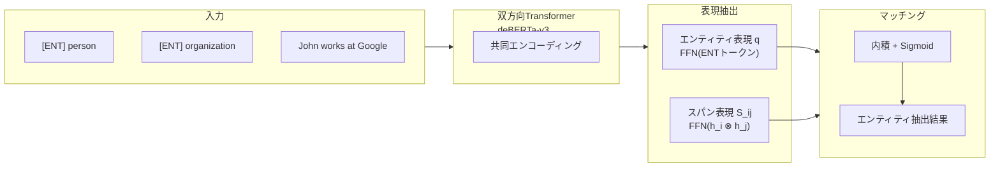

本記事は [GLiNER: Generalist Model for Named Entity Recognition using Bidirectional Transformer (arXiv:2311.08526)](https://arxiv.org/abs/2311.08526) の解説記事です。

## 論文概要（Abstract）

固有表現認識（NER）はNLPの基盤タスクであるが、従来のNERモデルは事前定義されたエンティティタイプに限定される。LLMは自然言語指示で任意のエンティティを抽出できるが、モデルサイズとAPIコストが実運用の障壁となる。著者らは双方向Transformerエンコーダを用いたコンパクトなNERモデル「GLiNER」を提案し、並列的なエンティティ抽出を実現した。ゼロショット評価において、ChatGPTおよびファインチューニング済みLLMの両方を上回る性能を報告している。

この記事は [Zenn記事: Neo4jグラフメモリとLLMエンティティ抽出で社内Slack履歴の長期記憶検索を実装する](https://zenn.dev/0h_n0/articles/6cc75e77364d51) の深掘りです。

## 情報源

- **arXiv ID**: 2311.08526
- **URL**: [https://arxiv.org/abs/2311.08526](https://arxiv.org/abs/2311.08526)
- **著者**: Urchade Zaratiana, Nadi Tomeh, Pierre Holat, Thierry Charnois
- **発表年**: 2023
- **分野**: cs.CL, cs.AI, cs.LG
- **コード**: [https://github.com/urchade/GLiNER](https://github.com/urchade/GLiNER)（Apache-2.0ライセンス、GitHub Stars 3.9k以上）

## 背景と動機（Background & Motivation）

NERは情報抽出、質問応答、知識グラフ構築など多くのNLPタスクの基盤を成す。従来のNERモデルはBiLSTM-CRFやBERTベースのシーケンスラベリングとして実装されるが、訓練時に定義されたエンティティタイプ（人名、組織名、地名など）しか認識できない。新しいドメインや新しいエンティティタイプへの適用には、アノテーション済みデータセットの再構築とモデルの再訓練が必要となる。

ChatGPTやUniNERなどのLLMベースのアプローチは、自然言語指示により任意のエンティティタイプを抽出できる柔軟性を持つ。しかし、これらのモデルは7B-13Bパラメータ規模であり、GPUメモリ要件が大きい。加えて、LLMの自己回帰的なトークン生成はシーケンシャルに処理されるため、推論速度がボトルネックとなる。API経由のChatGPTはリクエスト単位の課金となり、大量のテキスト処理ではコストが膨大になる。

著者らは、双方向Transformerエンコーダの特性を活かし、LLMの柔軟性（任意のエンティティタイプ対応）とコンパクトモデルの効率性（並列処理、低リソース）を両立するアプローチを提案している。

## 主要な貢献（Key Contributions）

- **貢献1**: 任意のエンティティタイプをゼロショットで認識できるコンパクトNERモデル「GLiNER」の提案。最大300Mパラメータで、13B規模のLLMと同等以上の性能を達成
- **貢献2**: エンティティタイプとテキストスパンを同一ベクトル空間に埋め込み、内積による高速なマッチングを実現するアーキテクチャの設計
- **貢献3**: 44,889パッセージ・240Kエンティティスパン・13Kエンティティタイプを含む大規模訓練データセット「Pile-NER」の構築
- **貢献4**: Flat NERおよびNested NER両方に対応するデコーディングアルゴリズムの設計

## 技術的詳細（Technical Details）

### アーキテクチャ

GLiNERのアーキテクチャは、エンティティタイプ表現、テキストスパン表現、マッチングの3つのコンポーネントから構成される。



#### エンティティタイプ表現

エンティティタイプは自然言語のラベル（例: "person", "organization"）として表現される。各エンティティタイプの前に特殊トークン`[ENT]`を挿入し、テキストトークンと連結してTransformerエンコーダに入力する。エンコーダの出力のうち`[ENT]`トークンの位置に対応するベクトルを抽出し、2層のフィードフォワードネットワーク（FFN）で変換してエンティティ表現 $\mathbf{q} = \{\mathbf{q}_t\}_{t=1}^{M} \in \mathbb{R}^{M \times D}$ を得る。

ここで、$M$ はエンティティタイプの数、$D$ は隠れ層の次元数（論文では768）である。

#### テキストスパン表現

位置 $i$ から位置 $j$ までのテキストスパンの表現は、スパンの開始トークンと終了トークンの隠れベクトルを連結し、FFNで変換して得る。

$$
\mathbf{S}_{ij} = \mathrm{FFN}(\mathbf{h}_i \oplus \mathbf{h}_j)
$$

ここで、
- $\mathbf{h}_i$: Transformerエンコーダの $i$ 番目の位置の出力ベクトル（$\in \mathbb{R}^D$）
- $\mathbf{h}_j$: Transformerエンコーダの $j$ 番目の位置の出力ベクトル（$\in \mathbb{R}^D$）
- $\oplus$: ベクトルの連結（concatenation）
- $\mathrm{FFN}$: 2層のフィードフォワードネットワーク（入力 $2D$、出力 $D$）

計算量を制御するため、スパンの最大長は $K=12$ トークンに制限されている。これにより候補スパン数は $O(nK)$ となり、文長 $n$ に対して線形となる。

#### マッチングスコア

スパン表現 $\mathbf{S}_{ij}$ とエンティティタイプ表現 $\mathbf{q}_t$ の互換性は、内積とSigmoid関数で計算される。

$$
\phi(i, j, t) = \sigma(\mathbf{S}_{ij}^{\top} \cdot \mathbf{q}_t)
$$

ここで、
- $\phi(i, j, t)$: スパン $(i, j)$ がエンティティタイプ $t$ に該当する確率
- $\sigma$: Sigmoid関数（$\sigma(x) = 1 / (1 + e^{-x})$）

$\phi > 0.5$ のスパンがエンティティ候補として抽出される。

### 損失関数

訓練にはバイナリ交差エントロピー損失を使用する。

$$
\mathcal{L}_{\mathrm{BCE}} = -\sum_{s \in \mathcal{P} \cup \mathcal{N}} \left[ \mathbb{1}_{s \in \mathcal{P}} \log \phi(s) + \mathbb{1}_{s \in \mathcal{N}} \log(1 - \phi(s)) \right]
$$

ここで、
- $\mathcal{P}$: 正例集合（アノテーションされたエンティティスパンとそのタイプのペア）
- $\mathcal{N}$: 負例集合（エンティティでないスパン、または誤ったタイプとのペア）
- $\mathbb{1}_{s \in \mathcal{P}}$: $s$ が正例であれば1、そうでなければ0の指示関数
- $\phi(s)$: スパン $s$ のマッチングスコア

### デコーディングアルゴリズム

推論時にはスコアが閾値（0.5）を超えるスパン-エンティティペアを候補として取得し、スコア降順でソートする。

**Flat NER**: スパンの重複を許容しない。スコアの高い候補から順に採用し、既に採用されたスパンと重複する候補は棄却する（Greedy non-overlapping selection）。計算量はソート後 $O(n \log n)$。

**Nested NER**: 完全に包含される入れ子構造は許容するが、部分的な重複は禁止する。例えば「New York City」と「New York」は入れ子として許容されるが、「New York」と「York City」は部分重複のため同時には採用されない。

```python
from dataclasses import dataclass


@dataclass
class Entity:
    """抽出されたエンティティを表す。

    Attributes:
        start: スパン開始位置
        end: スパン終了位置
        label: エンティティタイプ
        score: マッチングスコア
    """
    start: int
    end: int
    label: str
    score: float


def decode_flat_ner(
    candidates: list[Entity],
    threshold: float = 0.5,
) -> list[Entity]:
    """Flat NER用のGreedyデコーディング。

    スコア降順で候補を走査し、既存エンティティと
    重複しない候補のみ採用する。

    Args:
        candidates: スコア付きエンティティ候補のリスト
        threshold: 採用閾値

    Returns:
        重複のないエンティティリスト
    """
    filtered = [c for c in candidates if c.score > threshold]
    sorted_candidates = sorted(filtered, key=lambda x: -x.score)

    selected: list[Entity] = []
    for candidate in sorted_candidates:
        if not any(
            _overlaps(candidate, existing)
            for existing in selected
        ):
            selected.append(candidate)
    return selected


def _overlaps(a: Entity, b: Entity) -> bool:
    """2つのスパンが重複するか判定する。"""
    return a.start < b.end and b.start < a.end
```

### 訓練データ: Pile-NER

著者らはGPT-4を用いてThe Pile（大規模テキストコーパス）からエンティティアノテーションを自動生成し、Pile-NERデータセットを構築している。

- **パッセージ数**: 44,889
- **エンティティスパン数**: 約240,000
- **エンティティタイプ数**: 約13,000
- **特徴**: 従来のNERデータセットが数十タイプに限定されるのに対し、13Kタイプという多様性がゼロショット汎化の鍵となっている

### 訓練時の正則化

著者らは以下の3つの正則化手法を報告している。

1. **負例エンティティサンプリング（50%）**: 入力に含まれないエンティティタイプをランダムに追加し、モデルが「該当なし」を学習できるようにする
2. **エンティティタイプ順序のシャッフル**: エンティティタイプの入力順序をランダム化し、順序への依存を防ぐ
3. **ランダムエンティティドロッピング**: 一部のエンティティタイプを入力から除外し、モデルの頑健性を向上させる

## 実装のポイント（Implementation）

### バックボーンの選択

著者らはdeBERTa-v3を推奨バックボーンとしている。ELECTRAやALBERTも適切であると報告されているが、BERTやRoBERTaでは性能が劣る。これはdeBERTa-v3のDisentangled Attention機構がスパン境界の位置情報を効果的に捉えるためと考えられる。

### モデルサイズと訓練コスト

| モデル | パラメータ数 | バックボーン | 訓練時間 |
|--------|-------------|-------------|---------|
| GLiNER-S | 50M | deBERTa-v3-small | 約2時間 |
| GLiNER-M | 90M | deBERTa-v3-base | 約3.5時間 |
| GLiNER-L | 300M | deBERTa-v3-large | 約5時間 |

訓練はA100 GPU 1枚で実行可能であり、AdamWオプティマイザ（事前訓練層: 学習率1e-5、非事前訓練層: 5e-5）、30Kステップ、10%ウォームアップ、コサイン減衰スケジュールが使用されている。ドロップアウト率は0.4、非事前訓練層の隠れ次元は768である。

### 推論時の注意点

- 訓練時にエンティティタイプ数は最大25に制限される。推論時に大量のエンティティタイプを指定する場合はバッチ分割が必要
- スパン最大長 $K=12$ は英語テキストにおける大多数のエンティティをカバーするが、日本語など単語分割粒度が異なる言語では調整が必要な場合がある
- 現在のGLiNERライブラリ（`pip install gliner`）では、HuggingFace上の事前訓練済みモデルを直接ロード可能

```python
from gliner import GLiNER

# モデルのロード（HuggingFaceから自動ダウンロード）
model = GLiNER.from_pretrained("gliner-community/gliner_large-v2.5")

# 推論
text = "Elon Musk founded SpaceX in Hawthorne, California."
labels = ["person", "organization", "location"]

entities = model.predict_entities(text, labels=labels, threshold=0.5)
for entity in entities:
    print(f"{entity['text']} => {entity['label']} ({entity['score']:.2f})")
# Elon Musk => person (0.98)
# SpaceX => organization (0.95)
# Hawthorne, California => location (0.91)
```

## Production Deployment Guide

GLiNERはコンパクトなモデルサイズ（50M-300M）でCPU実行にも対応するため、プロダクション環境への導入障壁が低い。以下ではAWS上での実装パターンを構成規模別に解説する。

### AWS実装パターン（コスト最適化重視）

**トラフィック量別の推奨構成**:

| 構成 | トラフィック | アーキテクチャ | 月額コスト概算 |
|------|------------|---------------|---------------|
| Small | ~100 req/日 | Lambda + ECR | $30-80 |
| Medium | ~1,000 req/日 | ECS Fargate + ALB | $200-500 |
| Large | 10,000+ req/日 | EKS + GPU Spot Instances | $1,500-4,000 |

**Small構成（~100 req/日）**:
- **AWS Lambda**: GLiNER-S（50M）をコンテナイメージとしてデプロイ。CPU推論で1リクエストあたり約200-500msのレイテンシ。メモリ2048MB、タイムアウト30秒
- **Amazon ECR**: モデル含むコンテナイメージを格納。GLiNER-Sのイメージサイズは約1.5GB
- **API Gateway**: REST APIエンドポイント。スロットリングとAPI Key認証
- **DynamoDB**: 抽出結果のキャッシュ。同一テキスト・同一ラベルの再抽出を回避
- **月額内訳**: Lambda $5-15 + ECR $1-3 + API Gateway $3-10 + DynamoDB $5-15 + データ転送 $5-10

**Medium構成（~1,000 req/日）**:
- **ECS Fargate**: GLiNER-M（90M）を常時起動。vCPU 1、メモリ4GB。タスク数2（冗長性確保）
- **Application Load Balancer**: ヘルスチェック付きロードバランシング
- **ElastiCache（Redis）**: 推論結果キャッシュ。cache.t3.micro（$12/月）
- **月額内訳**: Fargate $80-160 + ALB $25 + ElastiCache $12 + CloudWatch $10-20 + データ転送 $10-30

**Large構成（10,000+ req/日）**:
- **EKS**: GLiNER-L（300M）をGPU付きノードで実行。g5.xlarge（NVIDIA A10G）をSpot Instancesで利用
- **Karpenter**: GPU需要に応じた自動スケーリング。Spot優先でOn-Demand fallback
- **SageMaker Endpoint**（代替案）: リアルタイム推論エンドポイントとしてml.g5.xlargeを使用。自動スケーリングとA/Bテスト対応
- **月額内訳**: EKS コントロールプレーン $74 + Spot g5.xlarge $300-600/台 + ALB $25 + データ転送 $50-100

**コスト削減テクニック**:
- **Spot Instances**: g5.xlargeのSpot価格はOn-Demandの約60-70%引き。GLiNERの推論はステートレスなためSpot中断時の再試行が容易
- **推論キャッシュ**: 同一テキスト・同一ラベルセットの結果をキャッシュすることで推論リクエスト数を削減（キャッシュヒット率が高い場合、コストを50%以上削減可能）
- **バッチ推論**: 複数テキストをまとめて推論することでGPU利用効率を向上。GLiNERはバッチ推論に対応
- **モデルサイズ選択**: 精度要件に応じてGLiNER-S/M/Lを選択。SとLでF1差は約6ポイント（論文Table 1より）だが、コストは数倍異なる

**コスト試算の注意事項**: 上記はAWS ap-northeast-1（東京）リージョンの2026年9月時点の概算値である。実際のコストはトラフィックパターン、リージョン、バースト使用量により変動する。最新料金は[AWS料金計算ツール](https://calculator.aws/)で確認を推奨する。

### Terraformインフラコード

#### Small構成（Serverless: Lambda + ECR）

```hcl
# GLiNER NER API - Small構成（Serverless）
# 月額 $30-80 / ~100 req/日

terraform {
  required_version = ">= 1.9"
  required_providers {
    aws = {
      source  = "hashicorp/aws"
      version = "~> 5.70"
    }
  }
}

provider "aws" {
  region = "ap-northeast-1"
}

# --- ECR リポジトリ ---
resource "aws_ecr_repository" "gliner" {
  name                 = "gliner-ner-api"
  image_tag_mutability = "IMMUTABLE"
  force_delete         = false

  image_scanning_configuration {
    scan_on_push = true  # セキュリティスキャン有効化
  }

  encryption_configuration {
    encryption_type = "KMS"  # KMS暗号化
  }
}

# --- IAMロール（最小権限） ---
resource "aws_iam_role" "lambda_exec" {
  name = "gliner-lambda-exec"
  assume_role_policy = jsonencode({
    Version = "2012-10-17"
    Statement = [{
      Action = "sts:AssumeRole"
      Effect = "Allow"
      Principal = { Service = "lambda.amazonaws.com" }
    }]
  })
}

resource "aws_iam_role_policy" "lambda_policy" {
  name = "gliner-lambda-policy"
  role = aws_iam_role.lambda_exec.id
  policy = jsonencode({
    Version = "2012-10-17"
    Statement = [
      {
        Effect = "Allow"
        Action = [
          "logs:CreateLogGroup",
          "logs:CreateLogStream",
          "logs:PutLogEvents"
        ]
        Resource = "arn:aws:logs:*:*:*"
      },
      {
        Effect   = "Allow"
        Action   = ["dynamodb:GetItem", "dynamodb:PutItem"]
        Resource = aws_dynamodb_table.cache.arn
      }
    ]
  })
}

# --- Lambda関数 ---
resource "aws_lambda_function" "gliner" {
  function_name = "gliner-ner-api"
  package_type  = "Image"
  image_uri     = "${aws_ecr_repository.gliner.repository_url}:latest"
  role          = aws_iam_role.lambda_exec.arn
  timeout       = 30
  memory_size   = 2048  # GLiNER-Sに必要な最小メモリ

  environment {
    variables = {
      MODEL_NAME    = "gliner-community/gliner_small-v2.5"
      CACHE_TABLE   = aws_dynamodb_table.cache.name
      THRESHOLD     = "0.5"
    }
  }
}

# --- DynamoDB（推論キャッシュ） ---
resource "aws_dynamodb_table" "cache" {
  name         = "gliner-cache"
  billing_mode = "PAY_PER_REQUEST"  # On-Demand（低トラフィック向け）
  hash_key     = "cache_key"

  attribute {
    name = "cache_key"
    type = "S"
  }

  ttl {
    attribute_name = "expires_at"
    enabled        = true  # TTLで古いキャッシュを自動削除
  }

  server_side_encryption {
    enabled = true  # KMS暗号化
  }
}

# --- CloudWatchアラーム ---
resource "aws_cloudwatch_metric_alarm" "lambda_errors" {
  alarm_name          = "gliner-lambda-error-rate"
  comparison_operator = "GreaterThanThreshold"
  evaluation_periods  = 2
  metric_name         = "Errors"
  namespace           = "AWS/Lambda"
  period              = 300
  statistic           = "Sum"
  threshold           = 5
  alarm_description   = "Lambda error rate exceeded threshold"

  dimensions = {
    FunctionName = aws_lambda_function.gliner.function_name
  }
}
```

#### Large構成（Container: EKS + Karpenter + Spot）

```hcl
# GLiNER NER API - Large構成（EKS + GPU Spot）
# 月額 $1,500-4,000 / 10,000+ req/日

# --- EKSクラスタ ---
module "eks" {
  source  = "terraform-aws-modules/eks/aws"
  version = "~> 20.24"

  cluster_name    = "gliner-production"
  cluster_version = "1.31"

  vpc_id     = module.vpc.vpc_id
  subnet_ids = module.vpc.private_subnets

  cluster_endpoint_public_access = false  # プライベートアクセスのみ

  # Karpenter用IAM
  enable_cluster_creator_admin_permissions = true
}

# --- Karpenter（Spot優先の自動スケーリング） ---
resource "kubectl_manifest" "karpenter_nodepool" {
  yaml_body = yamlencode({
    apiVersion = "karpenter.sh/v1"
    kind       = "NodePool"
    metadata   = { name = "gliner-gpu" }
    spec = {
      template = {
        spec = {
          requirements = [
            {
              key      = "karpenter.sh/capacity-type"
              operator = "In"
              values   = ["spot", "on-demand"]  # Spot優先
            },
            {
              key      = "node.kubernetes.io/instance-type"
              operator = "In"
              values   = ["g5.xlarge", "g5.2xlarge"]
            }
          ]
          nodeClassRef = {
            group = "karpenter.k8s.aws"
            kind  = "EC2NodeClass"
            name  = "default"
          }
        }
      }
      limits = {
        cpu    = "32"
        memory = "128Gi"
      }
      disruption = {
        consolidationPolicy = "WhenEmptyOrUnderutilized"
        consolidateAfter    = "30s"
      }
    }
  })
}

# --- Secrets Manager ---
resource "aws_secretsmanager_secret" "gliner_config" {
  name = "gliner/production/config"

  tags = {
    Environment = "production"
    Service     = "gliner-ner"
  }
}

# --- AWS Budgets ---
resource "aws_budgets_budget" "gliner" {
  name         = "gliner-monthly-budget"
  budget_type  = "COST"
  limit_amount = "5000"
  limit_unit   = "USD"
  time_unit    = "MONTHLY"

  notification {
    comparison_operator       = "GREATER_THAN"
    threshold                 = 80
    threshold_type            = "PERCENTAGE"
    notification_type         = "ACTUAL"
    subscriber_email_addresses = ["ops@example.com"]
  }
}
```

### 運用・監視設定

**CloudWatch Logs Insights クエリ**:

```
# GLiNER推論レイテンシ分析（P95, P99）
fields @timestamp, @duration, @memoryUsed
| filter @type = "REPORT"
| stats
    avg(@duration) as avg_ms,
    pct(@duration, 95) as p95_ms,
    pct(@duration, 99) as p99_ms,
    max(@memoryUsed / 1048576) as max_memory_mb
  by bin(1h)
| sort @timestamp desc
```

**CloudWatchアラーム設定（Python）**:

```python
import boto3


def setup_gliner_alarms(function_name: str, sns_topic_arn: str) -> None:
    """GLiNER Lambda用のCloudWatchアラームを設定する。

    Args:
        function_name: Lambda関数名
        sns_topic_arn: 通知先SNSトピックARN
    """
    cw = boto3.client("cloudwatch")

    # 推論レイテンシアラーム（P95 > 5秒）
    cw.put_metric_alarm(
        AlarmName=f"{function_name}-high-latency",
        MetricName="Duration",
        Namespace="AWS/Lambda",
        Statistic="p95",
        Period=300,
        EvaluationPeriods=2,
        Threshold=5000,
        ComparisonOperator="GreaterThanThreshold",
        Dimensions=[{"Name": "FunctionName", "Value": function_name}],
        AlarmActions=[sns_topic_arn],
    )

    # メモリ使用率アラーム（> 90%）
    cw.put_metric_alarm(
        AlarmName=f"{function_name}-memory-pressure",
        MetricName="MemoryUtilization",
        Namespace="AWS/Lambda",
        Statistic="Maximum",
        Period=300,
        EvaluationPeriods=1,
        Threshold=90,
        ComparisonOperator="GreaterThanThreshold",
        Dimensions=[{"Name": "FunctionName", "Value": function_name}],
        AlarmActions=[sns_topic_arn],
    )
```

**X-Rayトレーシング設定（Python）**:

```python
from aws_xray_sdk.core import xray_recorder, patch_all


# boto3等の自動計装
patch_all()


@xray_recorder.capture("gliner_predict")
def predict_entities(
    text: str,
    labels: list[str],
    model_name: str = "gliner_small-v2.5",
) -> list[dict]:
    """GLiNER推論をX-Rayトレース付きで実行する。

    Args:
        text: 入力テキスト
        labels: エンティティタイプのリスト
        model_name: 使用モデル名

    Returns:
        抽出されたエンティティのリスト
    """
    subsegment = xray_recorder.current_subsegment()
    if subsegment:
        subsegment.put_annotation("model", model_name)
        subsegment.put_metadata("input_length", len(text))
        subsegment.put_metadata("label_count", len(labels))

    entities = model.predict_entities(text, labels=labels)

    if subsegment:
        subsegment.put_metadata("entity_count", len(entities))

    return entities
```

**Cost Explorer日次レポート（Python）**:

```python
import boto3
from datetime import datetime, timedelta


def get_daily_cost_report() -> dict:
    """GLiNER関連サービスの日次コストレポートを取得する。

    Returns:
        サービス別コスト辞書
    """
    ce = boto3.client("ce")
    today = datetime.utcnow().date()
    yesterday = today - timedelta(days=1)

    response = ce.get_cost_and_usage(
        TimePeriod={
            "Start": yesterday.isoformat(),
            "End": today.isoformat(),
        },
        Granularity="DAILY",
        Metrics=["UnblendedCost"],
        Filter={
            "Tags": {
                "Key": "Service",
                "Values": ["gliner-ner"],
            }
        },
        GroupBy=[{"Type": "DIMENSION", "Key": "SERVICE"}],
    )

    costs = {}
    for group in response["ResultsByTime"][0]["Groups"]:
        service = group["Keys"][0]
        amount = float(group["Metrics"]["UnblendedCost"]["Amount"])
        costs[service] = amount

    total = sum(costs.values())
    if total > 100:
        # $100/日超過でSNS通知
        sns = boto3.client("sns")
        sns.publish(
            TopicArn="arn:aws:sns:ap-northeast-1:ACCOUNT:cost-alert",
            Subject="GLiNER Cost Alert",
            Message=f"Daily cost exceeded $100: ${total:.2f}",
        )

    return costs
```

### コスト最適化チェックリスト

**アーキテクチャ選択**:
- [ ] トラフィック量に応じた構成選択（Small: Lambda / Medium: Fargate / Large: EKS）
- [ ] レイテンシ要件の確認（Lambda Cold Start vs 常時起動）
- [ ] モデルサイズの選択（GLiNER-S/M/L、精度とコストのトレードオフ）

**リソース最適化**:
- [ ] EC2/EKS: Spot Instances優先（GLiNERはステートレスなため中断耐性が高い）
- [ ] Reserved Instances: 1年コミットで最大40%削減
- [ ] Savings Plans: Compute Savings Plansで柔軟な割引
- [ ] Lambda: メモリサイズ最適化（Power Tuningツール活用）
- [ ] ECS/EKS: アイドル時のスケールダウン設定（Karpenter consolidation）

**推論コスト削減**:
- [ ] 推論結果キャッシュ（DynamoDB/ElastiCache）でリクエスト数削減
- [ ] バッチ推論の活用（複数テキストを1回のforwardパスで処理）
- [ ] CPU推論の検討（GLiNER-SはCPUで200-500ms、GPU不要な場合あり）
- [ ] ONNX Runtime変換による推論高速化

**監視・アラート**:
- [ ] AWS Budgets: 月額予算設定と80%/100%アラート
- [ ] CloudWatch: Lambda Duration/Errors/Throttlesのアラーム
- [ ] Cost Anomaly Detection: 異常コスト検知の有効化
- [ ] 日次コストレポート: Cost Explorer APIでサービス別集計

**リソース管理**:
- [ ] 未使用ECRイメージの定期削除（ライフサイクルポリシー）
- [ ] タグ戦略: Service/Environment/Costcenterタグの統一
- [ ] DynamoDBキャッシュのTTL設定（古いエントリの自動削除）
- [ ] 開発環境の夜間停止（EKSノード数を0にスケールダウン）
- [ ] CloudWatch Logsの保持期間設定（30日など）

## 実験結果（Results）

### ゼロショットNER（OODベンチマーク）

論文Table 1より、7つのドメイン外（OOD）データセットでの平均F1スコアを以下に示す。

| モデル | タイプ | パラメータ数 | 平均F1 |
|--------|--------|-------------|--------|
| ChatGPT | LLM (API) | — | 47.5 |
| InstructUIE | Fine-tuned LLM | 11B | 47.2 |
| UniNER-13B | Fine-tuned LLM | 13B | 55.6 |
| GoLLIE | Fine-tuned LLM | 7B | 58.0 |
| USM | Encoder model | 300M | 37.8 |
| **GLiNER-S** | **Encoder model** | **50M** | **54.8** |
| **GLiNER-M** | **Encoder model** | **90M** | **57.1** |
| **GLiNER-L** | **Encoder model** | **300M** | **60.9** |

GLiNER-Lは300Mパラメータで平均F1 60.9を達成し、13B規模のUniNERを5.3ポイント上回っている。パラメータ数はUniNER-13Bの約1/43である。GoLLIE（7B）に対しても2.9ポイント優位であり、ChatGPTとの差は13.4ポイントに達する。

### 20データセットでの評価

論文Table 2より、20のNERデータセットでの評価では、GLiNER-Lが13/20データセットでUniNERを上回る結果が報告されている。ただし、Twitter/Tweetデータセット（WNUT-17、TweetNER7など）ではUniNERに劣る結果となっている。著者らはこれを、Twitterの非形式的テキストがPile-NERの訓練データ分布から外れていることが原因と分析している。

### 多言語評価

論文Table 3より、GLiNER-Multi（多言語モデル）は10言語中8言語でChatGPTを上回る結果が報告されている。ただし、ベンガル語（F1: 0.89）など非ラテン文字言語ではほぼ機能していない。これは英語中心の訓練データに起因する制約である。

### 教師あり Fine-tuning

論文Table 4より、Pile-NERで事前訓練したGLiNER-LをCoNLL-2003で教師ありFine-tuningした場合、F1 82.9を達成している。UniNER-7B（F1: 84.8）には2.9ポイント劣るものの、InstructUIE（F1: 81.2）を1.7ポイント上回っている。パラメータ数が30倍以上小さいモデルで同等の精度を達成している点は注目に値する。

## 実運用への応用（Practical Applications）

### Zenn記事との関連

関連Zenn記事「Neo4jグラフメモリとLLMエンティティ抽出で社内Slack履歴の長期記憶検索を実装する」では、GLiNER+GLiRELの多段パイプラインによりSlackメッセージから人名・プロジェクト名・技術用語を自動抽出し、Neo4jのグラフ構造として永続化している。GLiNERはこのパイプラインの中核NERモジュールとして機能している。

### 実運用上のメリットと留意点

**メリット**:
- **低レイテンシ**: 双方向エンコーダによる並列抽出のため、LLMの自己回帰生成と比較して推論速度が高速。CPU上でも実用的な速度が得られる
- **柔軟なエンティティ定義**: ドメイン固有のエンティティタイプ（「プロジェクト名」「技術スタック」「障害イベント」など）をラベルとして指定するだけで抽出可能。再訓練不要
- **コスト効率**: API課金不要。オンプレミスまたはクラウドのCPU/GPUインスタンスで自前運用可能

**留意点**:
- 非形式的テキスト（Slackの口語表現、略語、絵文字混じり文）では精度が低下する可能性がある（論文のTwitterデータセットでの結果より）
- 日本語テキストではスパン最大長 $K=12$ の調整や、日本語対応の多言語モデルの使用が推奨される
- スパン最大長を超えるエンティティ（長い組織名など）は検出できない制約がある

## 関連研究（Related Work）

- **UniNER** (Zhou et al., 2023): LLaMA-7B/13Bをインストラクションチューニングした汎用NERモデル。大規模なインストラクションデータセットで訓練されており、特にTwitter系のデータセットで高い性能を示す。GLiNERはパラメータ数1/43で同等以上のOOD性能を達成している点で差別化される
- **GoLLIE** (Sainz et al., 2023): Code-LLaMA-7Bをベースに、コード生成形式でIE（情報抽出）タスクを解くアプローチ。スキーマをPythonクラスとして定義する独自のインターフェースを持つ。GLiNER-LはGoLLIEを2.9ポイント上回るOOD F1を達成
- **InstructUIE** (Wang et al., 2023): Flan-T5-XXL（11B）をベースに、統一的なインストラクション形式で複数のIEタスクを解くモデル。NER・RE・EE等を単一モデルで処理できるが、ゼロショットNER性能ではGLiNER-Lに13.7ポイント劣る
- **SpanNER** (Fu et al., 2021): スパンベースのNERアプローチ。GLiNERのスパン表現はこの系譜に位置づけられるが、エンティティタイプを自然言語ラベルとして動的に入力できる点が根本的に異なる

## まとめと今後の展望

GLiNERは、双方向Transformerエンコーダを用いてエンティティタイプとテキストスパンを同一ベクトル空間にマッピングし、内積ベースのマッチングにより任意のエンティティタイプをゼロショットで認識するコンパクトNERモデルである。300Mパラメータで13B規模のLLMを上回るゼロショットNER性能を達成しており、計算コストと性能のトレードオフにおいて優れたバランスを示している。

一方、非ラテン文字言語での性能や非形式的テキストへの対応には課題が残る。GitHub上のGLiNERライブラリ（Stars 3.9k+）ではv2.5系モデルが公開されており、多言語対応やPII検出など論文以降の拡張が進んでいる。実運用においてはモデルサイズ・精度・レイテンシのトレードオフを考慮し、用途に適したモデルバリアントを選択することが重要である。

## 参考文献

- **arXiv**: [https://arxiv.org/abs/2311.08526](https://arxiv.org/abs/2311.08526)
- **Code**: [https://github.com/urchade/GLiNER](https://github.com/urchade/GLiNER)
- **Related Zenn article**: [https://zenn.dev/0h_n0/articles/6cc75e77364d51](https://zenn.dev/0h_n0/articles/6cc75e77364d51)
