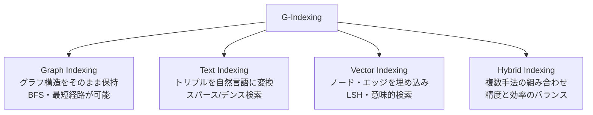
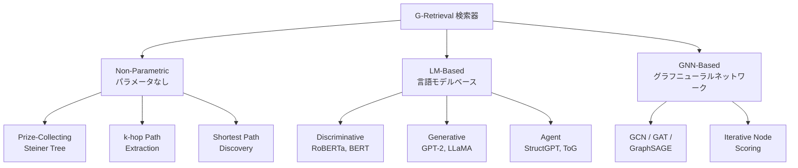
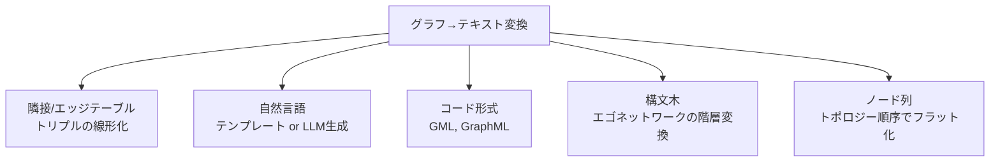

本記事は [Graph Retrieval-Augmented Generation: A Survey (arXiv:2408.08921)](https://arxiv.org/abs/2408.08921) の解説記事です。

## 論文概要（Abstract）

著者らは、グラフ構造を活用したRetrieval-Augmented Generation（RAG）の包括的サーベイを提示している。従来のRAGがフラットなテキストチャンクに依存するのに対し、GraphRAGはエンティティ間の構造的関係を利用することで、より精密で文脈に即した検索と生成を実現するアプローチである。本サーベイでは、GraphRAGのワークフローをGraph-Based Indexing（G-Indexing）、Graph-Guided Retrieval（G-Retrieval）、Graph-Enhanced Generation（G-Generation）の3段階に体系化し、各段階の手法を分類・比較している。下流タスク、評価ベンチマーク、産業実装についても網羅的に整理されている。

この記事は [Zenn記事: Neo4jグラフメモリとLLMエンティティ抽出で社内Slack履歴の長期記憶検索を実装する](https://zenn.dev/0h_n0/articles/6cc75e77364d51) の深掘りです。

## 情報源

- **arXiv ID**: 2408.08921
- **URL**: [https://arxiv.org/abs/2408.08921](https://arxiv.org/abs/2408.08921)
- **著者**: Boci Peng, Yun Zhu, Yongchao Liu, Xiaohe Bo, Haizhou Shi, Chuntao Hong, Yan Zhang, Siliang Tang
- **発表年**: 2024（v2: 2024年9月10日改訂）
- **分野**: cs.AI, cs.CL, cs.IR
- **DOI**: [10.48550/arXiv.2408.08921](https://doi.org/10.48550/arXiv.2408.08921)

## 背景と動機（Background & Motivation）

大規模言語モデル（LLM）は、知識の陳腐化（knowledge cutoff）やハルシネーション（幻覚生成）といった本質的な課題を抱えている。この問題に対し、外部知識を検索して生成に組み込むRAGが広く採用されてきた。しかし、従来のRAGはテキストをチャンク単位でベクトル化し、コサイン類似度で検索する方式が主流であり、エンティティ間の関係性や文書横断的な構造情報を十分に活用できないという限界がある。

例えば「AとBの関係は何か」のようなマルチホップ推論を要する質問では、関連する情報が複数のチャンクに分散しており、単一チャンクの検索では回答に必要な文脈が欠落する。また、特定のドメイン（バイオメディカル、法律、eコマースなど）では、エンティティ間の構造的関係そのものが回答の鍵となる場合が多い。

著者らは、こうした限界を克服するためにグラフ構造をRAGパイプラインに統合するGraphRAGが急速に発展していると指摘し、このサーベイによって分野の体系的な整理を行っている。

## 主要な貢献（Key Contributions）

- **貢献1**: GraphRAGのワークフローをG-Indexing、G-Retrieval、G-Generationの3段階に分解する統一的フレームワークを提示
- **貢献2**: 各段階の手法を体系的に分類し、グラフデータソース、インデキシング手法、検索パラダイム、生成手法の分類体系（taxonomy）を構築
- **貢献3**: 下流タスク（質問応答、情報検索、リンク予測、対話システム、推薦など）ごとの適用状況を網羅的に整理
- **貢献4**: 評価ベンチマーク、産業実装、および今後の研究課題を包括的にまとめている

## 技術的詳細（Technical Details）

### GraphRAGの数学的定式化

著者らは、GraphRAGの全体目的を以下のように定式化している。あるクエリ $q$ とグラフ $\mathcal{G}$ が与えられたとき、応答 $a$ の生成確率を次のように分解する（論文 Eq.4）:

$$
p(a \mid q, \mathcal{G}) \approx p_\phi(a \mid q, G^*) \times p_\theta(G^* \mid q, \mathcal{G})
$$

ここで $p_\theta(G^* \mid q, \mathcal{G})$ はグラフ検索器（retriever）、$p_\phi(a \mid q, G^*)$ は応答生成器（generator）を表す。検索段階では、最適な部分グラフ $G^*$ を以下のように選択する（論文 Eq.5）:

$$
G^* = \arg\max_{G \subseteq \mathcal{R}(\mathcal{G})} \text{Sim}(q, G)
$$

$\mathcal{R}(\mathcal{G})$ は候補部分グラフの集合、$\text{Sim}$ は類似度関数（コサイン類似度、クロスエンコーダスコア、Personalized PageRankなど）を表す。生成段階では、グラフをテキストに変換する関数 $\mathcal{F}$ を介して応答を生成する（論文 Eq.6）:

$$
a^* = \arg\max_{a \in A} p_\phi(a \mid \mathcal{F}(q, G^*))
$$

### Graph-Based Indexing（G-Indexing）

G-Indexingは、入力データからグラフ構造を構築し、検索可能な形式でインデキシングする段階である。

#### グラフデータソース

著者らは、GraphRAGで使用されるグラフを2種類に大別している。

1. **既存のナレッジグラフ（Open Knowledge Graphs）**: Wikidata、Freebase、DBpedia、YAGO、ConceptNet、ATOMICなどの汎用KGと、CMeKG（バイオメディカル）、CPubMed-KG（医学）などのドメイン特化KGがある
2. **自己構築グラフ（Self-Constructed Graphs）**: 入力テキストからLLMやNERモデルを使ってエンティティと関係を抽出し、タスク固有のグラフを構築する。文書グラフ（共引用・共トピック関係）、ナレッジグラフ（エンティティ-関係トリプル）、異種文書グラフなどがある

#### インデキシング手法

- **Graph Indexing**: グラフ構造をそのまま保持し、BFS（幅優先探索）や最短経路アルゴリズムによる構造ベースの検索を可能にする
- **Text Indexing**: トリプル（主語-述語-目的語）をテンプレートで自然言語文に変換し、スパース検索（BM25）やデンス検索（DPR）に適用する
- **Vector Indexing**: ノードやエッジをベクトル埋め込みに変換し、LSH（Locality Sensitive Hashing）や意味的類似度検索を行う
- **Hybrid Indexing**: 上記の手法を組み合わせ、構造情報と意味情報を統合する。HybridRAGやEWEK-QAがこのアプローチを採用している

### Graph-Guided Retrieval（G-Retrieval）

G-Retrievalは、クエリに基づいてグラフから関連する部分構造を検索する段階である。著者らは、検索器の種類、検索パラダイム、検索粒度の3軸で体系化している。

#### 検索器の分類

**Non-Parametric（パラメータフリー）**な手法として、Prize-Collecting Steiner Tree（PCST）アルゴリズム、k-hopパス抽出、最短経路探索がある。これらは学習不要で、グラフのトポロジーに基づいてルールベースで検索する。

**LM-Based（言語モデルベース）**な手法は、判別型（RoBERTa、BERTによるパス・関係の選択）、生成型（GPT-2、LLaMAによる推論パスの生成）、エージェント型（StructGPT、ToGのようにLLMがツールとしてグラフ操作を行う）に分類される。

**GNN-Based**な手法は、GCN、GAT、GraphSAGEなどのメッセージパッシングアーキテクチャを用いてノードのスコアリングと選択を行う。EtDのように、LLMによるエッジ選択とGNNによる埋め込み精緻化を組み合わせたハイブリッド手法も報告されている。

#### 検索パラダイム

| パラダイム | 方式 | 特徴 | 代表手法 |
|-----------|------|------|----------|
| **Once Retrieval** | 単一パスの検索 | 低コスト、シンプル | 埋め込み類似度、ルールベース抽出 |
| **Iterative（Non-adaptive）** | 固定回数の反復検索 | 事前定義の拡張ルール | PullNet, KGP |
| **Iterative（Adaptive）** | モデル決定の停止条件付き反復 | 特殊トークン、ホップ予測、エージェント判断 | ToG |
| **Multi-Stage** | 粗検索+精緻化の多段階 | 非パラメトリック検索後にGNNで精緻化 | GNN-RAG, GenTKGQA |

#### 検索粒度

著者らは検索粒度を5段階に整理している:

- **ノード**: 個別エンティティの検索。計算コストが低い
- **トリプル**: 主語-述語-目的語のタプル。関係性の抽出に適する
- **パス**: エンティティ間の関係列。マルチホップ推論や因果連鎖の追跡に有効
- **サブグラフ**: 連結部分グラフやエゴネットワーク。包括的な文脈提供に適するが計算コストが高い
- **ハイブリッド**: 複数の粒度を組み合わせ、LLMエージェントが適切な粒度を動的に選択する

#### 検索の強化手法

**クエリ強化（Query Enhancement）**:
- *拡張*: エイリアス、意味的バリエーション、LLM生成の関係パスを追加
- *分解*: 複合クエリを個別の関係に焦点を当てたサブクエリに分解

**知識強化（Knowledge Enhancement）**:
- *マージ*: 複数のサブグラフからトリプルを集約し、エンティティを統合
- *プルーニング*: クロスエンコーダによるリランキング、類似度スコア閾値処理、Personalized PageRank、LLMフィルタリングで不要な情報を除去

### Graph-Enhanced Generation（G-Generation）

G-Generationは、検索された部分グラフを用いてLLMが応答を生成する段階である。

#### 生成器の選択

- **GNN（判別的タスク向け）**: GCN、GAT、GraphSAGE、Graph Transformerなどの古典的モデルに加え、双曲幾何GNN（HamQA）やPageRank重み付き集約など特殊化された手法がある
- **言語モデル**: エンコーダのみ（BERT、RoBERTa）は分類に、エンコーダ-デコーダ（T5）は判別・生成の両方に、デコーダのみ（GPT-4、LLaMA、Qwen2）はテキスト生成に使用される
- **ハイブリッドモデル**: カスケード型（GNNがグラフをエンコードし、LMが応答を生成、プロンプトチューニングのプレフィックスを介して接続）と並列型（GNN/LMの別々のエンコーディングをアテンションや連結で統合、GreaseLMやENGINEが該当）がある

#### グラフのテキスト変換手法

検索されたグラフ構造をLLMに入力するためのフォーマット変換（関数 $\mathcal{F}$）は、GraphRAGの設計上重要な選択である。著者らは以下の5つの方式を整理している:

1. **隣接/エッジテーブル**: トリプルを直接連結する方式。KG-GPTが採用。シンプルだが構造情報が失われやすい
2. **自然言語**: テンプレートベース（"Entity1 has relation Entity2"）またはLLMによる文脈考慮の要約生成。Microsoft GraphRAGのコミュニティサマリがこの方式を採用している
3. **コード形式**: GMLやGraphMLなど構造化されたグラフ記述言語。ノード・エッジ・属性の情報を保持できる
4. **構文木**: エゴネットワークを階層的に変換。GRAPHTEXTではトポロジカル順序とノード特徴量を保持する
5. **ノード列**: トポロジーに従ってノードをフラットに並べる。LM互換の最もシンプルな形式

#### 生成の強化

- **前処理（Pre-generation）**: クエリ拡張、グラフの再フォーマット、文脈の充実化
- **処理中（Mid-generation）**: グラフ制約付き反復デコーディング、グラフ上のビームサーチ
- **後処理（Post-generation）**: 検索サブグラフに対する回答の整合性検証

### 訓練戦略

著者らは、検索器と生成器の訓練戦略も体系化している:

- **Training-Free**: ヒューリスティックルール、テンプレートベースの抽出、事前定義アルゴリズム（検索器）。ICL（in-context learning）による少数ショットプロンプティング（生成器）
- **Training-Based**: 教師あり学習（対照学習、クロスエンコーダのファインチューニング）、強化学習（下流タスクの報酬信号）
- **Joint Optimization**: 検索器と生成器の端対端訓練。微分可能な検索コンポーネントを介して勾配が流れる

## 代表的システムの比較（Key Systems Comparison）

著者らが言及している代表的なGraphRAGシステムを以下にまとめる。

| システム | Indexing | Retrieval | Generation | 特徴 |
|---------|----------|-----------|------------|------|
| **Microsoft GraphRAG** | コミュニティ検出でドキュメントをグラフ化 | ローカル（エンティティ）+ グローバル（コミュニティサマリ）の二層検索 | LLMによるコミュニティサマリ生成 | クエリ焦点の要約に強い。グローバル文脈を保持 |
| **LightRAG** | 軽量なローカル+グローバルの二層インデキシング | コミュニティレベルの効率的な集約 | LLMベース | 大規模データでのスケーラビリティに優れる |
| **HippoRAG** | クエリ埋め込み空間での近傍探索 | 適応的停止条件付き近傍トラバーサル | LLMベース | クエリ固有のサブグラフ発見に特化 |
| **GRAG** | k-hopエゴネットワークの埋め込み | 類似度ベースの検索 | GNNエンコーディング | 構造情報のベクトル空間での保持 |
| **G-Retriever** | LMによるノード・エッジエンコーディング | 拡張PCSGアルゴリズム（エッジ価格付き） | LLMベース | 原理的なサブグラフ最適化 |
| **ToG** | 既存KGを使用 | LLMエージェントによるビームサーチ | LLMベース | エージェント判断による自律的なパス探索停止 |
| **GenTKGQA** | 既存KGを使用 | LLMが制約を推論し、マッチするトリプルを抽出 | LLMベース | 明示的な制約生成後に検索を実行 |

## 下流タスクと評価（Downstream Tasks & Evaluation）

### 下流タスク

著者らは、GraphRAGの適用先を以下のように分類している:

- **質問応答**: KBQA（ナレッジベース質問応答）、CSQA（常識推論質問応答）、マルチホップ推論
- **情報検索**: エンティティリンキング、関係抽出、事実検証
- **リンク予測**: ナレッジグラフの不完全なトリプルの補完
- **対話システム**: 知識グラウンデッドな対話生成
- **推薦システム**: グラフ構造を活用したアイテム推薦
- **クエリ焦点要約（QFS）**: 特定の質問に対するドキュメント集合の要約

### ドメイン適用

- **eコマース**: 商品推薦、属性抽出
- **バイオメディカル**: 薬物-疾患関連性、文献ベースの発見
- **学術**: 引用ネットワーク、論文推薦
- **法律**: 判例検索、先例マッチング
- **文学**: プロット要約、キャラクター関係分析

### 評価ベンチマークとメトリクス

主要なベンチマークとして、GR-Bench（5分野のドメインKG）、GraphQA（統一グラフ形式）、WebQSP（2-hop質問）、ComplexWebQuestions、LC-QuADなどが報告されている。

| 評価対象 | メトリクス |
|---------|----------|
| **生成品質（判別的）** | Exact Match (EM), F1, Accuracy |
| **生成品質（生成的）** | BLEU, ROUGE, METEOR |
| **検索品質** | Precision@k, Recall@k, MRR, Hit@k |
| **サブグラフ品質** | サブグラフカバレッジ指標 |

## 実装のポイント（Implementation Guidelines）

GraphRAGシステムを構築する際の実践的なガイドラインを、サーベイの知見から整理する。

**インデキシング段階**: 既存の高品質KG（Wikidata、ドメイン特化KG）が利用可能な場合はそれを優先し、自己構築が必要な場合はLLMによるエンティティ・関係抽出を採用する。Hybrid Indexingは精度と効率のバランスが良く、多くの実用シーンで推奨される。

**検索段階**: シンプルな質問にはOnce Retrieval、マルチホップ推論にはAdaptive Iterative Retrievalが適する。サブグラフ検索はコンテキストが豊富だが計算コストが高いため、プルーニング戦略（リランキング、PageRank、LLMフィルタリング）の併用が実用上重要である。

**生成段階**: グラフのテキスト変換方式の選択がLLMの応答品質に大きく影響する。自然言語変換はLLMとの親和性が高いが情報損失があり、コード形式は構造を保持するが冗長になる。タスクとモデルの特性に応じた選択が必要である。

**デプロイパターン**: 産業実装では、オフラインのインデキシング（時間単位）、オンラインの検索（ミリ秒単位）、生成（ストリーミングで秒単位）という非同期アーキテクチャが一般的であると報告されている。

## 実運用への応用 — Zenn記事との関連

[Zenn記事](https://zenn.dev/0h_n0/articles/6cc75e77364d51)では、Neo4jグラフデータベースとLLMによるエンティティ抽出を組み合わせ、社内Slack履歴の長期記憶検索を実装している。このアーキテクチャは、本サーベイの分類体系に照らすと以下のように位置づけられる:

- **G-Indexing**: LLMによるエンティティ抽出と関係抽出によるSelf-Constructed Graphに該当する。インデキシング手法はHybrid Indexing（ベクトルインデックスとグラフインデックスの併用）
- **G-Retrieval**: ベクトル検索とグラフトラバーサルを組み合わせたハイブリッド検索を採用しており、本サーベイのMulti-Stage Retrievalパラダイムに分類される。検索粒度としてはサブグラフレベルの取得を行っている
- **G-Generation**: 検索されたサブグラフ情報を自然言語に変換してLLMのプロンプトに統合しており、Graph Prompting（自然言語変換方式）に該当する

サーベイで報告されているKnowledge Enhancementの手法（プルーニング、リランキング）は、Zenn記事の検索結果の精度向上に応用可能であり、特にPersonalized PageRankによるノード重要度スコアリングは、Neo4jのGDS（Graph Data Science）ライブラリで直接利用できる手法として実践的な改善候補となる。

## 関連研究（Related Work）

- **Lewis et al. (2020)**: [Retrieval-Augmented Generation for Knowledge-Intensive NLP Tasks](https://arxiv.org/abs/2005.11401) - RAGの原論文。テキストベースの検索と生成の統合フレームワークを提示。GraphRAGはこのアプローチをグラフ構造に拡張したものとして位置づけられる
- **Edge et al. (2024)**: [From Local to Global: A Graph RAG Approach to Query-Focused Summarization](https://arxiv.org/abs/2404.16130) - Microsoft GraphRAGの提案論文。コミュニティ検出とLLMサマリ生成による二層検索アーキテクチャを導入
- **Guo et al. (2024)**: [LightRAG: Simple and Fast Retrieval-Augmented Generation](https://arxiv.org/abs/2410.05779) - 軽量なグラフベースRAGシステム。効率的なローカル+グローバル検索を実現
- **Gutierrez et al. (2024)**: [HippoRAG: Neurobiologically Inspired Long-Term Memory for Large Language Models](https://arxiv.org/abs/2405.14831) - 海馬の記憶メカニズムに着想を得たGraphRAGシステム。Personalized PageRankによる連想的検索を特徴とする

## 制約と限界（Limitations）

著者らは以下の課題を指摘している:

- **動的グラフへの対応**: 時系列的に変化するデータに対するGraphRAGの手法は限定的であり、リアルタイムのインクリメンタルインデキシングが未発達である
- **スケーラビリティ**: 候補サブグラフの数が指数的に増大するため、大規模グラフに対する効率的な近似手法が必要である
- **マルチモーダル対応**: 現状はテキスト中心であり、画像やテーブルなど他のモダリティの統合は初期段階にある
- **コンテキスト圧縮**: LLMの「lost in the middle」問題（長い入力の中間部分の情報が活用されにくい現象）は、グラフ情報のフォーマット変換においても依然として課題である
- **標準ベンチマークの不足**: ドメインごとに異なるベンチマークが使用されており、クロスドメインでの統一的な評価基盤が欠如している

## まとめと今後の展望（Summary & Future Directions）

本サーベイは、GraphRAGをG-Indexing、G-Retrieval、G-Generationの3段階フレームワークで体系的に整理し、各段階の手法を分類・比較した包括的な研究である。GraphRAGは、従来のフラットなテキストRAGでは対応困難なマルチホップ推論やエンティティ間の関係性把握において、グラフ構造の活用が有効であることを多数の研究が示している。

著者らが示す今後の研究方向として、以下が挙げられている:

- **Graph Foundation Modelsとの統合**: 統一的な事前学習によるグラフ理解の汎用化
- **ロスレスなコンテキスト圧縮**: グラフ情報をLLMに効率的に伝達する手法の開発
- **適応的ハイブリッド粒度選択**: クエリの複雑度に応じて検索粒度を動的に切り替える仕組み
- **マルチモーダルKGの構築**: テキスト以外のモダリティを含むナレッジグラフの自動構築
- **リアルタイムインクリメンタルインデキシング**: 動的なデータソースに対する逐次的なグラフ更新
