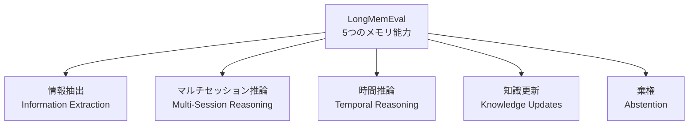
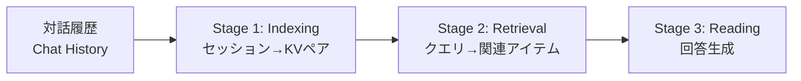

本記事は [LongMemEval: Benchmarking Chat Assistants on Long-Term Interactive Memory (arXiv:2410.10813)](https://arxiv.org/abs/2410.10813) の解説記事です。

## 論文概要（Abstract）

著者らは、LLMベースのチャットアシスタントにおける長期対話メモリの能力を体系的に評価するベンチマーク「LongMemEval」を提案している。情報抽出、マルチセッション推論、時間推論、知識更新、棄権の5つのコア能力を定義し、500問の手作業で構築されたQAデータセットを用いて評価を行う。商用チャットアシスタントおよびロングコンテキストLLMにおいて、持続的な対話を通じた情報記憶で約30%の精度低下が確認されたと報告している。さらに、indexing・retrieval・readingの3段階フレームワークと最適化手法を提案し、各段階での設計選択の影響を体系的に分析している。

この記事は [Zenn記事: Neo4jグラフメモリとLLMエンティティ抽出で社内Slack履歴の長期記憶検索を実装する](https://zenn.dev/0h_n0/articles/6cc75e77364d51) の深掘りです。

## 情報源

- **会議名**: ICLR 2025 (The Thirteenth International Conference on Learning Representations)
- **年**: 2025（論文v1は2024年10月14日投稿、v2は2025年3月4日改訂）
- **URL**: [https://arxiv.org/abs/2410.10813](https://arxiv.org/abs/2410.10813)
- **著者**: Di Wu, Hongwei Wang, Wenhao Yu, Yuwei Zhang, Kai-Wei Chang, Dong Yu
- **分野**: cs.CL（計算言語学）

## カンファレンス情報

**ICLR（International Conference on Learning Representations）** は、深層学習・表現学習分野における最高峰の国際会議の1つである。2013年の初回開催以来、Transformerアーキテクチャ、自己教師あり学習、大規模言語モデルの基盤となる多くの重要な研究がICLRで発表されてきた。ICLR 2025は採択率が厳しい競争的な会議であり、本論文はそのピアレビュープロセスを通過して採択されている。

## 技術的詳細（Technical Details）

### 5つのメモリ能力の定義

著者らは、長期対話メモリに必要な能力を以下の5つに分類している。



**1. 情報抽出（Information Extraction）**: 広範な対話履歴から特定の詳細情報を想起する能力である。ユーザーが直接言及した情報だけでなく、アシスタント側が提供した情報の想起も含まれる。この能力はさらに、ユーザー発話からの抽出（single-session-user）、アシスタント発話からの抽出（single-session-assistant）、嗜好情報の抽出（single-session-preference）の3種に細分化されている。

**2. マルチセッション推論（Multi-Session Reasoning）**: 複数の対話セッションにまたがる情報を統合して、集約・比較を含む複雑な質問に回答する能力である。たとえば「ユーザーが過去に言及した趣味をすべて列挙せよ」のような質問が該当する。

**3. 時間推論（Temporal Reasoning）**: 対話中の明示的な時間言及とタイムスタンプメタデータの両方を考慮した推論能力である。「先月話していた旅行先はどこか」のように、時間的文脈が回答に不可欠な質問を扱う。

**4. 知識更新（Knowledge Updates）**: ユーザーの個人情報が時間とともに変化した際に、古い情報を新しい情報で動的に更新する能力である。たとえば、住所の変更や転職情報の更新が求められる。

**5. 棄権（Abstention）**: 対話履歴に含まれていない情報を求める質問（偽前提の質問）に対して、「わからない」と適切に回答する能力である。ハルシネーションの抑制に直結する重要な能力として位置づけられている。

### データセット構築方法論

著者らは、500問のQAデータセットを以下の4段階のパイプラインで構築している。約400人時の手作業が費やされたと報告されている。

**Phase 1 — バックグラウンド生成**: 164種のユーザー属性（ライフスタイル、所有物、ライフイベント、状況コンテキスト、デモグラフィック）のオントロジーに基づき、Llama 3 70B Instructを用いてユーザーのバックグラウンド段落をゼロショットで生成する。

**Phase 2 — 質問作成**: LLMが各段落に対して（質問, 回答）ペアの候補を提案し、人間の専門家が手作業でフィルタリング・書き直しを行う。各タイプで約1000問を生成し、約5%の採用率で高品質な質問のみを選択している。回答はエビデンス文に分解され、必要に応じてタイムスタンプが付与される。

**Phase 3 — エビデンスセッション構築**: 各エビデンス文を、タスク指向の対話セッションに埋め込む。ユーザーLLMは、エビデンスを間接的に伝えるよう指示される（例: 自動車保険の相談の中で車の購入を明かす）。生成されたセッションの約70%は人間のアノテーターによって手作業で編集されている。

**Phase 4 — 履歴コンパイル**: エビデンスセッションを無関係なセッション群の中にランダムに挿入し、タイムスタンプを付与して一貫した対話履歴を構築する。無関係なセッションのソースは、ShareGPT（25%）、UltraChat（25%）、他の属性からのシミュレーション（50%）で構成される。2つの標準設定が提供されている。

- **LongMemEval$_S$**: 約115kトークン（少数セッション）
- **LongMemEval$_M$**: 500セッション、約1.5Mトークン（大規模設定）

### 3段階フレームワーク（Indexing → Retrieval → Reading）

著者らは、長期メモリシステムを3つの構成要素に分解するフレームワークを提案している。



#### Stage 1: Indexing

各対話セッション $(t_i, S_i)$ を1つ以上のキー・バリューペア $(k_i, v_i)$ に変換する。著者らは以下の設計選択を体系的に比較している。

**バリュー設計**（情報の粒度）:
- セッション全体を単一ユニットとして格納
- セッションをラウンド（ユーザー発話＋アシスタント応答）に分解
- さらに要約・ファクトに圧縮

**キー設計**（検索用インデックス）:

| キー設計 | 説明 |
|---------|------|
| $K = V$ | バリュー自体をキーとして使用 |
| $K = \text{fact}$ | 抽出されたユーザーファクトをキーに |
| $K = \text{keyphrase}$ | キーフレーズをキーに |
| $K = V + \text{fact}$ | バリューにファクトを連結（文書拡張） |
| $K = V + \text{summary}$ | バリューに要約を連結 |

著者らの実験では、$K = V + \text{fact}$（ファクト拡張キー）が最も高い検索性能を示したと報告されている。

#### Stage 2: Retrieval

検索クエリを定式化し、密検索モデル（Stella V5 1.5Bモデル）を用いて上位$k$件の関連アイテムを取得する。

検索性能の評価には、Recall@$k$ と NDCG@$k$ が用いられる。

$$
\text{Recall@}k = \frac{|\text{Retrieved}_k \cap \text{Relevant}|}{|\text{Relevant}|}
$$

$$
\text{NDCG@}k = \frac{\text{DCG@}k}{\text{IDCG@}k}, \quad \text{DCG@}k = \sum_{i=1}^{k} \frac{2^{r_i} - 1}{\log_2(i + 1)}
$$

ここで、
- $\text{Retrieved}_k$: 上位$k$件の検索結果集合
- $\text{Relevant}$: 正解アイテムの集合
- $r_i$: ランク$i$のアイテムの関連度（0または1）

#### Stage 3: Reading

検索結果をLLMに入力し、回答を生成する。著者らは以下の読解戦略を比較している。

- **自然言語形式**: 検索結果をそのまま自然言語テキストとして提供
- **JSON構造化形式**: メモリアイテムをJSON形式で構造化して提供
- **Chain-of-Note（CoN）**: 各検索結果から情報を抽出し、ノートとして整理した上で推論する手法

著者らの実験では、CoN + JSON構造化形式の組み合わせがOracle検索設定（完全な検索結果）において最大10ポイントの精度向上を示したと報告されている。

### 最適化手法

著者らは3段階フレームワークの各段階について、以下の最適化手法を提案・評価している。

**CP1: セッション分解（Session Decomposition）** — バリューの粒度最適化。セッション全体ではなくラウンド単位に分解することで、GPT-4oの読解性能が向上する。ただし、検索トークン数が増加するため、小規模モデル（Llama 3.1 8B）では3kトークンを超えると性能が急激に低下するというトレードオフが存在する。

**CP2: ファクト拡張キー展開（Fact-Augmented Key Expansion）** — インデキシング時に、元のバリューに圧縮されたファクト情報を連結する。ラウンドバリューでのRecall@5がベースライン0.582から0.644に向上（+10.6%）し、エンドツーエンド精度でも5.4%の改善が報告されている。

**CP3: 時間認識クエリ展開（Time-Aware Query Expansion）** — 強力なLLM（GPT-4o）を用いてクエリから時間範囲を抽出し、検索対象を時間的にフィルタリングする。時間推論カテゴリにおいてRecall@5が6.8%-11.3%向上するが、小規模モデル（Llama 8B）では時間範囲の抽出精度が低くハルシネーションが発生しやすいという制約がある。

### 評価指標

QA精度の評価には、GPT-4o-2024-08-06を用いたLLMベースの評価を採用している。タスク固有のルーブリックに基づくプロンプトエンジニアリングにより、柔軟な回答形式（完全一致では不十分なケース）に対応する。メタ評価では人間との一致率97%以上を達成したと報告されている。

## 実装のポイント

LongMemEvalの評価パイプラインを構築する際の主要な実装上の考慮点を以下に整理する。

**インデキシング**: セッション分解の粒度（セッション単位 vs ラウンド単位 vs ファクト単位）は、下流タスクの特性に応じて選択する。マルチセッション推論にはファクト分解が有効だが、情報抽出タスクではラウンド単位が安定している。ファクト拡張キー（$K = V + \text{fact}$）はLLMによるファクト抽出を要するため、インデキシングコストが増加する点に注意が必要である。

**検索**: 密検索モデル（Stella V5 1.5B）を採用し、Flat Indexingでマルチパスウェイ検索を実施する。時間認識クエリ展開はGPT-4oレベルのLLMが前提であり、小規模モデルでは精度が不十分である。検索トップ$k$の設定は、リーダーモデルの処理可能トークン量に依存する。

**読解**: Chain-of-Note戦略は精度を向上させるが、推論トークン数が増加しレイテンシ・コストに影響する。検索結果はタイムスタンプ順にソートすることで時間的一貫性を確保する。

## Production Deployment Guide

LongMemEvalの評価パイプラインは、長期メモリシステムの品質保証基盤として実装可能である。以下にAWS上でのデプロイ構成を示す。

### AWS実装パターン（コスト最適化重視）

**トラフィック量別の推奨構成**:

| 構成 | ユースケース | 主要サービス | 月額目安 |
|------|------------|-------------|---------|
| Small (~100評価/日) | 開発・検証用 | Lambda + S3 + DynamoDB | $50-150 |
| Medium (~1000評価/日) | チーム利用 | ECS Fargate + ElastiCache + S3 | $300-800 |
| Large (10000+評価/日) | 全社基盤 | EKS + Spot + OpenSearch | $2,000-5,000 |

**Small構成の詳細（Serverless）**:
- Lambda（1024MB, 300sタイムアウト）: 評価クエリ処理 + Bedrock呼び出し
- S3: 対話履歴・エビデンスセッション格納
- DynamoDB（On-Demand）: 評価結果・メトリクス記録
- Bedrock（Claude Sonnet）: QA評価判定
- 月額内訳: Lambda $5, S3 $3, DynamoDB $10, Bedrock $30-130

**Large構成の詳細（Container）**:
- EKS + Karpenter（Spot優先）: 並列評価ワーカー
- OpenSearch Serverless: 密ベクトル検索（Stella V5埋め込み格納）
- ElastiCache（Redis, r7g.large）: ファクト拡張キーのキャッシュ
- S3 + Athena: 評価ログの分析基盤
- 月額内訳: EKS $73, EC2 Spot $200-500, OpenSearch $350, ElastiCache $180, Bedrock $1,000-4,000

**コスト削減テクニック**:
- Spot Instances活用: 評価ワーカーはステートレスなためSpot中断に耐性あり、最大90%削減
- Bedrock Batch API: 大量評価時に50%削減
- Prompt Caching: 同一対話履歴への繰り返し評価で30-90%削減

> **注**: 上記コスト試算は2026年9月時点のAWS ap-northeast-1（東京）リージョン料金に基づく概算値である。実際のコストはトラフィックパターン、リージョン、バースト使用量により変動する。最新料金はAWS料金計算ツールで確認を推奨する。

### Terraformインフラコード

**Small構成（Serverless）**:

```hcl
# LongMemEval評価パイプライン - Small構成
terraform {
  required_version = ">= 1.9"
  required_providers {
    aws = { source = "hashicorp/aws", version = "~> 5.60" }
  }
}

provider "aws" { region = "ap-northeast-1" }

# --- IAM（最小権限） ---
resource "aws_iam_role" "eval_lambda" {
  name = "longmemeval-lambda-role"
  assume_role_policy = jsonencode({
    Version = "2012-10-17"
    Statement = [{
      Action = "sts:AssumeRole"
      Effect = "Allow"
      Principal = { Service = "lambda.amazonaws.com" }
    }]
  })
}

resource "aws_iam_role_policy" "eval_lambda" {
  name = "longmemeval-lambda-policy"
  role = aws_iam_role.eval_lambda.id
  policy = jsonencode({
    Version = "2012-10-17"
    Statement = [
      {
        Effect   = "Allow"
        Action   = ["bedrock:InvokeModel"]
        Resource = "arn:aws:bedrock:ap-northeast-1::foundation-model/anthropic.claude-sonnet-*"
      },
      {
        Effect   = "Allow"
        Action   = ["dynamodb:PutItem", "dynamodb:GetItem", "dynamodb:Query"]
        Resource = aws_dynamodb_table.eval_results.arn
      },
      {
        Effect   = "Allow"
        Action   = ["s3:GetObject", "s3:PutObject"]
        Resource = "${aws_s3_bucket.eval_data.arn}/*"
      },
      {
        Effect   = "Allow"
        Action   = ["logs:CreateLogGroup", "logs:CreateLogStream", "logs:PutLogEvents"]
        Resource = "arn:aws:logs:*:*:*"
      }
    ]
  })
}

# --- S3（対話履歴・エビデンス格納） ---
resource "aws_s3_bucket" "eval_data" {
  bucket_prefix = "longmemeval-data-"
}

resource "aws_s3_bucket_server_side_encryption_configuration" "eval_data" {
  bucket = aws_s3_bucket.eval_data.id
  rule {
    apply_server_side_encryption_by_default { sse_algorithm = "aws:kms" }
  }
}

# --- DynamoDB（評価結果） ---
resource "aws_dynamodb_table" "eval_results" {
  name         = "longmemeval-results"
  billing_mode = "PAY_PER_REQUEST"
  hash_key     = "eval_id"
  range_key    = "question_id"

  attribute {
    name = "eval_id"
    type = "S"
  }
  attribute {
    name = "question_id"
    type = "S"
  }

  server_side_encryption { enabled = true }
  point_in_time_recovery { enabled = true }
}

# --- Lambda（評価実行） ---
resource "aws_lambda_function" "evaluator" {
  function_name = "longmemeval-evaluator"
  runtime       = "python3.12"
  handler       = "handler.evaluate"
  role          = aws_iam_role.eval_lambda.arn
  timeout       = 300
  memory_size   = 1024
  filename      = "lambda.zip"

  environment {
    variables = {
      RESULTS_TABLE = aws_dynamodb_table.eval_results.name
      DATA_BUCKET   = aws_s3_bucket.eval_data.id
      MODEL_ID      = "anthropic.claude-sonnet-4-20250514"
    }
  }

  tracing_config { mode = "Active" }  # X-Ray有効化
}

# --- CloudWatch アラーム（コスト監視） ---
resource "aws_cloudwatch_metric_alarm" "lambda_duration" {
  alarm_name          = "longmemeval-lambda-duration-high"
  comparison_operator = "GreaterThanThreshold"
  evaluation_periods  = 3
  metric_name         = "Duration"
  namespace           = "AWS/Lambda"
  period              = 300
  statistic           = "Average"
  threshold           = 240000  # 240秒（タイムアウト300秒の80%）
  dimensions          = { FunctionName = aws_lambda_function.evaluator.function_name }
}
```

**Large構成（Container）**:

```hcl
# LongMemEval評価パイプライン - Large構成
module "eks" {
  source          = "terraform-aws-modules/eks/aws"
  version         = "~> 20.24"
  cluster_name    = "longmemeval-cluster"
  cluster_version = "1.31"
  vpc_id          = module.vpc.vpc_id
  subnet_ids      = module.vpc.private_subnets

  cluster_endpoint_public_access = false  # プライベートアクセスのみ
  cluster_encryption_config = {
    resources = ["secrets"]
  }
}

# --- Karpenter（Spot優先オートスケーリング） ---
resource "kubectl_manifest" "karpenter_nodepool" {
  yaml_body = yamlencode({
    apiVersion = "karpenter.sh/v1"
    kind       = "NodePool"
    metadata   = { name = "eval-workers" }
    spec = {
      template = {
        spec = {
          requirements = [
            { key = "karpenter.sh/capacity-type", operator = "In", values = ["spot", "on-demand"] },
            { key = "node.kubernetes.io/instance-type", operator = "In",
              values = ["m7i.xlarge", "m6i.xlarge", "m5.xlarge", "c7i.xlarge"] }
          ]
        }
      }
      limits   = { cpu = "128", memory = "512Gi" }
      disruption = { consolidationPolicy = "WhenEmptyOrUnderutilized" }
    }
  })
}

# --- AWS Budgets（予算アラート） ---
resource "aws_budgets_budget" "monthly" {
  name         = "longmemeval-monthly"
  budget_type  = "COST"
  limit_amount = "5000"
  limit_unit   = "USD"
  time_unit    = "MONTHLY"

  notification {
    comparison_operator       = "GREATER_THAN"
    threshold                 = 80
    threshold_type            = "PERCENTAGE"
    notification_type         = "ACTUAL"
    subscriber_email_addresses = ["ops-team@example.com"]
  }
}
```

### 運用・監視設定

**CloudWatch Logs Insights クエリ**（コスト異常検知）:

```
fields @timestamp, @message
| filter @message like /bedrock/
| stats sum(input_tokens) as total_input, sum(output_tokens) as total_output by bin(1h)
| sort @timestamp desc
```

**CloudWatch アラーム設定（Python）**:

```python
import boto3

cloudwatch = boto3.client("cloudwatch", region_name="ap-northeast-1")

def create_bedrock_token_alarm(function_name: str, sns_topic_arn: str) -> None:
    """Bedrockトークン使用量スパイク検知アラームを作成する。

    Args:
        function_name: Lambda関数名
        sns_topic_arn: 通知先SNSトピックARN
    """
    cloudwatch.put_metric_alarm(
        AlarmName=f"{function_name}-token-spike",
        MetricName="InputTokenCount",
        Namespace="AWS/Bedrock",
        Statistic="Sum",
        Period=3600,
        EvaluationPeriods=2,
        Threshold=500000,
        ComparisonOperator="GreaterThanThreshold",
        AlarmActions=[sns_topic_arn],
    )
```

**X-Ray トレーシング設定（Python）**:

```python
from aws_xray_sdk.core import xray_recorder, patch_all

xray_recorder.configure(service="longmemeval-evaluator")
patch_all()  # boto3自動計装

def evaluate_question(question_id: str, history_key: str) -> dict:
    """対話履歴に対するQA評価を実行する。

    Args:
        question_id: 評価対象の質問ID
        history_key: S3上の対話履歴キー

    Returns:
        評価結果の辞書
    """
    subsegment = xray_recorder.begin_subsegment("bedrock_invoke")
    subsegment.put_annotation("question_id", question_id)
    subsegment.put_metadata("history_key", history_key)
    # ... 評価ロジック ...
    xray_recorder.end_subsegment()
    return {"question_id": question_id, "score": score}
```

**Cost Explorer 日次レポート（Python）**:

```python
import boto3
from datetime import date, timedelta

ce = boto3.client("ce", region_name="us-east-1")
sns = boto3.client("sns", region_name="ap-northeast-1")

def daily_cost_report(sns_topic_arn: str) -> dict:
    """日次コストレポートを取得しSNS通知する。

    Args:
        sns_topic_arn: 通知先SNSトピックARN

    Returns:
        サービス別コスト辞書
    """
    today = date.today()
    resp = ce.get_cost_and_usage(
        TimePeriod={"Start": str(today - timedelta(days=1)), "End": str(today)},
        Granularity="DAILY",
        Metrics=["UnblendedCost"],
        GroupBy=[{"Type": "DIMENSION", "Key": "SERVICE"}],
    )
    costs = {
        g["Keys"][0]: float(g["Metrics"]["UnblendedCost"]["Amount"])
        for r in resp["ResultsByTime"]
        for g in r["Groups"]
    }
    total = sum(costs.values())
    if total > 100:
        sns.publish(TopicArn=sns_topic_arn, Subject="LongMemEval Cost Alert",
                    Message=f"Daily cost ${total:.2f} exceeds $100 threshold")
    return costs
```

### コスト最適化チェックリスト

**アーキテクチャ選択**:
- [ ] トラフィック量に応じた構成選択（Small: Serverless / Medium: Hybrid / Large: Container）
- [ ] 評価バッチ vs リアルタイムの判断（バッチ優先でコスト削減）

**リソース最適化**:
- [ ] EC2 Spot Instances優先（評価ワーカーはステートレス）
- [ ] Reserved Instances: 1年コミットで最大72%削減
- [ ] Savings Plans検討（Compute Savings Plans）
- [ ] Lambda: メモリサイズ最適化（Power Tuning実施）
- [ ] ECS/EKS: Karpenterでアイドル時自動スケールダウン

**LLMコスト削減**:
- [ ] Bedrock Batch API使用（大量評価時に50%削減）
- [ ] Prompt Caching有効化（同一履歴の繰り返し評価で30-90%削減）
- [ ] モデル選択ロジック（簡易判定はHaiku、複雑な判定はSonnet）
- [ ] トークン数制限（検索結果の上限設定）

**監視・アラート**:
- [ ] AWS Budgets設定（月次予算の80%でアラート）
- [ ] CloudWatch アラーム（Lambda実行時間、Bedrockトークン使用量）
- [ ] Cost Anomaly Detection有効化
- [ ] 日次コストレポートのSNS通知

**リソース管理**:
- [ ] 未使用リソース削除（開発用Lambda/ECSの定期棚卸し）
- [ ] タグ戦略（Project: longmemeval, Environment: prod/dev）
- [ ] S3ライフサイクルポリシー（90日経過で Glacier移行）
- [ ] 開発環境の夜間自動停止（EventBridge Scheduler）
- [ ] CloudWatch Logsの保持期間設定（30日）

## 実験結果

### 商用チャットアシスタントの評価

著者らは、短い対話履歴（3-6セッション）における商用システムの性能を評価している（論文Table記載）。オフライン読解（GPT-4oで全履歴を直接読ませる設定）が精度0.918であるのに対し、ChatGPT（GPT-4o）は0.577（-37%）、Coze（GPT-4o）は0.330（-64%）と大幅な精度低下が確認されている。短い対話履歴であっても、メモリシステムを介することで情報の欠落が発生していることが示唆される。

### ロングコンテキストLLMの評価

LongMemEval$_S$（約115kトークン）での評価では、GPT-4oがOracle精度0.870に対してロングコンテキスト入力では0.606（-30.3%）に低下している。Llama 3.1 70Bは0.744から0.334へ（-55.1%）、Phi-3 128k 14Bは0.702から0.380へ（-45.9%）と、モデルサイズによらず顕著な性能劣化が報告されている。

### 3段階フレームワークの検索性能

LongMemEval$_M$（500セッション）での検索性能比較を以下に示す。

| キー設計 | Recall@5 | Recall@10 | NDCG@5 | NDCG@10 |
|---------|----------|-----------|--------|---------|
| $K=V$（セッション） | 0.706 | 0.783 | 0.617 | 0.638 |
| $K=V+\text{fact}$（セッション） | 0.732 | 0.862 | 0.620 | 0.652 |
| $K=V$（ラウンド） | 0.582 | 0.692 | 0.481 | 0.512 |
| $K=V+\text{fact}$（ラウンド） | 0.644 | 0.784 | 0.498 | 0.536 |

ファクト拡張キー（$K=V+\text{fact}$）はすべてのバリュー粒度でRecall@10を約8-9ポイント向上させており、インデキシング段階での文書拡張の有効性が確認されている。

### エンドツーエンドQA精度

$K=V+\text{fact}$（ラウンドバリュー）でのエンドツーエンドQA精度は、GPT-4oリーダーでTop-5検索時0.657、Top-10検索時0.720と報告されている。Llama 3.1 70Bでは同条件でTop-10検索時0.682であり、検索段階の最適化がエンドツーエンド性能に直接寄与することが示されている。

## 実運用への応用

LongMemEvalが提示する5つのメモリ能力カテゴリは、実運用の長期メモリシステムの評価設計に直接応用可能である。

関連するZenn記事では、Neo4jグラフメモリとLLMエンティティ抽出を用いた社内Slack履歴の長期記憶検索システムを実装し、Recall@10による検索精度評価を実施している。Zenn記事で定義された5つのQAカテゴリ（single_hop, multi_hop, temporal, person, project）は、LongMemEvalの5つのメモリ能力と対応関係にある。具体的には、single_hopは情報抽出、multi_hopはマルチセッション推論、temporalは時間推論、personは知識更新にそれぞれ対応する。

LongMemEvalのファクト拡張キー展開（$K=V+\text{fact}$）は、Zenn記事のNeo4jエンティティ抽出アプローチと類似の設計思想に基づいている。対話セッションからエンティティ（ファクト）を抽出してインデックスに追加する手法は、グラフベースのメモリにおけるノード・エッジの抽出と本質的に同じパターンである。LongMemEvalのRecall@5が0.582から0.644に向上した結果は、エンティティベースの検索拡張がグラフメモリ以外のアーキテクチャでも有効であることを裏付けている。

また、LongMemEvalの時間認識クエリ展開は、Slack履歴のような時系列データを扱う実システムにおいて、時間フィルタリングの実装指針を提供する。ただし、著者らが報告しているように、小規模モデルでは時間範囲の抽出精度が低いため、プロダクション環境ではGPT-4oクラスのモデルを時間抽出に使用するか、メタデータベースの日付フィルタリングで代替するのが現実的である。

## 関連研究

- **LoCoMo** (Maharana et al., 2024): 長期対話における一貫性と記憶をモデル化するベンチマーク。LongMemEvalと異なり、LoCoMoは会話の一貫性に焦点を当てており、5能力分類やスケーラブルな履歴生成は含まれていない。LongMemEvalはLoCoMoを先行研究として参照しつつ、より体系的な能力分類と大規模設定を提供している。
- **MemoryBank** (Zhong et al., 2024): LLMの長期メモリモジュールを実装する手法。エビングハウスの忘却曲線を取り入れた記憶管理を行うが、LongMemEvalのような標準化された評価ベンチマークとしての位置づけではない。
- **HippoRAG** (Gutierrez et al., 2024): 海馬のインデキシング理論に着想を得た、知識グラフベースのRAGフレームワーク。LongMemEvalの3段階フレームワークにおけるインデキシング段階の設計選択肢の1つとして位置づけられる。
- **PerLTQA** (Du et al., 2024): 個人の長期時間的QAを扱うベンチマーク。LongMemEvalは時間推論をPerLTQAよりも広い能力分類の中の1要素として位置づけ、他の4能力との相互作用も評価対象としている。

## まとめと今後の展望

LongMemEvalは、チャットアシスタントの長期メモリ能力を5つの軸で体系的に評価する初の包括的ベンチマークである。500問の高品質なQAデータセットと、自由にスケール可能な対話履歴生成機構を提供し、商用システムを含む既存のメモリシステムに30-60%の精度低下があることを明らかにしている。

3段階フレームワーク（indexing, retrieval, reading）の分析により、ファクト拡張キーによる検索改善（Recall@10で約9ポイント向上）や、Chain-of-Noteによる読解改善（最大10ポイント向上）など、各段階での具体的な最適化手法の効果が定量的に示されている。

制約として、1.5Mトークンを超えるスケーラビリティは未検証であること、個人情報の蓄積・想起に伴うプライバシーリスク、メモリデータストアへの敵対的入力によるジェイルブレイクの脆弱性が著者ら自身によって指摘されている。今後の研究では、メモリの削除演算子の設計やプライバシー保護メカニズムの統合が重要な課題となると考えられる。

## 参考文献

- **arXiv**: [https://arxiv.org/abs/2410.10813](https://arxiv.org/abs/2410.10813)
- **Code**: [https://github.com/xiaowu0162/LongMemEval](https://github.com/xiaowu0162/LongMemEval)
- **Related Zenn article**: [https://zenn.dev/0h_n0/articles/6cc75e77364d51](https://zenn.dev/0h_n0/articles/6cc75e77364d51)
