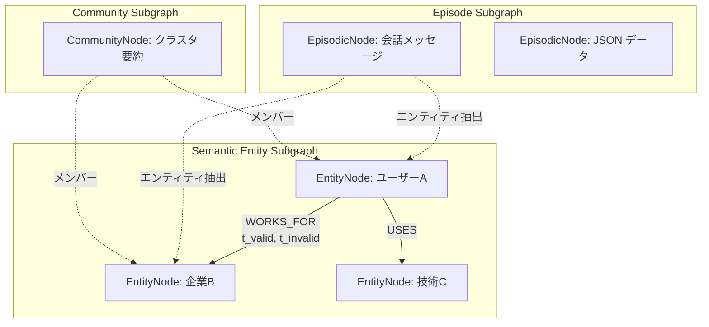
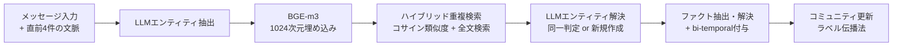

本記事は [Zep: A Temporal Knowledge Graph Architecture for Agent Memory (arXiv:2501.13956)](https://arxiv.org/abs/2501.13956) の解説記事です。

## 論文概要（Abstract）

AIエージェント向けのメモリレイヤーサービス「Zep」を提案した論文である。中核となるGraphitiエンジンは、非構造化会話データと構造化ビジネスデータを動的に統合する時間対応知識グラフである。bi-temporal設計により知識の有効期間とシステム操作履歴を分離して管理し、エンティティ解決とコミュニティ検出を組み合わせたハイブリッド検索を実現している。著者らはDeep Memory Retrieval（DMR）ベンチマークで94.8%（MemGPTの93.4%を上回る）、LongMemEvalで最大18.5%の精度向上と90%のレイテンシ削減を報告している。

この記事は [Zenn記事: Neo4jグラフメモリとLLMエンティティ抽出で社内Slack履歴の長期記憶検索を実装する](https://zenn.dev/0h_n0/articles/6cc75e77364d51) の深掘りです。

## 情報源

- **arXiv ID**: 2501.13956
- **URL**: [https://arxiv.org/abs/2501.13956](https://arxiv.org/abs/2501.13956)
- **著者**: Preston Rasmussen, Pavlo Paliychuk, Travis Beauvais, et al.
- **発表年**: 2025
- **分野**: cs.CL, cs.AI, cs.IR

## 背景と動機（Background & Motivation）

LLMベースのエージェントが長期的な対話や業務で有用であるためには、過去のやり取りを適切に記憶・検索する仕組みが不可欠である。しかし従来のRAGアプローチには構造的な限界がある。チャンク分割ベースのベクトル検索は文脈の断片化を招き、会話要約は情報の損失が避けられない。さらに、知識は時間とともに変化するにもかかわらず、従来手法は「事実は静的である」という前提に依存しており、ユーザーの転職や住所変更といった時間的な知識更新を扱えない。

著者らはこれらの課題に対し、人間の記憶モデル（エピソード記憶と意味記憶の区別）に着想を得て、時間対応の知識グラフにより動的な知識管理を実現するGraphitiエンジンを提案している。GraphRAGのような静的グラフ構築とは異なり、会話が発生するたびにグラフを逐次更新する点が本手法の核心である。

## 主要な貢献（Key Contributions）

- **貢献1**: Graphitiエンジンの提案 --- エピソード・意味エンティティ・コミュニティの3層構造を持つ時間対応知識グラフ。非構造化会話と構造化ビジネスデータを統一的に扱う
- **貢献2**: bi-temporal設計 --- イベントタイムライン（事実の有効期間）とトランザクションタイムライン（システム操作履歴）を分離し、知識の矛盾解決と完全な変更履歴の保持を両立
- **貢献3**: ハイブリッド検索・リランキング --- コサイン類似度、BM25全文検索、グラフBFSの3手法とRRF・MMR等の複数リランカーを組み合わせ、検索精度と多様性を確保
- **貢献4**: ベンチマーク評価 --- DMRで94.8%（MemGPT超え）、LongMemEvalで最大18.5%精度向上・90%レイテンシ削減を達成。ただし著者ら自身がDMRベンチマークの限界も指摘

## 技術的詳細（Technical Details）

### Graphitiのデータモデル

Graphitiは三層構造の知識グラフ $\mathcal{G} = (\mathcal{N}, \mathcal{E}, \phi)$ として定義される。



**エピソードサブグラフ $\mathcal{G}_e$**: 生の入力データ（会話メッセージ、テキスト、JSON）をノードとして保持する。情報損失のないソースデータストアとして機能し、エンティティノードへのエッジで出典を追跡する。

**意味エンティティサブグラフ $\mathcal{G}_s$**: エピソードから抽出・解決されたエンティティノード $\mathcal{N}_s$ と、それらの間の関係を表すセマンティックエッジ $\mathcal{E}_s$ で構成される。各エッジには後述するbi-temporalメタデータが付与される。

**コミュニティサブグラフ $\mathcal{G}_c$**: 密に接続されたエンティティ群をクラスタリングしたコミュニティノード $\mathcal{N}_c$ を保持する。高レベルな要約を提供し、広範な問い合わせに対する検索の足がかりとなる。

### bi-temporal設計

Graphitiの時間管理は、2つの独立したタイムラインに基づく。

**イベントタイムライン $T$**: 現実世界での事実の有効期間を表す。

$$
\text{edge}_{\text{event}} = (t_{\text{valid}}, t_{\text{invalid}}) \in T \times T
$$

- $t_{\text{valid}}$: 関係が真になった時点（例: 「2024年4月に入社した」の2024年4月）
- $t_{\text{invalid}}$: 関係が真でなくなった時点（例: 退職日。未終了なら $\text{null}$）

**トランザクションタイムライン $T'$**: システムがデータを処理した時点を記録する。

$$
\text{edge}_{\text{txn}} = (t'_{\text{created}}, t'_{\text{expired}}) \in T' \times T'
$$

- $t'_{\text{created}}$: エッジがシステムに登録された時点
- $t'_{\text{expired}}$: エッジが無効化された時点（無効化されるまで $\text{null}$）

この設計により、各エッジは4つのタイムスタンプを持つ。

$$
\text{edge} = (t_{\text{valid}}, t_{\text{invalid}}, t'_{\text{created}}, t'_{\text{expired}})
$$

**矛盾解決のロジック**: 新しい情報が既存エッジと時間的に重複する矛盾を含む場合、システムは既存エッジの $t_{\text{invalid}}$ を新エッジの $t_{\text{valid}}$ に設定する。トランザクションタイムライン $T'$ に基づき、新しい情報が常に優先される。これにより、事実の変遷が完全な履歴として保持される。

例えば、「Aliceは2023年にCompanyXに勤務」というエッジが存在し、新たに「Aliceは2024年4月にCompanyYに転職」という情報が入力された場合、CompanyXエッジの $t_{\text{invalid}}$ が2024年4月に設定され、CompanyYへの新エッジが $t_{\text{valid}} = \text{2024年4月}$ で作成される。

### エンティティ抽出・解決パイプライン

著者らは以下の5段階パイプラインでエピソードからグラフを構築している。



**ステップ1 --- エンティティ抽出**: 現在のメッセージと直前 $n = 4$ 件のメッセージ（2会話ターン分）を文脈としてLLMに入力し、発話者・アクター、重要なエンティティ、概念を抽出する。関係性やアクション、時間マーカーは除外する。

**ステップ2 --- エンティティ埋め込み**: 抽出したエンティティ名をBGE-m3モデルで1024次元ベクトルに変換する。

**ステップ3 --- 重複検出**: コサイン類似度検索と全文検索のハイブリッドで既存エンティティの候補を取得し、エピソード文脈とともにLLMに提示する。

**ステップ4 --- エンティティ解決**: LLMが新規エンティティと既存候補を比較し、同一であれば正規名と要約を更新、新規であれば新ノードを作成する。著者らは「完全一致でなくても同じ情報を表現していれば重複」と定義している。

**ステップ5 --- ファクト抽出・時間付与**: エンティティ間の関係（ファクト）を抽出し、`relation_type`（例: `WORKS_FOR`, `LIVES_IN`）を大文字表記で付与する。ISO 8601形式で $t_{\text{valid}}$, $t_{\text{invalid}}$ を設定する。

**コミュニティ検出**: GraphRAGのLeidenアルゴリズムとは異なり、ラベル伝播法を採用している。新しいエンティティノード $n_i \in \mathcal{N}_s$ がグラフに追加されると、隣接ノードのコミュニティを調査し、最多数のコミュニティに割り当てる。これにより完全なグラフ再構築なしに逐次的なコミュニティ更新が可能である。ただし著者らは、漸進的な更新が完全なラベル伝播からの乖離を蓄積するため、定期的な全体再計算が必要と指摘している。

### ハイブリッド検索・リランキング

検索パイプラインは3段階で構成される。

$$
f(\alpha) = \chi(\rho(\phi(\alpha))) = \beta
$$

ここで $\alpha$ はクエリ、$\phi$ は検索関数、$\rho$ はリランカー、$\chi$ はコンテキスト構築関数、$\beta$ は出力である。

**検索関数 $\phi$**: クエリを3タプル $(\mathcal{E}_s^n \times \mathcal{N}_s^n \times \mathcal{N}_c^n)$ に変換する。3つの検索手法を組み合わせる。

| 検索手法 | 対象 | 説明 |
|---------|------|------|
| $\phi_{\text{cos}}$ | エッジのfact、エンティティ名、コミュニティ名 | 1024次元コサイン類似度 |
| $\phi_{\text{bm25}}$ | 同上 | Neo4j/Luceneによる全文検索 |
| $\phi_{\text{bfs}}$ | グラフ構造 | シードノードからn-hopの幅優先探索 |

**リランカー $\rho$**: 複数のリランキング手法を適用する。

- **Reciprocal Rank Fusion（RRF）**: 複数検索結果のランク統合
- **Maximal Marginal Relevance（MMR）**: 多様性を考慮した再ランキング
- **Episode-mentions**: エンティティ・ファクトの言及頻度による重み付け
- **Node distance**: グラフ上のトポロジー距離に基づくスコアリング
- **Cross-encoder**: LLMベースの関連度スコアリング（最高コスト）

検索結果のコンテキストは約1.6kトークンに圧縮され、フルコンテキスト（約115kトークン）と比較して大幅に効率的である。

## 実装のポイント（Implementation Notes）

### Graphitiの主要技術スタック

Graphitiはオープンソースプロジェクトとしてリリースされており、以下の技術スタックで構成されている。

- **グラフデータベース**: Neo4j（Luceneインデックスによるネイティブ全文検索対応）
- **埋め込みモデル**: BGE-m3（BAAI）、1024次元ベクトル
- **グラフ構築LLM**: gpt-4o-mini（コスト効率重視）
- **グラフ操作**: 事前定義済みCypherクエリ（LLM生成クエリは一貫性の問題から不採用）

事前定義済みCypherクエリの採用は重要な設計判断である。LLMにCypherクエリを生成させる手法は柔軟性が高い反面、クエリの一貫性やセキュリティに問題がある。Graphitiではエンティティ作成・検索・更新の全操作をテンプレート化されたCypherクエリで実行し、パラメータのみをLLMが決定する。

### Pythonによる実装イメージ

以下は、Graphitiのbi-temporalエッジモデルとエンティティ解決の概念コードである。

```python
from dataclasses import dataclass, field
from datetime import datetime


@dataclass(frozen=True)
class BiTemporalEdge:
    """bi-temporal設計に基づくセマンティックエッジ。

    イベントタイムライン（事実の有効期間）と
    トランザクションタイムライン（システム操作履歴）を分離管理する。

    Attributes:
        source_entity: ソースエンティティの正規名
        target_entity: ターゲットエンティティの正規名
        relation_type: 関係タイプ（大文字表記、例: WORKS_FOR）
        fact: 関係の詳細な自然言語記述
        t_valid: 関係が真になった時点
        t_invalid: 関係が真でなくなった時点（未終了ならNone）
        t_created: システム登録時点
        t_expired: システム無効化時点（無効化前はNone）
    """

    source_entity: str
    target_entity: str
    relation_type: str
    fact: str
    t_valid: datetime
    t_invalid: datetime | None = None
    t_created: datetime = field(default_factory=datetime.utcnow)
    t_expired: datetime | None = None

    def is_currently_valid(self, at: datetime) -> bool:
        """指定時点でこのエッジが有効かどうかを判定する。

        イベントタイムラインとトランザクションタイムラインの
        両方で有効である場合にTrueを返す。
        """
        event_valid = (
            self.t_valid <= at
            and (self.t_invalid is None or at < self.t_invalid)
        )
        txn_valid = self.t_expired is None
        return event_valid and txn_valid


def invalidate_contradicting_edges(
    existing_edges: list[BiTemporalEdge],
    new_edge: BiTemporalEdge,
) -> list[BiTemporalEdge]:
    """新エッジと矛盾する既存エッジを無効化する。

    時間的に重複する矛盾エッジのt_invalidを
    新エッジのt_validに設定し、t_expiredに現在時刻を記録する。

    Args:
        existing_edges: 同一エンティティペア間の既存エッジ
        new_edge: 新たに追加されるエッジ

    Returns:
        無効化処理後のエッジリスト
    """
    now = datetime.utcnow()
    updated: list[BiTemporalEdge] = []
    for edge in existing_edges:
        if (
            edge.relation_type == new_edge.relation_type
            and edge.t_expired is None
            and edge.is_currently_valid(new_edge.t_valid)
        ):
            # frozen=Trueのため新インスタンスで置換
            invalidated = BiTemporalEdge(
                source_entity=edge.source_entity,
                target_entity=edge.target_entity,
                relation_type=edge.relation_type,
                fact=edge.fact,
                t_valid=edge.t_valid,
                t_invalid=new_edge.t_valid,
                t_created=edge.t_created,
                t_expired=now,
            )
            updated.append(invalidated)
        else:
            updated.append(edge)
    return updated
```

以下は、ハイブリッド検索とReciprocal Rank Fusionの概念コードである。

```python
from dataclasses import dataclass


@dataclass
class SearchResult:
    """検索結果のエンティティまたはエッジ。"""

    node_id: str
    content: str
    score: float = 0.0


def reciprocal_rank_fusion(
    ranked_lists: list[list[SearchResult]],
    k: int = 60,
) -> list[SearchResult]:
    """複数の検索結果リストをRRFで統合する。

    各リストのランク順位を用いて統合スコアを計算し、
    高スコア順にソートして返す。

    Args:
        ranked_lists: 各検索手法から得られたランキングリスト
        k: RRFの定数パラメータ（デフォルト60）

    Returns:
        統合・再ランキングされた検索結果リスト
    """
    scores: dict[str, float] = {}
    results: dict[str, SearchResult] = {}

    for ranked_list in ranked_lists:
        for rank, result in enumerate(ranked_list, start=1):
            rrf_score = 1.0 / (k + rank)
            scores[result.node_id] = (
                scores.get(result.node_id, 0.0) + rrf_score
            )
            results[result.node_id] = result

    for node_id, score in scores.items():
        results[node_id].score = score

    return sorted(results.values(), key=lambda r: r.score, reverse=True)
```

## Production Deployment Guide

Zep/Graphitiは実運用可能なオープンソースシステムであるため、AWSでのデプロイパターンを解説する。中核となるNeo4jの選定が構成全体を決定する。

### AWS実装パターン（コスト最適化重視）

| 規模 | 月間エピソード数 | 推奨構成 | 月額コスト | 主要サービス |
|------|----------------|---------|-----------|------------|
| **Small** | ~10,000 | Serverless | $150-400 | Lambda + Neo4j AuraDB Free/Pro + Bedrock |
| **Medium** | ~100,000 | Hybrid | $800-2,000 | ECS Fargate + Neo4j AuraDB Professional + Bedrock |
| **Large** | 1,000,000+ | Container | $4,000-12,000 | EKS + Neo4j Enterprise (自己管理) + Bedrock |

**コスト試算注意事項**: 2026年9月時点のAWS東京リージョン（ap-northeast-1）料金に基づく概算値。Neo4j AuraDBの料金はneo4j.com、LLM推論コスト（gpt-4o-mini）はOpenAI料金による。最新料金は [AWS料金計算ツール](https://calculator.aws/) で確認してください。

**Small構成**: Neo4j AuraDB Free（制約: ノード20万件、リレーション40万件）またはAuraDB Proで知識グラフを管理し、Lambdaでエンティティ抽出・検索パイプラインを実行する。LLM推論はBedrock（Claude）またはOpenAI APIを使用。会話量が少ない個人プロジェクトやPoC向け。

**Medium構成**: ECS Fargateでgraphiti-coreをコンテナ実行し、AuraDB Professionalで本番グレードのNeo4jを利用する。ElastiCacheでエンティティ埋め込みのキャッシュを行い、LLM推論コストを抑制する。

**Large構成**: EKS上でNeo4j Enterprise（Helm chart）を自己管理し、Karpenterでコンピュートリソースを自動スケーリングする。複数テナント・複数グラフの並列処理に対応。

### Terraformインフラコード（Small構成: Lambda + Neo4j AuraDB + Bedrock）

```hcl
# --- Small構成: Graphitiエピソード処理パイプライン ---

resource "aws_lambda_function" "graphiti_ingest" {
  function_name = "graphiti-episode-ingest"
  role          = aws_iam_role.lambda_graphiti.arn
  package_type  = "Image"
  image_uri     = "${aws_ecr_repository.graphiti.repository_url}:latest"
  timeout       = 120  # エンティティ抽出+解決に時間がかかる
  memory_size   = 2048

  environment {
    variables = {
      NEO4J_URI           = "neo4j+s://<auradb-instance>.databases.neo4j.io"
      NEO4J_AUTH_SECRET   = aws_secretsmanager_secret.neo4j_auth.arn
      EMBEDDING_MODEL     = "BAAI/bge-m3"
      LLM_MODEL_ID        = "anthropic.claude-sonnet-4-20250514-v1:0"
      CONTEXT_WINDOW_SIZE = "4"  # 直前4メッセージを文脈に含める
    }
  }
}

resource "aws_lambda_function" "graphiti_search" {
  function_name = "graphiti-hybrid-search"
  role          = aws_iam_role.lambda_graphiti.arn
  package_type  = "Image"
  image_uri     = "${aws_ecr_repository.graphiti.repository_url}:latest"
  timeout       = 30
  memory_size   = 1024

  environment {
    variables = {
      NEO4J_URI         = "neo4j+s://<auradb-instance>.databases.neo4j.io"
      NEO4J_AUTH_SECRET = aws_secretsmanager_secret.neo4j_auth.arn
      SEARCH_TOP_K      = "10"
      RERANKER_STRATEGY = "rrf"  # rrf | mmr | cross_encoder
    }
  }
}

resource "aws_secretsmanager_secret" "neo4j_auth" {
  name        = "graphiti/neo4j-auth"
  description = "Neo4j AuraDB認証情報"
}

# IAM Role: bedrock:InvokeModel, secretsmanager:GetSecretValue, logs:* のみ付与
# （IAMロール定義は省略。最小権限の原則に従うこと）

resource "aws_budgets_budget" "graphiti_monthly" {
  name         = "graphiti-pipeline-monthly"
  budget_type  = "COST"
  limit_amount = "500"
  limit_unit   = "USD"
  time_unit    = "MONTHLY"

  notification {
    comparison_operator        = "GREATER_THAN"
    threshold                  = 80
    threshold_type             = "PERCENTAGE"
    notification_type          = "ACTUAL"
    subscriber_email_addresses = ["ops@example.com"]
  }
}
```

### Large構成（EKS + Neo4j Enterprise）の要点

Large構成では `terraform-aws-modules/eks/aws` モジュール（v20系）でEKSクラスタを構築し、Neo4j Enterprise Helm chart（`neo4j/neo4j` v5系）でクラスタ化されたNeo4jを運用する。Graphitiの処理パイプラインはKubernetesジョブまたはDeploymentとして実行し、KarpenterのNodePoolで `r6i.xlarge`（メモリ最適化）のSpot/On-Demand混合を設定する。`consolidationPolicy: WhenEmptyOrUnderutilized` によりアイドルノードを30秒で回収する。

Neo4jのメモリ設定はグラフサイズに依存するが、目安として `server.memory.heap.initial_size=4g`、`server.memory.pagecache.size=4g` を初期値とし、ノード数100万件超で段階的に増加させる。

### 運用・監視設定

```python
import boto3


def setup_graphiti_monitoring() -> None:
    """Graphitiパイプラインの監視アラームを設定する。

    エピソード処理レイテンシとエンティティ解決失敗率の
    2種類を監視する。
    """
    cloudwatch = boto3.client("cloudwatch", region_name="ap-northeast-1")
    sns_arn = "arn:aws:sns:ap-northeast-1:123456789012:ops-alerts"

    # エピソード処理のレイテンシ監視
    cloudwatch.put_metric_alarm(
        AlarmName="graphiti-ingest-latency-high",
        ComparisonOperator="GreaterThanThreshold",
        EvaluationPeriods=3,
        DatapointsToAlarm=2,
        MetricName="EpisodeIngestDuration",
        Namespace="GraphitiPipeline",
        Period=300,
        Statistic="p99",
        Threshold=30.0,  # 30秒を超えたらアラート
        AlarmDescription="Graphitiエピソード処理p99レイテンシが30秒を超過",
        AlarmActions=[sns_arn],
    )

    # エンティティ解決失敗率の監視
    cloudwatch.put_metric_alarm(
        AlarmName="graphiti-entity-resolution-failure-rate",
        ComparisonOperator="GreaterThanThreshold",
        EvaluationPeriods=3,
        DatapointsToAlarm=2,
        MetricName="EntityResolutionFailureRate",
        Namespace="GraphitiPipeline",
        Period=300,
        Statistic="Average",
        Threshold=0.05,  # 5%を超えたらアラート
        AlarmDescription="エンティティ解決失敗率が5%を超過（LLM応答品質の劣化を疑う）",
        AlarmActions=[sns_arn],
    )
```

**CloudWatch Logs Insightsクエリ例**（エンティティ解決のパフォーマンス分析）:

```
fields @timestamp, episode_id, entity_count, resolution_duration_ms, new_entities, merged_entities
| filter event = "entity_resolution_complete"
| stats avg(resolution_duration_ms) as avg_ms, max(resolution_duration_ms) as max_ms,
        sum(new_entities) as total_new, sum(merged_entities) as total_merged
        by bin(1h)
| sort bin(1h) desc
| limit 24
```

### コスト最適化チェックリスト

- [ ] Bedrock Prompt Caching有効化（エンティティ抽出プロンプトの繰り返しで30-90%削減）
- [ ] Bedrock Batch API使用（夜間バッチでの大量エピソード処理で50%割引）
- [ ] Neo4j AuraDB Freeの制約確認（ノード20万件、リレーション40万件で足りるか）
- [ ] BGE-m3埋め込みのキャッシュ（同一エンティティ名の再埋め込み回避、ElastiCache推奨）
- [ ] Lambda メモリサイズ最適化（ingest: 2048MB、search: 1024MB推奨）
- [ ] Lambda Provisioned Concurrency（コールドスタート回避、常時利用時）
- [ ] コミュニティ全体再計算の定期スケジューリング（EventBridge、週1回推奨）
- [ ] Neo4j Luceneインデックスの適切な設定（BM25検索の性能に直結）
- [ ] ECS/EKS Spot Instances優先（Medium/Large構成で最大90%削減）
- [ ] Karpenter consolidationPolicy設定（アイドルノード自動回収）
- [ ] Reserved Instances / Savings Plans（安定ワークロードで最大72%削減）
- [ ] AWS Budgets月額予算設定（Small: $500、Large: $15,000）
- [ ] Cost Anomaly Detection有効化（LLM推論コストの異常検出）
- [ ] CloudWatch Logs保持期間設定（30日推奨）
- [ ] タグ戦略（Project/Environment/Owner）
- [ ] max_tokens制限設定（エンティティ抽出LLMの不必要な長文生成防止）
- [ ] 開発環境の夜間・週末停止
- [ ] CloudTrail有効化（API呼び出し監査）
- [ ] IAM最小権限設定（bedrock:InvokeModel, secretsmanager:GetSecretValue のみ）
- [ ] VPCエンドポイント使用（Bedrock/Secrets Managerへのプライベートアクセス）
- [ ] GuardDuty有効化（異常なAPI呼び出しパターン検出）
- [ ] ECRイメージライフサイクルポリシー（古いイメージの自動削除）

### セキュリティベストプラクティス

- **IAMポリシー**: Lambda実行ロールには `bedrock:InvokeModel` と `secretsmanager:GetSecretValue` のみ付与。ワイルドカード（`*`）は使用しない
- **VPCエンドポイント**: Bedrock・Secrets ManagerへのアクセスはVPCエンドポイント経由とし、インターネット経由を排除
- **Neo4j認証**: AuraDBの認証情報はSecrets Managerで管理し、環境変数にハードコードしない。自己管理のNeo4j Enterpriseでは証明書ベース認証を推奨
- **PII保護**: 会話データにPIIが含まれる場合、エンティティ抽出前にマスキングを適用。Neo4jのデータ暗号化（at-rest、in-transit）を有効化
- **ネットワーク分離**: Neo4jをプライベートサブネットに配置し、Graphitiパイプラインのみがアクセスできるセキュリティグループを設定

## 実験結果（Results）

### Deep Memory Retrieval（DMR）ベンチマーク

500件のマルチセッション会話（各5セッション、最大12メッセージ/セッション、合計約60メッセージ/会話）を用いた単一ターンの事実検索ベンチマークである。Top 10のノード/エッジを検索し、LLMが応答を生成、ゴールデンアンサーと比較する。

| システム | スコア（gpt-4-turbo） | スコア（gpt-4o-mini） |
|---------|---------------------|---------------------|
| Recursive Summarization | 35.3% | --- |
| Conversation Summaries | 78.6% | 88.0% |
| MemGPT | 93.4% | --- |
| Full-conversation | 94.4% | 98.0% |
| **Zep** | **94.8%** | **98.2%** |

（論文Table 1より）

著者らはDMRベンチマークの限界を明示的に指摘している。「単一ターンの事実検索のみに依存しており、曖昧な表現を含む質問が多く、実世界のエンタープライズユースケースを十分に反映していない」と述べている。Full-conversationアプローチが94.4%を達成している点から、このベンチマークの弁別力には疑問が残る。

### LongMemEval（LME）ベンチマーク

平均約115,000トークンの長文会話を対象とした、より実践的な評価ベンチマークである。

| システム | モデル | スコア | レイテンシ | レイテンシIQR | 平均コンテキスト |
|---------|--------|-------|-----------|-------------|----------------|
| Full-context | gpt-4o-mini | 55.4% | 31.3s | 8.76s | 115kトークン |
| **Zep** | gpt-4o-mini | **63.8%** | **3.20s** | **1.31s** | **1.6kトークン** |
| Full-context | gpt-4o | 60.2% | 28.9s | 6.01s | 115kトークン |
| **Zep** | gpt-4o | **71.2%** | **2.58s** | **0.684s** | **1.6kトークン** |

（論文Table 2より）

gpt-4oモデルでは18.5%の精度向上と91%のレイテンシ削減を同時に達成している。コンテキストが115kトークンから1.6kトークンに圧縮されることで、LLM推論コストも大幅に削減される。

**質問タイプ別の精度（gpt-4o）**:

| 質問タイプ | Full-context | Zep | 変化率 |
|-----------|-------------|-----|--------|
| Single-session-user | 81.4% | 92.9% | +14.1% |
| Single-session-assistant | 94.6% | 80.4% | -17.7% |
| Single-session-preference | 20.0% | 56.7% | +184% |
| Multi-session | 44.3% | 57.9% | +30.7% |
| Knowledge-update | 78.2% | 83.3% | +6.52% |
| Temporal-reasoning | 45.1% | 62.4% | +38.4% |

（論文Table 3より）

注目すべきは、Zepが特に強い領域と弱い領域が明確に分かれている点である。Single-session-preference（+184%）やTemporal-reasoning（+38.4%）ではFull-contextを大幅に上回る一方、Single-session-assistant（-17.7%）ではFull-contextに劣っている。著者らはこの性能低下について「さらなる研究と開発が必要」と述べており、アシスタント自身の過去発言に関する質問への検索が課題であることを示唆している。

### 実験の制約

著者らは以下の制約を明示している。

- 実験はGraphitiの検索機能の一部のみを評価しており、「会話履歴と構造化ビジネスデータを統合・合成する能力」の直接評価は行われていない
- MemGPTとのLongMemEval比較は実施できなかった（MemGPTが既存メッセージ履歴の直接取り込みに対応していないため）
- 評価はBoston, MAからAWS us-west-2への接続で実施されており、ネットワークレイテンシが含まれる

## 実運用への応用（Practical Applications）

### Zenn記事のneo4j-agent-memoryとの比較

[Zenn記事](https://zenn.dev/0h_n0/articles/6cc75e77364d51)で使用しているneo4j-agent-memoryの3層メモリアーキテクチャ（短期・長期・意味記憶）と、Graphitiのアプローチを比較する。

| 観点 | neo4j-agent-memory | Graphiti |
|------|-------------------|----------|
| 時間管理 | メッセージのタイムスタンプ | bi-temporal（valid/invalid + created/expired） |
| エンティティ解決 | LLM抽出のみ | ハイブリッド検索 + LLM解決 |
| コミュニティ検出 | なし | ラベル伝播法 |
| 知識更新 | 上書き | 履歴保持（旧エッジを無効化、削除しない） |
| 検索手法 | ベクトル検索 | コサイン + BM25 + BFS + 複数リランカー |
| スキーマ | 事前定義 | LLM主導で動的抽出 |

Graphitiのbi-temporal設計は、Slack履歴のように情報が時間とともに変化するユースケースで特に有用である。例えば「プロジェクトの担当者が変更された」場合、neo4j-agent-memoryでは古い情報が上書きされるが、Graphitiでは旧エッジが $t_{\text{invalid}}$ 付きで保持されるため、「以前の担当者は誰だったか」という時間的な問い合わせにも応答できる。

## 関連研究（Related Work）

- **MemGPT/Letta (Packer et al., 2023)**: 仮想コンテキスト管理によるエージェントメモリ。メインコンテキストとアーカイブストレージの階層構造を持ち、DMRベンチマークで93.4%を達成。ただし既存メッセージ履歴の直接取り込みに対応しておらず、LongMemEvalでの比較が実施できなかった点が論文で報告されている。
- **Mem0**: エージェント向けメモリレイヤーサービス。Zepと同様のポジショニングだが、ナレッジグラフベースの時間管理機構を持たない。著者らはZepの直接的な競合として位置づけている。
- **GraphRAG (Microsoft, 2024)**: 知識グラフとRAGの統合。Leidenアルゴリズムによるコミュニティ検出とmap-reduce要約が特徴。ただし静的なグラフ構築を前提としており、Graphitiのような逐次更新には対応していない。Graphitiのコミュニティ検出がラベル伝播法を採用した理由の一つとして、GraphRAGのLeidenアルゴリズムが全体再構築を必要とする点が挙げられている。
- **AriGraph**: エピソード記憶を知識グラフに統合する手法。BFS検索を採用しており、Graphitiの $\phi_{\text{bfs}}$ と類似のアプローチである。
- **LangMem**: LangChain系のエージェントメモリライブラリ。著者らが関連研究として言及しているが、詳細な比較は行われていない。

## まとめと今後の展望

本論文は、AIエージェント向けのメモリレイヤーとして、時間対応知識グラフエンジンGraphitiを中核としたZepを提案した。bi-temporal設計による知識の変遷管理、エピソード・意味エンティティ・コミュニティの3層グラフ構造、ハイブリッド検索・リランキングの3つが技術的な柱である。

LongMemEvalベンチマークでは最大18.5%の精度向上と90%のレイテンシ削減を示し、特にTemporal-reasoning（+38.4%）やSingle-session-preference（+184%）で顕著な改善を達成している。一方でSingle-session-assistant質問での性能低下（-17.7%）や、会話データと構造化ビジネスデータの統合能力が未評価である点は今後の課題として残る。

今後の方向性として、著者らは「エンタープライズ向けのメモリベンチマークの整備」と「より能力の低いモデルでのbi-temporal理解の改善」を挙げている。コミュニティ検出のラベル伝播法が完全再計算から乖離する問題に対する最適な更新戦略も、実運用上の重要な研究課題である。

## 参考文献

- Rasmussen, P., Paliychuk, P., Beauvais, T., Ryan, J., & Chalef, D. (2025). Zep: A Temporal Knowledge Graph Architecture for Agent Memory. arXiv:2501.13956.
- Packer, C., Wooders, S., Lin, K., Fang, V., Patil, S. G., Stoica, I., & Gonzalez, J. E. (2023). MemGPT: Towards LLMs as Operating Systems. arXiv:2310.08560.
- Edge, D., Trinh, H., Cheng, N., et al. (2024). From Local to Global: A Graph RAG Approach to Query-Focused Summarization. arXiv:2404.16130.
- Wang, D., Hu, P., Guo, L., et al. (2024). AriGraph: Learning Knowledge Graph World Models with Episodic Memory for LLM Agents. arXiv:2407.04363.
- Di, S., Wu, S., & Wang, H. (2024). LongMemEval: Benchmarking Chat Assistants on Long-Term Interactive Memory. arXiv:2410.10813.
