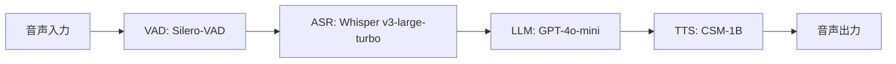

本記事は [i-LAVA: Insights on Low Latency Voice-2-Voice Architecture for Agents (arXiv:2509.20971)](https://arxiv.org/abs/2509.20971) の解説記事です。

## 論文概要（Abstract）

Voice-to-Voice（V2V）通信システムにおける低レイテンシ最適化を体系的に分析した論文である。著者らはASR、LLM、TTSの3コンポーネントからなるパイプラインを構築し、各段階のレイテンシ特性を定量的に評価している。特にTTSコンポーネントがEnd-to-Endレイテンシの最大のボトルネックであることを特定し、Residual Vector Quantization（RVQ）の反復数削減による高速化手法を提案している。RVQ反復数を32から16に削減することでFirst Chunk Latencyを約54%短縮し、Real-Time Factor（RTF）を1未満に抑えつつ、電話ベースの音声エージェントでは許容可能な音質を維持できると報告している。

この記事は [Zenn記事: Gemini 3.8 Flash×Pipecatで銀行コールセンター音声ボットを構築する](https://zenn.dev/0h_n0/articles/f5fa1b28080393) の深掘りです。

## 情報源

- **arXiv ID**: 2509.20971
- **URL**: [https://arxiv.org/abs/2509.20971](https://arxiv.org/abs/2509.20971)
- **著者**: Anupam Purwar, Aditya Choudhary
- **発表年**: 2025
- **分野**: cs.SD, cs.AI
- **採択**: AIML Systems 2025

## 背景と動機（Background & Motivation）

リアルタイム音声エージェント（コールセンターボット、音声アシスタント等）の実用化においてレイテンシは最重要課題の一つである。人間の対話では応答までの沈黙が300msを超えると不自然に感じ始め、1秒を超えると明確なストレスを与える。しかしV2Vパイプラインでは、音声認識（ASR）、言語モデル（LLM）による応答生成、音声合成（TTS）の3段階を直列に経る必要があり、各コンポーネントのレイテンシが累積する。

従来のV2V研究はEnd-to-Endモデル（GPT-4oのネイティブ音声モードなど）に注力してきたが、個別コンポーネントのレイテンシ寄与を定量的に分離して分析した研究は限られていた。著者らはオープンソースモデルのみで構成したパイプラインを用いて各段階のボトルネックを特定し、特にTTSにおけるRVQ反復数がレイテンシと音質のトレードオフを決定する主要因子であることを実証的に示している。

## 主要な貢献（Key Contributions）

- **貢献1**: V2Vパイプラインの各コンポーネント（VAD / ASR / LLM / TTS）のレイテンシを分離計測し、TTSが最大のボトルネックであることを定量的に特定
- **貢献2**: CSM-1BモデルにおけるRVQ反復数削減の効果を体系的に評価し、反復数16でRTF < 1を達成しつつ実用的な音質を維持できることを報告
- **貢献3**: torch.compile、ストリーミング出力、パディング戦略（Mean Padding / Concat Padding）など複数の最適化テクニックの効果を検証
- **貢献4**: GPU / CPU両環境での性能比較を実施し、GPUが必須である条件を明確化

## 技術的詳細（Technical Details）

### パイプラインアーキテクチャ

著者らが構築したV2Vパイプラインは以下の5コンポーネントで構成される。



- **VAD（Voice Activity Detection）**: Silero-VADにより発話区間を検出し、無音区間をフィルタリングする
- **ASR（Automatic Speech Recognition）**: OpenAI Whisper v3-large-turboで音声をテキストに変換する
- **LLM（Large Language Model）**: GPT-4o-miniでテキスト応答を生成する
- **TTS（Text-to-Speech）**: CSM-1Bで応答テキストを音声波形に変換する

### CSM-1Bアーキテクチャ

CSM-1B（Conversational Speech Model）はSesame社が公開したオープンソースの音声合成モデルであり、2段階のTransformerで構成される。

**バックボーンモデル（Llama 3.2 1B）**: テキストトークンと過去の音声コンテキストを入力として受け取り、RVQの第1コードブック（粗い音声表現）を自己回帰的に生成する。

**デコーダモデル（Llama 3.2 100M）**: バックボーンの出力を条件として、残りのRVQコードブック（第2〜第$K$コードブック）を並列に生成する。この2段階設計により、全コードブックを逐次生成する場合と比較して推論速度を向上させている。

### Residual Vector Quantization（RVQ）

RVQは連続的な音声特徴量を離散トークンに変換する符号化手法である。入力ベクトル $\mathbf{x}$ に対して、$K$ 段の量子化器を逐次適用し、各段で残差を符号化する。

$$
\hat{\mathbf{x}} = \sum_{k=1}^{K} \mathbf{c}_k
$$

ここで、
- $\hat{\mathbf{x}}$: 再構成されたベクトル
- $\mathbf{c}_k$: 第 $k$ コードブックから選択されたコードワード
- $K$: RVQ反復数（コードブック数）

各段の量子化は以下の手順で行われる。

$$
\mathbf{r}_0 = \mathbf{x}, \quad \mathbf{c}_k = \text{VQ}_k(\mathbf{r}_{k-1}), \quad \mathbf{r}_k = \mathbf{r}_{k-1} - \mathbf{c}_k
$$

ここで、
- $\mathbf{r}_k$: 第 $k$ 段の残差ベクトル
- $\text{VQ}_k$: 第 $k$ コードブックによる最近傍探索

$K$ を増やすほど残差が小さくなり再構成精度（音質）は向上するが、デコーダの計算量は $K$ に比例して増加する。標準のCSM-1Bでは $K=32$ であるが、著者らは $K$ を16, 20, 24に削減した場合の音質・レイテンシトレードオフを評価している。

### パディング戦略

TTSモデルへの入力はバッチ処理のためにパディングが必要となる。著者らは2つの戦略を検討している。

**Mean Padding**: パディング領域を学習データの平均ベクトルで埋める。計算は軽量だが、平均ベクトルが実際の音声分布から離れている場合にアーティファクトが生じうる。

**Concat Padding**: 短い入力を複数連結してバッチサイズを揃える。パディング領域が減るため情報効率は高いが、連結境界での不連続性に注意が必要である。

## 実装のポイント（Implementation）

### torch.compileによる高速化

著者らはPyTorchの`torch.compile`を適用してJITコンパイルによる推論高速化を検証している。`torch.compile`はPythonのオーバーヘッドを排除し、オペレータフュージョンやメモリアクセスの最適化を自動で行う。

```python
import torch
from csm import CSM

model = CSM.from_pretrained("sesame/csm-1b")
model.eval()

# torch.compileで推論を高速化
compiled_model = torch.compile(model, mode="reduce-overhead")

# ウォームアップ（初回はコンパイルのため遅い）
with torch.no_grad():
    _ = compiled_model.generate(warmup_input)

# 本番推論
with torch.no_grad():
    audio = compiled_model.generate(
        text="Hello, how can I help you?",
        speaker=0,
        max_audio_length_ms=10000,
    )
```

### ストリーミング出力

レイテンシ削減のもう一つの手法として、TTSの出力を全文生成完了を待たずにチャンク単位で逐次送出するストリーミング方式がある。First Chunk Latency（最初のチャンクが出力されるまでの時間）を短縮することでユーザー体験を改善できる。著者らの実験ではE2Eパイプライン（RVQ 16, GPU）でFirst Chunk Latencyが1021.2msであったと報告されている。

### GPU vs CPU

著者らはGPUとCPUの両環境で性能を比較している。CPUではRVQ 16の場合でもRTFが4.287xとなり、リアルタイム処理（RTF < 1）を達成できない。V2Vパイプラインの実運用にはGPUが事実上必須であることが示されている。

## Production Deployment Guide

### AWS実装パターン（コスト最適化重視）

V2V音声エージェントはGPU推論が必須であり、レイテンシ要件が厳しいため、構成選択にはトラフィック量とレイテンシSLAの両方を考慮する必要がある。以下は2026年9月時点のap-northeast-1（東京）リージョンの概算料金に基づく。実際のコストはトラフィックパターン、バースト使用量、Savings Plans適用状況により変動するため、最新料金はAWS料金計算ツールで確認を推奨する。

| 構成 | トラフィック | 推奨サービス | 月額概算 |
|------|------------|-------------|---------|
| Small | ~100通話/日 | SageMaker Serverless + Lambda | $200-500 |
| Medium | ~1,000通話/日 | ECS Fargate (GPU) + ALB | $1,500-3,000 |
| Large | 10,000+通話/日 | EKS + Karpenter + Spot GPU | $5,000-12,000 |

**Small構成（~100通話/日）**:
SageMaker Serverless Inference EndpointでCSM-1Bモデルをホスティングし、Lambda + API GatewayでVAD/ASR/LLM呼び出しをオーケストレーションする。SageMakerの自動スケールにより、アイドル時はゼロコストに近づく。ただしコールドスタートで数秒の遅延が発生するため、Provisioned Concurrencyの設定を検討する。ASRにはAmazon Transcribe Streamingを利用しWhisperのGPU推論コストを回避する選択肢もある。

**Medium構成（~1,000通話/日）**:
ECS Fargate（GPU対応タスク）でTTSモデルを常時稼働させ、ALBでWebSocket接続を管理する。ASRとLLMはAmazon Transcribe StreamingとBedrock（Claude 3.5 Haiku等）で代替し、自前GPU推論はTTSに集中させることでコストを抑える。ElastiCache（Redis）でTTS結果をキャッシュし、同一フレーズの再合成を回避する。

**Large構成（10,000+通話/日）**:
EKSクラスタにKarpenterを組み合わせ、g5.xlarge Spot Instancesを優先的に利用する。Spot中断に備えてOn-Demand Fallbackを設定する。TTS推論ポッドは水平スケーリングし、Kubernetes HPAでGPU使用率70%をターゲットにオートスケールする。

**コスト削減テクニック**:
- Spot GPU Instances（g5.xlarge）活用で最大70%削減
- SageMaker Savings Plans（1年コミット）で最大64%削減
- Amazon Transcribe Streaming利用でWhisper GPU推論コストを回避
- ElastiCacheによるTTS結果キャッシュで重複推論を削減

### Terraformインフラコード

**Small構成（SageMaker Serverless + Lambda）**:

```hcl
# VPC基盤（NAT Gateway不使用でコスト削減）
resource "aws_vpc" "v2v" {
  cidr_block           = "10.0.0.0/16"
  enable_dns_hostnames = true
  tags = { Name = "v2v-voice-agent" }
}

resource "aws_subnet" "private" {
  count             = 2
  vpc_id            = aws_vpc.v2v.id
  cidr_block        = cidrsubnet(aws_vpc.v2v.cidr_block, 8, count.index)
  availability_zone = data.aws_availability_zones.available.names[count.index]
  tags = { Name = "v2v-private-${count.index}" }
}

# VPCエンドポイント（NAT Gateway不要化）
resource "aws_vpc_endpoint" "sagemaker_runtime" {
  vpc_id              = aws_vpc.v2v.id
  service_name        = "com.amazonaws.ap-northeast-1.sagemaker.runtime"
  vpc_endpoint_type   = "Interface"
  subnet_ids          = aws_subnet.private[*].id
  private_dns_enabled = true
}

# IAMロール（最小権限）
resource "aws_iam_role" "lambda_v2v" {
  name = "v2v-lambda-role"
  assume_role_policy = jsonencode({
    Version = "2012-10-17"
    Statement = [{
      Action = "sts:AssumeRole"
      Effect = "Allow"
      Principal = { Service = "lambda.amazonaws.com" }
    }]
  })
}

resource "aws_iam_role_policy" "lambda_v2v" {
  name = "v2v-lambda-policy"
  role = aws_iam_role.lambda_v2v.id
  policy = jsonencode({
    Version = "2012-10-17"
    Statement = [
      {
        Effect   = "Allow"
        Action   = ["sagemaker:InvokeEndpoint"]
        Resource = aws_sagemaker_endpoint.csm.arn
      },
      {
        Effect   = "Allow"
        Action   = ["transcribe:StartStreamTranscription"]
        Resource = "*"
      },
      {
        Effect   = "Allow"
        Action   = ["bedrock:InvokeModel"]
        Resource = "arn:aws:bedrock:ap-northeast-1::foundation-model/*"
      },
      {
        Effect = "Allow"
        Action = [
          "logs:CreateLogGroup",
          "logs:CreateLogStream",
          "logs:PutLogEvents"
        ]
        Resource = "arn:aws:logs:*:*:*"
      }
    ]
  })
}

# Lambda関数（V2Vオーケストレーター）
resource "aws_lambda_function" "v2v_orchestrator" {
  function_name = "v2v-orchestrator"
  runtime       = "python3.12"
  handler       = "handler.lambda_handler"
  role          = aws_iam_role.lambda_v2v.arn
  timeout       = 30
  memory_size   = 512
  filename      = "lambda.zip"

  environment {
    variables = {
      SAGEMAKER_ENDPOINT = aws_sagemaker_endpoint.csm.name
      RVQ_ITERATIONS     = "16"
      LOG_LEVEL          = "INFO"
    }
  }
}

# DynamoDB（セッション管理、On-Demand）
resource "aws_dynamodb_table" "sessions" {
  name         = "v2v-sessions"
  billing_mode = "PAY_PER_REQUEST"
  hash_key     = "session_id"

  attribute {
    name = "session_id"
    type = "S"
  }

  ttl {
    attribute_name = "expires_at"
    enabled        = true
  }

  server_side_encryption {
    enabled = true  # KMS暗号化
  }
}

# CloudWatchアラーム（コスト監視）
resource "aws_cloudwatch_metric_alarm" "lambda_duration" {
  alarm_name          = "v2v-lambda-high-duration"
  comparison_operator = "GreaterThanThreshold"
  evaluation_periods  = 3
  metric_name         = "Duration"
  namespace           = "AWS/Lambda"
  period              = 300
  statistic           = "p95"
  threshold           = 5000
  alarm_actions       = [aws_sns_topic.alerts.arn]
  dimensions = {
    FunctionName = aws_lambda_function.v2v_orchestrator.function_name
  }
}
```

**Large構成（EKS + Karpenter + Spot GPU）**:

```hcl
# EKSクラスタ
module "eks" {
  source          = "terraform-aws-modules/eks/aws"
  version         = "~> 20.0"
  cluster_name    = "v2v-voice-agent"
  cluster_version = "1.31"
  vpc_id          = aws_vpc.v2v.id
  subnet_ids      = aws_subnet.private[*].id

  cluster_endpoint_public_access = false  # プライベートアクセスのみ

  eks_managed_node_groups = {
    system = {
      instance_types = ["m7i.large"]
      min_size       = 2
      max_size       = 4
      desired_size   = 2
      labels         = { "role" = "system" }
    }
  }
}

# Karpenter Provisioner（Spot GPU優先）
resource "kubectl_manifest" "karpenter_nodepool" {
  yaml_body = yamlencode({
    apiVersion = "karpenter.sh/v1"
    kind       = "NodePool"
    metadata   = { name = "gpu-spot" }
    spec = {
      template = {
        spec = {
          requirements = [
            { key = "karpenter.sh/capacity-type", operator = "In", values = ["spot", "on-demand"] },
            { key = "node.kubernetes.io/instance-type", operator = "In", values = ["g5.xlarge", "g5.2xlarge"] },
          ]
          nodeClassRef = { name = "default" }
        }
      }
      limits   = { cpu = "128", memory = "512Gi", "nvidia.com/gpu" = "16" }
      disruption = {
        consolidationPolicy = "WhenEmptyOrUnderutilized"
        consolidateAfter    = "60s"
      }
    }
  })
}

# Secrets Manager（APIキー管理）
resource "aws_secretsmanager_secret" "v2v_config" {
  name                    = "v2v/model-config"
  recovery_window_in_days = 7
}

# AWS Budgets（予算アラート）
resource "aws_budgets_budget" "v2v_monthly" {
  name         = "v2v-monthly-budget"
  budget_type  = "COST"
  limit_amount = "15000"
  limit_unit   = "USD"
  time_unit    = "MONTHLY"

  notification {
    comparison_operator       = "GREATER_THAN"
    threshold                 = 80
    threshold_type            = "PERCENTAGE"
    notification_type         = "ACTUAL"
    subscriber_email_addresses = ["ops-team@example.com"]
  }
}
```

### 運用・監視設定

**CloudWatch Logs Insights クエリ**:

```
# レイテンシ分析（コンポーネント別P95/P99）
fields @timestamp, component, latency_ms
| filter component in ["asr", "llm", "tts"]
| stats percentile(latency_ms, 95) as p95,
        percentile(latency_ms, 99) as p99,
        avg(latency_ms) as avg_ms
  by component
| sort p95 desc

# 1時間あたりの推論回数とコスト異常検知
fields @timestamp, component
| filter component = "tts"
| stats count(*) as invoke_count by bin(1h)
| filter invoke_count > 500
```

**CloudWatch アラーム設定（Python）**:

```python
import boto3

cloudwatch = boto3.client("cloudwatch", region_name="ap-northeast-1")

def create_tts_latency_alarm(endpoint_name: str, sns_topic_arn: str) -> None:
    """TTS推論レイテンシの異常検知アラームを作成する。

    Args:
        endpoint_name: SageMakerエンドポイント名
        sns_topic_arn: 通知先SNSトピックARN
    """
    cloudwatch.put_metric_alarm(
        AlarmName="v2v-tts-high-latency",
        MetricName="ModelLatency",
        Namespace="AWS/SageMaker",
        Statistic="p95",
        Period=300,
        EvaluationPeriods=3,
        Threshold=2000000,  # 2秒（マイクロ秒単位）
        ComparisonOperator="GreaterThanThreshold",
        AlarmActions=[sns_topic_arn],
        Dimensions=[
            {"Name": "EndpointName", "Value": endpoint_name},
            {"Name": "VariantName", "Value": "AllTraffic"},
        ],
    )
```

**X-Ray トレーシング設定（Python）**:

```python
from aws_xray_sdk.core import xray_recorder, patch_all
from aws_xray_sdk.core.models.subsegment import Subsegment

# boto3自動計装
patch_all()

def trace_v2v_pipeline(session_id: str, audio_bytes: bytes) -> bytes:
    """V2Vパイプライン全体をX-Rayでトレースする。

    Args:
        session_id: セッション識別子
        audio_bytes: 入力音声データ

    Returns:
        合成音声のバイト列
    """
    segment = xray_recorder.begin_segment("v2v-pipeline")
    segment.put_annotation("session_id", session_id)

    # ASRフェーズ
    with xray_recorder.in_subsegment("asr") as sub:
        text = run_asr(audio_bytes)
        sub.put_metadata("transcript_length", len(text))

    # LLMフェーズ
    with xray_recorder.in_subsegment("llm") as sub:
        response = run_llm(text)
        sub.put_metadata("response_length", len(response))

    # TTSフェーズ
    with xray_recorder.in_subsegment("tts") as sub:
        sub.put_annotation("rvq_iterations", 16)
        audio_out = run_tts(response)
        sub.put_metadata("audio_duration_ms", len(audio_out) / 32)

    xray_recorder.end_segment()
    return audio_out
```

**Cost Explorer自動レポート（Python）**:

```python
import boto3
from datetime import datetime, timedelta

ce = boto3.client("ce", region_name="us-east-1")
sns = boto3.client("sns", region_name="ap-northeast-1")

def daily_cost_report(sns_topic_arn: str, threshold_usd: float = 100.0) -> dict:
    """日次コストレポートを生成し閾値超過時にSNS通知する。

    Args:
        sns_topic_arn: 通知先SNSトピックARN
        threshold_usd: 日次コスト閾値（USD）

    Returns:
        サービス別コスト辞書
    """
    today = datetime.utcnow().strftime("%Y-%m-%d")
    yesterday = (datetime.utcnow() - timedelta(days=1)).strftime("%Y-%m-%d")

    result = ce.get_cost_and_usage(
        TimePeriod={"Start": yesterday, "End": today},
        Granularity="DAILY",
        Metrics=["BlendedCost"],
        Filter={
            "Tags": {
                "Key": "Project",
                "Values": ["v2v-voice-agent"],
            }
        },
        GroupBy=[{"Type": "DIMENSION", "Key": "SERVICE"}],
    )

    costs = {}
    total = 0.0
    for group in result["ResultsByTime"][0]["Groups"]:
        service = group["Keys"][0]
        amount = float(group["Metrics"]["BlendedCost"]["Amount"])
        costs[service] = amount
        total += amount

    if total > threshold_usd:
        sns.publish(
            TopicArn=sns_topic_arn,
            Subject=f"V2V Daily Cost Alert: ${total:.2f}",
            Message=f"日次コストが閾値${threshold_usd}を超過: ${total:.2f}\n"
                    + "\n".join(f"  {k}: ${v:.2f}" for k, v in costs.items()),
        )

    return costs
```

### コスト最適化チェックリスト

**アーキテクチャ選択**:
- [ ] トラフィック量に応じた構成を選択（Serverless / Hybrid / Container）
- [ ] レイテンシSLAに応じてProvisioned Concurrency / 常時起動を判断
- [ ] ASRをAmazon Transcribe Streamingで代替しGPUコストを削減検討

**リソース最適化**:
- [ ] GPU Spot Instances（g5.xlarge）を優先利用（最大70%削減）
- [ ] SageMaker Savings Plans（1年コミット、最大64%削減）
- [ ] Karpenterで未使用ノードを60秒後に自動回収
- [ ] Lambda: メモリサイズ最適化（AWS Lambda Power Tuning活用）
- [ ] ECS/EKS: 夜間・休日のGPUノード最小化（CronHPA）

**LLM/推論コスト削減**:
- [ ] Bedrock Batch API（非リアルタイム処理で50%削減）
- [ ] ElastiCacheによるTTS結果キャッシュ（定型フレーズの再合成回避）
- [ ] RVQ反復数16で運用（音質許容範囲の確認後）
- [ ] モデル選択ロジック（短文はルールベースTTS、長文はCSM-1B）

**監視・アラート**:
- [ ] AWS Budgets設定（月額予算の80%で警告）
- [ ] CloudWatchアラーム（TTS P95レイテンシ、GPU使用率）
- [ ] Cost Anomaly Detection有効化
- [ ] 日次コストレポート（SNS通知）
- [ ] X-Rayトレーシング（コンポーネント別レイテンシ可視化）

**リソース管理**:
- [ ] 未使用SageMakerエンドポイントの自動削除
- [ ] Projectタグ戦略（コスト按分の正確化）
- [ ] S3音声データのライフサイクルポリシー（30日後Glacier移行）
- [ ] 開発環境GPUインスタンスの夜間自動停止
- [ ] ECRイメージのライフサイクルポリシー（最新5世代のみ保持）

## 実験結果（Results）

### コンポーネント別レイテンシ

著者らの実験（GPU環境）において、各コンポーネントの平均レイテンシは以下のとおり報告されている（論文Table 1より）。

| コンポーネント | 平均レイテンシ（GPU） |
|--------------|-------------------|
| ASR (Whisper v3-large-turbo) | 0.5056秒 |
| LLM (GPT-4o-mini) | 2.1502秒 |
| TTS (CSM-1B, 32 RVQ) | 0.6695秒 |

LLMのレイテンシが最大であるが、これはAPIコール（ネットワーク往復 + トークン生成）を含むためであり、ローカル推論のボトルネックとしてはTTSが支配的である。

### RVQ反復数の影響

RVQ反復数を変化させた場合のTTS性能は以下のとおりである（論文Table 2より）。

| RVQ反復数 | First Chunk Latency (GPU) | RTF (GPU) | SNR (GPU) |
|----------|--------------------------|-----------|-----------|
| 16 | 640.9ms | 0.480x | 7.158 dB |
| 20 | 1105.4ms | 0.571x | 14.844 dB |
| 24 | 1172.3ms | 0.574x | 22.817 dB |
| 32（標準） | 1381.9ms | 0.785x | 33.115 dB |

RVQ 16ではSNRが7.158 dBと大幅に低下するが、著者らは電話ベースの音声エージェント（帯域幅が限られた環境）では音質劣化は「insignificant」であると主張している。RTFは0.480xとなり、リアルタイム処理に十分な余裕がある。

### E2Eパイプライン性能

RVQ 16, GPU環境でのEnd-to-Endパイプライン性能は以下のとおり報告されている。

- **First Chunk Latency**: 1021.2ms
- **RTF**: 0.693x
- **平均Inter-Chunk Latency**: 1008.9ms

First Chunk Latencyが約1秒であり、ユーザーが発話終了後に最初の音声応答を聞くまでの遅延がおよそ1秒であることを意味する。

## 実運用への応用（Practical Applications）

本論文の知見は、Zenn記事で解説されているPipecatベースの音声ボット構築に直接的に応用可能である。Pipecatのパイプラインアーキテクチャ（VAD → ASR → LLM → TTS）は本論文のV2V構成と同一であり、TTSコンポーネントのレイテンシ最適化が全体の応答速度改善に直結する。

**コールセンター用途での適用**: 電話音声は8kHz / 8bitサンプリングが一般的であり、帯域幅が制限される環境ではRVQ反復数16の音質劣化は知覚されにくい。著者らの報告するRTF 0.480x（RVQ 16, GPU）は十分なマージンがあり、同一GPUで複数セッションの並行処理も可能である。

**レイテンシバジェット配分**: 本論文のコンポーネント別計測結果を基に、1秒以内の応答を目標とする場合のレイテンシバジェットを設計できる。ASR 500ms + LLM streaming first token 200ms + TTS first chunk 640ms = 約1.3秒が現状の下限値となるが、ASRのストリーミング化やLLMの推測デコーディングにより更なる短縮余地がある。

## 関連研究（Related Work）

- **SpeechGPT / AudioPalm**: End-to-Endの音声対話モデル。テキストを介さず音声から直接音声を生成するアプローチであり、パイプライン型と比較してレイテンシ削減が期待されるが、モデルサイズが大きく推論コストが高い
- **VALL-E / SoundStorm**: Neural Codecベースの音声合成モデル。RVQによる音声トークン化を採用しており、CSM-1Bと同様のアーキテクチャ基盤を共有する
- **Pipecat**: オープンソースの音声AIフレームワーク。本論文のパイプライン構成と同様のVAD → ASR → LLM → TTSアーキテクチャを提供しており、関連Zenn記事で詳細に解説されている

## まとめと今後の展望

本論文はV2Vパイプラインのレイテンシ分析において、TTSのRVQ反復数が音質とレイテンシのトレードオフを決定する主要因子であることを実証的に示した。RVQ反復数16でRTF < 1を達成し、電話ベースの音声エージェントでは実用的な音質を維持できるという著者らの報告は、プロダクション環境でのコスト・レイテンシ最適化に直接的な指針を提供する。

今後の研究方向として、著者らはストリーミングASRとの統合、適応的RVQ反復数制御（音声の複雑さに応じて反復数を動的に変更）、およびEnd-to-Endモデルとの性能比較を挙げている。

## 参考文献

- **arXiv**: [https://arxiv.org/abs/2509.20971](https://arxiv.org/abs/2509.20971)
- **CSM-1B**: [https://github.com/SesameAILabs/csm](https://github.com/SesameAILabs/csm)
- **Silero-VAD**: [https://github.com/snakers4/silero-vad](https://github.com/snakers4/silero-vad)
- **Pipecat**: [https://github.com/pipecat-ai/pipecat](https://github.com/pipecat-ai/pipecat)
- **Related Zenn article**: [https://zenn.dev/0h_n0/articles/f5fa1b28080393](https://zenn.dev/0h_n0/articles/f5fa1b28080393)
