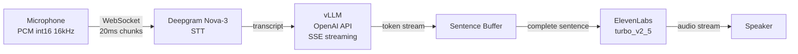
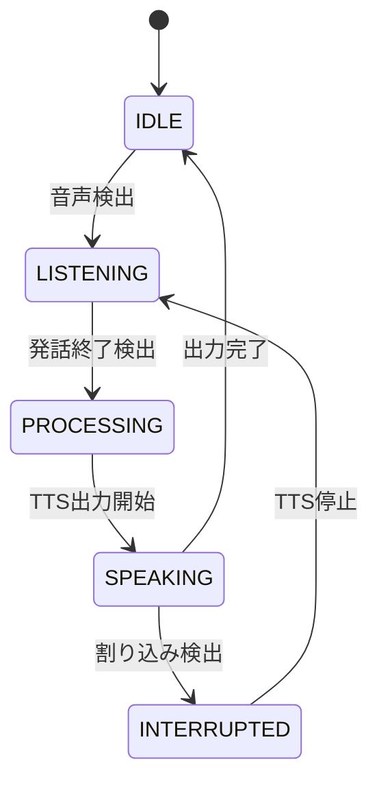

本記事は [Building Enterprise Realtime Voice Agents from Scratch: A Technical Tutorial (arXiv:2603.05413)](https://arxiv.org/abs/2603.05413) の解説記事です。

## 論文概要（Abstract）

Salesforce AI Researchによるエンタープライズ向けリアルタイム音声エージェント構築チュートリアルである。著者らはネイティブSpeech-to-Speech（S2S）モデルとカスケードアーキテクチャ（STT→LLM→TTS）を実測比較し、カスケード型がTime-To-First-Audio（TTFA）755msを達成する一方、Qwen2.5-Omni（S2S）は約13,200msを要しFunction Callingにも対応できないことを報告している。ストリーミングとパイプライニングの組み合わせが「リアルタイム」応答の鍵であることを実装レベルで示した論文である。

この記事は [Zenn記事: Gemini 3.8 Flash×Pipecatで銀行コールセンター音声ボットを構築する](https://zenn.dev/0h_n0/articles/f5fa1b28080393) の深掘りです。

## 情報源

- **arXiv ID**: 2603.05413
- **URL**: [https://arxiv.org/abs/2603.05413](https://arxiv.org/abs/2603.05413)
- **著者**: Jielin Qiu, Zixiang Chen, Liangwei Yang, et al.（Salesforce AI Research）
- **発表年**: 2026
- **分野**: cs.SD (Sound)
- **GitHub**: [https://github.com/SalesforceAIResearch/enterprise-realtime-voice-agent](https://github.com/SalesforceAIResearch/enterprise-realtime-voice-agent)

## 背景と動機（Background & Motivation）

エンタープライズ環境における音声エージェントには、低レイテンシ応答、Function Calling対応、そしてプロダクション品質のロバスト性が求められる。しかし、既存のアプローチには大きく2つの方向性があり、それぞれに課題がある。

ネイティブS2Sモデル（Qwen2.5-Omni等）は音声入力から音声出力を直接生成するが、著者らの実測ではTTFAが13秒を超え、Function Callingにも対応できない。エンタープライズ用途では外部ツール呼び出しが必須であり、この制約は致命的である。

カスケードアーキテクチャ（STT→LLM→TTS）は各コンポーネントを独立に選択・最適化できるが、ナイーブな逐次実行ではレイテンシが積み上がる。著者らはストリーミングとパイプライニングの設計でこの問題を解決し、755msのTTFAを実証している。

## 主要な貢献（Key Contributions）

- **貢献1**: ネイティブS2Sとカスケードアーキテクチャの定量的比較 --- Qwen2.5-Omni（バッチ: 約26.5秒、ストリーミング: 約13.2秒）とカスケード型（755ms）のTTFAを実測し、エンタープライズ用途ではカスケード型が約17倍高速であることを示した
- **貢献2**: ストリーミング＋パイプライニング設計の体系化 --- STT/LLM/TTSの各段をWebSocket/SSEによるストリーミングで接続し、Sentence Bufferで文単位のチャンク化を行うパイプライン設計を公開コードとともに提示
- **貢献3**: Silero VADと状態遷移モデルによる割り込み制御 --- 2MBモデルで32msチャンクあたり1ms未満のVAD推論を実現し、IDLE→LISTENING→PROCESSING→SPEAKING→IDLEの5状態遷移モデルを定義
- **貢献4**: Function Calling対応の病院受付シナリオ実装 --- OpenAI標準tool-use仕様によるマルチステップツールチェーンを音声エージェント上で動作させるリファレンス実装を公開

## 技術的詳細（Technical Details）

### カスケードアーキテクチャ全体像

著者らが提案するカスケードアーキテクチャは、3つのコアコンポーネントとSentence Bufferで構成される。



### STT: Deepgram Nova-3

音声入力はPCM int16形式、16kHzサンプリングレートで、20msごとのチャンクに分割してWebSocket経由でDeepgram Nova-3に送信される。1チャンクのサイズは以下の通りである。

$$
\text{chunk\_size} = \text{sample\_rate} \times \text{chunk\_duration} \times \text{bytes\_per\_sample} = 16000 \times 0.02 \times 2 = 640 \text{ bytes}
$$

ここで、
- $\text{sample\_rate} = 16000$ Hz: サンプリングレート
- $\text{chunk\_duration} = 0.02$ s: 20msチャンク
- $\text{bytes\_per\_sample} = 2$: PCM int16は1サンプル2バイト

Deepgramはストリーミング応答で部分的なtranscriptを逐次返し、`is_final=true`で確定テキストを通知する。論文Table 1によると、STTのP50レイテンシは337ms、平均320msである。

### LLM: vLLMによるストリーミング推論

確定したtranscriptはvLLM（OpenAI互換API）にSSEストリーミングで送信される。vLLMはトークン単位で逐次応答を返す。著者らはLLMのTime-To-First-Token（TTFT）のP50を337msと報告しているが、コールドスタートを含む平均は1,141ms、最大4,327msに達することも記載されている（論文Table 1）。

### Sentence Buffer

LLMが逐次出力するトークンストリームを直接TTSに流すと、不完全な文が合成されて不自然な音声になる。Sentence Bufferはトークンを蓄積し、句点（`.`、`!`、`?`）を検出した時点で完全な文としてTTSに送出する中間バッファである。

```python
class SentenceBuffer:
    """LLMトークンストリームを文単位でチャンク化するバッファ"""
    def __init__(self, delimiters: set[str] | None = None) -> None:
        self.buffer: str = ""
        self.delimiters: set[str] = delimiters or {".", "!", "?"}

    def add_token(self, token: str) -> str | None:
        """トークンを追加し、完全な文があれば返す"""
        self.buffer += token
        for delim in self.delimiters:
            if delim in self.buffer:
                sentence, self.buffer = self.buffer.rsplit(delim, 1)
                return sentence + delim
        return None
```

TTSは常に意味的に完結した文を受け取るため、自然なプロソディで合成が可能になる。

### TTS: ElevenLabs eleven_turbo_v2_5

文単位のテキストがElevenLabs APIに送信され、音声ストリームが返される。論文Table 1によると、TTS Time-To-First-Byte（TTFB）のP50は219ms、平均も219msと安定している。

### エンドツーエンドレイテンシの分析

パイプライン全体のTTFAは、各コンポーネントの初回応答時間の和で近似される。

$$
\text{TTFA} \approx T_{\text{STT}} + T_{\text{TTFT}} + T_{\text{SentBuffer}} + T_{\text{TTS\_TTFB}}
$$

ここで、
- $T_{\text{STT}}$: STTの最終transcript確定までの時間
- $T_{\text{TTFT}}$: LLMの最初のトークン生成時間
- $T_{\text{SentBuffer}}$: Sentence Bufferが最初の文を溜めるまでの時間
- $T_{\text{TTS\_TTFB}}$: TTSの最初の音声バイト生成時間

著者らはストリーミングパイプラインテストでTTFA 755msを実測しており、これは各段が逐次的に「待つ」のではなく、前段の出力が利用可能になった時点で次段が処理を開始するパイプライニング効果によるものである。

### Voice Activity Detection（VAD）

Silero VADは2MBのモデルで、32msチャンクあたり1ms未満の推論時間を実現する。著者らは以下の5状態遷移モデルを定義し、割り込み（barge-in）ではSPEAKING中にVADがユーザー音声を検出するとTTSを即停止して新発話を受け付ける。



## 実装のポイント（Implementation）

**WebSocketとSSEの使い分け**: STT（Deepgram）との通信にはWebSocketを使用し、双方向のリアルタイムストリーミングを実現している。一方、LLM（vLLM）にはSSE（Server-Sent Events）を使用し、HTTPベースの単方向ストリーミングで実装を簡素化している。WebSocketは音声バイナリの連続送信に適し、SSEはテキストトークンの逐次受信に適している。

**Function Callingの統合**: 著者らは病院受付シナリオ（予約確認、スケジュール、キャンセル等）でFunction Callingを実装している。OpenAI標準のtool-use仕様を採用しており、LLMがtool_callsを返した場合はツール実行結果をLLMに再送してマルチステップ対話を実現する。カスケード型ではLLMの入出力がテキストであるため、既存のFunction Calling実装をそのまま転用できる。

**チャンクサイズ選定**: 20msの音声チャンク（640バイト）は、レイテンシとネットワークオーバーヘッドのトレードオフにおいて適切な値である。チャンクが小さすぎるとWebSocketフレームの比率が増加し、大きすぎるとSTTの応答遅延が増す。

## Production Deployment Guide

本論文はリファレンス実装を公開しており、プロダクション環境への展開が可能である。以下では音声エージェントのAWS上でのデプロイパターンを解説する。

### AWS実装パターン（コスト最適化重視）

音声エージェントはリアルタイムのWebSocket接続を維持する必要があるため、Serverlessパターンには制約がある。以下のトラフィック量別構成を推奨する。

| 構成 | 同時接続 | 主要構成 | 月額概算 |
|---|---|---|---|
| **Small** | ~10 | ECS Fargate(1vCPU,2GB x2) + Deepgram API + Bedrock | **~$190** |
| **Medium** | ~50 | ECS Auto Scaling + g5.xlarge Spot(vLLM) | **~$1,100-1,500** |
| **Large** | ~500 | EKS + Karpenter + g5.2xlarge Spot x2-8 | **~$4,000-6,200** |

**Small内訳**: Fargate $73 + ALB $22 + Deepgram $18 + Bedrock $45 + ElevenLabs $22 + CloudWatch $10。**Large内訳**: EKS $73 + GPU Spot $548-2,190 + 音声ノード $220-880 + ALB+WAF $120 + Deepgram Enterprise $1,200 + ElevenLabs Enterprise $1,500 + Redis $130 + 監視 $80。

コスト試算は2026年9月時点のAWS ap-northeast-1料金に基づく概算値。Spot活用でGPUコストを最大90%削減可能。

### Terraformインフラコード

#### Small構成（ECS Fargate + Deepgram + Bedrock）

```hcl
# VPC（NAT Gateway 1台でコスト削減）
module "vpc" {
  source  = "terraform-aws-modules/vpc/aws"
  version = "~> 5.0"
  name = "voice-agent-vpc"
  cidr = "10.0.0.0/16"
  azs             = ["ap-northeast-1a", "ap-northeast-1c"]
  private_subnets = ["10.0.11.0/24", "10.0.12.0/24"]
  public_subnets  = ["10.0.1.0/24", "10.0.2.0/24"]
  enable_nat_gateway = true
  single_nat_gateway = true
}

# IAMロール（Bedrock StreamingのみAllow）
resource "aws_iam_role_policy" "bedrock_invoke" {
  role   = aws_iam_role.ecs_task_role.id
  policy = jsonencode({
    Version   = "2012-10-17"
    Statement = [{ Effect = "Allow",
      Action   = ["bedrock:InvokeModelWithResponseStream"],
      Resource = "arn:aws:bedrock:ap-northeast-1::foundation-model/anthropic.claude-*" }]
  })
}

# ECS Fargate（1vCPU, 2GB）
resource "aws_ecs_task_definition" "voice_agent" {
  family = "voice-agent"
  requires_compatibilities = ["FARGATE"]
  cpu = "1024"
  memory = "2048"
  task_role_arn = aws_iam_role.ecs_task_role.arn
  container_definitions = jsonencode([{
    name  = "voice-agent"
    image = "${aws_ecr_repository.voice_agent.repository_url}:latest"
    environment = [
      { name = "STT_PROVIDER", value = "deepgram" },
      { name = "LLM_PROVIDER", value = "bedrock" },
      { name = "TTS_PROVIDER", value = "elevenlabs" }
    ]
    secrets = [
      { name = "DEEPGRAM_API_KEY", valueFrom = aws_secretsmanager_secret.deepgram_api_key.arn },
      { name = "ELEVENLABS_API_KEY", valueFrom = aws_secretsmanager_secret.elevenlabs_api_key.arn }
    ]
  }])
}

# ALB: WebSocket接続のため idle_timeout=3600
resource "aws_lb" "voice_agent" {
  name               = "voice-agent-alb"
  load_balancer_type = "application"
  subnets            = module.vpc.public_subnets
  idle_timeout       = 3600
}
```

#### Large構成（EKS + Karpenter + GPU Spot）

```hcl
module "eks" {
  source          = "terraform-aws-modules/eks/aws"
  version         = "~> 20.0"
  cluster_name    = "voice-agent-prod"
  cluster_version = "1.31"
  vpc_id          = module.vpc.vpc_id
  subnet_ids      = module.vpc.private_subnets
  cluster_endpoint_public_access = false  # プライベートのみ
}

# Karpenter NodePool: GPU Spot優先、アイドル30秒で統合
resource "kubectl_manifest" "karpenter_gpu_provisioner" {
  yaml_body = yamlencode({
    apiVersion = "karpenter.sh/v1"
    kind       = "NodePool"
    metadata   = { name = "gpu-spot" }
    spec = {
      template = { spec = { requirements = [
        { key = "karpenter.sh/capacity-type", operator = "In", values = ["spot", "on-demand"] },
        { key = "node.kubernetes.io/instance-type", operator = "In", values = ["g5.xlarge", "g5.2xlarge"] }
      ] } }
      limits     = { cpu = "64", "nvidia.com/gpu" = "8" }
      disruption = { consolidationPolicy = "WhenEmptyOrUnderutilized", consolidateAfter = "30s" }
    }
  })
}

resource "aws_budgets_budget" "voice_agent" {
  name = "voice-agent-monthly"
  budget_type  = "COST"
  limit_amount = "6000"
  limit_unit   = "USD"
  time_unit    = "MONTHLY"
  notification {
    comparison_operator       = "GREATER_THAN"
    threshold                 = 80
    threshold_type            = "PERCENTAGE"
    notification_type         = "ACTUAL"
    subscriber_sns_topic_arns = [aws_sns_topic.alerts.arn]
  }
}
```

### 運用・監視設定

#### CloudWatch Logs Insights クエリ

```
# レイテンシ分析（P95, P99）- STT/LLM/TTS各段のボトルネック特定
fields @timestamp, component, latency_ms
| filter component in ["stt", "llm", "tts"]
| stats percentile(latency_ms, 50) as P50,
        percentile(latency_ms, 95) as P95,
        percentile(latency_ms, 99) as P99
  by component

# WebSocket接続異常検知（1時間あたり10件超でアラート）
fields @timestamp, event, connection_id
| filter event = "websocket_error" or event = "connection_dropped"
| stats count(*) as error_count by bin(1h) as hour
| filter error_count > 10
```

#### TTFA監視アラーム + X-Rayトレーシング

```python
import boto3
from aws_xray_sdk.core import xray_recorder, patch_all

patch_all()  # boto3, aiohttp 等の自動計装

cloudwatch = boto3.client("cloudwatch", region_name="ap-northeast-1")

def create_ttfa_alarm(threshold_ms: float = 2000.0) -> dict:
    """TTFA P95が閾値を超えた場合にSNS通知するアラームを作成する"""
    return cloudwatch.put_metric_alarm(
        AlarmName="voice-agent-ttfa-p95",
        MetricName="TTFA",
        Namespace="VoiceAgent/Latency",
        Statistic="p95",
        Period=300,
        EvaluationPeriods=3,
        Threshold=threshold_ms,
        ComparisonOperator="GreaterThanThreshold",
        AlarmActions=["arn:aws:sns:ap-northeast-1:ACCOUNT:voice-agent-alerts"],
    )

@xray_recorder.capture("process_utterance")
async def process_utterance(audio_chunk: bytes, session_id: str) -> bytes:
    """1発話の処理をX-Rayでトレースする（STT→LLM→TTS各段を可視化）"""
    xray_recorder.current_subsegment().put_annotation("session_id", session_id)
    with xray_recorder.in_subsegment("stt_deepgram"):
        transcript = await stt_client.transcribe(audio_chunk)
    with xray_recorder.in_subsegment("llm_inference"):
        response_tokens = await llm_client.generate_stream(transcript)
    with xray_recorder.in_subsegment("tts_elevenlabs"):
        audio_output = await tts_client.synthesize(response_tokens)
    return audio_output
```

**Cost Explorer日次レポート**: Lambda関数でCost Explorer APIを日次呼び出しし、サービス別コストを集計する。$200/日超過時にSNS通知を送信する構成が推奨される。

### コスト最適化チェックリスト

| カテゴリ | チェック項目 |
|---|---|
| **アーキテクチャ** | 同時接続数で構成選定（~10: Fargate / ~50: GPU / ~500: EKS） |
| | ALBアイドルタイムアウトを通話時間に合わせて調整 |
| **リソース** | GPU: Spot優先（g5.xlarge $0.38/h vs On-Demand $1.006/h） |
| | Reserved Instances 1年コミット（最大40%削減） |
| | Karpenterでアイドルノード自動統合（30s） |
| | ECS CPU/メモリの実使用量ベース最適化 |
| **外部API** | Deepgram/ElevenLabs Enterprise契約交渉 |
| | vLLM自前デプロイ vs Bedrock従量課金の分岐点算出 |
| | Prompt Caching有効化（30-90%削減） |
| **監視** | AWS Budgets月額上限アラート |
| | CloudWatch TTFA P95アラーム |
| | Cost Anomaly Detection有効化 |
| | 日次コストレポート（Lambda + Cost Explorer + SNS） |
| **管理** | ECRイメージ自動削除（ライフサイクルポリシー） |
| | Logsの保持期間設定（30日） |
| | タグ戦略（Project/Environment/Component） |
| | 開発環境の夜間スケールダウン |
| | Spot中断対策: Fargate Spotフォールバック |

## 実験結果（Results）

論文Table 1より、各コンポーネントのレイテンシ実測値を示す。

| コンポーネント | P50 | Mean | Min | Max |
|---|---|---|---|---|
| Deepgram STT | 337ms | 320ms | 192ms | 504ms |
| LLM TTFT (vLLM) | 337ms | 1,141ms* | 318ms | 4,327ms* |
| ElevenLabs TTS TTFB | 219ms | 219ms | 215ms | 226ms |
| E2E TTFA | 947ms | - | 729ms | - |

*コールドスタートを含む値。ストリーミングパイプラインテストでのTTFA実測値は755msであり、パイプライニング効果により個別レイテンシの単純和（893ms）より短縮されている。

ネイティブS2Sとの比較では、Qwen2.5-Omni（バッチ: 約26,500ms、ストリーミング: 約13,200ms）に対しカスケード型は755msと約17倍の改善を達成している。LLMのMean（1,141ms）とP50（337ms）の乖離はコールドスタート問題を示しており、プロダクション環境ではウォームアップが必要である。

## 実運用への応用（Practical Applications）

本論文のカスケードアーキテクチャは、関連Zenn記事で取り上げたPipecatと設計思想を共有しており、知見を直接活用できる。エンタープライズ応用では、著者らが実装した病院受付シナリオのようなFunction Calling統合が鍵であり、金融（口座照会）、カスタマーサポート（チケット起票）、ヘルスケア（予約管理）など外部システム連携が必須のドメインで利点が生きる。

スケーリング面では、STT/LLM/TTSを独立にスケールできる点もカスケード型の利点である。LLMボトルネック時はGPUインスタンス追加、STT/TTSは外部APIの従量課金で自動スケールする構成が可能である。

## 関連研究（Related Work）

- **Pipecat**: Daily.coが開発するOSSの音声AIフレームワーク。本論文と同様のカスケード構成を採用。Zenn記事で詳述
- **LiveKit Agents**: WebRTCベースの音声エージェントフレームワーク。本論文のWebSocketに対しP2P接続でレイテンシ削減を目指す
- **Qwen2.5-Omni**: AlibabaのネイティブS2Sモデル。本論文で比較対象として実測評価されカスケード型の優位性が示された

## まとめと今後の展望

本論文は、カスケードアーキテクチャ（STT→LLM→TTS）がネイティブS2Sモデルに対して約17倍のレイテンシ改善（755ms vs 13,200ms）とFunction Calling対応を両立できることを実証した。ストリーミングとパイプライニングの設計が「リアルタイム」を生むという知見は、音声エージェント構築の基本原則となりうる。今後S2Sモデルの高速化が進む可能性はあるが、各コンポーネントを独立に選択・スケールできるカスケード型の柔軟性は依然として重要である。

## 参考文献

- **arXiv**: [https://arxiv.org/abs/2603.05413](https://arxiv.org/abs/2603.05413)
- **Code**: [https://github.com/SalesforceAIResearch/enterprise-realtime-voice-agent](https://github.com/SalesforceAIResearch/enterprise-realtime-voice-agent)
- **Related Zenn article**: [https://zenn.dev/0h_n0/articles/f5fa1b28080393](https://zenn.dev/0h_n0/articles/f5fa1b28080393)
