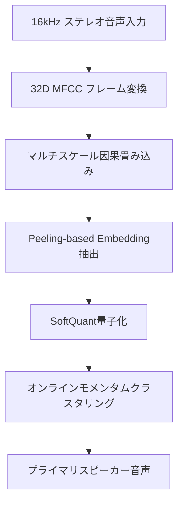
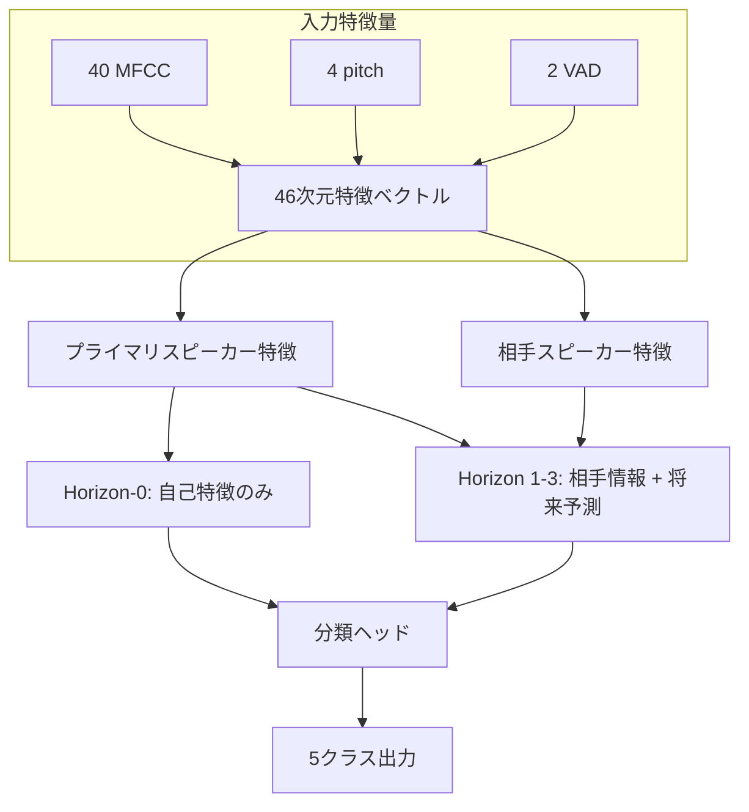
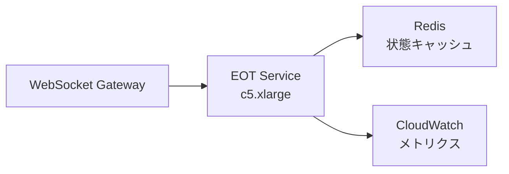
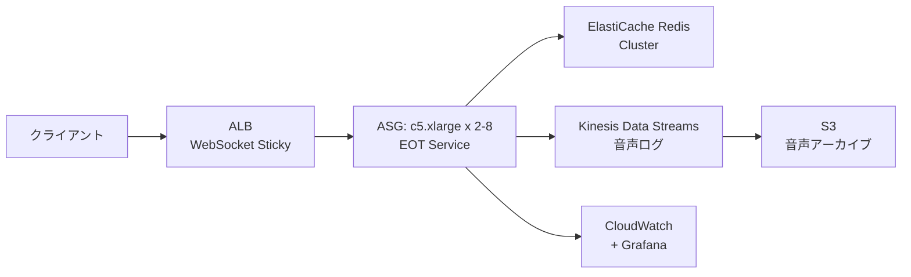
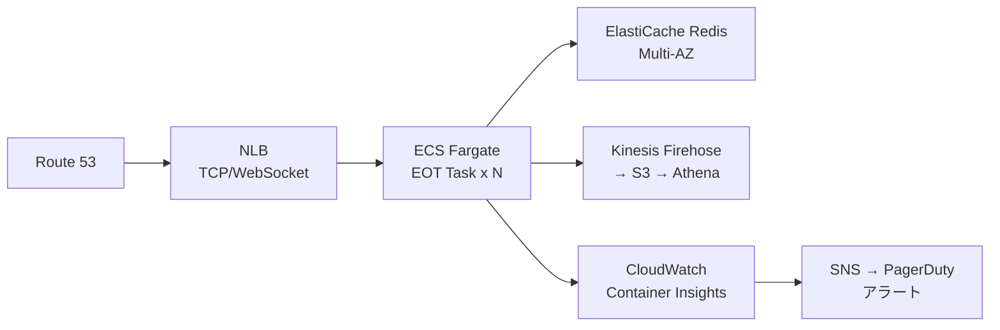

本記事は [A Hierarchical End-of-Turn Model with Primary Speaker Segmentation for Real-Time Conversational AI](https://arxiv.org/abs/2603.13379) の解説記事です。

## 論文概要

Helwaniらは、リアルタイム会話AIにおける発話終了（End-of-Turn, EOT）検出の精度とレイテンシを同時に改善するシステムを提案している。プライマリスピーカー分離モジュールと階層的EOT分類モデルを統合し、わずか1.14Mパラメータで82% F1（マルチクラスフレームレベル）を達成したと報告している。従来手法Smart Turn v3と比較して、レイテンシを36msまで短縮（約25倍の改善）しつつ、Recallを28.8ポイント向上させた。エッジデバイスでのリアルタイム推論を可能にする軽量設計が特徴である。

## 情報源

- **論文**: Karim Helwani, Hoang Do, James Luan, Sriram Srinivasan. "A Hierarchical End-of-Turn Model with Primary Speaker Segmentation for Real-Time Conversational AI." arXiv:2603.13379, 2026年3月10日.
- **分野**: cs.LG, cs.SD
- **URL**: [https://arxiv.org/abs/2603.13379](https://arxiv.org/abs/2603.13379)

## 背景と動機

音声対話システムにおいて、ユーザの発話が終了したタイミング（End-of-Turn）を正確かつ低遅延で検出することは、自然な対話体験の実現に不可欠である。EOT検出が遅れると応答までの待ち時間が増加し、早すぎると発話途中での割り込みが発生する。

従来のEOT検出手法には大きく2つの課題があった。第一に、Smart Turn v3のような既存モデルは8-12Mパラメータと大きく、推論レイテンシが900msに達するため、リアルタイム対話の要件を満たせない。第二に、複数話者が同時に発話するマルチスピーカー環境では、誰の発話終了を検出すべきかという問題（プライマリスピーカー識別）が未解決であった。

著者らは、これらの課題をプライマリスピーカー分離と階層的EOT検出の統合的アプローチで解決することを試みている。軽量な因果畳み込みとLSTMベースのアーキテクチャにより、エッジデバイス上でのリアルタイム動作を実現しつつ、既存手法を上回る検出精度を目指している。

## 主要な貢献

著者らが主張する本論文の貢献は以下の通りである。

1. **プライマリスピーカー分離とEOT検出の統合**: マルチスピーカー環境において、対話の主体となるスピーカーを自動識別し、そのスピーカーに特化したEOT検出を行う統合システムを構築した
2. **階層的マルチホライズン予測**: 現在時刻に加え、10ms/20ms/30ms先の将来状態を同時予測する階層構造により、EOT検出の頑健性を向上させた
3. **知識蒸留による軽量化**: wav2vec 2.0の768次元表現を32次元に圧縮する知識蒸留パイプラインにより、精度を維持しつつモデルサイズを大幅に削減した
4. **エッジデプロイ可能な設計**: 1.14Mパラメータ、フレームあたり1.5-2.0ms（モダンCPU）、ストリーミング活性化メモリ200kB未満という制約を満たす実用的な設計を実現した

## 技術的詳細

### プライマリスピーカー分離モジュール

プライマリスピーカー分離は、マルチスピーカー音声から対話の主体となるスピーカーの音声を抽出する前処理モジュールである。処理パイプラインは以下の通りである。



入力の16kHzステレオ音声を32次元MFCCフレームに変換した後、マルチスケール因果畳み込みで時間方向の特徴を抽出する。Peeling-basedアルゴリズムによるembedding抽出とSoftQuant量子化を経て、オンラインモメンタムクラスタリングでスピーカーを分離する。

クラスタリングにはcosine similarity閾値 $\theta = 0.7$、モメンタム係数 $\alpha = 0.9$ が用いられており、著者らはEER（Equal Error Rate）が約10%、SIR（Signal-to-Interference Ratio）が10dBを超える条件で誤分離率8%未満と報告している。

### 階層的EOTモデル

EOTモデルは100Hzフレームレートで動作し、各フレームを5クラス（Initial, Speech, Interim, Final, Backchannel）に分類する。



入力特徴量は46次元で構成される。40次元MFCC、4次元ピッチ特徴量、2次元VAD（Voice Activity Detection）特徴量を結合したものである。

階層構造は4段階のホライズンで構成される。

- **Horizon-0**: 現在フレームの自己特徴のみを用いた因果的予測
- **Horizon-1**: 相手スピーカー情報を加え、$t + 10\text{ms}$ 先を予測
- **Horizon-2**: $t + 20\text{ms}$ 先を予測
- **Horizon-3**: $t + 30\text{ms}$ 先を予測

### 分類ヘッドのアーキテクチャ

分類ヘッドは以下の構成である。

$$
\text{Input}(55\text{D}) \rightarrow \text{MLP}(256 \rightarrow 128) \rightarrow \text{LSTM}_{2\text{layers}}(h=128) \rightarrow \text{Output}
$$

合計パラメータ数は約1.14M、計算量は約111 MMIPS、モデルサイズはfp32で約4.56MBである。

### 損失関数

著者らはToeplitz-style lossを採用し、各ホライズンに重みを設定している。

$$
\mathcal{L} = \sum_{i=0}^{3} w_i \cdot \mathcal{L}_{\text{CE}}^{(i)}
$$

ここで、ホライズン重みは $w_0 = 1.0$、$w_1 = 0.5$、$w_2 = 0.25$、$w_3 = 0.1$ と設定されている。現在フレームの予測を最重要視しつつ、将来予測には段階的に小さい重みを付与する設計である。

### 知識蒸留

Teacherモデルとしてwav2vec 2.0（768次元出力）を用い、MLPで32次元に変換した表現をターゲットとする。Studentモデルは20次元MFCCを入力とし、因果畳み込みで32次元表現を学習する。

蒸留損失は3つの損失関数の加重和で構成される。

$$
\mathcal{L}_{\text{distill}} = 0.5 \cdot \mathcal{L}_{L1} + 0.3 \cdot \mathcal{L}_{L2} + 0.2 \cdot \mathcal{L}_{\cos}
$$

L1損失がスパースな特徴の整合性を、L2損失が全体的な距離を、cosine損失が方向の一致を担保する。

### Anti-Shortcutオーグメンテーション

モデルがショートカット学習に陥ることを防ぐため、2つのデータオーグメンテーション手法が導入されている。

1. **Label time-shift jitter**: EOT境界位置を0-1秒の範囲でランダムにずらし、固定的なタイミングパターンへの過適合を防止する
2. **Channel dropout**: スピーカーチャネルを独立にゼロ化し、特定チャネルへの依存を低減する

## 実装のポイント

本論文のアーキテクチャを実装する際の重要なポイントを以下に整理する。

**因果畳み込みの実装**: 全ての畳み込み層は因果的（causal）でなければならない。未来のフレーム情報を参照しないよう、左パディングのみを適用する。PyTorchでは`nn.Conv1d`に対して手動で左パディングを設定する必要がある。

**ストリーミング処理**: LSTMの隠れ状態を保持しつつフレーム単位で逐次処理するストリーミングアーキテクチャが必要である。バッチ推論とは異なり、各フレーム到着時に即座に予測を出力するため、状態管理の実装が重要となる。

**量子化**: SoftQuant量子化によりembeddingのメモリフットプリントを削減している。INT8やfp16への量子化を併用することで、エッジデバイスでの推論効率をさらに向上できる。

**メモリ制約**: ストリーミング活性化メモリを200kB未満に抑える設計が求められる。LSTMの隠れ状態サイズ（128次元 x 2層 x fp32 = 1KB）は小さいが、MFCCの計算バッファやクラスタリングのセントロイド保持に注意が必要である。

## Production Deployment Guide

### アーキテクチャパターン

本モデルをプロダクション環境に展開する際の3つの構成パターンを示す。論文で報告されているフレームあたり1.5-2.0ms（モダンCPU）の推論速度と200kB未満のメモリフットプリントを前提とした設計である。

#### Small構成: 単一インスタンス（同時10セッション以下）



- **ユースケース**: 社内PoC、小規模コールセンター
- **インスタンス**: c5.xlarge (4 vCPU, 8GB RAM)
- **同時セッション**: ~10
- **月額コスト概算**: ~$130 (EC2) + ~$15 (Redis t3.micro) + ~$10 (CloudWatch) = **~$155/月**

#### Medium構成: ALB + Auto Scaling（同時100-500セッション）



- **ユースケース**: 中規模コールセンター、音声ボットサービス
- **Auto Scaling**: CPU使用率60%をターゲット
- **同時セッション**: ~500（インスタンスあたり~60セッション）
- **月額コスト概算**: ~$50 (ALB) + ~$520-2080 (EC2 ASG 2-8台) + ~$130 (ElastiCache) + ~$50 (Kinesis) + ~$30 (S3) + ~$20 (CloudWatch) = **~$800-2,360/月**

#### Large構成: ECS Fargate + マルチAZ（同時1000セッション以上）



- **ユースケース**: 大規模音声プラットフォーム、通信事業者
- **ECS Task**: 1 vCPU, 2GB RAM（モデルサイズ4.56MB fp32に対して十分）
- **同時セッション**: 1000+（Taskあたり~30セッション、水平スケール）
- **月額コスト概算**: ~$30 (NLB) + ~$1,500-4,500 (Fargate 30-100 Task) + ~$400 (ElastiCache Multi-AZ) + ~$100 (Kinesis Firehose) + ~$50 (S3) + ~$50 (監視) = **~$2,130-5,130/月**

### Terraformインフラコード

Medium構成を例に、主要リソースのTerraformコードを示す。

```hcl
# --- VPC & Networking ---
module "vpc" {
  source  = "terraform-aws-modules/vpc/aws"
  version = "~> 5.0"

  name = "eot-service-vpc"
  cidr = "10.0.0.0/16"

  azs             = ["ap-northeast-1a", "ap-northeast-1c"]
  private_subnets = ["10.0.1.0/24", "10.0.2.0/24"]
  public_subnets  = ["10.0.101.0/24", "10.0.102.0/24"]

  enable_nat_gateway = true
  single_nat_gateway = true
}

# --- ALB for WebSocket ---
resource "aws_lb" "eot_alb" {
  name               = "eot-service-alb"
  internal           = false
  load_balancer_type = "application"
  subnets            = module.vpc.public_subnets

  tags = { Service = "eot-detection" }
}

resource "aws_lb_target_group" "eot_tg" {
  name     = "eot-service-tg"
  port     = 8080
  protocol = "HTTP"
  vpc_id   = module.vpc.vpc_id

  stickiness {
    type            = "lb_cookie"
    cookie_duration = 3600
    enabled         = true
  }

  health_check {
    path                = "/health"
    interval            = 10
    timeout             = 5
    healthy_threshold   = 2
    unhealthy_threshold = 3
  }
}

# --- Auto Scaling Group ---
resource "aws_launch_template" "eot_lt" {
  name_prefix   = "eot-service-"
  image_id      = data.aws_ami.al2023.id
  instance_type = "c5.xlarge"

  user_data = base64encode(templatefile("${path.module}/userdata.sh", {
    model_s3_path = var.model_s3_path
  }))

  tag_specifications {
    resource_type = "instance"
    tags = { Service = "eot-detection" }
  }
}

resource "aws_autoscaling_group" "eot_asg" {
  name                = "eot-service-asg"
  desired_capacity    = 2
  min_size            = 2
  max_size            = 8
  vpc_zone_identifier = module.vpc.private_subnets
  target_group_arns   = [aws_lb_target_group.eot_tg.arn]

  launch_template {
    id      = aws_launch_template.eot_lt.id
    version = "$Latest"
  }

  tag {
    key                 = "Service"
    value               = "eot-detection"
    propagate_at_launch = true
  }
}

resource "aws_autoscaling_policy" "eot_cpu_target" {
  name                   = "eot-cpu-target-tracking"
  autoscaling_group_name = aws_autoscaling_group.eot_asg.name
  policy_type            = "TargetTrackingScaling"

  target_tracking_configuration {
    predefined_metric_specification {
      predefined_metric_type = "ASGAverageCPUUtilization"
    }
    target_value = 60.0
  }
}

# --- ElastiCache Redis ---
resource "aws_elasticache_replication_group" "eot_redis" {
  replication_group_id = "eot-session-cache"
  description          = "Session state cache for EOT service"
  node_type            = "cache.r6g.large"
  num_cache_clusters   = 2
  subnet_group_name    = aws_elasticache_subnet_group.eot.name

  at_rest_encryption_enabled = true
  transit_encryption_enabled = true
}

resource "aws_elasticache_subnet_group" "eot" {
  name       = "eot-redis-subnet"
  subnet_ids = module.vpc.private_subnets
}

# --- CloudWatch Alarms ---
resource "aws_cloudwatch_metric_alarm" "eot_latency_high" {
  alarm_name          = "eot-p99-latency-high"
  comparison_operator = "GreaterThanThreshold"
  evaluation_periods  = 3
  metric_name         = "EOTInferenceLatencyP99"
  namespace           = "EOTService"
  period              = 60
  statistic           = "Maximum"
  threshold           = 50
  alarm_description   = "EOT inference P99 latency exceeds 50ms"
  alarm_actions       = [aws_sns_topic.alerts.arn]
}

resource "aws_cloudwatch_metric_alarm" "eot_error_rate" {
  alarm_name          = "eot-error-rate-high"
  comparison_operator = "GreaterThanThreshold"
  evaluation_periods  = 2
  metric_name         = "EOTErrorRate"
  namespace           = "EOTService"
  period              = 300
  statistic           = "Average"
  threshold           = 0.01
  alarm_description   = "EOT error rate exceeds 1%"
  alarm_actions       = [aws_sns_topic.alerts.arn]
}

resource "aws_sns_topic" "alerts" {
  name = "eot-service-alerts"
}
```

### 運用・監視設定

EOTモデルの運用では、以下のメトリクスを重点的に監視する必要がある。

**推論レイテンシ**: 論文で報告されている36msの推論レイテンシはモデル推論のみの値であり、実運用ではネットワーク遅延や前処理時間が加算される。P50/P95/P99レイテンシを計測し、P99が50msを超えた場合にアラートを発火する設計が推奨される。

**フレーム処理落ち率**: 100Hzフレームレートに対して処理が追いつかない場合、フレームドロップが発生する。ドロップ率が1%を超えるとEOT検出精度に影響するため、スケールアウトのトリガーとすべきである。

**EOTイベント分布**: 5クラス（Initial, Speech, Interim, Final, Backchannel）の予測分布を監視する。Finalの割合が急増する場合は早期カットオフ、減少する場合は応答遅延の兆候である。

**スピーカー分離精度**: EERとSIRをリアルタイムで計測することは困難であるが、クラスタリングのセントロイド数や切り替え頻度を監視することで、分離品質の劣化を間接的に検出できる。

```yaml
# CloudWatch Dashboard定義（抜粋）
widgets:
  - type: metric
    properties:
      title: "EOT Inference Latency"
      metrics:
        - ["EOTService", "InferenceLatencyMs", "Stat", "p50"]
        - ["EOTService", "InferenceLatencyMs", "Stat", "p95"]
        - ["EOTService", "InferenceLatencyMs", "Stat", "p99"]
      period: 60
      stat: Average

  - type: metric
    properties:
      title: "Frame Drop Rate"
      metrics:
        - ["EOTService", "FrameDropRate"]
      period: 60
      stat: Average
      annotations:
        horizontal:
          - value: 0.01
            label: "Alert Threshold"

  - type: metric
    properties:
      title: "EOT Class Distribution"
      metrics:
        - ["EOTService", "ClassCount", "Class", "Initial"]
        - ["EOTService", "ClassCount", "Class", "Speech"]
        - ["EOTService", "ClassCount", "Class", "Interim"]
        - ["EOTService", "ClassCount", "Class", "Final"]
        - ["EOTService", "ClassCount", "Class", "Backchannel"]
      period: 300
      stat: Sum
```

### コスト最適化チェックリスト

- [ ] **Graviton3インスタンス (c7g) の検討**: 整数演算中心のMFCC計算とLSTM推論はArm Neonで効率よく実行可能。c5.xlargeからc7g.xlargeへの変更で約20%のコスト削減が見込まれる
- [ ] **Savings Plans / Reserved Instances**: ベースライン負荷に対してCompute Savings Plans (1年/3年) を適用。Medium構成の最小2台に対して適用すると約30-40%の削減
- [ ] **モデル量子化 (INT8/fp16)**: fp32 (4.56MB) からINT8 (約1.14MB) への量子化により、1インスタンスあたりの同時セッション数を増加可能
- [ ] **スポットインスタンス混在**: スケールアウト分にスポットインスタンスを混在させる。EOTの状態はRedisに保持されるため、スポット中断時の再接続で復旧可能
- [ ] **音声ログのライフサイクルポリシー**: S3 Intelligent-Tieringまたは30日後にGlacierへ移行し、ストレージコストを削減
- [ ] **リージョン選択**: 東京リージョン (ap-northeast-1) は北米リージョンと比較して約10-15%割高。レイテンシ要件が許容する場合はus-west-2も検討

## 実験結果

著者らが報告しているベンチマーク結果を以下にまとめる。

| 指標 | 提案手法 | Smart Turn v3 | 改善幅 |
|---|---|---|---|
| Recall | 87.7% | 58.9% | +28.8pp |
| Precision | 57.2% | 68.4% | -11.2pp |
| F1 | 69.3% | 63.3% | +6.0pp |
| レイテンシ | 36ms | 900ms | 約25倍低減 |
| パラメータ数 | 1.14M | 8-12M | 約8-10倍削減 |

Recallが87.7%と大幅に向上している一方、Precisionは57.2%とSmart Turn v3の68.4%を下回っている。これは提案手法がより積極的にEOTを検出する傾向があることを示唆している。著者らは、リアルタイム対話システムにおいてはRecallの向上（発話終了の見逃し削減）がPrecisionの低下（誤検出の増加）よりも重要であると主張している。

F1スコアでは6.0ポイントの改善を達成しており、Recall-Precisionのトレードオフを考慮しても総合的な検出性能が向上していると報告されている。マルチクラスフレームレベルでの82% F1は、5クラス分類タスクとして高い精度である。

レイテンシについては、36ms対900msと約25倍の差がある。この差はモデルサイズ（1.14M vs 8-12M）とアーキテクチャの違いに起因する。提案手法はフレームあたり1.5-2.0ms（モダンCPU）で推論可能であり、100Hzフレームレートの10ms間隔に対して十分な余裕がある。

## 実運用への応用

本論文の手法は、以下の実運用シナリオに適用可能である。

**音声対話ボット**: コールセンターや音声アシスタントにおいて、36msのEOTレイテンシはユーザに「即座に応答が返ってくる」という体験を提供する。関連Zenn記事「[Gemini 3.8 Flash x Pipecatで銀行コールセンター音声ボットを構築する](https://zenn.dev/0h_n0/articles/f5fa1b28080393)」で紹介されているPipecatフレームワークと組み合わせることで、EOT検出部分を本モデルに置き換え、応答開始までの遅延を削減できる可能性がある。

**エッジデバイス展開**: ストリーミング活性化メモリが200kB未満であるため、スマートスピーカーや車載システムなど、リソース制約のあるエッジデバイスでの動作が想定される。クラウドへの音声送信なしにローカルでEOT判定を行えるため、プライバシーとレイテンシの両面で優位性がある。

**マルチスピーカー環境**: プライマリスピーカー分離モジュールにより、会議システムやグループ通話において、現在の主発話者を識別した上でのEOT検出が可能となる。ただし、著者らが報告しているEER約10%は、ノイジーな環境ではさらに悪化する可能性があり、実環境での検証が必要である。

## 関連研究

EOT検出の先行研究として、著者らはSmart Turnシリーズ（v1-v3）を主要なベースラインとして位置づけている。Smart Turn v3は8-12Mパラメータの大規模モデルであり、Transformer系アーキテクチャを採用している。

スピーカー分離の分野では、ECAPA-TDNNやResNet系のスピーカー埋め込みモデルが広く用いられているが、本論文はリアルタイム制約に対応するため、より軽量なPeeling-basedアプローチを採用している。知識蒸留については、wav2vec 2.0を教師モデルとして用いる手法がASR（自動音声認識）分野で広く検討されており、本研究はこれをEOT検出タスクに応用した点に新規性がある。

## まとめ

Helwaniらは、プライマリスピーカー分離と階層的EOT検出を統合した軽量モデルを提案し、1.14Mパラメータ・36msレイテンシでSmart Turn v3（8-12Mパラメータ・900msレイテンシ）を上回るRecallとF1を達成したと報告している。エッジデバイスでのリアルタイム動作を可能にする設計は、音声対話システムの応答性向上に寄与する。一方、Precisionの低下はFalse Positiveの増加を意味し、実運用では後段の対話管理モジュールでの補正が必要となる可能性がある。階層的マルチホライズン予測とAnti-Shortcutオーグメンテーションという設計上の工夫は、他の時系列分類タスクにも応用可能な知見である。

## 参考文献

1. Helwani, K., Do, H., Luan, J., & Srinivasan, S. (2026). A Hierarchical End-of-Turn Model with Primary Speaker Segmentation for Real-Time Conversational AI. *arXiv preprint arXiv:2603.13379*. [https://arxiv.org/abs/2603.13379](https://arxiv.org/abs/2603.13379)
2. Baevski, A., Zhou, Y., Mohamed, A., & Auli, M. (2020). wav2vec 2.0: A Framework for Self-Supervised Learning of Speech Representations. *Advances in Neural Information Processing Systems*, 33. [https://arxiv.org/abs/2006.11477](https://arxiv.org/abs/2006.11477)
3. Desplanques, B., Thienpondt, J., & Demuynck, K. (2020). ECAPA-TDNN: Emphasized Channel Attention, Propagation and Aggregation in TDNN Based Speaker Verification. *Interspeech 2020*. [https://arxiv.org/abs/2005.07143](https://arxiv.org/abs/2005.07143)
