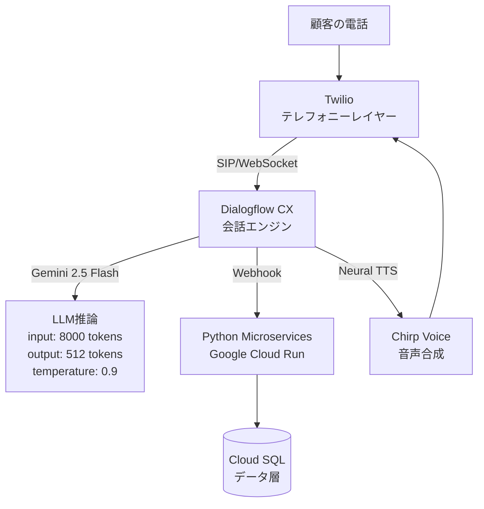
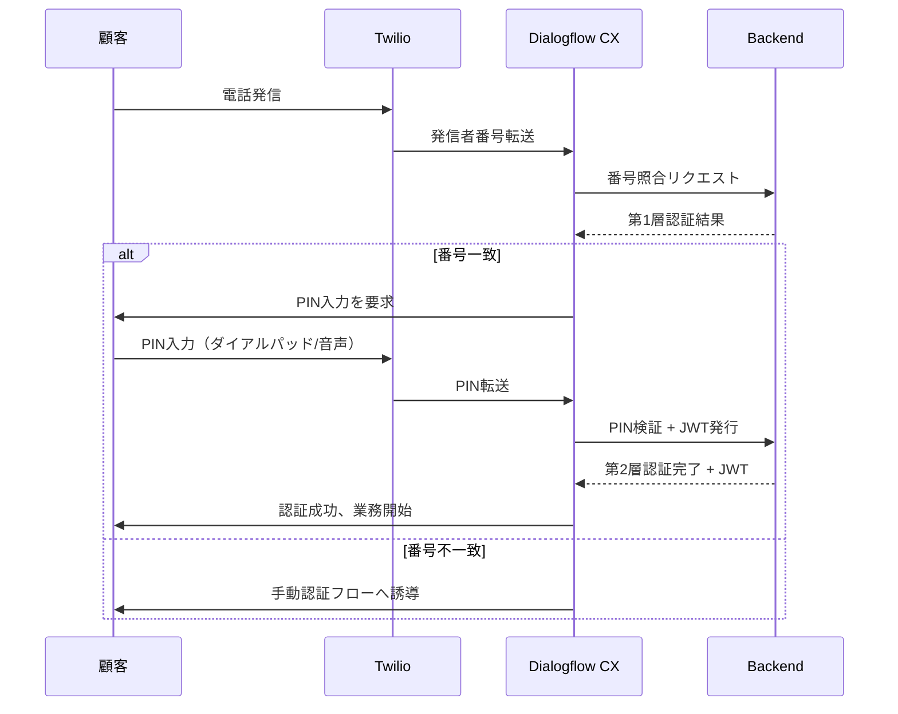

本記事は [Telephony Voice Agent for Banking Services (arXiv:2606.28779)](https://arxiv.org/abs/2606.28779) の解説記事です。

## 論文概要（Abstract）

著者らは、Google Conversational Agent（Dialogflow CX）とGemini 2.5 Flash、Twilioテレフォニーを組み合わせた銀行業務向け音声エージェントシステムを提案している。残高照会、取引履歴の確認、カードの有効化・停止といった典型的な銀行業務を電話回線経由で自動処理するシステムであり、Playbook構造による会話フロー管理と2層認証によるセキュリティを備えている。実験では平均応答レイテンシ1.12秒、タスク完了率90%、稼働率99.9%を達成したと報告されている。

この記事は [Zenn記事: Gemini 3.8 Flash×Pipecatで銀行コールセンター音声ボットを構築する](https://zenn.dev/0h_n0/articles/f5fa1b28080393) の深掘りです。

## 情報源

- **arXiv ID**: 2606.28779
- **URL**: [https://arxiv.org/abs/2606.28779](https://arxiv.org/abs/2606.28779)
- **著者**: Nitya Dhagat, Vipul K. Dabhi, Harshadkumar B. Prajapati, Zankhana J. Barad
- **発表年**: 2026
- **分野**: cs.HC（Human-Computer Interaction）

## 背景と動機（Background & Motivation）

銀行のコールセンターは依然として顧客接点の重要チャネルであるが、待ち時間の長さ、24時間対応の人件費、オペレータの業務負荷といった課題を抱えている。IVR（Interactive Voice Response）は長年利用されてきたものの、固定的なメニューツリーに基づくため柔軟性に乏しく、顧客満足度の低下要因となっていた。

著者らは、LLM（大規模言語モデル）とクラウドテレフォニーの進展により、自然言語での対話が可能な音声エージェントの構築が現実的になったと指摘している。特にDialogflow CXのPlaybook機能とGeminiモデルの組み合わせにより、従来のインテントベースの設計では困難だった複合的な会話フローの管理が可能になったとしている。本論文は、こうしたコンポーネントを統合し、実用レベルの銀行向け音声エージェントを構築・評価した実装研究である。

## 主要な貢献（Key Contributions）

- **貢献1**: Dialogflow CX Playbook + Gemini 2.5 Flash + Twilioを統合した銀行向け音声エージェントアーキテクチャの設計と実装
- **貢献2**: Task PlaybookとRoutine Playbookの2層構造による会話フロー管理手法の提案。個別業務操作をTask Playbookで定義し、複合シナリオをRoutine Playbookでオーケストレーションする
- **貢献3**: 発信者番号の自動検証とPIN入力による2層認証メカニズムの実装。JWT認証と監査ログを組み合わせたセキュリティ設計
- **貢献4**: レイテンシ、タスク完了率、割り込み処理成功率、ノイズ耐性など多角的な評価指標による実験的検証

## 技術的詳細（Technical Details）

### システムアーキテクチャ

著者らが提案するシステムは、4つのレイヤで構成されている。



**テレフォニーレイヤー**: Twilioが電話回線とDialogflow CXの間のブリッジとして機能する。音声ストリームをリアルタイムでDialogflow CXに転送し、合成音声を発信者に返す。

**会話エンジン**: Dialogflow CXがPlaybook機能を介してGemini 2.5 Flashを呼び出す。論文ではinput 8000トークン、output 512トークン、temperature 0.9という設定が報告されている。temperatureが比較的高い値に設定されている点について、著者らは自然な会話応答の生成を意図したものとしている。

**バックエンド**: Python microservicesがGoogle Cloud Run上で稼働し、Dialogflow CXからのWebhookリクエストを処理する。口座情報の取得、取引処理、カード操作などのビジネスロジックを担当する。

**音声合成**: Chirp voice（Google Neural TTS）が応答テキストを自然な音声に変換する。

### Playbook構造

Playbook構造は本論文の設計上の核となる概念である。著者らは2種類のPlaybookを定義している。

**Task Playbook**: 個別の銀行業務に対応する単位操作を定義する。例えば残高照会、取引履歴の取得、カードの有効化・停止などがそれぞれ独立したTask Playbookとして実装される。各Task Playbookは入力パラメータ、実行手順、バックエンドAPIの呼び出し、応答テンプレートを含む。

**Routine Playbook**: 複数のTask Playbookを組み合わせた複合シナリオを管理する。例えば「残高を確認してから振込を実行する」といったマルチステップの会話フローをオーケストレーションする。Routine PlaybookがどのTask Playbookをどの順序で呼び出すかを制御し、コンテキストの受け渡しを管理する。

### 認証メカニズム



- **第1層**: 発信者番号（Caller ID）の自動検証。Twilioが転送する発信者番号をバックエンドのデータベースと照合する
- **第2層**: PIN入力による本人確認。ダイアルパッド入力と音声入力の両方に対応する
- **セッション管理**: JWT（JSON Web Token）による認証状態の管理と、全操作の監査ログ記録

## 実装のポイント（Implementation）

論文から読み取れる実装上の重要な設計判断を整理する。

**Geminiモデルのパラメータ設計**: input 8000トークン、output 512トークンという非対称な設定は、電話音声エージェントの特性を反映している。入力側は会話履歴とPlaybook指示を保持するために十分な長さが必要だが、出力は音声合成される短い応答で足りる。temperature 0.9は会話の自然さを優先した設定であり、銀行業務の正確性とのトレードオフが生じうる。

**Cloud Runの選択**: サーバーレス実行環境であるCloud Runを採用することで、同時セッション数に応じたオートスケーリングが可能になっている。論文では同時5セッションの処理が報告されているが、Cloud Runのスケーリング特性上、より多くのセッションへの拡張も可能と考えられる。

**割り込み処理（Barge-in）**: 音声エージェント特有の課題として、ユーザがシステムの発話中に割り込む状況への対処がある。論文では95%の割り込み処理成功率が報告されており、Dialogflow CXのbarge-in機能が適切に動作していることが示唆される。

**ノイズ耐性**: 電話環境特有のノイズに対し、認識精度の低下が5%にとどまったと報告されている。これはChirp voiceのノイズ除去機能と、Geminiの音声認識のロバスト性によるものと考えられる。

## Production Deployment Guide

本論文はGoogle Cloud上での実装を前提としているが、AWSでの実装パターンを以下に示す。音声エージェントシステムの中核要素であるテレフォニー統合、LLM推論、バックエンドAPI、データ永続化を、AWSの各サービスにマッピングする。

### AWS実装パターン（コスト最適化重視）

**トラフィック量別の推奨構成**:

**Small構成（~100通話/日）**: Lambda + Amazon Bedrock + DynamoDB
- テレフォニー: Amazon Connect（またはTwilio継続利用）
- LLM推論: Amazon Bedrock（Claude 3.5 SonnetまたはNova）
- バックエンド: AWS Lambda（Python 3.12、メモリ512MB）
- データ層: DynamoDB（オンデマンドキャパシティ）
- 音声合成: Amazon Polly Neural
- 月額概算: $200-500（通話料別、Bedrock従量課金含む）

**Medium構成（~1,000通話/日）**: ECS Fargate + Bedrock + Aurora Serverless
- テレフォニー: Amazon Connect + Contact Lens
- LLM推論: Amazon Bedrock（Prompt Caching有効化）
- バックエンド: ECS Fargate（vCPU 0.5、メモリ1GB、タスク2-4）
- データ層: Aurora Serverless v2（PostgreSQL互換）
- 音声合成: Amazon Polly Neural + SSML制御
- キャッシュ: ElastiCache（Redis、cache.t4g.micro）
- 月額概算: $800-2,000

**Large構成（10,000+通話/日）**: EKS + Karpenter + Bedrock + Aurora
- テレフォニー: Amazon Connect + Contact Lens + Lex Bot
- LLM推論: Amazon Bedrock（Cross-Region Inference、Batch API併用）
- バックエンド: EKS（Karpenter + Spot Instances）
- データ層: Aurora PostgreSQL（Multi-AZ、リードレプリカ）
- 音声合成: Amazon Polly Neural + 事前生成キャッシュ
- キャッシュ: ElastiCache Cluster（Redis、cache.r7g.large）
- 監視: CloudWatch + X-Ray + Cost Anomaly Detection
- 月額概算: $3,000-8,000

### Terraformインフラコード

**Small構成（Serverless）**:

```hcl
# Small構成: Lambda + Bedrock + DynamoDB
terraform {
  required_version = ">= 1.5"
  required_providers {
    aws = {
      source  = "hashicorp/aws"
      version = "~> 5.0"
    }
  }
}

provider "aws" {
  region = "ap-northeast-1"
}

# DynamoDB - セッション管理・通話履歴
resource "aws_dynamodb_table" "voice_sessions" {
  name         = "voice-agent-sessions"
  billing_mode = "PAY_PER_REQUEST"
  hash_key     = "session_id"
  range_key    = "created_at"

  attribute {
    name = "session_id"
    type = "S"
  }

  attribute {
    name = "created_at"
    type = "S"
  }

  attribute {
    name = "caller_id"
    type = "S"
  }

  global_secondary_index {
    name            = "caller-index"
    hash_key        = "caller_id"
    projection_type = "ALL"
  }

  point_in_time_recovery {
    enabled = true
  }

  ttl {
    attribute_name = "expires_at"
    enabled        = true
  }
}

# IAM Role - Lambda実行
resource "aws_iam_role" "lambda_role" {
  name = "voice-agent-lambda-role"

  assume_role_policy = jsonencode({
    Version = "2012-10-17"
    Statement = [{
      Action = "sts:AssumeRole"
      Effect = "Allow"
      Principal = {
        Service = "lambda.amazonaws.com"
      }
    }]
  })
}

resource "aws_iam_role_policy" "lambda_policy" {
  name = "voice-agent-lambda-policy"
  role = aws_iam_role.lambda_role.id

  policy = jsonencode({
    Version = "2012-10-17"
    Statement = [
      {
        Effect = "Allow"
        Action = [
          "bedrock:InvokeModel",
          "bedrock:InvokeModelWithResponseStream"
        ]
        Resource = "arn:aws:bedrock:ap-northeast-1::foundation-model/*"
      },
      {
        Effect = "Allow"
        Action = [
          "dynamodb:GetItem",
          "dynamodb:PutItem",
          "dynamodb:UpdateItem",
          "dynamodb:Query"
        ]
        Resource = [
          aws_dynamodb_table.voice_sessions.arn,
          "${aws_dynamodb_table.voice_sessions.arn}/index/*"
        ]
      },
      {
        Effect = "Allow"
        Action = [
          "logs:CreateLogGroup",
          "logs:CreateLogStream",
          "logs:PutLogEvents"
        ]
        Resource = "arn:aws:logs:*:*:*"
      }
    ]
  })
}

# Lambda関数
resource "aws_lambda_function" "voice_agent" {
  filename         = "voice_agent.zip"
  function_name    = "voice-agent-handler"
  role             = aws_iam_role.lambda_role.arn
  handler          = "handler.lambda_handler"
  runtime          = "python3.12"
  memory_size      = 512
  timeout          = 30
  architectures    = ["arm64"]

  environment {
    variables = {
      DYNAMODB_TABLE   = aws_dynamodb_table.voice_sessions.name
      BEDROCK_MODEL_ID = "anthropic.claude-3-5-sonnet-20241022-v2:0"
      LOG_LEVEL        = "INFO"
    }
  }

  tracing_config {
    mode = "Active"
  }
}

# CloudWatch アラーム
resource "aws_cloudwatch_metric_alarm" "lambda_errors" {
  alarm_name          = "voice-agent-lambda-errors"
  comparison_operator = "GreaterThanThreshold"
  evaluation_periods  = 2
  metric_name         = "Errors"
  namespace           = "AWS/Lambda"
  period              = 300
  statistic           = "Sum"
  threshold           = 5
  alarm_description   = "Lambda error count exceeds threshold"

  dimensions = {
    FunctionName = aws_lambda_function.voice_agent.function_name
  }
}
```

**Large構成（Container）**:

```hcl
# Large構成: EKS + Karpenter + Spot Instances
module "eks" {
  source  = "terraform-aws-modules/eks/aws"
  version = "~> 20.0"

  cluster_name    = "voice-agent-cluster"
  cluster_version = "1.30"

  vpc_id     = module.vpc.vpc_id
  subnet_ids = module.vpc.private_subnets

  cluster_addons = {
    karpenter = { most_recent = true }
  }

  eks_managed_node_groups = {
    system = {
      instance_types = ["t3.medium"]
      min_size       = 2
      max_size       = 3
      desired_size   = 2
    }
  }
}

# Karpenter NodePool - Spot優先
resource "kubectl_manifest" "karpenter_nodepool" {
  yaml_body = yamlencode({
    apiVersion = "karpenter.sh/v1"
    kind       = "NodePool"
    metadata = {
      name = "voice-agent-pool"
    }
    spec = {
      template = {
        spec = {
          requirements = [
            {
              key      = "karpenter.sh/capacity-type"
              operator = "In"
              values   = ["spot", "on-demand"]
            },
            {
              key      = "node.kubernetes.io/instance-type"
              operator = "In"
              values   = ["c7g.large", "c7g.xlarge", "c6g.large", "c6g.xlarge"]
            }
          ]
          nodeClassRef = {
            group = "karpenter.k8s.aws"
            kind  = "EC2NodeClass"
            name  = "default"
          }
        }
      }
      disruption = {
        consolidationPolicy = "WhenEmptyOrUnderutilized"
        consolidateAfter    = "30s"
      }
      limits = {
        cpu    = "32"
        memory = "64Gi"
      }
    }
  })
}

# Secrets Manager - API Keys
resource "aws_secretsmanager_secret" "voice_agent_secrets" {
  name                    = "voice-agent/api-keys"
  recovery_window_in_days = 7
}

# Cost Explorer アラート
resource "aws_ce_anomaly_monitor" "voice_agent" {
  name              = "voice-agent-cost-monitor"
  monitor_type      = "DIMENSIONAL"
  monitor_dimension = "SERVICE"
}

resource "aws_ce_anomaly_subscription" "voice_agent" {
  name = "voice-agent-cost-alert"

  monitor_arn_list = [aws_ce_anomaly_monitor.voice_agent.arn]

  subscriber {
    type    = "EMAIL"
    address = "ops-team@example.com"
  }

  threshold_expression {
    dimension {
      key           = "ANOMALY_TOTAL_IMPACT_ABSOLUTE"
      values        = ["100"]
      match_options = ["GREATER_THAN_OR_EQUAL"]
    }
  }

  frequency = "DAILY"
}
```

### 運用・監視設定

**CloudWatch Logs Insights クエリ（コスト異常検知）**:

```sql
fields @timestamp, @message
| filter @message like /bedrock/
| stats sum(input_tokens) as total_input,
        sum(output_tokens) as total_output,
        count(*) as request_count
  by bin(1h)
| sort @timestamp desc
```

**CloudWatch Logs Insights クエリ（レイテンシ分析）**:

```sql
fields @timestamp, duration_ms, session_id
| filter event = "voice_response"
| stats avg(duration_ms) as avg_latency,
        pct(duration_ms, 95) as p95_latency,
        pct(duration_ms, 99) as p99_latency
  by bin(5m)
| sort @timestamp desc
```

**CloudWatch アラーム（Bedrock トークン使用量）**:

```json
{
  "AlarmName": "bedrock-token-usage-high",
  "MetricName": "InputTokenCount",
  "Namespace": "AWS/Bedrock",
  "Statistic": "Sum",
  "Period": 3600,
  "EvaluationPeriods": 1,
  "Threshold": 500000,
  "ComparisonOperator": "GreaterThanThreshold"
}
```

**X-Ray トレーシング設定**:

```python
from aws_xray_sdk.core import xray_recorder
from aws_xray_sdk.core import patch_all

patch_all()

@xray_recorder.capture("voice_agent_handler")
def handle_voice_request(event: dict) -> dict:
    subsegment = xray_recorder.current_subsegment()
    subsegment.put_annotation("session_id", event["session_id"])
    subsegment.put_annotation("caller_id", event["caller_id"])
    subsegment.put_metadata("request", event, "voice_agent")

    # Bedrock呼び出し（自動計装）
    response = bedrock_client.invoke_model(
        modelId="anthropic.claude-3-5-sonnet-20241022-v2:0",
        body=json.dumps({"prompt": event["transcript"]})
    )

    subsegment.put_metadata("response_tokens", response["usage"], "voice_agent")
    return response
```

**Cost Explorer 日次レポート（Lambda）**:

```python
import boto3
from datetime import datetime, timedelta

def generate_daily_cost_report():
    ce = boto3.client("ce")
    today = datetime.utcnow().strftime("%Y-%m-%d")
    yesterday = (datetime.utcnow() - timedelta(days=1)).strftime("%Y-%m-%d")

    response = ce.get_cost_and_usage(
        TimePeriod={"Start": yesterday, "End": today},
        Granularity="DAILY",
        Metrics=["UnblendedCost"],
        Filter={
            "Tags": {
                "Key": "Project",
                "Values": ["voice-agent"],
                "MatchOptions": ["EQUALS"]
            }
        },
        GroupBy=[{"Type": "DIMENSION", "Key": "SERVICE"}],
    )

    sns = boto3.client("sns")
    sns.publish(
        TopicArn="arn:aws:sns:ap-northeast-1:123456789012:cost-reports",
        Subject=f"Voice Agent Daily Cost: {yesterday}",
        Message=json.dumps(response["ResultsByTime"], indent=2, default=str),
    )
```

### コスト最適化チェックリスト

**アーキテクチャ選択**:
- [ ] トラフィック量に応じた構成の選択（Small/Medium/Large）
- [ ] 100通話/日以下ならServerless（Lambda）、それ以上はContainer（ECS/EKS）
- [ ] 音声ストリーミングの要件によりWebSocket対応（Lambda Response Streaming or ECS）

**リソース最適化**:
- [ ] EKS利用時はKarpenter + Spot Instances（最大90%削減）
- [ ] Lambda利用時はARM64（Graviton2）で20%コスト削減
- [ ] Aurora Serverless v2でアイドル時のコスト最小化
- [ ] ElastiCacheでLLMレスポンスをキャッシュし重複推論を削減

**LLMコスト削減**:
- [ ] Bedrock Prompt Cachingの有効化（繰り返しシステムプロンプトで30-90%削減）
- [ ] Batch API活用（非リアルタイム処理で50%削減）
- [ ] 出力トークン上限の設定（音声応答は512トークンで十分）
- [ ] 定型応答（挨拶、確認）はLLM不要のルールベース応答に切り替え

**監視・アラート**:
- [ ] AWS Budgetsで月次予算アラート設定
- [ ] CloudWatch MetricsでBedrock API使用量の可視化
- [ ] Cost Anomaly Detectionの有効化
- [ ] 日次コストレポートのSNS配信設定

**リソース管理**:
- [ ] 未使用のENI・EBS・EIPの定期削除
- [ ] リソースタグ戦略（Project / Environment / Owner）の統一
- [ ] CloudWatch Logsの保持期間設定（30日推奨）
- [ ] 開発環境の夜間・休日自動停止

## 実験結果（Results）

著者らは以下の評価指標でシステムの性能を検証している。

| 評価指標 | 結果 |
|---------|------|
| 平均レイテンシ（音声入力→音声応答） | 1.12秒 |
| 最大通話維持時間 | 8分 |
| 同時セッション数 | 5 |
| 稼働率 | 99.9% |
| エラー率 | 0.1% |
| 割り込み処理（Barge-in）成功率 | 95% |
| インテント認識精度 | 70% |
| タスク完了率 | 90% |
| 認証成功率 | 100% |
| ノイズ環境での認識精度低下 | 5% |

レイテンシ1.12秒は、電話音声エージェントとしては実用的な水準である。人間同士の会話における典型的な応答間隔が0.2-0.5秒であることを考えると、若干の遅延は感じられるが、IVRシステムの応答時間と比較すれば十分に高速であると著者らは述べている。

インテント認識精度70%については、著者ら自身も改善の余地があると認めている。この数値は、自由発話による多様な表現のバリエーションや、電話回線特有の音質劣化が影響している可能性がある。一方でタスク完了率が90%に達していることから、インテント認識の誤りがあっても会話の文脈やPlaybookの補完によりタスク自体は完了できるケースが多いことが示唆される。

## 実運用への応用（Practical Applications）

本論文のアーキテクチャは、関連Zenn記事で解説しているPipecat + Geminiベースの音声ボットと設計思想を共有している。両者とも「LLMによる自然言語理解 + テレフォニー統合 + バックエンドAPI連携」という3層構造を採用しており、銀行業務の自動化という同一の課題に異なるアプローチで取り組んでいる。

**スケーリング**: Cloud Run + Dialogflow CXの組み合わせはマネージドサービス中心であり、同時セッション数の増加に対してインフラ側の調整が比較的容易である。ただし、論文では5セッション同時処理までの検証にとどまっており、数百～数千セッションの同時処理における性能特性は未検証である。

**コスト**: Dialogflow CXの料金体系はリクエスト単位であるため、通話量に応じたコスト予測が立てやすい。一方でGemini APIの呼び出しコストが通話時間に比例して増加する点は、大規模運用時のコスト管理上の課題となりうる。

**規制対応**: 銀行業務では金融規制への準拠が必須であり、通話録音の同意取得、データの地理的保管要件、監査ログの保持期間など、論文では言及されていない運用要件が実際のデプロイには必要になる。

## 関連研究（Related Work）

著者らは、既存の音声エージェント研究として、Rasa + Asteriskベースのシステムや、Amazon Lex + Amazon Connectを用いた銀行向けIVRの先行研究に言及している。これらと比較して、本研究はLLM（Gemini）の活用により自然言語の柔軟な理解が可能になった点、およびPlaybook構造によるフロー管理の容易さが差別化要因であるとしている。

また、Dialogflow CX自体の評価研究や、金融分野における対話AIの適用事例に関する先行研究も参照されている。音声エージェントのセキュリティに関しては、多要素認証と通話録音の倫理的側面に関する議論が引用されている。

## まとめと今後の展望

本論文は、Dialogflow CX + Gemini 2.5 Flash + Twilioという既存のクラウドサービスを組み合わせた銀行向け音声エージェントの実装と評価を報告している。タスク完了率90%、レイテンシ1.12秒、稼働率99.9%という結果は、プロトタイプレベルでは実用的な性能を示している。

今後の課題として、インテント認識精度（70%）の向上、より大規模な同時セッション数での検証、多言語対応、および金融規制への準拠が挙げられる。特に、Geminiモデルの継続的なアップデートにより認識精度の改善が期待される一方、モデルバージョンの変更に伴う動作変化のリスク管理も重要な課題となるだろう。

## 参考文献

- **arXiv**: [https://arxiv.org/abs/2606.28779](https://arxiv.org/abs/2606.28779)
- **Dialogflow CX**: [https://cloud.google.com/dialogflow/cx/docs](https://cloud.google.com/dialogflow/cx/docs)
- **Related Zenn article**: [https://zenn.dev/0h_n0/articles/f5fa1b28080393](https://zenn.dev/0h_n0/articles/f5fa1b28080393)
