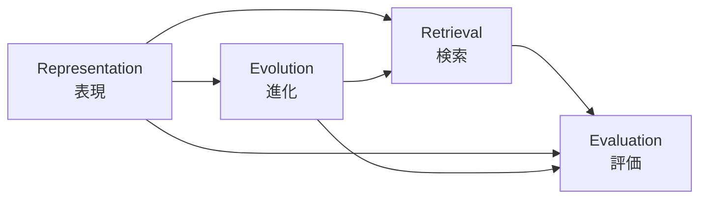
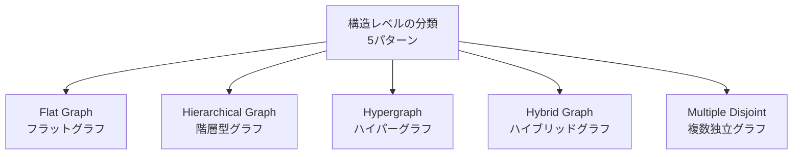

本記事は [Graph-Based Personalized Memory for LLM Agents: Representation, Evolution, Retrieval, and Evaluation (arXiv:2609.08599)](https://arxiv.org/abs/2609.08599) の解説記事です。

## 論文概要（Abstract）

著者らは、LLMエージェントが長期的なパーソナルアシスタントとして機能するために必要なグラフベースメモリの設計を、**表現（Representation）・進化（Evolution）・検索（Retrieval）・評価（Evaluation）** の4次元で体系的に整理するサーベイ論文を提示している。グラフベースの表現はユーザ情報の明示的な関係性・時間的文脈・エビデンスリンクのモデリングを可能にし、メモリを「受動的なエントリ保管庫」から「ユーザの明示的モデル」へと転換すると著者らは主張している。ICKG 2026に採択されている。

この記事は [Zenn記事: Neo4jグラフメモリとLLMエンティティ抽出で社内Slack履歴の長期記憶検索を実装する](https://zenn.dev/0h_n0/articles/6cc75e77364d51) の深掘りです。

## 情報源

- **arXiv ID**: 2609.08599
- **URL**: [https://arxiv.org/abs/2609.08599](https://arxiv.org/abs/2609.08599)
- **著者**: Dac Duy Anh Nguyen, Zhangchi Qiu, Shigeng Chen, Alan Wee-Chung Liew
- **発表年**: 2026
- **分野**: cs.AI
- **採択**: ICKG 2026

## 背景と動機（Background & Motivation）

LLMエージェントは対話AIから、ユーザの嗜好・経験・コンテキストを長期的に蓄積・活用するパーソナルアシスタントへの進化が期待されている。しかし、従来のLLMは固定されたコンテキストウィンドウ内でしか情報を保持できず、セッションを跨いだ記憶や、ユーザの嗜好変化への適応が困難であった。

著者らは、既存のメモリシステム研究がフラットなテキストチャンク保存やベクトル検索に偏重しており、ユーザ情報の関係性・時間変化・エビデンスの追跡可能性が欠如していると指摘している。グラフベースの表現を採用することで、エンティティ間の明示的な関係、時間的コンテキスト、主張の根拠へのリンクをモデリングでき、より信頼性の高い長期パーソナライゼーションが可能になるとしている。

一方で、グラフベースメモリの研究は急速に増加しているものの、研究間で用語・分類・評価方法が統一されておらず、設計空間の全体像を把握することが困難であった。本サーベイは、この分断された研究群を4次元のライフサイクル的フレームワークで統合的に整理する試みである。

## 主要な貢献（Key Contributions）

- **貢献1**: LLMエージェントのグラフベースパーソナライズドメモリを、**表現・進化・検索・評価**の4次元ライフサイクルで統合的に整理するフレームワークの提案
- **貢献2**: メモリ表現における**要素レベル（ノード・エッジの機能的役割）**と**構造レベル（グラフトポロジーのパターン）**の2層分類、およびFlat Graph / Hierarchical Graph / Hypergraph / Hybrid Graph / Multiple Disjoint Graphsの5構造パターンの同定
- **貢献3**: パーソナルメモリの5次元（意味的・時間的・関係的・経験的・感情的）の定義と、既存システムの体系的な分類比較
- **貢献4**: メモリ評価の5カテゴリ（回答品質・エビデンス検索・ユーザ状態モデリング・メモリ構造/進化・効率性）と、12以上の既存ベンチマークの整理

## 技術的詳細（Technical Details）

### 4次元フレームワークの全体像

著者らが提案するフレームワークは、グラフベースメモリのライフサイクルを4つの次元で捉える。各次元は独立ではなく、表現が進化と検索の可能な操作を規定し、評価が各次元の品質を測定するという依存関係を持つ。

著者らは「表現が何を進化させ検索できるかを決定する」と述べており、メモリシステムの設計においてRepresentationの選択が下流の全次元に影響を及ぼす点を強調している。

### パーソナルメモリの5次元

著者らは、パーソナルメモリが捉えるべきユーザ情報を5つの次元に分類している（論文Table I）。

| 次元 | 対象 | 具体例 |
|------|------|--------|
| **意味的（Semantic）** | 安定した事実・嗜好・目標・制約 | 「ベジタリアンである」「フランス語を学習中」 |
| **時間的（Temporal）** | 記憶の有効期間・変化の追跡 | 「先月ジムに入会した」 |
| **関係的（Relational）** | 人・場所・タスク・アイテムとのリンク | 「あのカフェが気に入っている」 |
| **経験的（Experiential）** | 過去のイベント・結果・習慣 | 「前回の朝の便に乗り遅れた」 |
| **感情的（Affective）** | 満足・不満などの感情価・強度 | 「あのホテルは騒がしくて嫌だった」 |

この分類は、メモリグラフのノードやエッジがどの次元の情報を保持すべきかを設計する際の指針となる。

### Memory Representation: 要素レベルの構成

#### ノードの機能的役割

著者らは、グラフメモリのノードを4つの機能的役割に分類している。これらの役割は排他的ではなく、1つのノードが複数の役割を兼ねる場合もある。

1. **エビデンスノード（Evidence）**: 元の対話記録（ターン、エピソード、文）を保持。再現可能性と追跡可能性の基盤
2. **ファクトノード（Fact）**: ユーザに関する原子的な主張を保持。例：`(User, likes, coffee)`
3. **抽象ノード（Abstraction）**: 高次の統合情報（ペルソナ、シーン、リフレクション）を保持
4. **ドメイン固有ノード（Domain-specific）**: タスク固有のエンティティ（健康情報、興味、職業など）

#### エッジの種類

- **時間エッジ（Temporal）**: イベントの順序・進行を表現
- **出所エッジ（Provenance）**: 主張とその根拠エビデンスのリンク
- **関連エッジ（Associative）**: 文脈的・意味的に関連する記憶の接続
- **ドメイン固有エッジ（Domain-specific）**: タスク固有の意味関係

### Memory Representation: 構造レベルの5パターン

著者らは、既存システムのグラフトポロジーを5つの構造パターンに分類している。

#### 1. Flat Graph（フラットグラフ）

明示的な抽象化階層を持たず、単一レイヤの異種ノード・エッジで構成される。実装が単純で拡張しやすい反面、大規模メモリにおける検索効率に課題がある。

- **Mem0g**: 会話から漸進的にエンティティ・リレーショングラフを構築。意味的に一致するノードを再利用し、古いエッジを無効化する
- **KGT**: パーソナライズされた事実トリプルを編集可能な信念として保存
- **UMGR**: ユーザ・アイテム・属性・意見の異種ノードをリンクする推薦向けグラフ

#### 2. Hierarchical Graph（階層型グラフ）

エビデンスから抽象化への複数レイヤを持ち、粒度の異なるアクセスを可能にする。

- **GAAMA**: ターン → エピソード → ファクト → リフレクション の4層構造
- **Bi-Mem**: ファクト → シーン → グローバルペルソナ の3層構造に、レベル間の相互較正リンクを追加
- **GAM**: アクティブイベント / トピック / アーカイブ層の3層構造。バッファリングによる段階的統合を採用
- **SGMem**: セッション → ターン → 文 の細粒度分解

#### 3. Hypergraph（ハイパーグラフ）

ハイパーエッジにより複数ノードの同時グルーピングを表現。文脈的に共起する情報のまとまりを効率的にモデリングできる。

- **HingeMem**: 対話セグメントを参加者・場所・時間でインデックス付け。境界トリガーによるセグメント化を採用
- **HyperMem**: トピック / エピソード / ファクトの3レベルをハイパーエッジでグルーピング。トップダウン検索を実現

#### 4. Hybrid Graph（ハイブリッドグラフ）

グラフ構造に非グラフ基盤（テキストストア、時系列木など）を組み合わせる。各基盤の長所を活かせるが、基盤間の一貫性維持が課題となる。

- **H-Mem**: 時間的・意味的ツリー + エンティティグラフの二重インデックス
- **LiCoMemory**: エンティティ・リレーショングラフ + セッション要約 + 対話チャンクの3基盤
- **MemWeaver**: リレーショングラフ + 経験ストア + パッセージストアの3基盤

#### 5. Multiple Disjoint Graphs（複数独立グラフ）

機能別に独立したグラフインスタンスを保持する。ドメイン固有の要件が大きく異なる場合に有効。

- **DEMENTIA-PLAN**: 日常ルーチングラフ + 人生記憶グラフの2インスタンスを並行管理

### Memory Evolution: 知識の追加・統合・矛盾解消・削除

メモリ進化は、新情報の受容から古い情報の廃棄までのライフサイクル全体を扱う。著者らは以下の段階に分けて整理している。

#### 知識の追加（Admission）

入力された情報を永続的メモリにするか、どの機能タイプ・粒度で格納するかを決定する段階。

- **KGT**: ユーザフィードバックに基づいて事実の追加・置換をトリガー
- **MemORAI**: 選択的フィルタリングと圧縮により、ユーザペルソナに関連するエピソード的内容のみを保持
- **MemGuard**: 書き込み時にファクト・手続き的知識・制約などの機能的役割を割り当て、役割間の汚染を防止

#### 知識の統合（Integration）

新情報を既存のグラフ構造に統合する方法として、3つのパターンが報告されている。

1. **追加・リンク方式（Append-and-link）**: ソースへの出所リンクを保持したまま新ノードを追加（LiCoMemory）
2. **意味的再利用方式（Semantic reuse）**: 一致する既存ノードを再利用し、古いエッジを無効化（Mem0g）
3. **統合バッファ方式（Consolidation）**: 新しい発話をバッファに付加し、後の段階で上位構造に昇格（GAM）

#### 矛盾解消（Conflict Resolution）

著者らは、メモリ上で生じる矛盾を3つのタイプに分類している。

**タイプ1: 時間的上書き（Temporal supersession）** — 新しい状態が以前の状態を置き換える場合。AriadneMemは静的な重複をマージしつつ、状態遷移を時間エッジとして保持する。

**タイプ2: ユーザ修正（User correction）** — 保存された事実が誤りと判明した場合。GRAVITYはエビデンスを保持したまま該当ノードを非アクティブとしてマークする。

**タイプ3: 文脈的共存（Contextual coexistence）** — 異なるコンテキストでは矛盾する状態が共に有効な場合。Zepは後続の状態をクエリ可能なバージョンとして保持し、いずれも検索可能にする。

#### 統合（Consolidation）

- **GAM**: 完了したイベントバッファをトピックレベルの構造に昇格させ、詳細なイベントグラフをアーカイブする
- **All-Mem**: ゲート付きのSPLIT / MERGE / UPDATEトポロジー編集を行いつつ、不変のエビデンスを保持する

#### 削除（Forgetting vs. Deletion）

著者らは「忘却」と「削除」を区別している。

- **忘却（Forgetting）**: 情報の露出度・解像度を漸減させる。ScrapMemの「光学的忘却（Optical Forgetting）」は、古いスクラップブックの解像度を段階的に低下させる
- **削除（Deletion）**: 保存内容・回復可能性そのものを変更する。Kumihoは不変のリビジョン履歴と可変のアクティブタグを持つバージョン管理方式を採用し、監査履歴を維持する

### Memory Retrieval: 検索手法の分類

著者らは、メモリ検索の手法を3つのカテゴリに整理している。

#### 1. 類似度ベース検索（Similarity-Based）

語彙的マッチング、キーワード検索、密ベクトルマッチングによる初期候補の生成やクエリのグラフアンカーへのマッピングを行う。最もシンプルだが、グラフ構造の情報を活用しない。

- **EMG-RAG**: 編集可能なスマートフォンメモリグラフに対して選択的検索を適用

#### 2. 構造ベース検索（Structure-Based）

グラフ組織を利用して初期候補を拡張・精緻化する。グラフの関係性を活かした多段階検索が可能。

- **GAM**: トピックノードを検索し、そこからアーカイブされたイベントグラフにアクセスして詳細を取得
- **MAGMA**: 各メモリアイテムを意味的・時間的・因果的・エンティティの4つのグラフビューで表現し、ビュー選択により検索を最適化
- **AssoMem**: 抽出されたクルー（手がかり）に発話をアンカーし、関連度・重要度・時間的整合性の3信号を統合
- **xMemory**: 補完的なグループを選択し、必要に応じてソースセグメントに展開

#### 3. 適応的・エージェンティック検索（Adaptive and Agentic）

リクエストや中間エビデンスに応じて、クエリ解釈・グラフ探索・停止条件・ルーティング・圧縮を動的に変更する。最も柔軟だが、計算コストが高い。

- **MRAgent**: Cue-Tag-Contentグラフに対して反復的にパスを探索・枝刈りする
- **PRISM**: 意図に応じたパス選択とコンテキスト予算内でのエビデンス圧縮を実行
- **HingeMem**: 要素インデックスルートの活性化と検索深度を制御
- **APEX-MEM**: 矛盾・進化する情報に対してマルチツール検索エージェントで解決

### Memory Evaluation: 評価の5カテゴリとベンチマーク

著者らは、メモリシステムの評価指標を5つのカテゴリに整理している。

| カテゴリ | 指標例 | 対象 |
|----------|--------|------|
| **回答品質** | F1, Exact Match, Accuracy, LLM-as-Judge | 最終出力の正確性 |
| **エビデンス検索** | Recall@k, NDCG@k, 回答ターン精度 | 検索の網羅性・順序性 |
| **ユーザ状態モデリング** | 嗜好精度, プロファイル一貫性, 応答有用性 | ユーザ理解の質 |
| **メモリ構造/進化** | 更新成功率, チェーン精度, 忘却結果 | グラフ操作の正確性 |
| **効率性** | トークン使用量, レイテンシ, 構築/クエリコスト | 計算資源の消費 |

#### 主要なベンチマーク

著者らは、既存のベンチマークを目的別に分類している。

**長期ホライズン想起**:
- **LoCoMo**: テキスト・画像を含む長い会話的メモリのベンチマーク
- **LongMemEval**: 長期インタラクティブメモリの評価。知識更新・時間的推論を含む

**パーソナライゼーション・ユーザ状態**:
- **PersonaMem**: シミュレーション対話における動的ユーザプロファイリング
- **PersonaMem-v2**: 暗黙的ペルソナ、より長いコンテキスト、エージェンティックメモリに対応
- **RealMem**: マルチセッションプロジェクトを対象としたプロジェクト指向メモリ
- **PerLTQA**: 意味記憶・エピソード記憶を分離した個人長期QA

**グラフ構造・進化**:
- **EngramaBench**: グラフメモリ vs コンテキストメモリの構造化検索評価
- **EvoMemBench**: エピソードタスクにおける自己進化メモリの評価
- **EvoArena**: 永続的な環境変化・嗜好変化チェーンの評価
- **StructMemEval**: 構造を必要とするタスクにおけるメモリ構造の評価

### 代表的システムの比較表

論文で分析された代表的なシステムを、構造パターンと主要な特徴で整理する。

| システム | 構造パターン | 主要な特徴 |
|----------|-------------|-----------|
| **Mem0g** | Flat Graph | 漸進的エンティティ・リレーション構築、意味的ノード再利用 |
| **KGT** | Flat Graph | 編集可能な事実トリプル、ユーザフィードバックによる更新 |
| **UMGR** | Flat Graph | ユーザ・アイテム・属性・意見の異種グラフ（推薦向け） |
| **GAAMA** | Hierarchical | ターン→エピソード→ファクト→リフレクションの4層構造 |
| **Bi-Mem** | Hierarchical | ファクト→シーン→ペルソナの3層、レベル間較正リンク |
| **GAM** | Hierarchical | 3層構造 + バッファリング統合、イベントアーカイブ |
| **SGMem** | Hierarchical | セッション→ターン→文の細粒度分解 |
| **HingeMem** | Hypergraph | 境界トリガーセグメント、要素インデックス検索 |
| **HyperMem** | Hypergraph | 3レベルハイパーエッジ、トップダウン検索 |
| **H-Mem** | Hybrid | 時間的・意味的ツリー + エンティティグラフ |
| **LiCoMemory** | Hybrid | エンティティグラフ + セッション要約 + 対話チャンク |
| **MemWeaver** | Hybrid | リレーショングラフ + 経験ストア + パッセージストア |
| **Zep** | Temporal KG | 時間エッジ、バージョン管理された状態の文脈的共存 |
| **MAGMA** | Multi-view | 意味的・時間的・因果的・エンティティの4ビュー |
| **MRAgent** | Agentic | Cue-Tag-Contentグラフ、反復的パス探索・枝刈り |
| **PRISM** | Agentic | 意図感知パス選択、コンテキスト予算内エビデンス圧縮 |

## 実装のポイント（Practical Implications）

本サーベイの分析に基づき、グラフベースメモリを設計する際の実践的な指針を整理する。

**表現の選択がすべてに波及する**: 著者らは「表現が何を進化させ検索できるかを決定する」と明確に述べている。エビデンスリッチな設計は出所の追跡と修正を支えるが、ファクト・抽象中心の設計はコンパクトなユーザモデルを提供する一方でコンテキストの喪失や抽出エラーの伝播リスクがある。用途に応じた設計判断が必要である。

**矛盾解消の設計**: ユーザの嗜好は時間とともに変化するため、単純な上書きではなく、時間的上書き・ユーザ修正・文脈的共存の3パターンを想定した設計が望ましい。ZepやGRAVITYのようにバージョン管理やエビデンス保持を組み込むことで、監査可能性と柔軟性を両立できる。

**検索の制御が性能を左右する**: 著者らは、制御されていないグラフ展開が無関係なノード・未裏付けのパス・コンテキストコストの増大を招くと警告している。PRISMやMRAgentのように、検索の深度・幅・停止条件を明示的に制御する設計が重要である。

**単一の最適解は存在しない**: 著者らは「単一の設計が支配的になることはない」と結論しており、パーソナライゼーション要件・タイムスケール制約・評価優先度に応じた設計選択が必要であるとしている。

## 分析結果と設計トレードオフ（Analysis & Tradeoffs）

### 表現における トレードオフ

著者らは、エビデンスの保持度と運用効率のトレードオフを指摘している。エビデンスリッチな設計（ハイブリッドグラフ等）は出所の追跡・修正・監査を支えるが、ストレージと検索コストが増大する。一方、ファクト・抽象中心の設計（フラットグラフ等）はコンパクトだが、コンテキストの喪失や抽出エラーの伝播リスクを伴う。

### 進化における課題

階層型やマルチストア表現では、レベル間や基盤間の一貫性維持が追加の課題となる。GAMのバッファリング統合やAll-Memのゲート付きトポロジー編集は、この課題に対するアプローチだが、いずれも完全な解決には至っていないと著者らは述べている。

### 検索の限界

著者らは、グラフ構造の採用だけでは性能向上を保証しないと指摘しており、「結果はグラフ構造を超えた基盤的なシステム設定に依存し得る」と述べている。これは、グラフメモリの効果が、基盤となるLLMの能力やプロンプト設計、埋め込みモデルの品質など、周辺コンポーネントの影響を強く受けることを示唆している。

### 評価の断片化

現在のベンチマークは特定の能力（長期想起、パーソナライゼーション、構造的検索など）に焦点を当てており、メモリシステムの総合的な評価を行うベンチマークは存在しない。著者らは、表現・進化・検索・評価の4次元を統合的に評価するベンチマークの必要性を提起している。

## 実運用への応用 — Zenn記事との関連

本サーベイのフレームワークを用いて、関連Zenn記事で実装されたアーキテクチャの位置づけを整理する。

Zenn記事「[Neo4jグラフメモリとLLMエンティティ抽出で社内Slack履歴の長期記憶検索を実装する](https://zenn.dev/0h_n0/articles/6cc75e77364d51)」は、Neo4jを用いたエンティティレベルのグラフメモリを構築している。本サーベイの分類に照らすと、以下のように位置づけられる。

**表現**: Mem0gと同様のEntity-Level Constructionに基づくFlat Graphアプローチ。LLMによるエンティティ抽出でファクトノード（トリプル）を生成し、Neo4jに格納する。エビデンスノード（元のSlackメッセージ）との出所リンクの設計が、追跡可能性の確保に直結する。

**進化**: Slack履歴の継続的な取り込みにおいて、既存エンティティとの重複検出・マージ（意味的再利用方式）が重要となる。本サーベイで整理された矛盾解消の3パターン（時間的上書き・ユーザ修正・文脈的共存）は、実運用で必ず直面する課題である。

**検索**: ベクトル検索とグラフトラバーサルのハイブリッド検索を採用しており、本サーベイの分類では構造ベース検索に該当する。MAGMAのマルチビューアプローチやPRISMの意図感知パス選択は、検索精度向上の参考となる。

**評価**: 実運用システムの評価には、本サーベイで整理された5カテゴリの指標が参考になる。特に、エビデンス検索のRecall@kやユーザ状態モデリングの嗜好精度は、Slack履歴検索の品質評価に直接適用可能である。

## 関連研究

- **GraphRAG** (Microsoft, 2024): テキストコーパスからコミュニティ構造を抽出し、グローバルクエリに対応するチャンクレベル構築の代表的手法。本サーベイでは構造ベース検索の文脈で参照されている
- **HippoRAG** (2024): 海馬のインデキシング理論に着想を得た、パーソナルグラフ+パラ海馬的インデックスによるRAGフレームワーク。チャンクレベル構築の代表例として分析されている
- **Mem0** (2024-2026): プロダクション向けエージェントメモリプラットフォーム。エンティティレベル構築のFlat Graphとして本サーベイで広く参照されており、漸進的グラフ構築と意味的ノード再利用のリファレンス実装として位置づけられている
- **Zep**: テンポラルナレッジグラフによるメモリ管理。バージョン管理された状態の文脈的共存という矛盾解消メカニズムが、本サーベイのEvolution次元で詳細に分析されている

## まとめと今後の展望

本サーベイは、LLMエージェントのグラフベースパーソナライズドメモリを表現・進化・検索・評価の4次元で体系的に整理した包括的な研究である。30以上のシステムを分類し、構造パターン5種、矛盾解消3タイプ、検索手法3カテゴリ、評価指標5カテゴリという明確な分類軸を提供している。

著者らが提起する今後の課題は以下の3点である。

1. **スケーラブルな生涯パーソナルメモリ**: 孤立したセッションや短いベンチマーク履歴ではなく、年単位のインタラクションを正確かつ効率的に支援するメモリシステムの構築
2. **マルチモーダルパーソナルメモリグラフ**: 音声・画像・文書・位置情報・行動・インタラクション痕跡を接続するグラフメモリの開発。モダリティと信頼性の保持が課題
3. **因果的・反事実的ユーザモデリング**: 嗜好が「なぜ」成立し、「いつ」変化し、「異なるコンテキストでどうなるか」を理解するメモリモデルの実現

グラフベースメモリの研究はまだ初期段階にあるが、著者らの4次元フレームワークは設計空間の見通しを大幅に改善するものである。実運用においては、本サーベイで整理されたトレードオフ（エビデンス保持 vs 効率性、柔軟性 vs 一貫性、検索精度 vs 計算コスト）を踏まえた設計判断が求められる。
