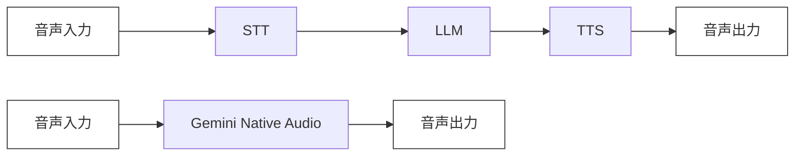

## ブログ概要（Summary）

本記事は [Gemini Live API Now GA on Vertex AI](https://cloud.google.com/blog/products/ai-machine-learning/gemini-live-api-available-on-vertex-ai) の解説記事です。

Google Cloudは2025年12月、Gemini Live APIをVertex AI上で一般提供（GA）として公開した。Gemini 2.5 Flash Native Audioモデルを搭載し、ネイティブSpeech-to-Speech処理、自然なターンテイキング、意図・トーン認識、マルチモーダルビジョン処理を提供する。Google I/O 2026時点で本番SLAとマルチリージョンフェイルオーバーが利用可能であり、Shopify、United Wholesale Mortgage、SightCall、Lumeris、11Sightなどのエンタープライズ導入事例がブログで報告されている。

この記事は [Zenn記事: Gemini 3.8 Flash×Pipecatで銀行コールセンター音声ボットを構築する](https://zenn.dev/0h_n0/articles/f5fa1b28080393) の深掘りです。

## 情報源

- **種別**: 企業テックブログ（Google Cloud Blog）
- **URL**: [Gemini Live API Now GA on Vertex AI](https://cloud.google.com/blog/products/ai-machine-learning/gemini-live-api-available-on-vertex-ai)
- **組織**: Google Cloud（著者: Fabien Blanc-paques, Group Product Manager, Gemini Live）
- **発表日**: 2025年12月13日

## 技術的背景（Technical Background）

### 従来の音声AIパイプラインの課題

従来の音声AIシステムは、Speech-to-Text（STT）、LLM推論、Text-to-Speech（TTS）の3段階パイプラインで構成されていた。この構成では以下の問題が生じる。

1. **レイテンシの累積**: STT（200-500ms）+ LLM推論（500-2000ms）+ TTS（200-500ms）で合計1-3秒の遅延が発生し、自然な対話体験を損なう
2. **音響情報の喪失**: STT段階でテキスト化する際にピッチ、ペース、感情的ニュアンスなどのパラ言語情報が失われる
3. **ターンテイキングの困難**: 発話区間検出（VAD）に依存する割り込み処理では、相槌や同時発話を適切に扱えない

### Native Audio処理の登場

Gemini Live APIが採用するNative Audio処理は、音声波形を直接モデルに入力し、音声波形を直接出力するSpeech-to-Speech（S2S）アプローチである。ブログでは、テキストへの中間変換を経ずに音声を処理することで、音響的手がかり（ピッチ、ペース、トーン）を保持したまま応答生成が可能と説明されている。



## 実装アーキテクチャ（Architecture）

### Gemini Live APIのコア機能

ブログで説明されているGemini Live APIの主要な技術的特徴は以下の通りである。

**1. Gemini 2.5 Flash Native Audio**

Gemini 2.5 Flash Native Audioモデルは、音声入力を直接処理し音声出力を生成する統合モデルである。Google Cloudはこのモデルについて、低レイテンシでの応答生成が可能と説明している。

**2. 自然なターンテイキング**

ブログでは、ユーザーが発話中にAIの応答を中断（barge-in）し、新たな発話を開始できるターンテイキング機能について言及されている。従来のVADベースの手法とは異なり、モデルレベルで発話の意図を解釈することで自然な対話フローを実現するとされる。

**3. 意図・トーン認識**

音声のピッチ、ペース、音量などの音響的手がかりから話者の意図やトーンを認識する機能がブログで紹介されている。これにより、テキストだけでは判断できない感情的コンテキストを応答に反映できるとGoogle Cloudは説明している。

**4. マルチモーダルビジョン処理**

Gemini Live APIは音声だけでなく、チャート、図表、ライブ映像などの視覚情報をリアルタイムに処理するマルチモーダル機能を備えている。ブログでは、音声対話中に画面共有や画像を解析しながら応答する能力について報告されている。

### エンタープライズ基盤

Google Cloudはブログで以下のエンタープライズ向け機能を強調している。

- **低レイテンシ・高並行処理**: 大規模な同時接続セッションを処理するインフラストラクチャ
- **複数リージョン対応**: グローバルに分散されたインフラによるマルチリージョンフェイルオーバー
- **データ居住地機能**: 規制準拠のために特定リージョンにデータを保持する機能
- **本番SLA**: Google I/O 2026時点で本番環境向けSLAが提供されている

### Vertex AI上での利用

Gemini Live APIはVertex AI経由で利用可能であり、WebSocket接続を通じてストリーミング双方向通信を行う。Zenn記事で解説しているPipecatフレームワークとの統合により、オーケストレーション層を構築できる。

```python
"""Gemini Live API WebSocket接続の基本構成例

Note: ブログの記述に基づく概念的な実装例。
実際のAPIパラメータはVertex AIの公式ドキュメントを参照すること。
"""
import asyncio
import json
from google.cloud import aiplatform


async def create_live_session(
    project_id: str,
    location: str = "us-central1",
) -> None:
    """Gemini Live APIのWebSocketセッションを確立する

    Args:
        project_id: Google Cloud プロジェクトID
        location: リージョン
    """
    # Vertex AI初期化
    aiplatform.init(project=project_id, location=location)

    # Live APIセッション設定
    config = {
        "model": "gemini-2.5-flash-native-audio",
        "generation_config": {
            "response_modalities": ["AUDIO"],
            "speech_config": {
                "voice_config": {
                    "prebuilt_voice_config": {
                        "voice_name": "Aoede"
                    }
                }
            }
        },
        "system_instruction": "You are a helpful customer support agent.",
    }

    # セッション確立後、双方向ストリーミングで音声データを送受信
    # 詳細な実装はVertex AI Live APIドキュメントを参照
    print(f"Session config: {json.dumps(config, indent=2)}")
```

## Production Deployment Guide

### AWS実装パターン（Gemini Live APIを活用した音声ボットのAWS構成）

Gemini Live APIはGoogle Cloud上のサービスだが、企業のインフラがAWSに集約されているケースでは、AWSからVertex AI APIを呼び出すクロスクラウド構成が現実的な選択肢となる。以下にトラフィック量別の推奨構成を示す。

**注意**: 以下のコスト試算は2026年9月時点のAWS ap-northeast-1（東京）リージョン料金に基づく概算値である。Gemini Live APIの利用料金はGoogle Cloud側で別途発生する。実際のコストはトラフィックパターン、リージョン、バースト使用量により変動するため、最新料金はAWS料金計算ツールおよびGoogle Cloud料金計算ツールで確認を推奨する。

| 構成 | トラフィック | 主要サービス | 月額概算（AWS側） |
|------|------------|-------------|-----------------|
| Small | ~100セッション/日 | Lambda + API Gateway + DynamoDB | $80-200 |
| Medium | ~1,000セッション/日 | ECS Fargate + ALB + ElastiCache | $400-1,000 |
| Large | 10,000+セッション/日 | EKS + Karpenter + Spot Instances | $2,500-6,000 |

**Small構成（~100セッション/日）**:
- API Gateway WebSocket API: WebSocket接続管理（$1.00/100万メッセージ）
- Lambda: セッション管理・Vertex AI API中継（ARM64, 512MB, 最大15分タイムアウト）
- DynamoDB On-Demand: セッション状態管理・会話ログ保存
- Secrets Manager: Google Cloud サービスアカウントキー管理
- CloudWatch: ログ・メトリクス・アラーム

**Medium構成（~1,000セッション/日）**:
- ALB: WebSocket接続のロードバランシング（sticky sessions有効）
- ECS Fargate: 常時2タスク + オートスケーリング（最大8タスク）、1vCPU/2GB RAM
- ElastiCache Redis: セッション状態の高速参照・Pub/Sub
- DynamoDB: 会話ログ永続化
- NAT Gateway: Vertex AIへのアウトバウンド通信

**Large構成（10,000+セッション/日）**:
- EKS: コントロールプレーン + Karpenterによる自動スケーリング
- Spot Instances優先: m6i.xlarge（4vCPU/16GB）、Spot割合80%で最大70%コスト削減
- Redis Cluster: 3ノードクラスタ（セッション管理・Pub/Sub）
- Aurora Serverless v2: 会話ログ・分析データの永続化
- CloudFront: 静的アセット配信・WebSocket Origin接続

**コスト削減テクニック**:
- Spot Instances活用で最大70%削減（EKS Large構成）
- Savings Plans（1年コミット）でFargate最大20%削減
- DynamoDB On-Demandモードで低トラフィック時のコスト最適化
- CloudWatch Logs保持期間を30日に設定しストレージコスト抑制
- NAT Gatewayの代わりにVPCエンドポイント活用で通信コスト削減

### Terraformインフラコード

**Small構成（Serverless）**: API Gateway WebSocket + Lambda + DynamoDB

```hcl
# ==============================================================================
# Small構成: Gemini Live API 音声ボット (Serverless)
# API Gateway WebSocket + Lambda + DynamoDB
# 月額概算: $80-200 (~100セッション/日)
# ==============================================================================

terraform {
  required_version = ">= 1.9"
  required_providers {
    aws = {
      source  = "hashicorp/aws"
      version = "~> 5.70"
    }
  }
}

provider "aws" {
  region = "ap-northeast-1"
  default_tags {
    tags = {
      Project     = "gemini-live-voice-bot"
      Environment = "production"
      ManagedBy   = "terraform"
    }
  }
}

# --- DynamoDB: セッション状態管理 ---
resource "aws_dynamodb_table" "sessions" {
  name         = "gemini-live-sessions"
  billing_mode = "PAY_PER_REQUEST"  # On-Demand: 低トラフィック時コスト最適
  hash_key     = "session_id"

  attribute {
    name = "session_id"
    type = "S"
  }

  ttl {
    attribute_name = "expires_at"
    enabled        = true  # セッション自動クリーンアップ
  }

  point_in_time_recovery {
    enabled = true
  }

  server_side_encryption {
    enabled = true  # KMS暗号化
  }
}

# --- Secrets Manager: GCP サービスアカウントキー ---
resource "aws_secretsmanager_secret" "gcp_credentials" {
  name        = "gemini-live/gcp-service-account"
  description = "Google Cloud service account key for Vertex AI"

  recovery_window_in_days = 7
}

# --- IAMロール: Lambda実行用（最小権限） ---
resource "aws_iam_role" "lambda_exec" {
  name = "gemini-live-lambda-exec"

  assume_role_policy = jsonencode({
    Version = "2012-10-17"
    Statement = [{
      Action = "sts:AssumeRole"
      Effect = "Allow"
      Principal = { Service = "lambda.amazonaws.com" }
    }]
  })
}

resource "aws_iam_role_policy" "lambda_policy" {
  name = "gemini-live-lambda-policy"
  role = aws_iam_role.lambda_exec.id

  policy = jsonencode({
    Version = "2012-10-17"
    Statement = [
      {
        Effect   = "Allow"
        Action   = ["dynamodb:GetItem", "dynamodb:PutItem", "dynamodb:UpdateItem", "dynamodb:DeleteItem"]
        Resource = aws_dynamodb_table.sessions.arn
      },
      {
        Effect   = "Allow"
        Action   = ["secretsmanager:GetSecretValue"]
        Resource = aws_secretsmanager_secret.gcp_credentials.arn
      },
      {
        Effect   = "Allow"
        Action   = ["logs:CreateLogGroup", "logs:CreateLogStream", "logs:PutLogEvents"]
        Resource = "arn:aws:logs:*:*:*"
      }
    ]
  })
}

# --- Lambda関数 ---
resource "aws_lambda_function" "voice_bot" {
  function_name = "gemini-live-voice-bot"
  runtime       = "python3.12"
  handler       = "handler.lambda_handler"
  role          = aws_iam_role.lambda_exec.arn
  timeout       = 900  # 15分（音声セッション対応）
  memory_size   = 512
  architectures = ["arm64"]  # Graviton: 20%コスト削減

  environment {
    variables = {
      DYNAMODB_TABLE    = aws_dynamodb_table.sessions.name
      GCP_SECRET_NAME   = aws_secretsmanager_secret.gcp_credentials.name
      VERTEX_AI_PROJECT = var.gcp_project_id
      VERTEX_AI_REGION  = "us-central1"
    }
  }

  tracing_config {
    mode = "Active"  # X-Ray有効化
  }

  filename = "lambda_package.zip"  # デプロイパッケージ
}

# --- CloudWatch アラーム ---
resource "aws_cloudwatch_metric_alarm" "lambda_errors" {
  alarm_name          = "gemini-live-lambda-errors"
  comparison_operator = "GreaterThanThreshold"
  evaluation_periods  = 2
  metric_name         = "Errors"
  namespace           = "AWS/Lambda"
  period              = 300
  statistic           = "Sum"
  threshold           = 10
  alarm_description   = "Lambda error rate exceeded threshold"

  dimensions = {
    FunctionName = aws_lambda_function.voice_bot.function_name
  }
}

variable "gcp_project_id" {
  description = "Google Cloud project ID for Vertex AI"
  type        = string
}
```

**Large構成（Container）**: EKS + Karpenter + Spot Instances

```hcl
# ==============================================================================
# Large構成: Gemini Live API 音声ボット (Container)
# EKS + Karpenter + Spot Instances
# 月額概算: $2,500-6,000 (10,000+セッション/日)
# ==============================================================================

module "eks" {
  source  = "terraform-aws-modules/eks/aws"
  version = "~> 20.24"

  cluster_name    = "gemini-live-cluster"
  cluster_version = "1.31"

  vpc_id     = module.vpc.vpc_id
  subnet_ids = module.vpc.private_subnets

  # Karpenter用IAM
  enable_cluster_creator_admin_permissions = true

  cluster_addons = {
    coredns    = { most_recent = true }
    kube-proxy = { most_recent = true }
    vpc-cni    = { most_recent = true }
  }

  # Fargate（Karpenter自身の実行基盤）
  fargate_profiles = {
    karpenter = {
      selectors = [{ namespace = "karpenter" }]
    }
  }
}

# --- Karpenter: Spot優先の自動スケーリング ---
resource "helm_release" "karpenter" {
  name       = "karpenter"
  repository = "oci://public.ecr.aws/karpenter"
  chart      = "karpenter"
  version    = "1.1.0"
  namespace  = "karpenter"

  set {
    name  = "settings.clusterName"
    value = module.eks.cluster_name
  }
}

# Karpenter NodePool: Spot優先（80% Spot / 20% On-Demand）
resource "kubectl_manifest" "karpenter_nodepool" {
  yaml_body = yamlencode({
    apiVersion = "karpenter.sh/v1"
    kind       = "NodePool"
    metadata   = { name = "voice-bot-pool" }
    spec = {
      template = {
        spec = {
          requirements = [
            { key = "karpenter.sh/capacity-type", operator = "In", values = ["spot", "on-demand"] },
            { key = "node.kubernetes.io/instance-type", operator = "In", values = ["m6i.xlarge", "m6a.xlarge", "m7i.xlarge"] },
            { key = "topology.kubernetes.io/zone", operator = "In", values = ["ap-northeast-1a", "ap-northeast-1c"] }
          ]
        }
      }
      limits   = { cpu = "128", memory = "512Gi" }
      disruption = {
        consolidationPolicy = "WhenEmptyOrUnderutilized"
        consolidateAfter    = "60s"
      }
    }
  })
}

# --- AWS Budgets: コストアラート ---
resource "aws_budgets_budget" "monthly" {
  name         = "gemini-live-monthly-budget"
  budget_type  = "COST"
  limit_amount = "7000"
  limit_unit   = "USD"
  time_unit    = "MONTHLY"

  notification {
    comparison_operator       = "GREATER_THAN"
    threshold                 = 80
    threshold_type            = "PERCENTAGE"
    notification_type         = "ACTUAL"
    subscriber_email_addresses = [var.alert_email]
  }
}

variable "alert_email" {
  description = "Email for budget alerts"
  type        = string
}
```

### 運用・監視設定

**CloudWatch Logs Insights クエリ: セッション異常検知**

```
# 1時間あたりのセッションエラー率
fields @timestamp, @message
| filter @message like /ERROR/
| stats count(*) as error_count by bin(1h)
| sort @timestamp desc

# Vertex AI API レイテンシ分析（P95, P99）
fields @timestamp, vertex_ai_latency_ms
| stats
    avg(vertex_ai_latency_ms) as avg_latency,
    pct(vertex_ai_latency_ms, 95) as p95_latency,
    pct(vertex_ai_latency_ms, 99) as p99_latency
  by bin(5m)
| sort @timestamp desc
```

**CloudWatch アラーム設定（Python）**

```python
"""CloudWatchアラーム設定: Gemini Live API音声ボット監視"""
import boto3

cloudwatch = boto3.client("cloudwatch", region_name="ap-northeast-1")


def create_latency_alarm(function_name: str, sns_topic_arn: str) -> None:
    """Vertex AI APIレイテンシ異常検知アラームを作成する

    Args:
        function_name: Lambda関数名
        sns_topic_arn: 通知先SNSトピックARN
    """
    cloudwatch.put_metric_alarm(
        AlarmName=f"{function_name}-vertex-ai-latency-p99",
        MetricName="VertexAILatency",
        Namespace="GeminiLive/VoiceBot",
        Statistic="p99",
        Period=300,
        EvaluationPeriods=3,
        Threshold=3000,  # 3秒超過で発火
        ComparisonOperator="GreaterThanThreshold",
        AlarmActions=[sns_topic_arn],
        Dimensions=[{"Name": "FunctionName", "Value": function_name}],
    )
```

**X-Ray トレーシング設定（Python）**

```python
"""X-Rayトレーシング: Vertex AI API呼び出しの可観測性"""
from aws_xray_sdk.core import xray_recorder, patch_all

# boto3・requests等の自動計装
patch_all()


@xray_recorder.capture("vertex_ai_live_session")
def call_vertex_ai(audio_chunk: bytes, session_id: str) -> bytes:
    """Vertex AI Live APIを呼び出し、音声応答を取得する

    Args:
        audio_chunk: 入力音声チャンク（PCM 16kHz）
        session_id: セッション識別子

    Returns:
        応答音声チャンク
    """
    subsegment = xray_recorder.current_subsegment()
    subsegment.put_annotation("session_id", session_id)
    subsegment.put_metadata("audio_chunk_size", len(audio_chunk))

    # Vertex AI API呼び出し（実装省略）
    response_audio = b""  # Vertex AI からの応答音声
    return response_audio
```

**Cost Explorer 日次レポート（Python）**

```python
"""日次コストレポート: Gemini Live API関連AWS費用の監視"""
import boto3
import json
from datetime import datetime, timedelta


def get_daily_cost_report() -> dict:
    """前日のサービス別コストを取得する

    Returns:
        サービス別コスト辞書
    """
    ce = boto3.client("ce", region_name="us-east-1")
    yesterday = (datetime.utcnow() - timedelta(days=1)).strftime("%Y-%m-%d")
    today = datetime.utcnow().strftime("%Y-%m-%d")

    response = ce.get_cost_and_usage(
        TimePeriod={"Start": yesterday, "End": today},
        Granularity="DAILY",
        Metrics=["UnblendedCost"],
        GroupBy=[{"Type": "DIMENSION", "Key": "SERVICE"}],
        Filter={
            "Tags": {
                "Key": "Project",
                "Values": ["gemini-live-voice-bot"],
            }
        },
    )

    costs = {}
    for group in response["ResultsByTime"][0]["Groups"]:
        service = group["Keys"][0]
        amount = float(group["Metrics"]["UnblendedCost"]["Amount"])
        if amount > 0:
            costs[service] = round(amount, 2)

    total = sum(costs.values())
    if total > 100:  # $100/日超過でアラート
        sns = boto3.client("sns", region_name="ap-northeast-1")
        sns.publish(
            TopicArn="arn:aws:sns:ap-northeast-1:ACCOUNT:cost-alert",
            Subject=f"Cost Alert: ${total:.2f}/day",
            Message=json.dumps(costs, indent=2),
        )

    return costs
```

### コスト最適化チェックリスト

**アーキテクチャ選択**:
- [ ] トラフィック量に応じた構成選定（~100/日: Serverless、~1,000/日: Hybrid、10,000+/日: Container）
- [ ] WebSocket接続のライフタイムに応じたコンピュート選択（短時間: Lambda、長時間: ECS/EKS）
- [ ] クロスクラウド通信のデータ転送コストを考慮

**リソース最適化**:
- [ ] EC2/EKS: Spot Instances優先（m6i/m6a/m7iの複数インスタンスタイプ指定で可用性確保）
- [ ] Savings Plans: 1年コミットでFargate/Lambda最大20%削減
- [ ] Lambda: ARM64（Graviton）で20%コスト削減
- [ ] Lambda: メモリサイズを512MB-1024MBで最適化（Power Tuning実施推奨）
- [ ] ECS/EKS: Karpenter consolidationPolicyで未使用ノード自動削除

**LLMコスト削減**:
- [ ] Gemini Live APIのセッション時間を制限（タイムアウト設定）
- [ ] 非リアルタイム処理はBatch APIを使用（50%削減）
- [ ] システムプロンプトのキャッシュ活用
- [ ] 不要なマルチモーダル入力（ビデオ等）を無効化しトークン消費を抑制

**監視・アラート**:
- [ ] AWS Budgets: 月次予算アラート（80%/100%閾値）
- [ ] CloudWatch: Lambda/ECSエラー率・レイテンシアラーム
- [ ] Cost Anomaly Detection: 日次異常検知有効化
- [ ] 日次コストレポート: Cost Explorer APIで自動取得・SNS通知

**リソース管理**:
- [ ] 未使用セキュリティグループ・ENIの定期削除
- [ ] タグ戦略: Project/Environment/ManagedByを全リソースに付与
- [ ] DynamoDB TTL: セッションデータの自動期限切れ
- [ ] CloudWatch Logs: 保持期間30日設定（長期はS3 Glacier）
- [ ] 開発環境: 夜間・週末のECS/EKSスケールダウン

## パフォーマンス最適化（Performance）

### レイテンシ削減の設計指針

ブログでは、Gemini Live APIが低レイテンシで高並行処理を実現すると説明されている。Zenn記事で解説しているPipecatフレームワークと組み合わせた場合、以下のレイテンシプロファイルが想定される。

| コンポーネント | レイテンシ目標 | 最適化手法 |
|--------------|-------------|----------|
| 音声入力バッファリング | <100ms | チャンクサイズ20ms、ストリーミング送信 |
| Gemini Live API応答 | <500ms | リージョン近接性、コネクションプール |
| 音声出力再生開始 | <200ms | 部分応答のストリーミング再生 |
| End-to-End | <800ms | WebSocket持続接続、バッファ最適化 |

**チューニングのポイント**:

- **WebSocket持続接続**: セッション中はコネクションを維持し、ハンドシェイクオーバーヘッドを排除
- **音声チャンクサイズ**: 20ms単位でストリーミング送信することで、バッファリング遅延を最小化
- **リージョン選択**: Vertex AIのus-central1やeurope-west4など、ユーザーに近接したリージョンを選択
- **部分応答ストリーミング**: 応答音声が完全に生成される前に再生を開始することで、体感レイテンシを短縮

## 運用での学び（Production Lessons）

### 導入事例から得られる知見

ブログでは5社の導入事例が報告されており、それぞれ異なるユースケースと成果が示されている。

**Shopify - SidekickAIアシスタント**:
Google Cloudのブログによると、ShopifyはSidekick AIアシスタントにGemini Live APIを採用し、マーチャント（加盟店）へのリアルタイム音声サポートを提供している。ECプラットフォームにおける音声AIの活用事例として、複雑な商品管理や注文処理の問い合わせに音声で即座に対応できる点が強調されている。

**United Wholesale Mortgage - Mia AIローンオフィサー**:
ブログでは、United Wholesale MortgageがMiaと名付けたAIローンオフィサーを展開し、14,000件以上のローン生成に貢献したと報告されている。住宅ローンという高度にドメイン特化した領域での音声AIの実用化事例として注目される。

**11Sight - Voice AIエージェント**:
ブログによると、11SightはVoice AIエージェントの導入により解決率を40%から60%に向上させたと報告している。これは音声AIが単なるIVR（自動音声応答）の置き換えではなく、実際の問題解決能力を向上させる事例を示している。

**SightCall・Lumeris**:
SightCallはリモートビデオサポートにマルチモーダル機能を活用し、リアルタイムの視覚支援を実現している。Lumerisは医療分野のTom Health AIアシスタントで感情に配慮した患者対話を提供しており、ヘルスケア領域での音声AIの感情認識機能の有用性が示されている。

### 運用上の考慮事項

これらの事例から、以下の運用上の考慮事項が導き出される。

- **ドメイン特化**: 汎用的な音声アシスタントではなく、ローン審査や医療相談など特定ドメインに最適化することで解決率が向上する
- **感情認識の活用**: Lumerisの事例のように、患者対話では感情認識が重要な差別化要因となる
- **マルチモーダルの実用性**: SightCallの事例は、音声だけでなく映像を組み合わせることで遠隔サポートの品質が大幅に向上することを示している

## 学術研究との関連（Academic Connection）

Gemini Live APIのNative Audio処理は、音声言語モデル（Speech Language Models）の研究領域と密接に関連している。GoogleのSoundStorm（Borsos et al., 2023）やAudioPaLM（Rubenstein et al., 2023）といった研究では、音声トークンをLLMのトークン空間に統合するアプローチが提案されており、Gemini 2.5 Flash Native Audioモデルの技術的基盤にこれらの研究成果が反映されていると考えられる。

また、ターンテイキングの自動化については、Skantze（2021）による"Turn-taking in Conversational Systems and Human-Robot Interaction"が包括的なサーベイを提供しており、発話意図のリアルタイム推定とbarge-in処理は活発な研究分野である。Zenn記事で使用しているPipecatフレームワークも、これらの研究成果を実装レベルで活用している。

## まとめと実践への示唆

Google CloudのGemini Live APIのGA提供は、リアルタイム音声AIの実用化における重要なマイルストーンである。ブログで報告されているNative Audio処理、ターンテイキング、意図・トーン認識の各機能は、従来のSTT-LLM-TTSパイプラインの制約を解消する方向性を示している。

実践においては、Zenn記事で解説したPipecatによるオーケストレーション層と組み合わせることで、ドメイン特化型の音声ボットを構築できる。Production Deployment Guideで示したAWS構成パターンを参考に、トラフィック規模に応じた段階的なスケーリング戦略を採用することが推奨される。

## 参考文献

- **Blog URL**: [Gemini Live API Now GA on Vertex AI](https://cloud.google.com/blog/products/ai-machine-learning/gemini-live-api-available-on-vertex-ai)
- **Vertex AI Live API Documentation**: [https://cloud.google.com/vertex-ai/generative-ai/docs/live-api](https://cloud.google.com/vertex-ai/generative-ai/docs/live-api)
- **Borsos et al., 2023**: SoundStorm: Efficient Parallel Audio Generation. arXiv:2305.09636
- **Rubenstein et al., 2023**: AudioPaLM: A Large Language Model That Can Speak and Listen. arXiv:2306.12925
- **Skantze, 2021**: Turn-taking in Conversational Systems and Human-Robot Interaction. Computer Speech & Language, 67, 101178
- **Related Zenn article**: [Gemini 3.8 Flash×Pipecatで銀行コールセンター音声ボットを構築する](https://zenn.dev/0h_n0/articles/f5fa1b28080393)
