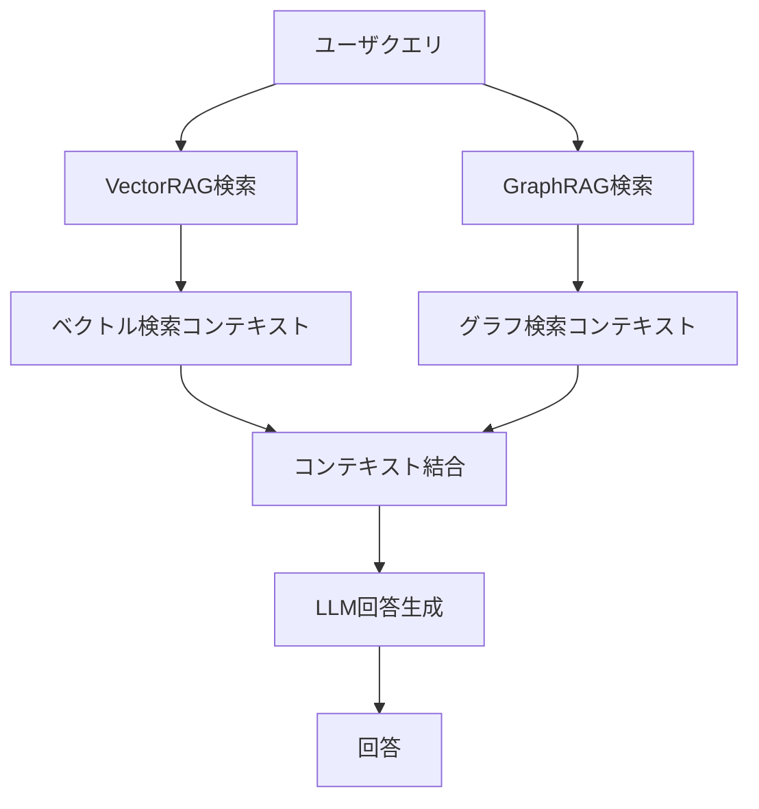

本記事は [HybridRAG (arXiv:2408.04948)](https://arxiv.org/abs/2408.04948) の解説記事です。

## 論文概要（Abstract）

HybridRAGは、ナレッジグラフ（KG）ベースのGraphRAGとベクトルデータベースベースのVectorRAGを統合し、金融文書からの質問応答（Q&A）精度を向上させる手法である。著者らはNifty 50企業（インド国立証券取引所上場の時価総額上位50社）の決算説明会議事録50件を用いて評価を行い、HybridRAGが検索段階・回答生成段階の双方でVectorRAG・GraphRAG単体を上回る性能を示すことを報告している。本手法は金融ドメインに限らず、構造化情報と非構造化情報が混在する文書全般への適用可能性を持つ。

関連するZenn記事「[LlamaIndex v0.14 PropertyGraphIndexで評価駆動型RAGパイプラインを構築する](https://zenn.dev/0h_n0/articles/9ee2f7ab401829)」ではPropertyGraphIndexを用いたKG-RAGの実装を扱っており、本論文のGraphRAGコンポーネントと技術的に対応する。

## 情報源

| 項目 | 内容 |
|------|------|
| arXiv ID | [2408.04948](https://arxiv.org/abs/2408.04948) |
| URL | <https://arxiv.org/abs/2408.04948> |
| 著者 | Bhaskarjit Sarmah, Benika Hall, Rohan Rao, Sunil Patel, Stefano Pasquali, Dhagash Mehta |
| 発表年 | 2024年8月 |
| 分野 | cs.CL, cs.LG, q-fin.ST, stat.AP, stat.ML |
| ページ数 | 9ページ（図2、表5） |

## 背景と動機

金融文書、特に決算説明会議事録（earnings call transcripts）は、ドメイン固有の専門用語、複雑な文書構造、エンティティ間の暗黙的な関係を含む。従来のVectorRAGは意味的類似度に基づくチャンク検索を行うが、エンティティ間の構造的関係（例：「企業Aの売上高はセグメントBに起因する」）の把握が困難であるという課題がある。

一方、GraphRAGはナレッジグラフのトリプレット（主語-述語-目的語）を通じて構造的関係を明示的に表現できるが、文書全体の文脈やニュアンスの把握が難しく、抽象的な質問（明示的なエンティティを含まない質問）への対応が弱い。

著者らはこの相補性に着目し、両手法のコンテキストを統合するHybridRAGを提案した。VectorRAGが得意とする意味的類似度ベースの検索とGraphRAGが得意とする構造的関係の抽出を組み合わせることで、単独手法の弱点を補完する設計である。

## 主要な貢献

- **HybridRAGアーキテクチャの提案**: VectorRAGとGraphRAGの検索コンテキストを結合し、LLMに統合コンテキストとして供給する手法を設計
- **金融ドメイン評価データセットの構築**: Nifty 50企業の決算説明会議事録50件から400組のQ&Aペアを抽出し、Ground Truthとして利用
- **包括的な評価フレームワーク**: Faithfulness、Answer Relevance、Context Precision、Context Recallの4指標で検索・生成の両段階を定量評価
- **相補性の実証**: GraphRAGが抽出型質問（明示的エンティティを含む質問）で優れ、VectorRAGが抽象型質問で優れることを示し、統合の合理性を実証

## 技術的詳細

### HybridRAGアーキテクチャ

HybridRAGのパイプラインは以下の3段階で構成される。



1. **VectorRAG検索**: クエリをembeddingに変換し、ベクトルストア（Pinecone）から意味的に類似するチャンクをTop-4で取得
2. **GraphRAG検索**: クエリからエンティティを抽出し、ナレッジグラフ上でトラバーサルを行い関連トリプレットを取得
3. **コンテキスト結合**: 両者のコンテキストを単純に連結（concatenate）し、統合コンテキストとしてLLMに供給

著者らは結合戦略として単純連結を採用しており、重み付けやリランキングは行っていない。この設計選択は実装の簡潔さを優先したものと考えられる。

### ナレッジグラフ構築プロセス

KG構築には2段階のLLMチェーンを用いる。

**第1段階（Data Cleaning Prompt）**: 文書チャンクをLLM（GPT-3.5-Turbo）に入力し、抽象的な中間表現を生成する。これにより文書固有のノイズ（フォーマット、冗長表現）を除去する。

**第2段階（Entity/Relation Extraction Prompt）**: クリーニング済みテキストからエンティティと関係をトリプレット形式で抽出する。トリプレットは以下のネストリスト形式で表現される。

```python
# トリプレットの表現形式
triplet = ['head_entity', 'entity_type', 'relation', 'tail_entity', 'entity_type', 'metadata']

# 例: 決算説明会議事録からの抽出
triplet = ['Infosys', 'Company', 'reported_revenue', '₹38,994 Cr', 'FinancialMetric',
           {'quarter': 'Q1FY24', 'source': 'earnings_call'}]
```

抽出されるエンティティ種別は、企業名、財務指標（売上高、EBITDA等）、経営者、製品・サービス、地域、企業イベント、法規制情報などである。

### VectorRAGの構成

| パラメータ | 値 |
|-----------|-----|
| Embeddingモデル | OpenAI text-embedding-ada-002 |
| チャンクサイズ | 1024文字 |
| チャンクオーバーラップ | 0 |
| ベクトルストア | Pinecone |
| 検索候補数 | 20 |
| 最終取得数 | Top-4 |
| LLM | GPT-3.5-Turbo（temperature=0） |

### 評価指標の数学的定義

**Faithfulness（忠実性）**: 生成された回答がコンテキストから推論可能かを測定する。回答を個別のstatement $$s_i$$に分解し、各statementがコンテキストに支持されるかを検証する。

$$F = \frac{|V|}{|S|}$$

ここで$$V$$はコンテキストに支持されるstatementの集合、$$S$$は全statementの集合である。

**Answer Relevance（回答関連性）**: 生成回答が元の質問にどの程度適切に対応しているかを評価する。回答から$$n$$個の質問$$q_i$$を逆生成し、元の質問$$q$$とのコサイン類似度の平均を算出する。

$$AR = \frac{1}{n}\sum_{i=1}^{n} \text{sim}(q, q_i)$$

**Context Precision（コンテキスト精度）**: 検索された上位コンテキストに関連アイテムがどの程度含まれるかを測定する。

**Context Recall（コンテキスト再現率）**: Ground Truth回答の各文がコンテキストに帰属可能かの割合を算出する。

## 実装のポイント

本論文の実装はLangChainフレームワークとNetworkXを基盤としているが、関連するZenn記事で扱うLlamaIndex v0.14のPropertyGraphIndexを用いても同等のアーキテクチャを構築できる。

LlamaIndexの`PropertyGraphIndex`はエンティティ・リレーション抽出とグラフストレージを統合的に提供し、`VectorContextRetriever`と`TextToCypherRetriever`を組み合わせることでHybridRAG相当のパイプラインを実現可能である。

```python
from llama_index.core import PropertyGraphIndex, VectorStoreIndex
from llama_index.core.retrievers import QueryFusionRetriever

# VectorRAG: ベクトルインデックスからの検索
vector_retriever = vector_index.as_retriever(similarity_top_k=4)

# GraphRAG: PropertyGraphIndexからの検索
graph_retriever = graph_index.as_retriever(
    include_text=True,
    sub_retrievers=[
        vector_context_retriever,  # KG上のベクトル検索
        cypher_retriever,          # Cypherクエリ検索
    ]
)

# HybridRAG: 両者を統合
hybrid_retriever = QueryFusionRetriever(
    retrievers=[vector_retriever, graph_retriever],
    mode="simple",  # 単純連結（論文のconcat戦略に対応）
)
```

論文ではコンテキスト結合に単純連結を採用しているが、実運用ではリランキング（Cohere Rerank等）やReciprocal Rank Fusionを適用することで、Context Precisionの改善が期待できる。

## Production Deployment Guide

### AWS構成パターン

HybridRAGを本番環境にデプロイする際の3段階の構成を示す。コストはus-east-1リージョン、2024年9月時点の料金に基づく概算である。

| 構成 | 想定規模 | 月額コスト概算 | 主要サービス |
|------|---------|--------------|-------------|
| Small | ドキュメント100件以下、QPS < 5 | $200-400 | Lambda + Bedrock + DynamoDB |
| Medium | ドキュメント1,000件、QPS < 50 | $800-1,500 | ECS Fargate + OpenSearch + Neptune |
| Large | ドキュメント10,000件以上、QPS > 100 | $3,000-6,000 | EKS + Karpenter + Neptune + OpenSearch |

### Small構成: Lambda + Bedrock + DynamoDB

サーバレスで最小コスト。PoC・社内ツール向け。

```hcl
# terraform/small/main.tf

terraform {
  required_providers {
    aws = {
      source  = "hashicorp/aws"
      version = "~> 5.0"
    }
  }
}

provider "aws" {
  region = "us-east-1"
}

# --- DynamoDB: KGトリプレット格納 ---
resource "aws_dynamodb_table" "kg_triplets" {
  name         = "hybridrag-kg-triplets"
  billing_mode = "PAY_PER_REQUEST"
  hash_key     = "head_entity"
  range_key    = "relation_tail"

  attribute {
    name = "head_entity"
    type = "S"
  }

  attribute {
    name = "relation_tail"
    type = "S"
  }

  # GSI: tail_entity からの逆引き
  global_secondary_index {
    name            = "tail-entity-index"
    hash_key        = "relation_tail"
    projection_type = "ALL"
  }

  tags = {
    Project = "hybridrag"
    Env     = "small"
  }
}

# --- S3: ドキュメント格納 ---
resource "aws_s3_bucket" "documents" {
  bucket = "hybridrag-documents-${data.aws_caller_identity.current.account_id}"

  tags = {
    Project = "hybridrag"
  }
}

resource "aws_s3_bucket_versioning" "documents" {
  bucket = aws_s3_bucket.documents.id
  versioning_configuration {
    status = "Enabled"
  }
}

# --- Bedrock: LLM推論 ---
# Bedrock Knowledge Base for VectorRAG
resource "aws_bedrockagent_knowledge_base" "vector_kb" {
  name     = "hybridrag-vector-kb"
  role_arn = aws_iam_role.bedrock_kb_role.arn

  knowledge_base_configuration {
    type = "VECTOR"
    vector_knowledge_base_configuration {
      embedding_model_arn = "arn:aws:bedrock:us-east-1::foundation-model/amazon.titan-embed-text-v2:0"
    }
  }

  storage_configuration {
    type = "OPENSEARCH_SERVERLESS"
    opensearch_serverless_configuration {
      collection_arn    = aws_opensearchserverless_collection.vectors.arn
      vector_index_name = "hybridrag-vectors"
      field_mapping {
        vector_field   = "embedding"
        text_field     = "text"
        metadata_field = "metadata"
      }
    }
  }
}

# --- Lambda: クエリ処理 ---
resource "aws_lambda_function" "query_handler" {
  function_name = "hybridrag-query"
  runtime       = "python3.12"
  handler       = "handler.lambda_handler"
  timeout       = 120
  memory_size   = 512

  filename         = data.archive_file.lambda_zip.output_path
  source_code_hash = data.archive_file.lambda_zip.output_base64sha256

  role = aws_iam_role.lambda_role.arn

  environment {
    variables = {
      KG_TABLE_NAME      = aws_dynamodb_table.kg_triplets.name
      BEDROCK_MODEL_ID   = "anthropic.claude-sonnet-4-20250514"
      EMBEDDING_MODEL_ID = "amazon.titan-embed-text-v2:0"
    }
  }
}

data "aws_caller_identity" "current" {}
```

### Large構成: EKS + Karpenter

大規模運用向け。自動スケーリングとGPUノードの動的確保。

```hcl
# terraform/large/eks.tf

module "eks" {
  source  = "terraform-aws-modules/eks/aws"
  version = "~> 20.0"

  cluster_name    = "hybridrag-cluster"
  cluster_version = "1.30"

  vpc_id     = module.vpc.vpc_id
  subnet_ids = module.vpc.private_subnets

  cluster_endpoint_public_access = true

  eks_managed_node_groups = {
    system = {
      instance_types = ["m6i.xlarge"]
      min_size       = 2
      max_size       = 4
      desired_size   = 2

      labels = {
        role = "system"
      }
    }
  }

  # Karpenter用IAM
  enable_karpenter = true

  tags = {
    Project = "hybridrag"
    Env     = "large"
  }
}

# --- Karpenter NodePool: GPU推論ノード ---
resource "kubectl_manifest" "karpenter_nodepool" {
  yaml_body = yamlencode({
    apiVersion = "karpenter.sh/v1"
    kind       = "NodePool"
    metadata = {
      name = "gpu-inference"
    }
    spec = {
      template = {
        spec = {
          nodeClassRef = {
            group = "karpenter.k8s.aws"
            kind  = "EC2NodeClass"
            name  = "default"
          }
          requirements = [
            {
              key      = "node.kubernetes.io/instance-type"
              operator = "In"
              values   = ["g5.xlarge", "g5.2xlarge"]
            },
            {
              key      = "karpenter.sh/capacity-type"
              operator = "In"
              values   = ["spot", "on-demand"]
            }
          ]
          taints = [
            {
              key    = "nvidia.com/gpu"
              effect = "NoSchedule"
            }
          ]
        }
      }
      limits = {
        cpu    = "128"
        memory = "512Gi"
      }
      disruption = {
        consolidationPolicy = "WhenEmptyOrUnderutilized"
        consolidateAfter    = "60s"
      }
    }
  })
}

# --- Neptune: ナレッジグラフDB ---
resource "aws_neptune_cluster" "kg" {
  cluster_identifier = "hybridrag-kg"
  engine             = "neptune"
  engine_version     = "1.3.2.0"

  neptune_cluster_parameter_group_name = aws_neptune_cluster_parameter_group.kg.name

  vpc_security_group_ids = [aws_security_group.neptune.id]
  neptune_subnet_group_name = aws_neptune_subnet_group.kg.name

  backup_retention_period = 7
  preferred_backup_window = "03:00-04:00"

  serverless_v2_scaling_configuration {
    min_capacity = 2.5
    max_capacity = 64
  }

  tags = {
    Project = "hybridrag"
    Env     = "large"
  }
}

resource "aws_neptune_cluster_instance" "kg" {
  count              = 2
  cluster_identifier = aws_neptune_cluster.kg.id
  instance_class     = "db.serverless"
  engine             = "neptune"
}
```

### 運用・監視

HybridRAGの本番運用では、以下の3軸でのモニタリングが不可欠である。

**レイテンシ監視（CloudWatch + X-Ray）**:

```python
# CloudWatch Embedded Metric Format でレイテンシを記録
import json
import time
from aws_lambda_powertools import Metrics, Tracer

tracer = Tracer(service="hybridrag")
metrics = Metrics(namespace="HybridRAG")

@tracer.capture_method
def hybrid_retrieve(query: str) -> dict:
    """HybridRAG検索のトレース付き実装"""
    start = time.monotonic()

    # VectorRAG検索（X-Rayサブセグメント）
    with tracer.provider.in_subsegment("vector_retrieval") as subseg:
        vector_ctx = vector_retrieve(query)
        subseg.put_annotation("chunk_count", len(vector_ctx))

    # GraphRAG検索（X-Rayサブセグメント）
    with tracer.provider.in_subsegment("graph_retrieval") as subseg:
        graph_ctx = graph_retrieve(query)
        subseg.put_annotation("triplet_count", len(graph_ctx))

    # コンテキスト結合
    combined_ctx = vector_ctx + graph_ctx

    elapsed_ms = (time.monotonic() - start) * 1000
    metrics.add_metric(name="RetrievalLatencyMs", unit="Milliseconds", value=elapsed_ms)
    metrics.add_metric(name="ContextTokens", unit="Count", value=count_tokens(combined_ctx))

    return {"context": combined_ctx, "latency_ms": elapsed_ms}
```

**コスト監視（Cost Explorer + Budget Alert）**:

Bedrockの入出力トークン課金はクエリ量に比例するため、Cost Explorerで日次トレンドを追跡する。以下のアラートを設定する。

| アラート | 閾値 | アクション |
|---------|------|----------|
| 日次Bedrockコスト | 予算の120% | SNS通知 |
| Lambdaエラー率 | 5%超 | PagerDuty連携 |
| Neptuneスロークエリ | 5秒超 | CloudWatch Alarm |
| OpenSearchインデックスサイズ | 80% | 自動スケーリング |

**品質監視（RAG評価メトリクス）**:

論文の4指標（Faithfulness、Answer Relevance、Context Precision、Context Recall）を定期バッチで計測し、精度劣化を検知する。

```python
# 品質モニタリングバッチ（日次実行）
from ragas import evaluate
from ragas.metrics import faithfulness, answer_relevancy, context_precision, context_recall

def daily_quality_check(test_dataset: list[dict]) -> dict:
    """テストデータセットでRAG品質を定期評価"""
    result = evaluate(
        dataset=test_dataset,
        metrics=[faithfulness, answer_relevancy, context_precision, context_recall],
    )
    scores = result.to_pandas().mean().to_dict()

    # 閾値チェック
    thresholds = {
        "faithfulness": 0.90,
        "answer_relevancy": 0.85,
        "context_precision": 0.75,
        "context_recall": 0.90,
    }
    alerts = {k: v for k, v in scores.items() if v < thresholds.get(k, 0)}
    if alerts:
        send_alert(f"RAG quality degradation: {alerts}")

    return scores
```

### コスト最適化チェックリスト

以下のチェックリストに基づき、定期的にコストを見直す。

**インフラストラクチャ**:

1. [ ] Lambda関数のメモリサイズは適切か（Power Tuningで最適値を特定）
2. [ ] DynamoDB/NeptuneのキャパシティモードはPAY_PER_REQUESTかプロビジョンドか使用パターンに適合しているか
3. [ ] OpenSearch Serverlessを使用している場合、OCU最小値は必要最小限か
4. [ ] EKSノードでSpotインスタンスを活用しているか（Karpenter consolidation設定済み）
5. [ ] NATゲートウェイ経由のデータ転送量を最小化しているか（VPCエンドポイント利用）
6. [ ] S3ライフサイクルポリシーで古い文書をGlacierに移行しているか
7. [ ] CloudWatchログの保持期間は適切か（30日以上の場合はS3エクスポート）

**LLM/Embedding**:

8. [ ] Bedrock Provisioned Throughputの利用を検討したか（安定QPS > 10の場合）
9. [ ] Embeddingモデルはコスト対精度で最適な選択か（Titan Embed v2 vs Cohere Embed）
10. [ ] プロンプトキャッシュを有効化しているか（同一システムプロンプトの再利用）
11. [ ] 不要に大きなモデルを使用していないか（Claude Haiku で十分なタスクはないか）
12. [ ] 入力コンテキストの最大トークン数に上限を設けているか

**検索パイプライン**:

13. [ ] VectorRAGのTop-K値は最小限に設定しているか（論文ではTop-4）
14. [ ] GraphRAGのトラバーサル深度に上限を設けているか
15. [ ] 重複コンテキストの除去（deduplication）を行っているか
16. [ ] 検索結果のキャッシュ（Redis/ElastiCache）を導入しているか
17. [ ] バッチクエリの場合、embedding計算をバッチ化しているか

**運用**:

18. [ ] 未使用のOpenSearchインデックスを定期的に削除しているか
19. [ ] Neptuneスナップショットの保持ポリシーを設定しているか
20. [ ] CloudWatch Metricsのカスタムメトリクス数は必要最小限か
21. [ ] X-Rayのサンプリングレートは本番環境で絞っているか（5-10%推奨）
22. [ ] Cost Anomaly Detectionを有効化しているか
23. [ ] タグベースのコスト配分を設定し、プロジェクト別コストを追跡しているか

## 実験結果

著者らはNifty 50企業の決算説明会議事録50件から抽出した400組のQ&Aペアを用いて評価を行った。各議事録は平均27ページ、16問の質疑、約60,000トークンで構成される。18セクター（インフラ、ヘルスケア、銀行、IT等）にわたる多様な企業を対象としている。

### 定量評価結果

以下に論文の実験結果を示す（論文Table 3, 4より）。

| 評価指標 | VectorRAG | GraphRAG | HybridRAG |
|---------|-----------|----------|-----------|
| Faithfulness | 0.94 | 0.96 | **0.96** |
| Answer Relevance | 0.91 | 0.89 | **0.96** |
| Context Precision | 0.84 | **0.96** | 0.79 |
| Context Recall | **1.00** | 0.85 | **1.00** |

HybridRAGはFaithfulness（0.96）、Answer Relevance（0.96）、Context Recall（1.00）の3指標で最高値を達成している。一方、Context Precisionは0.79とGraphRAG単体（0.96）を下回る。著者らはこれをコンテキスト連結による情報量増加に起因すると分析しており、VectorRAGとGraphRAGのコンテキストを結合することで検索精度（precision）は低下するが、再現率（recall）と回答品質（faithfulness, relevance）が向上するトレードオフが確認された。

### 質的分析

著者らは質問タイプ別の分析も報告している。

- **抽出型質問**（明示的なエンティティを含む質問、例：「Infosysの Q1FY24 売上高は？」）: GraphRAGが優位。KGのトリプレットから直接的に回答を取得可能
- **抽象型質問**（明示的なエンティティを含まない質問、例：「今四半期の成長要因は何か？」）: VectorRAGが優位。文書全体の文脈を捉えたチャンク検索が有効
- **HybridRAG**: 両タイプの質問に対してバランスの取れた回答を生成

## 実運用への応用

本論文の知見は、Zenn記事「[LlamaIndex v0.14 PropertyGraphIndexで評価駆動型RAGパイプラインを構築する](https://zenn.dev/0h_n0/articles/9ee2f7ab401829)」で実装されているPropertyGraphIndex + VectorContextRetrieverの構成と直接的に対応する。

Zenn記事のPropertyGraphIndexはエンティティ・リレーション抽出を`SchemaLLMPathExtractor`で行い、Neo4jにグラフを格納する構成であり、本論文のGraphRAGコンポーネント（LLMチェーンによるトリプレット抽出 + NetworkX）と機能的に等価である。

実運用での改善ポイントとして以下が挙げられる。

1. **コンテキスト結合戦略の改善**: 論文の単純連結ではContext Precisionが低下するため、Reciprocal Rank FusionやCohere Rerankによるリランキングを追加する
2. **動的KG更新**: 論文では静的KGを前提としているが、実運用ではドキュメント追加時のインクリメンタルKG更新が必要
3. **マルチモーダル拡張**: 決算資料のグラフ・表を含むマルチモーダル入力への対応
4. **評価の自動化**: 論文の4指標をCI/CDパイプラインに組み込み、モデル更新時の品質回帰を検知する

## 関連研究

- **Lewis et al. (2020)**: RAG（Retrieval Augmented Generation）の原論文。パラメトリック知識と非パラメトリック知識を組み合わせるフレームワークを提案
- **Edge et al. (2024)**: GraphRAGの代表的研究。コミュニティ検出を用いたグラフ要約によるグローバルクエリ対応
- **Sarmah et al. (2023)**: 金融ドメインにおけるLLMのハルシネーション削減手法。本論文の著者グループによる先行研究
- **Li & Passino (2024)**: 金融ナレッジグラフの構築と応用に関するサーベイ
- **Izacard & Grave (2021)**: Fusion-in-Decoder。複数の検索結果をデコーダで統合する手法で、HybridRAGのコンテキスト統合と思想的に共通する

## まとめと今後の展望

HybridRAGは、VectorRAGとGraphRAGのコンテキストを連結するシンプルな設計ながら、金融文書Q&Aにおいて両手法単体を上回るFaithfulness・Answer Relevance・Context Recallを達成した。特にAnswer Relevanceの改善（VectorRAG: 0.91 → HybridRAG: 0.96）は、構造的関係と意味的類似度の相補性を実証する結果である。

今後の展望として、著者らはコンテキスト結合戦略の高度化（重み付け、リランキング）、動的KG更新、金融以外のドメイン（法務、医療等）への適用拡大を挙げている。実装面では、LlamaIndexのPropertyGraphIndex等の成熟したフレームワークを活用することで、論文の知見を比較的少ないコードで本番環境に適用できる段階にある。

## 参考文献

- Sarmah, B., Hall, B., Rao, R., Patel, S., Pasquali, S., & Mehta, D. (2024). HybridRAG: Integrating Knowledge Graphs and Vector Retrieval Augmented Generation for Efficient Information Extraction. [arXiv:2408.04948](https://arxiv.org/abs/2408.04948)
- [LlamaIndex v0.14 PropertyGraphIndexで評価駆動型RAGパイプラインを構築する](https://zenn.dev/0h_n0/articles/9ee2f7ab401829) — 関連Zenn記事
