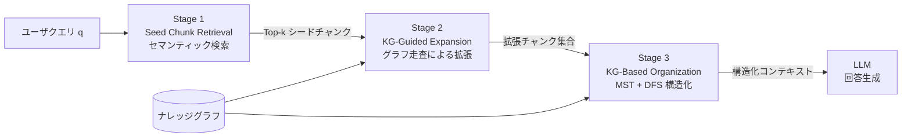
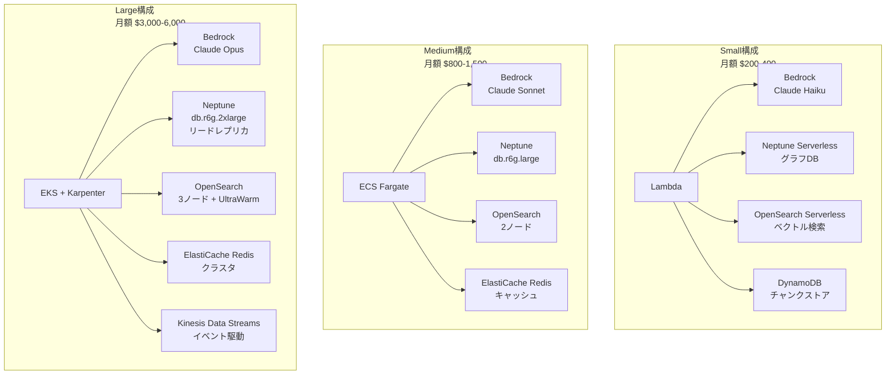

本記事は [KG²RAG: Knowledge Graph-Guided Retrieval Augmented Generation (arXiv:2502.06864)](https://arxiv.org/abs/2502.06864) の解説記事です。

## 論文概要（Abstract）

著者らは、ナレッジグラフ（KG）を活用してRAGの検索品質を改善するフレームワーク「KG²RAG（Knowledge Graph-Guided Retrieval Augmented Generation）」を提案している。従来のセマンティック検索では、チャンク間の事実レベルの関係性が考慮されず、検索結果が類似した内容に偏る（均質性）問題や、冗長なチャンクが含まれる問題があった。KG²RAGは、文書から抽出したナレッジグラフを用いて、セマンティック検索で得た「シードチャンク」をグラフ走査で拡張し、さらにグラフ構造に基づいてコンテキストを構造化する3段階パイプラインにより、検索結果の多様性と一貫性を向上させる。HotpotQAデータセットでの実験では、回答品質（F1: 0.663）および検索品質（F1: 0.436）において、既存手法を上回る結果が報告されている。

この記事は [Zenn記事: LlamaIndex v0.14 PropertyGraphIndexで評価駆動型RAGパイプラインを構築する](https://zenn.dev/0h_n0/articles/9ee2f7ab401829) の深掘りです。KG²RAGのKG構築・グラフ走査・コンテキスト構造化の手法は、LlamaIndexのPropertyGraphIndexやVectorContextRetrieverを用いた実装と対応関係にあり、実践的な知見を提供する。

## 情報源

- **arXiv ID**: 2502.06864
- **URL**: [https://arxiv.org/abs/2502.06864](https://arxiv.org/abs/2502.06864)
- **著者**: Xiangrong Zhu, Yuexiang Xie, Yi Liu, Yaliang Li, Wei Hu
- **発表年**: 2025
- **会議**: NAACL 2025
- **分野**: cs.CL（Computation and Language）, cs.AI（Artificial Intelligence）

## 背景と動機（Background & Motivation）

RAG（Retrieval Augmented Generation）は、外部知識を検索してLLMの回答に活用する手法として広く利用されている。しかし、一般的なセマンティック検索ベースのRAGには、著者らが指摘する2つの構造的課題がある。

**チャンクの孤立性**: 文書をチャンクに分割した時点でチャンク間の関係性が失われる。セマンティック検索ではクエリとの類似度のみで検索するため、「クエリに直接類似しないが、回答に必要な関連チャンク」を見逃す傾向がある。特にマルチホップ質問応答では、複数のチャンクに分散した事実を結びつける必要があるため、この問題が顕著になる。

**検索結果の均質性と冗長性**: セマンティック類似度の高いチャンクは内容が重複しやすく、Top-kの検索結果が似た情報ばかりになる。これはLLMに提供するコンテキストの情報密度を低下させ、回答品質の劣化を招く。

著者らは、ナレッジグラフがチャンク間の事実レベルの関係を明示的に表現できる点に着目し、KGをRAGの検索パイプラインに統合することで、これらの課題を解決するKG²RAGフレームワークを提案している。

## 主要な貢献（Key Contributions）

- **貢献1**: チャンク間の事実レベル関係をナレッジグラフで表現し、セマンティック検索と組み合わせるKG²RAGフレームワークの提案。検索結果の多様性と一貫性を同時に向上させる
- **貢献2**: KG-guided chunk expansion（KGガイドチャンク拡張）の導入。グラフ走査により、セマンティック類似度が低くても事実的に関連するチャンクを検索結果に含める
- **貢献3**: KG-based chunk organization（KGベースチャンク構造化）の導入。最大全域木（MST）と深さ優先探索（DFS）を用いて、検索結果を論理的に一貫したコンテキストとして再構成する
- **貢献4**: HotpotQA（Distractor / Full Wiki）、MuSiQue、TriviaQAにおける包括的な実験評価。回答品質と検索品質の両面でGraphRAG、LightRAGを含む既存手法を上回る結果を実証

## 技術的詳細（Technical Details）

### 全体アーキテクチャ

KG²RAGは3つの段階からなるパイプラインで構成される。



### KG構築プロセス

文書集合 $$\mathcal{D}$$ から、LLMを用いてトリプレット（主語エンティティ $$h$$、関係 $$r$$、目的語エンティティ $$t$$）を抽出し、チャンクとの対応関係を保持したナレッジグラフ $$\mathcal{G}$$ を構築する。

$$
\mathcal{G} = \{(h, r, t, c) \mid c \in \mathcal{D}\}
$$

ここで $$c$$ はトリプレットが抽出されたチャンクを示す。HotpotQAの実験では、66,581文書から211,356個のトリプレット（98,226エンティティ、19,813リレーション）が抽出されている。チャンクあたり平均2.07トリプレットであり、分布はロングテールになると報告されている。

論文では、KG構築のLLM呼び出しコストについてGraphRAGやLightRAGとの比較も行っている。KG²RAGはチャンクあたり583トークン・1回のLLM呼び出しで済むのに対し、LightRAGは1,650トークン、GraphRAGは3,420トークン・5回のLLM呼び出しを要する。

### Stage 1: Semantic-Based Seed Chunk Retrieval

クエリ $$q$$ と全チャンクのコサイン類似度を計算し、上位 $$k$$ 件をシードチャンク集合 $$\mathcal{D}_q$$ として取得する。

$$
\mathcal{S} = \{s(q, c) \mid c \in \mathcal{D}\}
$$

ここで $$s(q, c)$$ は埋め込みベクトル間のコサイン類似度である。デフォルトでは $$k = 10$$ が使用されている。この段階は一般的なRAGと同等であり、KG²RAGの差別化はStage 2以降にある。

### Stage 2: KG-Guided Chunk Expansion

シードチャンクに含まれるエンティティをKG上で特定し、$$m$$-ホップの幅優先探索（BFS）でグラフを走査する。

$$
\mathcal{G}_q^m = \text{traverse}(\mathcal{G}, \mathcal{G}_q^0, m)
$$

$$\mathcal{G}_q^0$$ はシードチャンクに含まれるエンティティから構成される初期サブグラフ、$$m$$ はホップ数を表す。走査の結果、新たに到達したエンティティに関連するチャンクが拡張チャンク集合 $$\mathcal{D}_q^m$$ に追加される。

$$
\mathcal{D}_q^m = \{c \mid (h, r, t, c) \in \mathcal{G}_q^m\}
$$

この拡張により、クエリとのセマンティック類似度は低いものの、事実的に関連するチャンクが検索結果に含まれるようになる。著者らは、これにより「同一または関連するエンティティを含むチャンクがセマンティック類似度に依存せずに収集され、より大きな多様性と包括的な知識ネットワークが形成される」と述べている。

ハイパーパラメータ分析では、$$m = 1$$（1ホップ）が最適であり、$$m = 2, 3$$ ではF1が0.663から0.656-0.658にやや低下すると報告されている。

### Stage 3: KG-Based Chunk Organization

拡張されたチャンク集合はそのままでは冗長なエッジを含むため、以下の2段階で構造化される。

**フィルタリング**: 拡張サブグラフを無向重み付きグラフに変換し、エッジの重みとしてセマンティック類似度を使用する。各連結成分について最大全域木（Maximum Spanning Tree, MST）を計算し、冗長なエッジを除去する。これにより、最も関連性の高い接続のみが保持される。

**配置**: MSTの各エッジに対応するテキスト表現（トリプレット）を、深さ優先探索（DFS）の順序で連結し、一貫したパラグラフを形成する。各パラグラフはクロスエンコーダによる関連度スコア $$R(q, \mathcal{T}_i)$$ で順序付けされる。

$$
R(q, \mathcal{T}_i) = C(q, \text{conc}(\mathcal{T}_i))
$$

ここで $$C$$ はクロスエンコーダのスコアリング関数、$$\text{conc}(\mathcal{T}_i)$$ はMSTのエッジに対応するテキストの連結を表す。

## 実装のポイント（Implementation Notes）

### 使用モデルとパラメータ

論文の実験では以下のモデルが使用されている。

| コンポーネント | モデル |
|---|---|
| KG構築（トリプレット抽出） | LLaMA3-8B |
| テキスト埋め込み | mxbai-embed-large |
| クロスエンコーダ（リランキング） | bge-reranker-large |
| 回答生成 | LLaMA3-8B |

### LlamaIndex PropertyGraphIndex との対応関係

KG²RAGの3段階パイプラインは、LlamaIndexのPropertyGraphIndexの構成要素と以下のように対応する。

| KG²RAG | LlamaIndex |
|---|---|
| KG構築（トリプレット抽出） | `SchemaLLMPathExtractor` / `ImplicitPathExtractor` |
| Stage 1: Seed Chunk Retrieval | `VectorContextRetriever`（埋め込みベースの検索） |
| Stage 2: KG-Guided Expansion | `LLMSynonymRetriever` + グラフ走査（カスタム実装が必要） |
| Stage 3: KG-Based Organization | `CustomRetriever` でMST + DFSロジックを実装 |

Zenn記事で解説されているPropertyGraphIndexの`VectorContextRetriever`は、KG²RAGのStage 1に相当する。Stage 2のKGガイド拡張を実現するには、PropertyGraphIndex内部のNeo4j等のグラフストアに対してCypherクエリでm-ホップ走査を実装するアプローチが考えられる。Stage 3の構造化は、NetworkXライブラリのMSTアルゴリズムとDFS走査を組み合わせたカスタムリトリーバとして実装できる。

## Production Deployment Guide

### アーキテクチャパターン

KG²RAGをプロダクション環境に展開する際の3つの構成パターンを示す。



### コスト比較表

| 項目 | Small | Medium | Large |
|---|---|---|---|
| コンピュート | Lambda ($20) | ECS Fargate ($150) | EKS + Karpenter ($500) |
| LLM推論 | Bedrock Haiku ($50) | Bedrock Sonnet ($300) | Bedrock Opus ($1,500) |
| グラフDB | Neptune Serverless ($80) | Neptune r6g.large ($200) | Neptune r6g.2xlarge + RR ($600) |
| ベクトル検索 | OpenSearch Serverless ($30) | OpenSearch 2ノード ($120) | OpenSearch 3ノード ($300) |
| ストレージ | DynamoDB ($10) | DynamoDB + Redis ($50) | DynamoDB + Redis Cluster ($200) |
| 監視 | CloudWatch ($10) | CloudWatch + X-Ray ($30) | CloudWatch + X-Ray + Grafana ($100) |
| **月額合計** | **$200-400** | **$800-1,500** | **$3,000-6,000** |
| 想定QPS | 1-5 | 10-50 | 50-500 |
| 想定ドキュメント数 | ~10K | ~100K | ~1M |

### Small構成: Lambda + Bedrock + Neptune Serverless

```hcl
# --- KG²RAG Small構成 Terraform ---

# Neptune Serverless（グラフDB）
resource "aws_neptune_cluster" "kg_graph" {
  cluster_identifier                   = "kg2rag-graph"
  engine                               = "neptune"
  serverless_v2_scaling_configuration {
    min_capacity = 1.0
    max_capacity = 8.0
  }
  backup_retention_period = 7
  preferred_backup_window = "03:00-04:00"
  vpc_security_group_ids  = [aws_security_group.neptune.id]
  db_subnet_group_name    = aws_neptune_subnet_group.main.name

  tags = { Environment = "production", Service = "kg2rag" }
}

resource "aws_neptune_cluster_instance" "kg_graph_instance" {
  cluster_identifier = aws_neptune_cluster.kg_graph.id
  instance_class     = "db.serverless"
  engine             = "neptune"
}

# OpenSearch Serverless（ベクトル検索）
resource "aws_opensearchserverless_collection" "vectors" {
  name = "kg2rag-vectors"
  type = "VECTORSEARCH"
}

resource "aws_opensearchserverless_security_policy" "vectors_enc" {
  name   = "kg2rag-vectors-enc"
  type   = "encryption"
  policy = jsonencode({
    Rules = [{ ResourceType = "collection", Resource = ["collection/kg2rag-vectors"] }]
    AWSOwnedKey = true
  })
}

# DynamoDB（チャンクストア）
resource "aws_dynamodb_table" "chunks" {
  name         = "kg2rag-chunks"
  billing_mode = "PAY_PER_REQUEST"
  hash_key     = "chunk_id"

  attribute {
    name = "chunk_id"
    type = "S"
  }

  point_in_time_recovery { enabled = true }
  tags = { Environment = "production", Service = "kg2rag" }
}

# Lambda関数
resource "aws_lambda_function" "kg2rag_api" {
  function_name = "kg2rag-api"
  runtime       = "python3.12"
  handler       = "handler.lambda_handler"
  memory_size   = 1024
  timeout       = 300

  environment {
    variables = {
      NEPTUNE_ENDPOINT   = aws_neptune_cluster.kg_graph.endpoint
      OPENSEARCH_ENDPOINT = aws_opensearchserverless_collection.vectors.collection_endpoint
      DYNAMODB_TABLE     = aws_dynamodb_table.chunks.name
      BEDROCK_MODEL_ID   = "anthropic.claude-3-haiku-20240307-v1:0"
    }
  }

  tracing_config { mode = "Active" }
  tags = { Environment = "production", Service = "kg2rag" }
}
```

### Large構成: EKS + Karpenter

```hcl
# --- KG²RAG Large構成 Terraform（抜粋）---

# EKSクラスタ
module "eks" {
  source          = "terraform-aws-modules/eks/aws"
  version         = "~> 20.0"
  cluster_name    = "kg2rag-cluster"
  cluster_version = "1.31"

  vpc_id     = module.vpc.vpc_id
  subnet_ids = module.vpc.private_subnets

  eks_managed_node_groups = {
    system = {
      instance_types = ["m7i.xlarge"]
      min_size       = 2
      max_size       = 4
      desired_size   = 2
    }
  }

  tags = { Environment = "production", Service = "kg2rag" }
}

# Karpenter NodePool
resource "kubectl_manifest" "karpenter_nodepool" {
  yaml_body = yamlencode({
    apiVersion = "karpenter.sh/v1"
    kind       = "NodePool"
    metadata   = { name = "kg2rag-workers" }
    spec = {
      template = {
        spec = {
          requirements = [
            { key = "karpenter.sh/capacity-type", operator = "In", values = ["spot", "on-demand"] },
            { key = "node.kubernetes.io/instance-type", operator = "In",
              values = ["m7i.2xlarge", "m7i.4xlarge", "r7i.2xlarge"] }
          ]
        }
      }
      limits   = { cpu = "128", memory = "512Gi" }
      disruption = {
        consolidationPolicy = "WhenEmptyOrUnderutilized"
        consolidateAfter    = "60s"
      }
    }
  })
}

# Neptune（専用インスタンス + リードレプリカ）
resource "aws_neptune_cluster" "kg_graph_large" {
  cluster_identifier      = "kg2rag-graph-large"
  engine                  = "neptune"
  backup_retention_period = 14

  tags = { Environment = "production", Service = "kg2rag" }
}

resource "aws_neptune_cluster_instance" "writer" {
  cluster_identifier = aws_neptune_cluster.kg_graph_large.id
  instance_class     = "db.r6g.2xlarge"
  engine             = "neptune"
}

resource "aws_neptune_cluster_instance" "reader" {
  count              = 2
  cluster_identifier = aws_neptune_cluster.kg_graph_large.id
  instance_class     = "db.r6g.xlarge"
  engine             = "neptune"
}
```

### 運用・監視

```hcl
# CloudWatch ダッシュボード
resource "aws_cloudwatch_dashboard" "kg2rag" {
  dashboard_name = "kg2rag-operations"
  dashboard_body = jsonencode({
    widgets = [
      {
        type   = "metric"
        properties = {
          title   = "KG²RAG Retrieval Latency (p50/p95/p99)"
          metrics = [
            ["KG2RAG", "RetrievalLatency", "Stage", "SeedRetrieval", { stat = "p50" }],
            ["KG2RAG", "RetrievalLatency", "Stage", "KGExpansion", { stat = "p50" }],
            ["KG2RAG", "RetrievalLatency", "Stage", "Organization", { stat = "p50" }],
            ["KG2RAG", "RetrievalLatency", "Stage", "Total", { stat = "p95" }],
            ["KG2RAG", "RetrievalLatency", "Stage", "Total", { stat = "p99" }]
          ]
          period = 300
        }
      },
      {
        type   = "metric"
        properties = {
          title   = "Neptune Graph Operations"
          metrics = [
            ["AWS/Neptune", "GremlinRequestsPerSec", "DBClusterIdentifier", "kg2rag-graph"],
            ["AWS/Neptune", "GremlinErrors", "DBClusterIdentifier", "kg2rag-graph"],
            ["AWS/Neptune", "VolumeBytesUsed", "DBClusterIdentifier", "kg2rag-graph"]
          ]
        }
      },
      {
        type   = "metric"
        properties = {
          title   = "Bedrock LLM Usage"
          metrics = [
            ["AWS/Bedrock", "Invocations"],
            ["AWS/Bedrock", "InvocationLatency", { stat = "p95" }],
            ["AWS/Bedrock", "InputTokenCount"],
            ["AWS/Bedrock", "OutputTokenCount"]
          ]
        }
      }
    ]
  })
}

# X-Ray トレーシング（パイプライン各段階の可視化）
resource "aws_xray_group" "kg2rag" {
  group_name        = "kg2rag-pipeline"
  filter_expression = "service(\"kg2rag-api\") AND annotation.pipeline = \"kg2rag\""
}

# CloudWatch Alarm（SLA監視）
resource "aws_cloudwatch_metric_alarm" "latency_p99" {
  alarm_name          = "kg2rag-latency-p99-high"
  comparison_operator = "GreaterThanThreshold"
  evaluation_periods  = 3
  metric_name         = "RetrievalLatency"
  namespace           = "KG2RAG"
  period              = 60
  statistic           = "p99"
  threshold           = 5000
  alarm_description   = "KG²RAG retrieval p99 latency exceeds 5s"
  alarm_actions       = [aws_sns_topic.alerts.arn]
  dimensions          = { Stage = "Total" }
}

resource "aws_cloudwatch_metric_alarm" "error_rate" {
  alarm_name          = "kg2rag-error-rate-high"
  comparison_operator = "GreaterThanThreshold"
  evaluation_periods  = 2
  threshold           = 5

  metric_query {
    id          = "error_rate"
    expression  = "(errors / total) * 100"
    label       = "Error Rate %"
    return_data = true
  }
  metric_query {
    id = "errors"
    metric { metric_name = "5XXError" namespace = "KG2RAG" period = 300 stat = "Sum" }
  }
  metric_query {
    id = "total"
    metric { metric_name = "RequestCount" namespace = "KG2RAG" period = 300 stat = "Sum" }
  }

  alarm_actions = [aws_sns_topic.alerts.arn]
}
```

### コスト最適化チェックリスト

#### インフラストラクチャ

- [ ] Neptune Serverlessの最小/最大NCU設定を実トラフィックに基づいて調整する
- [ ] OpenSearch Serverless OCU（検索・インデックス各2 OCU最小）の必要性を検証する
- [ ] DynamoDBのオンデマンド/プロビジョンドモードを月間リクエスト数で判定する（月100万リクエスト以下ならオンデマンド）
- [ ] Lambda関数のメモリサイズをPower Tuningツールで最適化する
- [ ] EKSノードにSpotインスタンスを使用し、Karpenterの`consolidationPolicy`を有効化する
- [ ] NATゲートウェイのコストを確認し、VPCエンドポイント（Neptune、DynamoDB、Bedrock、S3）に置き換える
- [ ] リードレプリカの台数を読み取りQPSに基づいて調整する

#### LLM推論

- [ ] KG構築のトリプレット抽出にはHaikuなど低コストモデルを使用する（論文ではLLaMA3-8Bで十分と報告）
- [ ] 回答生成のモデル選択を品質要件に基づいて段階的に設定する（まずHaiku、不十分ならSonnet）
- [ ] Bedrock Provisioned Throughputの損益分岐点を計算する（月間100万トークン以上で検討）
- [ ] KG構築はバッチ処理（夜間）で実行し、オンデマンドのLLM呼び出しを減らす
- [ ] プロンプトキャッシュを活用し、同一システムプロンプトの重複課金を回避する

#### データ・ストレージ

- [ ] チャンクの埋め込みベクトルの次元数を検証する（768次元 vs 1024次元のコスト/精度トレードオフ）
- [ ] Neptune TTLを設定し、不要なトリプレットを自動削除する
- [ ] OpenSearchのインデックスライフサイクルポリシーを設定し、古いインデックスをUltraWarmに移行する
- [ ] S3 Intelligent-Tieringで元文書の保存コストを最適化する
- [ ] DynamoDBのTTLで一時的なクエリキャッシュを自動削除する

#### パイプライン効率

- [ ] 頻出クエリの検索結果をRedis/ElastiCacheにキャッシュする（TTL: 1-24時間）
- [ ] KGの増分更新を実装し、全体再構築を避ける（新規文書追加時のみ差分トリプレット抽出）
- [ ] セマンティック検索のTop-k値を実データで検証する（論文ではk=5-10が最適）
- [ ] グラフ走査のホップ数を1に固定する（論文の実験結果に基づく）
- [ ] バッチ推論とリアルタイム推論を分離し、バッチ側にはスポットインスタンスを使用する
- [ ] CloudWatch Cost Anomaly Detectionを有効化し、想定外のコスト増加を早期検知する

## 実験結果（Experimental Results）

### HotpotQA-Distractor での回答品質

論文のTable 1より、HotpotQA-Distractorでの回答品質の比較を示す。

| 手法 | Precision | Recall | F1 |
|---|---|---|---|
| LLM-only | 0.633 | 0.623 | 0.593 |
| Semantic RAG | 0.647 | 0.662 | 0.619 |
| Semantic RAG + Rerank | 0.680 | 0.670 | 0.652 |
| Hybrid RAG | 0.674 | 0.679 | 0.653 |
| GraphRAG | 0.434 | 0.416 | 0.400 |
| LightRAG | 0.652 | 0.650 | 0.616 |
| **KG²RAG** | **0.690** | **0.683** | **0.663** |

KG²RAGはF1で0.663を達成し、次点のHybrid RAG（0.653）を1.5ポイント上回っている。特にGraphRAG（0.400）と比較すると大幅な差がある。GraphRAGはコミュニティベースの要約を使用するため、詳細なファクトレベルの質問には不向きであると著者らは分析している。

### HotpotQA-Full Wiki での回答品質

66,581文書の全Wikipediaセットを対象とした実験では、KG²RAGのF1は0.631であり、Semantic RAG + Rerank（0.587）に対して約8%の改善が報告されている。文書数が増加しても安定した性能を示す点は、スケーラビリティの観点から重要である。

### 検索品質

論文のTable 2より、HotpotQA-Distractorでの検索品質を示す。

| 手法 | Precision | Recall | F1 |
|---|---|---|---|
| Semantic RAG | 0.340 | 0.550 | 0.360 |
| Semantic RAG + Rerank | 0.275 | 0.664 | 0.357 |
| Hybrid RAG | 0.297 | 0.595 | 0.351 |
| **KG²RAG** | **0.301** | **0.908** | **0.436** |

KG²RAGの検索Recallは0.908と突出して高い。これはKG-guided expansionにより、セマンティック検索では見逃されるチャンクがグラフ走査によって網羅的に収集されることを示している。一方でPrecisionは0.301であり、拡張によって無関係なチャンクも含まれる傾向がある。この冗長性はStage 3のOrganizationによって緩和されている。

### アブレーションスタディ

論文のTable 4より、各コンポーネントの貢献を示す。

| 構成 | Response F1 | Retrieval F1 | 平均チャンク数 |
|---|---|---|---|
| KG²RAG（完全版） | 0.663 | 0.436 | 8.11 |
| w/o Organization | 0.660 | 0.259 | 16.76 |
| w/o Expansion | 0.626 | 0.473 | 4.41 |

Organizationを除去すると平均チャンク数が16.76に膨れ上がり、Retrieval F1が0.259に低下する。これはフィルタリングなしでは冗長なチャンクがコンテキストを圧迫することを示す。Expansionを除去するとResponse F1が0.626に低下し、KGによる拡張が回答品質に直接寄与していることが確認される。

### 効率性の比較

論文のTable 5より、処理効率の比較を示す。

| 指標 | KG²RAG | LightRAG | GraphRAG |
|---|---|---|---|
| チャンクあたりトークン数 | 583 | 1,650 | 3,420 |
| チャンクあたりLLM呼び出し回数 | 1 | 1 | 5 |
| チャンクあたり抽出時間 | 1秒 | 3秒 | 6秒 |
| 平均検索時間 | 25ms | 40ms | 42ms |
| 平均生成時間 | 2,300ms | 5,600ms | 5,500ms |

KG²RAGはKG構築コストと検索・生成時間の両面で既存のグラフベースRAG手法を上回る効率を示している。

## 実運用への応用（Practical Applications）

KG²RAGの手法は、以下のような実運用シナリオで有効と考えられる。

**社内ナレッジベースQA**: 社内文書（マニュアル、議事録、Wikiなど）を対象としたRAGでは、文書間の暗黙的な関係性（同一プロジェクト、同一顧客、同一技術スタック）をKGで明示化することで、マルチホップ質問への対応力を向上させられる。論文のHotpotQAの結果は、まさにこの種のマルチホップ推論が必要なタスクでの有効性を示している。

**法律・規制文書の横断検索**: 法令、通達、判例といった文書群では、条文間の参照関係や概念の包含関係が重要である。これらの関係をKGとして構築することで、単一条文の検索では見逃される関連規定を網羅的に取得できる。

**技術文書のトラブルシューティング**: エラーログ、障害報告書、対処手順書といった技術文書では、エラーコード、コンポーネント名、依存関係などのエンティティを介した関連性が重要である。KGによる拡張は、直接的なキーワード一致では見つからない根本原因や類似障害の情報を引き出すのに有効と考えられる。

ただし、KG構築のコスト（LLMによるトリプレット抽出）と品質（抽出精度）のトレードオフは運用上の重要な考慮点である。論文ではLLaMA3-8Bでの抽出結果が報告されているが、ドメイン固有のエンティティや関係を正確に抽出するには、モデルの選択やプロンプトの調整が必要になる可能性がある。

## 関連研究（Related Work）

**GraphRAG（Microsoft, 2024）**: コミュニティ検出によるグラフベースの要約アプローチ。KG²RAGとは異なり、チャンクレベルではなくコミュニティレベルで情報を集約するため、詳細なファクト検索には不向きとされる。論文の実験ではF1: 0.400と低い結果が報告されている。

**LightRAG（Guo et al., 2024）**: 軽量なエンティティベースの検索手法。KG²RAGと比較してKG構築コストが高く（1,650 tokens/chunk vs 583 tokens/chunk）、検索・生成時間も長い。

**HippoRAG（Yu et al., 2024）**: 人間の長期記憶の仕組み（海馬インデックス理論）に着想を得たRAGフレームワーク。Personalized PageRankを用いた検索を行う。

**RAPTOR（Sarthi et al., 2024）**: 再帰的なチャンク要約による階層的検索手法。異なる粒度での情報アクセスを可能にするが、KGによる事実レベルの関係性は活用していない。

**Self-RAG（Asai et al., 2023）**: 検索の必要性を自己判断し、検索結果の品質を自己評価するRAGフレームワーク。検索戦略の改善とは異なるアプローチで検索品質の向上を図る。

## まとめと今後の展望（Conclusion & Future Work）

KG²RAGは、ナレッジグラフをRAGパイプラインに統合することで、チャンク間の事実レベルの関係性を活用し、検索結果の多様性と一貫性を改善するフレームワークである。HotpotQAでのResponse F1 0.663、Retrieval Recall 0.908という結果は、特にマルチホップ質問応答における有効性を示している。また、KG構築・検索・生成のいずれにおいてもGraphRAGやLightRAGと比較して効率的である点は、実運用を見据えた際の重要な利点である。

今後の課題としては、KGの増分更新（文書追加時に全体を再構築せずトリプレットを差分更新する手法）、ドメイン固有のエンティティ・リレーション抽出の精度向上、およびより大規模なデータセットでのスケーラビリティ検証が挙げられる。LlamaIndex PropertyGraphIndexとの統合実装は、既存のRAGパイプラインにKG²RAGの知見を取り入れる実践的な第一歩として有望である。

## 参考文献

1. Zhu, X., Xie, Y., Liu, Y., Li, Y., & Hu, W. (2025). Knowledge Graph-Guided Retrieval Augmented Generation. *Proceedings of NAACL 2025*. [arXiv:2502.06864](https://arxiv.org/abs/2502.06864)
2. Edge, D., et al. (2024). From Local to Global: A Graph RAG Approach to Query-Focused Summarization. [arXiv:2404.16130](https://arxiv.org/abs/2404.16130)
3. Guo, Z., et al. (2024). LightRAG: Simple and Fast Retrieval-Augmented Generation. [arXiv:2410.05779](https://arxiv.org/abs/2410.05779)
4. Yu, B., et al. (2024). HippoRAG: Neurobiologically Inspired Long-Term Memory for Large Language Models. [arXiv:2405.14831](https://arxiv.org/abs/2405.14831)
5. Sarthi, P., et al. (2024). RAPTOR: Recursive Abstractive Processing for Tree-Organized Retrieval. [arXiv:2401.18059](https://arxiv.org/abs/2401.18059)
6. Asai, A., et al. (2023). Self-RAG: Learning to Retrieve, Generate, and Critique through Self-Reflection. [arXiv:2310.11511](https://arxiv.org/abs/2310.11511)
7. Yang, Z., et al. (2018). HotpotQA: A Dataset for Diverse, Explainable Multi-hop Question Answering. [arXiv:1809.09600](https://arxiv.org/abs/1809.09600)
