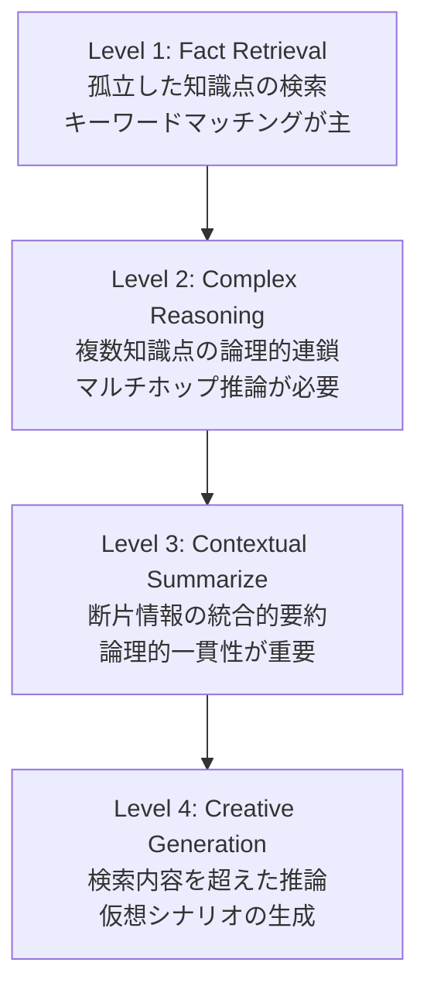

本記事は [When to use Graphs in RAG: A Comprehensive Analysis for Graph Retrieval-Augmented Generation (arXiv:2506.05690)](https://arxiv.org/abs/2506.05690) の解説記事です。

## 論文概要（Abstract）

Zhishang Xiangらは、GraphRAG（グラフ構造を活用したRetrieval-Augmented Generation）が実際にどの程度有効であるかを体系的に検証するベンチマーク「GraphRAG-Bench」を提案している。GraphRAG-Benchは、事実検索（Fact Retrieval）、複雑推論（Complex Reasoning）、文脈要約（Contextual Summarize）、創造的生成（Creative Generation）の4段階の難易度タスクで構成される。著者らは、MS-GraphRAG、HippoRAG、HippoRAG2、LightRAG、Fast-GraphRAG、RAPTORの6つのGraphRAGフレームワークとVanilla RAGを比較し、GraphRAGが単純な事実検索では通常のRAGに劣る一方、複雑推論や文脈要約では明確な優位性を示すことを報告している。

この記事は [Zenn記事: LlamaIndex v0.14 PropertyGraphIndexで評価駆動型RAGパイプラインを構築する](https://zenn.dev/0h_n0/articles/9ee2f7ab401829) の深掘りです。

## 情報源

- **arXiv ID**: 2506.05690
- **URL**: [https://arxiv.org/abs/2506.05690](https://arxiv.org/abs/2506.05690)
- **著者**: Zhishang Xiang, Chuanjie Wu, Qinggang Zhang, Shengyuan Chen, Zijin Hong, Xiao Huang, Jinsong Su
- **発表年**: 2025（2026年2月改訂）
- **分野**: cs.CL (Computation and Language)

## 背景と動機（Background & Motivation）

Retrieval-Augmented Generation（RAG）は大規模言語モデルの知識限界を外部知識で補完する手法として広く採用されている。しかし、通常のチャンクベースRAGはドキュメントを分割する際に文脈情報を失い、複数ドキュメントにまたがる推論が困難であるという課題がある。

GraphRAGは、知識グラフ構造を導入することでエンティティ間の関係を明示的にモデル化し、この問題を解決しようとするアプローチである。Microsoft GraphRAG、LightRAG、HippoRAGなど複数のフレームワークが提案されているが、著者らは「GraphRAGが実際にどのようなタスクで有効なのか」という根本的な問いに対する体系的な検証が不足していることを指摘している。既存のベンチマーク（HotpotQA、MultiHopRAG、UltraDomain等）は特定のタスク種別に偏っており、GraphRAGの強みと弱みを包括的に評価する枠組みが存在しなかった。

## 主要な貢献（Key Contributions）

- **貢献1**: 4段階の難易度タスク（事実検索→複雑推論→文脈要約→創造的生成）を持つ包括的ベンチマーク「GraphRAG-Bench」の構築。Novel（文学作品）とMedical（NCCN医療ガイドライン）の2つのドメインで評価
- **貢献2**: グラフ構築・検索・生成の3段階評価パイプラインの確立。各段階を独立に評価することで、GraphRAGのボトルネックを特定可能にした
- **貢献3**: 6つのGraphRAGフレームワークとVanilla RAGの定量的比較を通じ、GraphRAGが有効な条件（複雑推論・文脈要約）と不利な条件（単純な事実検索）を明確化
- **貢献4**: グラフ密度・トークンコストとタスク性能の関係を分析し、実運用での選択指針を提示

## 技術的詳細（Technical Details）

### GraphRAG-Benchの設計思想

GraphRAG-Benchは「タスクの複雑さに応じてグラフ構造の価値が変わる」という仮説を検証するために設計されている。データセットとして、ゆるやかに構造化されたテキスト（Gutenberg文学作品）と、厳密に構造化されたドメイン知識（NCCN医療ガイドライン）の2種類を採用し、テキスト構造の違いによるGraphRAGの有効性の変化を捕捉する。

### 4段階のタスクカテゴリ



- **Level 1（Fact Retrieval）**: 孤立した知識点を最小限の推論で検索するタスク。「モン・サン・ミシェルはフランスのどの地域にあるか」のような単純な質問が該当する
- **Level 2（Complex Reasoning）**: 複数のドキュメントにまたがる知識点を論理的に連鎖させる必要があるタスク。マルチホップ推論が求められる
- **Level 3（Contextual Summarize）**: 断片的な情報を統合して一貫性のある構造化された回答を生成するタスク。文脈理解と情報統合能力を評価する
- **Level 4（Creative Generation）**: 検索された内容を超えた推論を要求するタスク。仮想的なシナリオの生成など、創造的能力が必要となる

### 3段階評価パイプライン

著者らは、GraphRAGのパフォーマンスを3つの独立した段階で評価する。

**Stage 1: グラフ構築（Graph Construction）** では、構築されたグラフの構造的特性を定量化する。評価指標としてノード数、エッジ数、平均次数、平均クラスタリング係数を使用する。

平均次数は以下の式で算出される。

$$
\text{AverageDegree} = \frac{1}{|\mathcal{V}|} \sum_{v \in \mathcal{V}} \deg(v)
$$

平均クラスタリング係数は各ノードの局所的な密度を測定する。

$$
\text{AverageClustering} = \frac{1}{|\mathcal{V}|} \sum_{v \in \mathcal{V}} C(v), \quad C(v) = \frac{2 \cdot T(v)}{\deg(v) \cdot (\deg(v) - 1)}
$$

ここで $T(v)$ はノード $v$ の隣接ノード間に存在する三角形の数、$\deg(v)$ はノード $v$ の次数である。

**Stage 2: 知識検索（Knowledge Retrieval）** では、Evidence Recall（正答に必要な根拠がどの程度捕捉されているか）とContext Relevance（質問と検索コンテキストの意味的類似度）を評価する。

**Stage 3: 生成（Generation）** では、Lexical Overlap（最長共通部分列によるマッチング）、Answer Accuracy（意味的類似度と事実的一貫性）、Faithfulness（コンテキストへの忠実度）、Evidence Coverage（関連知識の網羅度）を評価する。

### GraphRAGが有効な条件 vs 無効な条件

著者らの分析から、GraphRAGの有効性はタスクの複雑さと強く相関することが明らかになっている。

**GraphRAGが不利な条件（Level 1: 事実検索）**: Vanilla RAGがNovelデータセットでEvidence Recall 83.2%を達成し、多くのGraphRAGフレームワークを上回る。単純なキーワードマッチングではグラフ構造のオーバーヘッドが不利に働く。

**GraphRAGが有効な条件（Level 2-4: 複雑推論以上）**: HippoRAGがNovelデータセットのLevel 2-3でEvidence Recall 87.9-90.9%を達成し、HippoRAG2はContext Relevance 85.8-87.8%をマークしている。グラフのトポロジ的接続がマルチホップ推論を可能にしている。

### 比較対象フレームワーク

著者らは以下のシステムを比較している。

| フレームワーク | 特徴 |
|---|---|
| Vanilla RAG | チャンクベース検索＋リランキング |
| MS-GraphRAG | 階層的コミュニティ検索（local/global） |
| HippoRAG | 海馬記憶モデルに着想を得たグラフ検索 |
| HippoRAG2 | HippoRAGの改良版、高密度グラフ構築 |
| LightRAG | 二重レベル検索とグラフ強化インデキシング |
| Fast-GraphRAG | GraphRAGの高速化バリアント |
| RAPTOR | ツリー構造による要約ベース検索 |

評価にはGPT-4o-miniを使用している。

## 実装のポイント（Implementation Notes）

Zenn記事「LlamaIndex v0.14 PropertyGraphIndexで評価駆動型RAGパイプラインを構築する」では、LlamaIndexのPropertyGraphIndexを用いたGraphRAGパイプラインの構築と、FaithfulnessEvaluator・RelevancyEvaluatorによる評価駆動開発が解説されている。

本論文の知見は、PropertyGraphIndexを用いた実装の設計判断に直接活用できる。具体的には以下の点が重要である。

1. **タスク複雑度による分岐**: Level 1相当のFAQや単純検索にはVectorStoreIndexを、Level 2以上のマルチホップ推論にはPropertyGraphIndexを使い分けるハイブリッド設計が合理的である
2. **グラフ密度の制御**: HippoRAG2の高密度グラフ（平均次数8.75-13.31）が最良の結果を示していることから、PropertyGraphIndexのエンティティ抽出で関係性を積極的に抽出する設定が有効である
3. **評価指標の選択**: 本論文のEvidence RecallはLlamaIndexのRelevancyEvaluatorに、FaithfulnessはFaithfulnessEvaluatorに対応する。GraphRAG-Benchの評価パイプラインをLlamaIndexの評価フレームワークで再現可能である

## Production Deployment Guide

### AWS実装パターン

GraphRAG-Benchの知見に基づき、タスク複雑度に応じたAWS構成を3パターンに分類する。

#### Small構成（Level 1: 事実検索特化）

単純な事実検索が主用途の場合、GraphRAGは不要であり、Vanilla RAGで十分である。

| コンポーネント | サービス | 月額目安 |
|---|---|---|
| ベクトルDB | OpenSearch Serverless (2 OCU) | $700 |
| 埋め込みモデル | Bedrock (Titan Embeddings V2) | $50-200 |
| 生成モデル | Bedrock (Claude Sonnet) | $200-800 |
| オーケストレーション | Lambda + Step Functions | $10-50 |
| ドキュメント格納 | S3 + DynamoDB | $5-20 |
| **合計** | | **$965-1,770/月** |

```hcl
# Small構成: Lambda + Bedrock + DynamoDB
# ファイル: infra/small/main.tf

terraform {
  required_providers {
    aws = {
      source  = "hashicorp/aws"
      version = "~> 5.0"
    }
  }
}

provider "aws" {
  region = "us-east-1"
}

# --- DynamoDB: ドキュメントメタデータ ---
resource "aws_dynamodb_table" "document_metadata" {
  name         = "rag-document-metadata"
  billing_mode = "PAY_PER_REQUEST"
  hash_key     = "doc_id"

  attribute {
    name = "doc_id"
    type = "S"
  }

  tags = {
    Project = "vanilla-rag"
    Tier    = "small"
  }
}

# --- S3: ドキュメント格納 ---
resource "aws_s3_bucket" "documents" {
  bucket = "rag-documents-${data.aws_caller_identity.current.account_id}"
  tags = {
    Project = "vanilla-rag"
    Tier    = "small"
  }
}

resource "aws_s3_bucket_versioning" "documents" {
  bucket = aws_s3_bucket.documents.id
  versioning_configuration {
    status = "Enabled"
  }
}

data "aws_caller_identity" "current" {}

# --- Lambda: RAGクエリハンドラ ---
resource "aws_lambda_function" "rag_query" {
  function_name = "rag-query-handler"
  runtime       = "python3.12"
  handler       = "handler.lambda_handler"
  timeout       = 120
  memory_size   = 1024

  filename         = "lambda_package.zip"
  source_code_hash = filebase64sha256("lambda_package.zip")
  role             = aws_iam_role.lambda_role.arn

  environment {
    variables = {
      OPENSEARCH_ENDPOINT = "https://your-opensearch-endpoint"
      BEDROCK_MODEL_ID    = "anthropic.claude-sonnet-4-20250514"
      EMBEDDING_MODEL_ID  = "amazon.titan-embed-text-v2:0"
      DYNAMODB_TABLE      = aws_dynamodb_table.document_metadata.name
    }
  }
}

resource "aws_iam_role" "lambda_role" {
  name = "rag-lambda-role"
  assume_role_policy = jsonencode({
    Version = "2012-10-17"
    Statement = [{
      Action = "sts:AssumeRole"
      Effect = "Allow"
      Principal = { Service = "lambda.amazonaws.com" }
    }]
  })
}

resource "aws_iam_role_policy" "lambda_policy" {
  name = "rag-lambda-policy"
  role = aws_iam_role.lambda_role.id
  policy = jsonencode({
    Version = "2012-10-17"
    Statement = [
      {
        Effect   = "Allow"
        Action   = ["bedrock:InvokeModel", "bedrock:InvokeModelWithResponseStream"]
        Resource = "*"
      },
      {
        Effect   = "Allow"
        Action   = ["dynamodb:GetItem", "dynamodb:PutItem", "dynamodb:Query"]
        Resource = aws_dynamodb_table.document_metadata.arn
      },
      {
        Effect   = "Allow"
        Action   = ["s3:GetObject", "s3:ListBucket"]
        Resource = [aws_s3_bucket.documents.arn, "${aws_s3_bucket.documents.arn}/*"]
      },
      {
        Effect   = "Allow"
        Action   = ["logs:CreateLogGroup", "logs:CreateLogStream", "logs:PutLogEvents"]
        Resource = "arn:aws:logs:*:*:*"
      }
    ]
  })
}
```

#### Medium構成（Level 2-3: 複雑推論・要約対応）

マルチホップ推論が必要な場合、GraphRAGパイプラインを追加する。

| コンポーネント | サービス | 月額目安 |
|---|---|---|
| グラフDB | Neptune Serverless (1-8 NCU) | $250-1,500 |
| ベクトルDB | OpenSearch Serverless (2 OCU) | $700 |
| 埋め込み+生成 | Bedrock (Claude Sonnet + Titan) | $300-1,200 |
| グラフ構築 | ECS Fargate (スポット) | $100-400 |
| オーケストレーション | Step Functions + Lambda | $20-80 |
| キャッシュ | ElastiCache Serverless (Redis) | $90-200 |
| **合計** | | **$1,460-4,080/月** |

#### Large構成（Level 1-4全対応: 本番環境）

全タスクレベルに対応し、タスク複雑度による自動ルーティングを含む構成である。

| コンポーネント | サービス | 月額目安 |
|---|---|---|
| グラフDB | Neptune (db.r6g.xlarge) | $1,200 |
| ベクトルDB | OpenSearch (3ノードクラスタ) | $1,800 |
| 生成モデル | Bedrock (Claude Sonnet/Opus) | $500-3,000 |
| コンピュート | EKS + Karpenter (スポット混在) | $800-2,500 |
| ルーティング | Lambda + Bedrock (分類器) | $50-200 |
| 監視 | CloudWatch + X-Ray | $100-300 |
| キャッシュ | ElastiCache (r7g.large) | $400 |
| **合計** | | **$4,850-9,400/月** |

```hcl
# Large構成: EKS + Karpenter
# ファイル: infra/large/eks.tf

module "eks" {
  source  = "terraform-aws-modules/eks/aws"
  version = "~> 20.0"

  cluster_name    = "graphrag-production"
  cluster_version = "1.31"

  vpc_id     = module.vpc.vpc_id
  subnet_ids = module.vpc.private_subnets

  cluster_endpoint_public_access = true

  eks_managed_node_groups = {
    # システムノード（常時稼働）
    system = {
      instance_types = ["m7i.large"]
      min_size       = 2
      max_size       = 3
      desired_size   = 2

      labels = {
        workload = "system"
      }
    }
  }

  tags = {
    Project     = "graphrag-production"
    Environment = "production"
  }
}

# --- Karpenter: GraphRAGワークロード用オートスケーリング ---
resource "helm_release" "karpenter" {
  name       = "karpenter"
  repository = "oci://public.ecr.aws/karpenter"
  chart      = "karpenter"
  version    = "1.1.0"
  namespace  = "kube-system"

  set {
    name  = "settings.clusterName"
    value = module.eks.cluster_name
  }

  set {
    name  = "settings.interruptionQueue"
    value = aws_sqs_queue.karpenter_interruption.name
  }
}

resource "aws_sqs_queue" "karpenter_interruption" {
  name                      = "karpenter-interruption"
  message_retention_seconds = 300
  sqs_managed_sse_enabled   = true
}

# --- Karpenter NodePool: グラフ構築用（スポット優先） ---
resource "kubectl_manifest" "graph_builder_nodepool" {
  yaml_body = yamlencode({
    apiVersion = "karpenter.sh/v1"
    kind       = "NodePool"
    metadata = {
      name = "graph-builder"
    }
    spec = {
      template = {
        metadata = {
          labels = {
            workload = "graph-builder"
          }
        }
        spec = {
          requirements = [
            { key = "karpenter.sh/capacity-type", operator = "In", values = ["spot", "on-demand"] },
            { key = "node.kubernetes.io/instance-type", operator = "In", values = ["m7i.xlarge", "m7i.2xlarge", "c7i.xlarge", "c7i.2xlarge"] },
          ]
          nodeClassRef = {
            group = "karpenter.k8s.aws"
            kind  = "EC2NodeClass"
            name  = "default"
          }
        }
      }
      limits = {
        cpu    = "64"
        memory = "256Gi"
      }
      disruption = {
        consolidationPolicy = "WhenEmptyOrUnderutilized"
        consolidateAfter    = "30s"
      }
    }
  })
}

# --- タスク複雑度ルーター（Lambda） ---
resource "aws_lambda_function" "task_router" {
  function_name = "graphrag-task-router"
  runtime       = "python3.12"
  handler       = "router.lambda_handler"
  timeout       = 30
  memory_size   = 256

  filename         = "router_package.zip"
  source_code_hash = filebase64sha256("router_package.zip")
  role             = aws_iam_role.router_role.arn

  environment {
    variables = {
      CLASSIFIER_MODEL_ID  = "anthropic.claude-sonnet-4-20250514"
      VANILLA_RAG_ENDPOINT = "https://vanilla-rag.internal"
      GRAPH_RAG_ENDPOINT   = "https://graph-rag.internal"
    }
  }
}

resource "aws_iam_role" "router_role" {
  name = "graphrag-router-role"
  assume_role_policy = jsonencode({
    Version = "2012-10-17"
    Statement = [{
      Action = "sts:AssumeRole"
      Effect = "Allow"
      Principal = { Service = "lambda.amazonaws.com" }
    }]
  })
}
```

### 運用・監視

#### CloudWatch + X-Rayによるオブザーバビリティ

GraphRAGパイプラインの3段階（グラフ構築・検索・生成）のそれぞれを計測する。

```python
# CloudWatch Embedded Metric Format (EMF) によるメトリクス送信
import json
import time
from typing import Any

def emit_graphrag_metrics(
    stage: str,
    duration_ms: float,
    token_count: int,
    task_level: int,
    method: str,
) -> None:
    """GraphRAGパイプラインメトリクスをCloudWatch EMFで送信する。"""
    metric_log: dict[str, Any] = {
        "_aws": {
            "Timestamp": int(time.time() * 1000),
            "CloudWatchMetrics": [{
                "Namespace": "GraphRAG/Production",
                "Dimensions": [["Stage", "TaskLevel", "Method"]],
                "Metrics": [
                    {"Name": "Latency", "Unit": "Milliseconds"},
                    {"Name": "TokenCount", "Unit": "Count"},
                ],
            }],
        },
        "Stage": stage,
        "TaskLevel": str(task_level),
        "Method": method,
        "Latency": duration_ms,
        "TokenCount": token_count,
    }
    # Lambda環境ではstdout出力がCloudWatch Logsに送信される
    print(json.dumps(metric_log))
```

#### X-Rayトレーシング

```python
from aws_xray_sdk.core import xray_recorder

@xray_recorder.capture("graph_retrieval")
def retrieve_from_graph(query: str, graph_endpoint: str) -> list[dict]:
    """グラフDBからの検索をX-Rayでトレースする。"""
    subsegment = xray_recorder.current_subsegment()
    subsegment.put_annotation("query_length", len(query))

    # Neptune Gremlinクエリ実行
    results = execute_gremlin_query(graph_endpoint, query)

    subsegment.put_annotation("result_count", len(results))
    subsegment.put_metadata("query", query)
    return results
```

#### Cost Explorerによるコスト分析

GraphRAG-Benchの知見から、GraphRAGはVanilla RAGに比べてトークンコストが大幅に増加する。MS-GraphRAG（global）は1クエリあたり最大331,375トークンを消費し、Vanilla RAGの879トークンと比較して約377倍のコストとなる。Cost Explorerでサービス別・タグ別のコスト推移を監視し、閾値アラートを設定することが不可欠である。

### コスト最適化チェックリスト

GraphRAG-Benchの実験結果に基づく最適化項目を以下に示す。

**アーキテクチャ選択（タスク複雑度ベース）**

- [ ] Level 1（事実検索）クエリにはGraphRAGを使わずVanilla RAGにルーティングしているか
- [ ] タスク複雑度の自動分類器を導入し、不要なGraphRAGパイプライン呼び出しを抑制しているか
- [ ] HippoRAG2の高密度グラフが必要なケースとLightRAGの軽量グラフで十分なケースを区別しているか
- [ ] MS-GraphRAG globalモードの使用を本当に必要なLevel 4タスクに限定しているか

**トークンコスト管理**

- [ ] MS-GraphRAG globalのプロンプトサイズ（最大40,000トークン）を監視し上限を設定しているか
- [ ] LightRAGのトークンコスト（約100,000トークン/クエリ）が許容範囲か確認しているか
- [ ] HippoRAG2の低トークンコスト（約1,000トークン）を活用する設計になっているか
- [ ] Bedrock Prompt Cachingを有効化し、繰り返しプロンプトのコストを削減しているか
- [ ] レスポンスのmax_tokensを適切に設定し、不要な長文生成を抑制しているか

**グラフ構築コスト**

- [ ] グラフ構築をバッチ処理（夜間/週次）にスケジューリングしているか
- [ ] インクリメンタルなグラフ更新（差分のみ再構築）を実装しているか
- [ ] グラフ構築にECS Fargateスポットインスタンスを使用しているか
- [ ] 不要なエンティティ・リレーション抽出をフィルタリングでグラフサイズを制御しているか

**インフラコスト**

- [ ] Neptune Serverlessのmin NCUを必要最小限に設定しているか
- [ ] OpenSearch ServerlessのOCU数をトラフィックパターンに合わせて調整しているか
- [ ] EKS Karpenterでスポットインスタンスの利用率が70%以上になっているか
- [ ] ElastiCacheのキャッシュヒット率を監視し、不要なBedrock呼び出しを削減しているか
- [ ] CloudWatch Logsの保持期間を適切に設定（本番30日、開発7日）しているか

**検索効率**

- [ ] Evidence RecallとContext Relevanceのトレードオフを監視しているか
- [ ] 検索結果のTop-Kを適切に設定し、過剰な検索を防いでいるか
- [ ] キャッシュ戦略（同一クエリ・類似クエリの結果キャッシュ）を実装しているか

**運用コスト**

- [ ] Cost Explorerでサービス別コストアラート（前月比120%超で通知）を設定しているか
- [ ] 月次でコストレビューを実施し、未使用リソースを削除しているか
- [ ] 開発環境のGraphRAGパイプラインをサンプリング実行（10%等）に制限しているか

## 実験結果（Experimental Results）

### 生成品質の比較

**Novelデータセット**における主要な結果を以下に示す。

| タスク | メソッド | ACC (%) | ROUGE-L |
|---|---|---|---|
| Fact Retrieval | RAG (w/ rerank) | 60.92 | 36.08 |
| Fact Retrieval | HippoRAG2 | 60.14 | 31.35 |
| Fact Retrieval | MS-GraphRAG | 49.29 | 26.11 |
| Complex Reasoning | HippoRAG2 | **53.38** | **33.42** |
| Complex Reasoning | RAG (w/ rerank) | 42.93 | 15.39 |
| Complex Reasoning | LightRAG | 49.07 | 24.16 |
| Contextual Summarize | HippoRAG2 | **64.10** | - |
| Contextual Summarize | RAG (w/ rerank) | 51.30 | - |
| Creative Generation | RAG (w/ rerank) | 38.26 | - |
| Creative Generation | HippoRAG | 38.85 | - |

事実検索（Level 1）ではRAG (w/ rerank)がACC 60.92%で最良であるのに対し、複雑推論（Level 2）ではHippoRAG2がACC 53.38%でRAGの42.93%を10ポイント以上上回っている。文脈要約（Level 3）でも同様に、HippoRAG2が64.10%でRAGの51.30%を大きく凌駕している。

**Medicalデータセット**でも類似の傾向が確認されている。事実検索ではHippoRAG2（66.28%）がRAG（64.73%）と僅差である一方、創造的生成ではHippoRAG2（68.05%）がRAG（60.61%）を明確に上回り、LightRAGもFaithfulness 78.76でRAGの36.74を大幅に超えている。

### 検索品質の比較

NovelデータセットのLevel 2-3において、HippoRAGはEvidence Recall 87.9-90.9%を達成し、チャンクベースRAGの64.5-73.4%を大きく上回っている。一方、Context RelevanceではHippoRAG2が85.8-87.8%で最良である。

### グラフ構造の分析

各フレームワークが構築するグラフの密度には大きな差がある。HippoRAG2はNovelデータセットで平均次数8.75、クラスタリング係数0.657と最も密なグラフを構築し、10kトークンあたり平均2,310エッジ・523ノードを生成する。対照的に、HippoRAGは平均次数1.73、クラスタリング係数0.100と疎なグラフを構築する。

### トークン効率

トークンコストの差は劇的である。Vanilla RAGが1クエリあたり約879トークンであるのに対し、MS-GraphRAG（global）は331,375トークン（約377倍）、LightRAGは100,832トークン（約115倍）を消費する。HippoRAG2は1,008トークンとVanilla RAGに近い効率を維持しつつ、高い検索品質を実現している点が注目に値する。

## 実運用への応用（Practical Applications）

### 評価駆動型GraphRAG開発

Zenn記事で解説されているFaithfulnessEvaluatorとRelevancyEvaluatorは、本論文のStage 3評価指標に直接対応する。具体的な対応関係は以下の通りである。

| GraphRAG-Bench指標 | LlamaIndex評価器 | 用途 |
|---|---|---|
| Faithfulness | FaithfulnessEvaluator | 生成回答がコンテキストに忠実か |
| Evidence Coverage | RelevancyEvaluator | 検索結果が質問に関連するか |
| Answer Accuracy | CorrectnessEvaluator | 回答が正解と一致するか |

### タスク複雑度による自動ルーティング

本論文の最大の実務的示唆は「全てのクエリにGraphRAGを適用するのは非効率」という知見である。入力クエリの複雑度を事前分類し、Level 1相当の単純検索にはVanilla RAGを、Level 2以上にはGraphRAGを振り分けるルーティング機構の実装が推奨される。

### グラフDB選択の指針

HippoRAG2の高密度グラフ（平均次数13.31、Medicalデータセット）が最良の結果を示していることから、Neptune等のグラフDBでは密な接続を効率的に処理できるインスタンスタイプの選択が重要である。一方、トークンコストの制約がある場合はHippoRAG2の低トークン消費（約1,000トークン/クエリ）が大きな利点となる。

## 関連研究（Related Work）

**Microsoft GraphRAG** (Edge et al., 2024): 階層的コミュニティ検出によるグラフベース検索。本論文ではlocal/globalの2モードを評価し、globalモードのトークンコスト（331,375トークン）が実運用の課題であることを示している。

**LightRAG** (Guo et al., 2025): 二重レベル検索とグラフ強化インデキシングによる効率的なGraphRAG。Context Relevanceでは良好な結果を示すが、トークンコスト（100,832トークン）はなお高い。

**HippoRAG / HippoRAG2** (Gutierrez et al., 2024, 2025): 海馬記憶モデルに着想を得たグラフ検索。HippoRAG2は複雑推論・文脈要約で最良の生成品質を達成し、トークン効率も高い。

**RAPTOR** (Sarthi et al., 2024): ツリー構造による再帰的要約ベース検索。MedicalデータセットのLevel 2-3でEvidence Recall 88.9-89.7%を達成するが、Faithfulnessでは他のGraphRAGに劣る。

## まとめと今後の展望（Conclusion & Future Work）

GraphRAG-Benchは、GraphRAGの有効性が「タスクの複雑さ」に強く依存することを定量的に示した重要な研究である。単純な事実検索ではVanilla RAGが優位であり、GraphRAGは複雑推論・文脈要約・創造的生成において価値を発揮する。

実運用においては、クエリ複雑度による自動ルーティングの導入、グラフ密度とトークンコストのトレードオフの管理、そして3段階評価パイプラインによる継続的な品質監視が鍵となる。HippoRAG2が示した「高密度グラフ＋低トークンコスト」の組み合わせは、今後のGraphRAG設計における重要な指標となるだろう。

今後の課題として、著者らはドメイン固有のグラフスキーマ設計、動的なグラフ更新メカニズム、およびマルチモーダル情報のグラフへの統合を挙げている。

## 参考文献

1. Xiang, Z., Wu, C., Zhang, Q., Chen, S., Hong, Z., Huang, X., & Su, J. (2025). When to use Graphs in RAG: A Comprehensive Analysis for Graph Retrieval-Augmented Generation. arXiv:2506.05690.
2. Edge, D., et al. (2024). From Local to Global: A Graph RAG Approach to Query-Focused Summarization. arXiv:2404.16130.
3. Gutierrez, B., et al. (2024). HippoRAG: Neurobiologically Inspired Long-Term Memory for Large Language Models. arXiv:2405.14831.
4. Gutierrez, B., et al. (2025). HippoRAG 2: Better Knowledge Integration for LLMs. arXiv:2502.14802.
5. Guo, Z., et al. (2025). LightRAG: Simple and Fast Retrieval-Augmented Generation. arXiv:2410.05779.
6. Sarthi, P., et al. (2024). RAPTOR: Recursive Abstractive Processing for Tree-Organized Retrieval. arXiv:2401.18059.
