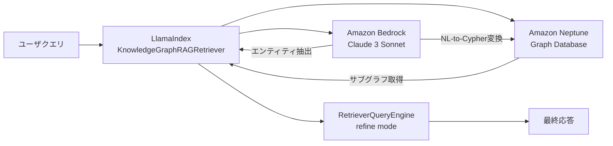
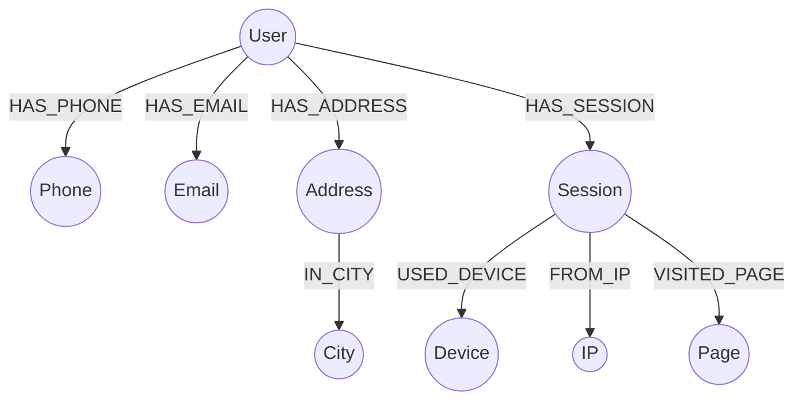

本記事は [AWS Database Blog: Using knowledge graphs to build GraphRAG applications with Amazon Bedrock and Amazon Neptune](https://aws.amazon.com/blogs/database/using-knowledge-graphs-to-build-graphrag-applications-with-amazon-bedrock-and-amazon-neptune/) の解説記事です。

## ブログ概要

AWSのData ArchitectであるMatheus Duarte Dias氏が2024年8月に公開したこの技術ブログでは、Amazon Neptune（グラフデータベース）とAmazon Bedrock（マネージドLLMサービス）をLlamaIndexで統合し、GraphRAG（Graph-based Retrieval Augmented Generation）アプリケーションを構築する方法を解説している。Customer 360（顧客360度ビュー）のユースケースを題材に、ナレッジグラフからの構造化データ検索とLLMによる自然言語応答を組み合わせたアーキテクチャを示している。

関連するZenn記事「[LlamaIndex v0.14 PropertyGraphIndexで評価駆動型RAGパイプラインを構築する](https://zenn.dev/0h_n0/articles/9ee2f7ab401829)」では、LlamaIndexのPropertyGraphIndexを用いたRAGパイプライン構築を扱っており、本ブログ記事はその実践的なAWSマネージドサービス上での展開パターンとして位置づけられる。

## 情報源

| 項目 | 内容 |
|------|------|
| 種別 | 企業テックブログ（AWS） |
| URL | [AWS Database Blog](https://aws.amazon.com/blogs/database/using-knowledge-graphs-to-build-graphrag-applications-with-amazon-bedrock-and-amazon-neptune/) |
| 著者 | Matheus Duarte Dias（Data Architect, AWS） |
| 発表日 | 2024年8月1日 |

## 技術的背景

従来のベクトル検索ベースのRAGは、文書をチャンクに分割しembeddingで類似検索を行う。この手法はテキストの意味的類似性には強いが、エンティティ間の関係性（「顧客Aが使用しているデバイスの種類」「ある地域の顧客の行動パターン」など）を正確に捉えることが難しい。

GraphRAGは、ナレッジグラフの構造化された関係性情報をLLMのコンテキストとして活用することで、この課題を解決する。ノード間のリレーションシップを明示的に走査できるため、マルチホップの推論（例：顧客→セッション→デバイス→ページ）が可能になる。

Amazon Neptuneはフルマネージドのグラフデータベースサービスであり、openCypher/Gremlinクエリをサポートする。Amazon Bedrockと組み合わせることで、グラフクエリの生成からLLMによる応答合成までをAWSのマネージドサービス内で完結させることができる。

## 実装アーキテクチャ

### 全体アーキテクチャ

AWSブログが提示するアーキテクチャは、3つのコンポーネントで構成される。



1. **Amazon Bedrock**：Anthropic Claude 3 Sonnetをホストし、エンティティ抽出とNL-to-Cypher変換を担当
2. **Amazon Neptune**：Customer 360ナレッジグラフを格納し、openCypherクエリを実行
3. **LlamaIndex**：両者を統合するオーケストレーション層として、Retrieverの設定とQueryEngineの制御を行う

### Customer 360グラフスキーマ設計

ブログで使用されるCustomer 360グラフは、以下のノードタイプとリレーションシップで構成される。



このスキーマにより、ユーザの連絡先情報（Phone, Email, Address）、行動データ（Session, Device, IP, Page）、地理情報（City）がグラフ構造で統合される。Userノードを中心として最大3ホップで到達可能な全ノードが検索対象となる。

### KnowledgeGraphRAGRetrieverの設定と動作

LlamaIndexの`KnowledgeGraphRAGRetriever`は、グラフストアからの検索を制御する中核コンポーネントである。AWSブログでは以下の設定が示されている。

```python
from llama_index.llms.bedrock import Bedrock
from llama_index.core import Settings, StorageContext
from llama_index.graph_stores.neptune import NeptuneDatabaseGraphStore
from llama_index.core.query_engine import RetrieverQueryEngine
from llama_index.core.retrievers import KnowledgeGraphRAGRetriever

# Bedrock LLMの設定
llm = Bedrock(model="anthropic.claude-3-sonnet-20240229-v1:0")
Settings.llm = llm

# Neptuneグラフストアの接続
graph_store = NeptuneDatabaseGraphStore(
    host="<NEPTUNE_DB>.<AWS_REGION>.neptune.amazonaws.com",
    port=8182,
    node_label="User"
)
storage_context = StorageContext.from_defaults(graph_store=graph_store)

# GraphRAG Retrieverの構成
graph_rag_retriever = KnowledgeGraphRAGRetriever(
    storage_context=storage_context,
    entity_extract_template=ENTITY_EXTRACT_PROMPT,
    with_nl2graphquery=True,
    graph_query_synthesis_prompt=NL2CYPHER_PROMPT,
    graph_traversal_depth=3
)

# QueryEngineの構築
query_engine = RetrieverQueryEngine.from_args(
    graph_rag_retriever,
    response_mode="refine"
)
```

主要パラメータの意味は以下の通りである。

| パラメータ | 値 | 説明 |
|-----------|-----|------|
| `node_label` | `"User"` | 検索起点となるエンティティのノードラベル |
| `graph_traversal_depth` | `3` | グラフ走査の最大ホップ数 |
| `with_nl2graphquery` | `True` | NL-to-Cypher変換を有効化 |
| `response_mode` | `"refine"` | 複数結果の段階的精緻化 |

### NL-to-Cypher変換メカニズム

`with_nl2graphquery=True`を指定すると、LlamaIndexはユーザの自然言語クエリをopenCypherクエリに変換する。AWSブログでは、Neptune固有のopenCypher方言に対応したプロンプトテンプレート（`NL2CYPHER_PROMPT`）を使用している。このプロンプトには以下の制約が含まれる。

- プロパティ参照は完全修飾（ノードラベル付き）で記述
- リレーションシップの方向制約を厳守
- クエリ方向は左から右への単方向
- 結果は最大30行に制限

例えば「ユーザAが最近訪問したページは？」というクエリは、以下のようなopenCypherクエリに変換される。

```cypher
MATCH (u:User {name: "UserA"})-[:HAS_SESSION]->(s:Session)-[:VISITED_PAGE]->(p:Page)
RETURN p.url, s.timestamp
ORDER BY s.timestamp DESC
LIMIT 30
```

### マルチホップグラフ走査

`graph_traversal_depth=3`の設定により、Retrieverはエンティティ抽出で特定されたノードから最大3ホップの範囲でサブグラフを取得する。Customer 360スキーマでは、User→Session→Device（3ホップ）やUser→Address→City（2ホップ）のような走査パスが対象となる。

この深さはスキーマの直径（最長パス長）に合わせて設定されている。AWSブログでは、Customer 360グラフの最大パス長が3であるため、`graph_traversal_depth=3`が適切であると説明している。

### RetrieverQueryEngineのrefineモード

`response_mode="refine"`は、LlamaIndexのQueryEngineが複数の検索結果を段階的に精緻化する方式である。AWSブログでは、以下の2つの検索パスからの結果を統合する。

1. **Traditional Retrieval**：エンティティ抽出に基づくサブグラフの直接取得
2. **NL2GraphQuery**：openCypherクエリによる構造化検索

refineモードでは、LLMがまず1つ目の結果に基づいて応答を生成し、次に2つ目の結果を用いてその応答を精緻化する。これにより、一方の検索パスが不完全な結果を返した場合でも、もう一方の結果で補完することができる。

### LlamaIndex PropertyGraphIndexとの対応関係

Zenn記事で扱うLlamaIndex v0.14のPropertyGraphIndexは、グラフスキーマの定義とインデックス構築をより宣言的に行うAPIを提供する。AWSブログの`KnowledgeGraphRAGRetriever`は、PropertyGraphIndex以前のAPIに基づいているが、概念的な対応関係は以下の通りである。

| AWSブログのコンポーネント | PropertyGraphIndex相当 |
|--------------------------|----------------------|
| `NeptuneDatabaseGraphStore` | `NeptunePropertyGraphStore` |
| `KnowledgeGraphRAGRetriever` | `PropertyGraphIndex.as_retriever()` |
| NL2CYPHER_PROMPT | `TextToCypherRetriever` |
| entity_extract_template | `LLMSynonymRetriever` |

PropertyGraphIndexでは、これらの機能がより統合的なインターフェースで提供されており、`TextToCypherRetriever`がNL-to-Cypher変換を、`LLMSynonymRetriever`がエンティティの同義語展開を担当する。

## Production Deployment Guide

### AWS実装パターン

GraphRAGシステムをAWS上で本番運用するにあたり、規模に応じた3つの構成パターンを示す。

#### Small構成（PoC/小規模）

| コンポーネント | サービス | 月額概算（USD） |
|--------------|---------|----------------|
| コンピュート | AWS Lambda | $5-50 |
| LLM | Amazon Bedrock (Claude 3 Sonnet) | $50-200（トークン従量） |
| グラフDB | Neptune Serverless (1-2.5 NCU) | $65-160 |
| 合計 | | $120-410 |

Neptune Serverlessは最小1 NCU（Neptune Capacity Unit）から自動スケールし、アイドル時のコストを抑制できる。Bedrock はトークン従量課金のため、初期段階での費用予測が容易である。

#### Medium構成（本番初期）

| コンポーネント | サービス | 月額概算（USD） |
|--------------|---------|----------------|
| コンピュート | ECS Fargate (2 vCPU, 4GB) | $70-150 |
| LLM | Amazon Bedrock (Provisioned Throughput) | $500-2000 |
| グラフDB | Neptune db.r6g.large | $460 |
| キャッシュ | ElastiCache (cache.t4g.micro) | $12 |
| 合計 | | $1,042-2,622 |

#### Large構成（高トラフィック本番）

| コンポーネント | サービス | 月額概算（USD） |
|--------------|---------|----------------|
| コンピュート | EKS (3ノード, m6i.xlarge) | $450 |
| LLM | Amazon Bedrock (Cross-Region Inference) | $2,000-8,000 |
| グラフDB | Neptune db.r6g.2xlarge + Read Replica | $1,840 |
| キャッシュ | ElastiCache (cache.r6g.large) | $195 |
| 監視 | CloudWatch + X-Ray | $50-100 |
| 合計 | | $4,535-10,585 |

**注**: コスト概算はus-east-1リージョンの2024年8月時点の公開価格に基づく。実際のコストはリクエスト量、トークン消費量、グラフサイズにより変動する。

### Terraformコード

#### Small構成（Lambda + Bedrock + Neptune Serverless）

```hcl
# Neptune Serverless クラスター
resource "aws_neptune_cluster" "graphrag" {
  cluster_identifier                  = "graphrag-neptune"
  engine                              = "neptune"
  serverless_v2_scaling_configuration {
    min_capacity = 1.0
    max_capacity = 2.5
  }
  iam_database_authentication_enabled = true
  vpc_security_group_ids              = [aws_security_group.neptune.id]
  neptune_subnet_group_name           = aws_neptune_subnet_group.main.name

  tags = {
    Environment = "poc"
    Project     = "graphrag"
  }
}

resource "aws_neptune_cluster_instance" "serverless" {
  cluster_identifier = aws_neptune_cluster.graphrag.id
  instance_class     = "db.serverless"
  engine             = "neptune"
}

# Lambda関数（GraphRAGクエリハンドラ）
resource "aws_lambda_function" "graphrag_query" {
  function_name = "graphrag-query-handler"
  runtime       = "python3.12"
  handler       = "handler.lambda_handler"
  timeout       = 60
  memory_size   = 512

  filename         = data.archive_file.lambda_zip.output_path
  source_code_hash = data.archive_file.lambda_zip.output_base64sha256

  role = aws_iam_role.lambda_exec.arn

  vpc_config {
    subnet_ids         = var.private_subnet_ids
    security_group_ids = [aws_security_group.lambda.id]
  }

  environment {
    variables = {
      NEPTUNE_ENDPOINT = aws_neptune_cluster.graphrag.endpoint
      NEPTUNE_PORT     = "8182"
      BEDROCK_REGION   = var.aws_region
      BEDROCK_MODEL_ID = "anthropic.claude-3-sonnet-20240229-v1:0"
    }
  }
}

# Lambda用IAMロール（Bedrock + Neptune アクセス）
resource "aws_iam_role" "lambda_exec" {
  name = "graphrag-lambda-exec"
  assume_role_policy = jsonencode({
    Version = "2012-10-17"
    Statement = [{
      Action = "sts:AssumeRole"
      Effect = "Allow"
      Principal = { Service = "lambda.amazonaws.com" }
    }]
  })
}

resource "aws_iam_role_policy" "bedrock_access" {
  name = "bedrock-invoke"
  role = aws_iam_role.lambda_exec.id
  policy = jsonencode({
    Version = "2012-10-17"
    Statement = [{
      Effect   = "Allow"
      Action   = ["bedrock:InvokeModel"]
      Resource = "arn:aws:bedrock:${var.aws_region}::foundation-model/anthropic.claude-3-sonnet-*"
    }]
  })
}

resource "aws_iam_role_policy" "neptune_access" {
  name = "neptune-query"
  role = aws_iam_role.lambda_exec.id
  policy = jsonencode({
    Version = "2012-10-17"
    Statement = [{
      Effect   = "Allow"
      Action   = ["neptune-db:ReadDataViaQuery"]
      Resource = "${aws_neptune_cluster.graphrag.arn}/*"
    }]
  })
}

# セキュリティグループ
resource "aws_security_group" "neptune" {
  name_prefix = "graphrag-neptune-"
  vpc_id      = var.vpc_id

  ingress {
    from_port       = 8182
    to_port         = 8182
    protocol        = "tcp"
    security_groups = [aws_security_group.lambda.id]
  }
}

resource "aws_security_group" "lambda" {
  name_prefix = "graphrag-lambda-"
  vpc_id      = var.vpc_id

  egress {
    from_port   = 0
    to_port     = 0
    protocol    = "-1"
    cidr_blocks = ["0.0.0.0/0"]
  }
}
```

#### Large構成（EKS + Neptune + ElastiCache）

```hcl
# Neptune本番クラスター（Read Replica付き）
resource "aws_neptune_cluster" "graphrag_prod" {
  cluster_identifier                  = "graphrag-prod"
  engine                              = "neptune"
  backup_retention_period             = 7
  preferred_backup_window             = "03:00-04:00"
  iam_database_authentication_enabled = true
  vpc_security_group_ids              = [aws_security_group.neptune_prod.id]
  neptune_subnet_group_name           = aws_neptune_subnet_group.prod.name
  storage_encrypted                   = true

  tags = {
    Environment = "production"
    Project     = "graphrag"
  }
}

resource "aws_neptune_cluster_instance" "writer" {
  cluster_identifier = aws_neptune_cluster.graphrag_prod.id
  instance_class     = "db.r6g.2xlarge"
  engine             = "neptune"

  tags = { Role = "writer" }
}

resource "aws_neptune_cluster_instance" "reader" {
  cluster_identifier = aws_neptune_cluster.graphrag_prod.id
  instance_class     = "db.r6g.2xlarge"
  engine             = "neptune"

  tags = { Role = "reader" }
}

# ElastiCache（Cypherクエリ結果キャッシュ）
resource "aws_elasticache_replication_group" "graphrag_cache" {
  replication_group_id = "graphrag-cypher-cache"
  description          = "Cache for frequent Cypher query results"
  engine               = "redis"
  node_type            = "cache.r6g.large"
  num_cache_clusters   = 2
  port                 = 6379
  subnet_group_name    = aws_elasticache_subnet_group.prod.name
  security_group_ids   = [aws_security_group.cache_prod.id]

  at_rest_encryption_enabled = true
  transit_encryption_enabled = true
}

# EKSクラスター（アプリケーション層）
module "eks" {
  source  = "terraform-aws-modules/eks/aws"
  version = "~> 20.0"

  cluster_name    = "graphrag-prod"
  cluster_version = "1.30"
  vpc_id          = var.vpc_id
  subnet_ids      = var.private_subnet_ids

  eks_managed_node_groups = {
    graphrag = {
      instance_types = ["m6i.xlarge"]
      min_size       = 2
      max_size       = 6
      desired_size   = 3

      labels = { workload = "graphrag" }
    }
  }
}
```

### 運用・監視

#### CloudWatch メトリクス

本番環境では、以下のメトリクスを監視対象とする。

```python
import boto3
from datetime import datetime, timedelta

cloudwatch = boto3.client("cloudwatch")

# Neptune: グラフクエリのレイテンシ監視
cloudwatch.put_metric_alarm(
    AlarmName="GraphRAG-Neptune-HighLatency",
    Namespace="AWS/Neptune",
    MetricName="GremlinRequestsPerSec",
    Dimensions=[
        {"Name": "DBClusterIdentifier", "Value": "graphrag-prod"}
    ],
    Statistic="Average",
    Period=300,
    EvaluationPeriods=2,
    Threshold=100,
    ComparisonOperator="GreaterThanThreshold",
    AlarmActions=[sns_topic_arn],
)

# Bedrock: トークン消費量の追跡
cloudwatch.put_metric_alarm(
    AlarmName="GraphRAG-Bedrock-TokenBudget",
    Namespace="AWS/Bedrock",
    MetricName="InputTokenCount",
    Statistic="Sum",
    Period=86400,
    EvaluationPeriods=1,
    Threshold=1000000,
    ComparisonOperator="GreaterThanThreshold",
    AlarmActions=[sns_topic_arn],
)
```

#### X-Ray トレーシング

GraphRAGパイプラインの各ステップ（エンティティ抽出、Cypher生成、グラフ走査、応答合成）のレイテンシを可視化するために、AWS X-Rayを導入する。

```python
from aws_xray_sdk.core import xray_recorder, patch_all

patch_all()

@xray_recorder.capture("graphrag_query")
def handle_query(user_query: str) -> str:
    with xray_recorder.in_subsegment("entity_extraction"):
        entities = extract_entities(user_query)

    with xray_recorder.in_subsegment("cypher_generation"):
        cypher = generate_cypher(user_query, entities)

    with xray_recorder.in_subsegment("neptune_query"):
        subgraph = execute_cypher(cypher)

    with xray_recorder.in_subsegment("response_synthesis"):
        response = synthesize_response(user_query, subgraph)

    return response
```

### コスト最適化チェックリスト

GraphRAGシステムのAWS運用コストを最適化するための項目を以下に示す。

**Neptune関連**

1. Neptune Serverlessの最小NCUを実際のベースライン負荷に合わせて設定しているか
2. 読み取り専用のGraphRAGクエリにはRead Replicaエンドポイントを使用しているか（AWSブログで推奨）
3. グラフのパーティション戦略が走査パターンに最適化されているか
4. 不要なプロパティインデックスを削除し、書き込みオーバーヘッドを削減しているか
5. バッチローディング時はbulk loader APIを使用しているか
6. クエリのタイムアウト設定（`neptune_query_timeout`）を適切に設定しているか
7. Neptune Notebookでクエリプランを定期的に確認しているか

**Bedrock関連**

8. プロンプトキャッシング（Bedrock Prompt Caching）を有効化し、繰り返しのシステムプロンプト費用を削減しているか
9. エンティティ抽出には小型モデル（Haiku）、応答合成には高性能モデル（Sonnet）とモデルを使い分けているか
10. Provisioned Throughputの利用率が60%以上を維持しているか（下回る場合はオンデマンドに切替）
11. 入力トークン数を削減するため、グラフコンテキストの前処理で不要なプロパティを除外しているか
12. Cross-Region Inferenceを有効化し、スロットリングによるリトライコストを削減しているか

**キャッシュ関連**

13. 頻出Cypherクエリの結果をElastiCacheにキャッシュしているか
14. キャッシュのTTLをグラフ更新頻度に合わせて設定しているか
15. キャッシュヒット率を監視し、50%未満の場合はキャッシュキー戦略を見直しているか

**コンピュート関連**

16. Lambda関数のメモリサイズをPower Tuningで最適化しているか
17. EKS使用時はSpot Instancesを非クリティカルワーカーに活用しているか
18. コンテナイメージサイズを最小化し、コールドスタートを短縮しているか

**ネットワーク関連**

19. VPCエンドポイント（Bedrock, Neptune）を使用してNATゲートウェイ費用を削減しているか
20. 同一AZ内でNeptune/Lambda/EKSノードを配置し、クロスAZデータ転送料を抑制しているか

**運用関連**

21. Cost Explorerでタグベースのコスト配分を設定し、GraphRAGシステムのコストを追跡しているか
22. AWS Budgetsで月次アラートを設定しているか
23. 開発/ステージング環境のNeptune/ElastiCacheを業務時間外に停止しているか

## パフォーマンス最適化

### Neptune設定の最適化

AWSブログでは、GraphRAG用途でのNeptune最適化として以下のポイントを示唆している。

- **Read Replicaの活用**: GraphRAGの検索クエリは読み取り専用であるため、Neptune Read Replicaエンドポイントを使用することで、Writerインスタンスへの負荷を分散できる
- **インスタンスサイズの選定**: グラフサイズとクエリの複雑さに応じて、メモリ最適化インスタンス（r6gファミリー）を選択する。グラフ全体がメモリに収まるサイズが理想的である

### openCypherクエリの最適化

NL-to-Cypherで生成されるクエリのパフォーマンスを向上させるための考慮事項を以下に示す。

```cypher
-- 非効率: フィルタなしの全走査
MATCH (u:User)-[:HAS_SESSION]->(s:Session)-[:VISITED_PAGE]->(p:Page)
RETURN u.name, p.url

-- 効率的: 起点ノードの早期フィルタリング + LIMIT
MATCH (u:User {name: "UserA"})-[:HAS_SESSION]->(s:Session)-[:VISITED_PAGE]->(p:Page)
RETURN p.url, s.timestamp
ORDER BY s.timestamp DESC
LIMIT 30
```

NL2CYPHER_PROMPTで結果を30行に制限する制約は、大規模グラフでのクエリ爆発を防ぐための実践的な設計判断である。

## 運用での学び

### グラフスキーマ設計のベストプラクティス

AWSブログのCustomer 360スキーマから得られるグラフ設計の教訓は以下の通りである。

1. **中心エンティティの明確化**: Userノードを中心とした星形構造により、`node_label="User"`の指定で効率的にサブグラフを取得できる。GraphRAGでは、クエリの起点となるエンティティタイプを明確に定義することが重要である

2. **走査深度とスキーマ直径の一致**: `graph_traversal_depth`はスキーマの最長パスに合わせて設定する。過大な深度は不要なノードの取得によるコンテキスト汚染を引き起こし、過小な深度は関連情報の欠落を招く

3. **リレーションシップの方向性**: openCypherクエリの効率性のため、リレーションシップは一方向（User→Session→Deviceなど、所有・利用の方向）で統一する。AWSブログのNL2CYPHER_PROMPTでは「左から右への単方向クエリ」を制約として明示している

4. **プロパティの最小化**: グラフノードに格納するプロパティは、LLMコンテキストとして必要な情報に限定する。不要なメタデータはコンテキストウィンドウを消費し、応答品質を低下させる

## 学術研究との関連

GraphRAGの学術的な位置づけとして、Microsoft Researchが提案したGraphRAG（Edge et al., 2024）は、テキストからエンティティとリレーションシップを自動抽出しグラフを構築するアプローチである。一方、AWSブログのアプローチは、既存の構造化データ（Customer 360）をそのままナレッジグラフとして活用する点で異なる。

HybridRAG（Sarmah et al., 2024）は、ベクトル検索とグラフ検索を組み合わせたハイブリッド手法を提案しており、AWSブログのdual retrieval（Traditional + NL2GraphQuery）と概念的に共通する。ただし、HybridRAGがベクトルDBとグラフDBの両方を使用するのに対し、AWSブログはグラフDB内での2つの検索戦略の組み合わせである点が異なる。

KG-RAG（Soman et al., 2024）は、生物医学ドメインでのナレッジグラフとRAGの統合を示しており、ドメイン固有のグラフスキーマ設計がRAGの品質に与える影響を実証している。

## まとめと実践への示唆

AWSブログは、Neptune + Bedrock + LlamaIndexによるGraphRAGの具体的な実装パターンを提示している。特に、以下の3点が実践的に重要である。

1. **Dual Retrieval戦略**: Traditional RetrievalとNL2GraphQueryの組み合わせにより、検索の網羅性と精度を両立する設計は、単一の検索パスに依存するリスクを低減する
2. **refineモードによる結果統合**: 複数の検索結果を段階的に精緻化するrefineモードは、不完全な検索結果に対するロバスト性を提供する
3. **スキーマ駆動の設計**: グラフスキーマの直径に合わせた走査深度の設定、中心エンティティの明確化など、グラフ設計がGraphRAGの品質を直接左右する

既存のベクトル検索RAGからGraphRAGへの移行を検討する際は、まずデータが持つ関係性の構造を分析し、グラフ表現による付加価値があるユースケース（マルチホップ推論が必要なケース）を特定することが出発点となる。

## 参考文献

- Dias, M. D. (2024). "Using knowledge graphs to build GraphRAG applications with Amazon Bedrock and Amazon Neptune." AWS Database Blog. [https://aws.amazon.com/blogs/database/using-knowledge-graphs-to-build-graphrag-applications-with-amazon-bedrock-and-amazon-neptune/](https://aws.amazon.com/blogs/database/using-knowledge-graphs-to-build-graphrag-applications-with-amazon-bedrock-and-amazon-neptune/)
- Edge, D. et al. (2024). "From Local to Global: A Graph RAG Approach to Query-Focused Summarization." arXiv:2404.16130.
- Sarmah, B. et al. (2024). "HybridRAG: Integrating Knowledge Graphs and Vector Retrieval Augmented Generation for Efficient Information Extraction." arXiv:2408.04948.
- Soman, K. et al. (2024). "Biomedical knowledge graph-enhanced prompt generation for large language models." arXiv:2311.17330.
- LlamaIndex Documentation. "Property Graph Index." [https://docs.llamaindex.ai/en/stable/](https://docs.llamaindex.ai/en/stable/)
- Amazon Neptune Documentation. "Using openCypher to query Neptune." [https://docs.aws.amazon.com/neptune/latest/userguide/access-graph-opencypher.html](https://docs.aws.amazon.com/neptune/latest/userguide/access-graph-opencypher.html)
