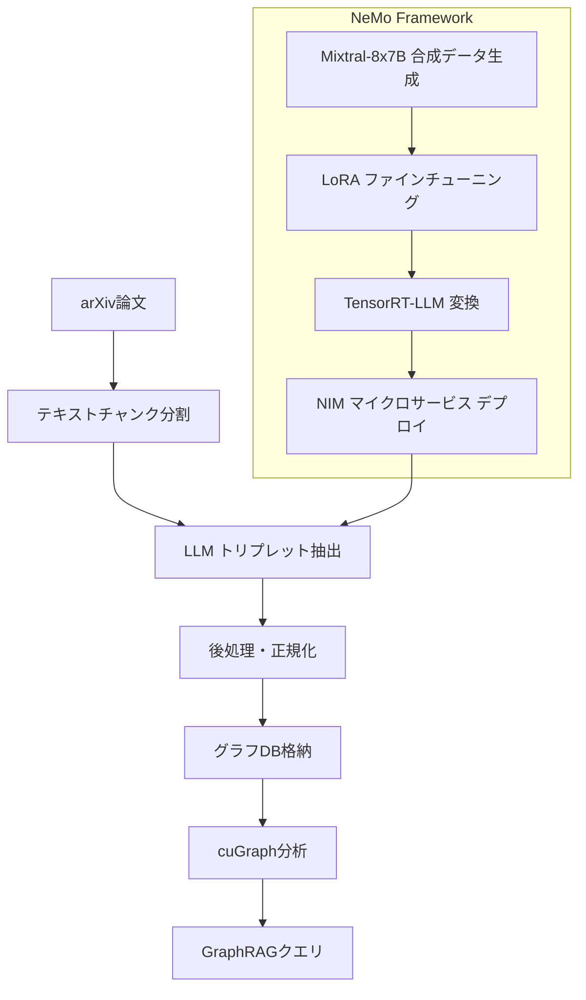

本記事は [NVIDIA Developer Blog: Insights, Techniques, and Evaluation for LLM-Driven Knowledge Graphs](https://developer.nvidia.com/blog/insights-techniques-and-evaluation-for-llm-driven-knowledge-graphs/) の解説記事です。

## ブログ概要

NVIDIAの開発者ブログでは、LLMを用いたナレッジグラフ（KG）の自動構築パイプラインと、その評価手法について包括的に論じている。具体的には、NeMoフレームワークによるLoRAファインチューニングでLlama3-8Bモデルを最適化し、arXiv論文からエンティティ・リレーションのトリプレットを98%の精度で抽出するワークフローを提示している。さらに、Nemotron-340B報酬モデルを用いてGraphRAG、HybridRAG、VectorRAGの3方式を定量比較し、用途に応じた最適なRAG構成の指針を示している。

関連するZenn記事「[LlamaIndex v0.14 PropertyGraphIndexで評価駆動型RAGパイプラインを構築する](https://zenn.dev/0h_n0/articles/9ee2f7ab401829)」では、LlamaIndexのPropertyGraphIndexを用いたKG構築とRAG評価パイプラインの実装を扱っている。本記事のNVIDIAによるアプローチは、同様のKG+RAGパイプラインをエンタープライズ規模で実現するための知見を提供するものであり、特にスキーマ定義やエンティティ正規化の手法はLlamaIndexのSchemaLLMPathExtractorと共通する設計思想を持つ。

## 情報源

| 項目 | 内容 |
|------|------|
| 種別 | 企業テックブログ |
| URL | [developer.nvidia.com](https://developer.nvidia.com/blog/insights-techniques-and-evaluation-for-llm-driven-knowledge-graphs/) |
| 組織 | NVIDIA |
| 著者 | Rohan Rao, Benika Hall, Sunil Patel, Christopher Brissette, Gordana Neskovic |
| 発表日 | 2024年12月16日 |

## 技術的背景

非構造化テキストからナレッジグラフを自動構築することは、RAG（Retrieval-Augmented Generation）の精度向上に不可欠な技術である。従来のベクトル検索（VectorRAG）はセマンティックな類似度に基づく検索を行うが、複数のドキュメントにまたがる関係性（マルチホップ推論）の把握には限界がある。ナレッジグラフを組み合わせたGraphRAGは、エンティティ間の明示的な関係をたどることで、この課題を解決する可能性を持つ。

しかしKGの自動構築には、エンティティの一貫性確保、スキーマの事前定義、構造化出力の強制、抽出精度の担保など多くの技術的課題が存在する。NVIDIAチームは、大規模言語モデル（Llama2-70B）をベースラインとして用い、LoRAファインチューニングを施した小規模モデル（Llama3-8B）で大幅な精度向上を達成した。この結果は、KG構築タスクにおいてモデルサイズよりもタスク特化のファインチューニングが重要であることを示唆している。

## 実装アーキテクチャ

### 全体ワークフロー

NVIDIAチームが提示するKG構築パイプラインは、以下の3つのコンポーネントで構成される。



1. **NeMoフレームワーク**: モデルのファインチューニング基盤として使用される。LoRA（Low-Rank Adaptation）によるパラメータ効率の高い学習を実施する
2. **NIMマイクロサービス**: ファインチューニング済みモデルをTensorRT-LLMチェックポイントに変換し、GPU加速推論をスケーラブルに提供する
3. **cuGraph**: NVIDIA RAPIDSのGPU加速グラフ分析ライブラリで、構築されたKGに対する大規模分析を実行する

### エンティティ・リレーション抽出パイプライン

トリプレット抽出は、テキストチャンクからLLMにより `(subject, subject_type, relation, object, object_type)` の5つ組を抽出する処理である。NVIDIAチームは、詳細なシステムプロンプトに基づくinstruction-basedプロンプティングを採用している。

ブログ記事で示されているトリプレット処理の実装例を以下に示す。

```python
import ast
from typing import Any


def process_response(triplets_str: str) -> list[dict[str, Any]]:
    """LLM出力からトリプレットを解析し構造化データに変換する。

    Args:
        triplets_str: LLMが生成したトリプレットのリスト文字列

    Returns:
        構造化されたトリプレットの辞書リスト
    """
    triplets_list = ast.literal_eval(triplets_str)
    json_triplets = []
    for triplet in triplets_list:
        try:
            subject, subject_type, relation, obj, object_type = triplet
            json_triplet = {
                "subject": subject,
                "subject_type": subject_type,
                "relation": relation,
                "object": obj,
                "object_type": object_type,
            }
            json_triplets.append(json_triplet)
        except ValueError:
            # 不正な形式のトリプレットはスキップ
            continue
    return json_triplets
```

NVIDIAチームは、`ast.literal_eval()` によるパースとtry-exceptによるエラーハンドリングを組み合わせ、不正な形式のトリプレットを安全にスキップする設計を採用している。

### スキーマ・オントロジー定義

KGの品質を左右する重要な要素がスキーマ定義である。NVIDIAチームは以下のエンティティカテゴリを事前に定義している。

| カテゴリ | 説明 |
|---------|------|
| ORG | 一般的な組織 |
| ORG/GOV | 政府機関 |
| ORG/REG | 規制機関 |
| PERSON | 人物 |
| GPE | 地政学的エンティティ |
| INSTITUTION | 学術・研究機関 |
| PRODUCT | 製品・サービス |
| EVENT | イベント |
| FIELD | 研究分野・領域 |
| METRIC | 評価指標 |
| TOOL | ツール・フレームワーク |
| CONCEPT | 概念・理論 |

リレーション（関係）についても制約付きの動詞セットを定義している: `Has`, `Announce`, `Operate_In`, `Introduce`, `Produce`, `Control`, `Participates_In`, `Impact`, `Positive_Impact_On`, `Negative_Impact_On`, `Relate_To`, `Is_Member_Of`, `Invests_In`, `Raise`, `Decrease`。

この設計は、LlamaIndexのSchemaLLMPathExtractorにおける `possible_entities` および `possible_relations` パラメータと同様のアプローチである。両者ともにLLMの出力をスキーマで制約し、KGの一貫性を確保する点で共通した設計思想を持つ。

さらにNVIDIAチームは、エンティティに対して「汎用的・数値的・時間的（日付やパーセンテージ）であってはならない」という制約を明示しており、ノイズの少ないグラフ構築を目指している。

### エンティティ一貫性の確保

同一エンティティの異なる表記（例: 「MIT」と「Massachusetts Institute of Technology」）を統一するため、NVIDIAチームは以下の手法を組み合わせている。

- **エンティティの正規化**: エンティティ名を4語以内に簡潔化するルールを適用
- **エンティティ曖昧性解消**: 略称と正式名称の統合
- **形式意味論の適用**: 重複削減のための形式的手法
- **追加検証**: 必要に応じた手動レビューの実施

### 構造化出力の強制

LLMの出力を確実に構造化するため、3段階のアプローチが採用されている。

1. **JSON / Function Calling**: LLMネイティブの構造化出力機能を活用
2. **後処理パイプライン**: 不正な形式のレスポンスを手動で修正し所望の構造に変換
3. **再プロンプト戦略**: 不正出力に対してLLMに修正を要求する反復的アプローチ

NVIDIAチームは、最新のLLMモデルほどパース処理が改善されていると報告しており、不正なフォーマット（括弧やカンマの欠落など）の発生頻度が低下していることを確認している。

## Production Deployment Guide

### AWS実装パターン

NVIDIAのKG構築パイプラインをAWS上で運用する際の構成を、規模別に整理する。ブログ記事のアーキテクチャ（NIM + cuGraph + グラフDB）をAWSマネージドサービスにマッピングした構成例を示す。

#### 規模別コスト見積もり

| 構成 | 月間ドキュメント数 | 主要コンポーネント | 月額概算 (USD) |
|------|-------------------|-------------------|----------------|
| Small | ~1,000件 | Lambda + Bedrock + Neptune Serverless | $500-800 |
| Medium | ~10,000件 | ECS Fargate + Bedrock + Neptune + OpenSearch | $2,000-4,000 |
| Large | ~100,000件 | EKS + Karpenter + GPU Node + Neptune Cluster | $8,000-15,000 |

#### Small構成: Lambda + Bedrock + DynamoDB

少量のドキュメント処理に適したサーバーレス構成。NIMの代替としてAmazon Bedrockを利用し、グラフストアにはAmazon Neptune Serverlessを使用する。

```hcl
# Small構成: サーバーレスKG構築パイプライン
terraform {
  required_version = ">= 1.5"
  required_providers {
    aws = {
      source  = "hashicorp/aws"
      version = "~> 5.0"
    }
  }
}

# KGトリプレット抽出Lambda
resource "aws_lambda_function" "triplet_extractor" {
  function_name = "kg-triplet-extractor"
  runtime       = "python3.12"
  handler       = "handler.extract_triplets"
  timeout       = 300
  memory_size   = 1024

  environment {
    variables = {
      BEDROCK_MODEL_ID   = "anthropic.claude-sonnet-4-20250514"
      NEPTUNE_ENDPOINT   = aws_neptune_cluster.kg_store.endpoint
      ENTITY_SCHEMA_PATH = "/opt/schema/entities.json"
    }
  }

  layers = [aws_lambda_layer_version.kg_dependencies.arn]
}

# Neptune Serverless (グラフDB)
resource "aws_neptune_cluster" "kg_store" {
  cluster_identifier                  = "kg-graph-store"
  engine                              = "neptune"
  serverless_v2_scaling_configuration {
    min_capacity = 1.0
    max_capacity = 8.0
  }
  backup_retention_period = 7
  skip_final_snapshot     = false
}

resource "aws_neptune_cluster_instance" "kg_store_instance" {
  cluster_identifier = aws_neptune_cluster.kg_store.id
  instance_class     = "db.serverless"
  engine             = "neptune"
}

# DynamoDB (処理状態管理)
resource "aws_dynamodb_table" "processing_status" {
  name         = "kg-processing-status"
  billing_mode = "PAY_PER_REQUEST"
  hash_key     = "document_id"
  range_key    = "chunk_id"

  attribute {
    name = "document_id"
    type = "S"
  }

  attribute {
    name = "chunk_id"
    type = "S"
  }

  ttl {
    attribute_name = "expires_at"
    enabled        = true
  }
}

# S3 (ドキュメント格納)
resource "aws_s3_bucket" "documents" {
  bucket = "kg-pipeline-documents"
}

# SQS (非同期処理キュー)
resource "aws_sqs_queue" "extraction_queue" {
  name                       = "kg-extraction-queue"
  visibility_timeout_seconds = 600
  message_retention_seconds  = 86400

  redrive_policy = jsonencode({
    deadLetterTargetArn = aws_sqs_queue.extraction_dlq.arn
    maxReceiveCount     = 3
  })
}

resource "aws_sqs_queue" "extraction_dlq" {
  name = "kg-extraction-dlq"
}

# Lambda -> SQS トリガー
resource "aws_lambda_event_source_mapping" "sqs_trigger" {
  event_source_arn = aws_sqs_queue.extraction_queue.arn
  function_name    = aws_lambda_function.triplet_extractor.arn
  batch_size       = 1
}
```

#### Large構成: EKS + Karpenter + GPU Node

大量ドキュメントを処理する本番環境向け構成。GPUノードによるモデル推論の高速化と、Karpenterによる動的スケーリングを組み合わせる。

```hcl
# Large構成: EKS + GPU推論クラスタ
module "eks" {
  source          = "terraform-aws-modules/eks/aws"
  version         = "~> 20.0"
  cluster_name    = "kg-pipeline-cluster"
  cluster_version = "1.30"

  vpc_id     = module.vpc.vpc_id
  subnet_ids = module.vpc.private_subnets

  eks_managed_node_groups = {
    # CPU系ワークロード (前処理・後処理)
    general = {
      instance_types = ["m7i.xlarge"]
      min_size       = 2
      max_size       = 10
      desired_size   = 3
    }
  }
}

# Karpenter (GPU Node 動的プロビジョニング)
resource "helm_release" "karpenter" {
  name       = "karpenter"
  repository = "oci://public.ecr.aws/karpenter"
  chart      = "karpenter"
  version    = "1.1.0"
  namespace  = "kube-system"
}

# GPU NodePool定義 (Karpenter)
resource "kubectl_manifest" "gpu_nodepool" {
  yaml_body = <<-YAML
    apiVersion: karpenter.sh/v1
    kind: NodePool
    metadata:
      name: gpu-inference
    spec:
      template:
        spec:
          requirements:
            - key: node.kubernetes.io/instance-type
              operator: In
              values: ["g5.xlarge", "g5.2xlarge"]
            - key: karpenter.sh/capacity-type
              operator: In
              values: ["spot", "on-demand"]
          nodeClassRef:
            group: karpenter.k8s.aws
            kind: EC2NodeClass
            name: default
      limits:
        gpu: "8"
      disruption:
        consolidationPolicy: WhenEmptyOrUnderutilized
        consolidateAfter: 5m
  YAML
}

# Neptune Cluster (プロビジョンド)
resource "aws_neptune_cluster" "kg_store" {
  cluster_identifier      = "kg-production-store"
  engine                  = "neptune"
  backup_retention_period = 14
  preferred_backup_window = "03:00-04:00"
  skip_final_snapshot     = false

  neptune_cluster_parameter_group_name = aws_neptune_cluster_parameter_group.production.name
}

resource "aws_neptune_cluster_instance" "kg_readers" {
  count              = 2
  cluster_identifier = aws_neptune_cluster.kg_store.id
  instance_class     = "db.r6g.xlarge"
  engine             = "neptune"
}

# OpenSearch (ベクトル検索 - HybridRAG用)
resource "aws_opensearch_domain" "vector_store" {
  domain_name    = "kg-vector-store"
  engine_version = "OpenSearch_2.13"

  cluster_config {
    instance_type          = "r6g.large.search"
    instance_count         = 2
    zone_awareness_enabled = true
  }

  ebs_options {
    ebs_enabled = true
    volume_size = 100
    volume_type = "gp3"
  }
}
```

### 運用・監視

KGパイプラインの安定運用には、以下の観測性スタックを整備する。

```hcl
# CloudWatch ダッシュボード
resource "aws_cloudwatch_dashboard" "kg_pipeline" {
  dashboard_name = "kg-pipeline-monitoring"
  dashboard_body = jsonencode({
    widgets = [
      {
        type   = "metric"
        properties = {
          title   = "Triplet Extraction Latency"
          metrics = [["KGPipeline", "ExtractionLatencyMs", "Stage", "triplet_extraction"]]
          period  = 300
          stat    = "p99"
        }
      },
      {
        type   = "metric"
        properties = {
          title   = "Extraction Accuracy"
          metrics = [["KGPipeline", "TripletAccuracy", "Model", "llama3-8b-lora"]]
          period  = 3600
          stat    = "Average"
        }
      },
      {
        type   = "metric"
        properties = {
          title   = "Neptune Query Latency"
          metrics = [["AWS/Neptune", "GremlinRequestsPerSec"]]
          period  = 60
        }
      }
    ]
  })
}

# X-Ray トレーシング
resource "aws_xray_sampling_rule" "kg_pipeline" {
  rule_name      = "kg-pipeline-tracing"
  priority       = 1000
  reservoir_size = 10
  fixed_rate     = 0.1
  url_path       = "/extract/*"
  host           = "*"
  http_method    = "*"
  service_type   = "*"
  service_name   = "kg-pipeline"
  resource_arn   = "*"
  version        = 1
}
```

**CloudWatch Alarms設定例**:

| アラーム名 | 条件 | アクション |
|-----------|------|----------|
| ExtractionErrorRate | エラー率 > 5% (5分間) | SNS通知 + PagerDuty |
| NeptuneHighCPU | CPU > 80% (10分間) | Auto Scaling |
| QueueDepth | SQSメッセージ > 1000 | Lambda並列度引き上げ |
| ExtractionLatencyP99 | p99 > 30秒 | SNS通知 |

### コスト最適化チェックリスト

KGパイプラインの運用コストを最適化するための項目を以下に示す。

**コンピューティング**:

1. GPU推論にSpotインスタンスを活用（最大70%削減）
2. Karpenter consolidationPolicy で未使用ノードを5分以内に回収
3. Lambda Power Tuningで最適メモリサイズを選定
4. Graviton（ARM）インスタンスでCPU処理コストを20%削減
5. バッチ処理時間帯をオフピークに設定（Savings Plans適用）

**ストレージ**:

6. Neptune Serverlessの最小/最大NCUを適切に設定
7. S3 Intelligent-Tieringで処理済みドキュメントを自動階層化
8. DynamoDB TTLで処理済みステータスレコードを自動削除
9. OpenSearchのUltraWarmノードで古いベクトルデータを低コスト保持
10. EBSボリュームをgp3に統一（gp2比で20%削減）

**ネットワーク**:

11. VPCエンドポイント経由でS3/DynamoDB/Bedrockにアクセス（NAT Gateway料金削減）
12. Neptune/OpenSearchをPrivate Subnetに配置
13. リージョン内通信に限定（クロスリージョン転送料金の回避）

**モデル推論**:

14. LoRAファインチューニング済みLlama3-8Bの利用（Llama2-70B比で推論コスト大幅削減）
15. Bedrock Provisioned Throughputの予約（安定ワークロード向け）
16. バッチ推論APIの活用（リアルタイム不要な処理）
17. KVキャッシュの有効活用（同一スキーマプロンプトの再利用）

**運用**:

18. CloudWatch Logsの保持期間を適切に設定（30日/90日/1年）
19. X-Rayサンプリングレートを本番では10%以下に設定
20. Cost Explorerで週次コストレポートを自動生成
21. AWS Budgetsで月額上限アラートを設定
22. Reserved Instancesの利用率をMonthly Reportで確認

## パフォーマンス最適化

### LoRAファインチューニングの効果

NVIDIAチームのブログによれば、KGトリプレット抽出の精度比較において以下の結果が報告されている。

| モデル | 精度 |
|--------|------|
| Llama2-70B（ベースライン） | 54% |
| Llama3-8B + LoRA + 正規化テクニック | 98% |

この結果は注目に値する。パラメータ数が約9分の1のモデルが、LoRAファインチューニングとエンティティ正規化テクニックの組み合わせにより、ベースラインの70Bモデルを大幅に上回る精度を達成している。

ファインチューニングの教師データ生成には、Mixtral-8x7Bモデルを使用した合成トリプレットデータが用いられた。この「大規模モデルで合成データを生成し、小規模モデルをファインチューニングする」アプローチは、知識蒸留（Knowledge Distillation）の実践的な応用と位置づけられる。

NIMマイクロサービスへのデプロイでは、NeMoで学習した重みをTensorRT-LLMチェックポイントに変換することで、GPU加速推論を実現している。NVIDIAチームは、この最適化により精度向上に加えてレイテンシ削減と推論コスト低減を同時に達成したと報告している。

### cuGraphによるスケーラブルなグラフ分析

構築されたKGに対する分析には、NVIDIA RAPIDSのcuGraphが使用されている。cuGraphはGPU加速されたグラフ分析ライブラリであり、以下のアルゴリズムをサポートしている。

- **最短経路探索**: エンティティ間の関係パスの発見
- **PageRank**: 重要なエンティティの特定
- **コミュニティ検出**: 関連エンティティのクラスタリング

cuGraphはNetworkX互換のAPIを提供しており、既存のNetworkXコードから最小限の変更で移行できる点が特徴である。NVIDIAチームは、数十億ノード・エッジ規模のグラフをマルチGPUシステムで処理可能であると述べている。

## 運用での学び

### スキーマ設計のベストプラクティス

NVIDIAチームのブログからは、KG構築におけるスキーマ設計について以下の実践的知見が読み取れる。

**エンティティ設計**:
- エンティティカテゴリは具体的かつ階層的に定義する（例: `ORG` -> `ORG/GOV`, `ORG/REG`）
- 汎用的・数値的・時間的なエンティティは除外ルールで排除する
- エンティティ名は4語以内に正規化し、一貫性を確保する

**リレーション設計**:
- 関係動詞を事前に定義した制約セットに限定する
- 正負のインパクトを区別する（`Positive_Impact_On` / `Negative_Impact_On`）
- ドメイン固有の関係を必要に応じて追加可能な拡張性を持たせる

**構造化出力の堅牢性**:
- JSON / Function Callingによるネイティブ構造化を第一選択とする
- 後処理パイプラインでフォールバック処理を実装する
- 再プロンプト戦略で不正出力のリカバリを行う

これらの知見は、LlamaIndexのSchemaLLMPathExtractorを実運用に適用する際にも直接参考になる。特に、エンティティの正規化ルールと除外条件の明示は、KGの品質を大きく左右する要素である。

## 学術研究との関連

### GraphRAG vs HybridRAG vs VectorRAG の比較評価

NVIDIAチームは、Nemotron-340B報酬モデルを用いて、GraphRAG、HybridRAG、VectorRAGの3方式を以下の5つのメトリクスで評価している（0-4スケール）。

- **Helpfulness（有用性）**
- **Correctness（正確性）**
- **Coherence（一貫性）**
- **Complexity（複雑性）**
- **Verbosity（冗長性）**

評価用のデータセットは、arXiv論文からNemotron-340Bを使用して合成的に生成されたground-truth QAペアである。NVIDIAチームは、GraphRAGがCorrectness（正確性）において特に優れた性能を示し、高精度な応答を生成したと報告している。

ただし、HybridRAGがGraphRAG単体に及ばなかった点について、NVIDIAチームは「データセットがマルチホップ推論を強調するよう合成的に設計されたため、GraphRAGの強みが際立つ結果になった」と説明している。実際の運用では、「データセットとコンテキスト注入の方法次第で、HybridRAGはほぼすべてのメトリクスでVectorRAGを上回る可能性がある」とも述べている。

この評価結果は、Deloitteによる[HybridRAG論文](https://arxiv.org/abs/2408.04948)の知見とも関連する。HybridRAGは金融や医療など規制の厳しいドメインにおいて「バランスの取れた効果的な手法」として位置づけられており、ドメイン特性に応じたRAG方式の選択が重要であることを示している。

## まとめと実践への示唆

NVIDIAチームのブログ記事は、LLMを用いたKG自動構築の実践的なワークフローを包括的に示したものである。主要な知見を整理する。

1. **LoRAファインチューニングの有効性**: Llama3-8B + LoRAで98%の精度を達成し、70Bベースラインの54%を大幅に上回った。タスク特化のファインチューニングがモデルサイズを補って余りある効果を発揮する
2. **スキーマ定義の重要性**: エンティティカテゴリとリレーション動詞の事前定義が、KGの品質と一貫性を決定づける。LlamaIndexのSchemaLLMPathExtractorと共通する設計原則である
3. **RAG方式の適材適所**: GraphRAGはマルチホップ推論に優れるが、HybridRAGはドメイン次第でより効果的になり得る。評価データセットの特性を理解した上での方式選択が重要である
4. **GPU加速パイプラインの実現性**: NIM + cuGraphの組み合わせにより、数十億スケールのKG構築・分析が現実的なコストで実現可能になっている

Zenn記事で実装したLlamaIndexベースのKGパイプラインを本番規模に拡張する際、本ブログのスキーマ設計方針やエンティティ正規化テクニック、そしてRAG方式の評価手法は直接的な参考となるだろう。

## 参考文献

1. Rohan Rao, Benika Hall, Sunil Patel, Christopher Brissette, Gordana Neskovic. "Insights, Techniques, and Evaluation for LLM-Driven Knowledge Graphs." NVIDIA Developer Blog, December 16, 2024. [https://developer.nvidia.com/blog/insights-techniques-and-evaluation-for-llm-driven-knowledge-graphs/](https://developer.nvidia.com/blog/insights-techniques-and-evaluation-for-llm-driven-knowledge-graphs/)
2. Borah, Debarshi Deka, et al. "HybridRAG: Integrating Knowledge Graphs and Vector Retrieval Augmented Generation for Efficient Information Extraction." arXiv preprint arXiv:2408.04948, 2024. [https://arxiv.org/abs/2408.04948](https://arxiv.org/abs/2408.04948)
3. NVIDIA. "NVIDIA NeMo Framework." [https://www.nvidia.com/en-us/ai-data-science/generative-ai/nemo-framework/](https://www.nvidia.com/en-us/ai-data-science/generative-ai/nemo-framework/)
4. NVIDIA. "NVIDIA NIM Microservices." [https://www.nvidia.com/en-us/ai/](https://www.nvidia.com/en-us/ai/)
5. NVIDIA. "RAPIDS cuGraph." [https://github.com/rapidsai/cugraph](https://github.com/rapidsai/cugraph)
6. Hu, Edward J., et al. "LoRA: Low-Rank Adaptation of Large Language Models." arXiv preprint arXiv:2106.09685, 2021. [https://arxiv.org/abs/2106.09685](https://arxiv.org/abs/2106.09685)
