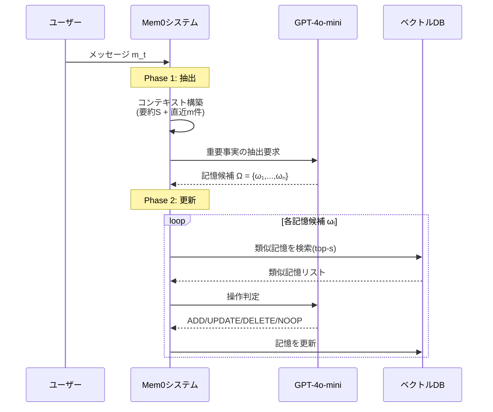

## 論文概要（Abstract）

本記事は [arXiv:2504.19413](https://arxiv.org/abs/2504.19413) の解説記事です。

LLMの固定コンテキストウィンドウは、複数セッションにわたる対話の一貫性を制約する。Chhikaraらは、進行中の会話から重要な情報を動的に抽出・統合・検索するスケーラブルなメモリ中心アーキテクチャMem0を提案した。さらに、グラフベースのメモリ表現により複雑な関係構造を捕捉する拡張版Mem0$^g$も提示している。LoCoMoベンチマークで10種のベースライン（OpenAI Memory、Zep、LangMem、RAG、フルコンテキスト等）と比較し、p95レイテンシを91%削減しつつトークンコストを90%以上節約できることを著者らは報告している。ECAI 2025に採択された。

この記事は [Zenn記事: Agents SDK Sessionsで再設計するThread管理：11種バックエンドとcompaction実装](https://zenn.dev/0h_n0/articles/0da98f837e992b) の深掘りです。

## 情報源

- **会議名**: ECAI 2025（28th European Conference on Artificial Intelligence）
- **arXiv ID**: 2504.19413
- **URL**: [https://arxiv.org/abs/2504.19413](https://arxiv.org/abs/2504.19413)
- **著者**: Prateek Chhikara, Dev Khant, Saket Aryan, Taranjeet Singh, Deshraj Yadav
- **発表年**: 2025

## カンファレンス情報

ECAIはヨーロッパのAI分野における主要会議であり、40年以上の歴史を持つ。Mem0は、LLMエージェントの記憶管理という実用的課題に対して、10種のベースラインとの包括的比較という点で評価されている。

## 背景と動機（Background & Motivation）

OpenAI Agents SDKは11種のSessionバックエンド（SQLite、Redis、PostgreSQL、MongoDB、Dapr等）を提供し、会話履歴の永続化を実現している。しかし、これらのバックエンドは「何を記憶するか」の判断をアプリケーション開発者に委ねており、会話から重要な情報を自動的に抽出・統合する仕組みは含まれていない。

Mem0は、Agents SDKのSession層の上位（または代替）として、「インテリジェントな記憶管理」を提供するシステムである。会話履歴全体を保持するのではなく、重要な事実・関係・嗜好を抽出して構造化された記憶として管理する。

## 技術的詳細（Technical Details）

### Mem0アーキテクチャ: 抽出フェーズと更新フェーズ

Mem0は2フェーズのインクリメンタル処理で動作する。



**抽出フェーズ**: メッセージペア$(m_{t-1}, m_t)$を処理する際、以下の2つのソースからコンテキストを構築する。

1. データベースから取得した会話要約$S$
2. 直近$m$件（$m=10$）のメッセージ$\{m_{t-m}, \ldots, m_{t-2}\}$

これらを組み合わせたプロンプト$P$をLLM関数$\phi$に入力し、重要な記憶$\Omega = \{\omega_1, \omega_2, \ldots, \omega_n\}$を抽出する。

**更新フェーズ**: 各抽出された事実$\omega_i$に対して、以下の4つの操作を判定する。

| 操作 | 条件 | 動作 |
|------|------|------|
| **ADD** | 意味的に等価な既存記憶がない | 新規記憶を作成 |
| **UPDATE** | 既存記憶を補完する情報がある | 既存記憶を拡張 |
| **DELETE** | 新情報が既存記憶と矛盾 | 既存記憶を削除 |
| **NOOP** | 変更不要 | 何もしない |

類似記憶の検索にはベクトル埋め込み（OpenAI text-embedding-small-3）を使用し、上位$s=10$件を取得してLLM（GPT-4o-mini）が操作を判定する。

### グラフベースメモリ変種（Mem0$^g$）

Mem0$^g$は、記憶をNeo4jグラフデータベース上の有向ラベル付きグラフ$G = (V, E, L)$として表現する。

- **ノード$V$**: エンティティ（人物、場所、概念等）。各ノードはエンティティタイプ分類、埋め込みベクトル$\mathbf{e}_v$、タイムスタンプ$t_v$を保持
- **エッジ$E$**: エンティティ間の関係。トリプレット$(v_s, r, v_d)$として表現
- **ラベル$L$**: 意味的エンティティタイプ

**抽出パイプライン（2段階）**:
1. エンティティ抽出器が会話から重要な情報要素を特定
2. 関係生成器がエンティティ間の関係をトリプレットとして導出

**検索戦略（デュアルアプローチ）**:
1. **エンティティ中心検索**: クエリからエンティティを特定し、グラフ上で入出のエッジを探索
2. **セマンティックトリプレット検索**: クエリを埋め込みに変換し、関係トリプレットの埋め込みとマッチング

```python
from dataclasses import dataclass

@dataclass
class MemoryEntry:
    """Mem0の記憶エントリ（論文Section 3準拠）"""
    content: str
    embedding: list[float]
    timestamp: str
    source_turn: int

@dataclass  
class GraphTriple:
    """Mem0^gのグラフトリプレット"""
    source: str
    relation: str
    destination: str
    source_type: str
    destination_type: str

def determine_operation(
    new_fact: str,
    similar_memories: list[MemoryEntry],
    threshold: float = 0.85,
) -> str:
    """記憶の更新操作を判定する（論文Section 3.2準拠）
    
    Returns:
        "ADD", "UPDATE", "DELETE", or "NOOP"
    """
    if not similar_memories:
        return "ADD"
    # LLMベースの判定ロジック（実際はGPT-4o-miniで実行）
    return "NOOP"
```

## 実験結果（Results）

### LoCoMoベンチマーク（論文Table 1より）

著者らが報告したLoCoMo（1,520問、10対話）での結果を以下に示す。Jスコア（LLM-as-Judge）はGPT-4oによる品質評価である。

| 手法 | Single-hop J | Multi-hop J | Temporal J | Open-domain J |
|------|-------------|------------|-----------|--------------|
| Full Context | — | — | — | — |
| RAG (best) | — | — | — | ~61% |
| MemGPT | — | — | — | — |
| OpenAI Memory | 63.79 | — | — | — |
| LangMem | 62.23 | — | — | — |
| Zep | — | — | — | 76.60 |
| **Mem0** | **67.13** | **51.15** | **55.51** | **72.93** |
| **Mem0$^g$** | 65.71 | 47.19 | **58.13** | **75.71** |

著者らの結果によると、Mem0はSingle-hopとMulti-hopでOpenAI Memoryを上回り（Jスコアで+3.3ポイント）、Mem0$^g$はTemporal推論（58.13 vs 55.51）とOpen-domain（75.71 vs 72.93）でMem0を上回っている。

**F1スコア詳細（論文Table 1より）**:

| 手法 | Single-hop F1 | Multi-hop F1 | Temporal F1 | Open-domain F1 |
|------|-------------|------------|-----------|--------------|
| Mem0 | 38.72 | 28.64 | 48.93 | 47.65 |
| Mem0$^g$ | 38.09 | 24.32 | 51.55 | 49.27 |

### レイテンシとコスト（論文Table 2より）

| システム | Search p50 | Search p95 | Total p95 | Jスコア |
|----------|-----------|-----------|-----------|---------|
| **Mem0** | **0.148s** | **0.200s** | **1.440s** | 66.88% |
| Mem0$^g$ | 0.476s | 0.657s | 2.590s | 68.44% |
| Full Context | — | — | 17.117s | 72.90% |
| Zep | 0.513s | 0.778s | 2.926s | 65.99% |
| LangMem | 17.99s | 59.82s | 60.40s | 58.10% |

著者らの報告によると、Mem0はフルコンテキスト処理と比較してp95レイテンシを91%削減（1.440s vs 17.117s）している。

**トークン消費量**:
- Mem0: 約7kトークン/会話
- Mem0$^g$: 約14kトークン（グラフ構造のため2倍）
- Zep: 600k以上のトークン
- フルコンテキスト: 約26kトークン

著者らは「Mem0はフルコンテキスト処理と比較して90%以上のトークンコスト削減を達成する」と報告している。

### 方式別の特性比較

| 観点 | Mem0 | Mem0$^g$ |
|------|------|---------|
| Single-hop精度 | 優位 | — |
| Multi-hop精度 | 優位 | — |
| Temporal推論 | — | 優位 |
| Open-domain | — | 優位 |
| 検索レイテンシ | 0.148s | 0.476s |
| メモリ構築時間 | 1分未満 | 1分未満 |

著者らは「自然言語記憶は統合的タスクに十分な表現力を持つ」一方で「グラフ構造は微妙な関係的コンテキストを必要とするシナリオでより有益」と分析している。

## 実装のポイント（Implementation）

### Agents SDK Sessionsとの統合パターン

Mem0はAgents SDKのSessionバックエンドとは異なるアプローチを取るが、組み合わせて使用できる。

```python
from agents import Agent, Runner, SQLiteSession, RunConfig

class Mem0EnhancedSession:
    """Mem0 + Agents SDK Sessionの統合パターン（設計例）
    
    Agents SDKのSessionで会話履歴を管理しつつ、
    Mem0で長期記憶を構築・検索する。
    """
    def __init__(self, session_id: str, db_path: str = "conversations.db"):
        self.session = SQLiteSession(session_id, db_path)
        self.session_id = session_id
    
    async def run_with_memory(
        self,
        agent: Agent,
        user_input: str,
        memory_context: str = "",
    ):
        """記憶コンテキストを含めてエージェントを実行"""
        enriched_input = user_input
        if memory_context:
            enriched_input = (
                f"[関連する過去の記憶]\n{memory_context}\n\n"
                f"[ユーザー入力]\n{user_input}"
            )
        
        result = await Runner.run(
            agent,
            enriched_input,
            session=self.session,
        )
        return result
```

### 設計上の考慮事項

1. **記憶の粒度**: Mem0は事実レベルの記憶を抽出するため、Agents SDKの`CompactionSession`（ターンレベルの要約）とは粒度が異なる。用途に応じて使い分ける
2. **整合性**: 記憶の更新（UPDATE/DELETE）操作は原子的でない場合があり、高頻度の並行更新では整合性に注意が必要
3. **LLM依存性**: 記憶の抽出と操作判定にGPT-4o-miniを使用するため、LLMのコスト・レイテンシが記憶管理のオーバーヘッドとなる

## 実運用への応用（Practical Applications）

Mem0のアーキテクチャは、Agents SDKのSession機構では対応が難しい以下のユースケースに適している。

- **マルチセッション顧客プロファイル**: 複数の会話セッションにわたるユーザーの嗜好・行動パターンを蓄積し、パーソナライズされた応答を生成。`EncryptedSession`のTTLと組み合わせてGDPR対応も可能
- **知識ベース自動構築**: カスタマーサポートの会話からFAQや問題解決パターンをグラフとして自動構築。Mem0$^g$のトリプレット表現が適している
- **コスト効率の高いセッション管理**: 26kトークンのフルコンテキストの代わりに7kトークンで同等以上の品質を達成することで、`previous_response_id`チェーンのコスト累積問題を回避

## 関連研究（Related Work）

- **MemGPT** (Packer et al., 2023): OSのページング機構を模倣したLLM記憶管理。LoCoMoでのSingle-hop F1は26.65でMem0（38.72）に劣る
- **Zep**: 時間的知識グラフベースの記憶管理。Open-domainで最高スコア（76.60）だが、トークン消費が600k以上と非効率
- **A-Mem** (2025): エージェント型記憶管理。Mem0の報告ではSingle-hop F1 27.02（再実行時20.76）

## まとめと今後の展望

Mem0は、LLMエージェントの長期記憶管理において、品質・レイテンシ・コストのバランスに優れた実用的なシステムを実証した。Agents SDKの11種のSessionバックエンドが「どこに保存するか」を解決するのに対し、Mem0は「何を記憶するか」の自動化を提供する。両者の組み合わせにより、記憶管理のフルスタックソリューションが実現可能である。今後は、Mem0$^g$のグラフメモリとAgents SDKの`DaprSession`との統合や、`EncryptedSession`による記憶の暗号化が実用上の課題となる。

## 参考文献

- **Conference URL**: [https://arxiv.org/abs/2504.19413](https://arxiv.org/abs/2504.19413)
- **Related Zenn article**: [https://zenn.dev/0h_n0/articles/0da98f837e992b](https://zenn.dev/0h_n0/articles/0da98f837e992b)
