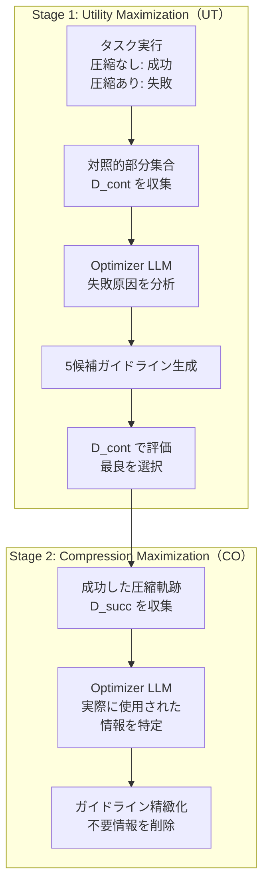

## 論文概要（Abstract）

本記事は [arXiv:2510.00615](https://arxiv.org/abs/2510.00615) の解説記事です。

長時間エージェントタスクでは、ターンが進むごとにコンテキストが無制限に増大し、推論メモリコストの増大と無関係情報による推論品質の劣化という二重の問題が発生する。Kangらは、観測履歴と行動履歴の両方を簡潔かつ情報量の高い表現に最適圧縮するACON（Agent Context Optimization）フレームワークを提案した。モデルのファインチューニングを必要とせず、自然言語空間での反復的な圧縮ガイドライン最適化により、ピークトークン使用量を26-54%削減しつつタスク成功率を維持または向上させることを実証している。ICML 2026に採択された。

この記事は [Zenn記事: Agents SDK Sessionsで再設計するThread管理：11種バックエンドとcompaction実装](https://zenn.dev/0h_n0/articles/0da98f837e992b) の深掘りです。

## 情報源

- **会議名**: ICML 2026（International Conference on Machine Learning）
- **arXiv ID**: 2510.00615
- **URL**: [https://arxiv.org/abs/2510.00615](https://arxiv.org/abs/2510.00615)
- **著者**: Minki Kang, Wei-Ning Chen, Dongge Han, Huseyin A. Inan, Lukas Wutschitz, Yanzhi Chen, Robert Sim, Saravan Rajmohan
- **所属**: Microsoft Research
- **コード**: [github.com/microsoft/acon](https://github.com/microsoft/acon)

## カンファレンス情報

ICMLは機械学習分野の最高峰会議の一つであり、採択率は例年25%前後の競争率を持つ。ACONは、LLMエージェントのコンテキスト管理という実用的課題に対して、モデル非依存の解決策を提案した点が評価されている。

## 背景と動機（Background & Motivation）

OpenAI Agents SDKの`session_input_callback`やスライディングウィンドウは、送信トークン量を制御する実用的な手段を提供している。しかし、これらのヒューリスティクスは「どの情報を残すべきか」を体系的に最適化する仕組みを持たない。著者らは、エージェントタスクにおけるコンテキスト圧縮を**最適化問題**として定式化し、タスクの成功と圧縮率の両方を同時に最適化するフレームワークを提案している。

従来のコンテキスト圧縮手法——FIFO（先入先出）、LLMLingua（トークン選択）、検索ベース——は、タスク固有の情報要件を考慮しない汎用的なアプローチであり、重要な状態情報を失う可能性がある。

## 技術的詳細（Technical Details）

### 最適化目標

ACONはタスク報酬とコンテキストコストのバランスを最適化する。

$$
\max_\psi \mathbb{E}[\mathcal{R}(s_T(\psi))] - \lambda \mathbb{E}[C(\mathbf{H}'(\psi))]
$$

ここで、
- $\psi = (\phi, \mathcal{P})$: 事前学習済み重み$\phi$と圧縮ガイドライン$\mathcal{P}$の組
- $\mathcal{R}(s_T)$: 最終状態でのタスク報酬
- $C(\mathbf{H}')$: 圧縮後のコンテキストコスト（トークン数）
- $\lambda$: コスト重み係数

重要な点は、ACONがモデルパラメータ$\phi$を更新するのではなく、自然言語の圧縮ガイドライン$\mathcal{P}$を最適化することである。これにより、プロプライエタリモデル（GPT-4.1、Claude等）にも適用可能となる。

### 2段階最適化アルゴリズム

ACONは2段階の反復最適化で圧縮ガイドラインを洗練する。



**Stage 1（UT: Utility Maximization）**: 圧縮なしでは成功するが圧縮ありでは失敗するタスクを特定し、対照的フィードバックを生成する。

$$
\mathcal{P}^{(1)} = \text{LLM}\left(\text{Update Instruction}, \mathcal{P}^{(0)}, \bigoplus_{i=1}^{n} \text{Feedback}_i\right)
$$

ここで$\bigoplus$は複数の軌跡からのフィードバックの結合を表す。著者らはこれを「自然言語空間での勾配降下」と位置づけている。

**Stage 2（CO: Compression Maximization）**: 圧縮成功した軌跡から、実際にエージェントが利用した情報を特定し、不要な情報を削減するようガイドラインを精緻化する。

### 蒸留パイプライン

最適化された圧縮ガイドラインを小型モデルに蒸留して計算コストを削減する。

$$
\min_{\phi_S} \mathbb{E}_{(\mathbf{x}, \mathbf{y}) \sim \mathcal{D}_{\text{train}}^+} \left[ -\sum_{n=1}^{L_\mathbf{y}} \log f(\mathbf{y}_n \mid \mathbf{x}, \mathbf{y}_{<n}; \phi_S, \mathcal{P}^*) \right]
$$

ここで$(\mathbf{x}, \mathbf{y})$はティーチャーモデルが生成した（元コンテキスト, 圧縮コンテキスト）ペア、$\phi_S$はスチューデントモデルのパラメータである。著者らの報告によると、LoRA fine-tuning（rank 16, $\alpha$=32）により、ティーチャーの95%以上の性能を保持できる。

### 実装詳細

```python
from dataclasses import dataclass

@dataclass
class ACONConfig:
    """ACON設定パラメータ（論文Section 3より）"""
    history_threshold: int = 4096
    observation_threshold: int = 1024
    optimizer_model: str = "o3"
    agent_model: str = "gpt-4.1"
    num_candidate_prompts: int = 5
    lora_rank: int = 16
    lora_alpha: int = 32
    distill_epochs: int = 3
    distill_lr: float = 1e-4
    max_seq_length: int = 10000

def contrastive_feedback(
    full_trajectory: list[dict],
    compressed_trajectory: list[dict],
) -> str:
    """対照的フィードバック生成（論文Algorithm 1準拠）
    
    圧縮なしでは成功・圧縮ありでは失敗した
    軌跡ペアから失敗原因を分析する。
    """
    prompt = (
        "Compare these two agent trajectories. "
        "The first succeeded with full context, "
        "the second failed with compressed context. "
        "What information was lost during compression "
        "that caused the failure?"
    )
    return f"[Feedback for optimizer LLM: {prompt}]"
```

## 実験結果（Results）

### AppWorldベンチマーク（論文Table 1より）

gpt-4.1をエージェント・圧縮器として使用した場合の履歴圧縮結果を以下に示す。

| 手法 | Accuracy | Peak Tokens | 削減率 |
|------|----------|-------------|--------|
| 圧縮なし | 56.0% | 9.93K | — |
| FIFO | 45.8% | 6.73K | -32.2% |
| Retrieval | 27.4% | 8.39K | -15.5% |
| LLMLingua | 39.3% | 7.50K | -24.5% |
| Prompting | 43.5% | 6.93K | -30.2% |
| **ACON UT** | **51.2%** | **7.17K** | **-27.8%** |
| **ACON UT+CO** | **56.5%** | **7.33K** | **-26.2%** |

著者らの結果によると、ACON UT+COはピークトークンを26%削減しつつ、圧縮なしと同等の精度（56.5% vs 56.0%）を達成している。従来手法は精度が10-29ポイント低下するのに対し、ACONは精度を維持できる点が特筆される。

### OfficeBenchベンチマーク（論文Table 1より）

| 手法 | Accuracy | Peak Tokens |
|------|----------|-------------|
| 圧縮なし | 76.84% | 7.27K |
| FIFO | 67.37% | 4.02K |
| **ACON UT** | **74.74%** | **4.93K (-32%)** |

### 8-Objective QAベンチマーク（論文Table 1より）

| 手法 | EM | F1 | Peak Tokens |
|------|------|------|-------------|
| 圧縮なし | 0.366 | 0.488 | 10.35K |
| **ACON UT** | **0.373** | **0.494** | **4.71K (-54.5%)** |

著者らの報告によると、8-Objective QAではピークトークンが54.5%削減される一方で、EMスコアが0.366から0.373に向上している。

### 蒸留結果（論文Table 3より）

小型モデルへの蒸留でもティーチャーモデルの性能を高く保持している。

| スチューデントモデル | ティーチャー比性能 |
|---------------------|-------------------|
| Qwen3-14B | 95.1% |
| Qwen3-8B | 94.8% |
| Phi-4 | 95.3% |

### 小型エージェントの性能向上（論文Table 4より）

Qwen3-14Bをエージェントとして使用した場合、ACON圧縮により性能が向上する。

| タスク | 圧縮なし | ACON適用 | 改善率 |
|--------|---------|----------|--------|
| AppWorld | 26.8% | 33.9% | +26% |
| OfficeBench | 63.1% | 69.8% | +11% |

著者らはこの結果を「コンテキスト蒸留効果」と呼び、無関係情報の除去により小型モデルの推論が改善されると説明している。

## 実装のポイント（Implementation）

### Optimizer LLMの選択

著者らのアブレーション実験（論文Table 5）によると、o3をOptimizerとして使用し、対照的フィードバックを有効化した場合が最良の結果を示した（51.2%）。gpt-4.1への変更で3.6ポイント低下、フィードバック除去で0.6ポイント低下が確認されている。

### 圧縮閾値の設定

著者らは以下の閾値を推奨している。
- **AppWorld/OfficeBench**: 履歴4096トークン、観測1024トークン
- **8-Objective QA**: 履歴2048トークン

閾値を小さくするとトークンは減少するが圧縮頻度が増し精度が低下する。大きくすると精度は維持されるがコスト削減効果が薄まる。

### 制約と注意点

著者らが報告している制約事項は以下のとおりである。
- 履歴圧縮はKVキャッシュの再計算が必要となり、総コストが増加する場合がある
- 生成的圧縮にはレイテンシが伴い、エージェントの応答時間が増加する
- 実験は主にGPTモデルで実施されており、他のモデル（Gemini, Claude, DeepSeek等）への一般化は未検証

## 実運用への応用（Practical Applications）

ACONのアプローチは、OpenAI Agents SDKの`session_input_callback`と`SessionSettings`の設計を補完するものである。

- **session_input_callbackの高度化**: 現在のスライディングウィンドウやロール別フィルタリングに加えて、ACONの対照的フィードバックに基づく圧縮ガイドラインを適用することで、タスク固有の最適な情報保持戦略を実現できる
- **compaction閾値の最適化**: `OpenAIResponsesCompactionSession`の`compact_threshold`設定に対して、ACONの閾値分析手法を応用し、ユースケースに最適な閾値を決定できる
- **コスト制御**: `previous_response_id`チェーンの$O(n^2)$コスト累積問題に対し、ACONの26-54%トークン削減は直接的なコスト削減手段となる

## 関連研究（Related Work）

- **LLMLingua** (Jiang et al., 2023): トークンレベルのプロンプト圧縮。ACONはAppWorldで12.2ポイント高い精度を達成
- **FIFO**: 先入先出による古い履歴の切り捨て。シンプルだが重要な初期情報を失う
- **検索ベース圧縮**: クエリに基づく関連情報の選択。ACONはタスク全体を俯瞰した最適化が可能

## まとめと今後の展望

ACONは「自然言語空間での勾配降下」という独自のアプローチで、LLMエージェントのコンテキスト圧縮を体系的に最適化する手法を確立した。プロプライエタリモデルへの適用可能性と小型モデルへの蒸留は、Agents SDKベースの本番システムにおけるコスト最適化に直接応用できる。今後は、マルチエージェント環境での圧縮ガイドライン共有や、リアルタイム適応型の圧縮戦略が研究課題となる。

## 参考文献

- **Conference URL**: [https://arxiv.org/abs/2510.00615](https://arxiv.org/abs/2510.00615)
- **Code**: [https://github.com/microsoft/acon](https://github.com/microsoft/acon)
- **Related Zenn article**: [https://zenn.dev/0h_n0/articles/0da98f837e992b](https://zenn.dev/0h_n0/articles/0da98f837e992b)
