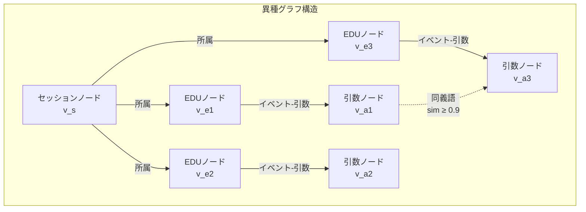

## 論文概要（Abstract）

本記事は [arXiv:2511.17208](https://arxiv.org/abs/2511.17208) の解説記事です。

LLMベースの会話エージェントは、複数セッションにわたるコヒーレントでパーソナライズされた対話の維持が困難である。固定コンテキストウィンドウが履歴保持を制約し、既存の外部記憶アプローチは粗い検索と細粒度だが断片化されたビューの間でトレードオフを抱えている。ZhouとHanは、会話履歴をneo-Davidsonianイベント意味論に基づく**エンリッチドEDU（Elementary Discourse Units）**として構造化し、異種グラフ上での連想的検索を実現するEMemを提案した。LoCoMoでJスコア0.780（gpt-4o-mini）、LongMemEval_Sで77.9%の精度を達成し、フルコンテキストの101kトークンに対して約1kトークンのコンテキストで同等以上の性能を示すと著者らは報告している。

この記事は [Zenn記事: Agents SDK Sessionsで再設計するThread管理：11種バックエンドとcompaction実装](https://zenn.dev/0h_n0/articles/0da98f837e992b) の深掘りです。

## 情報源

- **arXiv ID**: 2511.17208
- **URL**: [https://arxiv.org/abs/2511.17208](https://arxiv.org/abs/2511.17208)
- **著者**: Sizhe Zhou, Jiawei Han
- **所属**: University of Illinois Urbana-Champaign
- **発表年**: 2025
- **分野**: cs.CL

## 背景と動機（Background & Motivation）

OpenAI Agents SDKの`OpenAIResponsesCompactionSession`は、会話コンテキストを暗号化された要約に**非可逆的に圧縮**する。この圧縮は効率的だが、圧縮後に特定の過去発言を正確に引用することはできない。EMemは、圧縮（lossy compression）とは異なるアプローチ——**非圧縮的保存と高精度検索**——を採用している。

既存の記憶管理手法の課題は以下の3つに集約される。

1. **チャンクベースRAG**: 大きなテキストブロックを検索するため、関連情報と無関係情報が混在する
2. **要約ベース**: 重要な詳細が要約時に失われ、回復不能になる
3. **トリプレットベース**: 関係を3つ組に分解するが、文脈情報が失われ断片化する

EMemは、これらの中間に位置するEDU（Elementary Discourse Unit）を記憶の基本単位とし、情報を保持しつつコンパクトな表現を実現している。

## 主要な貢献（Key Contributions）

- **イベント中心記憶表現**: neo-Davidsonianイベント意味論に基づくEDU分解により、参加者・時間情報・最小限の文脈を保持した自己完結的な記述単位を構築
- **異種グラフ検索**: セッション・EDU・引数ノードの3種類ノードを持つ異種グラフ上でのPersonalized PageRank検索
- **非圧縮的アプローチ**: 情報を積極的に圧縮・忘却するのではなく、構造化してアクセスしやすくする設計思想

## 技術的詳細（Technical Details）

### EDU分解アルゴリズム

EMemは、各会話セッションをLLMベースの抽出器で**エンリッチドEDU**に分解する。各EDUは以下の3要素で構成される。

1. **テキスト内容**: 自己完結的な命題文
2. **ソースターンインデックス**: 元の発話位置
3. **タイムスタンプ**: セッションメタデータから推定

**話者タイプによる処理の分岐**:

- **ユーザー発話**: 汎用的な抽出手続きで細粒度のイベント文を生成
- **アシスタント発話**: デュアル抽出を適用——アトミックなEDUに加えて、リスト・比較・手順等の一貫した情報ブロックを特定する「構造化チャンク」を生成。各チャンクは、対応するユーザー要求・情報カテゴリ・キーエンティティをカバーする2-3文の要約を受ける

抽出器は、エンティティ言及の正規化（「母」→「Aliceの母」）と時間情報の推定（セッションメタデータから）を行い、ターン間で独立に理解可能なEDUを生成する。

### 異種グラフ構築

グラフ$G = (V, E)$は3種類のノードを持つ。



| ノードタイプ | 説明 | LongMemEval_S平均数 |
|-------------|------|-------------------|
| セッションノード$v_s$ | 各会話セッションに1つ | — |
| EDUノード$v_e$ | 抽出された談話単位 | 861.1/会話 |
| 引数ノード$v_a$ | イベントの役割-引数ペア | 2,780.9/会話 |

**エッジタイプ**:
- **セッション-EDUエッジ**: EDUがどのセッションに属するか
- **EDU-引数エッジ**: イベントと抽出された役割の接続
- **同義語エッジ**: コサイン類似度$\geq \delta$（$\delta = 0.9$）の引数ノード間を接続。近傍数の上限は100

### 検索バリアント

著者らは2つの検索バリアントを提案している。

**EMem-G（グラフベース）**:
1. 密検索で上位$K_e = 30$件のEDUをコサイン類似度で取得
2. クエリからLLMベースのメンション検出でエンティティ/名詞句を抽出
3. 各メンションに対して上位$K_a = 10$件の引数を密検索
4. EDU候補と引数候補の両方にリコール指向のLLMフィルタリング
5. 埋め込み類似度によるシード初期化
6. Personalized PageRank伝播（減衰因子$\alpha$）
7. 最終的に上位$K = 10$件のEDUを選択して質問応答

**EMem（軽量版）**:
グラフ伝播と引数検索を省略。密EDU検索後にリコール指向LLMフィルタでコンテキスト長を適応的に決定する。

### 実装詳細

```python
from dataclasses import dataclass

@dataclass
class EnrichedEDU:
    """エンリッチドEDU（論文Section 3準拠）"""
    text: str
    source_turn_indices: list[int]
    timestamp: str
    session_id: str
    embedding: list[float] | None = None

@dataclass
class ArgumentNode:
    """引数ノード（論文Section 3.2準拠）"""
    role: str
    value: str
    embedding: list[float]
    connected_edu_ids: list[str]

def build_synonym_edges(
    arguments: list[ArgumentNode],
    threshold: float = 0.9,
    max_neighbors: int = 100,
) -> list[tuple[int, int]]:
    """同義語エッジの構築（論文Section 3.2準拠）
    
    コサイン類似度が閾値以上の引数ノード間に
    エッジを張る。近傍数を上限で制限。
    """
    edges = []
    for i, arg_i in enumerate(arguments):
        neighbor_count = 0
        for j, arg_j in enumerate(arguments):
            if i >= j:
                continue
            sim = cosine_similarity(arg_i.embedding, arg_j.embedding)
            if sim >= threshold and neighbor_count < max_neighbors:
                edges.append((i, j))
                neighbor_count += 1
    return edges

def cosine_similarity(a: list[float], b: list[float]) -> float:
    """コサイン類似度の計算"""
    dot = sum(x * y for x, y in zip(a, b))
    norm_a = sum(x ** 2 for x in a) ** 0.5
    norm_b = sum(x ** 2 for x in b) ** 0.5
    return dot / (norm_a * norm_b) if norm_a * norm_b > 0 else 0.0
```

**主要ハイパーパラメータ（論文Appendixより）**:
- 埋め込みモデル: OpenAI text-embedding-3-small
- LLMバックボーン: gpt-4o-mini, gpt-4.1-mini
- 同義語閾値$\delta$: 0.9
- 初期EDU検索数$K_e$: 30
- 初期引数検索数$K_a$: 10
- 最終EDU選択数$K$: 10
- PPR減衰因子: HippoRAG 2デフォルト

## 実験結果（Results）

### LoCoMoベンチマーク（論文Table 1より）

gpt-4o-miniをバックボーンとした場合の結果を以下に示す。

| 手法 | Jスコア | F1 | BLEU-1 | コンテキスト |
|------|---------|------|--------|------------|
| Full Context | 0.723 | — | — | 23,653 tokens |
| RAG | 0.302 | — | — | — |
| Mem0 | 0.613 | — | — | — |
| Zep | 0.585 | — | — | — |
| LangMem | 0.513 | — | — | — |
| Nemori | 0.744 | — | — | 2,745 tokens |
| **EMem** | **0.780** | **0.483** | **0.393** | **738 tokens** |
| **EMem-G** | **0.780** | **0.487** | **0.397** | **988 tokens** |

著者らの報告によると、EMemとEMem-Gは同一のJスコア0.780を達成しつつ、コンテキストサイズはフルコンテキストの3%（738-988トークン vs 23,653トークン）である。

gpt-4.1-miniへの更新で、EMem-Gは0.853まで向上し、フルコンテキスト（0.806）を大幅に上回っている。

### LongMemEval_Sベンチマーク（論文Table 2より）

470件のマルチセッション対話（平均約105kトークン）での結果を以下に示す。

| 手法 | 平均精度 | コンテキスト |
|------|---------|------------|
| Full Context | 55.0% | 101K tokens |
| Nemori | 64.2% | 3.7-4.8K tokens |
| **EMem** | **76.0%** | **0.6-2.5K tokens** |
| **EMem-G** | **77.9%** | **1.0-3.6K tokens** |

著者らの結果によると、EMem-Gはフルコンテキスト処理を22.9ポイント上回り、コンテキストサイズは2.5%以下である。

**カテゴリ別精度（gpt-4o-mini、論文Table 2より）**:

| カテゴリ | EMem | EMem-G | Full Context |
|---------|------|--------|-------------|
| Temporal推論 | 69.8% | 74.8% | — |
| Multi-session | 78.0% | 73.6% | — |
| Knowledge-update | 87.5% | 94.4% | — |

Knowledge-updateカテゴリでEMem-Gが94.4%と突出しており、情報の更新追跡にグラフ構造が有効であることが示されている。

### アブレーション実験（論文Table 3より）

LoCoMo（gpt-4o-mini）での各コンポーネントの寄与を以下に示す。

| 除去コンポーネント | EMem-G Jスコア | EMem Jスコア |
|-------------------|---------------|-------------|
| Full | 0.780 | 0.780 |
| − EDUフィルタ | 0.733 (-6.0%) | 0.748 (-4.1%) |
| − クエリメンション検出 | 0.766 (-1.8%) | — |
| − グラフ/PPR | 0.780 (0%) | — |
| − QA Chain-of-Thought | <1pt impact | <1pt impact |

**重要な発見**: EDUフィルタの除去が最大の性能劣化を引き起こし（最大6%低下）、リコール指向のLLMフィルタリングがEMemの性能に最も寄与していることが確認されている。一方、グラフ/PPRの除去はLoCoMoではほぼ影響がないが、LongMemEval_SのMulti-sessionカテゴリでは11.6ポイントの低下が観測されている。

## 実運用への応用（Practical Applications）

EMemの設計思想は、Agents SDKのSession機構と以下のように関連する。

### compactionとの補完性

`OpenAIResponsesCompactionSession`は**非可逆的な要約圧縮**を行い、古い会話コンテキストを暗号化された要約で置き換える。これに対してEMemは**非圧縮的な構造化保存**を行い、元の情報を保持しつつ検索可能にする。

実務上のハイブリッドアプローチとして以下が考えられる。

1. **短期**: Agents SDKのSessionで直近の会話履歴を管理（`SessionSettings(limit=50)`）
2. **中期**: `OpenAIResponsesCompactionSession`でcompactionを適用
3. **長期**: EMemのEDU分解でセッション横断的な記憶をグラフとして構築

### コンテキスト効率

EMemの738トークン（LoCoMo）は、`session_input_callback`のスライディングウィンドウと比較して圧倒的に少ないコンテキストで同等以上の品質を実現しており、`previous_response_id`チェーンのコスト累積問題に対する効果的な解決策となる。

## 関連研究（Related Work）

- **Nemori**: 認知科学に基づくエピソード-意味二重記憶。LoCoMoで0.744、LongMemEval_Sで64.2%。EMemはいずれも上回る
- **Mem0**: 事実抽出ベースの記憶管理。LoCoMoで0.613。EMemのEDUアプローチが大幅に優位
- **RAG**: 4096トークンチャンクの密検索。LoCoMoで0.302と低性能。チャンク粒度がEDUに劣る

## まとめと今後の展望

EMemは、圧縮ではなく構造化という発想で長期会話記憶の課題に取り組み、101kトークンのフルコンテキストの3%で同等以上の性能を達成した。neo-Davidsonianイベント意味論に基づくEDU分解は、Agents SDKの`session_input_callback`における履歴フィルタリングの高度な代替手段となりうる。今後は、リアルタイムのEDU抽出パイプラインの効率化と、`EncryptedSession`との統合によるプライバシー保護が課題となる。

## 参考文献

- **arXiv**: [https://arxiv.org/abs/2511.17208](https://arxiv.org/abs/2511.17208)
- **Code**: [https://github.com/KevinSRR/EMem](https://github.com/KevinSRR/EMem)
- **Related Zenn article**: [https://zenn.dev/0h_n0/articles/0da98f837e992b](https://zenn.dev/0h_n0/articles/0da98f837e992b)
