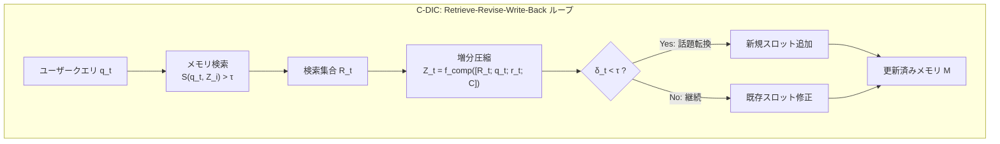

## 論文概要（Abstract）

本記事は [arXiv:2606.12411](https://arxiv.org/abs/2606.12411) の解説記事です。

現代の対話エージェントは、ターンが進むごとに増大する会話履歴を毎回エンコードしなければならず、推論コストとレイテンシが線形に悪化する。従来の単発圧縮手法（truncation、summarization、ICAEなど）はマルチターン環境下で情報損失が累積し、パープレキシティが急激に悪化する問題がある。Jungらは、会話を**文脈的スレッド**として扱い、スレッドごとに修正可能な圧縮状態を保持するContext-Driven Incremental Compression（C-DIC）フレームワークを提案した。ICML 2026に採択された本論文は、428ターンの長時間対話でも安定した推論性能を維持できることを実証している。

この記事は [Zenn記事: Agents SDK Sessionsで再設計するThread管理：11種バックエンドとcompaction実装](https://zenn.dev/0h_n0/articles/0da98f837e992b) の深掘りです。

## 情報源

- **arXiv ID**: 2606.12411
- **URL**: [https://arxiv.org/abs/2606.12411](https://arxiv.org/abs/2606.12411)
- **著者**: Yeongseo Jung, Jaehyeok Kim, Eunseo Jung, Jiachuan Wang, Yongqi Zhang, Ka Chun Cheung, Simon See, Lei Chen
- **発表年**: 2026（ICML 2026採択）
- **分野**: cs.CL, cs.LG

## 背景と動機（Background & Motivation）

OpenAI Agents SDKの`OpenAIResponsesCompactionSession`に代表されるように、長時間会話のコンテキスト管理は実用上の重要課題である。`previous_response_id`チェーンでは、$n$ターンの会話で累積入力トークンが$O(n^2)$で増大し、コストとレイテンシの両面で問題となる。

既存のコンテキスト圧縮アプローチには、トランケーション（単純切り捨て）、LLMによるサマリゼーション、ICAE（In-Context Autoencoder）などがあるが、いずれもマルチターン環境で深刻な限界を抱えている。著者らの分析によると、MSCデータセットにおけるICAEの単発圧縮をマルチターンで繰り返し適用した場合、パープレキシティが27.656から513.774へと約18.6倍に悪化する。これは、単発圧縮器が過去の圧縮状態を参照できず、ターンを重ねるごとに情報損失が累積するためである。

## 主要な貢献（Key Contributions）

- **C-DICフレームワーク**: 会話を文脈的スレッド（interleaved contextual threads）として扱い、スレッドごとに修正可能な潜在圧縮状態を保持するメモリアーキテクチャ
- **Retrieve-Revise-Write-Back ループ**: 各ターンで関連メモリを検索→応答生成→圧縮→メモリ更新を行う軽量ループにより、クロスターン情報共有を実現
- **Retrieval-Aware Truncated BPTT**: メモリ更新パスに沿った1ホップ勾配切断により、フルヒストリの勾配計算なしでマルチターン学習を可能にする訓練手法
- **長距離安定性の実証**: 428ターンの閉ループ評価でパープレキシティの劣化が0.3%未満

## 技術的詳細（Technical Details）

### メモリ構造とスレッド管理

C-DICのダイアログメモリ$\mathcal{M}$は、各スレッドの圧縮状態を潜在ベクトルとして保持するスロットで構成される。

$$
\mathbf{Z}_i \in \mathbb{R}^{n \times d}
$$

ここで$n$は圧縮トークン数（実験では128）、$d$は隠れ次元である。

### ベース圧縮（ターン単位）

各ターン$t$での圧縮は、ユーザークエリ$q_t$、応答$r_t$、学習可能な圧縮トークン$\mathbf{C}$を入力として行われる。

$$
\mathbf{Z}_t = f_{\text{comp}}([\text{Emb}(q_t); \text{Emb}(r_t); \mathbf{C}]; \theta)
$$

ここで$f_{\text{comp}}$は圧縮器（ICAE checkpointで初期化されたLoRA適応モデル）、$\theta$は学習パラメータである。

### 検索スコアリングと増分圧縮

セマンティックマッチングと時間減衰を組み合わせた検索スコアで、関連するメモリスロットを取得する。

$$
S(q_t, \mathbf{Z}_i) = \frac{\langle \psi(f_{\text{comp}}(q_t, \mathbf{C})), \psi(\mathbf{Z}_i) \rangle}{\|\psi(f_{\text{comp}}(q_t, \mathbf{C}))\| \cdot \|\psi(\mathbf{Z}_i)\|} \cdot e^{-\alpha \cdot \Delta t_i}
$$

ここで$\psi(\cdot)$はプーリング関数、$\Delta t_i$は最後の検索からの経過ターン数、$\alpha = 0.05$は減衰率である。検索閾値$\tau = 0.8$を超えるスロットが検索集合$\mathcal{R}_t$を構成する。

増分圧縮では、検索されたメモリ状態を条件として新しい圧縮を生成する。

$$
\mathbf{Z}_t = f_{\text{comp}}([\mathcal{R}_t; \text{Emb}(q_t); \text{Emb}(r_t); \mathbf{C}]; \theta)
$$

### メモリ更新ルール

勾配計算を必要としない決定論的ポリシーでメモリを更新する。

$$
\mathcal{M}_{<t+1} = \begin{cases} \mathcal{M}_{<t} \cup \{\mathbf{Z}_t\} & \text{if } \delta_t < \tau \quad \text{（話題転換: 新規挿入）} \\ (\mathcal{M}_{<t} \setminus \{\mathbf{Z}_{j_t}\}) \cup \{\mathbf{Z}_t\} & \text{otherwise} \quad \text{（継続: 修正）} \end{cases}
$$

ここで$\delta_t = \max_i S(q_t, \mathbf{Z}_i)$、$j_t = \arg\max_i S(q_t, \mathbf{Z}_i)$である。



### Retrieval-Aware Truncated BPTT

マルチターン学習における勾配計算の効率化のため、著者らはメモリ更新パスに沿った1ホップ勾配切断を導入している。

$$
\mathcal{L} = \frac{1}{T} \sum_{t=1}^{T} \ell_t, \quad \ell_t = -\log P_\phi(r_t \mid q_t, \mathcal{R}_t)
$$

勾配の伝播ルールは以下のとおりである。

$$
\frac{\partial \ell_t}{\partial \mathbf{Z}_{j_t}} \neq 0 \iff \delta_t \geq \tau
$$

話題転換ターン（$\delta_t < \tau$）では、最も類似するスロットの勾配をstop-gradientで切断する。これにより、無関係なメモリへの勾配流入を防ぎつつ、関連メモリには学習信号を伝播できる。

### 実装詳細

著者らの論文によると、実装は以下の構成で行われている。

- **ベースモデル**: Llama2-Chat-7B（凍結）
- **圧縮器**: ICAE checkpointから初期化、LoRA適応
- **圧縮トークン長**: 128
- **訓練データ**: MSCデータセット、2エポック
- **オプティマイザ**: AdamW、学習率$2 \times 10^{-4}$
- **ハードウェア**: NVIDIA A100 80GB（約17 GPU時間）

```python
from dataclasses import dataclass
import torch

@dataclass
class CDICConfig:
    """C-DIC設定パラメータ（論文Table 5より）"""
    compression_tokens: int = 128
    retrieval_threshold: float = 0.8
    decay_rate: float = 0.05
    hidden_dim: int = 4096
    learning_rate: float = 2e-4
    epochs: int = 2

def retrieval_score(
    query_embedding: torch.Tensor,
    memory_embedding: torch.Tensor,
    turns_since_retrieval: int,
    alpha: float = 0.05,
) -> float:
    """検索スコア計算（論文Equation 2準拠）"""
    cosine_sim = torch.nn.functional.cosine_similarity(
        query_embedding.unsqueeze(0),
        memory_embedding.unsqueeze(0),
    ).item()
    recency_decay = torch.exp(
        torch.tensor(-alpha * turns_since_retrieval)
    ).item()
    return cosine_sim * recency_decay
```

## 実験結果（Results）

### メインベンチマーク（論文Table 1より）

MSCデータセットでの各手法のパープレキシティ比較を以下に示す。

| 手法 | PPL ↓ | BLEU ↑ | ROUGE-L ↑ |
|------|-------|--------|-----------|
| Full prompting | 41.245 | 0.008 | 0.110 |
| Truncation | 30.890 | 0.012 | 0.128 |
| Summarization | 41.849 | 0.013 | 0.128 |
| ICAE（one-shot） | 27.656 | 0.017 | 0.133 |
| ICAE（incremental） | 513.774 | — | — |
| RAG@20 | 31.179 | — | — |
| **C-DIC** | **8.431** | **0.023** | **0.160** |

著者らが報告した結果によると、C-DICはICAE one-shotと比較してパープレキシティを69.5%削減し、Full promptingと比較して79.6%削減している。ICAEを単純にマルチターンで繰り返し適用した場合（incremental）のPPL 513.774は、単発圧縮器のマルチターン環境での脆弱性を示している。

### レイテンシ分析（論文Figure 4-5より）

著者らの測定によると、推論時間の比較は以下のとおりである。

- **C-DIC**: 約3.0-3.5秒で安定（10-428ターン）
- **Full prompting**: 30ターンで約7.7秒（C-DICの2.4倍）、30ターン超でOOM
- **ICAE**: 20ターンでOOM

C-DICが428ターンをハードウェア制約内で処理できた唯一の手法であると著者らは報告している。

### 長距離診断（論文Table 3、MSC-QAより）

10ターン以上前のコンテキストに関する質問応答精度を以下に示す。

| 手法 | Accuracy ↑ | PPL ↓ |
|------|-----------|-------|
| Full Prompting | 0.042 | 30.560 |
| ICAE（one-shot） | 0.004 | 38.268 |
| **C-DIC** | **0.104** | **5.950** |

C-DICはFull Promptingと比較して2.6倍高い精度を達成しており、スレッドベースのメモリ管理が長距離依存性の保持に有効であることが示されている。

### アブレーション実験（論文Table 4より）

| 除去コンポーネント | PPL ↓ | ROUGE-2 ↑ |
|-------------------|-------|-----------|
| Full C-DIC | 9.356 | 0.056 |
| − 増分圧縮 | 25.527 | 0.018 |
| − ra-TBPTT | 12.295 | 0.018 |
| − メモリスレッディング | 9.197 | 0.025 |

増分圧縮の除去がパープレキシティを2.7倍悪化させ、ROUGE-2を70%低下させることから、ターン間での圧縮状態の修正がC-DICの性能に最も寄与していることが確認されている。

## 実運用への応用（Practical Applications）

C-DICの設計思想は、OpenAI Agents SDKの`OpenAIResponsesCompactionSession`と直接的に関連する。Agents SDKのcompaction機構は`compact_threshold`を超えた時点で暗号化された要約を生成するが、C-DICはこれをさらに発展させ、**スレッド単位での選択的圧縮・修正**を実現している。

実務での応用として以下が考えられる。

- **カスタマーサポートBot**: 複数の問い合わせトピック（注文確認、返品、技術サポート等）が混在する長時間会話で、スレッドごとにコンテキストを管理
- **コーディングアシスタント**: ファイル別・タスク別にコンテキストスレッドを分離し、関連するスレッドのみを検索して応答生成
- **コスト最適化**: 128トークンの圧縮状態で会話履歴全体を表現することで、`previous_response_id`チェーンの$O(n^2)$コスト累積を回避

ただし、C-DICはLlama2-Chat-7Bをベースとしており、商用APIでの直接適用には追加の工夫が必要である。Agents SDKのcompaction機構は商用モデルに対応したブラックボックスアプローチであり、C-DICの潜在表現ベースのアプローチとは補完的な関係にある。

## 関連研究（Related Work）

- **ICAE（In-Context Autoencoder）**: Ge et al. (2024)による文脈圧縮手法。C-DICはICAEのcheckpointを初期化に利用しつつ、マルチターンへの拡張を実現
- **AutoCompressor**: Chevalier et al.によるリカレント圧縮手法。MSCでPPL 9.285を達成するが、C-DICの8.431には及ばない
- **InfLLM**: 超長文脈処理のためのKVキャッシュ管理手法。MSC-QAではPPL 8.963だが、精度ではC-DICに劣る

## まとめと今後の展望

C-DICは、マルチターン対話におけるコンテキスト圧縮の根本的な課題——単発圧縮器の脆弱性——に対して、スレッドベースの増分圧縮と修正可能メモリという解決策を提示した。428ターンの長時間対話で安定動作する実証結果は、Agents SDKのSession機構が目指す長時間会話管理の学術的裏付けとなる。今後は、商用LLM APIとの統合や、EncryptedSessionのようなプライバシー保護機構との組み合わせが課題となる。

## 参考文献

- **arXiv**: [https://arxiv.org/abs/2606.12411](https://arxiv.org/abs/2606.12411)
- **Related Zenn article**: [https://zenn.dev/0h_n0/articles/0da98f837e992b](https://zenn.dev/0h_n0/articles/0da98f837e992b)
