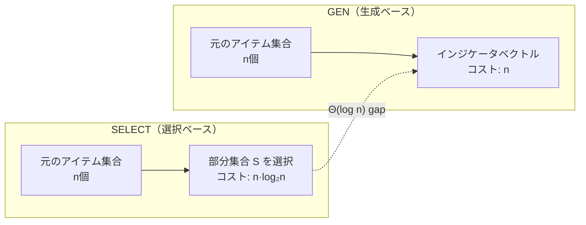

## 論文概要（Abstract）

本記事は [arXiv:2608.01326](https://arxiv.org/abs/2608.01326) の解説記事です。

LLMのコンテキストウィンドウには上限があり、AIエージェントは蓄積した状態をこの制約内に収めるためにコンテキスト圧縮（context compaction）を行う必要がある。しかし、この処理に対する形式的な理論分析はほとんど存在しなかった。Tirmaziらは、コンテキスト圧縮アルゴリズムを2つのゲーム理論モデル——Context Selection GameとContext Generation Game——で定式化し、Generation Gameが一方向通信複雑性と等価であることを証明した。さらに、選択ベースと生成ベースのアプローチの間に$\Theta(\log n)$の指数的ギャップが存在するケースがあることを示した。Anthropicのcompactionエンドポイントに対する実証実験も含まれている。

この記事は [Zenn記事: Agents SDK Sessionsで再設計するThread管理：11種バックエンドとcompaction実装](https://zenn.dev/0h_n0/articles/0da98f837e992b) の深掘りです。

## 情報源

- **arXiv ID**: 2608.01326
- **URL**: [https://arxiv.org/abs/2608.01326](https://arxiv.org/abs/2608.01326)
- **著者**: Hayder Tirmazi, Sam Markelon, Allison Bishop, Michael Mitzenmacher
- **所属**: AllSpice Inc., Boston University, Harvard University
- **発表年**: 2026
- **分野**: cs.DS（データ構造とアルゴリズム）, cs.AI

## 背景と動機（Background & Motivation）

OpenAI Agents SDKの`OpenAIResponsesCompactionSession`や`session_input_callback`は、実用的なコンテキスト圧縮手段を提供しているが、「最小限どれだけの予算があれば所望の精度を達成できるのか」という理論的な問いには答えていない。実務上、`compact_threshold`をどの値に設定すべきか、スライディングウィンドウの窓幅をいくつにすべきかは、経験的なチューニングに委ねられている。

本論文は、この問題に対して初めて形式的な理論枠組みを提供する。通信複雑性理論の既知の結果を活用することで、任意のクエリセットに対するコンテキスト圧縮の理論的下界を計算可能にしている。

## 主要な貢献（Key Contributions）

- **Context Selection Gameの定式化**: コンテキストの部分集合を選択するアルゴリズム（トランケーション、スライディングウィンドウ等）をゲーム理論的に形式化
- **Context Generation Gameの定式化**: LLMによるサマリゼーション等、新しいトークンを生成するアルゴリズムの形式化
- **通信複雑性との等価性証明**: Generation Gameの最小予算が一方向通信複雑性と等しいことを証明（Theorem 1）
- **選択 vs 生成のギャップ証明**: 特定のクエリセットで選択ベースが生成ベースの$\Theta(\log n)$倍の予算を必要とすることを証明（Theorem 3）
- **Anthropicのcompactionエンドポイントの実証評価**: 集合所属クエリに対する実際のcompaction精度を測定

## 技術的詳細（Technical Details）

### Context Selection Game

アイテム集合$\mathcal{X} = \{x_1, \ldots, x_n\}$があり、各アイテム$x_i$にはサイズ$s(x_i) > 0$が定義されている。

**プレイヤーと行動**:
- **Selector（圧縮アルゴリズム）**: $\mathcal{X}$を観察し、予算制約$\sum_{x_i \in S} s(x_i) \leq B$を満たす部分集合$S \subseteq \mathcal{X}$を選択
- **Adversary（敵対者）**: クエリ$q \in \mathcal{Q}$を発行

**スコアリング**: 各クエリ$q$に対する価値関数$v_q: 2^{\mathcal{X}} \to [0,1]$が定義され、エラーは以下で測定される。

$$
\text{err}(S, q) := 1 - v_q(S)
$$

**クエリレジーム**: 著者らは2つのレジームを区別している。
1. **確率的レジーム**: アイテムとクエリが既知の分布$\mu$から生成。期待エラーを評価
2. **忘却的敵対者**: 敵対者がSelectorの選択を知らずにクエリを決定。最悪ケースエラーを評価

### Context Generation Game

Generation Gameは、Selection Gameの制約を以下の3つの能力で拡張する。

1. **新しいトークンの生成**: 元のアイテムにない要約文を出力可能
2. **アイテムの並べ替え**: 順序により情報を伝達可能
3. **効率的なエンコーディング**: 加法的サイズ以下で部分集合を符号化可能

**形式的定義**:
- **Condenser（凝縮器）**: $\mathcal{X}$をメッセージ$m \in \Sigma^{\leq B}$に変換
- **Interpreter（解釈器）**: メッセージ$m$とクエリ$q$から回答を生成

$$
\text{Condenser}: \mathcal{X} \to \Sigma^{\leq B}, \quad \text{Interpreter}: \Sigma^{\leq B} \times \mathcal{Q} \to \text{Out}
$$

著者らは、$\mathsf{SELECT} \subset \mathsf{GEN}$（選択は生成の特殊ケース）であることを示している。LLMベースのサマリゼーションは$\mathsf{GEN}$に属するが、必ずしも$\mathsf{SELECT}$には属さない。

### Theorem 1: 通信複雑性との等価性

**定理（著者らの主張）**: Context Generation Game $\mathcal{G}$が誘導する通信問題$\Pi_\mathcal{G}$に対して、

$$
B_{\min}^{\mathsf{GEN}}(\epsilon) = R_\epsilon^{\to}(\Pi_\mathcal{G})
$$

ここで$R_\epsilon^{\to}$は一方向ランダム化通信複雑性である。

**証明の直観**: $\mathsf{GEN}$アルゴリズムの(Condenser, Interpreter)ペアと、一方向通信プロトコルの(Alice, Bob)ペアは構造的に同一である。AliceがCondenserを$\mathcal{X}$に対して実行し、BobがInterpreterをメッセージとクエリに対して実行する。ランダム化プロトコルでは共有公開コイン$\rho$を使用し、$\rho$を固定すると決定論的ペアとなり、$\rho$に対する平均化がエラーの等価性を保証する。

**実用的意味**: この等価性により、通信複雑性の既知の下界が直接コンテキスト圧縮の下界に転換される。

### Theorem 3: 選択 vs 生成の指数的分離

**定理（著者らの主張）**: $n = 2^k$個のアイテムを持つ集合で、集合全体の表現を求めるクエリに対して、

$$
B_{\min}^{\mathsf{SELECT}} \geq n \cdot \log_2 n, \quad B_{\min}^{\mathsf{GEN}} = n
$$

すなわち、$\Theta(\log n)$のギャップが存在する。

**証明のスケッチ**:
- **生成の上界**: $n$ビットのインジケータベクトルで$\mathcal{X}$を完全に表現可能（エラーゼロ）
- **選択の下界**: 写像$\mathcal{X} \mapsto S(\mathcal{X})$が単射であり、$S(\mathcal{X}) \subseteq \mathcal{X}$が必要。すべての$\mathcal{X}$をカバーするには、$S(\mathcal{X}^*) = Y$（全集合）となる$\mathcal{X}^*$が存在しなければならず、そのコストは$n \cdot \log_2 n$

この結果は、Agents SDKの`session_input_callback`（選択ベース: ロール別フィルタリング等）と、`OpenAIResponsesCompactionSession`のcompaction（生成ベース: LLMによるサマリゼーション）の間に、理論的な効率差が存在する可能性を示唆している。

### ケーススタディ: Anthropicのcompactionエンドポイント

著者らは、Anthropicのコンテキスト圧縮エンドポイントに対して、集合所属クエリ（「アイテム$x$は記録された集合に含まれるか？」）で評価を行っている。

**実験設定**:
- 15,000個のアイテムをコンテキストに記録
- 圧縮後のサイズをBloomフィルタのベースラインと同一に設定
- Bloomフィルタは集合所属クエリに対して近最適であり、情報理論的下界$N \cdot \log_2(1/\epsilon)$の約1.44倍

**結果**: 著者らの報告によると、Anthropicのエンドポイントはこのタスクで「ランダム推測に近いエラー率」を示し、同一サイズのBloomフィルタを大幅に下回った。

**解釈**: この結果は、現在のLLMベースのサマリゼーションが理論的最適からかけ離れていることを示している。ただし、集合所属クエリはサマリゼーションの最も不得意なタスクの一つであり、「要旨の保持」や「会話の流れの維持」といった、より自然なクエリでは異なる結果が期待される。

### 集合非交差問題の困難性

著者らは、実用的に重要な問題として集合非交差問題を分析している。依存関係集合$S$と脆弱性パッケージ集合$T$に対して「$S \cap T = \emptyset$か？」というクエリの場合、

$$
B_{\min} = \Omega(N \cdot m)
$$

ここで$m$はアイテムのビット長。Bloomフィルタによる近似でも$\Omega(N \cdot \log_2(|T|/\delta))$が必要であり、$|T|$が大きい場合は実質的に非圧縮と同等のコストが必要となる。

## 実運用への応用（Practical Applications）

### Agents SDK Sessionsへの示唆

本論文の結果は、Agents SDKのSession設計に以下の理論的裏付けを与える。

1. **compaction方式の選択根拠**: Theorem 3は、生成ベースのcompaction（`OpenAIResponsesCompactionSession`）が選択ベース（`session_input_callback`でのフィルタリング）より理論的に効率的な場合があることを示す
2. **compact_thresholdの下界**: 特定のクエリセットに対して、通信複雑性の既知の結果からcompaction予算の理論的下界を計算できる
3. **ハイブリッドアプローチの正当性**: 実用上は選択と生成の組み合わせ（まず`SessionSettings(limit=50)`で取得件数を制限し、次にcompactionで要約）が合理的

### 制約の認識

Anthropicのケーススタディが示すように、現在のLLMベースcompactionは特定のクエリタイプ（正確な事実の保持）で理論的最適から大きく乖離している。`EncryptedSession`のTTLと組み合わせて、重要な事実データは明示的に保持し、会話の文脈のみをcompactionの対象とする設計が推奨される。

## 関連研究（Related Work）

- **一方向通信複雑性**: Yao (1979)による古典的な通信複雑性理論。本論文はこれをコンテキスト圧縮に応用した初の研究
- **Bloomフィルタ**: Burton H. Bloom (1970)による確率的データ構造。集合所属クエリに対して情報理論的に近最適な性能を実現
- **Self-Compacting Language Model Agents** (2606.23525): エージェント自身がコンテキストを自己圧縮する実用的アプローチ。本論文とは理論 vs 実装で補完的

## まとめと今後の展望

Context Compaction Theoryは、LLMのコンテキスト圧縮に対する初の形式的理論枠組みを確立した。Generation Gameと一方向通信複雑性の等価性により、圧縮予算の理論的下界の計算が可能になり、選択ベースと生成ベースの間の$\Theta(\log n)$ギャップは実装方式の選択に理論的根拠を与える。Anthropicのcompactionエンドポイントの評価結果は、実用的なcompaction実装にはまだ理論的最適との乖離があることを示しており、Agents SDKのSession設計における今後の改善余地を示唆している。

著者らは、適応的敵対者（compressor出力を観察してからクエリを決定）や繰り返しcompaction（カスケードサマリゼーション）の理論分析を今後の課題として挙げている。

## 参考文献

- **arXiv**: [https://arxiv.org/abs/2608.01326](https://arxiv.org/abs/2608.01326)
- **Related Zenn article**: [https://zenn.dev/0h_n0/articles/0da98f837e992b](https://zenn.dev/0h_n0/articles/0da98f837e992b)
