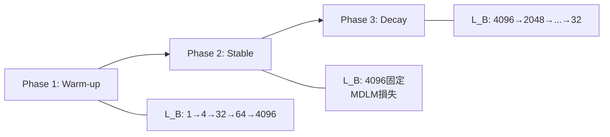

## 論文概要（Abstract）

LLaDA2.0は、事前学習済みの自己回帰（AR）モデルを離散拡散言語モデル（dLLM）に変換する手法を提案した論文である。フルスクラッチの訓練を回避し、知識継承・段階的適応・効率重視の設計原則に基づき、3-phase block-level WSD訓練スキーム（warm-up, stable, decay）によってAR→dLLM変換を実現している。SFTとDPOによるpost-training alignmentを経て、LLaDA2.0-mini（16B, MoE, 1.4Bアクティブパラメータ）とLLaDA2.0-flash（100B）の2つのinstruction-tunedモデルが開発された。LLaDA2.0-flash-CAPは535 tokens/sの推論速度を達成し、ARベースラインに対して2.1倍の高速化を実現したと報告されている。両モデルはApache 2.0ライセンスでオープンソース公開されている。

本記事は [https://arxiv.org/abs/2512.15745](https://arxiv.org/abs/2512.15745) の解説記事です。

この記事は [Zenn記事: LLaDA 2.0×SGLang×FAISSで社内FAQ自動応答APIを構築し並列デコードで推論を高速化する](https://zenn.dev/0h_n0/articles/808efe0a1d8661) の深掘りです。

## 情報源

- **arXiv ID**: 2512.15745
- **URL**: [https://arxiv.org/abs/2512.15745](https://arxiv.org/abs/2512.15745)
- **著者**: Tiwei Bie, Maosong Cao, Kun Chen, Lun Du, et al.（InclusionAI, Ant Group）
- **発表年**: 2025年
- **分野**: cs.LG（Machine Learning）, cs.AI（Artificial Intelligence）, cs.CL（Computation and Language）

## 背景と動機（Background & Motivation）

大規模言語モデル（LLM）の主流アーキテクチャは、GPTシリーズに代表される自己回帰（AR）モデルである。ARモデルはトークンを左から右へ逐次生成するため、推論時のレイテンシがシーケンス長に比例して増大する。この逐次生成の制約は、リアルタイムアプリケーションや大規模バッチ処理において深刻なボトルネックとなる。

一方、離散拡散言語モデル（dLLM）は、マスクされたトークンを並列にデコードできるため、推論効率の面で大きな利点を持つ。しかし、dLLMをフルスクラッチで訓練するには膨大な計算コストが必要であり、またARモデルに蓄積された知識を活用できないという問題があった。

LLaDA2.0は、この課題に対して「ARモデルからdLLMへの変換」というアプローチを取る。事前学習済みARモデルの知識を継承しつつ、段階的な適応により拡散ベースのデコード能力を獲得させることで、計算コストを大幅に削減しながら高品質なdLLMを実現することを目指している。この変換アプローチにより、ARモデルのエコシステムで蓄積された事前学習済み重みを再利用でき、dLLMの実用化を加速する道を開いたと著者らは主張している。

## 主要な貢献（Key Contributions）

- **AR→dLLM変換手法**: 事前学習済みARモデルからdLLMへの変換フレームワークを確立。知識継承（knowledge inheritance）と段階的適応（progressive adaptation）により、フルスクラッチ訓練を回避
- **3-phase block-level WSD訓練スキーム**: ブロックサイズを段階的に増減させる3フェーズ訓練により、局所的なマスク予測能力からグローバルな文脈理解へと段階的に拡張
- **MoE構造の採用**: Mixture-of-Experts（MoE）アーキテクチャにより、推論時のアクティブパラメータ数を抑えつつ、モデル全体の知識容量を確保
- **Confidence Prediction Loss**: SFT段階でconfidence prediction lossを導入し、並列デコード時の品質を強化
- **2モデルのオープンソース公開**: LLaDA2.0-mini（16B）とLLaDA2.0-flash（100B）をApache 2.0ライセンスで完全公開

## 技術的詳細（Technical Details）

### マスク拡散の数学的定式化

LLaDA2.0の基盤となるマスク拡散言語モデル（MDLM）は、連続拡散モデルのアイデアを離散トークン空間に適用したものである。

**Forward process（前方過程）**: 入力トークン列 $\bm{x}_0 = (x_0^1, x_0^2, \ldots, x_0^L)$ に対し、時刻 $t \in [0, 1]$ でマスク確率 $1 - \alpha_t$ に従って各トークンを独立にマスクする。$\alpha_t$ は $\alpha_0 = 1$（マスクなし）から $\alpha_1 = 0$（全マスク）へ単調減少するスケジュール関数である。マスクされた系列 $\bm{x}_t$ の各トークンは、確率 $\alpha_t$ で元のトークン、確率 $1 - \alpha_t$ で [MASK] トークンとなる。

**Reverse process（逆過程）**: モデル $p_\theta$ は、マスクされた系列 $\bm{x}_t$ から元のトークン $\bm{x}_0$ を予測する。MDLMの訓練損失は以下で定義される。

$$
\mathcal{L}_{\text{MDLM}}(\theta) = -\mathbb{E}_{t, \bm{x}_0, \bm{x}_t} \left[ \frac{\alpha_t'}{1 - \alpha_t} \sum_{i=1}^{L} \mathbb{1}[x_t^i = [\text{MASK}]] \log p_\theta(x_0^i \mid \bm{x}_t) \right]
$$

ここで、
- $L$: シーケンス長
- $\alpha_t' = d\alpha_t / dt$: マスクスケジュールの時間微分
- $\mathbb{1}[x_t^i = [\text{MASK}]]$: 位置 $i$ がマスクされている場合に1となる指示関数
- $p_\theta(x_0^i \mid \bm{x}_t)$: モデルが位置 $i$ の元トークンを予測する確率

重み係数 $\alpha_t' / (1 - \alpha_t)$ は拡散過程の時間スケーリングに由来し、異なる時刻 $t$ での損失寄与を適切にバランスさせる役割を持つ。

### 3-Phase Block-Level WSD訓練スキーム

AR→dLLM変換の核心となるのが、3フェーズのblock-level WSD（Warm-up, Stable, Decay）訓練スキームである。

**Phase 1: Warm-up（ウォームアップ）**

ブロック拡散言語モデル（BDLM）の損失関数を用い、ブロックサイズ $L_B$ を段階的に増大させる。

$$
\mathcal{L}_{\text{BDLM}}(\theta) = -\mathbb{E}_{t, \bm{x}_0, \bm{x}_t} \left[ \frac{\alpha_t'}{1 - \alpha_t} \sum_{k=1}^{K} \sum_{i=1}^{L_B} \mathbb{1}[x_{t,k}^i = [\text{MASK}]] \log p_\theta(x_{0,k}^i \mid \bm{x}_{0,<k}, \bm{x}_{t,k}) \right]
$$

ここで、
- $K$: ブロック数（$K = L / L_B$）
- $L_B$: 各ブロックのトークン数
- $\bm{x}_{0,<k}$: $k$ 番目のブロックより前の全てのアンマスクトークン（コンテキスト）
- $\bm{x}_{t,k}$: $k$ 番目のブロック内のマスクされたトークン

Phase 1ではブロックサイズを $L_B = 1 \to 4 \to 32 \to 64 \to 4096$ と段階的に増大させる。$L_B = 1$ の場合は実質的にAR的な動作（1トークンずつ予測）となるため、ARモデルからの滑らかな遷移が可能である。ブロックサイズの増大に伴い、モデルは徐々に複数トークンの同時予測能力を獲得する。

**Phase 2: Stable（安定訓練）**

ブロックサイズを $L_B = 4096$（全シーケンス長）に固定し、MDLM損失で大規模データを効率的に学習する。この段階では補完的マスキング（complementary masking）を採用し、データ利用効率を100%近くまで向上させていると報告されている。ドキュメントレベルのアテンションマスクを用いることで、複数ドキュメントにまたがるコンテキスト理解を促進する。

**Phase 3: Decay（減衰）**

ブロックサイズを $4096 \to 2048 \to \ldots \to 32$ と段階的に縮小する。著者らによれば、Phase 2で獲得したグローバルな文脈知識を、コンパクトなブロック単位の構造に蒸留する効果があるとされている。これにより、推論時に小さなブロックサイズでも高品質なテキスト生成が可能となる。



### AR→dLLM変換の詳細

変換の出発点はLing-mini-2.0およびLing-flash-2.0というARベースモデルである。ARモデルの因果的（causal）アテンションマスクを双方向（bidirectional）アテンションマスクに変更し、マスクトークンの予測能力を段階的に獲得させる。

変換時の重要な技術的課題として、マスクトークンの埋め込み表現の初期化がある。著者らは、マスクトークンの埋め込みをゼロで初期化することで、対応する重みが訓練の初期段階で徐々に減衰する問題が生じることを報告している。この問題に対処するため、初期反復時にマスクトークンの埋め込み層出力に独立なガウスノイズを付加する手法を採用している。

### MoE構造の詳細

LLaDA2.0はMixture-of-Experts（MoE）アーキテクチャを採用している。LLaDA2.0-miniは総パラメータ数16Bに対してアクティブパラメータ数が1.4Bであり、各推論ステップで一部のエキスパートのみが活性化される。これにより、モデル全体の知識容量を維持しつつ、推論時の計算コストを大幅に削減している。

MoEの利点はdLLMと特に相性が良い。ARモデルでは各ステップで1トークンのみを生成するが、dLLMでは複数トークンを同時に生成するため、異なるトークン位置で異なるエキスパートが活性化され、MoEのスパース活性化パターンがより効果的に活用される。

### Confidence Prediction Loss

SFT段階において、標準的なSFT損失にconfidence prediction loss $\mathcal{L}_{\text{conf}}$ を追加する。

$$
\mathcal{L}(\theta) = \mathcal{L}_{\text{SFT}}(\theta) + \lambda \mathcal{L}_{\text{conf}}(\theta)
$$

ここで、
- $\mathcal{L}_{\text{SFT}}(\theta)$: 標準的なSFT損失（BDLMベース）
- $\lambda$: バランスハイパーパラメータ
- $\mathcal{L}_{\text{conf}}(\theta)$: confidence prediction loss

$\mathcal{L}_{\text{conf}}$ はモデルの出力分布のエントロピーを最小化するが、正しく予測されたトークンのサブセットに対してのみ適用される。これにより、モデルは自信を持って予測できるトークンについてはより確信度の高い出力を生成するようになり、並列デコード時の品質が向上する。

SFT損失は以下の形式で定義されている。

$$
\mathcal{L}_{\text{SFT}}(\theta) = -\mathbb{E}_{t, (\bm{c}, \bm{x}_0), \bm{x}_t} \left[ \frac{\alpha_t'}{1 - \alpha_t} \sum_{k=1}^{K} \sum_{i=1}^{L_B} \mathbb{1}[x_{t,k}^i = [\text{MASK}]] \log p_\theta(x_{0,k}^i \mid \bm{c}, \bm{x}_{0,<k}, \bm{x}_{t,k}) \right]
$$

ここで $\bm{c}$ はinstruction（条件入力）を表し、応答部分 $\bm{x}_0$ のみにマスクと予測損失が適用される。

### DPOによるアライメント

DPO（Direct Preference Optimization）損失は以下の通りである。

$$
\mathcal{L}_{\text{DPO}}(\theta) = -\mathbb{E}_{(\bm{c}, \bm{x}_w, \bm{x}_l) \sim \mathcal{D}} \left[ \log \sigma \left( \beta \left[ \Delta B(\bm{x}_w \mid \bm{c}) - \Delta B(\bm{x}_l \mid \bm{c}) \right] \right) \right]
$$

ここで、
- $\bm{x}_w$: 好ましい応答（chosen）
- $\bm{x}_l$: 好ましくない応答（rejected）
- $\beta$: 温度パラメータ（論文では $\beta = 0.1$）
- $\Delta B(\bm{x} \mid \bm{c})$: ポリシーモデルと参照モデルのlog-likelihoodの差分
- $\sigma$: シグモイド関数

著者らは150万組の選好ペアを用いてDPO訓練を行ったと報告している。

### CAP（Confidence-Aware Parallel）デコード

推論時の高速化手法として、CAPデコードアルゴリズムが提案されている。標準的なマスク拡散デコードでは、全マスクトークンを同時にデコードするが、低確信度のトークンが品質を下げるリスクがある。CAPデコードはハイブリッド受容戦略を採用する。

1. サンプリング確率が事前定義の閾値 $\tau$ を超えるトークンを全て受容する
2. 閾値を超えるトークン数が不十分な場合、低確信度フォールバックが発動し、絶対的な確信度に関係なく最も確率の高い固定数のトークンを受容する

著者らのアブレーション分析によれば、ブロックサイズ32、閾値 $\tau = 0.95$ の組み合わせが性能と速度のバランスにおいて最も有効であったと報告されている。

```python
import torch
from typing import Tuple


def cap_decode(
    model: torch.nn.Module,
    input_ids: torch.Tensor,
    block_size: int = 32,
    threshold: float = 0.95,
    min_accept: int = 4,
) -> torch.Tensor:
    """Confidence-Aware Parallel (CAP) decoding algorithm.

    Args:
        model: LLaDA2.0 model instance.
        input_ids: Input token IDs with [MASK] tokens.
        block_size: Number of tokens to decode in parallel per step.
        threshold: Confidence threshold for token acceptance.
        min_accept: Minimum number of tokens to accept per step.

    Returns:
        Decoded token IDs.
    """
    output_ids = input_ids.clone()
    mask_positions = (output_ids == MASK_TOKEN_ID).nonzero(as_tuple=True)[1]

    while mask_positions.numel() > 0:
        # Process in blocks
        block_masks = mask_positions[:block_size]

        # Get model predictions for masked positions
        logits = model(output_ids)  # (1, seq_len, vocab_size)
        probs = torch.softmax(logits[:, block_masks, :], dim=-1)

        # Sample tokens and get their probabilities
        sampled_tokens = torch.argmax(probs, dim=-1)  # (1, block_size)
        max_probs = probs.max(dim=-1).values  # (1, block_size)

        # Confidence-aware acceptance
        high_conf_mask = max_probs >= threshold
        if high_conf_mask.sum() >= min_accept:
            accept_mask = high_conf_mask
        else:
            # Low-confidence fallback: accept top-k most probable
            _, topk_indices = max_probs.topk(min_accept, dim=-1)
            accept_mask = torch.zeros_like(high_conf_mask)
            accept_mask.scatter_(1, topk_indices, True)

        # Update accepted positions
        accepted_positions = block_masks[accept_mask.squeeze(0)]
        output_ids[:, accepted_positions] = sampled_tokens[:, accept_mask.squeeze(0)]

        # Recalculate remaining masks
        mask_positions = (output_ids == MASK_TOKEN_ID).nonzero(as_tuple=True)[1]

    return output_ids
```

## 実装のポイント（Implementation）

LLaDA2.0を実際に利用・実装する際の重要なポイントを整理する。

**AR→dLLM変換時の注意点**: アテンションマスクの変更（因果的→双方向）はモデルアーキテクチャの根本的な変更であり、既存のARモデルの推論パイプラインとは互換性がない。推論フレームワーク（vLLM、SGLang等）のカスタム対応が必要となる。

**マスク埋め込みの初期化**: ゼロ初期化では重み減衰が発生するため、ガウスノイズの付加が推奨される。ノイズのスケールと適用期間は、モデルサイズとデータ量に応じた調整が必要である。

**推論時のブロックサイズ選択**: ブロックサイズが大きいほど並列度が高く高速だが、品質が低下する傾向がある。論文の分析では、ブロックサイズ32が速度と品質の最適なトレードオフを示している。

**インフラストラクチャ**: 論文ではMegatron-LMによるモデル並列化を使用し、cuDNN最適化により1.3倍のエンドツーエンド高速化を達成したと報告されている。100Bモデルの推論には複数GPUが必要であり、テンソル並列やパイプライン並列の適切な設定が不可欠である。

**ハイパーパラメータの推奨値**: CAP推論では閾値 $\tau = 0.95$、ブロックサイズ32が推奨される。DPOの温度パラメータは $\beta = 0.1$ が使用されている。

## Production Deployment Guide

LLaDA2.0の推論サービスをAWS上に構築する場合の実装パターンを示す。dLLMの並列デコード特性を活かしたGPUインスタンス選定とコスト最適化が重要となる。

### AWS実装パターン（コスト最適化重視）

**トラフィック量別の推奨構成**:

| 構成 | トラフィック | アーキテクチャ | 月額コスト（概算） |
|------|-------------|---------------|-------------------|
| Small | ~100 req/日 | Lambda + SageMaker Serverless | $200-500 |
| Medium | ~1,000 req/日 | ECS Fargate + SageMaker Endpoint | $1,500-3,000 |
| Large | 10,000+ req/日 | EKS + p5/p4d Spot Instances | $8,000-20,000 |

**Small構成（~100 req/日）**: LLaDA2.0-miniをSageMaker Serverless Inferenceでホスティングし、API GatewayとLambdaでリクエスト制御を行う。miniモデル（アクティブ1.4B）であればml.g5.xlargeインスタンスで推論可能である。コールドスタートが発生するため、レイテンシ要件が厳しくないバッチ処理向け。月額: SageMaker $150-350、Lambda $5-10、API Gateway $5-10。

**Medium構成（~1,000 req/日）**: SageMaker Real-time Endpointでml.g5.2xlargeインスタンスを常時稼働させ、ECS FargateでAPI層を構築。Auto Scalingにより負荷に応じてエンドポイントをスケールする。月額: SageMaker Endpoint $800-1,500、ECS Fargate $200-400、CloudWatch/ALB $100-200。

**Large構成（10,000+ req/日）**: EKSクラスタ上でLLaDA2.0-flash（100B）をテンソル並列で分散推論する。p5.48xlarge（H100x8）またはp4d.24xlarge（A100x8）のSpot Instancesを活用し、Karpenterで自動スケーリングを実現。月額: EKS Control Plane $75、GPU Instances（Spot） $5,000-15,000、ネットワーク・ストレージ $500-1,000。

**コスト削減テクニック**:
- Spot Instances活用: p4d Spotは最大90%削減（$13.57/h → $4.07/h程度）
- Reserved Instances: 1年コミットで最大72%削減
- SageMaker Savings Plans: 1-3年コミットで最大64%削減
- CAP推論の活用: 535 tokens/sの高スループットにより、同一GPU時間でより多くのリクエストを処理可能

**コスト試算の注意事項**: 上記は2026年9月時点のAWS ap-northeast-1（東京）リージョン料金に基づく概算値である。実際のコストはトラフィックパターン、リージョン、バースト使用量、Spotの可用性により変動する。最新料金はAWS料金計算ツールで確認を推奨する。

### Terraformインフラコード

**Small構成（Serverless）: Lambda + SageMaker Serverless**

```hcl
# LLaDA2.0 Small構成 - Serverless推論
# 2026-09時点の構成

terraform {
  required_version = ">= 1.9.0"
  required_providers {
    aws = { source = "hashicorp/aws", version = "~> 5.70" }
  }
}

provider "aws" {
  region = "ap-northeast-1"
}

# IAM Role for SageMaker
resource "aws_iam_role" "sagemaker_execution" {
  name = "llada2-sagemaker-execution"
  assume_role_policy = jsonencode({
    Version = "2012-10-17"
    Statement = [{
      Action    = "sts:AssumeRole"
      Effect    = "Allow"
      Principal = { Service = "sagemaker.amazonaws.com" }
    }]
  })
}

resource "aws_iam_role_policy_attachment" "sagemaker_full" {
  role       = aws_iam_role.sagemaker_execution.name
  policy_arn = "arn:aws:iam::aws:policy/AmazonSageMakerFullAccess"
}

# S3 Bucket for model artifacts (KMS encrypted)
resource "aws_s3_bucket" "model_artifacts" {
  bucket = "llada2-model-artifacts-${data.aws_caller_identity.current.account_id}"
}

resource "aws_s3_bucket_server_side_encryption_configuration" "model_enc" {
  bucket = aws_s3_bucket.model_artifacts.id
  rule {
    apply_server_side_encryption_by_default {
      sse_algorithm = "aws:kms"
    }
  }
}

# SageMaker Model
resource "aws_sagemaker_model" "llada2_mini" {
  name               = "llada2-mini-serverless"
  execution_role_arn = aws_iam_role.sagemaker_execution.arn

  primary_container {
    image          = "763104351884.dkr.ecr.ap-northeast-1.amazonaws.com/pytorch-inference:2.4.0-gpu-py311-cu124-ubuntu22.04-sagemaker"
    model_data_url = "s3://${aws_s3_bucket.model_artifacts.id}/llada2-mini/model.tar.gz"
    environment = {
      SAGEMAKER_PROGRAM      = "inference.py"
      BLOCK_SIZE             = "32"      # CAP recommended
      CONFIDENCE_THRESHOLD   = "0.95"    # CAP threshold
    }
  }
}

# SageMaker Serverless Endpoint
resource "aws_sagemaker_endpoint_configuration" "serverless" {
  name = "llada2-mini-serverless-config"
  production_variants {
    variant_name           = "primary"
    model_name             = aws_sagemaker_model.llada2_mini.name
    serverless_config {
      max_concurrency = 4
      memory_size_in_mb = 6144
    }
  }
}

resource "aws_sagemaker_endpoint" "llada2" {
  name                 = "llada2-mini-endpoint"
  endpoint_config_name = aws_sagemaker_endpoint_configuration.serverless.name
}

# Lambda API Handler
resource "aws_iam_role" "lambda_exec" {
  name = "llada2-lambda-exec"
  assume_role_policy = jsonencode({
    Version = "2012-10-17"
    Statement = [{
      Action    = "sts:AssumeRole"
      Effect    = "Allow"
      Principal = { Service = "lambda.amazonaws.com" }
    }]
  })
}

resource "aws_lambda_function" "api" {
  function_name = "llada2-api"
  runtime       = "python3.12"
  handler       = "handler.lambda_handler"
  role          = aws_iam_role.lambda_exec.arn
  filename      = "lambda.zip"
  timeout       = 120
  memory_size   = 256

  environment {
    variables = {
      SAGEMAKER_ENDPOINT = aws_sagemaker_endpoint.llada2.name
    }
  }
}

# CloudWatch Alarm for cost monitoring
resource "aws_cloudwatch_metric_alarm" "invocation_cost" {
  alarm_name          = "llada2-high-invocations"
  comparison_operator = "GreaterThanThreshold"
  evaluation_periods  = 1
  metric_name         = "Invocations"
  namespace           = "AWS/SageMaker"
  period              = 3600
  statistic           = "Sum"
  threshold           = 500
  alarm_description   = "Alert when invocations exceed 500/hour"
  dimensions = {
    EndpointName = aws_sagemaker_endpoint.llada2.name
  }
}

data "aws_caller_identity" "current" {}
```

**Large構成（Container）: EKS + GPU Spot Instances**

```hcl
# LLaDA2.0 Large構成 - EKS + Spot GPU
# 100Bモデル向け分散推論

module "eks" {
  source  = "terraform-aws-modules/eks/aws"
  version = "~> 20.24"

  cluster_name    = "llada2-inference"
  cluster_version = "1.31"

  vpc_id     = module.vpc.vpc_id
  subnet_ids = module.vpc.private_subnets

  # Karpenter用のIAMとOIDC
  enable_cluster_creator_admin_permissions = true
}

# Karpenter NodePool - Spot GPU優先
resource "kubectl_manifest" "karpenter_nodepool" {
  yaml_body = yamlencode({
    apiVersion = "karpenter.sh/v1"
    kind       = "NodePool"
    metadata   = { name = "gpu-spot" }
    spec = {
      template = {
        spec = {
          requirements = [
            { key = "karpenter.sh/capacity-type", operator = "In", values = ["spot", "on-demand"] },
            { key = "node.kubernetes.io/instance-type", operator = "In",
              values = ["p4d.24xlarge", "p5.48xlarge"] },
          ]
          nodeClassRef = { group = "karpenter.k8s.aws", kind = "EC2NodeClass", name = "gpu" }
        }
      }
      limits   = { cpu = "384", "nvidia.com/gpu" = "32" }
      disruption = {
        consolidationPolicy = "WhenEmptyOrUnderutilized"
        consolidateAfter    = "60s"
      }
    }
  })
}

# Secrets Manager for model config
resource "aws_secretsmanager_secret" "llada2_config" {
  name = "llada2/inference-config"
}

resource "aws_secretsmanager_secret_version" "config" {
  secret_id     = aws_secretsmanager_secret.llada2_config.id
  secret_string = jsonencode({
    model_name            = "LLaDA2.0-flash"
    tensor_parallel_size  = 8
    block_size            = 32
    confidence_threshold  = 0.95
    max_batch_size        = 64
  })
}

# AWS Budgets alert
resource "aws_budgets_budget" "monthly" {
  name         = "llada2-monthly-budget"
  budget_type  = "COST"
  limit_amount = "20000"
  limit_unit   = "USD"
  time_unit    = "MONTHLY"

  notification {
    comparison_operator       = "GREATER_THAN"
    threshold                 = 80
    threshold_type            = "PERCENTAGE"
    notification_type         = "ACTUAL"
    subscriber_email_addresses = ["ops-team@example.com"]
  }
}
```

### 運用・監視設定

**CloudWatch Logs Insights クエリ（推論レイテンシ分析）**:

```
# P95/P99レイテンシ分析
fields @timestamp, @message
| filter @message like /inference_latency/
| stats percentile(latency_ms, 95) as p95,
        percentile(latency_ms, 99) as p99,
        avg(latency_ms) as avg_latency,
        avg(tokens_per_second) as avg_tps
  by bin(1h)

# GPU使用率とCAP受容率の相関
fields @timestamp, gpu_utilization, cap_accept_ratio, block_size
| filter gpu_utilization > 0
| stats avg(gpu_utilization) as avg_gpu,
        avg(cap_accept_ratio) as avg_accept
  by bin(30m)
```

**CloudWatch アラーム設定（Python）**:

```python
import boto3

cloudwatch = boto3.client("cloudwatch", region_name="ap-northeast-1")

def create_latency_alarm(endpoint_name: str, threshold_ms: float = 5000) -> None:
    """SageMakerエンドポイントのレイテンシ異常検知アラームを作成する。

    Args:
        endpoint_name: SageMakerエンドポイント名。
        threshold_ms: アラーム閾値（ミリ秒）。
    """
    cloudwatch.put_metric_alarm(
        AlarmName=f"{endpoint_name}-high-latency",
        MetricName="ModelLatency",
        Namespace="AWS/SageMaker",
        Statistic="p99",
        Period=300,
        EvaluationPeriods=2,
        Threshold=threshold_ms * 1000,  # microseconds
        ComparisonOperator="GreaterThanThreshold",
        Dimensions=[{"Name": "EndpointName", "Value": endpoint_name}],
        AlarmActions=["arn:aws:sns:ap-northeast-1:ACCOUNT:ops-alerts"],
    )
```

**X-Ray トレーシング設定（Python）**:

```python
from aws_xray_sdk.core import xray_recorder, patch_all

patch_all()  # boto3自動計装

@xray_recorder.capture("llada2_inference")
def invoke_llada2(prompt: str, block_size: int = 32) -> dict:
    """LLaDA2.0推論リクエストをX-Rayトレーシング付きで実行する。

    Args:
        prompt: 入力プロンプト。
        block_size: CAPデコードのブロックサイズ。

    Returns:
        推論結果を含む辞書。
    """
    subsegment = xray_recorder.current_subsegment()
    subsegment.put_annotation("model", "llada2-mini")
    subsegment.put_annotation("block_size", block_size)

    response = sagemaker_runtime.invoke_endpoint(
        EndpointName="llada2-mini-endpoint",
        Body=json.dumps({"prompt": prompt, "block_size": block_size}),
        ContentType="application/json",
    )

    result = json.loads(response["Body"].read())
    subsegment.put_metadata("tokens_generated", result.get("num_tokens", 0))
    subsegment.put_metadata("tokens_per_second", result.get("tps", 0))
    return result
```

**Cost Explorer自動レポート（Python）**:

```python
import boto3
from datetime import datetime, timedelta

ce = boto3.client("ce", region_name="us-east-1")
sns = boto3.client("sns", region_name="ap-northeast-1")

def daily_cost_report() -> None:
    """日次コストレポートを取得し、閾値超過時にSNS通知する。"""
    end = datetime.utcnow().strftime("%Y-%m-%d")
    start = (datetime.utcnow() - timedelta(days=1)).strftime("%Y-%m-%d")

    response = ce.get_cost_and_usage(
        TimePeriod={"Start": start, "End": end},
        Granularity="DAILY",
        Metrics=["UnblendedCost"],
        Filter={
            "Tags": {"Key": "Project", "Values": ["llada2"]},
        },
        GroupBy=[{"Type": "DIMENSION", "Key": "SERVICE"}],
    )

    total = sum(
        float(g["Metrics"]["UnblendedCost"]["Amount"])
        for r in response["ResultsByTime"]
        for g in r["Groups"]
    )

    if total > 100:
        sns.publish(
            TopicArn="arn:aws:sns:ap-northeast-1:ACCOUNT:cost-alerts",
            Subject=f"LLaDA2.0 Daily Cost Alert: ${total:.2f}",
            Message=f"Daily cost exceeded $100 threshold: ${total:.2f}",
        )
```

### コスト最適化チェックリスト

**アーキテクチャ選択**:
- [ ] トラフィック量に応じた構成を選択（Small: Serverless / Medium: Hybrid / Large: Container）
- [ ] LLaDA2.0-mini（1.4Bアクティブ）とflash（100B）の選択をユースケースに基づき判断
- [ ] CAPデコードの有効化による同一GPU時間での処理量最大化

**リソース最適化**:
- [ ] EC2/SageMaker: Spot Instances優先（最大90%削減）
- [ ] Reserved Instances: 1年コミットで最大72%削減
- [ ] SageMaker Savings Plans: 1-3年コミットで最大64%削減
- [ ] Lambda: メモリサイズ最適化（256MB推奨、GPU推論はSageMakerへ委譲）
- [ ] EKS: Karpenterによるアイドル時自動スケールダウン（consolidateAfter: 60s）

**LLMコスト削減**:
- [ ] CAPデコード活用: 535 tokens/sの高スループットでGPU時間あたりの処理量を最大化
- [ ] バッチ推論: 非リアルタイム処理はSageMaker Batch Transformで50%以上削減
- [ ] モデル選択ロジック: 簡単なクエリにはmini、複雑なクエリにはflashを動的選択
- [ ] トークン数制限: 最大出力トークン数の制限によるGPU時間削減

**監視・アラート**:
- [ ] AWS Budgets設定（月額上限）
- [ ] CloudWatch アラーム（レイテンシP99、GPU使用率）
- [ ] Cost Anomaly Detection有効化
- [ ] 日次コストレポートのSNS通知

**リソース管理**:
- [ ] 未使用SageMakerエンドポイントの削除
- [ ] タグ戦略（Project: llada2、Environment: prod/dev）
- [ ] S3ライフサイクルポリシー（モデルアーティファクトの世代管理）
- [ ] 開発環境の夜間自動停止（EventBridge + Lambda）
- [ ] EBSスナップショットのライフサイクル管理

## 実験結果（Results）

### LLaDA2.0-miniのベンチマーク

著者らが報告しているLLaDA2.0-mini（16B, MoE, アクティブ1.4B）のベンチマーク結果を以下に示す。比較対象はQwen3-8B（ARモデル）である。

| ベンチマーク | LLaDA2.0-mini | Qwen3-8B | 差分 |
|------------|---------------|----------|------|
| Average | 64.34 | 63.42 | +0.92 |
| HumanEval | 86.59 | 84.76 | +1.83 |
| GSM8K | 94.24 | 93.63 | +0.61 |
| SQuAD 2.0 | 86.50 | 85.21 | +1.29 |

LLaDA2.0-miniはアクティブパラメータ数が1.4Bであるにもかかわらず、8BのQwen3-8Bと同等以上の性能を示している点が注目に値する。これはMoEによる知識容量の拡大と、AR→dLLM変換による知識継承の効果であると著者らは分析している。

### LLaDA2.0-flashのベンチマーク

LLaDA2.0-flash（100B）の結果を示す。比較対象はQwen3-30B（ARモデル）である。

| ベンチマーク | LLaDA2.0-flash | Qwen3-30B | 差分 |
|------------|----------------|-----------|------|
| Average | 73.18 | 73.60 | -0.42 |
| HumanEval | 94.51 | 93.29 | +1.22 |
| MATH | 95.44 | 96.70 | -1.26 |
| AIME 2025 | 60.00 | 61.88 | -1.88 |
| BFCL v3 | 75.43 | 73.19 | +2.24 |

flashモデルは平均スコアではQwen3-30Bにわずかに劣るものの、コード生成（HumanEval）やツール呼び出し（BFCL v3）では上回っている。

### 推論速度

| モデル | tokens/s | AR比 |
|-------|----------|------|
| LLaDA2.0-flash-CAP | 535 | 2.1x |
| LLaDA2.0-flash（標準） | 383 | 1.5x |
| Ling-flash-2.0（AR） | 256 | 1.0x |
| Qwen3-30B（AR） | 237 | 0.93x |

CAPデコードにより、LLaDA2.0-flashはARベースラインに対して2.1倍の推論速度を達成している。これはdLLMの並列デコード能力とCAP戦略の組み合わせによる成果である。

### アブレーション分析

著者らは、ドキュメントレベルアテンションマスクの重要性についてアブレーションを実施し、「ドキュメントレベルアテンションマスクは、random-length訓練やCART等の手法と比較して、CPT訓練においてより根本的である」と報告している。また、CAPデコードのハイパーパラメータ分析では、ブロックサイズ32・閾値0.95の組み合わせが最も性能と速度のバランスに優れていたとされている。

## 実運用への応用（Practical Applications）

LLaDA2.0の並列デコード能力は、特に以下のユースケースで実用的な優位性を発揮すると考えられる。

**大規模バッチ処理**: 社内文書の要約生成やFAQ自動応答など、レイテンシよりもスループットが重要な場面では、535 tokens/sの推論速度が直接的なコスト削減につながる。関連するZenn記事では、SGLangとFAISSを組み合わせたRAGパイプラインでのLLaDA2.0活用が解説されている。

**リアルタイムチャットボット**: CAPデコードの「閾値+フォールバック」戦略により、品質を維持しながら応答速度を改善できる。MoEのスパース活性化により、100Bモデルでもアクティブパラメータを抑えた推論が可能である。

**コスト効率**: MoE構造により、同等性能のdenseモデルと比較してGPU使用量を大幅に削減できる。LLaDA2.0-miniの場合、アクティブパラメータ1.4Bで8Bクラスの性能を実現しており、推論コストの大幅な削減が期待される。

**制約と注意点**: dLLMはARモデルと異なり、既存の推論最適化フレームワーク（vLLMのPagedAttention等）がそのまま適用できない場合がある。また、ストリーミング出力との互換性や、長文生成時の品質維持については追加の検証が必要である。

## 関連研究（Related Work）

- **LLaDA（初代）**: Nie et al. (2024) が提案した最初の大規模離散拡散言語モデル。LLaDA2.0はこの成果を100Bスケールに拡張したものである
- **MDLM (Masked Diffusion Language Model)**: Sahoo et al. (2024) による離散拡散の定式化。LLaDA2.0のPhase 2訓練はMDLMの損失関数に基づいている
- **Block Diffusion Language Models (BDLM)**: Arriola et al. による、ブロック単位での拡散デコードの枠組み。LLaDA2.0のPhase 1/3訓練はBDLMの損失関数を採用している
- **SEDD (Score Entropy Discrete Diffusion)**: Lou et al. (2024) による離散拡散のスコアベースアプローチ。マスク拡散とは異なる定式化を取る
- **Speculative Decoding**: Leviathan et al. (2023) によるARモデルの高速化手法。ドラフトモデルによる並列生成とベリフィケーションを組み合わせるアプローチであり、dLLMとは異なるパラダイムで推論高速化を実現する

## まとめと今後の展望

LLaDA2.0は、事前学習済みARモデルからdLLMへの変換という新しいパラダイムを確立し、100Bスケールでの離散拡散言語モデルの実用可能性を示した。3-phase block-level WSD訓練スキームにより知識継承と拡散デコード能力の獲得を両立し、CAPデコードにより535 tokens/sの推論速度を実現している。

今後の研究方向としては、AR→dLLM変換のさらなる効率化（より少ない訓練ステップでの変換）、より大規模なモデルへのスケーリング、dLLM特化の推論最適化フレームワークの開発、および長文生成やマルチモーダル拡張が考えられる。Apache 2.0ライセンスでの公開により、dLLM研究の加速が期待される。

## 参考文献

- **arXiv**: [https://arxiv.org/abs/2512.15745](https://arxiv.org/abs/2512.15745)
- **Code**: [https://github.com/inclusionai/LLaDA-2.0](https://github.com/inclusionai/LLaDA-2.0)（InclusionAI公式リポジトリ）
- **Related Zenn article**: [https://zenn.dev/0h_n0/articles/808efe0a1d8661](https://zenn.dev/0h_n0/articles/808efe0a1d8661)
