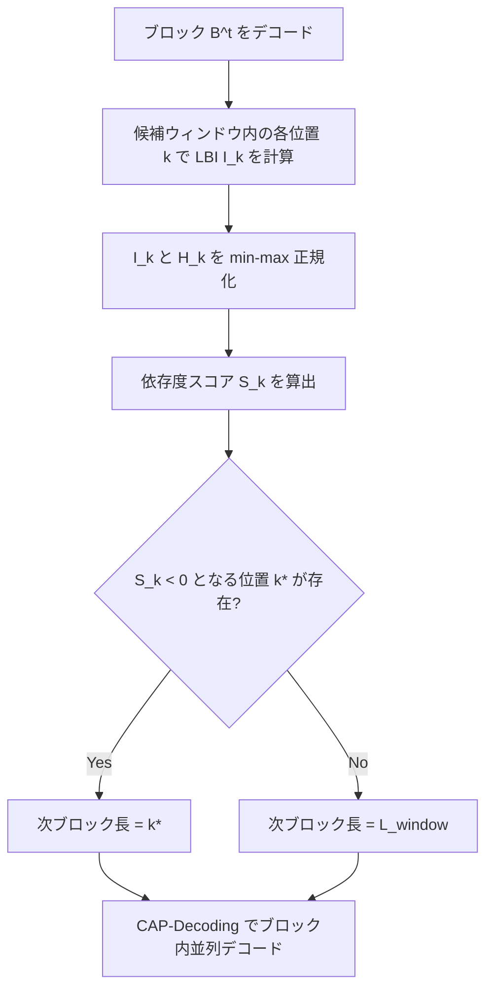

## 論文概要（Abstract）

拡散言語モデル（Diffusion Language Models, DLMs）は、自己回帰モデルに代わる生成パラダイムとして注目されている。DepCapは、DLMのブロック単位並列デコードにおいて、固定スケジュールに依存しない適応的なブロック境界決定と、依存関係を考慮した安全な並列トークン選択を実現するTraining-freeフレームワークである。著者らは、Cross-step Signalingによる適応的ブロック分割（DepGA-Block）とConflict-Aware Parallel Decoding（CAP-Decoding）の2つの手法を提案し、複数のDLMバックボーンで最大5.63倍の高速化を達成したと報告している。

本記事は [https://arxiv.org/abs/2604.15750](https://arxiv.org/abs/2604.15750) の解説記事です。

この記事は [Zenn記事: LLaDA 2.0×SGLang×FAISSで社内FAQ自動応答APIを構築し並列デコードで推論を高速化する](https://zenn.dev/0h_n0/articles/808efe0a1d8661) の深掘りです。

## 情報源

- **arXiv ID**: 2604.15750
- **URL**: [https://arxiv.org/abs/2604.15750](https://arxiv.org/abs/2604.15750)
- **著者**: Xiang Xia, Wuyang Zhang, Jiazheng Liu, et al.
- **発表年**: 2026
- **分野**: cs.CL, cs.LG

## 背景と動機（Background & Motivation）

拡散言語モデル（DLM）は、LLaDA、Dream、Mercuryなどに代表される生成モデルファミリーであり、双方向Attention機構による全系列の同時参照と並列デコードの可能性を持つ。しかし、DLMの推論においては生成品質とデコード速度のトレードオフが重要な課題となる。

近年のブロック単位デコード手法（AdaBlock、Swordsman、GeoBlockなど）は、系列を複数ブロックに分割して逐次的に拡散デコードを行うことでこのトレードオフを改善している。しかし、既存手法には2つの根本的な問題がある。

**第一に、ブロック境界の決定が不適切である。** 既存手法は固定長スケジュールか、現在のデコードステップのローカルシグナルのみに依存する。しかし、ブロック並列デコードの品質は「前のブロックのデコード結果が後続位置にどれだけ影響するか」というマルチステップの動的情報に依存するため、単一ステップの情報では不十分である。

**第二に、ブロック内の並列デコード戦略が保守的すぎる。** 従来手法は信頼度ベースのしきい値でトークンを選択するが、高信頼度のトークン同士でも依存関係がある場合には同時デコードで品質が劣化する。逆に、依存関係がないトークンは低信頼度でも安全に並列デコードできる可能性がある。

## 主要な貢献（Key Contributions）

- **Cross-step Signaling（DepGA-Block）**: 前のブロックのデコード結果が後続位置に与える影響（last-block influence）をKLダイバージェンスで定量化し、不確実性とのバランスで適応的にブロック境界を決定
- **Conflict-Free Token Selection（CAP-Decoding）**: ブロック内トークン間の依存関係を対称conflict scoreで検出し、conflict-freeなサブセットのみを並列デコード
- **情報理論的分析**: 累積last-block influenceが近似的に加法的性質を満たすことを相互情報量の枠組みで示し、per-position判定基準を理論的に正当化
- **Training-free**: 追加の学習やモデル変更を必要とせず、既存のDLMバックボーンにそのまま適用可能

## 技術的詳細（Technical Details）

### Cross-step Signaling: Last-Block Influence

DepCapの中核は、前のブロックのデコード結果が後続位置の予測分布にどれだけ影響を与えるかを定量化するLast-Block Influence（LBI）である。位置$k$に対するLBIは以下のKLダイバージェンスで定義される。

$$
I_k = \mathrm{KL}\bigl(p_k^{\mathrm{curr}} \,\|\, p_k^{\mathrm{prev}}\bigr)
$$

ここで、
- $p_k^{\mathrm{curr}}$: 直前ブロックをデコードした後の位置$k$における予測分布
- $p_k^{\mathrm{prev}}$: 直前ブロックをデコードする前の位置$k$における予測分布

$I_k$が大きいほど、前ブロックの情報が位置$k$の予測に強い影響を与えている。この「cross-step signal」は、従来手法が用いる現在ステップのみの情報とは本質的に異なる。

### Dependency Score によるブロック境界決定

ブロック境界は、LBIとShannon entropyを組み合わせた依存度スコアに基づいて決定される。

$$
S_k = \tilde{I}_k - \lambda \tilde{H}_k
$$

ここで、
- $\tilde{I}_k$: 正規化されたLBI（候補ウィンドウ内でmin-max正規化）
- $\tilde{H}_k$: 正規化されたShannon entropy $H_k = H(p_k^{\mathrm{curr}})$
- $\lambda$: 不確実性ペナルティの重み（デフォルト値1.2）

$S_k > 0$の位置は前ブロックの影響を十分に受けており品質劣化が小さいと判断できる。$S_k < 0$となる最初の位置がブロック境界として設定される。最終的なブロック長は$[L_{\min}, L_{\mathrm{window}}]$の範囲にクリップされる（$L_{\min} = 8$、$L_{\max} = 128$がデフォルト値）。

### Conflict-Free Token Selection（CAP-Decoding）

CAP-Decodingは、トークン間の依存関係をconflict scoreで検出し、conflict-freeなサブセットのみを並列にデコードする。各位置$i$のトークン信頼度は$c_i = \max_v p_i(v)$で定義される。トークン対$(i, j)$間のconflict scoreは以下で計算される。

$$
D_{ij} = \log p_i(\hat{y}_j) + \log p_j(\hat{y}_i)
$$

ここで$\hat{y}_i = \arg\max_v p_i(v)$は位置$i$の最尤トークンである。$D_{ij}$が0に近い場合は両位置の予測が互いに整合的であり、強い負値の場合は一方の確定結果が他方と矛盾する可能性が高い。

アルゴリズムは2フェーズで動作する。Phase 1で高信頼度トークン（$c_i \geq \tau_{\mathrm{high}}$）を優先的に選択しconflictを除去、Phase 2で残りの候補から信頼度降順にconflict-freeなトークンを貪欲に追加する。

### 情報理論的分析：加法的性質

著者らは、累積LBIが近似的に加法的であることを情報理論の枠組みで示している。ブロック$B$デコード時の位置$k$への期待LBIは条件付き相互情報量$I_k^{\mathrm{exp}} = I(Z_k; B \mid c)$として表現できる。ブロック長$L$にわたる累積影響は以下の形式を取る。

$$
\mathcal{I}(L) = \sum_{k=1}^{L} I_k^{\mathrm{exp}} - \varepsilon(L) \approx \sum_{k=1}^{L} I_k^{\mathrm{exp}}
$$

$\varepsilon(L)$は重複補正項であり、Local Overlap仮定（前ブロックが異なる位置に提供する情報の重複が限定的）のもとで小さいと主張されている。この加法的近似により、設計目的関数$\mathcal{I}(L) \geq \lambda \sum_{k=1}^{L} \mathbb{E}[H_k]$がper-positionの$S_k = \tilde{I}_k - \lambda \tilde{H}_k$判定に分解できる。ただし著者らは、この分析が厳密な形式的保証ではなく情報理論的な動機付けである点を明記している。

### 適応的ブロック境界決定のメカニズム



## アルゴリズム（CAP-Decoding Strategy）

```python
import torch
from dataclasses import dataclass


@dataclass
class CAPConfig:
    """CAP-Decoding hyperparameters."""
    tau_low: float = 0.8
    tau_high: float = 0.95
    gamma: float = -16.0


def cap_decoding(
    logits: torch.Tensor,
    masked_positions: torch.Tensor,
    block_indices: torch.Tensor,
    config: CAPConfig,
) -> torch.Tensor:
    """Conflict-Aware Parallel decoding within a block.

    Args:
        logits: Model output logits, shape (seq_len, vocab_size).
        masked_positions: Boolean mask of unresolved positions.
        block_indices: Indices of positions in the current block.
        config: CAP-Decoding hyperparameters.

    Returns:
        Indices of conflict-free positions for parallel decoding.
    """
    probs = torch.softmax(logits[block_indices], dim=-1)
    confidence, predicted = probs.max(dim=-1)

    in_mask = masked_positions[block_indices]
    candidate_mask = in_mask & (confidence >= config.tau_low)
    candidate_idx = candidate_mask.nonzero(as_tuple=True)[0]

    if len(candidate_idx) == 0:
        masked_conf = confidence.clone()
        masked_conf[~in_mask] = -1.0
        return block_indices[masked_conf.argmax().unsqueeze(0)]

    cand_probs = probs[candidate_idx]
    cand_pred = predicted[candidate_idx]
    cand_conf = confidence[candidate_idx]

    # Pairwise conflict scores: D_ij = log p_i(y_j) + log p_j(y_i)
    cross_prob = cand_probs[:, cand_pred]
    log_cross = torch.log(cross_prob + 1e-10)
    conflict_scores = log_cross + log_cross.T

    # Phase 1: High-confidence priority with conflict removal
    high_mask = cand_conf >= config.tau_high
    safe_set: list[int] = []
    for idx in high_mask.nonzero(as_tuple=True)[0].tolist():
        if all(conflict_scores[idx, s] >= config.gamma for s in safe_set):
            safe_set.append(idx)

    # Phase 2: Greedy completion by descending confidence
    remaining = sorted(
        [i for i in range(len(candidate_idx)) if i not in safe_set and not high_mask[i]],
        key=lambda i: -cand_conf[i].item(),
    )
    for idx in remaining:
        if all(conflict_scores[idx, s] >= config.gamma for s in safe_set):
            safe_set.append(idx)

    # Safety: always include highest-confidence token
    best = cand_conf.argmax().item()
    if best not in safe_set:
        safe_set.append(best)

    return block_indices[candidate_idx[torch.tensor(safe_set, device=block_indices.device)]]
```

## 実装のポイント（Implementation）

**LBIの効率的な計算**: $p_k^{\mathrm{prev}}$の保持が必要なため、前ステップの予測分布をキャッシュする必要がある。語彙サイズが大きい場合（LLaDA-8Bでは128,256）、候補ウィンドウ内の位置のみを保持するか、top-k分布に圧縮する工夫が有効である。

**Conflict scoreの計算量**: $D_{ij}$の計算は$O(n^2)$だが、$\tau_{\mathrm{low}}$でフィルタされるため実際の候補数$n$は小さい（典型的に$n < 50$）。

**ハイパーパラメータの推奨値**: $\lambda = 1.2$（大きくすると品質向上・速度低下）、$\tau_{\mathrm{low}} = 0.8$、$\tau_{\mathrm{high}} = 0.95$、$\gamma = -16.0$（より負の値で並列度増加）、$L_{\min} = 8$, $L_{\max} = 128$。

**キャッシュとの互換性**: Prefix CacheおよびDual Cacheと組み合わせ可能。Dual Cache併用時にはLLaDA-8B-InstructのGSM8Kで51.2 tokens/secを達成したと著者らは述べている。

## Production Deployment Guide

### AWS実装パターン（コスト最適化重視）

DLMはバッチ内の系列全体を同時処理するため、GPUメモリとの兼ね合いが特に重要となる。以下にトラフィック量別の推奨構成を示す（コスト試算は2026年9月時点のap-northeast-1リージョン料金に基づく概算値。実際のコストはトラフィックパターンとバースト使用量により変動する）。

| 規模 | 構成 | 主要サービス | 月額概算 |
|:---:|:---:|:---|:---:|
| Small (~100 req/日) | Serverless | SageMaker Serverless + Lambda + DynamoDB | $80-200 |
| Medium (~1,000 req/日) | Hybrid | ECS Fargate GPU + ALB + ElastiCache | $400-900 |
| Large (10,000+ req/日) | Container | EKS + Karpenter + Spot GPU + Triton | $2,500-6,000 |

**コスト削減テクニック**: GPU Spot Instances活用で最大90%削減（g5.xlarge On-Demand $1.006/h → Spot ~$0.30/h）、Reserved Instances 1年コミットで最大40%削減、SageMaker Savings Plansで最大64%削減、推論結果キャッシュで同一入力のGPU計算回避。

### Terraformインフラコード

**Small構成（Serverless）**:

```hcl
provider "aws" { region = "ap-northeast-1" }
variable "project_name" { default = "depcap-inference" }

resource "aws_iam_role" "lambda_role" {
  name = "${var.project_name}-lambda-role"
  assume_role_policy = jsonencode({
    Version = "2012-10-17"
    Statement = [{ Action = "sts:AssumeRole", Effect = "Allow",
      Principal = { Service = "lambda.amazonaws.com" } }]
  })
}

resource "aws_iam_role_policy" "lambda_policy" {
  name = "${var.project_name}-lambda-policy"
  role = aws_iam_role.lambda_role.id
  policy = jsonencode({
    Version = "2012-10-17"
    Statement = [
      { Effect = "Allow", Action = ["sagemaker:InvokeEndpoint"],
        Resource = aws_sagemaker_endpoint.inference.arn },
      { Effect = "Allow", Action = ["dynamodb:PutItem", "dynamodb:GetItem"],
        Resource = aws_dynamodb_table.request_log.arn },
      { Effect = "Allow", Action = ["logs:CreateLogGroup", "logs:CreateLogStream", "logs:PutLogEvents"],
        Resource = "arn:aws:logs:*:*:*" }
    ]
  })
}

resource "aws_dynamodb_table" "request_log" {
  name = "${var.project_name}-requests"
  billing_mode = "PAY_PER_REQUEST"  # On-Demand for cost efficiency
  hash_key = "request_id"
  attribute { name = "request_id"; type = "S" }
  server_side_encryption { enabled = true }  # KMS encryption
}

resource "aws_sagemaker_endpoint_configuration" "serverless" {
  name = "${var.project_name}-config"
  production_variants {
    variant_name = "default"
    model_name   = aws_sagemaker_model.depcap.name
    serverless_config { max_concurrency = 2; memory_size_in_mb = 6144 }
  }
}

resource "aws_sagemaker_endpoint" "inference" {
  name = "${var.project_name}-endpoint"
  endpoint_config_name = aws_sagemaker_endpoint_configuration.serverless.name
}

resource "aws_cloudwatch_metric_alarm" "high_invocations" {
  alarm_name = "${var.project_name}-high-invocations"
  comparison_operator = "GreaterThanThreshold"
  evaluation_periods = 1; metric_name = "Invocations"
  namespace = "AWS/SageMaker"; period = 3600; statistic = "Sum"; threshold = 500
  dimensions = { EndpointName = aws_sagemaker_endpoint.inference.name; VariantName = "default" }
}
```

**Large構成（Container）** ではEKS v1.31 + Karpenter NodePool（g5.2xlarge/g5.4xlarge Spot優先、consolidationPolicy: WhenEmptyOrUnderutilized）+ AWS Budgets（月額$5,000上限、80%超過でアラート）を組み合わせる。クラスタのエンドポイントはプライベートアクセスのみとし、GPU上限は8基に設定する。

### 運用・監視設定

**CloudWatch Logs Insights（レイテンシ分析）**:

```
fields @timestamp, @message
| filter @message like /inference_latency/
| stats avg(latency_ms) as avg_lat, percentile(latency_ms, 95) as p95, percentile(latency_ms, 99) as p99
  by bin(1h)
```

**X-Rayトレーシング**: `aws_xray_sdk.core`の`patch_all()`でboto3を自動計装し、推論関数に`@xray_recorder.capture`デコレータを適用する。アノテーションにモデル名、メタデータに入力長を記録する。

**Cost Explorer日次レポート**: `ce.get_cost_and_usage()`でサービス別コストを日次取得し、$100/日超過時にSNS通知を発火する。

### コスト最適化チェックリスト

**アーキテクチャ選択**: トラフィック量で判断（Serverless/Hybrid/Container）、GPUファミリー選択（推論: g5系、学習兼用: p4d系）

**リソース最適化**: GPU Spot Instances優先（最大70%削減）、Reserved Instances 1年コミット、SageMaker Savings Plans（最大64%削減）、Lambda メモリサイズ最適化、EKS Karpenter Consolidation Policy、SageMaker Serverless max_concurrency適正値設定

**推論コスト削減**: 推論結果キャッシュ（ElastiCache Redis）、バッチ推論活用、モデル量子化（INT8/FP8）、DepCapブロック長パラメータ調整（$\lambda$で品質/速度トレードオフ制御）

**監視・アラート**: AWS Budgets（80%/100%アラート）、CloudWatch アラーム（レイテンシ・GPU利用率・エラー率）、Cost Anomaly Detection、日次コストレポート（SNS）、SageMaker Model Monitor

**リソース管理**: 未使用エンドポイント定期削除、タグ戦略統一、S3ライフサイクルポリシー、開発環境GPU夜間停止（EventBridge + Lambda）、ECRイメージライフサイクル

## 実験結果（Results）

著者らは、LLaDA-8B-Instruct、LLaDA-1.5、Dream-v0-base-7Bの3つのDLMバックボーンで評価を行っている。

### LLaDA-8B-Instruct（論文Table 1より）

| ベンチマーク | TPS (tokens/sec) | 高速化倍率 | 精度 | NFE |
|:---:|:---:|:---:|:---:|:---:|
| GSM8K | 21.4 | 3.57x | 78.8% | 74.8 |
| Math-500 | 22.2 | 2.81x | 39.8% | 94.8 |
| MBPP | 20.8 | 3.85x | 40.8% | 68.6 |
| HumanEval | 59.8 | 3.58x | 42.7% | 74.8 |

### LLaDA-1.5 on MBPP

著者らによると、LLaDA-1.5ではMBPPにおいて5.63倍の高速化を達成しつつ、精度が37.8%から40.6%に7.4%相対的に向上したと報告されている。適応的ブロック境界とconflict-free選択が固定スケジュールよりも品質面でも優れる可能性を示唆している。

### Dream-v0-base-7B / キャッシュ互換性

Dreamバックボーンでは平均1.67倍の高速化が達成されている。LLaDAファミリーと比較して控えめだが、全ベンチマークで精度低下は報告されていない。Dual Cache併用時のLLaDA-8B-Instruct（GSM8K）では精度79.3%、スループット51.2 tokens/secを達成しており、既存キャッシュ最適化との互換性が確認されている（論文Figure 2より）。

### Ablation Study

DepGA-Block単体ではベースラインの信頼度ベース手法（精度77.3-77.5%）に対して約79%の精度を達成し、CAP-Decoding単体では最速スループット（21.6 TPS）を達成している。両手法の組み合わせが速度と品質の最良のバランスを提供すると報告されている。

## 実運用への応用（Practical Applications）

DepCapは、Zenn記事で取り上げたLLaDA 2.0ベースのFAQ自動応答APIのような拡散言語モデル推論システムに直接応用可能である。

**推論レイテンシの削減**: FAQ応答のようなリアルタイム要件のあるシステムでは、3-5倍の高速化はユーザー体験を大幅に改善する。LLaDA-8Bクラスで50+ tokens/secのスループットが得られれば、自己回帰モデルと遜色ないレスポンス速度を実現できる。

**Training-freeの実用性**: 追加学習不要なため、既存パイプラインへの導入コストが低い。SGLangなどの推論フレームワークとの統合もデコードループのカスタマイズで対応可能と考えられる。

**品質と速度の動的制御**: $\lambda$パラメータの調整により、品質重視と速度重視を動的に切り替えられる。トラフィック量に応じた$\lambda$の動的変更も設計可能である。

ただし、DepCapはブロック単位デコード設定に特化しており、sliding-windowベースの拡散デコードには直接適用できない点に留意が必要である。

## 関連研究（Related Work）

- **Fast-dLLM（Wu et al., 2026）**: DLMの高速推論フレームワーク。信頼度ベースのトークン選択を行うが、ブロック境界は固定スケジュールに依存。DepCapはcross-step signalingで差別化
- **AdaBlock（Lu et al., 2026）**: 特殊トークン位置に基づくセマンティックなブロック境界検出。汎用性に限界がある
- **Swordsman（Zhang et al., 2026）**: 隣接位置間のエントロピー差に基づくブロック分割。current-step signalのみのため、マルチステップ動的依存関係を捉えられない
- **GeoBlock（Wan et al., 2026）**: Attention行列から依存関係の幾何学的構造を抽出。DepCapとは相補的なアプローチ
- **LLaDA / Dream**: DepCapが評価に使用するDLMバックボーン。マスクベースの拡散プロセスと双方向Attentionを採用

## まとめと今後の展望

DepCapは、拡散言語モデルのブロック並列デコードにおける2つの本質的な課題に対し、cross-step signalingとconflict-free token selectionという情報理論的に動機付けられた手法で取り組んでいる。最大5.63倍の高速化をTraining-freeで達成した点は実用上の大きな価値である。

一方で、情報理論的分析がLocal Overlap仮定に基づく近似である点、sliding-windowデコードへの拡張が未検討である点は今後の課題として残る。DepCapの適応的アプローチがキャッシュ技術やSpeculative Decodingと組み合わされることで、さらなる性能向上が期待される。

## 参考文献

- **arXiv**: [https://arxiv.org/abs/2604.15750](https://arxiv.org/abs/2604.15750)
- **LLaDA**: Nie et al., "Large Language Diffusion Models," 2025
- **Dream**: Ye et al., "Dream: Diffusion Rectification and Estimation-Adaptive Models," 2025
- **Fast-dLLM**: Wu et al., 2026
- **AdaBlock**: Lu et al., 2026
- **Swordsman**: Zhang et al., 2026
- **GeoBlock**: Wan et al., 2026
- **Related Zenn article**: [https://zenn.dev/0h_n0/articles/808efe0a1d8661](https://zenn.dev/0h_n0/articles/808efe0a1d8661)
