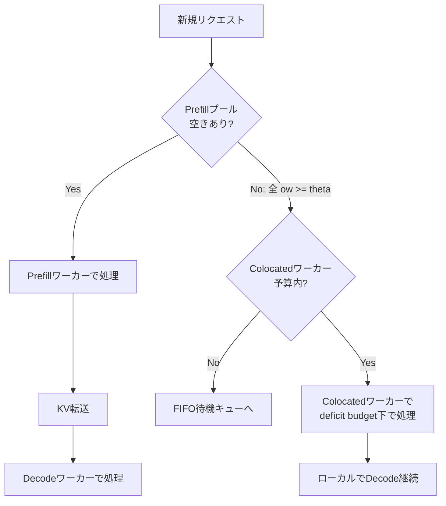

## 論文概要（Abstract）

拡散言語モデル（diffusion LLM; dLLM）は、マスクされたトークンを複数同時に予測・生成する並列デコードにより自己回帰（AR）モデルとは異なる推論特性を持つ。しかし、双方向attentionに起因するKVキャッシュの非適用性やprefill-decode干渉の頻発といったサービング固有の課題が存在する。Sangamは、deficit token-budget schedulerを中核とし、colocatedとdisaggregatedのハイブリッドサービング戦略を採用することで、これらの課題に対処するシステムである。著者らは、LLaDA-8BおよびDream-7Bにおいて平均レイテンシ8--20%の削減を報告している。

本記事は [arxiv.org/abs/2607.04206](https://arxiv.org/abs/2607.04206) の解説記事です。

この記事は [Zenn記事: LLaDA 2.0×SGLang×FAISSで社内FAQ自動応答APIを構築し並列デコードで推論を高速化する](https://zenn.dev/0h_n0/articles/808efe0a1d8661) の深掘りです。

## 情報源

- **arXiv ID**: 2607.04206
- **URL**: [https://arxiv.org/abs/2607.04206](https://arxiv.org/abs/2607.04206)
- **著者**: Nitin Kedia, Saurabh Agarwal, Myungjin Lee, Aditya Akella
- **発表年**: 2026年7月
- **分野**: cs.LG, cs.DC（機械学習、分散コンピューティング）

## 背景と動機（Background & Motivation）

自己回帰（AR）言語モデルのサービングでは、KVキャッシュによるprefill計算の再利用やprefill chunkingによるdecode遅延の制御が確立された技術である。しかし、LLaDAやDreamに代表されるdLLMは双方向attentionを使用するため、これらの技術がそのままでは適用できない。

dLLMの推論では、プロンプトの末尾に$L$個の`[MASK]`トークンを連結し、全系列に対して双方向attentionを実行する。マスク位置のトークンが確定（commit）されると、他の位置のattention入力が変化し、KVアクティベーションも変化する。このため、ARモデルのような安定的なKVキャッシュが成立しない。

代替として、Fast-dLLMのブロック境界でのKVリフレッシュやdKV-Cacheの周期的リフレッシュといった近似キャッシュ手法が提案されているが、これらは反復的なprefill-decode-prefillパターンを生成し、prefillとdecodeの干渉がARモデルよりも頻繁に発生する。さらに、dLLMの双方向attentionの特性上、prefill chunkingによる分割処理が適用できないため、サービングシステムの設計に根本的な再考が必要である。

## 主要な貢献（Key Contributions）

- **Deficit token-budget scheduler**: dLLM固有の制約（prefill chunkingの不可、大きなdecodeバッチ、反復prefill）に対応するスケジューリングアルゴリズム。prefillを時間的に遅延させることでamortized stall-free batchingを実現する
- **ハイブリッドサービング戦略**: colocated（干渉は残るがパーティショニング問題なし）とdisaggregated（干渉なしだがパーティショニング脆弱）を組み合わせ、ワークロード特性に適応する構成
- **dLLMサービングの体系的分析**: ARモデルとの3つの根本的差異（Big Decodes、Recurring Prefills、Static Partitioning Fragility）を特定し、実測データに基づいて定量化

## 技術的詳細（Technical Details）

### dLLMの推論プロセス

dLLMの推論は以下の手順で進行する:

1. プロンプトの末尾に$L$個の`[MASK]`トークンを連結
2. 全系列（プロンプト+レスポンス）に対して双方向attentionによるforward passを実行
3. マスク位置のトークン分布を予測
4. 信頼度閾値を超えたサブセットをout-of-orderで並列にunmask
5. EOSが確定し全位置がunmaskされるまで繰り返し

この際、トークンのunmaskはブロック単位（通常32トークン）で行われ、信頼度閾値（例: 0.9）による可変長サンプリングが適用される。ブロック境界ごとにKVキャッシュのリフレッシュ（実質的な再prefill）が発生するため、ARモデルとは質的に異なるサービングパターンとなる。

### ARモデルとの3つの根本的差異

著者らは、dLLMサービングにおける3つの重要な差異（Takeaway）を特定している。

**Takeaway 1 -- Big Decodes**: dLLMのdecodeは32トークンブロック単位で実行されるため、各decodeステップの計算コストがARモデル（1トークン/ステップ）と比べて大きい。著者らによれば、decodeバッチは低いバッチサイズでもGPUを飽和させるため、ARシステムのように大規模バッチでスループットを稼ぐ戦略が単独では機能しない。

**Takeaway 2 -- Recurring Prefills**: ブロック境界がデータ依存（信頼度閾値による可変トークンサンプリング）であるため、バッチ内の各リクエストが異なるイテレーションでブロック境界に到達する。これにより、各in-flightリクエストが反復的なprefillソースとなり、prefill-decode干渉がARモデルよりも頻繁に発生する。さらに、双方向attentionの制約上、dLLMではprefill chunkingが適用できない。

**Takeaway 3 -- Static Partitioning Fragility**: disaggregated構成における静的なprefill:decode分割は脆弱である。著者らの実験（LLaDA-8B、8 H100）では、4P4D（4 prefill : 4 decode）構成でprefillワーカーに24秒のメディアンスケジューリング遅延、6P2D構成でdecodeワーカーに8秒の遅延が発生し、5P3Dのバランス構成でのみ約5秒の遅延に収束したと報告されている。

### Deficit Token-Budget Scheduler

deficit token-budget schedulerは、Sangamのスケジューリングの中核機構である。

#### 基本原理

各イテレーションにおいて、トークン予算$\tau$を設定する。スケジューラは以下の手順で動作する:

1. in-flightのdecodeリクエストを全て優先的に受け入れる（decodeは決して追い出されない）
2. 利用可能な予算を計算する:

$$
\text{budget} = \tau - \text{Tokens}(\text{decodes}) + \text{deficit}
$$

3. 待機中のprefillリクエストを到着順に、残予算の範囲内で受け入れる
4. 未使用予算を次のイテレーションにdeficit（赤字予算）として繰り越す
5. マイクロバッチが空の場合（アイドル時）は、予算超過であっても先頭のprefillを受け入れる（liveness保証）

ここで、
- $\tau$: 1イテレーションあたりのトークン予算
- $\text{Tokens}(\text{decodes})$: 現在のdecodeバッチの合計トークン数
- $\text{deficit}$: 前イテレーションから繰り越された未使用予算

#### Amortized Stall-Free保証

著者らは、per-iteration stall-freeはdLLMでは達成不可能であると指摘している。dLLMのprefillは双方向attentionの制約により分割できず、1回のイテレーションで全体を処理する必要があるため、同一バッチ内のdecodeリクエストに対してprefillサイズ分のストールが不可避的に発生する。

これに対し、deficit schedulerはamortized（償却的）な保証を提供する。busy period（連続してリクエストが処理される期間）$W$イテレーションにおいて、受け入れられたprefillトークンの合計は以下の上限を持つ:

$$
\sum_{t=1}^{W} P_t \leq W \cdot \tau - \sum_{t=1}^{W} D_t
$$

ここで、
- $P_t$: イテレーション$t$で受け入れられたprefillトークン数
- $D_t$: イテレーション$t$でのdecodeトークン数
- $W$: busy periodの長さ（イテレーション数）

この式は、1イテレーションあたりの平均prefill負荷が$\tau$以下に制限されることを意味する。すなわち、個々のイテレーションではストールが発生しうるが、期間全体で平均すればstall-freeが保証される。

#### 予算$\tau$のトレードオフ

$\tau$の値はprefill-decode干渉とキューイング遅延のトレードオフを制御する:

- **$\tau$が小さい場合**（例: 512, 1024）: prefill-decode干渉が抑制されテールレイテンシが改善するが、prefillのキューイング遅延が増大する
- **$\tau$が大きい場合**（例: 16384）: prefill優先で動作しキューイングが減少するが、decode干渉が増大する

著者らの実験（LLaDA-8B ShareGPT, p99）では、$\tau$を1024から16384に増加させると、キューイング遅延は2.5秒から1.4秒に減少する一方、decode干渉は13.1秒から15.1秒に増加し、end-to-endレイテンシは17.3秒から18.9秒に悪化したと報告されている。

### Colocated vs Disaggregated Serving

#### Colocated構成

全ワーカーがprefillとdecodeの両方をローカルで実行する。パーティショニング問題は発生しないが、prefill-decode干渉に晒される。deficit token-budget schedulerによってこの干渉を制御する。

#### Disaggregated構成

prefill専用の$N_P$ワーカーとdecode専用の$N_D$ワーカーに分離する。KVアクティベーションはprefillワーカーからdecodeワーカーにtorch.distributed/NCCLを介して転送される。設計上prefill-decode干渉は発生しないが、ワークロード変動に対して静的分割が脆弱となる。

#### ハイブリッド構成

Sangamの提案するハイブリッド構成は、prefill専用プール（$N_P$ワーカー）とcolocatedワーカー（$N_C$ワーカー）を組み合わせる:

1. リクエストはまず最小負荷のprefillワーカーにルーティングされる
2. prefillプールが飽和した場合（全ワーカーの未処理prefill負荷$o_w \geq \theta$）、オーバーフローしたprefillをcolocatedワーカーにdeficit予算$\tau$の制約下で転送する
3. 容量がない場合はFIFO待機キューに入れる

ここで$\theta$はprefillプールの飽和閾値（トークン数）である。



### アルゴリズム

以下にdeficit token-budget schedulerの擬似コードを示す。

```python
class DeficitTokenBudgetScheduler:
    """Sangam deficit token-budget scheduler

    dLLMのprefill-decode干渉をamortized stall-freeで制御する
    スケジューラ。prefill chunkingが不可能なdLLMに特化した設計。

    Args:
        tau: 1イテレーションあたりのトークン予算
    """

    def __init__(self, tau: int) -> None:
        self.tau = tau
        self.deficit: int = 0

    def schedule_iteration(
        self,
        in_flight_decodes: list[DecodeRequest],
        pending_prefills: list[PrefillRequest],
    ) -> tuple[list[DecodeRequest], list[PrefillRequest]]:
        """1イテレーションのスケジューリングを実行する

        Args:
            in_flight_decodes: 処理中のdecodeリクエスト一覧
            pending_prefills: 待機中のprefillリクエスト（到着順）

        Returns:
            (admitted_decodes, admitted_prefills) の組
        """
        # Step 1: in-flight decodeは全て優先受け入れ
        admitted_decodes = list(in_flight_decodes)
        decode_tokens = sum(r.token_count for r in admitted_decodes)

        # Step 2: 利用可能予算を計算（deficit繰越含む）
        available_budget = self.tau - decode_tokens + self.deficit

        # Step 3: 到着順にprefillを受け入れ
        admitted_prefills: list[PrefillRequest] = []
        for prefill in pending_prefills:
            if prefill.token_count <= available_budget:
                admitted_prefills.append(prefill)
                available_budget -= prefill.token_count
            else:
                break  # prefillは分割不可、先頭が入らなければ停止

        # Step 4: Liveness保証 -- バッチ空ならば予算超過でも先頭を受け入れ
        if not admitted_decodes and not admitted_prefills and pending_prefills:
            admitted_prefills.append(pending_prefills[0])
            available_budget -= pending_prefills[0].token_count

        # Step 5: 未使用予算を繰り越し
        self.deficit = max(available_budget, 0)

        return admitted_decodes, admitted_prefills
```

ハイブリッドルーティングの擬似コードは以下の通りである。

```python
class HybridRouter:
    """ハイブリッド構成のリクエストルーティング

    Args:
        prefill_workers: prefill専用ワーカー群
        colocated_workers: colocated（prefill+decode）ワーカー群
        theta: prefillプール飽和閾値（トークン数）
        tau: colocatedワーカーのdeficit予算
    """

    def __init__(
        self,
        prefill_workers: list[PrefillWorker],
        colocated_workers: list[ColocatedWorker],
        theta: int,
        tau: int,
    ) -> None:
        self.prefill_workers = prefill_workers
        self.colocated_workers = colocated_workers
        self.theta = theta
        self.tau = tau

    def route(self, request: InferenceRequest) -> str:
        """リクエストを適切なワーカーにルーティングする

        Returns:
            ルーティング先の識別子
        """
        # prefillプールに空きがあるか確認
        available = [
            w for w in self.prefill_workers
            if w.outstanding_load < self.theta
        ]
        if available:
            target = min(available, key=lambda w: w.outstanding_load)
            target.enqueue(request)
            return f"prefill:{target.id}"

        # prefillプール飽和 -> colocatedにオーバーフロー
        least_loaded = min(
            self.colocated_workers,
            key=lambda w: w.current_load,
        )
        least_loaded.enqueue_with_budget(request, self.tau)
        return f"colocated:{least_loaded.id}"
```

## 実装のポイント（Implementation）

Sangamの実装は約16,000行のPythonコードで構成され、PyTorchおよびHuggingFace Transformersの上に構築されている。以下の技術的要素が採用されている。

**スケジューラアーキテクチャ**: 中央CPUスケジューラがGPUワーカープールを協調制御する。制御プレーンのRPCにはgRPCを使用し、KVアクティベーションの転送にはtorch.distributed（NCCLバックエンド）を用いる。

**メモリ管理**: PagedAttentionによるKV管理を採用し、FlashInferのpaged-KV attentionカーネルによる高速化を適用している。これは、関連Zenn記事で取り上げているSGLangのPagedAttention実装と共通基盤に基づく。

**CUDA Graphs**: 反復的なdecodeイテレーションに対してCUDA Graphsを適用し、著者らによればカーネル起動オーバーヘッドを最大2倍削減したと報告されている。dLLMでは各decodeステップが32トークンブロック全体のforward passを含むため、この最適化の効果が大きい。

**実験環境**: AWS p5.48xlarge（8x H100 80GB、ペアワイズNVLink）で評価が行われた。KVページサイズ16トークン、ブロックサイズ32トークン、信頼度閾値0.9（Fast-dLLMデフォルト）、レスポンスパディングはShareGPTで1024 MASK、arXivで512 MASKに設定されている。

## Production Deployment Guide

本論文にはGitHubリポジトリ（github.com/UT-InfraAI/sangam）で実装が公開されており、実装セクションの記載があるため、Production Deployment Guideを付記する。

### AWS実装パターン（コスト最適化重視）

dLLMサービングシステムの本番運用において、トラフィック量に応じた3段階の構成を示す。Sangamはマルチ GPU環境を前提とするため、ARモデル向けの軽量構成とは異なりGPUインスタンスが必須となる。なお、以下のコスト試算は2026年9月時点のAWS ap-northeast-1（東京）リージョン料金に基づく概算値であり、実際のコストはトラフィックパターン、リージョン、バースト使用量により変動する。最新料金はAWS料金計算ツールでの確認を推奨する。

**Small (~100 req/日): 単一GPU構成**
- EC2 g5.2xlarge（1x A10G 24GB）x 1: LLaDA-8B量子化モデル
- Application Load Balancer + API Gateway
- DynamoDB（On-Demand）: リクエストログ
- CloudWatch: 監視・アラーム
- 月額: $800-1,200（Spot活用時$200-400）

**Medium (~1,000 req/日): マルチGPU構成**
- EC2 g5.12xlarge（4x A10G）x 1またはp4d.24xlarge（8x A100）x 1
- ECS Fargate（APIゲートウェイ層）
- ElastiCache Redis（リクエストキュー）
- S3 + CloudFront（静的アセット）
- 月額: $4,000-8,000（Spot + Reserved混合で$2,000-4,000）

**Large (10,000+ req/日): Sangamフル構成**
- EKS + Karpenter: p5.48xlarge（8x H100）x 2-4ノード
- ハイブリッド構成: prefillプール + colocatedワーカー
- NCCL over EFA（Elastic Fabric Adapter）: KV転送
- Application Load Balancer + NLB（gRPC用）
- ElastiCache Redis Cluster: スケジューラ状態
- 月額: $40,000-80,000（Spot優先で$15,000-30,000）

**コスト削減テクニック**:
- Spot Instances活用: p5インスタンスで最大70%削減（ただし中断リスクあり、checkpointing必須）
- Reserved Instances: 1年コミットで最大40%削減
- INT8/INT4量子化: メモリ使用量50-75%削減、低スペックGPUで動作可能
- バッチ処理: deficit schedulerの$\tau$チューニングでスループット最大化

### Terraformインフラコード

**Small構成（単一GPU + Spot）**:

```hcl
# Sangam dLLM Serving - Small構成
# Spot Instanceで70%コスト削減

terraform {
  required_version = ">= 1.9"
  required_providers {
    aws = { source = "hashicorp/aws", version = "~> 5.70" }
  }
}

provider "aws" {
  region = "ap-northeast-1"
}

# VPC（NAT Gateway不使用でコスト削減）
module "vpc" {
  source  = "terraform-aws-modules/vpc/aws"
  version = "~> 5.13"

  name = "sangam-serving-vpc"
  cidr = "10.0.0.0/16"

  azs            = ["ap-northeast-1a"]
  public_subnets = ["10.0.1.0/24"]

  enable_nat_gateway = false
  enable_dns_support = true
}

# IAMロール（最小権限）
resource "aws_iam_role" "sangam_instance" {
  name = "sangam-serving-role"
  assume_role_policy = jsonencode({
    Version = "2012-10-17"
    Statement = [{
      Action = "sts:AssumeRole"
      Effect = "Allow"
      Principal = { Service = "ec2.amazonaws.com" }
    }]
  })
}

resource "aws_iam_role_policy_attachment" "ecr_read" {
  role       = aws_iam_role.sangam_instance.name
  policy_arn = "arn:aws:iam::aws:policy/AmazonEC2ContainerRegistryReadOnly"
}

resource "aws_iam_instance_profile" "sangam" {
  name = "sangam-serving-profile"
  role = aws_iam_role.sangam_instance.name
}

# Spot Fleet: g5.2xlarge (1x A10G)
resource "aws_spot_fleet_request" "sangam" {
  iam_fleet_role                      = aws_iam_role.sangam_instance.arn
  target_capacity                     = 1
  terminate_instances_with_expiration = true
  allocation_strategy                 = "lowestPrice"

  launch_specification {
    instance_type          = "g5.2xlarge"
    ami                    = data.aws_ami.deep_learning.id
    subnet_id              = module.vpc.public_subnets[0]
    iam_instance_profile   = aws_iam_instance_profile.sangam.name
    key_name               = var.key_pair_name
    vpc_security_group_ids = [aws_security_group.sangam.id]

    root_block_device {
      volume_size = 200
      volume_type = "gp3"
      encrypted   = true  # KMS暗号化
    }
  }
}

# DynamoDB（On-Demand）: リクエストログ
resource "aws_dynamodb_table" "request_log" {
  name         = "sangam-request-log"
  billing_mode = "PAY_PER_REQUEST"
  hash_key     = "request_id"
  range_key    = "timestamp"

  attribute {
    name = "request_id"
    type = "S"
  }
  attribute {
    name = "timestamp"
    type = "N"
  }

  server_side_encryption { enabled = true }
  point_in_time_recovery { enabled = true }
}

# CloudWatchアラーム（コスト監視）
resource "aws_cloudwatch_metric_alarm" "gpu_utilization" {
  alarm_name          = "sangam-gpu-utilization-low"
  comparison_operator = "LessThanThreshold"
  evaluation_periods  = 3
  metric_name         = "GPUUtilization"
  namespace           = "Sangam"
  period              = 300
  statistic           = "Average"
  threshold           = 10
  alarm_description   = "GPU utilization below 10% for 15min - consider scaling down"
  alarm_actions       = [var.sns_topic_arn]
}
```

**Large構成（EKS + Karpenter + Spot）**:

```hcl
# Sangam dLLM Serving - Large構成
# EKS + Karpenter: p5 Spot優先

module "eks" {
  source  = "terraform-aws-modules/eks/aws"
  version = "~> 20.24"

  cluster_name    = "sangam-serving"
  cluster_version = "1.31"

  vpc_id     = module.vpc.vpc_id
  subnet_ids = module.vpc.private_subnets

  cluster_endpoint_public_access = false  # プライベートのみ

  eks_managed_node_groups = {
    system = {
      instance_types = ["m7i.large"]
      min_size       = 2
      max_size       = 3
      desired_size   = 2
    }
  }
}

# Karpenter Provisioner（Spot優先、GPU特化）
resource "kubectl_manifest" "karpenter_nodepool" {
  yaml_body = yamlencode({
    apiVersion = "karpenter.sh/v1"
    kind       = "NodePool"
    metadata   = { name = "sangam-gpu" }
    spec = {
      template = {
        spec = {
          requirements = [
            { key = "karpenter.sh/capacity-type", operator = "In", values = ["spot", "on-demand"] },
            { key = "node.kubernetes.io/instance-type", operator = "In",
              values = ["p5.48xlarge", "p4d.24xlarge"] },
          ]
          nodeClassRef = { name = "sangam-gpu-class" }
        }
      }
      limits   = { cpu = "384", "nvidia.com/gpu" = "32" }
      disruption = {
        consolidationPolicy = "WhenEmptyOrUnderutilized"
        consolidateAfter    = "60s"
      }
    }
  })
}

# Secrets Manager（モデル設定）
resource "aws_secretsmanager_secret" "sangam_config" {
  name       = "sangam/serving-config"
  kms_key_id = aws_kms_key.sangam.arn
}

# AWS Budgets（予算アラート）
resource "aws_budgets_budget" "sangam_monthly" {
  name         = "sangam-monthly-budget"
  budget_type  = "COST"
  limit_amount = "50000"
  limit_unit   = "USD"
  time_unit    = "MONTHLY"

  notification {
    comparison_operator       = "GREATER_THAN"
    threshold                 = 80
    threshold_type            = "PERCENTAGE"
    notification_type         = "ACTUAL"
    subscriber_sns_topic_arns = [var.sns_topic_arn]
  }
}
```

### 運用・監視設定

**CloudWatch Logs Insights -- レイテンシ分析クエリ**:

```
fields @timestamp, request_id, latency_ms, prefill_ms, decode_ms
| filter level = "INFO" and event = "request_complete"
| stats avg(latency_ms) as avg_lat,
        pct(latency_ms, 95) as p95_lat,
        pct(latency_ms, 99) as p99_lat,
        avg(prefill_ms) as avg_prefill,
        avg(decode_ms) as avg_decode
  by bin(1h)
| sort @timestamp desc
```

**CloudWatch Logs Insights -- Deficit scheduler監視クエリ**:

```
fields @timestamp, deficit_tokens, admitted_prefill_tokens, tau
| filter event = "scheduler_iteration"
| stats avg(deficit_tokens) as avg_deficit,
        max(deficit_tokens) as max_deficit,
        sum(admitted_prefill_tokens) as total_prefill
  by bin(5m)
```

**CloudWatchアラーム設定（Python）**:

```python
import boto3

cloudwatch = boto3.client("cloudwatch", region_name="ap-northeast-1")

def create_sangam_alarms(sns_topic_arn: str) -> None:
    """Sangamサービング用の監視アラームを作成する"""
    # p99レイテンシアラーム
    cloudwatch.put_metric_alarm(
        AlarmName="sangam-p99-latency-high",
        MetricName="RequestLatencyP99",
        Namespace="Sangam",
        Statistic="Average",
        Period=300,
        EvaluationPeriods=3,
        Threshold=30000,  # 30秒
        ComparisonOperator="GreaterThanThreshold",
        AlarmActions=[sns_topic_arn],
        AlarmDescription="p99 latency exceeds 30s for 15min",
    )
    # GPU utilization低下アラーム
    cloudwatch.put_metric_alarm(
        AlarmName="sangam-gpu-idle",
        MetricName="GPUUtilization",
        Namespace="Sangam",
        Statistic="Average",
        Period=300,
        EvaluationPeriods=6,
        Threshold=5,
        ComparisonOperator="LessThanThreshold",
        AlarmActions=[sns_topic_arn],
        AlarmDescription="GPU idle below 5% for 30min - scale down candidate",
    )
```

**X-Rayトレーシング設定（Python）**:

```python
from aws_xray_sdk.core import xray_recorder, patch_all

xray_recorder.configure(
    service="sangam-serving",
    sampling=True,
    context_missing="LOG_ERROR",
)
patch_all()  # boto3, requests等を自動計装

def trace_inference(request_id: str, model: str) -> None:
    """推論リクエストのX-Rayトレーシング"""
    segment = xray_recorder.begin_segment("inference")
    segment.put_annotation("request_id", request_id)
    segment.put_annotation("model", model)
    segment.put_metadata("config", {"tau": 1024, "theta": 4096})
    # ... 推論処理 ...
    xray_recorder.end_segment()
```

**Cost Explorer日次レポート（Python）**:

```python
import boto3
from datetime import date, timedelta

ce = boto3.client("ce", region_name="us-east-1")
sns = boto3.client("sns", region_name="ap-northeast-1")

def daily_cost_report(sns_topic_arn: str) -> dict:
    """日次コストレポートを取得し閾値超過時にSNS通知する"""
    today = date.today()
    yesterday = today - timedelta(days=1)

    response = ce.get_cost_and_usage(
        TimePeriod={"Start": str(yesterday), "End": str(today)},
        Granularity="DAILY",
        Metrics=["UnblendedCost"],
        GroupBy=[{"Type": "DIMENSION", "Key": "SERVICE"}],
    )
    total = sum(
        float(g["Metrics"]["UnblendedCost"]["Amount"])
        for g in response["ResultsByTime"][0]["Groups"]
    )
    if total > 1500:  # $1,500/日超過で通知
        sns.publish(
            TopicArn=sns_topic_arn,
            Subject="Sangam Cost Alert",
            Message=f"Daily cost ${total:.2f} exceeds $1,500 threshold",
        )
    return {"date": str(yesterday), "total_usd": total}
```

### コスト最適化チェックリスト

**アーキテクチャ選択**:
- [ ] トラフィック量に応じた構成選択（Small: 単一GPU / Medium: マルチGPU / Large: EKS+Karpenter）
- [ ] ハイブリッド構成の$N_P$:$N_C$比率をワークロードプロファイルに基づき設定

**リソース最適化**:
- [ ] EC2: Spot Instances優先（p5で最大70%削減、中断時graceful drainを実装）
- [ ] Reserved Instances: 安定ベースロード分を1年コミット（最大40%削減）
- [ ] Savings Plans: Compute Savings Plansでリージョン横断の柔軟な割引
- [ ] GPU: INT8/INT4量子化でメモリ50-75%削減、低スペックGPUへの移行
- [ ] EKS: Karpenter consolidation有効化でアイドルノード自動回収

**推論コスト削減**:
- [ ] deficit scheduler $\tau$チューニング: ワークロード特性に合わせた予算設定
- [ ] バッチサイズ最適化: Big Decodes特性を活かした低バッチ高効率運転
- [ ] CUDA Graphs有効化: カーネル起動オーバーヘッド最大2倍削減
- [ ] モデル選択: ワークロードに応じたLLaDA-8B / Dream-7Bの使い分け

**監視・アラート**:
- [ ] AWS Budgets: 月額予算設定と80%/100%閾値通知
- [ ] CloudWatch: p99レイテンシ、GPU utilization、deficit tokens監視
- [ ] Cost Anomaly Detection有効化: 異常支出の早期検知
- [ ] 日次コストレポート: Cost Explorer APIによる自動取得とSNS通知

**リソース管理**:
- [ ] 未使用GPUインスタンス定期棚卸し（月次）
- [ ] タグ戦略: Environment/Team/Workloadタグで按分管理
- [ ] EBSスナップショット: ライフサイクルポリシーで30日超を自動削除
- [ ] 開発環境: 夜間・週末のGPUインスタンス自動停止（EventBridge Scheduler）
- [ ] KVキャッシュストレージ: 不要なPagedAttentionページの定期パージ

## 実験結果（Results）

著者らは、LLaDA-8B-InstructおよびDream-7B-Instructを8x H100（AWS p5.48xlarge）環境で評価している。トレースデータとしてShareGPT（decode-heavy: メディアンプロンプト795トークン、出力266トークン）とarXiv Summarization（prefill-heavy: メディアンプロンプト2827トークン、出力162トークン）を使用している。

### 単一GPU比較（Fast-dLLM vs Sangam）

著者らによれば、Fast-dLLMはバッチサイズ1に制限されるため、Sangamは同等レイテンシで約3倍のスループット（LLaDA-8B ShareGPTで約1.0 QPS vs 0.3 QPS）を達成したと報告されている。

### Colocated構成の$\tau$感度分析（8 H100, LLaDA-8B ShareGPT）

| $\tau$ | 平均レイテンシ (QPS 7.5) | p99レイテンシ (QPS 7.5) | 特性 |
|--------|--------------------------|-------------------------|------|
| 512    | 最も早く飽和             | キューイング増大        | decode保護最大 |
| 1024   | 7.1秒                    | 17.3秒                 | decode-heavyに最適 |
| 2048   | バランス型               | バランス型             | 汎用 |
| 16384  | prefill優先              | 18.9秒                 | dLLM-Serve相当 |

### 構成比較（8 H100, LLaDA-8B ShareGPT, QPS 7.5）

| 構成 | 平均レイテンシ | p99 prefill queueing | 備考 |
|------|---------------|----------------------|------|
| Colocated ($\tau$=1024) | 7.1秒 | -- | 干渉制御あり |
| Disaggregated (5P3D) | 11.8秒 | -- | パーティショニング課題 |
| Hybrid (5P3C) | 9.0秒 | 6.4秒 | 両方の利点 |

著者らの報告では、decode-heavyワークロード（ShareGPT）においてcolocated構成が平均レイテンシ9--20%の削減を達成し、prefill-heavyワークロード（arXiv）においてhybrid構成が平均レイテンシ8--20%の削減を達成したとされている。

### レイテンシ分解

著者らはend-to-endレイテンシを以下の4成分に分解して分析している:

1. **Prefill queueing delay**: スケジューラ待機時間
2. **Prefill time**: prefill（KVリフレッシュ含む）の計算時間
3. **Decode time**: ブロックデコードの計算時間
4. **Other**: 制御プレーンオーバーヘッド

ハイブリッド構成の制約として、colocatedワーカーへのオーバーフロー時にdecode干渉が発生する点が挙げられる。p99では、hybrid構成のdecode time cost 18.3秒に対しdisaggregated構成は16.6秒であり、干渉の影響が表れている。

## 実運用への応用（Practical Applications）

Sangamのdeficit token-budget schedulerは、関連Zenn記事で構築したLLaDA 2.0ベースのFAQ自動応答APIにおいて、複数ユーザーからの同時リクエスト処理に直接適用可能である。特に以下の点が実務上の示唆を持つ。

**スケジューリング戦略の選択**: ワークロードの特性（プロンプト長 vs レスポンス長の比率）に基づき、$\tau$パラメータと構成（colocated / hybrid）を選択する。FAQ応答のように短いレスポンスが主体の場合はcolocated構成（$\tau$=1024）、長文要約タスクではhybrid構成が適する。

**段階的導入**: 単一GPUのcolocated構成で開始し、トラフィック増加に応じてhybrid構成にスケールアップする設計は、プロダクション環境での段階的展開に適している。

**制約と限界**: 本論文の評価は8 H100環境に限定されており、異なるGPU構成（A100, A10G等）やより大規模なクラスタでの挙動は未検証である。また、近似キャッシュ手法の精度劣化と$\tau$パラメータの最適値はワークロード依存であり、本番環境では継続的なチューニングが必要となる。

## 関連研究（Related Work）

- **dInfer**: 並列デコード戦略と近似キャッシュ、カーネル最適化を提案したdLLMサービングシステム。バッチサイズ1に限定されるため、マルチリクエスト環境でのスケーラビリティに制約がある
- **dLLM-Serve**: prefill優先の"refresh-reuse"ポリシーを採用。Sangamでは$\tau$=16384のベースラインとして再現されている
- **Sarathi-Serve**: ARモデル向けにchunked prefills + stall-free batchingを提案。dLLMでは双方向attentionの制約によりprefill chunkingが適用不可であるため、Sangamではamortizedアプローチで代替
- **Orca**: continuous batchingの基盤となったARモデル向けサービングシステム
- **Splitwise (Patel et al.)**, **Zhong et al.**, **NVIDIA Dynamo**: disaggregated servingのAR向け先行研究。Sangamのハイブリッド構成はこれらの知見をdLLM向けに拡張

## まとめと今後の展望

Sangamは、dLLM固有のサービング課題（KVキャッシュ非適用、prefill chunkingの不可、反復的prefill-decode干渉）に対し、deficit token-budget schedulerによるamortized stall-free batchingとcolocated-disaggregatedのハイブリッド戦略を提案した。著者らの報告では、ワークロード特性に応じて平均レイテンシ8--20%の削減が達成されている。

今後の展望として、（1）$\tau$パラメータの動的調整（ワークロード変動への適応）、（2）近似キャッシュ手法の精度と性能のトレードオフの理論的分析、（3）異種GPU混合環境でのハイブリッド構成の最適化が挙げられる。dLLMの実用化が進むにつれ、サービングインフラの効率化は一層重要になると考えられる。

## 参考文献

- **arXiv**: [https://arxiv.org/abs/2607.04206](https://arxiv.org/abs/2607.04206)
- **Code**: [https://github.com/UT-InfraAI/sangam](https://github.com/UT-InfraAI/sangam)
- **Related Zenn article**: [https://zenn.dev/0h_n0/articles/808efe0a1d8661](https://zenn.dev/0h_n0/articles/808efe0a1d8661)
