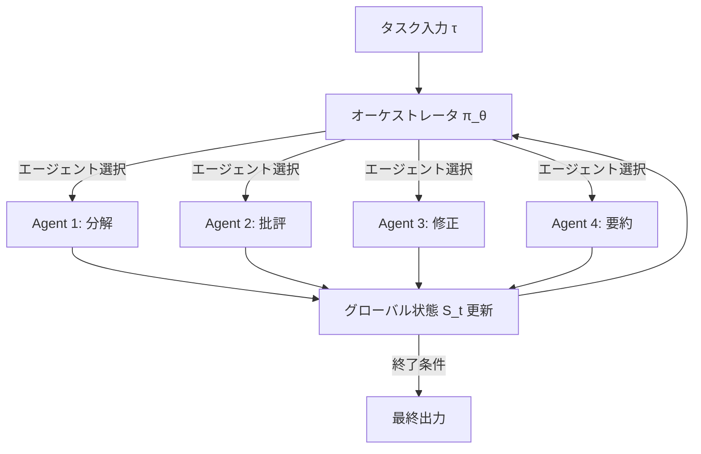
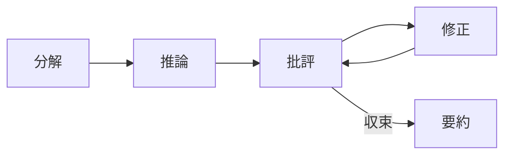

本記事は [arXiv:2505.19591](https://arxiv.org/abs/2505.19591) の解説記事です。

## 論文概要（Abstract）

本論文は、LLMベースのマルチエージェントシステムにおけるオーケストレーション（エージェント間の調整・制御）を強化学習で最適化する「Puppeteer」フレームワークを提案している。著者らは、中央オーケストレータ（puppeteer）がタスクの状態に応じて動的にエージェント（puppets）を選択・活性化する方式を採用し、REINFORCEアルゴリズムで方策を学習する。NeurIPS 2025に採択された本論文では、静的なトポロジーに基づく既存手法と比較して性能向上とトークン消費削減を同時に達成したと報告されている。

この記事は [Zenn記事: Semantic Kernel v1.44×Pydantic Structured Outputで型安全AIエージェントを構築する](https://zenn.dev/0h_n0/articles/9c3ea7a3879be1) の深掘りです。Zenn記事で紹介したSemantic Kernelのマルチエージェントオーケストレーション（Sequential、Concurrent、Handoff、Group Chat）が、学術研究の観点からどのように発展・最適化されうるかを理解するための重要な論文です。

## 情報源

- **会議名**: NeurIPS 2025（The Thirty-ninth Annual Conference on Neural Information Processing Systems）
- **年**: 2025
- **URL**: [https://arxiv.org/abs/2505.19591](https://arxiv.org/abs/2505.19591)
- **著者**: Yufan Dang, Chen Qian, Xueheng Luo, Jingru Fan, Zihao Xie, Ruijie Shi, Weize Chen, Cheng Yang, Xiaoyin Che, Ye Tian, Xuantang Xiong, Lei Han, Zhiyuan Liu, Maosong Sun
- **発表形式**: NeurIPS 2025 採択

## カンファレンス情報

**NeurIPS（Neural Information Processing Systems）について**:
NeurIPSは機械学習・人工知能分野の最高峰会議の1つであり、2025年は12月にバンクーバーで開催された。採択率は例年25%前後であり、本論文は計算言語学（cs.CL）、人工知能（cs.AI）、マルチエージェントシステム（cs.MA）の3分野にまたがる研究として採択されている。

## 技術的詳細（Technical Details）

### Puppeteerフレームワークの設計

Puppeteerフレームワークは、マルチエージェント協調を**逐次意思決定問題**として定式化する。各タイムステップ$t$において、オーケストレータ方策$\pi_\theta$がグローバル状態$S_t$とタスク仕様$\tau$に基づいてエージェント$a_t$を選択する。

$$
a_t \sim \pi_\theta(a \mid S_t, \tau), \quad a_t \in \mathcal{A}
$$

ここで、$\mathcal{A}$はエージェント集合、$\theta$は方策パラメータである。

選択されたエージェント$a_t$が出力$o_t$を生成し、グローバル状態が更新される。

$$
o_t = f_{a_t}(s_t(a_t), S_t)
$$

$$
S_{t+1} = \Phi(S_t, o_t)
$$

ここで、$f_{a_t}$はエージェント$a_t$の推論関数、$s_t(a_t)$はエージェント固有の状態、$\Phi$は状態遷移関数である。

著者らはこの定式化がマルコフ性を満たすことを示し、方策勾配最適化が適用可能であることを証明している。



### 強化学習による方策最適化

オーケストレータ方策はREINFORCEアルゴリズムで最適化される。目的関数は以下の通りである。

$$
J(\theta) = \mathbb{E}_{\pi_\theta}\left[R(\tau)\right]
$$

報酬関数$R_t$は解の品質と計算コストのバランスを取る設計となっている。

$$
R_t = \begin{cases}
r - \lambda \cdot C_T & \text{if terminal} \\
\gamma \cdot R_{t+1} - \lambda \cdot C_t & \text{otherwise}
\end{cases}
$$

ここで、
- $r$: タスクの最終的な正解/不正解に基づく報酬
- $\lambda$: コストペナルティ係数
- $C_t = F \cdot \log(1 + t/\varphi)$: トークン消費に対する対数コストペナルティ
- $\gamma$: 割引率
- $T$: エピソードの終了タイムステップ

対数コストペナルティ$C_t$は、エピソードの初期ステップでの探索を許容しつつ、後半での過剰なトークン消費を抑制する設計となっている。著者らはこの設計により「性能向上とトークン消費削減の同時達成」を実現したと主張している。

### エージェント構成

Puppeteerフレームワークでは13種類のエージェントが定義されており、以下のカテゴリに分類される。

**ツール使用エージェント**:
- ファイル読み取り
- Web検索
- コード実行

**推論パターンエージェント**:
- 分解（Decomposition）: タスクをサブタスクに分割
- 批評（Critique）: 出力の検証・評価
- 反省（Reflection）: 自己評価と改善方針の策定
- 修正（Modification）: 批評に基づく出力の改善
- 要約（Summarization）: 結果の集約

各エージェントはロール固有のプロンプトを持ち、例えばCriticAgentは「批評と検証の専門家」として定義される。

### Semantic Kernelのオーケストレーションとの対応

Puppeteerの設計をSemantic Kernelのオーケストレーションパターンと対比すると、以下のように位置づけられる。

| Semantic Kernel | Puppeteer | 対応関係 |
|----------------|-----------|---------|
| Sequential | 固定シーケンス | Puppeteerは動的シーケンスに拡張 |
| Concurrent | 並列実行 | Puppeteerは選択的並列に拡張 |
| Handoff | エージェント間委譲 | Puppeteerは学習ベースの委譲 |
| Group Chat | 議論型 | Puppeteerの循環的構造に対応 |

Semantic Kernelの各パターンは**静的なトポロジー**（事前に定義された実行順序）に基づくのに対し、Puppeteerは**動的なトポロジー**（強化学習で学習された実行順序）を採用する。

## 実装のポイント（Implementation）

### Semantic Kernelでの概念的実装

Puppeteerの設計思想をSemantic Kernelで概念的に実装する場合、以下のようなパターンが考えられる。

```python
from semantic_kernel.agents import ChatCompletionAgent
from semantic_kernel.connectors.ai.open_ai import AzureChatCompletion

service = AzureChatCompletion()

agents = {
    "decomposer": ChatCompletionAgent(
        service=service,
        name="Decomposer",
        instructions="タスクをサブタスクに分解してください。",
    ),
    "critic": ChatCompletionAgent(
        service=service,
        name="Critic",
        instructions="出力を批評し、問題点を指摘してください。",
    ),
    "modifier": ChatCompletionAgent(
        service=service,
        name="Modifier",
        instructions="批評に基づいて出力を修正してください。",
    ),
    "summarizer": ChatCompletionAgent(
        service=service,
        name="Summarizer",
        instructions="結果を要約してください。",
    ),
}
```

Puppeteerの核心はオーケストレータ方策$\pi_\theta$の学習にあるが、Semantic Kernelの現行APIではこの部分をカスタム実装する必要がある。Group Chatオーケストレーションの`selection_strategy`を拡張することで、学習済み方策に基づくエージェント選択を実現できる可能性がある。

### 強化学習の計算コスト

著者らは、方策の学習に8台のNVIDIA A800 GPUで2〜6時間を要したと報告している。オンライン勾配更新をLLM推論と交互に実行するため、推論時検索ベースの手法とは根本的に異なるリソース消費パターンとなる。

## 実験結果（Results）

### ベンチマーク性能

著者らは、閉ドメイン（GSM-Hard, MMLU-Pro）と開ドメイン（SRDD, CommonGen-Hard）の4つのベンチマークで実験を行っている。

**モデル構成**:
- **Titan空間**: GPT-4系、Claude-3、Gemini-1.5、Qwen-72B、LLaMA-405Bなどの大規模モデル
- **Mimas空間**: 7B〜14Bパラメータの小規模モデル

**主要な実験結果（著者らの報告による）**:

| 構成 | 初期スコア | 学習後スコア | 改善 |
|------|-----------|------------|------|
| Titan空間 | 0.6893 | 0.7731 | +0.0838 |
| Mimas空間 | 0.5068 | 0.6147 | +0.1079 |

**比較手法**: Self-Refine、AFlow、MacNet、EvoAgentなどの既存手法と比較し、多くのベンチマークで優位性が報告されている。

### 効率性パラドクス

著者らが報告している注目すべき発見は「効率性パラドクス」である。学習が進むにつれて、多くのタスクでトークン消費が**減少**している。これは通常の性能/効率トレードオフとは逆の傾向であり、オーケストレータが不要なエージェント呼び出しを削減する方策を学習したことを示唆している。

### 創発的構造

学習済みのオーケストレーション方策を分析したところ、以下の2つの創発的現象が報告されている。

**1. コンパクション（Compaction）**: 学習が進むにつれてエージェント間通信グラフの密度が増加し、高性能な「ハブ」エージェントに通信が集中する。

**2. 循環性（Cyclicality）**: 線形的な実行パスではなく、循環的なトポロジーが優勢になる。これは「生成→批評→修正→再批評」のような再帰的な改善サイクルに対応し、情報の再利用を可能にする。



この循環的構造は、Semantic KernelのGroup Chatオーケストレーションで`termination_strategy`と組み合わせることで類似のパターンを実現できる可能性がある。

## 実運用への応用（Practical Applications）

### Semantic Kernelでの応用可能性

Puppeteerの知見は、Semantic Kernelのマルチエージェントオーケストレーション設計に以下の示唆を与える。

**動的エージェント選択**: 現行のSemantic Kernelでは、SequentialやConcurrentのパターンが事前に固定される。Puppeteerの知見に基づき、タスクの特性に応じてオーケストレーションパターンを動的に切り替えるメタオーケストレータの設計が有効である。

**コスト意識のオーケストレーション**: Puppeteerの対数コストペナルティは、API呼び出しコストが直接的な制約となるプロダクション環境で重要な設計指針である。各エージェント呼び出しのトークンコストを監視し、費用対効果の低い呼び出しを自動的に抑制する機構が有用である。

**批評・修正サイクルの組み込み**: Puppeteerで創発的に獲得された循環的構造は、「生成→批評→修正」のイテレーティブな改善パターンとして、Structured Outputの品質向上に応用できる。

### プロダクション環境での制約

- **レイテンシ**: マルチエージェントオーケストレーションは逐次的なAPI呼び出しを伴うため、レイテンシが累積する。Puppeteerの効率性パラドクス（不要な呼び出し削減）は、この問題への有効なアプローチを示唆している
- **コスト**: エージェント数に比例してAPI呼び出しコストが増加する。Semantic Kernelの`ConcurrentOrchestration`では並列実行により壁時計時間は短縮されるが、総コストは変わらない点に注意が必要
- **デバッグ困難性**: 動的オーケストレーションは実行パスが予測困難であり、OpenTelemetryによるトレーシングが不可欠

## 関連研究（Related Work）

- **AFlow (Wang et al., 2024)**: LLMを用いたワークフロー自動設計。コードベースのワークフローをモンテカルロ木探索で最適化。Puppeteerはエージェント選択を方策勾配で直接最適化する点で異なる
- **EvoAgent (Yuan et al., 2024)**: 進化的アルゴリズムでエージェントを動的に生成。Puppeteerはエージェント集合を固定し、オーケストレーション方策のみを学習する点で異なる
- **MacNet (Qian et al., 2024)**: DAG構造のマルチエージェントネットワーク。位相的探索で協調パターンを発見。Puppeteerは強化学習ベースの動的選択を採用

## まとめと今後の展望

Puppeteerフレームワークは、マルチエージェントオーケストレーションを強化学習で最適化する新しいアプローチとして、NeurIPS 2025に採択された。

Semantic Kernelユーザーにとっての重要な知見:
- 静的なオーケストレーションパターン（Sequential, Concurrent等）は出発点として有効だが、タスク適応的な動的オーケストレーションがさらなる性能向上を達成できる
- 「効率性パラドクス」は、適切なオーケストレーション設計により性能とコストを同時に改善できることを示唆している
- 循環的な「批評→修正」サイクルは、Structured Output品質の自動改善メカニズムとして有望

著者らは今後の方向として、粗粒度の最終出力報酬に代わるステップレベルの報酬設計、タスク適応的なエージェント集合の動的構成、エージェント間インタラクションの安定化プロトコルを挙げている。

## 参考文献

- **arXiv**: [https://arxiv.org/abs/2505.19591](https://arxiv.org/abs/2505.19591)
- **Related Zenn article**: [https://zenn.dev/0h_n0/articles/9c3ea7a3879be1](https://zenn.dev/0h_n0/articles/9c3ea7a3879be1)

---

> この記事はAI（Claude Code）により自動生成されました。内容の正確性については原論文もご確認ください。
