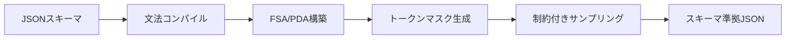

本記事は [arXiv:2501.10868](https://arxiv.org/abs/2501.10868) の解説記事です。

## 論文概要（Abstract）

JSONSchemaBenchは、LLMの構造化出力（Structured Output）を体系的に評価するための初の大規模ベンチマークである。著者らは10,000件の実世界JSONスキーマを10のデータセットに整理し、Guidance・Outlines・Llamacpp・XGrammar・OpenAI・Geminiの6フレームワークを「効率」「カバレッジ」「品質」の3次元で評価している。

この記事は [Zenn記事: Semantic Kernel v1.44×Pydantic Structured Outputで型安全AIエージェントを構築する](https://zenn.dev/0h_n0/articles/9c3ea7a3879be1) の深掘りです。Zenn記事で紹介したSemantic Kernelの`response_format`によるStructured Outputが、内部的にどのような制約付きデコーディング技術で実現されているか、その性能特性と限界を理解するための基盤となる論文です。

## 情報源

- **arXiv ID**: 2501.10868
- **URL**: [https://arxiv.org/abs/2501.10868](https://arxiv.org/abs/2501.10868)
- **著者**: Saibo Geng, Hudson Cooper, Michał Moskal, Samuel Jenkins, Julian Berman, Nathan Ranchin, Robert West, Eric Horvitz, Harsha Nori
- **発表年**: 2025（v1: 2025年1月18日、v3: 2025年2月27日）
- **分野**: cs.CL, cs.AI

## 背景と動機（Background & Motivation）

LLMの出力をJSONなどの構造化フォーマットに準拠させる「構造化出力」は、エージェントアプリケーションやパイプライン統合において不可欠な技術となっている。Semantic Kernelの`response_format`にPydanticモデルを指定する機能も、この技術の上に成り立つ。

しかし、構造化出力を実現するフレームワークは複数存在し、それぞれの性能特性が異なるにもかかわらず、統一的なベンチマークが存在しなかった。著者らはこの問題に対し、以下の課題を指摘している。

- 既存の評価は特定のスキーマやタスクに限定されており、一般化が困難
- フレームワーク間の比較が公平に行われていない
- 制約付きデコーディング（Constrained Decoding）がモデルの出力品質に与える影響が十分に調査されていない

JSONSchemaBenchはこれらのギャップを埋めるために設計された体系的ベンチマークである。

## 主要な貢献（Key Contributions）

- **貢献1**: 10,000件の実世界JSONスキーマから成るベンチマークデータセットの構築。Draft2020-12標準に準拠し、trivialからultraまでの複雑度レベルを網羅
- **貢献2**: 効率（Efficiency）・カバレッジ（Coverage）・品質（Quality）の3次元評価フレームワークの提案
- **貢献3**: 6つの主要フレームワークに対する包括的な比較実験と、障害パターンの体系的な分析

## 技術的詳細（Technical Details）

### 制約付きデコーディングの原理

構造化出力の核心技術は「制約付きデコーディング（Constrained Decoding）」である。通常のLLMデコーディングでは、各ステップで語彙$V$全体から次トークンを選択する。

$$
x_t = \arg\max_{v \in V} p(v \mid x_{<t}; \theta)
$$

ここで、$x_t$は時刻$t$に生成されるトークン、$x_{<t}$はそれまでに生成されたトークン列、$\theta$はモデルパラメータである。

制約付きデコーディングでは、JSONスキーマ$S$から導出される有限状態オートマトン（FSA）またはプッシュダウンオートマトン（PDA）を用いて、各ステップの許容トークン集合$V_t^S \subseteq V$を計算する。

$$
x_t = \arg\max_{v \in V_t^S} p(v \mid x_{<t}; \theta)
$$

$V_t^S$はスキーマ$S$と現在の解析状態に基づくトークンマスクで、スキーマに違反するトークンの確率を0に設定することで、出力がスキーマに必ず準拠することを保証する。



### ベンチマーク設計

JSONSchemaBenchは10のデータセットから構成される。

| データセット | スキーマ数 | 複雑度 | ドメイン |
|-------------|-----------|--------|---------|
| GlaiveAI-2K | 2,000 | Trivial-Simple | 関数呼び出しシグネチャ |
| GitHub Trivial | 500 | Trivial | GitHub API |
| GitHub Simple | 500 | Simple | GitHub構成 |
| GitHub Moderate | 500 | Moderate | 複合構造 |
| GitHub Complex | 500 | Complex | ネスト構造 |
| GitHub Ultra | 500 | Ultra | 高度な制約 |
| Kubernetes | 1,500 | Complex-Ultra | K8sマニフェスト |
| Snowplow | 1,000 | Moderate | 分析スキーマ |
| WashPost ANS | 500 | Complex | ニュース仕様 |
| JSON Schema Store | 2,000 | Various | 汎用 |

スキーマはJSON Schema Draft2020-12標準に基づいてバリデーションされ、クリーニングと重複排除の前処理を経ている。複雑度の分類はプロパティ数・ネスト深度・制約型の組み合わせで自動判定される。

### 評価の3次元

**1. 効率（Efficiency）**

著者らは3つの効率指標を定義している。

- **GCT（Grammar Compilation Time）**: JSONスキーマからオートマトンへの変換時間
- **TTFT（Time To First Token）**: スキーマ設定から最初のトークン生成までの遅延
- **TPOT（Time Per Output Token）**: トークン1個あたりの生成時間

論文Table 2より、各フレームワークのTPOTは以下の通り報告されている。

| フレームワーク | TPOT (ms/token) | 備考 |
|---------------|-----------------|------|
| Guidance | 6.37–9.47 | トークン加速機構あり |
| LM-only (制約なし) | 15.32–16.68 | ベースライン |
| Llamacpp | 27.22–29.98 | Grammar拡張 |
| Outlines | 30.33–46.57 | FSMベース |

著者らは「制約付きデコーディングは非制約デコーディングと比較して最大50%の高速化を達成できる」と報告している。これはトークン加速（token acceleration）と呼ばれる手法で、スキーマ制約により確定的に決まるトークン（例: JSONの`{`や`"`）をLLM推論なしで直接出力できるためである。

**2. カバレッジ（Coverage）**

カバレッジは「宣言的カバレッジ」「経験的カバレッジ」「理論的カバレッジ」の3層で測定される。

- **宣言的カバレッジ**: フレームワークが公式にサポートを宣言するスキーマ制約の範囲
- **経験的カバレッジ**: 実際にスキーマをコンパイルし、有効な出力を生成できたスキーマの割合
- **理論的カバレッジ**: 内部パーサーの設計から導出される理論上の最大カバレッジ

論文Table 4より、Guidanceが8データセット中6つで最高の経験的カバレッジを達成し、最良フレームワークと最悪フレームワークの間で対応スキーマ数に2倍の差があると報告されている。

**3. 品質（Quality）**

制約付きデコーディングがモデルの推論品質に与える影響を、Last Letter・Shuffle Objects・GSM8Kなどの推論タスクで測定している。著者らの実験では、制約付きデコーディングにより推論精度が最大4%向上したと報告されている。

### 障害分析

著者らはJSON Schema Test Suiteを用いた体系的な障害分析を行い、2つの障害パターンを特定している。

- **過制約エラー（Over-constrained）**: 有効な出力をブロックしてしまう。Outlines・Llamacppで顕著
- **欠制約エラー（Under-constrained）**: 無効な出力を許可してしまう。XGrammarで観測

この分析は、Semantic Kernelのようなアプリケーションフレームワークがどの制約付きデコーディングエンジンを選択するかに直接影響する重要な知見である。

## 実装のポイント（Implementation）

### Pydanticモデルとスキーマ生成

Semantic Kernelの`response_format`にPydanticモデルを指定すると、内部的にはPydanticの`model_json_schema()`メソッドでJSONスキーマが生成される。このスキーマがOpenAI APIに送信され、制約付きデコーディングが適用される。

```python
from pydantic import BaseModel, Field

class ReviewAnalysis(BaseModel):
    summary: str = Field(description="要約")
    sentiment: str = Field(description="感情")
    confidence: float = Field(ge=0.0, le=1.0)

schema = ReviewAnalysis.model_json_schema()
```

JSONSchemaBenchの知見に基づくと、以下の点に注意が必要である。

- **スキーマ複雑度の管理**: ネスト深度が深いスキーマほどコンパイル時間が増大する。プロダクション環境ではフラットなスキーマ設計が推奨される
- **初回レイテンシの考慮**: スキーマコンパイルが初回リクエストで発生するため、ウォームアップ戦略が有効
- **`Optional`型の活用**: 欠制約エラーを防ぐため、省略可能フィールドには明示的に`Optional`を使い、`default=None`を設定する

### スキーマ互換性の確認

JSONSchemaBenchの結果から、フレームワークごとに対応するスキーマ制約が異なることが明らかになっている。OpenAI APIでは`additionalProperties: false`が必須であり、再帰的スキーマへの対応にも制限がある。

```python
class SafeSchema(BaseModel):
    """OpenAI Structured Outputsと互換性の高いスキーマ設計"""
    model_config = {"extra": "forbid"}

    name: str = Field(description="名前")
    items: list[str] = Field(default_factory=list, description="項目リスト")
```

`model_config = {"extra": "forbid"}`を設定することで、Pydanticが`additionalProperties: false`を含むスキーマを生成し、OpenAIのStructured Outputsとの互換性が確保される。

## Production Deployment Guide

### AWS実装パターン（コスト最適化重視）

Structured Outputを活用したAIエージェントのAWS構成について、トラフィック量別の推奨構成を以下に示す。

| 規模 | 月間リクエスト | 推奨構成 | 月額コスト | 主要サービス |
|------|--------------|---------|-----------|------------|
| **Small** | ~3,000 (100/日) | Serverless | $50–150 | Lambda + Bedrock + DynamoDB |
| **Medium** | ~30,000 (1,000/日) | Hybrid | $300–800 | Lambda + ECS Fargate + ElastiCache |
| **Large** | 300,000+ (10,000/日) | Container | $2,000–5,000 | EKS + Karpenter + EC2 Spot |

**Small構成の詳細**（月額$50–150）:
- **Lambda**: 1GB RAM, 60秒タイムアウト（$20/月）
- **Bedrock**: Claude 3.5 Haiku, Prompt Caching有効（$80/月）
- **DynamoDB**: On-Demand, スキーマキャッシュ用（$10/月）
- **CloudWatch**: 基本監視（$5/月）
- **API Gateway**: REST API（$5/月）

**コスト削減テクニック**:
- Bedrock Batch APIで非リアルタイム処理を50%削減
- Prompt Cachingで同一スキーマの再コンパイルを回避し30–90%削減
- Spot Instancesの活用で最大90%削減（EKS + Karpenter構成）

**コスト試算の注意事項**: 上記は2026年9月時点のAWS ap-northeast-1（東京）リージョン料金に基づく概算値です。実際のコストはトラフィックパターンやバースト使用量により変動します。最新料金は[AWS料金計算ツール](https://calculator.aws/)で確認してください。

### Terraformインフラコード

**Small構成（Serverless）: Lambda + Bedrock + DynamoDB**

```hcl
module "vpc" {
  source  = "terraform-aws-modules/vpc/aws"
  version = "~> 5.0"
  name    = "structured-output-vpc"
  cidr    = "10.0.0.0/16"
  azs     = ["ap-northeast-1a", "ap-northeast-1c"]
  private_subnets = ["10.0.1.0/24", "10.0.2.0/24"]
  enable_nat_gateway   = false
  enable_dns_hostnames = true
}

resource "aws_iam_role" "lambda_bedrock" {
  name = "lambda-structured-output-role"
  assume_role_policy = jsonencode({
    Version = "2012-10-17"
    Statement = [{
      Action    = "sts:AssumeRole"
      Effect    = "Allow"
      Principal = { Service = "lambda.amazonaws.com" }
    }]
  })
}

resource "aws_iam_role_policy" "bedrock_invoke" {
  role = aws_iam_role.lambda_bedrock.id
  policy = jsonencode({
    Version = "2012-10-17"
    Statement = [{
      Effect   = "Allow"
      Action   = ["bedrock:InvokeModel", "bedrock:InvokeModelWithResponseStream"]
      Resource = "arn:aws:bedrock:ap-northeast-1::foundation-model/anthropic.claude-3-5-haiku*"
    }]
  })
}

resource "aws_lambda_function" "structured_output_handler" {
  filename      = "lambda.zip"
  function_name = "structured-output-handler"
  role          = aws_iam_role.lambda_bedrock.arn
  handler       = "index.handler"
  runtime       = "python3.12"
  timeout       = 60
  memory_size   = 1024
  environment {
    variables = {
      BEDROCK_MODEL_ID    = "anthropic.claude-3-5-haiku-20241022-v1:0"
      DYNAMODB_TABLE      = aws_dynamodb_table.schema_cache.name
      ENABLE_PROMPT_CACHE = "true"
    }
  }
}

resource "aws_dynamodb_table" "schema_cache" {
  name         = "json-schema-cache"
  billing_mode = "PAY_PER_REQUEST"
  hash_key     = "schema_hash"
  attribute {
    name = "schema_hash"
    type = "S"
  }
  ttl {
    attribute_name = "expire_at"
    enabled        = true
  }
}
```

### セキュリティベストプラクティス

- IAMロール: 最小権限の原則（Bedrock InvokeModelのみ許可）
- ネットワーク: Lambda VPC内配置、パブリックサブネット不使用
- シークレット: Secrets Manager使用、環境変数ハードコード禁止
- 暗号化: DynamoDB KMS暗号化、S3 SSE-KMS

### 運用・監視設定

```sql
-- CloudWatch Logs Insights: スキーマコンパイル時間の異常検知
fields @timestamp, schema_complexity, compilation_time_ms
| stats avg(compilation_time_ms) as avg_compile, pct(compilation_time_ms, 99) as p99_compile by bin(1h)
| filter p99_compile > 500
```

```python
import boto3

cloudwatch = boto3.client('cloudwatch')
cloudwatch.put_metric_alarm(
    AlarmName='structured-output-latency-spike',
    ComparisonOperator='GreaterThanThreshold',
    EvaluationPeriods=2,
    MetricName='Duration',
    Namespace='AWS/Lambda',
    Period=300,
    Statistic='Average',
    Threshold=30000,
    AlarmDescription='Structured Output Lambda実行時間異常'
)
```

### コスト最適化チェックリスト

- [ ] ~100 req/日 → Lambda + Bedrock（Serverless）$50–150/月
- [ ] ~1,000 req/日 → ECS Fargate + Bedrock（Hybrid）$300–800/月
- [ ] 10,000+ req/日 → EKS + Spot Instances（Container）$2,000–5,000/月
- [ ] Bedrock Batch API使用で50%削減（非リアルタイム処理）
- [ ] Prompt Caching有効化でスキーマ再コンパイル回避
- [ ] Lambda: メモリサイズ最適化（CloudWatch Insights分析）
- [ ] DynamoDB: TTL設定で古いキャッシュ自動削除
- [ ] AWS Budgets: 月額予算設定（80%で警告）
- [ ] Cost Anomaly Detection: 自動異常検知有効化
- [ ] タグ戦略: 環境別（dev/staging/prod）でコスト可視化

## 実験結果（Results）

### フレームワーク間の性能比較

論文Table 2およびTable 4より、主要な実験結果を以下にまとめる。

**効率性**: Guidanceが全フレームワーク中で最も効率的で、TPOTは6.37–9.47 ms/tokenと報告されている。これは制約なしのベースライン（15.32–16.68 ms/token）よりも高速であり、トークン加速機構の有効性を示している。Outlines（30.33–46.57 ms/token）やLlamacpp（27.22–29.98 ms/token）はベースラインより遅延が増加しており、コンパイル方式の違いが性能に直結することを示唆している。

**カバレッジ**: Guidanceが8データセット中6つで最高の経験的カバレッジを達成している。最良と最悪のフレームワーク間でサポートするスキーマ数に約2倍の差がある。

**品質**: 推論タスク（GSM8K等）において、制約付きデコーディングにより精度が最大4%向上している。著者らは「制約がモデルの注意を有効なトークン空間に集中させることで、推論品質が改善される」と分析している。

### 障害パターンの分布

| フレームワーク | 過制約エラー率 | 欠制約エラー率 |
|---------------|--------------|--------------|
| Guidance | 低 | 低 |
| Outlines | 高 | 低 |
| Llamacpp | 高 | 低 |
| XGrammar | 低 | 高 |

過制約エラーは「有効な出力をブロックする」障害で、ユーザー体験を損なう。欠制約エラーは「無効な出力を許可する」障害で、ダウンストリームのバリデーション失敗につながる。

## 実運用への応用（Practical Applications）

JSONSchemaBenchの知見は、Semantic Kernelを用いた構造化出力の設計に直接活用できる。

**スキーマ設計戦略**: ベンチマーク結果から、フラットで明示的なスキーマが最も安定して動作することが判明している。Pydanticモデルの設計では、ネスト深度を3階層以内に抑え、`anyOf`/`oneOf`の使用を避けることが推奨される。

**フレームワーク選択**: OpenAI APIのStructured Outputs（Semantic Kernelが内部で使用）は、カバレッジと品質のバランスが良い。ただし、`additionalProperties: false`が必須である制約を理解し、Pydanticモデル側で`model_config = {"extra": "forbid"}`を設定する必要がある。

**レイテンシ最適化**: 初回スキーマコンパイルのレイテンシを考慮し、頻用スキーマのウォームアップ戦略を導入することが推奨される。DynamoDBやElastiCacheにコンパイル済みスキーマをキャッシュするパターンが有効である。

## 関連研究（Related Work）

- **Outlines (Willard & Louf, 2023)**: FSM（有限状態マシン）ベースの構造化生成ライブラリ。JSONスキーマを正規表現に変換し、FSMでデコーディングを制御する。JSONSchemaBenchではカバレッジで劣るものの、広く採用されている
- **XGrammar (Dong et al., 2024)**: PDAベースの高速構造化生成エンジン。コンテキストフリー文法を直接サポートするが、JSONSchemaBenchでは欠制約エラーが報告されている
- **llguidance (Microsoft, 2024)**: Rustベースの高性能パーサーで、Earleyパーサーを用いてトークンあたり約50マイクロ秒を実現。Guidanceフレームワークの内部エンジンとして使用されている

## まとめと今後の展望

JSONSchemaBenchは、LLMの構造化出力を体系的に評価するための重要なベンチマークである。著者らは、制約付きデコーディングが「効率と品質を同時に改善できる」ことを実証しつつ、フレームワーク間の性能差が依然として大きいことを明らかにした。

Semantic Kernelユーザーにとっては、Pydanticモデルのスキーマ設計が構造化出力の品質と効率に直結するという知見が重要である。フラットなスキーマ設計、`additionalProperties: false`の明示的な指定、初回コンパイルレイテンシへの対策が、プロダクション環境での安定運用に不可欠である。

今後の研究方向として、著者らはスキーマ複雑度と品質の関係の詳細な分析、動的スキーマへの対応、マルチモーダル出力への拡張を挙げている。

## 参考文献

- **arXiv**: [https://arxiv.org/abs/2501.10868](https://arxiv.org/abs/2501.10868)
- **GitHub**: [https://github.com/guidance-ai/jsonschemabench](https://github.com/guidance-ai/jsonschemabench)
- **Related Zenn article**: [https://zenn.dev/0h_n0/articles/9c3ea7a3879be1](https://zenn.dev/0h_n0/articles/9c3ea7a3879be1)

---

> この記事はAI（Claude Code）により自動生成されました。内容の正確性については原論文もご確認ください。
