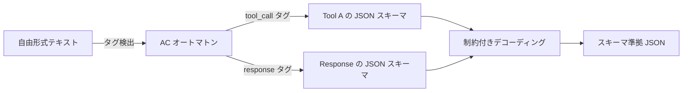

本記事は [arXiv:2601.04426](https://arxiv.org/abs/2601.04426) の解説記事です。

## 論文概要（Abstract）

XGrammar-2は、LLMエージェントの動的構造化生成（Dynamic Structured Generation）に特化した高性能エンジンである。著者らは、ツール呼び出し（Tool Calling）やレスポンスプロトコルなどのエージェント向けワークロードでは、リクエストごとにスキーマが変化する「動的性」が本質的課題であると指摘している。この課題に対し、TagDispatch機構とCross-Grammar Cacheという2つの技術革新を導入し、先行研究比で6倍以上のコンパイル高速化を達成したと報告されている。

この記事は [Zenn記事: Semantic Kernel v1.44×Pydantic Structured Outputで型安全AIエージェントを構築する](https://zenn.dev/0h_n0/articles/9c3ea7a3879be1) の深掘りです。Semantic Kernelの`@kernel_function`プラグインを用いたFunction CallingやStructured Outputの内部で、構造化生成エンジンがどのように動作し、性能を最適化しているかを理解するための重要な論文です。

## 情報源

- **arXiv ID**: 2601.04426
- **URL**: [https://arxiv.org/abs/2601.04426](https://arxiv.org/abs/2601.04426)
- **著者**: Linzhang Li, Yixin Dong, Guanjie Wang, Ziyi Xu, Alexander Jiang, Tianqi Chen
- **発表年**: 2026（v1: 2026年1月7日、v4: 2026年8月5日）
- **分野**: cs.AI

## 背景と動機（Background & Motivation）

LLMエージェントは、外部ツールを呼び出すFunction Calling機能を通じて、検索・計算・データベースアクセスなどの操作を実行する。Semantic Kernelでは`@kernel_function`デコレータで定義されたプラグイン関数がこの役割を担う。

従来の構造化生成エンジン（XGrammar-1、Outlines等）は「静的な構造化生成」を想定していた。つまり、リクエストの開始時にJSONスキーマが確定し、生成全体を通じて変わらないケースを主眼としていた。しかし、著者らはエージェントワークロードでは2種類の動的性が問題になると指摘している。

1. **リクエスト内動的性（Intra-request dynamism）**: 1つの生成内でテキストとJSONが切り替わるケース。例えば、LLMが自然言語の思考過程を出力した後にツール呼び出しのJSONを生成する場面
2. **リクエスト間動的性（Inter-request dynamism）**: リクエストごとに利用可能なツールセットが変化するケース。Semantic Kernelのプラグインが動的に登録・解除される場面に相当

これらの動的性に対し、従来のエンジンはリクエストごとにスキーマの再コンパイルが必要となり、コンパイルオーバーヘッドがボトルネックとなっていた。

## 主要な貢献（Key Contributions）

- **貢献1**: TagDispatch機構 — リクエスト内の動的な構造切り替えを効率的に処理するAho-Corasickオートマトンベースのディスパッチ機構
- **貢献2**: Cross-Grammar Cache — リクエスト間でサブ構造レベルのトークンマスクキャッシュを再利用する階層的ハッシュ手法
- **貢献3**: Earleyパーサーベースの適応的キャッシュと、JITコンパイル・繰り返し状態圧縮による追加の効率改善

## 技術的詳細（Technical Details）

### TagDispatch機構

TagDispatchは、自由形式テキストとJSON構造化出力の間の切り替えを効率化する機構である。

従来手法では、テキストとJSONの混在出力をEBNF文法として記述していた。しかし、この方法ではテキスト部分の文法が肥大化し、コンパイル時間が増大する。

TagDispatchは異なるアプローチを採る。Aho-Corasick（AC）オートマトンを用いてテキスト中のタグ文字列（例: `<tool_call>`）を検出し、タグの検出時点で対応するサブ文法（JSONスキーマ由来のFSA）にデコーディングを切り替える。



形式的には、TagDispatchは以下のように定義される。生成中の状態$s$が自由テキストモードのとき、許容トークン集合は語彙全体$V$からタグプレフィクスを考慮した集合となる。タグ$\tau_k$が完全にマッチした時点で、対応するサブ文法$G_k$のFSAに遷移する。

$$
V_t = \begin{cases}
V \setminus \text{invalid\_prefixes}(\tau_1, \ldots, \tau_K) & \text{if } s = \text{free} \\
V_t^{G_k} & \text{if } s = \text{grammar}_k
\end{cases}
$$

ここで、$V_t^{G_k}$はサブ文法$G_k$に基づくトークンマスク、$K$はタグの総数である。

### Cross-Grammar Cache

Cross-Grammar Cacheは、異なるJSONスキーマ間でトークンマスクのサブ構造レベルの再利用を実現する。

エージェントアプリケーションでは、リクエストごとに利用可能なツールセットが変わるため、文法全体としては異なるが、個々のツールのJSONスキーマ（サブ構造）は共有される場合が多い。著者らはこの特性を活用し、階層的FSMハッシュ（Hierarchical FSM Hashing）を導入している。

ハッシュ関数$h$は、FSMのノード$n$に対して以下のように再帰的に計算される。

$$
h(n) = \text{hash}\left(\text{transitions}(n), \{h(n') \mid n' \in \text{children}(n)\}\right)
$$

参照グラフに沿ってボトムアップでハッシュを集約し、同一サブ構造に対して同一ハッシュを生成する。循環参照については、暫定ハッシュと洗練アルゴリズムで処理される。

著者らの実験によれば、文法全体としての一致率は0%であっても、サブ構造レベルでは71〜95%のキャッシュ再利用率を達成したと報告されている。

### Earleyパーサーベースの適応的キャッシュ

XGrammar-1ではPDA（プッシュダウンオートマトン）ベースのパーサーを使用していたが、XGrammar-2ではEarleyパーサーに移行している。Earleyパーサーの「走査可能状態（scannable states）」に焦点を当てた適応的キャッシュにより、非決定的文法に対するコンパイル効率が改善されている。

### JITコンパイルと繰り返し状態圧縮

- **JITコンパイル**: 文法コンパイルのコストをデコーディングステップ全体にわたって償却する手法
- **繰り返し状態圧縮**: JSONスキーマの`minLength`/`maxLength`パターンに対し、状態数を有界に保つ圧縮手法

## 実装のポイント（Implementation）

### Semantic KernelのFunction Callingとの関連

Semantic Kernelの`@kernel_function`で定義されたプラグイン関数は、OpenAI APIのFunction Calling機能を通じてLLMに公開される。LLMが関数を呼び出す際、引数はJSONとして構造化される必要がある。

```python
from semantic_kernel.functions import kernel_function
from typing import Annotated

class WeatherPlugin:
    @kernel_function(description="指定都市の天気を取得")
    def get_weather(
        self,
        city: Annotated[str, "都市名"],
        unit: Annotated[str, "温度単位 (celsius/fahrenheit)"] = "celsius",
    ) -> str:
        return f"{city}の天気: 晴れ, 25°C"
```

XGrammar-2のTagDispatch機構は、このようなFunction Callingにおいて、LLMが「まず思考し、次にツール呼び出しJSONを出力する」パターンを効率的に処理する。Semantic Kernelの`FunctionChoiceBehavior.Auto()`設定では、モデルがテキスト応答とFunction Callingを動的に選択するため、まさにTagDispatchが解決する「リクエスト内動的性」が発生する。

### 動的ツールセットへの対応

Semantic Kernelでは、`Kernel`にプラグインを動的に追加・削除できる。

```python
kernel = Kernel()
kernel.add_plugin(WeatherPlugin(), plugin_name="Weather")
kernel.add_plugin(CalendarPlugin(), plugin_name="Calendar")
```

この設計は、XGrammar-2のCross-Grammar Cacheが解決する「リクエスト間動的性」に直接対応する。プラグイン構成が変わっても、個々のプラグインのスキーマがキャッシュされているため、再コンパイルのオーバーヘッドが大幅に削減される。

### 性能最適化のポイント

- **スキーマの事前コンパイル**: 頻用プラグインのスキーマを起動時にコンパイルしておくことで、初回レイテンシを回避
- **サブ構造の共有設計**: 複数プラグインで共通のPydanticモデル（例: `UserInfo`, `Address`）を再利用することで、Cross-Grammar Cacheの効果を最大化
- **タグフォーマットの統一**: TagDispatchの効率を活かすため、ツール呼び出しのタグフォーマットを統一する

## Production Deployment Guide

### AWS実装パターン（コスト最適化重視）

構造化生成エンジンを含むLLMエージェントのAWSデプロイ構成を以下に示す。

| 規模 | 月間リクエスト | 推奨構成 | 月額コスト | 主要サービス |
|------|--------------|---------|-----------|------------|
| **Small** | ~3,000 (100/日) | Serverless | $50–150 | Lambda + Bedrock + DynamoDB |
| **Medium** | ~30,000 (1,000/日) | Hybrid | $300–800 | Lambda + ECS Fargate + ElastiCache |
| **Large** | 300,000+ (10,000/日) | Container | $2,000–5,000 | EKS + Karpenter + EC2 Spot |

**Medium構成の詳細**（月額$300–800）:
- **Lambda**: イベント処理（$50/月）
- **ECS Fargate**: 0.5 vCPU, 1GB RAM × 2タスク（$120/月）
- **Bedrock**: Claude 3.5 Sonnet, Batch API活用（$400/月）
- **ElastiCache Redis**: cache.t3.micro, スキーマキャッシュ用（$15/月）

**コスト削減テクニック**:
- XGrammar-2のCross-Grammar Cacheに倣い、ElastiCacheにスキーマコンパイル結果をキャッシュ
- Bedrock Batch APIで非同期処理を50%削減
- Prompt Caching有効化でシステムプロンプト固定部分を30–90%削減
- 夜間のAuto Scaling to Zero（Fargate/Lambda）

**コスト試算の注意事項**: 上記は2026年9月時点のAWS ap-northeast-1リージョン料金に基づく概算値です。最新料金は[AWS料金計算ツール](https://calculator.aws/)で確認してください。

### Terraformインフラコード

**Small構成（Serverless）: Lambda + Bedrock + DynamoDB**

```hcl
resource "aws_iam_role" "lambda_agent" {
  name = "lambda-agent-role"
  assume_role_policy = jsonencode({
    Version = "2012-10-17"
    Statement = [{
      Action    = "sts:AssumeRole"
      Effect    = "Allow"
      Principal = { Service = "lambda.amazonaws.com" }
    }]
  })
}

resource "aws_iam_role_policy" "bedrock_invoke" {
  role = aws_iam_role.lambda_agent.id
  policy = jsonencode({
    Version = "2012-10-17"
    Statement = [{
      Effect   = "Allow"
      Action   = ["bedrock:InvokeModel"]
      Resource = "arn:aws:bedrock:ap-northeast-1::foundation-model/anthropic.claude-*"
    }]
  })
}

resource "aws_lambda_function" "agent_handler" {
  filename      = "lambda.zip"
  function_name = "agent-structured-output"
  role          = aws_iam_role.lambda_agent.arn
  handler       = "index.handler"
  runtime       = "python3.12"
  timeout       = 120
  memory_size   = 1024
  environment {
    variables = {
      CACHE_TABLE = aws_dynamodb_table.schema_cache.name
    }
  }
}

resource "aws_dynamodb_table" "schema_cache" {
  name         = "agent-schema-cache"
  billing_mode = "PAY_PER_REQUEST"
  hash_key     = "grammar_hash"
  attribute {
    name = "grammar_hash"
    type = "S"
  }
  ttl {
    attribute_name = "expire_at"
    enabled        = true
  }
}
```

### セキュリティベストプラクティス

- IAMロール: Bedrock InvokeModelのみ許可、リソースレベルでモデルID指定
- ネットワーク: VPC内配置、VPCエンドポイント経由でBedrock/DynamoDBアクセス
- シークレット: Secrets Manager使用、ローテーション90日
- 暗号化: DynamoDB/S3はKMS暗号化必須

### コスト最適化チェックリスト

- [ ] ~100 req/日 → Lambda + Bedrock $50–150/月
- [ ] ~1,000 req/日 → ECS Fargate + Bedrock $300–800/月
- [ ] 10,000+ req/日 → EKS + Spot $2,000–5,000/月
- [ ] スキーマキャッシュ: DynamoDB/ElastiCacheに格納
- [ ] Bedrock Batch API: 50%削減（非リアルタイム処理）
- [ ] Prompt Caching: 30–90%削減
- [ ] AWS Budgets: 月額予算（80%警告、100%アラート）
- [ ] Cost Anomaly Detection: 有効化
- [ ] タグ戦略: env/project別コスト可視化
- [ ] 開発環境: 夜間停止設定

## 実験結果（Results）

### コンパイル性能

論文の実験結果より、XGrammar-2は先行手法と比較して以下の性能を達成したと報告されている。

| 指標 | XGrammar-2 | 先行手法比 |
|------|-----------|-----------|
| コンパイル速度 | ~10 ms | **6倍以上高速** |
| トークンあたりオーバーヘッド | ~13 μs | 低オーバーヘッド |
| エンドツーエンド遅延 | — | **約7倍高速化** |
| Cross-Grammar キャッシュ再利用率 | 71–95% | サブ構造レベル |

### 正確性

BFCL-v3（Berkeley Function Calling Leaderboard v3）を用いた正確性評価では、制約付きデコーディング適用時にスキーマ準拠率100%を達成したと著者らは報告している。Function Calling精度もモデルサイズを問わず改善が見られる。

### 対応フォーマット

XGrammar-2は以下のエージェント向けフォーマットに対応している。

- Llama Tool Callingフォーマット
- OpenAI Function Callingフォーマット
- OpenAI Harmony（チャンネルタギング）プロトコル

これらのフォーマットは、Semantic Kernelが内部で使用するOpenAI APIのFunction Calling仕様と互換性がある。

## 実運用への応用（Practical Applications）

XGrammar-2の技術は、Semantic Kernelを用いたエージェント開発に以下の示唆を与える。

**動的プラグイン管理**: Semantic Kernelの`Kernel`にプラグインを動的に追加・削除するユースケースでは、XGrammar-2のCross-Grammar Cacheの設計思想が参考になる。共通のPydanticモデルをプラグイン間で共有することで、スキーマの再利用効率が向上する。

**ツール呼び出しの遅延最適化**: `FunctionChoiceBehavior.Auto()`設定で発生するテキスト/JSON切り替えのオーバーヘッドは、TagDispatch機構で対処できる。推論フレームワーク（SGLang, vLLM）がXGrammar-2を統合しているため、セルフホストLLM環境では直接的な恩恵を受けられる。

**スキーマ設計の最適化**: Cross-Grammar Cacheの効果を最大化するためには、プラグイン間で共通のデータ型（住所、ユーザー情報等）を`BaseModel`として切り出し、参照で再利用するスキーマ設計が推奨される。

## 関連研究（Related Work）

- **XGrammar (Dong et al., 2024)**: XGrammar-2の前身。PDAベースの静的構造化生成エンジンで、MLSys 2025に採録。動的ワークロードへの対応が課題であった
- **Outlines (Willard & Louf, 2023)**: FSMベースの構造化生成ライブラリ。JSONスキーマを正規表現に変換するアプローチで、コンパイルオーバーヘッドが大きい
- **llguidance (Microsoft, 2024)**: Rustベースの高性能パーサー。Earleyパーサーでトークンあたり約50μsを実現。GuidanceフレームワークのバックエンドとしてJSONSchemaBenchで高評価を獲得

## まとめと今後の展望

XGrammar-2は、LLMエージェントの動的構造化生成における性能ボトルネックを解消する技術として重要である。TagDispatchによるリクエスト内動的性の処理と、Cross-Grammar Cacheによるリクエスト間動的性の処理は、Semantic Kernelのようなエージェントフレームワークが内部で直面する課題に直接対応している。

著者らは今後の方向として、より複雑なエージェントプロトコルへの対応、マルチモーダル構造化出力、分散推論環境でのキャッシュ共有を挙げている。Semantic Kernelユーザーにとっては、推論フレームワーク選択時にXGrammar-2の対応状況を確認することが、Function Calling性能の最適化に直結する。

## 参考文献

- **arXiv**: [https://arxiv.org/abs/2601.04426](https://arxiv.org/abs/2601.04426)
- **Related Zenn article**: [https://zenn.dev/0h_n0/articles/9c3ea7a3879be1](https://zenn.dev/0h_n0/articles/9c3ea7a3879be1)

---

> この記事はAI（Claude Code）により自動生成されました。内容の正確性については原論文もご確認ください。
