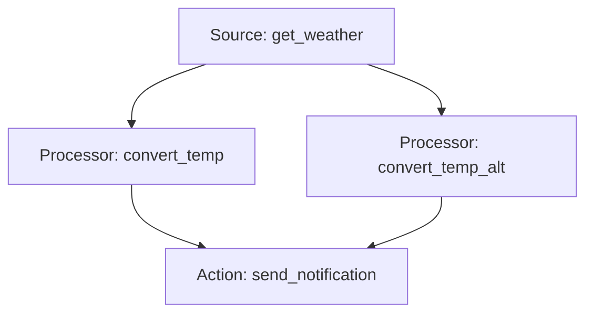

本記事は [https://arxiv.org/abs/2606.05806](https://arxiv.org/abs/2606.05806) の解説記事です。

## 論文概要（Abstract）

ToolMazeは、TIRエージェントの動的パス探索とエラー回復能力を評価するベンチマークである。タスクをDAGとしてモデル化し、トポロジカル複雑度（$\mathcal{C}$軸）とツール障害種類（$\mathcal{P}$軸）の2軸で評価空間を定義している。270ツール・2,000タスクにわたる9モデルの評価で、暗黙的障害がPRRを平均37.15%低下させ、障害回復能力がモデルスケールに対して基本タスク実行の3.66倍遅い速度でしか改善しないことが報告されている。

この記事は [Zenn記事: graphlib×LangGraphで動的DAGスケジューラを自作しエージェント並列実行を高速化する](https://zenn.dev/0h_n0/articles/acc29fce720028) の深掘りです。

## 情報源

- **arXiv ID**: 2606.05806
- **URL**: [https://arxiv.org/abs/2606.05806](https://arxiv.org/abs/2606.05806)
- **著者**: Dongsheng Zhu（Shanghai AI Lab）, Xuchen Ma, Yucheng Shen et al.
- **発表年**: 2026
- **分野**: cs.AI

## 背景と動機（Background & Motivation）

LLMエージェントがツールを呼び出してタスクを遂行するTool-Integrated Reasoning（TIR）は急速に研究が進んでいるが、実運用環境ではAPIタイムアウト、レスポンスの意味的破損、サービス恒久停止など多様な障害が発生する。著者らは、既存ベンチマーク（τ-Bench、AgentNoiseBench等）が「完全な解空間の列挙」と「障害の体系的分類」を欠いていると指摘し、ToolMazeはDAGの完全なトポロジカル順序列挙と決定論的障害注入により、障害回復能力を分離計測可能にした初のベンチマークとして提案されている。

## 主要な貢献（Key Contributions）

- **DAGベースのタスクモデル化**: タスクをSource/Processor/Actionの3種ノードからなるDAGとして構造化し、4段階のトポロジカル複雑度（$\mathcal{C}_1$--$\mathcal{C}_4$）を定義
- **2×2障害分類法**: エラーの顕在性（Explicit/Implicit）×持続性（Transient/Permanent）の4象限で障害を体系化
- **解空間の完全列挙**: 各タスクDAGについてすべての有効なトポロジカルソートを列挙し、最適経路$s^*$を含む解集合$\mathcal{S} = \{s_1, \ldots, s_k\}$を構築
- **スケーリング法則の発見**: 障害回復能力（PRR）がモデルスケールに対してタスク成功率（TSR）の3.66倍遅い速度でしか改善しないことを定量的に示した

## 技術的詳細（Technical Details）

### DAGトポロジーと複雑度（$\mathcal{C}$軸）

ToolMazeでは、各タスクを有向非巡回グラフ$G = (V, E)$として表現する。ノード$V$は3種類に分類される。

- **Sourceノード**: 外部から情報を取得するツール（例: `get_weather`）
- **Processorノード**: データを変換するツール（例: `temperature_converter`）
- **Actionノード**: 副作用を伴う外部操作（例: `send_email`）

複雑度は以下の4レベルで定義される。

- **$\mathcal{C}_1$（線形連鎖）**: 単一パスのみ。代替経路なし
- **$\mathcal{C}_2$（1対N代替）**: 障害ノードに対して単一ステップの代替が存在
- **$\mathcal{C}_3$（多対多マルチパス）**: 組合せ的な探索空間を持つ複数経路
- **$\mathcal{C}_4$（統合マルチブランチ）**: $\mathcal{C}_2$と$\mathcal{C}_3$のパターンを組み合わせた構造



上図は$\mathcal{C}_2$レベルの例であり、Processorに代替ノード（`convert_temp_alt`）が存在する。

### 障害分類法（$\mathcal{P}$軸）

著者らは、ツール障害を2つの直交する軸で分類する2×2タクソノミーを提案している。

| | **Transient（一時的）** | **Permanent（恒久的）** |
|---|---|---|
| **Explicit（明示的）** | $\mathcal{P}_1$: HTTPエラー、タイムアウト | $\mathcal{P}_2$: API恒久停止 |
| **Implicit（暗黙的）** | $\mathcal{P}_3$: 構造は正常だが意味が不正、再試行可能 | $\mathcal{P}_4$: 破損データ、恒久的に不正 |

**明示的障害**ではエラーコードが返されるため検知しやすいが、**暗黙的障害**では構造的に正常なレスポンスが返されるため意味的な誤りに気づけるかが問われる。例として、在庫数が負値を返す更新遅延（$\mathcal{P}_3$）や、永続的にゼロ値を返すキャッシュ破損（$\mathcal{P}_4$）が挙げられている。

### 評価指標

著者らは3つの指標を定義している。

**Task Success Rate（TSR）**: タスクの絶対的な完遂能力を測る。

$$
\text{TSR}_m = \frac{1}{|\mathcal{T}_m|} \sum_{\tau \in \mathcal{T}_m} \mathbb{1}_{\text{succ}}(\tau)
$$

ここで$\mathcal{T}_m$はモデル$m$のタスク集合、$\mathbb{1}_{\text{succ}}(\tau)$はタスク$\tau$の成功指示関数である。

**Perturbation Recovery Rate（PRR）**: 障害に遭遇した上で回復できた割合を計測し、障害回復能力を分離して評価する。

$$
\text{PRR}_m = \frac{\sum_{\tau} \mathbb{1}_{\text{recov}}(\tau) \cdot \mathbb{1}_{\text{pert}}(\tau)}{\sum_{\tau} \mathbb{1}_{\text{pert}}(\tau)}
$$

ここで$\mathbb{1}_{\text{pert}}(\tau)$は障害遭遇、$\mathbb{1}_{\text{recov}}(\tau)$は障害から回復しタスク完遂を示す。PRRが障害遭遇を条件とする条件付き確率である点がTSRとの違いである。

**Recovery Cost（RC）**: 回復時の不要なツール呼び出しを罰する効率指標である。

$$
\mathcal{C}_{\text{rec}}(\tau) = 1 - \frac{c^*(\tau)}{\max\{c(\tau), c^*(\tau)\}} \cdot \mathbb{1}_{\text{succ}}(\tau)
$$

ここで$c(\tau)$は実際のステップ数、$c^*(\tau)$は最適経路のステップ数。$\mathcal{C}_{\text{rec}} = 0$が最も効率的な回復を意味する。

### 解空間の列挙

各タスクDAGに対してすべての有効なトポロジカルソートを列挙し、解集合$\mathcal{S} = \{s_1, \ldots, s_k\}$を構築する。最適経路$s^*$が指定され、出力が$\mathcal{S}$内の任意経路と一致すれば成功と判定される。

```python
from typing import TypeAlias

Node: TypeAlias = str
AdjList: TypeAlias = dict[Node, list[Node]]

def enumerate_topological_sorts(dag: AdjList, nodes: list[Node]) -> list[list[Node]]:
    """DAGの全トポロジカルソートをバックトラッキングで列挙する。"""
    in_deg: dict[Node, int] = {n: 0 for n in nodes}
    for dsts in dag.values():
        for d in dsts:
            in_deg[d] += 1
    results: list[list[Node]] = []

    def _bt(order: list[Node], rem: set[Node]) -> None:
        if not rem:
            results.append(order[:])
            return
        for node in [n for n in rem if in_deg[n] == 0]:
            order.append(node); rem.remove(node)
            for s in dag.get(node, []): in_deg[s] -= 1
            _bt(order, rem)
            for s in dag.get(node, []): in_deg[s] += 1
            rem.add(node); order.pop()

    _bt([], set(nodes))
    return results
```

## 実装のポイント（Implementation）

構築パイプラインは「DAG組立 → 解空間列挙 → タスク自然言語化 → 逆検証」の4段階である。著者らは270個のツールを6ドメイン（金融・旅行・オフィス・ショッピング・IoT・一般）にわたり手動構築し、各ツールにスキーマを付与している。障害注入は決定論的で再現性が保証される。Failure-awareプロンプト（障害可能性を事前通知する指示）はPRRを最大20.8%改善するが、非障害時の性能には到達しないことが報告されている。

## Production Deployment Guide

ToolMazeの知見を活用し、ツール障害に対して耐性のあるLLMエージェントを本番環境にデプロイするためのガイドを示す。障害検知・リプランニング・回復メトリクス収集を中心に設計する。

### AWS実装パターン（コスト最適化重視）

**トラフィック量別の推奨構成**:

| 構成 | トラフィック | 主要サービス | 月額概算 |
|------|-------------|-------------|---------|
| Small | ~100 req/日 | Lambda + Bedrock + DynamoDB + SQS | $50-150 |
| Medium | ~1,000 req/日 | ECS Fargate + Bedrock + ElastiCache + SQS | $300-800 |
| Large | 10,000+ req/日 | EKS + Spot Instances + Bedrock Batch + EventBridge | $2,000-5,000 |

**Small構成**: Lambda（1024MB, 5分タイムアウト）+ Bedrock（Prompt Caching有効）+ DynamoDB（On-Demand）+ SQS/DLQ + Step Functions。**Large構成**: EKS + Karpenter Spot + Bedrock Batch API + ElastiCache（サーキットブレーカー状態管理）+ EventBridge。

**コスト削減テクニック**: Spot Instances最大90%削減、Reserved Instances最大72%削減、Bedrock Batch API 50%削減、Prompt Caching 30-90%削減。

※2026年9月時点のAWS東京リージョン料金に基づく概算値。最新料金はAWS料金計算ツールで確認を推奨。

### Terraformインフラコード

**Small構成（Serverless）: Lambda + Bedrock + DynamoDB**

```hcl
# === Small構成: 障害耐性LLMエージェント ===
terraform {
  required_version = ">= 1.9"
  required_providers {
    aws = { source = "hashicorp/aws", version = "~> 5.80" }
  }
}
provider "aws" { region = "ap-northeast-1" }

# IAMロール（最小権限: Bedrock/DynamoDB/SQS/Logs/X-Ray）
resource "aws_iam_role" "agent_lambda" {
  name = "toolmaze-agent-lambda"
  assume_role_policy = jsonencode({
    Version = "2012-10-17"
    Statement = [{ Action = "sts:AssumeRole", Effect = "Allow",
                    Principal = { Service = "lambda.amazonaws.com" } }]
  })
}

# DynamoDB: ツール呼び出しログ・障害記録（On-Demand + KMS暗号化）
resource "aws_dynamodb_table" "tool_call_log" {
  name         = "toolmaze-tool-call-log"
  billing_mode = "PAY_PER_REQUEST"
  hash_key     = "task_id"
  range_key    = "call_timestamp"
  attribute { name = "task_id"; type = "S" }
  attribute { name = "call_timestamp"; type = "N" }
  server_side_encryption { enabled = true }
  point_in_time_recovery { enabled = true }
}

# SQS: リトライキュー + DLQ（3回失敗でDLQへ）
resource "aws_sqs_queue" "dlq" {
  name = "toolmaze-dlq"; sqs_managed_sse_enabled = true
}
resource "aws_sqs_queue" "retry_queue" {
  name = "toolmaze-retry"; visibility_timeout_seconds = 300
  sqs_managed_sse_enabled = true
  redrive_policy = jsonencode({
    deadLetterTargetArn = aws_sqs_queue.dlq.arn, maxReceiveCount = 3
  })
}

# Lambda: エージェント実行（X-Ray有効、5分タイムアウト）
resource "aws_lambda_function" "agent" {
  function_name = "toolmaze-agent"
  role = aws_iam_role.agent_lambda.arn
  runtime = "python3.13"; handler = "handler.lambda_handler"
  memory_size = 1024; timeout = 300
  filename = "lambda.zip"
  source_code_hash = filebase64sha256("lambda.zip")
  tracing_config { mode = "Active" }
  environment {
    variables = {
      TOOL_CALL_TABLE = aws_dynamodb_table.tool_call_log.name
      RETRY_QUEUE_URL = aws_sqs_queue.retry_queue.url
      BEDROCK_MODEL_ID = "anthropic.claude-sonnet-4-6-20260929-v1:0"
      MAX_RETRIES = "3"; CIRCUIT_BREAKER_THRESHOLD = "5"
    }
  }
}
```

**Large構成（Container）: EKS + Karpenter + Spot**

```hcl
# === Large構成: EKS + Karpenter Spot優先 ===
module "eks" {
  source = "terraform-aws-modules/eks/aws"; version = "~> 20.31"
  cluster_name = "toolmaze-agent-cluster"; cluster_version = "1.31"
  vpc_id = module.vpc.vpc_id; subnet_ids = module.vpc.private_subnets
  cluster_endpoint_public_access = false  # プライベートのみ
  eks_managed_node_groups = {
    system = { instance_types = ["m6i.large"], min_size = 2, max_size = 3 }
  }
}

# Karpenter NodePool: Spot優先で最大90%コスト削減
resource "kubectl_manifest" "karpenter_nodepool" {
  yaml_body = yamlencode({
    apiVersion = "karpenter.sh/v1", kind = "NodePool"
    metadata = { name = "agent-workers" }
    spec = {
      template = { spec = { requirements = [
        { key = "karpenter.sh/capacity-type", operator = "In", values = ["spot", "on-demand"] },
        { key = "node.kubernetes.io/instance-type", operator = "In",
          values = ["m6i.xlarge", "m6a.xlarge", "m7i.xlarge"] }
      ]}}
      limits = { cpu = "64", memory = "256Gi" }
      disruption = { consolidationPolicy = "WhenEmptyOrUnderutilized", consolidateAfter = "30s" }
    }
  })
}

# AWS Budgets: 月額$5,000上限、80%到達で通知
resource "aws_budgets_budget" "monthly" {
  name = "toolmaze-monthly"; budget_type = "COST"
  limit_amount = "5000"; limit_unit = "USD"; time_unit = "MONTHLY"
  notification {
    comparison_operator = "GREATER_THAN"; threshold = 80
    threshold_type = "PERCENTAGE"; notification_type = "ACTUAL"
    subscriber_email_addresses = ["ops-team@example.com"]
  }
}
```

### 運用・監視設定

**CloudWatch Logs Insights: 障害検知クエリ**

```
fields @timestamp, tool_name, perturbation_type, recovered
| filter perturbation_type IN ["P1","P2","P3","P4"]
| stats count(*) as total,
        sum(case when recovered=1 then 1 else 0 end) as recovered_count,
        avg(recovery_steps) as avg_recovery_steps
  by bin(1h), perturbation_type
| sort @timestamp desc
```

**CloudWatch アラーム + X-Ray + Cost Explorer設定（Python）**:

```python
import boto3
from aws_xray_sdk.core import xray_recorder, patch_all
from datetime import datetime, timedelta

patch_all()  # boto3自動計装
cw = boto3.client("cloudwatch", region_name="ap-northeast-1")

def create_fault_recovery_alarms() -> None:
    """PRR低下と暗黙的障害の検知漏れアラームを設定する。"""
    cw.put_metric_alarm(
        AlarmName="toolmaze-low-prr",
        MetricName="PerturbationRecoveryRate",
        Namespace="ToolMaze/Agent", Statistic="Average",
        Period=3600, EvaluationPeriods=2, Threshold=0.3,
        ComparisonOperator="LessThanThreshold",
    )
    cw.put_metric_alarm(
        AlarmName="toolmaze-implicit-failure-spike",
        MetricName="ImplicitFailureUndetected",
        Namespace="ToolMaze/Agent", Statistic="Sum",
        Period=300, EvaluationPeriods=3, Threshold=20,
        ComparisonOperator="GreaterThanThreshold",
    )

@xray_recorder.capture("tool_call")
def invoke_tool(tool_name: str, params: dict) -> dict:
    """ツール呼び出しをX-Rayでトレースする。"""
    seg = xray_recorder.current_subsegment()
    seg.put_annotation("tool_name", tool_name)
    result = _execute_tool(tool_name, params)
    seg.put_annotation("success", result.get("success", False))
    seg.put_annotation("perturbation_detected",
                        result.get("perturbation_type", "none"))
    return result

def daily_cost_report() -> dict:
    """日次コストを取得し$100/日超過でSNS通知する。"""
    ce = boto3.client("ce", region_name="us-east-1")
    end = datetime.utcnow().strftime("%Y-%m-%d")
    start = (datetime.utcnow() - timedelta(days=1)).strftime("%Y-%m-%d")
    resp = ce.get_cost_and_usage(
        TimePeriod={"Start": start, "End": end}, Granularity="DAILY",
        Metrics=["UnblendedCost"],
        Filter={"Tags": {"Key": "Project", "Values": ["toolmaze-agent"]}},
        GroupBy=[{"Type": "DIMENSION", "Key": "SERVICE"}],
    )
    total = sum(float(g["Metrics"]["UnblendedCost"]["Amount"])
                for r in resp["ResultsByTime"] for g in r["Groups"])
    if total > 100:
        boto3.client("sns", region_name="ap-northeast-1").publish(
            TopicArn="arn:aws:sns:ap-northeast-1:123456789:cost-alert",
            Subject=f"ToolMaze Cost Alert: ${total:.2f}/day",
            Message=f"Daily cost exceeded $100: ${total:.2f}",
        )
    return {"date": start, "total_cost": total}
```

### コスト最適化チェックリスト

**アーキテクチャ選択**: トラフィック量で判断（Serverless/Hybrid/Container）、リプランニング頻度に応じたタイムアウト設定、Step FunctionsによるDAGワークフロー制御

**リソース最適化**:
- [ ] Spot Instances優先（Karpenter `spot` first policy、最大90%削減）
- [ ] Reserved Instances 1年コミット（最大72%削減）
- [ ] Savings Plans検討（Compute Savings Plans）
- [ ] Lambda Power Tuning（1024MB推奨）
- [ ] Karpenter consolidation（アイドル時30秒でスケールダウン）
- [ ] VPCエンドポイント使用（NAT Gateway削減）

**LLMコスト削減**:
- [ ] Bedrock Batch API（50%削減）
- [ ] Prompt Caching（ツールスキーマ再利用で30-90%削減）
- [ ] モデル選択ロジック（$\mathcal{C}_1$: Haiku、$\mathcal{C}_3$以上: Sonnet）
- [ ] トークン数制限・Failure-awareプロンプトの事前キャッシュ

**監視・アラート**: AWS Budgets（80%到達時通知）、CloudWatch PRR低下アラーム、Cost Anomaly Detection、日次コストレポート（$100/日超過でSNS）、X-Rayトレーシング

**リソース管理**: 未使用リソース削除、タグ戦略必須、DynamoDB TTL（90日/30日）、開発環境夜間停止、Logs保持期間設定

## 実験結果（Results）

著者らは9モデルを2,000インスタンスで評価している（論文Table 2より）。

| モデル | TSR（非障害） | $\mathcal{P}_1$（明示/一時） | $\mathcal{P}_3$（暗黙/一時） |
|-------|-------------|---------------------------|---------------------------|
| Claude-Sonnet-4-6 | 77% | 27% | 5% |
| GPT-5.5 | 70% | 47% | 15% |
| Gemini-3.1-Pro | 71% | 43% | 7% |

暗黙的障害は明示的障害と比較して一時的障害間で53.75ポイント、恒久的障害間で20.54ポイントの性能差が生じている（論文Section 5より）。著者らは「暗黙的信頼ギャップ」が主因と分析している。

スケーリング分析ではTSR（非障害時）が1桁あたり17.85ポイント改善するのに対しPRRは4.88ポイントにとどまり、3.66倍の速度差が報告されている（論文Section 5.3より）。

## 実運用への応用（Practical Applications）

Zenn記事ではretry / patch / replanの3戦略が実装されている。ToolMazeの知見は以下の観点で設計を強化できる。

1. **暗黙的障害の検知層**: $\mathcal{P}_3, \mathcal{P}_4$はスキーマ検証だけでは検知できない。値域チェック・文脈整合性検証をDAGノードのpost-conditionとして組み込む
2. **複雑度に応じたリプランニング**: $\mathcal{C}_2$では代替ノード選択、$\mathcal{C}_3$以上ではLangGraphのconditional edgeで探索深度を制限
3. **サーキットブレーカー**: 恒久的障害（$\mathcal{P}_2, \mathcal{P}_4$）の障害パターンを記録し、閾値超過時にフォールバック経路へ切り替え

## 関連研究（Related Work）

τ-Bench（passk指標）、AgentNoiseBench（ランダムノイズ注入）、ReliabilityBench、AgentProp-Bench、ToolGymが挙げられているが、いずれも「完全な解空間の特性記述」と「決定論的障害注入」の2点を備えていない点がToolMazeとの差別化である。

## まとめと今後の展望

ToolMazeは暗黙的障害がモデルにとって最も困難であること、障害回復のスケーリングが基本タスク実行の3.66倍遅いことを定量的に示した。Failure-awareプロンプトによる部分的改善は報告されているが、根本的にはアーキテクチャレベルの障害検知・回復メカニズムが必要である。今後はマルチエージェント間の障害伝播が研究課題として挙げられる。

## 参考文献

- **arXiv**: [https://arxiv.org/abs/2606.05806](https://arxiv.org/abs/2606.05806)
- **Code**: [https://github.com/Zhudongsheng75/ToolMaze](https://github.com/Zhudongsheng75/ToolMaze)
- **Related Zenn article**: [https://zenn.dev/0h_n0/articles/acc29fce720028](https://zenn.dev/0h_n0/articles/acc29fce720028)
