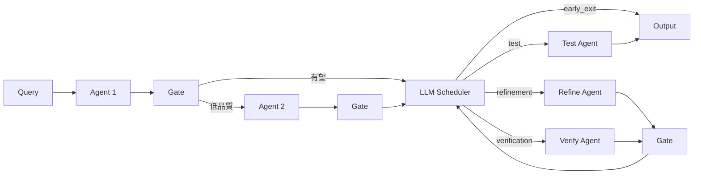

本記事は [https://aclanthology.org/2026.acl-long.581/](https://aclanthology.org/2026.acl-long.581/) の解説記事です。

## 論文概要（Abstract）

マルチエージェントLLMシステムでは、すべてのクエリに対して同一の重量級ワークフロー（生成・検証・修正・テスト等の多段パイプライン）を適用することが一般的である。しかし著者らは、クエリの約60%が最初のエージェント単体で解決可能であり、完全なワークフローの恩恵を受けるのは約20%に過ぎないと報告している。本論文では **LLM-as-Scheduler（LAS）** を提案し、軽量ゲートとLLMベーススケジューラの2段階カスケードにより、クエリごとにワークフローを動的に短縮・ルーティングする。著者らの実験では、トークン使用量を最大63.4%、エンドツーエンド遅延を最大41.9%削減しつつ、精度低下は最大1.4ポイントに抑えられたと報告されている（論文Table 2より）。

この記事は [Zenn記事: graphlib×LangGraphで動的DAGスケジューラを自作しエージェント並列実行を高速化する](https://zenn.dev/0h_n0/articles/acc29fce720028) の深掘りです。

## 情報源

- **会議名**: ACL 2026（64th Annual Meeting of the Association for Computational Linguistics）
- **年**: 2026
- **URL**: [https://aclanthology.org/2026.acl-long.581/](https://aclanthology.org/2026.acl-long.581/)
- **著者**: Dawei Xiang, Kexin Chu, Wenyan Xu, Wenhui Zhang, Wei Zhang
- **所属**: University of Connecticut, Mohamed bin Zayed University of AI, Roblox
- **DOI**: 10.18653/v1/2026.acl-long.581
- **発表形式**: Long Paper（Volume 1, pages 12752-12763）
- **コード**: [https://github.com/YoshuaDavy/LLM-as-Scheduler](https://github.com/YoshuaDavy/LLM-as-Scheduler)

## カンファレンス情報

ACL（Association for Computational Linguistics）は自然言語処理・計算言語学分野の最高峰国際会議の1つである。Long Paper枠は通常採択率20-25%程度と競争率が高い。2026年はサンディエゴで7月2-7日に開催され、本論文はVolume 1（Long Papers）に採択されている。

## 技術的詳細（Technical Details）

### 動機: 固定ワークフローの非効率性

著者らはMBPP、HumanEval、GSM8Kの3ベンチマークで、自動生成された複雑なマルチエージェントワークフロー（AFlow類似）を全クエリに適用した場合の難易度分布を分析している（論文Section 3.2）。その結果、クエリの約半数が最初のエージェント出力だけで正解（Easy）、約20%がフルワークフローで初めて正解（Hard）、残り約20%はフルワークフローでも不正解（Unsolvable）であることが示されている。この偏りが、固定パイプラインの非効率性の根拠となっている。

### LASアーキテクチャ: 2段階カスケード



LASは既存のワークフローDAG上にポリシーレイヤーとして動作する。各エージェントが中間成果物（Envelope）を出力するたびに、以下の2段階で次のアクションを決定する。

**第1段階: Cascade Gate（軽量ゲート）**

ゲートは各エージェント出力に対してスクリプトベースの低コストな特徴量を計算し、即座にフィルタリングを行う。ゲートの計算はワークフロー実行と並列に行えるため、追加の遅延はほぼゼロである（論文Table 5: 0.15秒、0トークン）。ゲートが使用する4つの特徴量は以下の通りである。

1. **Spec adherence（仕様適合度）** $f_{\text{spec}} \in \{0, 1\}$: Pythonで実装されたスキーマ検証・正規表現・型チェックによるプログラマティックな合否判定。コード生成タスクではシンタックスチェックやimport検証が含まれる。
2. **Lite judge score（軽量判定スコア）** $s_{\text{lite}} \in [0, 1]$: DistilBERT等のコンパクトなエンコーダ分類器を各ベンチマークごとにファインチューニングして得る品質スコア。訓練データは、フルワークフローの出力に対するベンチマーク正解ラベルを二値教師信号として使用する。
3. **Local agreement（局所一致度）** $a \in [0, 1]$: 複数候補出力がある場合のトークン集合間Jaccard類似度。コードや数式など構造化ドメインでは、最終回答の一致割合も含める。候補が1つの場合は$a = 1$とし、式中では$(a - 1)$として不一致を罰則項とする。
4. **Historical reliability（履歴信頼度）** $r \in [0, 1]$: 当該エージェントの直近の失敗を指数加重移動平均で追跡した値。式中では$(1 - r)$として信頼性低下を反映する。

これら4特徴量から、ゲートスコア$g$を以下の線形結合で算出する。

$$
g = w_{\text{spec}} \cdot f_{\text{spec}} + w_{\text{lite}} \cdot s_{\text{lite}} + w_{\text{agr}} \cdot (a - 1) + w_{\text{hist}} \cdot (1 - r)
$$

ここで、$w_{\text{spec}}, w_{\text{lite}}, w_{\text{agr}}, w_{\text{hist}}$は重みパラメータ、$\tau_{\text{gate}}$はリスクティア別の閾値である。すべてバリデーションセットでのグリッドサーチにより決定される。

著者らが報告している各ベンチマークでの最適パラメータは以下の通りである（論文Table 1より）。

| ベンチマーク | $w_{\text{spec}}$ | $w_{\text{lite}}$ | $w_{\text{agr}}$ | $w_{\text{hist}}$ | $\tau_{\text{gate}}$ |
|:---:|:---:|:---:|:---:|:---:|:---:|
| MBPP | 0.06 | 0.85 | 0.07 | 0.02 | 0.803 |
| HumanEval | 0.07 | 0.82 | 0.07 | 0.04 | 0.824 |
| GSM8K | 0 | 0.75 | 0.14 | 0.11 | 0.852 |

ゲートの判定ロジックは以下の通りである。

- **良好な結果**: $f_{\text{spec}} = 1$ かつ $g \geq \tau_{\text{gate}}$ の場合、LAS（第2段階）に転送して詳細なルーティング判定を行う
- **不良な結果**: $f_{\text{spec}} = 0$ または $g \leq \tau_{\text{gate}}$ の場合、元のワークフローの次段階（検証・修正等）に進む

**第2段階: LLM-based Scheduler（LASルーティング）**

ゲートが「有望だが判断が難しい」と判定したケースに対して、大規模LLM（著者らの実装ではDoubao-seed-1.6）をルーティングコントローラとして呼び出す。スケジューラLLMに与えるプロンプトには以下が含まれる（論文Appendix Aより）。

- タスク記述とリスクティア
- 現在のエージェント情報（名前・役割・ステップID）
- ゲート特徴量（$f_{\text{spec}}, s_{\text{lite}}, a, r, g$）
- バリデータ結果のサマリ
- 利用可能なルート一覧
- 現在の成果物（必要に応じて要約・切り詰め）

スケジューラは以下の4アクションから1つを選択してJSON形式で返す。

```json
{
  "action": "early_exit | verification | test | refinement",
  "target": "<対象エージェント名>",
  "reason": "<自然言語による根拠>"
}
```

### ルーティングアルゴリズム

論文Algorithm 1に基づくLASルーティングの擬似コードを以下に示す。

```python
from dataclasses import dataclass
from enum import Enum
from typing import Any


class Action(Enum):
    """スケジューラが選択可能なアクション"""
    EARLY_EXIT = "early_exit"
    VERIFICATION = "verification"
    TEST = "test"
    REFINEMENT = "refinement"


@dataclass
class GateFeatures:
    """Cascade Gateが計算する特徴量"""
    f_spec: float       # 仕様適合度 {0, 1}
    s_lite: float       # 軽量判定スコア [0, 1]
    agreement: float    # 局所一致度 [0, 1]
    reliability: float  # 履歴信頼度 [0, 1]
    gate_score: float   # 統合ゲートスコア


@dataclass
class Envelope:
    """各エージェントの出力を格納する構造化エンベロープ"""
    artifact: str
    gate_features: GateFeatures
    validators: dict[str, Any]
    meta: dict[str, Any]


VALID_ACTIONS = {
    Action.EARLY_EXIT,
    Action.VERIFICATION,
    Action.TEST,
    Action.REFINEMENT,
}


def compute_gate_score(
    f_spec: float,
    s_lite: float,
    a: float,
    r: float,
    weights: dict[str, float],
) -> float:
    """ゲートスコアを計算する

    Args:
        f_spec: 仕様適合度 (0 or 1)
        s_lite: 軽量判定スコア [0, 1]
        a: 局所一致度 [0, 1]
        r: 履歴信頼度 [0, 1]
        weights: 重みパラメータ辞書

    Returns:
        統合ゲートスコア g
    """
    return (
        weights["spec"] * f_spec
        + weights["lite"] * s_lite
        + weights["agr"] * (a - 1)
        + weights["hist"] * (1 - r)
    )


def las_route(
    envelope: Envelope,
    workflow_dag: dict[str, list[str]],
    risk_tier: str,
    tau_gate: float,
) -> tuple[Action, str]:
    """LASルーティングの2段階カスケード

    Args:
        envelope: エージェント出力のエンベロープ
        workflow_dag: ワークフローDAG記述
        risk_tier: リスクティア ("low" | "medium" | "high")
        tau_gate: ゲート閾値

    Returns:
        (選択アクション, 対象エージェント名)のタプル
    """
    gf = envelope.gate_features

    # Stage 1: Cascade Gate - 低コストフィルタリング
    if gf.f_spec == 0 or gf.gate_score <= tau_gate:
        # 品質不足 → 元のワークフローの次ステップへ
        return default_fallback_route(envelope, workflow_dag)

    # Stage 2: LLM Scheduler - 詳細ルーティング判定
    context = build_scheduler_context(envelope, workflow_dag, risk_tier)
    prompt = format_scheduler_prompt(context)
    response = call_large_llm(prompt)
    action, target, _reason = parse_scheduler_response(response)

    # バリデーション: 不正なアクションはフォールバック
    if action not in VALID_ACTIONS:
        return default_fallback_route(envelope, workflow_dag)

    # 安全策: high-riskでゲートスコアが控えめなearly_exitは検証に変更
    if (
        risk_tier == "high"
        and action == Action.EARLY_EXIT
        and gf.gate_score < tau_gate * 1.1
    ):
        return Action.VERIFICATION, get_verification_agent(workflow_dag)

    return action, target
```

### ゲートユニットの性能特性

著者らはMBPPにおけるゲートユニットの分類性能を報告している（論文Table 6より）。ゲートの最適動作点では精度（Accuracy）70.64%、適合率（Precision）66.29%、再現率（Recall）98.60%、AUC 0.737である。再現率が非常に高い（98.60%）ため、正しい出力を見逃す確率は極めて低いが、適合率がやや低い（66.29%）ため一部の誤った出力を「安全」と判定する可能性がある。この非対称性は、ゲートをトリガーとして使い、LASで最終判断を行うカスケード設計により緩和されている。

## 実装のポイント

著者らが報告している実装上の重要な知見を以下にまとめる。

1. **Lite judgeの訓練コスト**: DistilBERTを50エポックでファインチューニングし、訓練時間は1時間未満（論文Section 5.6）。各ベンチマークの訓練セットを用いてフルワークフローの出力正誤を二値ラベルとして学習する。

2. **ゲートの並列実行**: ゲートはスクリプトベース（CPU実行）のため、下流エージェントと並列に計算可能。追加のLLM呼び出しは不要で、コストは実質ゼロ（0トークン、0.15秒）である（論文Table 5）。

3. **スケジューラのオーバーヘッド**: LASスケジューラの1回の呼び出しは平均725トークン・19.44秒（論文Table 5）。これは一般的なワークフローエージェント1回分（1106トークン・26.78秒）よりも小さい。

4. **安全策**: high-riskティアでゲートスコアが控えめな場合、early_exitを検証（verification）にオーバーライドするルール（Algorithm 1, line 7-8）が重要である。有害な誤ルーティング（本来refinementが必要なのにearly_exitする）は全体の2.7%に抑えられている。

5. **エンベロープ設計**: 各エージェント出力を構造化エンベロープ（artifact, gate_features, validators, meta）として統一的に扱う設計により、ゲートとスケジューラが共通のインタフェースで連携できる。

## Production Deployment Guide

### AWS実装パターン（コスト最適化重視）

LASの2段階カスケードをAWS上に実装する場合の構成を、トラフィック量別に示す。以下のコスト試算は2026年9月時点のAWS ap-northeast-1（東京）リージョン料金に基づく概算値であり、実際のコストはトラフィックパターンやバースト使用量により変動する。最新料金はAWS料金計算ツールで確認を推奨する。

**Small（~100 req/日）: Serverless構成** 月額 $80-180

| サービス | 用途 | 月額概算 |
|:---|:---|:---|
| Lambda (ARM64, 512MB) | Gate計算 + LASオーケストレーション | $5-15 |
| Bedrock (Claude Haiku) | LASスケジューラ | $30-80 |
| Bedrock (Claude Sonnet) | ワークフローエージェント | $30-60 |
| DynamoDB (On-Demand) | Gate特徴量・履歴保存 | $5-10 |
| S3 | エンベロープ保存 | $1-3 |
| CloudWatch | 監視・ログ | $5-10 |

**Medium（~1,000 req/日）: Hybrid構成** 月額 $400-900

| サービス | 用途 | 月額概算 |
|:---|:---|:---|
| ECS Fargate (0.5vCPU, 1GB) x2 | Gate + オーケストレーション | $50-80 |
| Bedrock Batch API | 非同期ルーティング判定 | $150-350 |
| SageMaker Serverless | DistilBERT lite judge推論 | $60-120 |
| ElastiCache (t4g.micro) | Gate特徴量キャッシュ | $15-25 |
| DynamoDB (Provisioned) | 履歴・ルーティングログ | $20-40 |
| CloudWatch + X-Ray | 監視・トレーシング | $15-30 |

**Large（10,000+ req/日）: Container構成** 月額 $2,500-5,500

| サービス | 用途 | 月額概算 |
|:---|:---|:---|
| EKS + Karpenter (Spot優先) | オーケストレーション基盤 | $400-800 |
| SageMaker Endpoint (ml.g5.xlarge) | DistilBERT lite judge専用 | $300-500 |
| Bedrock Provisioned Throughput | 安定した推論スループット | $1,200-2,800 |
| ElastiCache (r7g.large) | 高速Gate特徴量キャッシュ | $150-250 |
| DynamoDB (Reserved) | 履歴・メトリクス | $80-120 |
| CloudWatch + X-Ray + Cost Explorer | 包括的監視 | $50-80 |

**コスト削減テクニック**:
- Spot Instances活用でEKSワーカーノードを最大90%削減
- Reserved Instances（1年コミット）でSageMakerを最大72%削減
- Bedrock Batch API使用で非同期判定を50%削減
- Prompt Caching有効化でスケジューラプロンプトの反復部分を30-90%削減

### Terraformインフラコード

**Small構成（Serverless）**: Lambda + Bedrock + DynamoDB

```hcl
# LAS Cascade Scheduler - Small構成
# 2026-09時点の最新安定版

terraform {
  required_version = ">= 1.9"
  required_providers {
    aws = { source = "hashicorp/aws", version = "~> 5.70" }
  }
}

provider "aws" {
  region = "ap-northeast-1"
  default_tags {
    tags = {
      Project     = "las-scheduler"
      Environment = "production"
      ManagedBy   = "terraform"
    }
  }
}

# --- IAM: 最小権限 ---
resource "aws_iam_role" "las_lambda" {
  name = "las-cascade-lambda-role"
  assume_role_policy = jsonencode({
    Version = "2012-10-17"
    Statement = [{
      Action = "sts:AssumeRole"
      Effect = "Allow"
      Principal = { Service = "lambda.amazonaws.com" }
    }]
  })
}

resource "aws_iam_role_policy" "las_lambda_policy" {
  name = "las-lambda-policy"
  role = aws_iam_role.las_lambda.id
  policy = jsonencode({
    Version = "2012-10-17"
    Statement = [
      {
        Effect   = "Allow"
        Action   = ["bedrock:InvokeModel"]
        Resource = "arn:aws:bedrock:ap-northeast-1::foundation-model/*"
      },
      {
        Effect   = "Allow"
        Action   = ["dynamodb:GetItem", "dynamodb:PutItem", "dynamodb:UpdateItem", "dynamodb:Query"]
        Resource = aws_dynamodb_table.gate_history.arn
      },
      {
        Effect   = "Allow"
        Action   = ["logs:CreateLogGroup", "logs:CreateLogStream", "logs:PutLogEvents"]
        Resource = "arn:aws:logs:ap-northeast-1:*:*"
      },
      {
        Effect   = "Allow"
        Action   = ["xray:PutTraceSegments", "xray:PutTelemetryRecords"]
        Resource = "*"
      }
    ]
  })
}

# --- DynamoDB: Gate特徴量・履歴 (On-Demand, KMS暗号化) ---
resource "aws_dynamodb_table" "gate_history" {
  name         = "las-gate-history"
  billing_mode = "PAY_PER_REQUEST"
  hash_key     = "agent_id"
  range_key    = "timestamp"

  attribute {
    name = "agent_id"
    type = "S"
  }
  attribute {
    name = "timestamp"
    type = "N"
  }

  server_side_encryption { enabled = true }
  point_in_time_recovery { enabled = true }

  ttl {
    attribute_name = "expires_at"
    enabled        = true
  }
}

# --- Lambda: Gate + LASオーケストレーション ---
resource "aws_lambda_function" "las_orchestrator" {
  function_name = "las-cascade-orchestrator"
  runtime       = "python3.12"
  handler       = "handler.lambda_handler"
  role          = aws_iam_role.las_lambda.arn
  timeout       = 120  # LASスケジューラのLLM呼び出しに十分な時間
  memory_size   = 512  # DistilBERT lite judgeの推論に必要

  architectures = ["arm64"]  # Graviton: コスト20%削減

  tracing_config { mode = "Active" }  # X-Ray有効化

  environment {
    variables = {
      GATE_TABLE_NAME       = aws_dynamodb_table.gate_history.name
      SCHEDULER_MODEL_ID    = "anthropic.claude-3-haiku-20240307-v1:0"
      GATE_THRESHOLD_MBPP   = "0.803"
      GATE_THRESHOLD_HUMANEVAL = "0.824"
    }
  }
}

# --- CloudWatch: コスト監視アラーム ---
resource "aws_cloudwatch_metric_alarm" "bedrock_token_spike" {
  alarm_name          = "las-bedrock-token-usage-spike"
  comparison_operator = "GreaterThanThreshold"
  evaluation_periods  = 2
  metric_name         = "InputTokenCount"
  namespace           = "AWS/Bedrock"
  period              = 3600
  statistic           = "Sum"
  threshold           = 50000  # 1時間あたり5万トークン超過で通知
  alarm_actions       = [aws_sns_topic.alerts.arn]
}

resource "aws_sns_topic" "alerts" {
  name              = "las-cost-alerts"
  kms_master_key_id = "alias/aws/sns"
}
```

**Large構成（Container）**: EKS + Karpenter + Spot Instances

```hcl
# LAS Cascade Scheduler - Large構成
module "eks" {
  source  = "terraform-aws-modules/eks/aws"
  version = "~> 20.24"

  cluster_name    = "las-scheduler-prod"
  cluster_version = "1.31"

  vpc_id     = module.vpc.vpc_id
  subnet_ids = module.vpc.private_subnets

  cluster_endpoint_public_access = false  # プライベートアクセスのみ

  # KMS暗号化
  cluster_encryption_config = {
    provider_key_arn = aws_kms_key.eks.arn
    resources        = ["secrets"]
  }
}

# --- Karpenter: Spot優先の自動スケーリング ---
resource "kubectl_manifest" "karpenter_nodepool" {
  yaml_body = yamlencode({
    apiVersion = "karpenter.sh/v1"
    kind       = "NodePool"
    metadata   = { name = "las-workers" }
    spec = {
      template = {
        spec = {
          requirements = [
            { key = "karpenter.sh/capacity-type", operator = "In", values = ["spot", "on-demand"] },
            { key = "node.kubernetes.io/instance-type", operator = "In",
              values = ["m7g.medium", "m7g.large", "c7g.medium", "c7g.large"] },
          ]
          nodeClassRef = { group = "karpenter.k8s.aws", kind = "EC2NodeClass", name = "default" }
        }
      }
      limits   = { cpu = "32", memory = "64Gi" }
      disruption = {
        consolidationPolicy = "WhenEmptyOrUnderutilized"
        consolidateAfter    = "60s"
      }
    }
  })
}

# --- Secrets Manager: Bedrock設定 ---
resource "aws_secretsmanager_secret" "bedrock_config" {
  name       = "las/bedrock-config"
  kms_key_id = aws_kms_key.secrets.arn
}

# --- AWS Budgets: 予算アラート ---
resource "aws_budgets_budget" "las_monthly" {
  name         = "las-monthly-budget"
  budget_type  = "COST"
  limit_amount = "5000"
  limit_unit   = "USD"
  time_unit    = "MONTHLY"

  notification {
    comparison_operator       = "GREATER_THAN"
    threshold                 = 80
    threshold_type            = "PERCENTAGE"
    notification_type         = "ACTUAL"
    subscriber_email_addresses = ["alerts@example.com"]
  }
}
```

### 運用・監視設定

**CloudWatch Logs Insights クエリ**: ルーティング判定の分析

```
# LASルーティングアクション分布（1時間単位）
fields @timestamp, action, gate_score, latency_ms
| filter event = "las_routing_decision"
| stats count(*) as cnt by action, bin(1h) as hour
| sort hour desc

# コスト異常検知: 1時間あたりのトークン使用量
fields @timestamp, total_tokens, model_id
| filter event = "llm_invocation"
| stats sum(total_tokens) as hourly_tokens by bin(1h) as hour
| filter hourly_tokens > 100000
| sort hour desc
```

**CloudWatch アラーム設定（Python）**:

```python
import boto3

cloudwatch = boto3.client("cloudwatch", region_name="ap-northeast-1")


def create_las_alarms() -> None:
    """LAS用のCloudWatchアラームを作成する"""
    # Bedrockトークン使用量スパイク検知
    cloudwatch.put_metric_alarm(
        AlarmName="las-token-usage-spike",
        MetricName="InputTokenCount",
        Namespace="AWS/Bedrock",
        Statistic="Sum",
        Period=3600,
        EvaluationPeriods=2,
        Threshold=50000,
        ComparisonOperator="GreaterThanThreshold",
        AlarmActions=["arn:aws:sns:ap-northeast-1:ACCOUNT:las-alerts"],
    )

    # Lambda実行時間異常検知
    cloudwatch.put_metric_alarm(
        AlarmName="las-lambda-duration-p99",
        MetricName="Duration",
        Namespace="AWS/Lambda",
        ExtendedStatistic="p99",
        Period=300,
        EvaluationPeriods=3,
        Threshold=90000,  # 90秒 (timeout 120秒の75%)
        ComparisonOperator="GreaterThanThreshold",
        Dimensions=[{"Name": "FunctionName", "Value": "las-cascade-orchestrator"}],
        AlarmActions=["arn:aws:sns:ap-northeast-1:ACCOUNT:las-alerts"],
    )
```

**X-Ray トレーシング設定（Python）**:

```python
from aws_xray_sdk.core import xray_recorder, patch_all

# boto3自動計装
patch_all()


@xray_recorder.capture("las_gate_evaluation")
def evaluate_gate(envelope: dict, weights: dict[str, float]) -> float:
    """Gate評価をX-Rayトレースに記録する"""
    subsegment = xray_recorder.current_subsegment()
    if subsegment:
        subsegment.put_annotation("agent_id", envelope["meta"]["agent_name"])
        subsegment.put_metadata("gate_features", envelope["gate_features"])

    gate_score = compute_gate_score(**envelope["gate_features"], weights=weights)

    if subsegment:
        subsegment.put_annotation("gate_score", round(gate_score, 4))
        subsegment.put_annotation("gate_pass", gate_score >= weights["threshold"])

    return gate_score
```

**Cost Explorer 日次レポート（Python）**:

```python
import datetime
import json

import boto3


def get_daily_las_cost() -> dict[str, float]:
    """LAS関連サービスの日次コストを取得する"""
    ce = boto3.client("ce", region_name="us-east-1")
    today = datetime.date.today()
    yesterday = today - datetime.timedelta(days=1)

    response = ce.get_cost_and_usage(
        TimePeriod={"Start": str(yesterday), "End": str(today)},
        Granularity="DAILY",
        Metrics=["UnblendedCost"],
        Filter={
            "Tags": {
                "Key": "Project",
                "Values": ["las-scheduler"],
            }
        },
        GroupBy=[{"Type": "DIMENSION", "Key": "SERVICE"}],
    )

    costs: dict[str, float] = {}
    for group in response["ResultsByTime"][0]["Groups"]:
        service = group["Keys"][0]
        amount = float(group["Metrics"]["UnblendedCost"]["Amount"])
        costs[service] = amount

    total = sum(costs.values())

    # $100/日超過でSNS通知
    if total > 100:
        sns = boto3.client("sns", region_name="ap-northeast-1")
        sns.publish(
            TopicArn="arn:aws:sns:ap-northeast-1:ACCOUNT:las-alerts",
            Subject="LAS Daily Cost Alert",
            Message=json.dumps({"total": total, "breakdown": costs}, indent=2),
        )

    return costs
```

### コスト最適化チェックリスト

**アーキテクチャ選択**:
- [ ] トラフィック~100 req/日 → Serverless（Lambda + Bedrock）
- [ ] トラフィック~1,000 req/日 → Hybrid（ECS + SageMaker）
- [ ] トラフィック10,000+ req/日 → Container（EKS + Karpenter）

**リソース最適化**:
- [ ] EC2/EKS: Spot Instances優先（最大90%削減）
- [ ] SageMaker: Reserved Instances 1年コミット（最大72%削減）
- [ ] Lambda: ARM64 (Graviton) で20%コスト削減
- [ ] Lambda: メモリサイズをPower Tuningで最適化
- [ ] EKS: Karpenterで未使用ノード自動回収（consolidateAfter: 60s）
- [ ] SageMaker: 非ピーク時のインスタンス数削減

**LLMコスト削減**:
- [ ] Bedrock Batch API: 非同期判定で50%削減
- [ ] Prompt Caching: スケジューラの固定プロンプト部分をキャッシュ（30-90%削減）
- [ ] モデル選択ロジック: Gate通過分のみ大規模モデル呼び出し（論文の設計そのもの）
- [ ] トークン数制限: 成果物の要約・切り詰めでスケジューラ入力を圧縮
- [ ] Gate Lite Judge: DistilBERTはCPUで推論可能、GPUインスタンス不要

**監視・アラート**:
- [ ] AWS Budgets: 月次予算設定（80%/100%で通知）
- [ ] CloudWatch アラーム: トークン使用量・Lambda実行時間
- [ ] Cost Anomaly Detection: 異常コスト自動検知
- [ ] 日次コストレポート: Cost Explorer API + SNS通知
- [ ] X-Ray: ルーティング判定のレイテンシ可視化

**リソース管理**:
- [ ] DynamoDB TTL: Gate履歴の自動削除（30日）
- [ ] S3 Lifecycle: 古いエンベロープを自動アーカイブ
- [ ] タグ戦略: Project/Environment/ManagedByを全リソースに適用
- [ ] 開発環境: 夜間・週末の自動停止（EventBridge Scheduler）
- [ ] CloudWatch Logs: 保持期間を30日に設定

## 実験結果

著者らは3つのベンチマーク（MBPP、HumanEval、GSM8K）で評価を行い、AFlow（固定ワークフロー最適化手法）をベースラインとしてLASの効果を検証している。主要な結果を以下に示す（論文Table 2より）。

| 手法 | MBPP Acc. | MBPP Tokens | MBPP Lat.(s) | HumanEval Acc. | GSM8K Acc. |
|:---|:---:|:---:|:---:|:---:|:---:|
| IO（単一呼び出し） | 79.3 | 1005.4 | 19.54 | 92.6 | 91.7 |
| CoT | 84.2 | 4058.7 | 67.04 | 93.7 | 94.1 |
| Self-Refine | 82.1 | 3804.4 | 79.60 | 92.2 | 92.1 |
| Reflexion | 85.5 | 4361.5 | 89.72 | 93.1 | 92.9 |
| ADAS | 89.2 | 5824.3 | 121.25 | 95.3 | 92.3 |
| AFLOW（ベースライン） | **94.2** | 6643.2 | 134.28 | **95.9** | **95.9** |
| **LAS（提案手法）** | 93.7 | **2430.3** | **77.99** | 94.5 | 95.1 |
| 差分 | -0.5pp | **-63.4%** | **-41.9%** | -1.4pp | -0.8pp |

著者らは、LASがAFLOWと比較してトークン使用量を43-63%、遅延を36-42%削減しつつ、精度低下を最大1.4ポイントに抑えていると報告している。また、CoT・Self-Refine・Reflexionといった従来のマルチステップ手法と比較すると、LASはより高い精度をより少ないトークン・遅延で達成している点が注目される。

アブレーション実験（論文Table 3より、MBPP）では、Gate単体（Only Gate）ではトークン削減は大きいが精度が86.7まで低下し、LAS単体（Only LAS）では精度93.9を維持するがトークン削減が限定的（3678.1）であることが示されている。Gate+LASの組み合わせ（精度93.7、トークン2430.2）が精度・効率のバランスにおいて最良であると著者らは結論付けている。

## 実運用への応用

LASの設計思想は、Zenn記事で解説したLangGraphによる動的DAGスケジューラと直接的に関連する。LangGraphの条件付きエッジ（conditional edges）でゲート判定を実装し、ルーティング結果に応じてDAGのパスを動的に選択する構成が考えられる。

**プロダクション視点での応用**:

- **カスタマーサポートBot**: 簡単な質問（FAQ）はGateでearly_exit、複雑な問い合わせのみフルワークフロー（検索→生成→検証→修正）に回すことで、平均応答時間と API コストを大幅に削減できる
- **コード生成パイプライン**: 著者らの実験が示す通り、コード生成タスクでは約60%のクエリが最初のエージェントで解決可能。CI/CDパイプラインにLAS的なゲートを導入し、テスト・リンター通過でearly_exitする設計が有効である
- **コスト制御**: Gate→LASの2段階設計により、大規模LLMの呼び出し回数を抑制できる。論文Table 5によれば、ゲートのオーバーヘッドは0トークン・0.15秒であり、コスト削減の大部分は不要なワークフローステップのスキップによる
- **スケーリング課題**: Lite judgeは各タスクドメインごとにファインチューニングが必要であり、新規ドメインへの汎化性は著者ら自身が limitations として認めている。クロスタスク転移可能な判定モジュールの開発が今後の課題である

## まとめ

本論文はマルチエージェントワークフローの非効率性に着目し、軽量ゲートとLLMスケジューラの2段階カスケードによる動的ルーティング手法LASを提案している。ゲートの特徴量設計（Spec適合度・Lite judge・一致度・履歴信頼度の4要素）とLLMによるルーティング判定の組み合わせは、精度を大きく犠牲にすることなくトークン使用量と遅延を大幅に削減する設計として、マルチエージェントシステムのコスト最適化に実用的な知見を提供している。LangGraphやAutoGen等の既存フレームワークにポリシーレイヤーとして導入可能であり、動的DAGスケジューリングの理論的裏付けとしても参照価値がある。

## 参考文献

- **Conference URL**: [https://aclanthology.org/2026.acl-long.581/](https://aclanthology.org/2026.acl-long.581/)
- **PDF**: [https://aclanthology.org/2026.acl-long.581.pdf](https://aclanthology.org/2026.acl-long.581.pdf)
- **Code**: [https://github.com/YoshuaDavy/LLM-as-Scheduler](https://github.com/YoshuaDavy/LLM-as-Scheduler)
- **Related Zenn article**: [https://zenn.dev/0h_n0/articles/acc29fce720028](https://zenn.dev/0h_n0/articles/acc29fce720028)
