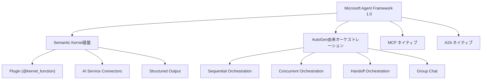

本記事は [Microsoft Agent Framework Version 1.0 公式ブログ](https://devblogs.microsoft.com/agent-framework/microsoft-agent-framework-version-1-0/) の解説記事です。

## ブログ概要（Summary）

2026年4月3日、MicrosoftはAgent Framework 1.0のGA（一般提供開始）を発表した。このフレームワークはSemantic Kernelのエンタープライズ基盤とAutoGenのマルチエージェントオーケストレーションを統合した単一のオープンソースSDKであり、.NETとPythonの両方で利用可能である。MCP（Model Context Protocol）とA2A（Agent-to-Agent）プロトコルのネイティブサポート、YAML宣言型エージェント定義、グラフベースのワークフローエンジンを特徴とする。

この記事は [Zenn記事: Semantic Kernel v1.44×Pydantic Structured Outputで型安全AIエージェントを構築する](https://zenn.dev/0h_n0/articles/9c3ea7a3879be1) の深掘りです。Zenn記事で紹介したSemantic Kernel v1.44のパターン（ChatCompletionAgent、Plugin、Structured Output、YAML宣言型スペック、マルチエージェントオーケストレーション）がAgent Framework 1.0でどのように位置づけられ、移行がどのように行われるかを解説します。

## 情報源

- **種別**: 企業テックブログ
- **URL**: [https://devblogs.microsoft.com/agent-framework/microsoft-agent-framework-version-1-0/](https://devblogs.microsoft.com/agent-framework/microsoft-agent-framework-version-1-0/)
- **組織**: Microsoft（Agent Framework チーム）
- **著者**: Shawn Henry（Principal Group Product Manager）
- **発表日**: 2026年4月3日

## 技術的背景（Technical Background）

### Semantic KernelとAutoGenの統合背景

Microsoftは従来、2つの異なるAIエージェントフレームワークを開発していた。

**Semantic Kernel**: エンタープライズ向けのAIオーケストレーションSDK。Plugin（`@kernel_function`）、AI Serviceコネクタ、構造化出力などの機能を提供し、単一エージェントのプロダクション運用に強みを持つ。Zenn記事で紹介したパターンはすべてSemantic Kernelの機能である。

**AutoGen**: Microsoft Researchが開発したマルチエージェント会話フレームワーク。エージェント間の自律的な対話によるタスク解決に特化しており、研究・プロトタイピングでの採用が多かった。

Agent Framework 1.0はこの2つを統合し、「Semantic Kernelの安定したAPIとエンタープライズ統合機能」と「AutoGenの柔軟なマルチエージェントオーケストレーション」を単一SDKで提供する。



## 実装アーキテクチャ（Architecture）

### コアコンポーネント（v1.0 Stable）

ブログ記事で報告されているv1.0のStableコンポーネントは以下の通りである。

**1. Single Agent & Service Connectors**

Agent Framework 1.0は、以下のLLMプロバイダへのコネクタを提供する。

| プロバイダ | サービス名 | 備考 |
|-----------|-----------|------|
| Microsoft Foundry | AzureAIFoundry | Azure統合 |
| Azure OpenAI | AzureChatCompletion | エンタープライズ向け |
| OpenAI | OpenAIChatCompletion | 直接接続 |
| Anthropic Claude | AnthropicChatCompletion | 新規追加 |
| Amazon Bedrock | BedrockChatCompletion | AWS統合 |
| Google Gemini | GeminiChatCompletion | GCP統合 |
| Ollama | OllamaChatCompletion | ローカルLLM |

Semantic Kernel v1.44では`AzureChatCompletion`と`OpenAIChatCompletion`が主要であったが、Agent Framework 1.0ではAnthropicやBedrockなどマルチプロバイダ対応が標準となった。

**2. Middleware Hooks**

エージェントの振る舞いを拡張するミドルウェア機構。安全フィルター、ロギング、コンプライアンスチェックをエージェント処理のパイプラインに挿入できる。

**3. Memory Architecture**

プラグ可能なメモリバックエンド:
- Mem0（セマンティックメモリ）
- Redis（キー・バリューキャッシュ）
- Neo4j（グラフベースメモリ）
- ベクトルストア（RAG統合）

**4. Agent Workflows**

グラフベースのワークフローエンジンで、以下のオーケストレーションパターンをサポートする。

- **Sequential**: エージェントが順番に処理
- **Concurrent**: エージェントが並列に処理
- **Handoff**: エージェント間でタスクを委譲
- **Group Chat**: エージェントが議論して結論を導く

これらはZenn記事で紹介したSemantic Kernel v1.44のオーケストレーションパターンと同一であり、APIの互換性が維持されている。

**5. Declarative Agents（YAML）**

バージョン管理可能なYAML形式でエージェントとワークフローを定義する機能。Zenn記事で紹介した「YAML宣言型スペック」がAgent Framework 1.0でもStable機能として継続される。

### MCP & A2Aプロトコル対応

**MCP（Model Context Protocol）**: エージェントがMCP準拠サーバーを動的に発見し、外部ツールを呼び出す機能。Semantic Kernel v1.44のPluginがローカル関数に限定されていたのに対し、MCPにより外部サービスとの統合が標準化される。

**A2A（Agent-to-Agent Protocol）**: 異なるランタイム上のエージェント間でタスクを委譲するプロトコル。Semantic Kernelのオーケストレーションが同一プロセス内のエージェント間通信に限定されていたのに対し、A2Aによりクロスプロセス・クロスサービスのエージェント協調が可能となる。

### Preview機能

以下の機能はv1.0時点でPreviewステータスである。

- **DevUI**: ブラウザベースのエージェントデバッガー
- **Foundry Hosted Agent**: クラウドホスト型エージェント統合
- **Agent Skills**: 再利用可能な能力パッケージ
- **GitHub Copilot SDK / Claude Code SDK**: 外部開発ツール統合

## Semantic Kernel v1.44からの移行

### 移行判断マトリクス

ブログ記事およびZenn記事の内容に基づき、移行判断のマトリクスを以下に整理する。

| 判断基準 | SK v1.44を継続 | AF 1.0に移行 |
|---------|---------------|-------------|
| MCP/A2Aの必要性 | 不要 or 限定的 | MCPサーバーの消費が必須 |
| マルチプロバイダ | Azure OpenAI + OpenAIで十分 | Anthropic、Bedrockも使いたい |
| メモリ管理 | 不要 or カスタム実装済み | Mem0/Redis/Neo4j統合が必要 |
| 既存コード量 | 大量のPlugin・Agent定義 | 新規プロジェクト |
| チェックポイント | 不要 | 長時間ワークフローで必須 |

公式ガイダンスでは、「機能要件が発生するまで無理に移行する必要はない」と記載されている。

### APIの互換性

Agent Framework 1.0のPythonパッケージは`pip install agent-framework`でインストールする（Semantic Kernelは`pip install semantic-kernel`）。ブログ記事によれば、以下のAPI要素は互換性が維持されている。

- `ChatCompletionAgent`のコンストラクタとメソッド
- `@kernel_function`デコレータによるPlugin定義
- `OpenAIChatPromptExecutionSettings`と`response_format`
- `KernelArguments`によるパラメータ管理
- YAML宣言型スペックのフォーマット

### 移行で変わる主要なポイント

**1. サービスコネクタの拡張**

```python
# Semantic Kernel v1.44
from semantic_kernel.connectors.ai.open_ai import AzureChatCompletion
agent = ChatCompletionAgent(service=AzureChatCompletion(), ...)

# Agent Framework 1.0（同じ構文で追加プロバイダ対応）
from agent_framework.connectors import AnthropicChatCompletion
agent = ChatCompletionAgent(service=AnthropicChatCompletion(), ...)
```

**2. MCPツールの統合**

```python
# Agent Framework 1.0: MCPサーバーからツールを動的発見
from agent_framework.mcp import MCPToolProvider

mcp_tools = MCPToolProvider(
    server_url="https://mcp-server.example.com",
    capabilities=["search", "database"]
)

agent = ChatCompletionAgent(
    service=AzureChatCompletion(),
    plugins=[ProductPlugin(), mcp_tools],
)
```

**3. A2Aによるクロスサービス協調**

```python
# Agent Framework 1.0: 外部エージェントへのHandoff
from agent_framework.a2a import A2ARemoteAgent

remote_analyst = A2ARemoteAgent(
    endpoint="https://analyst-agent.example.com/a2a",
    name="ExternalAnalyst",
)

handoffs = OrchestrationHandoffs()
handoffs.add(
    source_agent="Triage",
    target_agent=remote_analyst.name,
    description="分析タスクを外部エージェントに委譲",
)
```

## Production Deployment Guide

### AWS実装パターン（コスト最適化重視）

Agent Framework 1.0ベースのマルチエージェントシステムのAWS構成を以下に示す。

| 規模 | 月間リクエスト | 推奨構成 | 月額コスト | 主要サービス |
|------|--------------|---------|-----------|------------|
| **Small** | ~3,000 (100/日) | Serverless | $50–150 | Lambda + Bedrock + DynamoDB |
| **Medium** | ~30,000 (1,000/日) | Hybrid | $300–800 | ECS Fargate + Bedrock + ElastiCache |
| **Large** | 300,000+ (10,000/日) | Container | $2,000–5,000 | EKS + Karpenter + Spot |

**Medium構成の詳細**（月額$300–800）:
- **ECS Fargate**: 0.5 vCPU, 1GB RAM × 2タスク、Agent Framework常駐（$120/月）
- **Bedrock**: Claude 3.5 Sonnet / Haiku、マルチプロバイダ切替（$400/月）
- **ElastiCache Redis**: cache.t3.micro、エージェントメモリ用（$15/月）
- **ALB**: Application Load Balancer（$20/月）
- **DynamoDB**: エージェント状態管理（$10/月）

**コスト削減テクニック**:
- Bedrock Batch API: 非リアルタイム処理50%削減
- Prompt Caching: システムプロンプト固定部分30–90%削減
- ECS Fargate Spot: 最大70%削減（中断耐性のあるワークロード）
- 夜間Auto Scaling to Zero

**コスト試算の注意事項**: 上記は2026年9月時点のAWS ap-northeast-1リージョン料金に基づく概算値です。最新料金は[AWS料金計算ツール](https://calculator.aws/)で確認してください。

### Terraformインフラコード

```hcl
resource "aws_ecs_cluster" "agent_cluster" {
  name = "agent-framework-cluster"
  setting {
    name  = "containerInsights"
    value = "enabled"
  }
}

resource "aws_ecs_task_definition" "agent_task" {
  family                   = "agent-framework"
  network_mode             = "awsvpc"
  requires_compatibilities = ["FARGATE"]
  cpu                      = "512"
  memory                   = "1024"
  execution_role_arn       = aws_iam_role.ecs_execution.arn
  task_role_arn           = aws_iam_role.ecs_task.arn

  container_definitions = jsonencode([{
    name  = "agent"
    image = "your-ecr-repo/agent-framework:latest"
    portMappings = [{
      containerPort = 8080
      protocol      = "tcp"
    }]
    environment = [
      { name = "REDIS_HOST", value = aws_elasticache_cluster.agent_memory.cache_nodes[0].address },
      { name = "DYNAMO_TABLE", value = aws_dynamodb_table.agent_state.name },
    ]
    secrets = [
      { name = "BEDROCK_CONFIG", valueFrom = aws_secretsmanager_secret.bedrock.arn },
    ]
    logConfiguration = {
      logDriver = "awslogs"
      options = {
        "awslogs-group"  = "/ecs/agent-framework"
        "awslogs-region" = "ap-northeast-1"
        "awslogs-stream-prefix" = "agent"
      }
    }
  }])
}

resource "aws_elasticache_cluster" "agent_memory" {
  cluster_id           = "agent-memory"
  engine               = "redis"
  node_type            = "cache.t3.micro"
  num_cache_nodes      = 1
  parameter_group_name = "default.redis7"
}

resource "aws_dynamodb_table" "agent_state" {
  name         = "agent-state"
  billing_mode = "PAY_PER_REQUEST"
  hash_key     = "agent_id"
  range_key    = "session_id"
  attribute {
    name = "agent_id"
    type = "S"
  }
  attribute {
    name = "session_id"
    type = "S"
  }
  ttl {
    attribute_name = "expire_at"
    enabled        = true
  }
}
```

### セキュリティベストプラクティス

- IAMロール: ECSタスクロールとBedrock InvokeModelの最小権限
- ネットワーク: VPC内配置、Security GroupでALBからの8080ポートのみ許可
- シークレット: Secrets Manager使用、ECSタスク定義の`secrets`で注入
- MCP/A2A: TLS 1.2以上必須、認証トークンのローテーション
- 暗号化: ElastiCache/DynamoDB KMS暗号化

### コスト最適化チェックリスト

- [ ] ~100 req/日 → Lambda + Bedrock $50–150/月
- [ ] ~1,000 req/日 → ECS Fargate + Bedrock $300–800/月
- [ ] 10,000+ req/日 → EKS + Spot $2,000–5,000/月
- [ ] Bedrock Batch API: 50%削減
- [ ] Prompt Caching: 30–90%削減
- [ ] ECS Fargate Spot: 最大70%削減
- [ ] マルチプロバイダ切替: タスク種別でHaiku/Sonnet使い分け
- [ ] AWS Budgets: 月額予算設定
- [ ] Cost Anomaly Detection: 有効化
- [ ] タグ戦略: agent/environment別コスト可視化

## パフォーマンス最適化（Performance）

### マルチプロバイダ戦略

Agent Framework 1.0のマルチプロバイダ対応を活用し、タスクの複雑度に応じてモデルを切り替えることでコスト効率を最適化できる。

| タスク種別 | 推奨モデル | 理由 |
|-----------|-----------|------|
| 分類・フィルタリング | Claude 3.5 Haiku | 高速・低コスト |
| 複雑な推論 | Claude 3.5 Sonnet | バランス型 |
| コード生成 | GPT-4o | Function Calling安定性 |
| Structured Output | GPT-4o-mini | コスト効率（1/10） |

### メモリバックエンドの選択

| バックエンド | レイテンシ | 用途 |
|------------|----------|------|
| Redis | < 1ms | セッションキャッシュ、短期メモリ |
| Neo4j | 5–20ms | 関係性グラフ、長期メモリ |
| Vector Store | 10–50ms | RAG統合、セマンティック検索 |
| Mem0 | 5–10ms | 自動メモリ管理 |

## 運用での学び（Production Lessons）

### Semantic Kernelからの段階的移行

ブログ記事では、段階的移行のアプローチが推奨されている。

1. **Phase 1**: `pip install agent-framework`に切り替え、既存コードがそのまま動作することを確認
2. **Phase 2**: 新規エージェントでマルチプロバイダコネクタを活用
3. **Phase 3**: MCP統合を導入し、外部ツールアクセスを標準化
4. **Phase 4**: A2Aプロトコルでクロスサービスオーケストレーションを実装

### Experimental機能の扱い

Zenn記事で紹介したYAML宣言型スペックとオーケストレーションパターンは、Semantic Kernel v1.44時点ではExperimentalステータスであった。Agent Framework 1.0ではこれらがStableに昇格しているため、プロダクション環境での利用が公式にサポートされる。

## 学術研究との関連（Academic Connection）

Agent Framework 1.0の設計は、以下の学術研究の知見を反映している。

- **AutoGen (Wu et al., 2023)**: Microsoft Researchが開発したマルチエージェント会話フレームワーク。Agent Framework 1.0のオーケストレーションパターン（特にGroup Chat）の基礎
- **Semantic Kernel Plugin Architecture**: エンタープライズソフトウェアへのAI統合パターンを体系化。`@kernel_function`によるツール定義はFunction Callingの実用的な実装として広く採用
- **MCP/A2A Protocols**: Anthropic（MCP）とGoogle（A2A）がそれぞれ提案したエージェント間通信標準。Agent Framework 1.0はこの2つをネイティブサポートすることで、エコシステムの相互運用性を確保

## まとめと実践への示唆

Microsoft Agent Framework 1.0は、Semantic KernelとAutoGenの統合により、単一エージェントからマルチエージェントまでを一貫したAPIで開発できるプロダクション対応SDKとなった。

Semantic Kernel v1.44ユーザーにとっての実践的な示唆:
- 既存の`ChatCompletionAgent`、`@kernel_function`、Structured Output、YAML宣言型スペックのコードはAgent Framework 1.0でそのまま動作する
- 新規プロジェクトではAgent Framework 1.0の採用が推奨される
- MCP/A2Aの必要性が発生した時点で移行を検討する
- Experimental機能がStableに昇格しているため、オーケストレーションのプロダクション利用が可能になった
- マルチプロバイダ対応により、タスク種別に応じたモデル切り替えでコスト最適化が可能

## 参考文献

- **Blog URL**: [https://devblogs.microsoft.com/agent-framework/microsoft-agent-framework-version-1-0/](https://devblogs.microsoft.com/agent-framework/microsoft-agent-framework-version-1-0/)
- **Migration Guide**: [https://devblogs.microsoft.com/agent-framework/migrate-your-semantic-kernel-and-autogen-projects-to-microsoft-agent-framework-release-candidate/](https://devblogs.microsoft.com/agent-framework/migrate-your-semantic-kernel-and-autogen-projects-to-microsoft-agent-framework-release-candidate/)
- **SK Multi-Agent Orchestration**: [https://devblogs.microsoft.com/agent-framework/semantic-kernel-multi-agent-orchestration/](https://devblogs.microsoft.com/agent-framework/semantic-kernel-multi-agent-orchestration/)
- **Related Zenn article**: [https://zenn.dev/0h_n0/articles/9c3ea7a3879be1](https://zenn.dev/0h_n0/articles/9c3ea7a3879be1)

---

> この記事はAI（Claude Code）により自動生成されました。内容の正確性については公式ドキュメントもご確認ください。
